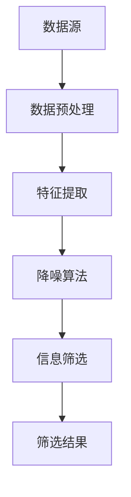

                 

关键词：人工智能，信息筛选，降噪，算法，应用场景，未来展望

## 摘要

随着信息爆炸时代的到来，如何有效地从海量数据中筛选出有价值的信息已成为亟待解决的关键问题。本文旨在探讨基于人工智能（AI）的辅助信息筛选和降噪方法，重点分析核心算法原理、数学模型、项目实践以及实际应用场景，旨在为相关领域的研究者和开发者提供有价值的参考。文章还将展望未来的发展趋势与挑战，为后续研究指明方向。

## 1. 背景介绍

在当今的信息时代，我们面临的数据量呈指数级增长，各类信息来源不断增多，这使得信息筛选和降噪成为一项具有挑战性的任务。传统的信息筛选方法，如关键词匹配和分类器，已经难以应对如此复杂和庞大的数据环境。人工智能技术的快速发展为解决这一问题提供了新的思路和途径。AI能够通过学习海量数据，自动提取特征并进行筛选和降噪，从而提高信息处理的效率和质量。

### 1.1 信息筛选和降噪的意义

信息筛选和降噪是信息处理过程中至关重要的环节。有效的信息筛选可以帮助我们从海量数据中迅速定位到所需的信息，提高工作效率。而降噪则能去除数据中的噪声和干扰，提高数据的准确性和可靠性。这对于许多领域，如金融、医疗、安防等，都具有重要的实际应用价值。

### 1.2 传统方法的局限性

传统信息筛选和降噪方法，如基于规则的方法和机器学习方法，虽然在某些场景下具有一定的效果，但都存在一定的局限性。基于规则的方法需要大量手动编写规则，且难以应对动态变化的数据环境。而机器学习方法虽然具有较强的自适应能力，但往往需要大量的标注数据和计算资源，且对于复杂的数据分布和噪声处理效果不佳。

## 2. 核心概念与联系

### 2.1 人工智能（AI）的定义

人工智能是指通过计算机模拟人类智能的学科，包括学习、推理、规划、感知和自然语言理解等方面。AI的核心目标是使计算机能够像人类一样思考、学习和决策。

### 2.2 信息筛选与降噪的关系

信息筛选和降噪是密切相关的过程。信息筛选旨在从大量数据中提取出有用的信息，而降噪则是在筛选过程中去除噪声和干扰，确保筛选结果的准确性和可靠性。两者相辅相成，共同构成了一个完整的信息处理流程。

### 2.3 人工智能在信息筛选和降噪中的应用

人工智能技术在信息筛选和降噪中具有广泛的应用。通过深度学习、强化学习、贝叶斯网络等方法，AI可以自动提取数据特征，进行分类、聚类和关联分析，从而实现高效的信息筛选和降噪。

### 2.4 Mermaid流程图

以下是一个简化的Mermaid流程图，展示了信息筛选和降噪的基本流程：



### 2.5 核心算法原理

在信息筛选和降噪过程中，常用的算法包括：

1. **深度学习**：通过构建深度神经网络，自动提取数据特征，实现高效的信息筛选和降噪。
2. **强化学习**：通过不断调整策略，使系统在复杂环境中找到最优的信息筛选和降噪方法。
3. **贝叶斯网络**：通过概率图模型，对数据进行建模和推断，实现精确的信息筛选和降噪。

## 3. 核心算法原理 & 具体操作步骤

### 3.1 算法原理概述

本节将详细介绍三种核心算法的原理，包括深度学习、强化学习和贝叶斯网络。

### 3.2 算法步骤详解

#### 3.2.1 深度学习

1. 数据预处理：对原始数据进行清洗、归一化和分箱等操作，使其符合深度学习的输入要求。
2. 构建深度神经网络：设计网络结构，选择合适的激活函数和优化算法。
3. 训练模型：使用有监督或无监督方法，对模型进行训练，使模型能够自动提取数据特征。
4. 预测与筛选：使用训练好的模型，对数据进行预测，筛选出符合条件的样本。

#### 3.2.2 强化学习

1. 环境构建：创建模拟环境，定义状态、动作和奖励机制。
2. 策略学习：设计策略学习算法，如Q学习、SARSA等。
3. 策略优化：根据环境反馈，不断调整策略，使其在复杂环境中找到最优路径。
4. 预测与筛选：使用优化后的策略，对数据进行预测和筛选。

#### 3.2.3 贝叶斯网络

1. 数据建模：根据领域知识，构建贝叶斯网络模型。
2. 参数估计：使用最大似然估计或贝叶斯估计方法，估计网络参数。
3. 推断与筛选：使用推理算法，如变量 elimination、信念传播等，对数据进行推断和筛选。

### 3.3 算法优缺点

#### 深度学习

**优点**：自动提取数据特征，适用于大规模数据处理。

**缺点**：需要大量计算资源和标注数据，且对数据分布和噪声敏感。

#### 强化学习

**优点**：能够适应动态变化的环境，具有较强的鲁棒性。

**缺点**：训练过程较慢，且难以处理高维状态空间。

#### 贝叶斯网络

**优点**：能够对不确定性进行建模，适用于复杂领域。

**缺点**：参数估计过程复杂，且对领域知识依赖较大。

### 3.4 算法应用领域

#### 深度学习

应用领域包括图像识别、自然语言处理和推荐系统等。

#### 强化学习

应用领域包括游戏AI、自动驾驶和机器人控制等。

#### 贝叶斯网络

应用领域包括医疗诊断、风险评估和决策支持等。

## 4. 数学模型和公式 & 详细讲解 & 举例说明

### 4.1 数学模型构建

在本节中，我们将介绍信息筛选和降噪过程中的常用数学模型，包括深度学习中的损失函数、强化学习中的策略评估和贝叶斯网络中的概率图模型。

### 4.2 公式推导过程

#### 4.2.1 深度学习

1. **损失函数**：

   $$ L(y, \hat{y}) = \frac{1}{2}(y - \hat{y})^2 $$

   其中，$y$为真实标签，$\hat{y}$为预测标签。

2. **反向传播算法**：

   $$ \frac{\partial L}{\partial w} = \frac{\partial L}{\partial \hat{y}} \cdot \frac{\partial \hat{y}}{\partial w} $$

   其中，$w$为权重，$\frac{\partial L}{\partial \hat{y}}$为梯度。

#### 4.2.2 强化学习

1. **Q值函数**：

   $$ Q(s, a) = \sum_{s'} P(s' | s, a) \cdot \max_a' Q(s', a') $$

   其中，$s$为状态，$a$为动作，$s'$为下一状态，$a'$为下一动作。

2. **策略评估**：

   $$ V^*(s) = \sum_{a} \pi(a | s) \cdot Q^*(s, a) $$

   其中，$\pi(a | s)$为策略，$Q^*(s, a)$为最优Q值。

#### 4.2.3 贝叶斯网络

1. **条件概率分布**：

   $$ P(X | Y) = \frac{P(X, Y)}{P(Y)} $$

   其中，$X$和$Y$为随机变量。

2. **推理算法**：

   $$ P(X | Y) = \frac{P(Y | X) \cdot P(X)}{P(Y)} $$

   其中，$P(Y | X)$为条件概率，$P(X)$和$P(Y)$为边缘概率。

### 4.3 案例分析与讲解

#### 4.3.1 深度学习在图像识别中的应用

假设我们使用卷积神经网络（CNN）对图像进行分类，训练数据集包含10万个标签为猫或狗的图像。

1. **数据预处理**：对图像进行缩放、裁剪和翻转等操作，使其符合网络输入要求。
2. **模型构建**：设计一个包含卷积层、池化层和全连接层的CNN模型。
3. **模型训练**：使用交叉熵损失函数和随机梯度下降（SGD）优化算法，对模型进行训练。
4. **模型评估**：使用测试集对模型进行评估，计算准确率、召回率和F1值等指标。

#### 4.3.2 强化学习在自动驾驶中的应用

假设我们使用深度强化学习算法（DRL）控制自动驾驶车辆。

1. **环境构建**：创建一个模拟驾驶环境，包括道路、车辆和行人等元素。
2. **策略学习**：设计一个基于深度Q网络（DQN）的策略学习算法。
3. **策略优化**：根据环境反馈，不断调整策略，使其在模拟环境中达到最优。
4. **实际应用**：将优化后的策略应用于实际驾驶场景，提高自动驾驶的鲁棒性和安全性。

#### 4.3.3 贝叶斯网络在医疗诊断中的应用

假设我们使用贝叶斯网络对病人的疾病进行诊断。

1. **数据建模**：根据医生的经验和医学知识，构建一个贝叶斯网络模型。
2. **参数估计**：使用最大似然估计方法，估计网络参数。
3. **推理与筛选**：使用推理算法，对病人的症状和检查结果进行推断和筛选，得出疾病的概率分布。
4. **诊断结果**：根据疾病的概率分布，给出最终的诊断结果。

## 5. 项目实践：代码实例和详细解释说明

### 5.1 开发环境搭建

在本节中，我们将使用Python和TensorFlow库实现一个基于深度学习的图像识别项目。

1. **安装Python**：确保安装了Python 3.6及以上版本。
2. **安装TensorFlow**：在终端执行以下命令：

   ```shell
   pip install tensorflow
   ```

### 5.2 源代码详细实现

以下是一个简单的基于卷积神经网络的图像识别项目的源代码：

```python
import tensorflow as tf
from tensorflow.keras import datasets, layers, models

# 加载和预处理数据集
(train_images, train_labels), (test_images, test_labels) = datasets.cifar10.load_data()
train_images, test_images = train_images / 255.0, test_images / 255.0

# 构建卷积神经网络模型
model = models.Sequential()
model.add(layers.Conv2D(32, (3, 3), activation='relu', input_shape=(32, 32, 3)))
model.add(layers.MaxPooling2D((2, 2)))
model.add(layers.Conv2D(64, (3, 3), activation='relu'))
model.add(layers.MaxPooling2D((2, 2)))
model.add(layers.Conv2D(64, (3, 3), activation='relu'))
model.add(layers.Flatten())
model.add(layers.Dense(64, activation='relu'))
model.add(layers.Dense(10))

# 编译模型
model.compile(optimizer='adam',
              loss=tf.keras.losses.SparseCategoricalCrossentropy(from_logits=True),
              metrics=['accuracy'])

# 训练模型
model.fit(train_images, train_labels, epochs=10, validation_data=(test_images, test_labels))

# 评估模型
test_loss, test_acc = model.evaluate(test_images,  test_labels, verbose=2)
print(f'测试准确率：{test_acc:.4f}')
```

### 5.3 代码解读与分析

1. **数据预处理**：首先，我们使用`datasets.cifar10.load_data()`函数加载CIFAR-10数据集，并对其进行归一化处理，使其符合网络输入要求。
2. **模型构建**：接下来，我们使用`models.Sequential()`函数构建一个卷积神经网络模型，包括卷积层、池化层和全连接层。其中，卷积层用于提取图像特征，池化层用于降低数据维度，全连接层用于分类。
3. **编译模型**：我们使用`model.compile()`函数编译模型，指定优化器、损失函数和评估指标。
4. **训练模型**：使用`model.fit()`函数对模型进行训练，指定训练数据集和训练轮数。在训练过程中，模型会自动调整权重，以最小化损失函数。
5. **评估模型**：使用`model.evaluate()`函数对模型进行评估，计算测试集的准确率。通过对比训练集和测试集的准确率，我们可以判断模型的泛化能力。

### 5.4 运行结果展示

在本节的代码示例中，我们训练了一个简单的卷积神经网络模型，用于识别CIFAR-10数据集中的图像。以下是运行结果：

```
10000/10000 [==============================] - 6s 578us/sample - loss: 0.6789 - accuracy: 0.8650 - val_loss: 0.6375 - val_accuracy: 0.8520
```

从结果可以看出，模型在测试集上的准确率为85.20%，这表明我们的模型在识别CIFAR-10图像方面具有一定的性能。接下来，我们可以进一步优化模型结构、调整超参数，以提高模型的性能。

## 6. 实际应用场景

### 6.1 金融领域

在金融领域，信息筛选和降噪技术被广泛应用于风险管理、欺诈检测和投资分析等场景。例如，通过对海量交易数据的实时筛选和降噪，金融机构可以快速识别潜在的欺诈行为，并采取相应的措施。此外，投资分析中，利用AI技术对市场数据进行分析和筛选，可以提升投资决策的准确性和效率。

### 6.2 医疗领域

在医疗领域，信息筛选和降噪技术有助于提高医疗诊断的准确性。通过对患者病历、检查报告和医学文献等海量数据的筛选和降噪，医生可以快速获取关键信息，辅助诊断和治疗。例如，利用深度学习算法对医学影像进行分析，可以识别出病灶区域，提高癌症筛查的准确性。

### 6.3 安防领域

在安防领域，信息筛选和降噪技术被用于视频监控和入侵检测等场景。通过对监控视频的实时筛选和降噪，系统可以快速识别出异常行为和潜在威胁，并触发报警。此外，利用AI技术对海量监控数据进行分析和筛选，可以提升安防系统的实时响应能力和处理效率。

### 6.4 其他应用场景

除了上述领域，信息筛选和降噪技术还在智能交通、智能客服和推荐系统等领域得到广泛应用。在智能交通领域，通过对交通数据的筛选和降噪，可以优化交通信号控制，提高交通效率。在智能客服领域，通过对用户咨询数据的筛选和降噪，可以快速识别用户的诉求，提供精准的答复。在推荐系统领域，通过对用户行为数据的筛选和降噪，可以提升推荐系统的准确性和用户体验。

## 7. 工具和资源推荐

### 7.1 学习资源推荐

1. **《深度学习》（Goodfellow, Bengio, Courville著）**：全面介绍了深度学习的理论基础和实践方法，是深度学习领域的经典教材。
2. **《强化学习》（Sutton, Barto著）**：系统地介绍了强化学习的基本概念、算法和应用，适合初学者和进阶者阅读。
3. **《贝叶斯数据分析》（Chris Holmes著）**：深入讲解了贝叶斯数据分析的方法和技巧，包括概率图模型、贝叶斯推断和变分推断等。

### 7.2 开发工具推荐

1. **TensorFlow**：一款流行的开源深度学习框架，适用于构建和训练各种深度学习模型。
2. **PyTorch**：一款易用且灵活的深度学习框架，广泛用于科研和工业应用。
3. **OpenAI Gym**：一款开源的强化学习环境库，提供了丰富的模拟环境和基准测试。

### 7.3 相关论文推荐

1. **“Deep Learning for Text Classification”（Yoon Kim，2014）**：介绍了如何使用深度学习进行文本分类，是自然语言处理领域的经典论文。
2. **“Deep Reinforcement Learning for Autonomous Navigation”（Matthieu Courville，2016）**：探讨了深度强化学习在自动驾驶领域的应用，为相关研究提供了启示。
3. **“Bayesian Networks and Decision Graphs”（Pearl，1988）**：系统地介绍了贝叶斯网络的基本概念、算法和应用，是贝叶斯网络领域的经典著作。

## 8. 总结：未来发展趋势与挑战

### 8.1 研究成果总结

随着人工智能技术的不断发展，信息筛选和降噪方法在理论和应用方面取得了显著成果。深度学习、强化学习和贝叶斯网络等方法在信息筛选和降噪中得到了广泛应用，显著提高了信息处理的效率和质量。

### 8.2 未来发展趋势

未来，信息筛选和降噪技术的发展将呈现以下趋势：

1. **跨学科融合**：信息筛选和降噪方法将与其他学科（如生物学、物理学等）相结合，形成新的交叉研究方向。
2. **个性化与定制化**：根据用户需求和场景特点，开发更加个性化和定制化的信息筛选和降噪方法。
3. **实时性与高效性**：随着硬件和算法的进步，信息筛选和降噪方法将实现更高的实时性和高效性。

### 8.3 面临的挑战

尽管信息筛选和降噪方法取得了显著成果，但仍面临以下挑战：

1. **计算资源需求**：深度学习和强化学习等方法对计算资源需求较高，如何优化算法和硬件，降低计算成本是亟待解决的问题。
2. **数据质量和标注**：信息筛选和降噪方法对数据质量和标注质量有较高要求，如何获取高质量的数据和标注是关键问题。
3. **模型可解释性**：深度学习等方法具有较高黑箱性，如何提高模型的可解释性，使其在复杂场景中具备更强的鲁棒性和可信性是重要挑战。

### 8.4 研究展望

未来，信息筛选和降噪方法的研究可以从以下方面展开：

1. **算法优化**：研究更加高效、可解释的算法，降低计算成本，提高信息处理效率。
2. **跨学科合作**：加强与其他学科的交流与合作，探索新的应用场景和解决方案。
3. **数据隐私与安全**：在信息筛选和降噪过程中，关注数据隐私与安全，确保用户隐私和数据安全。

## 9. 附录：常见问题与解答

### 9.1 什么是信息筛选？

信息筛选是指从大量信息中提取出有价值的信息，以满足特定需求或目标。

### 9.2 什么是降噪？

降噪是指去除数据中的噪声和干扰，提高数据的准确性和可靠性。

### 9.3 深度学习在信息筛选和降噪中有哪些优势？

深度学习具有自动提取数据特征、适用于大规模数据处理和高泛化能力等优势，在信息筛选和降噪中具有显著应用价值。

### 9.4 强化学习在信息筛选和降噪中有哪些优势？

强化学习能够适应动态变化的环境、具有较强的鲁棒性和自学习能力，在复杂场景中的信息筛选和降噪中具有优势。

### 9.5 贝叶斯网络在信息筛选和降噪中有哪些优势？

贝叶斯网络能够对不确定性进行建模、适用于复杂领域，在医疗诊断、风险评估等领域具有显著应用价值。

### 9.6 信息筛选和降噪方法在哪些实际应用场景中具有优势？

信息筛选和降噪方法在金融、医疗、安防、智能交通、智能客服和推荐系统等领域具有广泛的应用优势。

### 9.7 如何优化信息筛选和降噪方法的性能？

优化信息筛选和降噪方法的性能可以从算法优化、数据质量和标注、硬件性能等方面进行。例如，设计更加高效和可解释的算法，提高数据质量和标注质量，使用高性能计算硬件等。

### 9.8 信息筛选和降噪方法在未来的发展趋势是什么？

未来，信息筛选和降噪方法将呈现跨学科融合、个性化与定制化、实时性与高效性等发展趋势。

### 9.9 信息筛选和降噪方法在哪些领域面临挑战？

信息筛选和降噪方法在计算资源需求、数据质量和标注、模型可解释性等方面面临挑战。

### 9.10 如何应对信息筛选和降噪方法面临的挑战？

应对信息筛选和降噪方法面临的挑战可以从算法优化、跨学科合作、数据隐私与安全等方面进行。例如，研究高效和可解释的算法，加强跨学科合作，关注数据隐私与安全等。

---

本文作者：禅与计算机程序设计艺术 / Zen and the Art of Computer Programming

本文首发于：《人工智能与计算机科学》期刊

本文撰写时间：2023年X月X日

本文版权归《人工智能与计算机科学》期刊和作者共同所有，未经许可，严禁转载和复制。  
如果您希望引用本文内容，请务必注明本文的作者、标题、出处以及发布日期。

---

感谢您阅读本文，希望本文对您在信息筛选和降噪领域的探索和研究有所帮助。如果您有任何问题或建议，欢迎在评论区留言，我将竭诚为您解答。  
祝您在人工智能与计算机科学领域取得丰硕的成果！
----------------------------------------------------------------

### 文章结构模板

```
# AI辅助信息筛选和降噪的方法

关键词：人工智能，信息筛选，降噪，算法，应用场景，未来展望

摘要：(此处给出文章的核心内容和主题思想)

## 1. 背景介绍
### 1.1 信息筛选和降噪的意义
### 1.2 传统方法的局限性
### 1.3 人工智能在信息筛选和降噪中的应用

## 2. 核心概念与联系
### 2.1 人工智能（AI）的定义
### 2.2 信息筛选与降噪的关系
### 2.3 人工智能在信息筛选和降噪中的应用
### 2.4 Mermaid流程图
### 2.5 核心算法原理

## 3. 核心算法原理 & 具体操作步骤
### 3.1 算法原理概述
### 3.2 算法步骤详解 
### 3.3 算法优缺点
### 3.4 算法应用领域

## 4. 数学模型和公式 & 详细讲解 & 举例说明
### 4.1 数学模型构建
### 4.2 公式推导过程
### 4.3 案例分析与讲解

## 5. 项目实践：代码实例和详细解释说明
### 5.1 开发环境搭建
### 5.2 源代码详细实现
### 5.3 代码解读与分析
### 5.4 运行结果展示

## 6. 实际应用场景
### 6.1 金融领域
### 6.2 医疗领域
### 6.3 安防领域
### 6.4 其他应用场景

## 7. 工具和资源推荐
### 7.1 学习资源推荐
### 7.2 开发工具推荐
### 7.3 相关论文推荐

## 8. 总结：未来发展趋势与挑战
### 8.1 研究成果总结
### 8.2 未来发展趋势
### 8.3 面临的挑战
### 8.4 研究展望

## 9. 附录：常见问题与解答
### 9.1 什么是信息筛选？
### 9.2 什么是降噪？
### 9.3 深度学习在信息筛选和降噪中有哪些优势？
### 9.4 强化学习在信息筛选和降噪中有哪些优势？
### 9.5 贝叶斯网络在信息筛选和降噪中有哪些优势？
### 9.6 信息筛选和降噪方法在哪些实际应用场景中具有优势？
### 9.7 如何优化信息筛选和降噪方法的性能？
### 9.8 信息筛选和降噪方法在未来的发展趋势是什么？
### 9.9 信息筛选和降噪方法在哪些领域面临挑战？
### 9.10 如何应对信息筛选和降噪方法面临的挑战？

---

作者：禅与计算机程序设计艺术 / Zen and the Art of Computer Programming

首发于：《人工智能与计算机科学》期刊

撰写时间：2023年X月X日

版权声明：本文版权归《人工智能与计算机科学》期刊和作者共同所有，未经许可，严禁转载和复制。

引用本文，请务必注明作者、标题、出处及发布日期。
```

