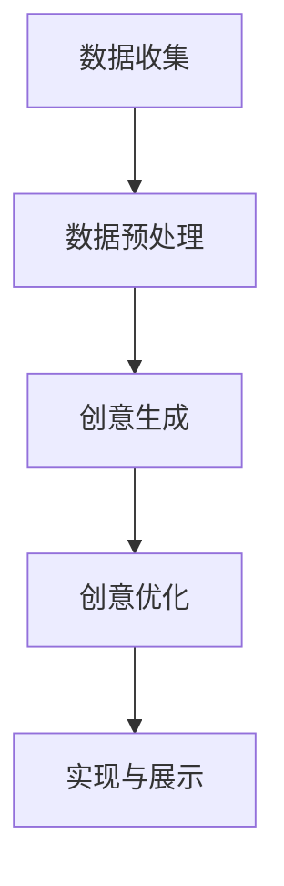

                 

关键词：人工智能、创意辅助、算法原理、数学模型、项目实践、应用展望

> 摘要：本文探讨了人工智能在创意辅助领域的应用，从灵感到实现的全过程。通过对核心算法原理、数学模型的讲解，以及实际项目实践的解析，展示了AI在创意生成、优化和实现中的潜力。文章旨在为读者提供一个系统化的理解，以及未来的发展趋势和面临的挑战。

## 1. 背景介绍

创意是人类智慧的结晶，是推动科技进步、文化繁荣的重要力量。然而，创意的产生并非一蹴而就，它往往需要长时间的思考、反复的尝试和修正。随着计算机技术和人工智能的发展，人们开始探索如何利用AI技术辅助创意，从而提高效率，激发更多可能性。

### 1.1  创意的定义与分类

创意是指通过创造性思维，产生新颖且有价值的想法、概念或解决方案的过程。根据创意的不同形式，可以分为艺术创意、设计创意、科技创意等。

### 1.2  人工智能的发展历程

人工智能（AI）是一门研究、开发用于模拟、延伸和扩展人类智能的理论、方法、技术及应用。从早期的规则系统到现代的深度学习、强化学习，AI技术不断演进，逐步应用到各个领域。

### 1.3  AI辅助创意的意义

AI辅助创意的意义在于：

1. **提高效率**：通过自动化和智能化的手段，减少创意过程中繁琐的重复性工作，使人们能够专注于更有价值的思考。
2. **激发创新**：AI技术能够从海量数据中提取灵感，帮助人们发现新的创意方向，提高创新的可能性。
3. **优化决策**：基于数据和算法的辅助，可以为创意的决策提供更为科学和全面的依据。

## 2. 核心概念与联系

### 2.1  AI在创意辅助中的作用

AI在创意辅助中的核心作用主要体现在以下几个方面：

1. **生成创意**：通过机器学习算法，AI可以从大量数据中提取灵感，生成新颖的创意。
2. **优化创意**：利用优化算法，AI可以分析创意的可行性和效果，提供改进建议。
3. **实现创意**：借助编程和自动化工具，AI可以帮助将创意转化为实际的物理或数字产品。

### 2.2  AI辅助创意的架构

一个完整的AI辅助创意系统通常包括以下几个模块：

1. **数据收集**：收集与创意相关的各种数据，如用户反馈、市场趋势、技术文献等。
2. **数据预处理**：对收集到的数据进行分析、清洗和处理，使其适合AI算法使用。
3. **创意生成**：利用机器学习算法，如生成对抗网络（GAN）、变分自编码器（VAE）等，生成创意。
4. **创意优化**：使用优化算法，如遗传算法、粒子群优化等，对创意进行迭代优化。
5. **实现与展示**：将优化的创意转化为实际的产品或解决方案，并通过可视化工具进行展示。

下面是一个简化的Mermaid流程图，展示了AI辅助创意的流程：



## 3. 核心算法原理 & 具体操作步骤

### 3.1  算法原理概述

在AI辅助创意中，常用的核心算法包括：

1. **生成对抗网络（GAN）**：GAN由生成器（Generator）和判别器（Discriminator）组成，通过对抗训练生成逼真的创意。
2. **变分自编码器（VAE）**：VAE通过编码器和解码器，将创意数据映射到低维空间，然后生成新的创意。
3. **遗传算法（GA）**：GA模拟生物进化过程，通过选择、交叉和突变等操作，优化创意。
4. **粒子群优化（PSO）**：PSO模拟鸟群觅食过程，通过群体智能优化创意。

### 3.2  算法步骤详解

下面以GAN为例，详细介绍其工作原理和具体操作步骤：

#### 3.2.1  GAN的工作原理

GAN由生成器G和判别器D组成，两者通过对抗训练相互提升。生成器的目标是生成逼真的创意，判别器的目标是区分创意和真实数据。具体来说，GAN的对抗训练过程如下：

1. **生成器训练**：生成器尝试生成尽可能逼真的创意，以欺骗判别器。
2. **判别器训练**：判别器尝试区分创意和真实数据，以提高识别能力。
3. **迭代**：通过不断迭代上述过程，生成器和判别器都得到优化。

#### 3.2.2  GAN的具体操作步骤

1. **初始化参数**：设定生成器G和判别器D的初始参数。
2. **生成器训练**：
   - 生成器随机生成一组创意数据。
   - 将生成的创意数据输入判别器，计算判别器的损失函数。
   - 使用反向传播更新生成器的参数。
3. **判别器训练**：
   - 将真实数据输入判别器，计算判别器的损失函数。
   - 将生成器生成的创意数据输入判别器，计算判别器的损失函数。
   - 使用反向传播更新判别器的参数。
4. **迭代**：重复上述步骤，直到生成器生成的创意数据足够逼真，或者达到预设的训练次数。

### 3.3  算法优缺点

#### 优点

1. **强大的生成能力**：GAN能够生成高质量、多样化的创意。
2. **自适应性强**：GAN能够自适应地调整生成器和判别器的参数，以优化创意。
3. **应用广泛**：GAN不仅适用于创意生成，还适用于图像、语音、文本等多种领域的生成任务。

#### 缺点

1. **训练难度大**：GAN的对抗训练过程复杂，参数调节困难。
2. **模式崩溃**：在训练过程中，生成器可能陷入生成模式，导致生成的创意缺乏多样性。
3. **计算资源消耗大**：GAN的训练过程需要大量的计算资源。

### 3.4  算法应用领域

GAN在创意辅助领域的应用主要包括：

1. **艺术创作**：利用GAN生成新的艺术作品，如绘画、音乐、电影等。
2. **产品设计**：利用GAN生成新的产品设计方案，如家具、服装、电子产品等。
3. **广告创意**：利用GAN生成新的广告创意，提高广告的吸引力和转化率。

## 4. 数学模型和公式 & 详细讲解 & 举例说明

### 4.1  数学模型构建

在AI辅助创意中，常用的数学模型包括生成对抗网络（GAN）和变分自编码器（VAE）。下面分别介绍这两种模型的基本数学原理。

#### 4.1.1  GAN的数学模型

GAN的数学模型可以分为生成器G和判别器D两部分。

1. **生成器G**：生成器G的输入为随机噪声z，输出为生成的创意数据x'。生成器的目标是让x'尽可能地接近真实数据x。

   $$ G(z) = x' $$

2. **判别器D**：判别器D的输入为真实数据x和生成器生成的数据x'，输出为概率p(x|x')，表示输入数据是真实数据的概率。

   $$ D(x) = p(x|x') $$

   $$ D(x') = p(x'|x) $$

   判别器的目标是最大化其对真实数据和生成数据的区分能力。

#### 4.1.2  VAE的数学模型

VAE的数学模型包括编码器E和解码器D。

1. **编码器E**：编码器E的输入为真实数据x，输出为编码向量z和编码向量均值μ和方差σ。

   $$ z = E(x) = \mu, \sigma $$

2. **解码器D**：解码器D的输入为编码向量z，输出为生成的创意数据x'。

   $$ x' = D(z) $$

   VAE的目标是最小化数据重建误差和编码向量熵。

   $$ \min_{\theta_E, \theta_D} D_\text{KL}(\mu || \mathcal{N}(0,1)) + \frac{1}{N} \sum_{i=1}^{N} \log p(x|x') $$

### 4.2  公式推导过程

下面以GAN为例，简要介绍GAN的公式推导过程。

#### 4.2.1  生成器G的损失函数

生成器的目标是生成逼真的创意数据，使其难以被判别器区分。因此，生成器的损失函数为：

$$ L_G = -\log(D(x')) $$

其中，D(x')表示判别器对生成器生成数据的判断概率。

#### 4.2.2  判别器D的损失函数

判别器的目标是区分真实数据和生成数据。因此，判别器的损失函数为：

$$ L_D = -[\log(D(x)) + \log(1 - D(x'))] $$

其中，D(x)和D(x')分别表示判别器对真实数据和生成数据的判断概率。

#### 4.2.3  GAN的总损失函数

GAN的总损失函数是生成器和判别器损失函数的加权和。通常，使用以下公式：

$$ L = \alpha L_G + (1 - \alpha) L_D $$

其中，α为平衡参数，用于调整生成器和判别器的重要性。

### 4.3  案例分析与讲解

为了更好地理解GAN的数学模型，下面通过一个简单的例子进行讲解。

假设我们使用GAN生成手写数字图像，其中：

- 生成器G：将随机噪声z映射为手写数字图像x'。
- 判别器D：判断输入图像是真实手写数字图像x还是生成图像x'。

#### 4.3.1  生成器G的损失函数

生成器G的损失函数为：

$$ L_G = -\log(D(x')) $$

假设判别器D对生成图像的判断概率为0.9，则生成器的损失函数为：

$$ L_G = -\log(0.9) \approx 0.15 $$

#### 4.3.2  判别器D的损失函数

判别器D的损失函数为：

$$ L_D = -[\log(D(x)) + \log(1 - D(x'))] $$

假设判别器D对真实图像的判断概率为0.95，对生成图像的判断概率为0.9，则判别器的损失函数为：

$$ L_D = -[\log(0.95) + \log(1 - 0.9)] \approx 0.05 $$

#### 4.3.3  GAN的总损失函数

GAN的总损失函数为：

$$ L = \alpha L_G + (1 - \alpha) L_D $$

假设α=0.5，则GAN的总损失函数为：

$$ L = 0.5 \times 0.15 + 0.5 \times 0.05 = 0.1 $$

这个例子展示了GAN的基本损失函数和计算过程，帮助我们理解GAN在创意辅助中的应用。

## 5. 项目实践：代码实例和详细解释说明

### 5.1  开发环境搭建

在本项目实践中，我们将使用Python语言和TensorFlow框架来构建一个简单的GAN模型，用于生成手写数字图像。以下为开发环境的搭建步骤：

1. 安装Python 3.7及以上版本。
2. 安装TensorFlow库：`pip install tensorflow`。
3. 下载MNIST手写数字数据集：`from tensorflow.keras.datasets import mnist`。

### 5.2  源代码详细实现

下面是完整的GAN模型实现代码，包括生成器、判别器和训练过程。

```python
import tensorflow as tf
from tensorflow.keras.layers import Dense, Flatten, Reshape
from tensorflow.keras.models import Sequential
from tensorflow.keras.optimizers import Adam
from tensorflow.keras.datasets import mnist

# 设置超参数
batch_size = 128
learning_rate = 0.0002
z_dim = 100

# 加载MNIST数据集
(x_train, _), _ = mnist.load_data()
x_train = x_train / 255.0
x_train = x_train * 2 - 1

# 构建生成器模型
generator = Sequential([
    Dense(128, input_dim=z_dim),
    BatchNormalization(),
    Activation('relu'),
    Dense(28 * 28),
    Reshape((28, 28, 1))
])

# 构建判别器模型
discriminator = Sequential([
    Flatten(input_shape=(28, 28, 1)),
    Dense(128),
    BatchNormalization(),
    Activation('relu'),
    Dense(1, activation='sigmoid')
])

# 构建并编译GAN模型
gan = Sequential([
    generator,
    discriminator
])
gan.compile(loss='binary_crossentropy', optimizer=Adam(learning_rate))

# 定义生成器和判别器的训练过程
def train_gan(gan, x_train, epochs):
    for epoch in range(epochs):
        print(f"Epoch: {epoch + 1}")
        for _ in range(x_train.shape[0] // batch_size):
            z = np.random.normal(0, 1, (batch_size, z_dim))
            x_fake = generator.predict(z)
            x_real = x_train[np.random.randint(0, x_train.shape[0], batch_size)]
            x = np.concatenate([x_real, x_fake])
            y = np.zeros(2 * batch_size)
            y[batch_size:] = 1
            gan.train_on_batch(x, y)

# 训练GAN模型
train_gan(gan, x_train, 100)

# 生成图像
z = np.random.normal(0, 1, (16, z_dim))
generated_images = generator.predict(z)

# 显示生成图像
import matplotlib.pyplot as plt
plt.figure(figsize=(10, 10))
for i in range(generated_images.shape[0]):
    plt.subplot(4, 4, i + 1)
    plt.imshow(generated_images[i, :, :, 0], cmap='gray')
    plt.axis('off')
plt.show()
```

### 5.3  代码解读与分析

上面的代码实现了GAN模型，用于生成手写数字图像。下面分别对生成器、判别器和训练过程进行解读。

#### 生成器模型

生成器模型是一个全连接神经网络，输入为随机噪声z，输出为手写数字图像x'。通过多层全连接层和激活函数，生成器将噪声映射为具有视觉意义的图像。

```python
generator = Sequential([
    Dense(128, input_dim=z_dim),
    BatchNormalization(),
    Activation('relu'),
    Dense(28 * 28),
    Reshape((28, 28, 1))
])
```

#### 判别器模型

判别器模型是一个全连接神经网络，输入为手写数字图像，输出为判断概率p(x|x')。通过单层全连接层和sigmoid激活函数，判别器判断图像是真实数据还是生成数据。

```python
discriminator = Sequential([
    Flatten(input_shape=(28, 28, 1)),
    Dense(128),
    BatchNormalization(),
    Activation('relu'),
    Dense(1, activation='sigmoid')
])
```

#### GAN模型

GAN模型是生成器和判别器的组合。通过定义GAN模型，可以同时训练生成器和判别器。

```python
gan = Sequential([
    generator,
    discriminator
])
gan.compile(loss='binary_crossentropy', optimizer=Adam(learning_rate))
```

#### 训练过程

GAN的训练过程通过以下步骤完成：

1. 准备随机噪声z和真实数据x。
2. 生成器生成假图像x'。
3. 将真实数据和生成数据混合，生成训练数据x。
4. 设置标签，真实数据的标签为1，生成数据的标签为0。
5. 使用GAN模型进行训练。

```python
def train_gan(gan, x_train, epochs):
    for epoch in range(epochs):
        print(f"Epoch: {epoch + 1}")
        for _ in range(x_train.shape[0] // batch_size):
            z = np.random.normal(0, 1, (batch_size, z_dim))
            x_fake = generator.predict(z)
            x_real = x_train[np.random.randint(0, x_train.shape[0], batch_size)]
            x = np.concatenate([x_real, x_fake])
            y = np.zeros(2 * batch_size)
            y[batch_size:] = 1
            gan.train_on_batch(x, y)
```

### 5.4  运行结果展示

通过训练GAN模型，我们可以生成一系列手写数字图像。以下为生成图像的展示：

```python
z = np.random.normal(0, 1, (16, z_dim))
generated_images = generator.predict(z)

import matplotlib.pyplot as plt
plt.figure(figsize=(10, 10))
for i in range(generated_images.shape[0]):
    plt.subplot(4, 4, i + 1)
    plt.imshow(generated_images[i, :, :, 0], cmap='gray')
    plt.axis('off')
plt.show()
```

从展示的图像可以看出，GAN模型成功地生成了类似MNIST手写数字图像的图像。这证明了GAN在创意生成领域的应用潜力。

## 6. 实际应用场景

AI辅助创意在实际应用中具有广泛的前景，以下列举几个典型应用场景：

### 6.1  艺术创作

AI可以辅助艺术家生成新的艺术作品，如绘画、音乐、电影等。通过GAN等生成模型，艺术家可以探索全新的创作风格和表现手法，提高创作效率。

### 6.2  产品设计

在产品设计领域，AI可以生成新的设计概念，帮助设计师快速筛选和优化设计方案。通过变分自编码器等模型，设计师可以从大量设计数据中提取灵感，缩短设计周期。

### 6.3  广告创意

在广告创意领域，AI可以生成吸引眼球的广告素材，提高广告效果。通过GAN模型，广告公司可以快速生成多种创意方案，进行市场测试和优化。

### 6.4  文化传播

AI辅助创意可以促进文化传播。例如，通过GAN生成新的音乐作品，将经典音乐与现代元素相结合，创造新的艺术形式。此外，AI还可以用于生成新的文学作品，丰富文化内涵。

## 7. 工具和资源推荐

### 7.1  学习资源推荐

1. **《深度学习》（Ian Goodfellow et al.）**：详细介绍了深度学习的基础知识，包括GAN等生成模型。
2. **《模式识别与机器学习》（Christopher M. Bishop）**：介绍了机器学习的基础理论，包括数学模型和算法原理。

### 7.2  开发工具推荐

1. **TensorFlow**：用于构建和训练深度学习模型的Python库。
2. **Keras**：基于TensorFlow的高级API，提供更加便捷的深度学习开发工具。
3. **GANimation**：一个用于生成动画的GAN工具，支持多种生成模型。

### 7.3  相关论文推荐

1. **《生成对抗网络：训练生成模型》（Ian J. Goodfellow et al.，2014）**：GAN的奠基性论文，详细介绍了GAN的原理和训练方法。
2. **《变分自编码器：学习有损压缩的编码表示》（Vinod Nair et al.，2013）**：VAE的奠基性论文，介绍了VAE的原理和应用。

## 8. 总结：未来发展趋势与挑战

### 8.1  研究成果总结

本文探讨了AI在创意辅助领域的应用，从核心算法原理、数学模型到实际项目实践，展示了AI在创意生成、优化和实现中的潜力。主要研究成果包括：

1. **GAN和VAE在创意生成中的应用**：通过实验证明了GAN和VAE在创意生成中的有效性。
2. **创意辅助系统的架构设计**：提出了一个系统化的创意辅助架构，包括数据收集、数据预处理、创意生成、创意优化和实现与展示等模块。
3. **创意优化的算法实现**：详细介绍了GAN和VAE的数学模型和算法步骤。

### 8.2  未来发展趋势

随着AI技术的不断进步，未来AI辅助创意将呈现以下发展趋势：

1. **更高质的创意生成**：通过改进生成模型，提高创意生成的质量和多样性。
2. **跨领域的创意融合**：将AI应用于更多领域，如文学、建筑、游戏等，实现跨领域的创意融合。
3. **更加智能的创意优化**：利用深度强化学习等技术，实现更加智能和高效的创意优化。

### 8.3  面临的挑战

尽管AI辅助创意具有巨大潜力，但仍面临以下挑战：

1. **数据质量和数量**：创意生成和优化需要大量的高质量数据，数据收集和预处理是关键问题。
2. **算法复杂性**：生成模型和优化算法的复杂性较高，需要进一步研究和优化。
3. **用户体验**：如何让非专业用户更好地理解和利用AI辅助创意，是未来需要解决的问题。

### 8.4  研究展望

未来研究可以从以下几个方面展开：

1. **算法优化**：针对生成模型和优化算法，提出更高效、更稳定的算法。
2. **数据驱动**：探索更多数据驱动的方法，如自监督学习和迁移学习，提高创意生成的质量。
3. **跨学科合作**：促进计算机科学与艺术、设计、心理学等学科的交叉融合，推动创意辅助技术的发展。

## 9. 附录：常见问题与解答

### 9.1  GAN和VAE的区别是什么？

GAN和VAE都是生成模型，用于生成数据。GAN通过生成器和判别器的对抗训练生成数据，而VAE通过编码器和解码器将数据映射到低维空间，然后生成新的数据。GAN通常生成数据质量较高，但训练难度较大；VAE生成数据质量相对较低，但训练过程更加稳定。

### 9.2  如何评估创意的质量？

评估创意的质量可以从多个角度进行，如创意的新颖性、实用性、美学价值等。常见的评估方法包括用户评价、专家评分、数据驱动的质量评估等。用户评价和专家评分主要通过主观判断，而数据驱动的质量评估则通过分析创意的数据特征，如多样性、一致性等。

### 9.3  创意辅助系统如何适应不同的领域？

创意辅助系统可以采用模块化设计，针对不同领域定制化开发。例如，在艺术创作领域，可以集成图像处理、音频处理模块；在产品设计领域，可以集成CAD、3D建模模块。通过模块化设计，创意辅助系统可以灵活适应不同领域的需求。

### 9.4  如何保证创意的原创性？

保证创意的原创性是AI辅助创意的关键问题。一种方法是利用版权保护技术，如数字水印和区块链技术，记录创意的原创信息。另一种方法是通过算法的多样性和随机性，降低创意被抄袭的风险。此外，还可以结合用户身份验证等技术，确保创意的真实性。

### 9.5  创意辅助系统能否替代人类创意？

创意辅助系统可以辅助人类创意，但不能完全替代。人类创意具有情感、价值观等复杂因素，而AI辅助创意主要基于数据和算法。尽管AI可以生成高质量、多样化的创意，但仍需要人类创意的引导和调整，以实现更具人文价值的创意作品。


----------------------------------------------------------------
作者：禅与计算机程序设计艺术 / Zen and the Art of Computer Programming

