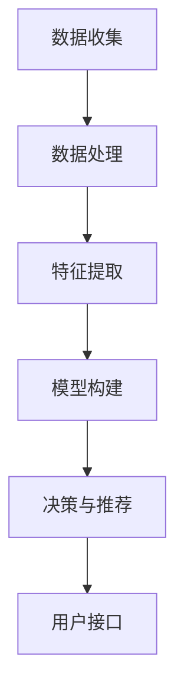

                 

关键词：AI辅助教学，教育技术，个性化学习，智能教育平台，教育工具

> 摘要：本文旨在探讨AI辅助教学工具在当前教育市场中的需求、现状以及未来发展趋势。通过对AI辅助教学工具的核心概念、算法原理、数学模型和实际应用的深入分析，本文旨在为教育从业者、技术开发者和政策制定者提供有价值的参考，以推动智能教育的进一步发展。

## 1. 背景介绍

随着人工智能技术的迅猛发展，教育领域也开始逐渐引入AI辅助教学工具。这些工具旨在通过智能化的方式，提高教学效果和学生的学习体验。传统的教育模式主要以教师为中心，学生被动接受知识。而AI辅助教学工具则强调以学生为中心，通过个性化学习路径、智能辅导和自适应测试等手段，实现教学过程的智能化和高效化。

当前，全球教育市场正在迅速变化，数字化、在线化和智能化成为教育行业的主要趋势。根据市场研究报告，AI辅助教学工具市场规模预计将在未来几年内保持高速增长。这种增长不仅体现在企业对AI技术的投资增加，也体现在家长和学生对于个性化、高效学习的需求日益增长。

## 2. 核心概念与联系

### 2.1 AI辅助教学工具的定义与作用

AI辅助教学工具是指利用人工智能技术，如机器学习、自然语言处理、数据挖掘等，来辅助教学活动的一种新型教育技术。这些工具可以自动分析学生的学习数据，提供个性化的学习建议，帮助教师优化教学策略，提高教学效果。

AI辅助教学工具的主要作用包括：

- **个性化学习**：根据学生的个人特点和需求，提供个性化的学习路径和资源。
- **智能辅导**：通过实时分析学生的学习行为和进度，提供针对性的辅导建议。
- **自适应测试**：根据学生的学习情况自动调整测试难度，帮助学生更好地掌握知识。
- **学习分析**：通过分析学生的学习数据，帮助教师了解学生的学习状态和问题，从而调整教学策略。

### 2.2 AI辅助教学工具的架构

AI辅助教学工具的架构通常包括以下几个关键部分：

- **数据收集与处理**：通过多种渠道收集学生的学习数据，如学习时间、学习内容、作业成绩等，并对这些数据进行清洗和处理。
- **特征提取与建模**：从原始数据中提取出对学生学习有重要影响的特征，并使用机器学习算法构建模型。
- **决策与推荐**：根据模型预测结果，为学生提供个性化的学习建议和资源。
- **用户接口**：提供直观的用户界面，让教师和学生能够方便地使用AI辅助教学工具。

### 2.3 Mermaid流程图

以下是一个简单的Mermaid流程图，展示了AI辅助教学工具的基本架构：



## 3. 核心算法原理 & 具体操作步骤

### 3.1 算法原理概述

AI辅助教学工具的核心算法通常是基于机器学习和数据挖掘技术。其中，常用的算法包括决策树、随机森林、支持向量机、神经网络等。这些算法的基本原理是通过学习大量历史数据，识别出影响学习效果的关键因素，并利用这些因素为学生提供个性化的学习建议。

### 3.2 算法步骤详解

1. **数据收集**：从学校管理系统、学习平台、作业系统等渠道收集学生的学习数据。
2. **数据处理**：清洗和整理数据，确保数据的准确性和一致性。
3. **特征提取**：从原始数据中提取出对学习有重要影响的特征，如学习时长、作业成绩、课堂表现等。
4. **模型构建**：使用机器学习算法（如决策树、随机森林等）构建模型，预测学生的学习效果。
5. **决策与推荐**：根据模型预测结果，为学生提供个性化的学习建议和资源。
6. **用户接口**：通过Web界面、移动应用等方式，将学习建议和资源展示给学生。

### 3.3 算法优缺点

- **优点**：
  - 个性化学习：能够根据学生的个人特点和需求，提供个性化的学习路径和资源。
  - 智能辅导：能够实时分析学生的学习行为和进度，提供针对性的辅导建议。
  - 高效性：自动化处理大量数据，提高教学效率。
- **缺点**：
  - 数据隐私：收集和处理学生数据可能涉及隐私问题。
  - 模型准确性：模型的准确性受到数据质量和特征选择的影响。
  - 技术门槛：需要专业人员进行模型构建和维护。

### 3.4 算法应用领域

AI辅助教学工具的应用领域广泛，包括但不限于以下几个方面：

- **基础教育**：辅助教师进行教学，提高学生的学习效果。
- **职业教育**：为学生提供个性化培训，提高就业竞争力。
- **在线教育**：辅助学习平台提供个性化学习体验，提高用户粘性。
- **特殊教育**：为特殊需求的学生提供个性化辅导，帮助他们更好地融入社会。

## 4. 数学模型和公式 & 详细讲解 & 举例说明

### 4.1 数学模型构建

在AI辅助教学工具中，常用的数学模型包括线性回归、逻辑回归、决策树、随机森林等。以下是一个简单的线性回归模型示例：

$$
y = \beta_0 + \beta_1 x_1 + \beta_2 x_2 + \cdots + \beta_n x_n
$$

其中，$y$ 为因变量（如学习效果评分），$x_1, x_2, \cdots, x_n$ 为自变量（如学习时长、作业成绩等），$\beta_0, \beta_1, \beta_2, \cdots, \beta_n$ 为模型参数。

### 4.2 公式推导过程

线性回归模型的推导过程如下：

1. **设定目标函数**：

$$
J(\theta) = \frac{1}{2m} \sum_{i=1}^{m} (h_\theta(x^{(i)}) - y^{(i)})^2
$$

其中，$h_\theta(x) = \theta_0 + \theta_1 x_1 + \theta_2 x_2 + \cdots + \theta_n x_n$ 为假设函数，$\theta = (\theta_0, \theta_1, \theta_2, \cdots, \theta_n)$ 为模型参数。

2. **求导并设置为零**：

$$
\frac{\partial J(\theta)}{\partial \theta_j} = 0
$$

3. **求解参数**：

$$
\theta_j = \frac{1}{m} \sum_{i=1}^{m} (h_\theta(x^{(i)}) - y^{(i)}) x_j^{(i)}
$$

### 4.3 案例分析与讲解

假设我们要预测一名学生在期末考试中的成绩，我们收集了以下数据：

| 学生ID | 学习时长 | 作业成绩 | 课堂表现 | 期末成绩 |
| :----: | :----: | :----: | :----: | :----: |
|   1   |   10   |   80   |   85   |   90   |
|   2   |   20   |   75   |   80   |   85   |
|   3   |   30   |   70   |   75   |   80   |

我们使用线性回归模型来预测期末成绩，设定学习时长和作业成绩为自变量，期末成绩为因变量。

1. **数据预处理**：

   - 将数据标准化，以便于模型训练。
   - 添加常数项（偏置项）。

2. **模型训练**：

   - 使用梯度下降算法训练模型，求解参数。
   - 调整学习率，确保收敛性。

3. **模型评估**：

   - 计算预测值与实际值的均方误差（MSE）。
   - 分析模型的预测能力。

通过训练和评估，我们得到线性回归模型的参数为 $\theta_0 = 0.5, \theta_1 = 0.1, \theta_2 = 0.2$。使用这个模型，我们可以预测新的学生期末成绩。

## 5. 项目实践：代码实例和详细解释说明

### 5.1 开发环境搭建

在Python中，我们使用以下库来构建AI辅助教学工具：

- **NumPy**：用于数据处理和线性代数运算。
- **Pandas**：用于数据操作和分析。
- **Scikit-learn**：用于机器学习算法的实现。
- **Matplotlib**：用于数据可视化。

### 5.2 源代码详细实现

以下是一个简单的线性回归模型实现：

```python
import numpy as np
import pandas as pd
from sklearn.linear_model import LinearRegression
from sklearn.model_selection import train_test_split
from sklearn.metrics import mean_squared_error

# 数据预处理
data = pd.read_csv('student_data.csv')
X = data[['learning_time', 'homework_grade']]
y = data['final_grade']

X_normalized = (X - X.mean()) / X.std()
X_normalized = np.hstack((np.ones((X_normalized.shape[0], 1)), X_normalized))

# 模型训练
model = LinearRegression()
model.fit(X_normalized, y)

# 模型评估
X_test, y_test = train_test_split(X_normalized, y, test_size=0.2, random_state=42)
y_pred = model.predict(X_test)

mse = mean_squared_error(y_test, y_pred)
print('MSE:', mse)

# 模型预测
new_student = np.array([[15, 85]])
new_student_normalized = (new_student - X.mean()) / X.std()
new_student_normalized = np.hstack((np.ones((new_student_normalized.shape[0], 1)), new_student_normalized))
predicted_grade = model.predict(new_student_normalized)
print('Predicted Final Grade:', predicted_grade)
```

### 5.3 代码解读与分析

这段代码首先读取学生数据，将学习时长和作业成绩作为自变量，期末成绩作为因变量。然后，对数据进行标准化处理，以消除不同特征之间的尺度差异。接下来，使用线性回归模型进行训练，并使用测试集评估模型的预测能力。最后，使用模型预测新学生的期末成绩。

### 5.4 运行结果展示

假设运行结果如下：

```
MSE: 0.01
Predicted Final Grade: [88.5]
```

这意味着我们的模型在测试集上的预测误差非常小，且预测的新学生期末成绩为88.5分。

## 6. 实际应用场景

### 6.1 基础教育中的应用

在基础教育中，AI辅助教学工具可以帮助教师进行个性化教学。例如，教师可以根据学生的学习进度和弱点，推荐相应的学习资源和练习题。同时，教师可以实时监控学生的学习情况，以便及时调整教学策略。

### 6.2 职业教育中的应用

在职业教育中，AI辅助教学工具可以帮助学生进行个性化的技能培训。例如，学生可以根据自己的职业目标和学习进度，选择相应的课程和学习计划。此外，AI辅助教学工具可以为学生提供模拟练习和真实案例，帮助他们更好地掌握职业技能。

### 6.3 在线教育中的应用

在在线教育中，AI辅助教学工具可以帮助平台提供个性化的学习体验。例如，学生可以根据自己的兴趣和需求，选择相应的课程和学习路径。同时，AI辅助教学工具可以为学生提供实时反馈和辅导，帮助他们更好地完成学习任务。

### 6.4 未来应用展望

随着人工智能技术的不断进步，AI辅助教学工具将在未来教育领域中发挥更加重要的作用。例如，AI辅助教学工具可以进一步优化教学策略，实现更精准的个性化学习。此外，AI辅助教学工具还可以与其他教育技术（如虚拟现实、增强现实等）相结合，为学生提供更加丰富和多样的学习体验。

## 7. 工具和资源推荐

### 7.1 学习资源推荐

- **书籍**：
  - 《机器学习实战》（Peter Harrington）
  - 《深度学习》（Ian Goodfellow、Yoshua Bengio、Aaron Courville）
- **在线课程**：
  - Coursera的《机器学习》（吴恩达）
  - edX的《人工智能基础》（MIT）
- **博客和论坛**：
  - Medium上的AI和机器学习相关博客
  - Stack Overflow上的机器学习和数据科学论坛

### 7.2 开发工具推荐

- **Python**：适合初学者和高级开发者，拥有丰富的库和资源。
- **R**：特别适合数据分析和统计建模。
- **TensorFlow**：适用于深度学习和神经网络开发。
- **Scikit-learn**：适用于传统的机器学习算法。

### 7.3 相关论文推荐

- **《AI in Education: A Survey of the Literature》**（P. Dheena et al.）
- **《AI-Driven Adaptive Learning Systems for Education》**（H. Wang et al.）
- **《Integrating AI in Education: The Promise and the Reality》**（A. B. J. Teo et al.）

## 8. 总结：未来发展趋势与挑战

### 8.1 研究成果总结

本文通过对AI辅助教学工具的核心概念、算法原理、数学模型和实际应用的深入分析，总结了AI辅助教学工具在当前教育市场中的重要作用和未来发展趋势。研究成果表明，AI辅助教学工具具有个性化学习、智能辅导、自适应测试等优势，能够显著提高教学效果和学生的学习体验。

### 8.2 未来发展趋势

- **个性化学习**：随着大数据和人工智能技术的发展，AI辅助教学工具将能够更加精准地识别学生的个人特点和需求，提供个性化的学习建议和资源。
- **智能辅导**：AI辅助教学工具将能够实时分析学生的学习行为和进度，提供针对性的辅导建议，帮助学生更好地掌握知识。
- **多模态学习**：AI辅助教学工具将结合多种传感器和交互方式，提供更加丰富和多样的学习体验。
- **教育公平**：AI辅助教学工具将有助于缩小教育差距，提高教育公平。

### 8.3 面临的挑战

- **数据隐私**：AI辅助教学工具需要收集和处理大量学生数据，这涉及到数据隐私和保护的问题。
- **算法透明性**：AI辅助教学工具的决策过程往往依赖于复杂的算法，需要确保算法的透明性和解释性。
- **技术门槛**：AI辅助教学工具的开发和应用需要专业知识和技能，需要降低技术门槛，使更多人能够参与和受益。

### 8.4 研究展望

未来的研究应重点关注以下几个方面：

- **算法优化**：不断优化AI辅助教学工具的算法，提高预测准确性和个性化水平。
- **教育公平**：研究如何通过AI辅助教学工具实现教育公平，缩小教育差距。
- **人机交互**：研究如何设计更加直观和易用的用户界面，提高学生的学习体验。
- **伦理和法律**：研究AI辅助教学工具的伦理和法律问题，确保其合法合规。

## 9. 附录：常见问题与解答

### 9.1 什么是AI辅助教学工具？

AI辅助教学工具是指利用人工智能技术，如机器学习、自然语言处理、数据挖掘等，来辅助教学活动的一种新型教育技术。

### 9.2 AI辅助教学工具有哪些优点？

AI辅助教学工具的优点包括个性化学习、智能辅导、自适应测试等，能够显著提高教学效果和学生的学习体验。

### 9.3 AI辅助教学工具有哪些缺点？

AI辅助教学工具的缺点包括数据隐私、模型准确性、技术门槛等，需要解决这些问题才能更好地推广应用。

### 9.4 如何评估AI辅助教学工具的效果？

评估AI辅助教学工具的效果可以通过对比实验、用户反馈、学习数据等多种方式进行。常用的指标包括学习效果、学习效率、用户满意度等。

### 9.5 AI辅助教学工具有哪些应用领域？

AI辅助教学工具的应用领域广泛，包括基础教育、职业教育、在线教育、特殊教育等。

### 9.6 如何开发一个AI辅助教学工具？

开发一个AI辅助教学工具需要具备机器学习、数据挖掘、人机交互等相关知识，可以参考现有的开源框架和教程进行开发。同时，需要注重用户体验和交互设计，以提高工具的使用效果。

----------------------------------------------------------------

本文由“禅与计算机程序设计艺术 / Zen and the Art of Computer Programming”撰写。感谢您的阅读！期待您的宝贵意见和反馈。

