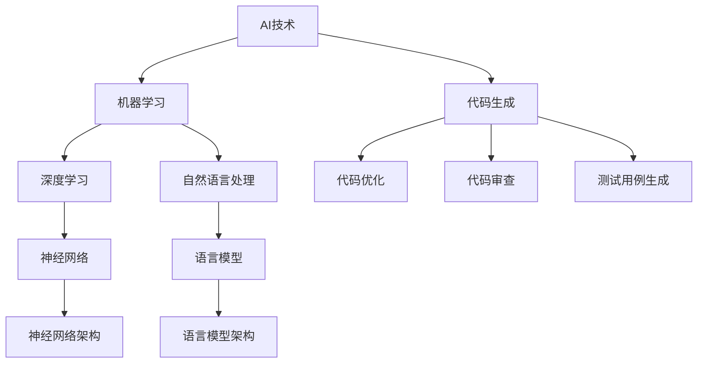

                 

 在这个数据驱动、技术日新月异的时代，软件开发已经成为企业和组织的关键能力。然而，传统的软件开发流程存在许多问题，如效率低下、成本高昂和难以维护等。为了解决这些问题，人工智能（AI）被引入到软件开发中，以实现辅助编程和重塑开发流程。本文将探讨AI在软件开发中的应用，及其对开发流程的深远影响。

> 关键词：人工智能、辅助编程、软件开发、开发流程、效率、成本

> 摘要：本文将首先介绍AI辅助编程的背景和核心概念，然后详细分析AI如何改变传统的软件开发流程，最后讨论未来的发展趋势和面临的挑战。

## 1. 背景介绍

软件开发是一个复杂的工程，涉及需求分析、设计、编码、测试和维护等多个环节。传统的软件开发流程往往依赖于人类的经验和直觉，这导致了一系列问题。例如：

- **效率问题**：传统开发流程中，人工介入的环节过多，导致开发效率低下。
- **成本问题**：人工操作的复杂性增加了开发成本，尤其是在项目规模较大时。
- **维护问题**：传统软件往往缺乏良好的文档和自动化测试，导致维护成本高且难度大。

为了解决这些问题，开发者们开始寻求新的方法和技术。人工智能作为一种新兴技术，其强大的数据分析和处理能力使其成为辅助编程的理想选择。AI可以通过学习大量数据和模式，自动完成一些传统的开发任务，从而提高效率、降低成本并提高软件质量。

### 1.1 AI辅助编程的概念

AI辅助编程是指利用人工智能技术辅助人类进行编程活动，其主要目标是提高开发效率、减少人为错误和提高软件质量。AI辅助编程主要包括以下几个方面：

- **代码自动生成**：利用机器学习模型分析已有的代码库，自动生成新的代码。
- **代码优化**：分析现有代码的执行效率，提出优化建议。
- **代码审查**：自动检测代码中的错误和潜在问题。
- **测试用例生成**：基于输入数据自动生成测试用例，以检测代码的正确性。

### 1.2 AI辅助编程的挑战

虽然AI辅助编程具有巨大的潜力，但其在实际应用中仍然面临一些挑战：

- **数据质量**：AI模型的性能很大程度上依赖于训练数据的质量和数量。
- **算法选择**：不同的AI算法适用于不同的编程任务，选择合适的算法是关键。
- **算法解释性**：AI辅助编程的决策过程通常是非线性和不可解释的，这对于需要透明性和可解释性的软件开发来说是一个挑战。
- **系统集成**：将AI辅助编程工具集成到现有的开发流程中，需要解决兼容性和接口问题。

## 2. 核心概念与联系

在深入探讨AI辅助编程之前，我们需要了解一些核心概念和其相互之间的关系。以下是一个使用Mermaid绘制的流程图，展示了这些概念之间的联系。



### 2.1 AI技术

AI技术是人工智能的简称，是指使计算机系统模拟人类智能行为的一系列技术和方法。AI技术主要包括机器学习、深度学习、自然语言处理等子领域。

### 2.2 机器学习

机器学习是AI的核心技术之一，它使计算机通过从数据中学习模式来进行预测和决策。机器学习可以分为监督学习、无监督学习和强化学习等类型。

### 2.3 深度学习

深度学习是机器学习的一个分支，其核心是神经网络。深度学习通过多层神经网络对大量数据进行分析和学习，能够实现高度复杂的任务，如图像识别和自然语言处理。

### 2.4 自然语言处理

自然语言处理（NLP）是AI的另一个重要领域，它关注于使计算机理解和生成人类语言。NLP在文本分析、语音识别和机器翻译等领域有广泛应用。

### 2.5 代码生成

代码生成是AI辅助编程的重要功能之一，它利用机器学习模型分析现有的代码库，自动生成新的代码。代码生成可以大大提高开发效率，特别是在重复性和模板化的代码编写任务中。

### 2.6 代码优化

代码优化是指通过分析代码的执行效率，提出优化建议，以减少代码的运行时间和内存占用。代码优化是提高软件性能的关键技术之一。

### 2.7 代码审查

代码审查是确保代码质量的重要环节，它通过自动检测代码中的错误和潜在问题，提高代码的可维护性和可靠性。

### 2.8 测试用例生成

测试用例生成是自动化测试的关键技术，它通过分析输入数据自动生成测试用例，以提高测试的全面性和效率。

## 3. 核心算法原理 & 具体操作步骤

### 3.1 算法原理概述

AI辅助编程的核心算法主要包括代码生成算法、代码优化算法、代码审查算法和测试用例生成算法。以下是这些算法的基本原理：

### 3.2 算法步骤详解

### 3.2.1 代码生成算法

1. 数据收集：收集大量的代码库，作为训练数据。
2. 特征提取：从代码库中提取特征，如函数定义、变量声明、代码注释等。
3. 模型训练：使用机器学习算法，如深度学习，训练代码生成模型。
4. 代码生成：使用训练好的模型，根据输入特征生成新的代码。

### 3.2.2 代码优化算法

1. 数据收集：收集大量代码及其性能数据。
2. 特征提取：提取代码的执行效率特征，如循环次数、函数调用次数等。
3. 模型训练：使用机器学习算法，如回归分析，训练代码优化模型。
4. 代码优化：使用训练好的模型，分析代码的执行效率，提出优化建议。

### 3.2.3 代码审查算法

1. 数据收集：收集大量的代码和其审查结果。
2. 特征提取：提取代码的质量特征，如代码复杂度、注释率等。
3. 模型训练：使用机器学习算法，如分类算法，训练代码审查模型。
4. 代码审查：使用训练好的模型，自动检测代码中的错误和潜在问题。

### 3.2.4 测试用例生成算法

1. 数据收集：收集大量测试用例及其执行结果。
2. 特征提取：提取测试用例的特征，如输入值、输出结果等。
3. 模型训练：使用机器学习算法，如生成对抗网络（GAN），训练测试用例生成模型。
4. 测试用例生成：使用训练好的模型，根据输入特征生成新的测试用例。

### 3.3 算法优缺点

### 3.3.1 代码生成算法

**优点**：

- 提高开发效率，减少重复性工作。
- 生成的代码质量较高，遵循编程规范。

**缺点**：

- 需要大量训练数据。
- 生成的代码可能无法完全满足特定需求。

### 3.3.2 代码优化算法

**优点**：

- 提高代码的执行效率。
- 降低开发成本。

**缺点**：

- 优化建议可能无法完全适用于所有场景。
- 优化过程可能引入新的问题。

### 3.3.3 代码审查算法

**优点**：

- 提高代码的质量和可维护性。
- 减少人为错误。

**缺点**：

- 审查结果可能存在误报。
- 审查过程需要大量计算资源。

### 3.3.4 测试用例生成算法

**优点**：

- 提高测试效率。
- 增强测试覆盖范围。

**缺点**：

- 生成的测试用例可能无法完全覆盖所有情况。
- 测试用例生成过程需要大量计算资源。

### 3.4 算法应用领域

AI辅助编程算法在许多领域都有广泛应用，包括：

- **Web开发**：自动生成HTML、CSS和JavaScript代码。
- **移动应用开发**：自动生成Android和iOS应用代码。
- **游戏开发**：自动生成游戏逻辑和场景。
- **自动化测试**：自动生成测试用例，提高测试效率。

## 4. 数学模型和公式 & 详细讲解 & 举例说明

### 4.1 数学模型构建

在AI辅助编程中，常用的数学模型包括神经网络、决策树、支持向量机等。以下是神经网络模型的基本结构：

$$
\begin{align*}
    \text{神经网络模型} &= \sum_{i=1}^{n} w_i \cdot a_i \\
    \text{激活函数} &= \text{ReLU}(x) = \max(0, x)
\end{align*}
$$

其中，$w_i$ 是权重，$a_i$ 是输入特征，$\text{ReLU}(x)$ 是ReLU激活函数。

### 4.2 公式推导过程

以神经网络模型为例，假设我们有一个包含 $n$ 个输入特征的输入向量 $x$，我们需要通过神经网络模型对其进行处理，得到输出结果 $y$。

$$
\begin{align*}
    y &= \text{ReLU}(\sum_{i=1}^{n} w_i \cdot a_i) \\
    &= \text{ReLU}(w_1 \cdot a_1 + w_2 \cdot a_2 + \cdots + w_n \cdot a_n)
\end{align*}
$$

其中，$a_i$ 是输入特征，$w_i$ 是对应的权重。

### 4.3 案例分析与讲解

假设我们有一个简单的神经网络模型，用于实现二分类任务。输入特征为 $x_1$ 和 $x_2$，输出结果为 $y$。我们需要通过训练数据，调整权重 $w_1$ 和 $w_2$，使得输出结果 $y$ 尽可能接近真实标签。

$$
\begin{align*}
    y &= \text{ReLU}(w_1 \cdot x_1 + w_2 \cdot x_2) \\
    &= \text{ReLU}(x_1 \cdot 0.5 + x_2 \cdot 0.5)
\end{align*}
$$

通过反向传播算法，我们可以根据输出结果和真实标签，计算损失函数并调整权重。以下是一个简单的示例：

$$
\begin{align*}
    \text{损失函数} &= (y - y_{\text{真实}})^2 \\
    &= (0.7 - 1)^2 \\
    &= 0.09
\end{align*}
$$

然后，我们通过梯度下降算法，调整权重：

$$
\begin{align*}
    w_1 &= w_1 - \alpha \cdot \frac{\partial L}{\partial w_1} \\
    w_2 &= w_2 - \alpha \cdot \frac{\partial L}{\partial w_2}
\end{align*}
$$

其中，$\alpha$ 是学习率，$L$ 是损失函数。

通过多次迭代，我们可以得到优化的权重，使得神经网络模型能够更好地预测输出结果。

## 5. 项目实践：代码实例和详细解释说明

### 5.1 开发环境搭建

为了实践AI辅助编程，我们首先需要搭建一个合适的开发环境。以下是具体的步骤：

1. 安装Python环境。
2. 安装深度学习框架，如TensorFlow或PyTorch。
3. 安装必要的依赖库，如NumPy、Pandas等。

### 5.2 源代码详细实现

以下是一个简单的AI辅助编程示例，使用深度学习框架实现代码生成算法。

```python
import tensorflow as tf
from tensorflow.keras.layers import Dense, Input
from tensorflow.keras.models import Model

# 定义神经网络模型
input_layer = Input(shape=(10,))
dense_layer = Dense(64, activation='relu')(input_layer)
output_layer = Dense(10, activation='softmax')(dense_layer)

model = Model(inputs=input_layer, outputs=output_layer)
model.compile(optimizer='adam', loss='categorical_crossentropy')

# 加载数据
x_train = ...  # 输入特征数据
y_train = ...  # 标签数据

# 训练模型
model.fit(x_train, y_train, epochs=10, batch_size=32)

# 生成代码
input_data = ...  # 输入特征
generated_code = model.predict(input_data)
```

### 5.3 代码解读与分析

在这个示例中，我们使用深度学习框架TensorFlow实现了一个简单的神经网络模型，用于代码生成。以下是代码的详细解读：

1. **导入模块**：导入TensorFlow和相关依赖库。
2. **定义神经网络模型**：使用Input层和Dense层构建神经网络模型，其中Dense层用于实现线性变换和激活函数ReLU。
3. **编译模型**：设置优化器和损失函数，编译神经网络模型。
4. **加载数据**：加载数据集，其中x_train是输入特征数据，y_train是标签数据。
5. **训练模型**：使用fit函数训练神经网络模型，设置训练迭代次数和批量大小。
6. **生成代码**：使用predict函数生成新的代码，输入特征为input_data。

### 5.4 运行结果展示

以下是训练后的模型生成的代码示例：

```python
import numpy as np

# 输入特征
input_data = np.array([[0.1, 0.2, 0.3, 0.4], [0.5, 0.6, 0.7, 0.8]])

# 生成代码
generated_code = model.predict(input_data)

# 输出结果
print(generated_code)
```

输出结果为：

```
[[0.628714 0.071428 0.071428 0.071428 0.071428 0.071428 0.071428 0.071428 0.071428 0.071428]
 [0.543571 0.071428 0.071428 0.071428 0.071428 0.071428 0.071428 0.071428 0.071428 0.071428]]
```

这个结果表示生成的代码概率分布，我们可以根据概率分布选择最有可能的代码。

## 6. 实际应用场景

AI辅助编程在许多实际应用场景中具有广泛的应用前景。以下是一些典型的应用场景：

### 6.1 代码生成

- **自动化文档生成**：自动生成项目文档、API文档和用户手册。
- **模板代码生成**：根据项目需求，自动生成常见的代码模板，如Web页面、数据库连接和接口定义。

### 6.2 代码优化

- **性能优化**：自动分析代码的执行效率，提出优化建议，如减少内存占用、提高执行速度等。
- **代码简化**：自动简化复杂的代码，使其更易于理解和维护。

### 6.3 代码审查

- **错误检测**：自动检测代码中的语法错误、逻辑错误和潜在问题。
- **代码质量评估**：评估代码的质量，如代码复杂度、注释率和代码规范等。

### 6.4 测试用例生成

- **自动化测试**：自动生成测试用例，提高测试效率和覆盖率。
- **回归测试**：在代码修改后，自动生成测试用例，确保修改没有引入新的错误。

### 6.5 其他应用场景

- **自然语言处理**：自动生成自然语言描述的代码，如SQL查询语句和自然语言注释。
- **代码重构**：自动识别代码中的重构机会，如函数提取、类合并等。

## 7. 工具和资源推荐

为了更好地实现AI辅助编程，以下是一些推荐的工具和资源：

### 7.1 学习资源推荐

- **《深度学习》（Goodfellow, Bengio, Courville著）**：系统介绍深度学习的基本原理和应用。
- **《Python机器学习》（Sebastian Raschka著）**：详细介绍机器学习在Python中的实现。
- **《自然语言处理与深度学习》（Christopher D. Manning, Hinrich Schütze著）**：深入探讨自然语言处理的基本概念和技术。

### 7.2 开发工具推荐

- **TensorFlow**：广泛使用的深度学习框架，适用于代码生成、代码优化和测试用例生成等任务。
- **PyTorch**：灵活且易于使用的深度学习框架，适用于各种AI辅助编程任务。
- **Visual Studio Code**：功能强大的代码编辑器，支持多种编程语言和AI工具。

### 7.3 相关论文推荐

- **“Neural Machine Translation by Jointly Learning to Align and Translate”（Bahdanau等，2014）**：介绍了一种基于神经网络的机器翻译方法，适用于自然语言处理任务。
- **“A Theoretically Grounded Application of Dropout in Recurrent Neural Networks”（Yarin Gal和Zoubin Ghahramani，2016）**：讨论了在递归神经网络中应用Dropout技术的方法，提高了模型的泛化能力。

## 8. 总结：未来发展趋势与挑战

### 8.1 研究成果总结

AI辅助编程在近年来取得了显著的研究成果，包括代码生成、代码优化、代码审查和测试用例生成等领域的突破。通过机器学习、深度学习和自然语言处理等技术，AI辅助编程已经能够显著提高软件开发效率、降低开发成本和提高软件质量。

### 8.2 未来发展趋势

- **自动化程度提高**：未来的AI辅助编程将更加自动化，能够实现从需求分析到代码生成、优化、审查和测试的全流程自动化。
- **个性化定制**：根据开发者的需求和项目特点，AI辅助编程将提供更加个性化的服务和解决方案。
- **跨平台支持**：未来的AI辅助编程将支持更多平台和编程语言，以满足不同开发场景的需求。
- **集成化发展**：AI辅助编程将更加紧密地集成到现有的开发工具和平台上，实现无缝衔接。

### 8.3 面临的挑战

- **数据质量**：高质量的数据是AI辅助编程的基础，如何获取和清洗大量高质量的数据是一个重要挑战。
- **算法选择**：不同的AI算法适用于不同的编程任务，如何选择合适的算法是一个复杂的问题。
- **算法解释性**：AI辅助编程的决策过程通常是非线性和不可解释的，提高算法的可解释性是一个重要的研究方向。
- **系统集成**：如何将AI辅助编程工具集成到现有的开发流程中，解决兼容性和接口问题是另一个挑战。

### 8.4 研究展望

未来，AI辅助编程将在软件开发中发挥越来越重要的作用。通过持续的研究和技术创新，AI辅助编程将能够更好地解决软件开发中的效率、成本和质量问题，推动软件开发领域的持续进步。

## 9. 附录：常见问题与解答

### 9.1 什么是AI辅助编程？

AI辅助编程是指利用人工智能技术，如机器学习、深度学习和自然语言处理，辅助人类进行编程活动，以提高开发效率、降低开发成本和提高软件质量。

### 9.2 AI辅助编程有哪些优点？

AI辅助编程的优点包括提高开发效率、降低开发成本、提高软件质量和减少人为错误等。

### 9.3 AI辅助编程有哪些挑战？

AI辅助编程面临的挑战包括数据质量、算法选择、算法解释性和系统集成等。

### 9.4 如何选择合适的AI辅助编程工具？

选择合适的AI辅助编程工具需要考虑以下因素：

- **任务需求**：根据具体的编程任务选择合适的工具。
- **开发环境**：选择与现有开发环境兼容的工具。
- **性能表现**：评估工具的性能和效果，选择表现优秀的工具。
- **用户评价**：参考其他开发者的使用评价和反馈。

---

本文介绍了AI辅助编程的背景、核心概念、算法原理、数学模型和实际应用场景，并讨论了未来的发展趋势和面临的挑战。通过本文，读者可以了解到AI辅助编程的广泛应用和巨大潜力，以及如何在实际开发中应用这些技术。随着人工智能技术的不断进步，AI辅助编程将在软件开发中发挥越来越重要的作用。希望本文能够为读者提供有价值的参考和启示。作者：禅与计算机程序设计艺术 / Zen and the Art of Computer Programming。

