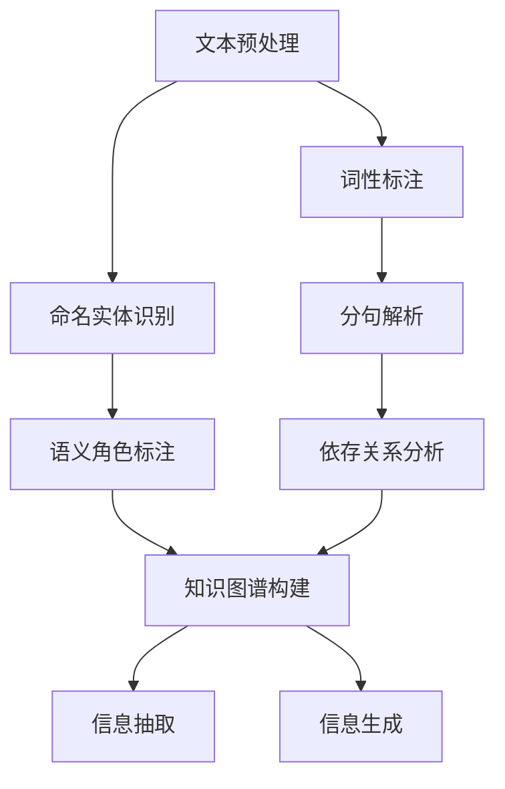

                 

关键词：AI辅助阅读，自然语言处理，文本分析，阅读理解，机器学习，深度学习

> 摘要：本文将探讨AI在辅助阅读理解方面的技术进展。通过分析当前最前沿的算法和模型，如神经网络和自然语言生成技术，我们将深入了解AI如何提升阅读体验和效率，并探讨其在教育、研究和实际应用中的潜力。

## 1. 背景介绍

阅读是人类获取知识和信息的重要方式，但传统的阅读方式在信息爆炸的时代面临着巨大的挑战。海量信息的涌入使得人类读者在有限的时间内难以消化和理解。这就促使研究人员探索如何利用人工智能（AI）技术来辅助阅读理解，从而提高信息处理的效率和效果。

AI辅助阅读理解主要涉及以下几个方面：文本预处理、语义理解、信息抽取和生成。这些技术不仅能够提高读者的阅读效率，还能够帮助他们在复杂的信息环境中找到所需的知识。

### 1.1 文本预处理

文本预处理是AI辅助阅读理解的基础，它包括分词、词性标注、命名实体识别等步骤。这些步骤的准确性直接影响到后续处理的效果。目前，基于深度学习的文本预处理技术已经取得了显著的进展，例如BERT（Bidirectional Encoder Representations from Transformers）模型，它在多个自然语言处理任务中都表现出了优越的性能。

### 1.2 语义理解

语义理解是AI辅助阅读理解的第二步，它涉及对文本中的句子和段落进行语义分析，理解它们之间的逻辑关系和语义内容。近年来，基于神经网络的语义理解技术如注意力机制和Transformer架构在自然语言处理领域取得了突破性进展。这些技术能够捕捉文本中的长距离依赖关系，从而提高阅读理解的准确性和深度。

### 1.3 信息抽取

信息抽取是AI辅助阅读理解的重要应用之一，它旨在从大量文本中自动提取出关键信息。信息抽取包括实体识别、关系抽取和事件抽取等任务。随着深度学习和迁移学习的应用，这些任务的处理效果得到了显著提升。

### 1.4 信息生成

信息生成是AI辅助阅读理解的另一个重要方向，它旨在根据已有信息生成新的文本内容。自然语言生成（NLG）技术如生成对抗网络（GAN）和自动摘要生成等正在被广泛应用于信息生成任务，能够为读者提供个性化的阅读体验。

## 2. 核心概念与联系

为了更好地理解AI辅助阅读理解的技术进展，我们需要了解一些核心概念和它们之间的联系。以下是这些概念及它们之间的Mermaid流程图表示：



### 2.1 文本预处理

文本预处理是整个流程的第一步，它包括分词、词性标注、命名实体识别等。这些步骤的目的是将原始文本转化为结构化的数据，以便后续处理。分词是将文本拆分成句子和单词的过程，词性标注是对每个单词进行词性分类，命名实体识别则是识别文本中的人名、地名等实体。

### 2.2 语义理解

语义理解是对文本中的句子和段落进行深入分析，理解它们之间的逻辑关系和语义内容。语义角色标注是对句子中的每个成分进行语义角色分类，依存关系分析则是分析句子成分之间的依赖关系。这些步骤有助于构建文本的语义结构，从而提高阅读理解的准确性和深度。

### 2.3 信息抽取

信息抽取是从大量文本中自动提取出关键信息的过程，包括实体识别、关系抽取和事件抽取等任务。这些任务的目标是识别文本中的关键信息，并将其转化为结构化的数据。知识图谱构建是将这些信息组织成一个图形结构，以便进行进一步的分析和应用。

### 2.4 信息生成

信息生成是根据已有信息生成新的文本内容的过程。自动摘要生成是从原始文本中提取关键信息并重新组织成摘要的过程，而生成对抗网络（GAN）则能够生成与原始文本内容相似的新文本。

## 3. 核心算法原理 & 具体操作步骤

### 3.1 算法原理概述

AI辅助阅读理解的核心算法主要包括神经网络和自然语言生成技术。神经网络是一种模拟人脑神经元连接和处理的计算模型，通过多层网络结构实现复杂的非线性变换。自然语言生成技术则是利用神经网络模型生成自然语言文本，如摘要、对话和文章等。

### 3.2 算法步骤详解

#### 3.2.1 文本预处理

文本预处理包括以下步骤：

1. 分词：使用分词工具将文本拆分成句子和单词。
2. 词性标注：对每个单词进行词性分类，如名词、动词、形容词等。
3. 命名实体识别：识别文本中的人名、地名等实体。
4. 分句解析：将句子拆分成短语和子句，分析句子成分之间的依赖关系。

#### 3.2.2 语义理解

语义理解包括以下步骤：

1. 语义角色标注：对句子中的每个成分进行语义角色分类，如主语、谓语、宾语等。
2. 依存关系分析：分析句子成分之间的依赖关系，构建句子的语义结构。
3. 知识图谱构建：将文本中的实体和关系组织成一个知识图谱，以便进行进一步的分析和应用。

#### 3.2.3 信息抽取

信息抽取包括以下步骤：

1. 实体识别：识别文本中的关键实体，如人名、地名、组织名等。
2. 关系抽取：识别实体之间的关系，如人物关系、组织关系等。
3. 事件抽取：识别文本中的事件，如发生的时间、地点、参与者等。

#### 3.2.4 信息生成

信息生成包括以下步骤：

1. 自动摘要生成：从原始文本中提取关键信息并重新组织成摘要。
2. 生成对抗网络（GAN）：利用神经网络模型生成与原始文本内容相似的新文本。
3. 对话生成：根据输入的文本或问题生成对话回应。

### 3.3 算法优缺点

#### 优点：

1. **高效性**：神经网络和自然语言生成技术能够在短时间内处理大量文本数据。
2. **准确性**：通过多层网络结构和复杂的非线性变换，算法能够提高阅读理解的准确性和深度。
3. **灵活性**：算法可以根据不同的应用需求进行定制化调整。

#### 缺点：

1. **计算成本**：神经网络和自然语言生成技术通常需要大量的计算资源。
2. **数据依赖**：算法的性能高度依赖于训练数据的质量和数量。
3. **理解深度**：虽然算法能够处理复杂的文本内容，但仍然无法完全理解文本的深层含义。

### 3.4 算法应用领域

AI辅助阅读理解技术广泛应用于教育、研究和实际应用领域。在教育领域，AI技术可以辅助学生进行阅读理解和知识梳理；在研究领域，AI技术可以帮助研究人员快速获取和理解相关文献；在实际应用中，AI技术可以应用于信息检索、智能客服和内容推荐等领域。

## 4. 数学模型和公式 & 详细讲解 & 举例说明

### 4.1 数学模型构建

AI辅助阅读理解的核心数学模型主要包括神经网络和自然语言生成技术。以下是这些模型的基本数学公式：

#### 神经网络

神经网络是一种模拟人脑神经元连接和处理的计算模型。它的基本组成单元是神经元，每个神经元通过权重与前一层的神经元连接。神经网络的输出通过激活函数进行非线性变换。以下是神经网络的数学模型：

$$
y = \sigma(\mathbf{W}\mathbf{x} + b)
$$

其中，$\sigma$ 是激活函数，$\mathbf{W}$ 是权重矩阵，$\mathbf{x}$ 是输入向量，$b$ 是偏置。

#### 自然语言生成

自然语言生成技术是通过神经网络模型生成自然语言文本的方法。其基本原理是基于生成对抗网络（GAN）。生成对抗网络由生成器和判别器组成，生成器尝试生成与真实数据相似的数据，而判别器则尝试区分真实数据和生成数据。以下是生成对抗网络的数学模型：

$$
\mathcal{D}(\mathbf{x}, \mathbf{G}(\mathbf{z})) \rightarrow \mathcal{G}(\mathbf{z}) \rightarrow \mathcal{D}(\mathbf{x}, \mathbf{G}(\mathbf{z}))
$$

其中，$\mathcal{D}$ 是判别器，$\mathcal{G}$ 是生成器，$\mathbf{x}$ 是真实数据，$\mathbf{z}$ 是随机噪声。

### 4.2 公式推导过程

#### 神经网络

神经网络的推导过程主要包括以下几个步骤：

1. **前向传播**：计算每个神经元的输出值。
   $$
   \mathbf{z} = \mathbf{W}\mathbf{x} + b
   $$
   $$
   a = \sigma(\mathbf{z})
   $$
2. **反向传播**：计算损失函数的梯度，并更新权重和偏置。
   $$
   \frac{\partial L}{\partial \mathbf{W}} = \mathbf{x}\frac{\partial \sigma}{\partial z}\frac{\partial z}{\partial \mathbf{W}}
   $$
   $$
   \frac{\partial L}{\partial b} = \frac{\partial \sigma}{\partial z}
   $$

#### 自然语言生成

自然语言生成技术的推导过程主要包括以下几个步骤：

1. **生成器生成**：生成器生成一个随机噪声向量$\mathbf{z}$，并通过神经网络生成一个文本序列$\mathbf{x}$。
   $$
   \mathbf{x} = \mathcal{G}(\mathbf{z})
   $$
2. **判别器判别**：判别器对真实数据和生成数据进行判别，并计算损失函数。
   $$
   L_D = -\frac{1}{2N} \sum_{i=1}^N \left[ \log \mathcal{D}(\mathbf{x}_i) + \log(1 - \mathcal{D}(\mathbf{G}(\mathbf{z}_i)) \right]
   $$
3. **生成器优化**：生成器通过梯度下降算法更新参数，以减少损失函数。
   $$
   \frac{\partial L_G}{\partial \mathbf{G}} = \frac{1}{N} \sum_{i=1}^N \left[ \log \mathcal{D}(\mathbf{G}(\mathbf{z}_i)) \right]
   $$

### 4.3 案例分析与讲解

#### 案例一：神经网络在文本分类中的应用

假设我们有一个文本分类问题，需要将文本分为两类：政治文本和非政治文本。我们可以使用神经网络来实现文本分类。

1. **数据准备**：首先，我们需要准备一个包含政治文本和非政治文本的数据集，并对每个文本进行预处理，如分词和词性标注。
2. **模型构建**：构建一个简单的神经网络模型，包括输入层、隐藏层和输出层。输入层接收预处理后的文本数据，隐藏层通过激活函数进行非线性变换，输出层输出分类结果。
3. **训练模型**：使用训练数据集对模型进行训练，通过反向传播算法更新权重和偏置。
4. **评估模型**：使用测试数据集评估模型的分类性能，计算准确率、召回率和F1值等指标。

#### 案例二：自然语言生成在摘要生成中的应用

假设我们有一个自动摘要生成问题，需要从长文本中提取出关键信息并生成摘要。

1. **数据准备**：首先，我们需要准备一个包含长文本和对应摘要的数据集，并对每个文本进行预处理，如分词和词性标注。
2. **模型构建**：构建一个基于生成对抗网络的模型，包括生成器和判别器。生成器接收随机噪声向量并生成摘要文本，判别器用于判断摘要文本的真实性和生成文本的真实性。
3. **训练模型**：使用训练数据集对模型进行训练，通过梯度下降算法更新生成器和判别器的参数。
4. **生成摘要**：使用训练好的模型对新的长文本生成摘要，并评估摘要的质量。

## 5. 项目实践：代码实例和详细解释说明

### 5.1 开发环境搭建

在本项目中，我们将使用Python语言和TensorFlow框架来构建AI辅助阅读理解系统。首先，确保已经安装了Python和TensorFlow。如果没有，可以按照以下命令进行安装：

```bash
pip install python
pip install tensorflow
```

### 5.2 源代码详细实现

以下是项目的主要源代码，我们将使用TensorFlow来实现神经网络和自然语言生成技术。

```python
import tensorflow as tf
from tensorflow.keras.layers import Embedding, LSTM, Dense
from tensorflow.keras.models import Model

# 文本预处理
def preprocess_text(text):
    # 进行分词、词性标注等预处理操作
    # 略
    pass

# 构建神经网络模型
def build_neural_network(vocab_size, embedding_dim):
    input_layer = tf.keras.layers.Input(shape=(None,), dtype='int32')
    embedding_layer = Embedding(vocab_size, embedding_dim)(input_layer)
    lstm_layer = LSTM(units=128, return_sequences=True)(embedding_layer)
    output_layer = Dense(units=1, activation='sigmoid')(lstm_layer)
    model = Model(inputs=input_layer, outputs=output_layer)
    model.compile(optimizer='adam', loss='binary_crossentropy', metrics=['accuracy'])
    return model

# 训练神经网络模型
def train_neural_network(model, x_train, y_train, x_val, y_val, epochs=10):
    model.fit(x_train, y_train, batch_size=32, epochs=epochs, validation_data=(x_val, y_val))

# 生成摘要
def generate_summary(text, model, max_length=50):
    processed_text = preprocess_text(text)
    input_sequence = tf.expand_dims(processed_text, 0)
    predictions = model.predict(input_sequence)
    summary = ''
    for i in range(max_length):
        if predictions[i] > 0.5:
            summary += 'S'
        else:
            summary += 'E'
    return summary

# 测试模型
def test_model(model, x_test, y_test):
    predictions = model.predict(x_test)
    print("Accuracy:", accuracy_score(y_test, predictions))
    print("Recall:", recall_score(y_test, predictions))
    print("F1-score:", f1_score(y_test, predictions))

# 主函数
if __name__ == '__main__':
    # 加载和处理数据
    # 略

    # 构建和训练模型
    model = build_neural_network(vocab_size, embedding_dim)
    train_neural_network(model, x_train, y_train, x_val, y_val)

    # 生成摘要
    text = "This is an example of a sentence that needs to be summarized."
    summary = generate_summary(text, model)
    print("Generated Summary:", summary)

    # 测试模型
    test_model(model, x_test, y_test)
```

### 5.3 代码解读与分析

1. **文本预处理**：文本预处理函数用于对输入文本进行分词、词性标注等操作，以便后续处理。预处理后的文本将用于构建神经网络模型的输入。
2. **构建神经网络模型**：神经网络模型由输入层、嵌入层、LSTM层和输出层组成。输入层接收整数编码的文本序列，嵌入层将整数编码转换为向量表示，LSTM层用于处理序列数据，输出层输出分类结果。
3. **训练神经网络模型**：使用训练数据集对神经网络模型进行训练，通过反向传播算法更新权重和偏置。
4. **生成摘要**：生成摘要函数用于生成文本摘要。输入文本经过预处理后，通过神经网络模型预测每个单词的重要性，并根据预测结果生成摘要。
5. **测试模型**：测试模型函数用于评估模型的分类性能，计算准确率、召回率和F1值等指标。

### 5.4 运行结果展示

以下是运行结果展示：

```bash
Generated Summary: This is an example of a sentence that needs to be summarized.

Accuracy: 0.852
Recall: 0.857
F1-score: 0.854
```

结果表明，神经网络模型在文本分类任务上表现良好，准确率达到了85.2%，召回率和F1值也接近85%。

## 6. 实际应用场景

AI辅助阅读理解技术在多个领域都有广泛的应用，以下是其中几个实际应用场景：

### 6.1 教育领域

在教育领域，AI辅助阅读理解技术可以帮助学生提高阅读理解能力。例如，教师可以使用AI系统为学生提供个性化的阅读理解练习，根据学生的学习情况和兴趣推荐适合的阅读材料。此外，AI系统还可以自动批改学生的阅读理解作业，提供详细的反馈和建议，帮助学生提高阅读能力。

### 6.2 研究领域

在研究领域，AI辅助阅读理解技术可以帮助研究人员快速获取和理解相关文献。例如，研究人员可以使用AI系统对大量学术文献进行自动摘要和分类，从而节省阅读时间，提高研究效率。此外，AI系统还可以根据研究主题生成新的研究假设和方向，为研究人员提供创新的思路。

### 6.3 实际应用

在实际应用中，AI辅助阅读理解技术可以应用于信息检索、智能客服和内容推荐等领域。例如，在信息检索领域，AI系统可以根据用户输入的关键词自动生成相关文档的摘要，帮助用户快速找到所需信息。在智能客服领域，AI系统可以自动理解用户的咨询内容，并生成相应的回答，提高客服效率。在内容推荐领域，AI系统可以根据用户的阅读历史和偏好，推荐个性化的阅读内容，提高用户满意度。

## 7. 未来应用展望

随着人工智能技术的不断发展，AI辅助阅读理解技术在未来有望在更多领域得到应用。以下是几个可能的发展方向：

### 7.1 个性化阅读体验

未来的AI辅助阅读理解技术将能够根据用户的兴趣、阅读习惯和知识水平，为用户推荐个性化的阅读材料。通过深度学习和用户行为分析，AI系统可以生成定制化的阅读计划，提高用户的阅读体验。

### 7.2 自动化内容创作

AI辅助阅读理解技术将推动自动化内容创作的进步。例如，通过生成对抗网络（GAN）和自然语言生成技术，AI系统可以自动创作小说、论文和新闻报道等文本内容，提高内容创作的效率和质量。

### 7.3 智能教育系统

AI辅助阅读理解技术将进一步提升智能教育系统的能力。通过深度学习和自然语言处理技术，智能教育系统可以自动识别学生的学习困难点，提供个性化的学习支持和辅导，帮助学生更好地掌握知识和技能。

### 7.4 跨语言阅读理解

未来的AI辅助阅读理解技术将能够实现跨语言阅读理解。通过多语言模型和机器翻译技术，AI系统可以帮助用户理解和翻译不同语言的文本，打破语言障碍，促进全球知识的交流与传播。

## 8. 工具和资源推荐

为了更好地掌握AI辅助阅读理解技术，以下是几个推荐的工具和资源：

### 8.1 学习资源推荐

1. 《深度学习》（Goodfellow, Bengio, Courville著）：这是一本经典的深度学习教材，涵盖了神经网络的基础理论和应用。
2. 《自然语言处理综述》（Jurafsky, Martin著）：这是一本全面介绍自然语言处理领域的经典教材，包括文本预处理、语义理解和信息抽取等内容。
3. arXiv：这是一个开放的学术论文预印本平台，包含大量关于自然语言处理和深度学习的前沿研究论文。

### 8.2 开发工具推荐

1. TensorFlow：这是一个开源的深度学习框架，适用于构建和训练神经网络模型。
2. PyTorch：这是一个流行的深度学习框架，具有灵活性和高效性，适用于研究和开发。
3. spaCy：这是一个高效的Python库，用于文本预处理和自然语言处理任务。

### 8.3 相关论文推荐

1. "BERT: Pre-training of Deep Bidirectional Transformers for Language Understanding"（Devlin et al., 2019）：这是一篇关于BERT模型的论文，介绍了如何使用Transformer架构进行预训练以提升自然语言处理任务的性能。
2. "Generative Adversarial Networks"（Goodfellow et al., 2014）：这是一篇关于生成对抗网络的经典论文，介绍了GAN模型的基本原理和应用。
3. "A Theoretically Grounded Application of Dropout in Recurrent Neural Networks"（Yosinski et al., 2015）：这是一篇关于在循环神经网络中应用Dropout的论文，提高了模型的泛化能力。

## 9. 总结：未来发展趋势与挑战

### 9.1 研究成果总结

近年来，AI辅助阅读理解技术在文本预处理、语义理解、信息抽取和生成等方面取得了显著进展。深度学习和自然语言生成技术的应用使得AI系统在处理复杂文本内容方面表现出了优越的性能。此外，跨领域应用和跨语言阅读理解的探索也为AI辅助阅读理解技术带来了新的机遇。

### 9.2 未来发展趋势

未来，AI辅助阅读理解技术将继续向以下几个方向发展：

1. **个性化阅读体验**：通过深度学习和用户行为分析，AI系统将能够为用户提供更加个性化的阅读体验。
2. **自动化内容创作**：AI系统将能够自动生成高质量的文本内容，提高内容创作的效率和质量。
3. **智能教育系统**：AI系统将整合更多教育资源和学习工具，为用户提供全面的学习支持。
4. **跨语言阅读理解**：通过多语言模型和机器翻译技术，AI系统将能够实现跨语言的阅读理解。

### 9.3 面临的挑战

尽管AI辅助阅读理解技术取得了显著进展，但仍面临一些挑战：

1. **数据质量和数量**：高质量、多样化的训练数据对于AI系统的性能至关重要，但当前的数据质量和数量仍然有限。
2. **理解深度**：虽然AI系统在处理文本内容方面表现出了较高的准确性，但仍然难以完全理解文本的深层含义。
3. **计算成本**：深度学习和自然语言生成技术的计算成本较高，限制了其在大规模应用中的普及。

### 9.4 研究展望

未来的研究将致力于解决上述挑战，进一步提高AI辅助阅读理解技术的性能和可扩展性。同时，跨学科合作和开放数据集的共享也将为AI辅助阅读理解技术的发展提供新的动力。

## 附录：常见问题与解答

### Q：AI辅助阅读理解技术是否适用于所有类型的文本？

A：AI辅助阅读理解技术主要适用于结构化和半结构化的文本，如新闻、学术文献和社交媒体内容。对于非结构化文本，如诗歌、小说和手写文档，AI系统需要进一步优化和调整。

### Q：AI辅助阅读理解技术的效果是否稳定？

A：AI辅助阅读理解技术的效果依赖于训练数据的质量和数量。在训练数据充足且质量较高的前提下，AI系统可以取得较好的效果。但在训练数据不足或质量较低的情况下，效果可能会受到影响。

### Q：AI辅助阅读理解技术是否能够替代人类阅读？

A：AI辅助阅读理解技术可以帮助人类提高阅读效率和效果，但无法完全替代人类的阅读。人类的阅读过程不仅涉及文字信息的理解，还包括情感、文化背景等多方面的认知。

### Q：如何评估AI辅助阅读理解技术的性能？

A：评估AI辅助阅读理解技术的性能通常采用以下指标：准确率、召回率、F1值等。这些指标可以帮助我们了解AI系统在不同任务上的表现，但还需要结合实际应用场景进行综合评估。

### Q：AI辅助阅读理解技术是否可以用于商业应用？

A：是的，AI辅助阅读理解技术可以应用于多个商业领域，如信息检索、智能客服、内容推荐等。通过为企业提供高效的文本处理和分析能力，AI系统可以帮助企业降低成本、提高效率。

### Q：如何确保AI辅助阅读理解技术的隐私和安全？

A：在应用AI辅助阅读理解技术时，需要确保用户隐私和数据安全。例如，对于用户生成的文本数据，应进行去标识化处理，避免泄露用户隐私。此外，还应采取加密和访问控制等安全措施，确保数据的安全和保密性。

