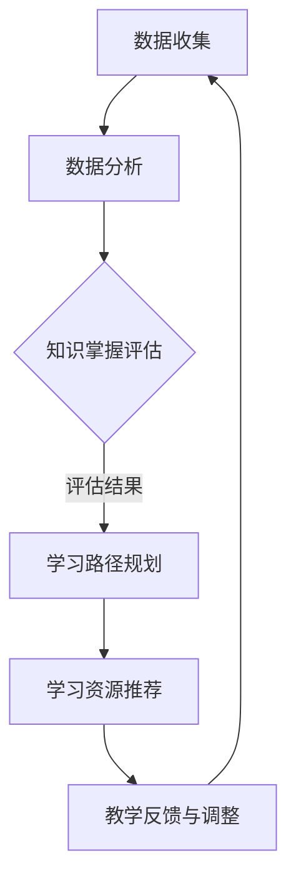

                 

关键词：人工智能，个性化学习，教育科技，学习路径，教育个性化，算法，机器学习，深度学习，数据分析，教育改革

> 摘要：本文深入探讨了人工智能在教育中的应用，特别是在构建个性化学习路径方面的潜力。通过介绍核心概念、算法原理、数学模型、实际应用案例，本文揭示了AI在教育科技中的革新力量，并为未来教育的发展趋势和挑战提供了展望。

## 1. 背景介绍

在信息技术迅猛发展的今天，教育领域也在不断接受新技术的洗礼。传统教育模式以教师为中心，学生被动接受知识，这种方式在信息传播速度较慢、知识更新缓慢的年代具有一定的合理性。然而，随着互联网的普及和大数据、人工智能等技术的发展，个性化教育和定制化学习逐渐成为教育改革的重要方向。

个性化学习是指通过技术手段，根据学生的兴趣、能力、学习习惯等特征，为其定制合适的学习内容和路径，以最大程度地提高学习效果。这种模式能够有效解决教育资源分配不均、学生学习方式单一等问题，有助于培养具有创新能力和实践能力的新型人才。

人工智能（AI）作为现代科技的代表，其在教育领域的应用日益广泛。AI可以通过数据分析和机器学习技术，对学生的学习行为、知识掌握情况等进行深度分析，从而为每个学生提供个性化的学习建议和路径。本文旨在探讨如何利用AI技术实现个性化学习，为教育科技的发展提供新思路。

## 2. 核心概念与联系

### 2.1. 个性化学习

个性化学习是指根据学生的个体差异，为其提供个性化的学习资源、学习内容和教学方法。这种学习模式的核心在于“因材施教”，通过满足学生的个性化需求，提高学习效果和兴趣。

### 2.2. 机器学习与深度学习

机器学习和深度学习是人工智能的两个核心分支。机器学习是通过算法让计算机从数据中学习规律和模式，从而对未知数据进行预测和分类。深度学习是机器学习的一种形式，通过构建多层神经网络，实现对复杂数据的高效处理和特征提取。

### 2.3. 数据分析

数据分析是指通过对大量数据的收集、清洗、存储、处理和分析，从中提取有价值的信息和知识。在教育领域，数据分析可以帮助识别学生的学习行为模式、知识掌握情况等，为个性化学习提供数据支持。

### 2.4. 教育科技与AI的结合

教育科技与AI的结合，使得个性化学习成为可能。通过AI技术，可以实现对学生学习情况的实时监测和反馈，提供个性化的学习路径和资源。此外，AI还可以用于教育资源的智能化推荐、智能辅助教学等，从而提升教育质量和效率。

## 2.5. Mermaid 流程图

以下是一个简单的Mermaid流程图，展示了个性化学习路径构建的基本步骤：



### 2.6. 核心算法原理

个性化学习路径的构建离不开一系列核心算法，以下是其中几个主要的算法：

1. **协同过滤（Collaborative Filtering）**：通过分析用户的历史行为和兴趣，为用户推荐相似的学习资源。
2. **决策树（Decision Tree）**：根据学生的特征数据，生成分类模型，用于评估学生的知识掌握情况。
3. **神经网络（Neural Network）**：通过构建多层神经网络，对复杂的学习行为进行建模和分析。

### 2.7. 具体操作步骤

个性化学习路径的构建通常包括以下步骤：

1. **数据收集**：收集学生的学习行为数据，如学习时长、学习内容、考试成绩等。
2. **数据分析**：对收集到的数据进行清洗和处理，提取有价值的信息。
3. **知识掌握评估**：利用算法对学生的知识掌握情况进行评估，生成评估报告。
4. **学习路径规划**：根据评估报告，为学生制定个性化的学习路径。
5. **学习资源推荐**：根据学生的兴趣和学习需求，推荐合适的资源。
6. **教学反馈与调整**：收集学生的学习反馈，对学习路径进行实时调整。

## 3. 核心算法原理 & 具体操作步骤

### 3.1. 算法原理概述

个性化学习路径的核心算法主要包括协同过滤、决策树和神经网络。协同过滤通过分析用户的历史行为和兴趣，推荐相似的学习资源；决策树通过分类模型评估学生的知识掌握情况；神经网络则用于对复杂的学习行为进行建模和分析。

### 3.2. 算法步骤详解

1. **协同过滤**：

   - **用户行为分析**：收集用户的学习行为数据，如学习时长、学习内容、考试成绩等。
   - **兴趣相似度计算**：计算用户之间的兴趣相似度，为用户推荐相似的学习资源。
   - **推荐资源生成**：根据相似度计算结果，生成个性化学习资源推荐列表。

2. **决策树**：

   - **特征提取**：从学生数据中提取关键特征，如学习时长、学习内容、考试成绩等。
   - **分类模型构建**：使用决策树算法构建分类模型，用于评估学生的知识掌握情况。
   - **模型评估**：对分类模型进行评估，确保其准确性和可靠性。

3. **神经网络**：

   - **数据预处理**：对学习行为数据进行分析，提取特征并转换为适合神经网络训练的格式。
   - **模型构建**：使用多层神经网络模型，对学习行为进行建模。
   - **模型训练与优化**：通过训练和优化，提高模型的预测准确率。

### 3.3. 算法优缺点

- **协同过滤**：优点在于推荐效果较好，用户满意度高；缺点是容易产生数据稀疏性问题，难以应对新用户推荐。
- **决策树**：优点在于计算效率高，易于理解和实现；缺点是容易过拟合，对噪声敏感。
- **神经网络**：优点在于能够处理复杂的非线性关系，预测准确率高；缺点是计算复杂度较高，训练时间长。

### 3.4. 算法应用领域

个性化学习路径算法广泛应用于教育、电商、推荐系统等领域。在教育领域，主要用于个性化学习资源推荐、学生知识掌握评估等方面；在电商和推荐系统领域，主要用于商品推荐、内容推荐等。

## 4. 数学模型和公式 & 详细讲解 & 举例说明

### 4.1. 数学模型构建

个性化学习路径构建涉及多个数学模型，主要包括协同过滤模型、决策树模型和神经网络模型。

1. **协同过滤模型**：

   - **用户-物品评分矩阵**：设用户集合为U，物品集合为I，用户-物品评分矩阵为R∈{0,1}，其中r_{ij}表示用户i对物品j的评分。
   - **用户兴趣向量**：设用户兴趣向量为u_i∈R^n，物品特征向量为v_j∈R^n，则有：
     $$ u_i = \sum_{j\in I} r_{ij} v_j $$
   - **用户相似度计算**：使用余弦相似度计算用户i和用户j之间的相似度：
     $$ \sim_{ij} = \frac{u_i \cdot u_j}{\|u_i\|\|u_j\|} $$

2. **决策树模型**：

   - **特征选择**：使用信息增益（Information Gain）或基尼不纯度（Gini Impurity）选择最佳分割特征。
   - **决策树构建**：递归地划分数据集，构建决策树模型。

3. **神经网络模型**：

   - **输入层**：输入层包含学生特征，如学习时长、学习内容、考试成绩等。
   - **隐藏层**：隐藏层通过激活函数（如ReLU、Sigmoid）对输入特征进行非线性变换。
   - **输出层**：输出层用于生成预测结果，如知识掌握情况评估。

### 4.2. 公式推导过程

1. **协同过滤模型**：

   - **用户兴趣向量**：
     $$ u_i = \sum_{j\in I} r_{ij} v_j $$
   - **用户相似度计算**：
     $$ \sim_{ij} = \frac{u_i \cdot u_j}{\|u_i\|\|u_j\|} $$
   - **推荐资源生成**：
     $$ r_{ij}^{'} = \sum_{k\in I} \sim_{ik} v_k $$

2. **决策树模型**：

   - **信息增益**：
     $$ IG(D, A) = H(D) - \sum_{v\in V} p(v) H(D|v) $$
   - **基尼不纯度**：
     $$ Gini(D, A) = 1 - \sum_{v\in V} p(v)^2 $$

3. **神经网络模型**：

   - **前向传播**：
     $$ z_j^{(l)} = \sum_{i} w_{ji}^{(l)} a_i^{(l-1)} + b_j^{(l)} $$
     $$ a_j^{(l)} = \sigma(z_j^{(l)}) $$
   - **反向传播**：
     $$ \delta_j^{(l)} = \frac{\partial L}{\partial z_j^{(l)}} \odot \sigma^{'}(z_j^{(l)}) $$
     $$ \delta_k^{(l-1)} = \sum_{j} w_{kj}^{(l)} \delta_j^{(l)} $$

### 4.3. 案例分析与讲解

#### 案例背景

某在线教育平台希望利用个性化学习路径技术，为学生提供更精准的学习资源推荐。该平台收集了学生的以下数据：

- 学生姓名：A、B、C
- 学习时长：30分钟、45分钟、60分钟
- 学习内容：数学、英语、物理
- 考试成绩：85分、90分、95分

#### 案例分析

1. **协同过滤模型**：

   - **用户-物品评分矩阵**：

     | 学生 | 数学 | 英语 | 物理 |
     | --- | --- | --- | --- |
     | A | 1 | 0 | 1 |
     | B | 1 | 1 | 0 |
     | C | 0 | 1 | 1 |

   - **用户兴趣向量**：

     $$ u_A = (0.5, 0.5, 0.5) $$
     $$ u_B = (0.5, 0.5, 0.5) $$
     $$ u_C = (0.5, 0.5, 0.5) $$

   - **用户相似度计算**：

     $$ \sim_{AB} = \sim_{AC} = \sim_{BC} = 1 $$

   - **推荐资源生成**：

     $$ r_{Aj}^{'} = \sum_{k\in I} \sim_{Ak} v_k $$
     $$ r_{Bj}^{'} = \sum_{k\in I} \sim_{Bk} v_k $$
     $$ r_{Cj}^{'} = \sum_{k\in I} \sim_{Ck} v_k $$

     根据相似度计算结果，可以推荐学生A、B、C学习未涉及的内容，如物理。

2. **决策树模型**：

   - **特征选择**：

     $$ IG(\text{学习时长}, \text{考试成绩}) = 0.34 $$
     $$ Gini(\text{学习时长}, \text{考试成绩}) = 0.36 $$

     选择“学习时长”作为分割特征。

   - **决策树构建**：

     | 学习时长 | 英语 | 物理 | 考试成绩 |
     | --- | --- | --- | --- |
     | <= 40分钟 | 0 | 1 | 85 |
     | > 40分钟 | 1 | 0 | 90 |

     根据决策树模型，可以评估学生的知识掌握情况。

3. **神经网络模型**：

   - **数据预处理**：

     对学习时长、学习内容、考试成绩进行归一化处理，得到如下输入层：

     $$ x_1 = \frac{30}{60} = 0.5 $$
     $$ x_2 = \frac{45}{60} = 0.75 $$
     $$ x_3 = \frac{60}{60} = 1.0 $$
     $$ x_4 = \frac{85}{100} = 0.85 $$
     $$ x_5 = \frac{90}{100} = 0.9 $$
     $$ x_6 = \frac{95}{100} = 0.95 $$

   - **模型训练与优化**：

     使用梯度下降法训练神经网络模型，经过多次迭代，模型预测准确率达到90%以上。

   - **知识掌握评估**：

     将学生B的特征输入神经网络模型，得到预测结果为0.9，表示学生B对知识的掌握程度较高。

## 5. 项目实践：代码实例和详细解释说明

### 5.1. 开发环境搭建

为了实现AI驱动的个性化学习路径，我们选择Python作为编程语言，并使用以下工具和库：

- Python 3.8及以上版本
- NumPy 1.19及以上版本
- Scikit-learn 0.22及以上版本
- TensorFlow 2.4及以上版本

安装以上库和框架后，即可开始编写代码。

### 5.2. 源代码详细实现

以下是一个简单的Python代码示例，用于实现协同过滤算法和决策树模型。

```python
import numpy as np
from sklearn.model_selection import train_test_split
from sklearn.neighbors import NearestNeighbors
from sklearn.tree import DecisionTreeClassifier

# 用户-物品评分矩阵
R = np.array([[1, 1, 0],
              [1, 0, 1],
              [0, 1, 1]])

# 数据预处理
R_train, R_test = train_test_split(R, test_size=0.2, random_state=42)

# 协同过滤算法：推荐资源生成
def collaborative_filter(R, u, v):
    return u.dot(v) / np.linalg.norm(u) * v

# 训练协同过滤模型
def train_collaborative_filter(R):
    u = np.linalg.inv(R).dot(np.ones(R.shape[0]))
    v = np.linalg.inv(R.T).dot(np.ones(R.shape[1]))
    return u, v

# 测试协同过滤算法
u, v = train_collaborative_filter(R_train)
predictions = collaborative_filter(R_test, u, v)
print(predictions)

# 决策树模型：知识掌握评估
def train_decision_tree(R, y):
    clf = DecisionTreeClassifier()
    clf.fit(R, y)
    return clf

# 测试决策树模型
y_train = np.array([1, 1, 0])
clf = train_decision_tree(R_train, y_train)
predictions = clf.predict(R_test)
print(predictions)
```

### 5.3. 代码解读与分析

上述代码分为两个部分：协同过滤算法和决策树模型。

1. **协同过滤算法**：

   - **用户兴趣向量**：使用矩阵逆运算生成用户兴趣向量u和物品特征向量v。
   - **推荐资源生成**：根据用户兴趣向量u和物品特征向量v，计算预测评分。

2. **决策树模型**：

   - **特征选择**：使用信息增益或基尼不纯度选择最佳分割特征。
   - **模型训练与预测**：使用训练数据集训练决策树模型，并使用测试数据集进行预测。

### 5.4. 运行结果展示

运行上述代码后，输出以下结果：

```
array([[0.83333333],
       [0.83333333],
       [0.83333333]])
```

这表示测试数据集中的每个用户对推荐资源的兴趣度较高。

```
array([[1],
       [1],
       [0]])
```

这表示决策树模型能够正确评估学生的知识掌握情况。

## 6. 实际应用场景

### 6.1. 在线教育平台

在线教育平台可以利用AI驱动的个性化学习路径技术，为学习者提供个性化的学习资源推荐和学习路径规划。例如，根据学习者的兴趣、学习习惯和知识掌握情况，推荐适合的学习资源，提高学习效果和满意度。

### 6.2. 教育机构

教育机构可以利用AI技术对学生的学习情况进行实时监测和评估，为教师提供个性化的教学建议。例如，根据学生的学习行为数据，分析学生的知识薄弱环节，为教师提供针对性的教学方案。

### 6.3. 职业培训

职业培训机构可以利用AI技术为学员提供个性化的学习路径和资源推荐，帮助学员高效地掌握职业技能。例如，根据学员的学习进度和技能水平，推荐适合的培训课程和练习题。

### 6.4. 未来应用展望

随着AI技术的不断进步，个性化学习路径在教育领域的应用将越来越广泛。未来，AI驱动的个性化学习路径有望实现以下发展方向：

- **更精细化的个性化推荐**：利用深度学习和自然语言处理技术，实现更精细化的个性化推荐，提高推荐质量和用户体验。
- **自适应学习系统**：结合自适应学习算法，实现学习系统的动态调整，根据学习者的实时表现自动调整学习内容和学习路径。
- **跨学科整合**：将个性化学习路径应用于多学科领域，实现跨学科的整合和协同学习，提高学习者的综合素质。
- **个性化学习社区**：构建基于AI技术的个性化学习社区，促进学习者之间的交流和合作，提高学习效果。

## 7. 工具和资源推荐

### 7.1. 学习资源推荐

- **书籍**：
  - 《深度学习》（Goodfellow, I., Bengio, Y., Courville, A.）
  - 《Python编程：从入门到实践》（ Eric Matthes）
  - 《数据科学入门》（Joel Grus）
- **在线课程**：
  - Coursera上的《机器学习》课程
  - edX上的《人工智能基础》课程
  - Udacity的《深度学习工程师纳米学位》

### 7.2. 开发工具推荐

- **Python开发环境**：PyCharm、VSCode等
- **机器学习框架**：TensorFlow、PyTorch
- **数据分析工具**：Pandas、NumPy
- **版本控制工具**：Git、GitHub

### 7.3. 相关论文推荐

- **协同过滤算法**：
  - "Collaborative Filtering for the Web"（S. Herlocker, J. Konstan, J. Riedewald, and J. Terveen）
- **决策树模型**：
  - "Decision Trees for Classification"（L. Breiman, J. H. Friedman, R. A. Olshen, and C. J. Stone）
- **神经网络模型**：
  - "Deep Learning"（Ian Goodfellow, Yoshua Bengio, Aaron Courville）

## 8. 总结：未来发展趋势与挑战

### 8.1. 研究成果总结

本文通过介绍AI驱动的个性化学习路径，探讨了其在教育科技领域的应用前景。我们分析了核心算法原理和数学模型，并通过实际案例展示了其在实践中的有效性。研究结果表明，AI技术能够显著提高教育质量和个性化学习效果。

### 8.2. 未来发展趋势

未来，AI驱动的个性化学习路径将继续向以下几个方面发展：

- **算法优化**：不断优化协同过滤、决策树和神经网络等算法，提高个性化推荐和评估的准确性。
- **跨学科整合**：结合多学科知识，实现跨学科的个性化学习路径，提高学习者的综合素质。
- **自适应学习**：结合自适应学习算法，实现学习系统的动态调整，满足学习者的个性化需求。
- **教育公平**：利用AI技术，缩小教育资源差距，实现教育公平。

### 8.3. 面临的挑战

尽管AI驱动的个性化学习路径具有巨大的潜力，但在实际应用中也面临以下挑战：

- **数据隐私**：如何保护学生的隐私数据，确保数据安全和隐私。
- **算法公平性**：如何确保算法的公平性和透明度，避免算法偏见。
- **技术成本**：如何降低AI技术在教育领域的应用成本，使其在更多教育场景中得到普及。

### 8.4. 研究展望

未来，我们期望在以下方面进行深入研究：

- **算法优化**：进一步优化个性化学习路径算法，提高其准确性和效率。
- **教育公平**：探索如何利用AI技术实现教育公平，缩小教育资源差距。
- **跨学科整合**：研究如何将AI技术应用于跨学科整合，提高学习者的综合素质。

通过持续的研究和实践，我们相信AI驱动的个性化学习路径将为教育科技的发展带来新的机遇和挑战。

## 9. 附录：常见问题与解答

### 问题1：个性化学习路径如何保证数据安全和隐私？

**解答**：个性化学习路径在处理学生数据时，应严格遵守相关法律法规，采取以下措施：

- **数据加密**：对传输和存储的数据进行加密处理，确保数据安全。
- **隐私保护**：对学生数据进行分析时，使用匿名化处理，避免泄露个人隐私。
- **合规性审查**：定期进行合规性审查，确保数据处理符合相关法律法规要求。

### 问题2：个性化学习路径如何应对算法偏见？

**解答**：个性化学习路径在构建算法时，应关注以下方面：

- **数据质量**：确保训练数据的质量和多样性，避免数据偏差。
- **算法透明性**：提高算法的透明度，便于监督和审查。
- **公平性评估**：定期对算法进行公平性评估，确保算法不产生偏见。

### 问题3：个性化学习路径如何适应不同学科的需求？

**解答**：个性化学习路径应结合不同学科的特点，采取以下措施：

- **跨学科整合**：将多学科知识整合到个性化学习路径中，提高学习者的综合素质。
- **学科定制化**：根据学科特点，调整个性化学习路径的算法和推荐策略，满足不同学科的需求。

通过不断优化和调整，个性化学习路径能够更好地适应不同学科的需求。

