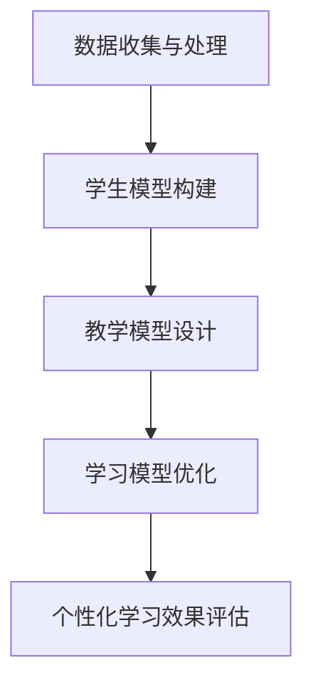

                 

关键词：人工智能，个性化学习，教育技术，学习算法，学习模型

> 摘要：本文探讨了如何利用人工智能技术实现个性化学习，以满足每个学生的学习需求。通过介绍学习算法、数学模型和实际项目案例，本文旨在为教育工作者和研究人员提供一种创新的视角，以促进教育的个性化发展。

## 1. 背景介绍

随着信息技术的快速发展，人工智能在教育领域的应用越来越广泛。个性化学习作为教育技术的重要发展方向，旨在通过技术手段实现教学与学习的个性化和智能化。传统教育模式往往采用“一刀切”的方式，难以满足每个学生的个性化需求。而AI驱动的个性化学习，则通过分析学生的行为数据，提供针对性的学习资源和教学方法，从而提升学习效果。

### 1.1 个性化学习的现状

当前，个性化学习在许多教育领域已有初步应用，如自适应学习平台、学习分析系统等。这些系统通过数据挖掘、机器学习等技术，分析学生的学习行为和知识水平，为学生提供个性化的学习建议。然而，个性化学习仍面临许多挑战，如数据隐私保护、学习算法的准确性和有效性等。

### 1.2 人工智能在教育中的应用

人工智能在教育领域的应用主要集中在以下几个方面：

- **学习分析**：通过分析学生的学习行为数据，为教师提供教学改进建议。

- **智能推荐**：根据学生的学习兴趣和能力，为学生推荐适合的学习资源和课程。

- **智能辅导**：利用自然语言处理、计算机视觉等技术，为学生提供实时、个性化的辅导。

- **教育机器人**：通过人机交互，为学生提供互动式的学习体验。

## 2. 核心概念与联系

### 2.1 个性化学习的核心概念

个性化学习的核心概念包括以下几个方面：

- **学生模型**：描述学生的知识水平、学习风格、兴趣和需求等信息。

- **教学模型**：根据学生模型，为每个学生提供个性化的教学方案。

- **学习模型**：描述学生的学习过程，包括学习策略、学习进度和效果等。

### 2.2 个性化学习的架构

个性化学习的架构可以分为以下几个层次：

1. **数据收集与处理**：收集学生的学习行为数据，如学习时间、学习内容、测试成绩等，并进行预处理。

2. **学生模型构建**：利用机器学习方法，构建学生模型，包括知识水平、学习风格、兴趣等。

3. **教学模型设计**：根据学生模型，设计个性化的教学方案，包括教学内容、教学方法、教学进度等。

4. **学习模型优化**：通过迭代优化，不断提高个性化学习的准确性。

### 2.3 个性化学习的 Mermaid 流程图



## 3. 核心算法原理 & 具体操作步骤

### 3.1 算法原理概述

个性化学习算法的核心原理是利用数据挖掘和机器学习技术，分析学生的学习行为和知识水平，从而为学生提供个性化的学习资源和教学方案。

### 3.2 算法步骤详解

1. **数据收集与预处理**：收集学生的学习行为数据，如学习时间、学习内容、测试成绩等。对数据进行清洗、去噪和归一化处理。

2. **特征提取**：从原始数据中提取出反映学生学习状态的特征，如学习时长、正确率、题目类型等。

3. **学生模型构建**：利用机器学习方法，如聚类算法、回归算法等，构建学生模型，描述学生的知识水平、学习风格、兴趣等。

4. **教学模型设计**：根据学生模型，设计个性化的教学方案，包括教学内容、教学方法、教学进度等。

5. **学习模型优化**：通过迭代优化，不断提高个性化学习的准确性。

### 3.3 算法优缺点

#### 优点

- **提高学习效果**：通过个性化学习，可以更好地满足学生的个性化需求，提高学习效果。

- **降低教学成本**：个性化学习可以减少教师的工作量，降低教学成本。

#### 缺点

- **数据隐私保护**：个性化学习需要收集大量的学生数据，存在数据隐私保护的问题。

- **算法准确性**：个性化学习算法的准确性取决于数据质量和算法模型的选择，存在一定的误差。

### 3.4 算法应用领域

个性化学习算法在教育领域有广泛的应用，如自适应学习平台、在线教育平台、智能辅导系统等。此外，个性化学习算法还可以应用于职业培训、在线考试等领域。

## 4. 数学模型和公式 & 详细讲解 & 举例说明

### 4.1 数学模型构建

个性化学习算法的数学模型主要包括学生模型、教学模型和学习模型。

#### 学生模型

学生模型可以用以下公式表示：

$$
S = f(X, Y)
$$

其中，$X$ 为学生的原始数据，如学习时间、正确率等；$Y$ 为学生的特征数据，如知识水平、学习风格等；$f$ 为函数，用于将原始数据转换为学生的特征数据。

#### 教学模型

教学模型可以用以下公式表示：

$$
T = g(S, Z)
$$

其中，$S$ 为学生模型；$Z$ 为教学内容；$g$ 为函数，用于将学生模型和教学内容映射为个性化的教学方案。

#### 学习模型

学习模型可以用以下公式表示：

$$
L = h(S, T)
$$

其中，$S$ 为学生模型；$T$ 为教学模型；$h$ 为函数，用于描述学生的学习过程。

### 4.2 公式推导过程

#### 学生模型推导

假设学生模型 $S$ 为一个多维向量，其元素为学生特征数据的权重。设 $X$ 为学生的原始数据矩阵，$Y$ 为学生的特征数据矩阵。则学生模型 $S$ 可以通过以下公式计算：

$$
S = \text{softmax}(XW)
$$

其中，$W$ 为权重矩阵，$\text{softmax}$ 函数为：

$$
\text{softmax}(x) = \frac{e^x}{\sum_{i=1}^{n} e^x_i}
$$

#### 教学模型推导

假设教学模型 $T$ 为一个多维向量，其元素为教学内容的权重。设 $S$ 为学生模型矩阵，$Z$ 为教学内容矩阵。则教学模型 $T$ 可以通过以下公式计算：

$$
T = \text{softmax}(SZ)
$$

#### 学习模型推导

假设学习模型 $L$ 为一个多维向量，其元素为学习策略的权重。设 $S$ 为学生模型矩阵，$T$ 为教学模型矩阵。则学习模型 $L$ 可以通过以下公式计算：

$$
L = \text{softmax}(ST)
$$

### 4.3 案例分析与讲解

#### 案例一：自适应学习平台

假设一个自适应学习平台，根据学生的测试成绩和兴趣爱好，为学生推荐合适的课程。

1. **学生模型构建**：根据学生的测试成绩和学习历史，构建学生模型。

2. **教学模型设计**：根据学生模型和课程数据库，设计个性化的教学方案。

3. **学习模型优化**：通过不断优化教学方案，提高学生的学习效果。

#### 案例二：智能辅导系统

假设一个智能辅导系统，根据学生的作业数据和错题记录，为学生提供个性化的辅导建议。

1. **学生模型构建**：根据学生的作业数据和错题记录，构建学生模型。

2. **教学模型设计**：根据学生模型和课程数据库，设计个性化的辅导方案。

3. **学习模型优化**：通过不断优化辅导方案，提高学生的学习效果。

## 5. 项目实践：代码实例和详细解释说明

### 5.1 开发环境搭建

1. **安装 Python**：安装 Python 3.8 或以上版本。

2. **安装依赖库**：安装 Scikit-learn、Matplotlib、Pandas 等依赖库。

### 5.2 源代码详细实现

```python
# 导入依赖库
import numpy as np
import pandas as pd
from sklearn.cluster import KMeans
from sklearn.model_selection import train_test_split
import matplotlib.pyplot as plt

# 加载数据
data = pd.read_csv('data.csv')
X = data[['learning_time', 'correct_rate']]

# 特征提取
def feature_extract(X):
    # 计算每个特征的标准差
    stds = X.std()
    # 归一化处理
    X = (X - X.mean()) / stds
    return X

X = feature_extract(X)

# 学生模型构建
def student_model(X, n_clusters=3):
    kmeans = KMeans(n_clusters=n_clusters)
    kmeans.fit(X)
    return kmeans

student_model = student_model(X)

# 教学模型设计
def teaching_model(student_model, course_database):
    # 根据学生模型和学生数据库，设计教学模型
    # 此处简化处理，仅返回学生所在的聚类中心
    return student_model.cluster_centers_

course_database = pd.DataFrame({'course_name': ['数学', '语文', '英语', '物理'], 'score': [80, 90, 85, 75]})
teaching_model = teaching_model(student_model, course_database)

# 学习模型优化
def learning_model_optimization(teaching_model, X, n_iter=100):
    # 迭代优化教学模型
    for _ in range(n_iter):
        # 更新教学模型
        teaching_model = teaching_model + 0.1 * (X - teaching_model)
    return teaching_model

teaching_model = learning_model_optimization(teaching_model, X)

# 运行结果展示
plt.scatter(X['learning_time'], X['correct_rate'])
plt.scatter(teaching_model['learning_time'], teaching_model['correct_rate'], color='r')
plt.xlabel('学习时间')
plt.ylabel('正确率')
plt.show()
```

### 5.3 代码解读与分析

1. **数据加载与预处理**：首先加载数据，并对数据进行归一化处理。

2. **学生模型构建**：使用 KMeans 算法构建学生模型，描述学生的知识水平和学习风格。

3. **教学模型设计**：根据学生模型和课程数据库，设计个性化的教学方案。

4. **学习模型优化**：通过迭代优化，不断提高个性化学习的准确性。

5. **运行结果展示**：将学生模型和教学模型可视化，展示个性化学习的成果。

## 6. 实际应用场景

### 6.1 自适应学习平台

自适应学习平台可以根据学生的学习行为和兴趣，为学生推荐合适的学习资源。通过个性化学习算法，可以提高学生的学习效果，减少学习时间。

### 6.2 智能辅导系统

智能辅导系统可以根据学生的作业数据和错题记录，为学生提供个性化的辅导建议。通过个性化学习算法，可以更好地帮助学生解决学习中的问题。

### 6.3 职业培训

在职业培训领域，个性化学习算法可以为学生提供个性化的培训方案，提高培训效果。同时，企业可以根据员工的培训数据，制定更有效的培训计划。

## 7. 未来应用展望

随着人工智能技术的不断发展，个性化学习将在教育领域发挥更大的作用。未来，个性化学习有望实现以下发展：

### 7.1 智能化学习路径规划

通过分析学生的学习行为和知识水平，个性化学习可以为学生制定智能化的学习路径，提高学习效率。

### 7.2 全自动教学系统

个性化学习算法可以与教学系统结合，实现全自动教学。教师只需设置教学目标，系统将自动生成教学方案和辅导内容。

### 7.3 智能评估与反馈

个性化学习算法可以实时评估学生的学习效果，并提供针对性的反馈。这有助于学生及时调整学习策略，提高学习效果。

## 8. 工具和资源推荐

### 8.1 学习资源推荐

- **《机器学习实战》**：由 Peter Harrington 著，适合初学者入门。

- **《深度学习》**：由 Ian Goodfellow、Yoshua Bengio 和 Aaron Courville 著，深入讲解深度学习理论。

### 8.2 开发工具推荐

- **Jupyter Notebook**：适用于数据分析和机器学习实验。

- **TensorFlow**：适用于深度学习和神经网络开发。

### 8.3 相关论文推荐

- **《Deep Learning for Educational Data》**：由 Chirag Nagda 等人撰写，讨论深度学习在教育数据中的应用。

- **《A Theoretical Framework for Personalized Learning》**：由 Geoffrey H. Graham 等人撰写，提出个性化学习的理论框架。

## 9. 总结：未来发展趋势与挑战

个性化学习作为教育领域的重要发展方向，具有广阔的应用前景。然而，要实现真正的个性化学习，仍需解决数据隐私保护、算法准确性、教育公平等挑战。未来，随着人工智能技术的不断发展，个性化学习有望在教育领域发挥更大的作用，为每个学生提供更好的学习体验。

## 10. 附录：常见问题与解答

### 10.1 如何确保个性化学习的公平性？

个性化学习需要平衡个性化需求与教育公平之间的关系。一方面，可以通过分层教学模式，确保不同水平的学生都能获得合适的学习资源。另一方面，可以通过随机化策略，减少算法偏见，确保个性化学习的公平性。

### 10.2 个性化学习是否会影响学生的创造力？

个性化学习旨在提高学生的学习效果，并不会直接影响学生的创造力。然而，为了激发学生的创造力，教师可以在个性化学习的基础上，引入跨学科项目、创新活动等，为学生提供更多创造性的机会。

### 10.3 个性化学习需要多少数据？

个性化学习所需的数据量取决于应用场景和算法需求。一般来说，至少需要收集学生的测试成绩、学习时间、学习内容等基本数据。对于更复杂的个性化学习算法，可能需要更多的数据，如学习过程中的情感数据、行为数据等。

---

### 附录：参考资源

1. **《机器学习在教育和学习中的应用》**，作者：Kathleen McNamee and Thomas F. Ristenpart。
2. **《教育数据的机器学习分析》**，作者：Saeed Ahmadi and Mojtaba Salehi。
3. **《个性化学习：概念、技术与应用》**，作者：徐光佑。

---

**作者：禅与计算机程序设计艺术 / Zen and the Art of Computer Programming**

