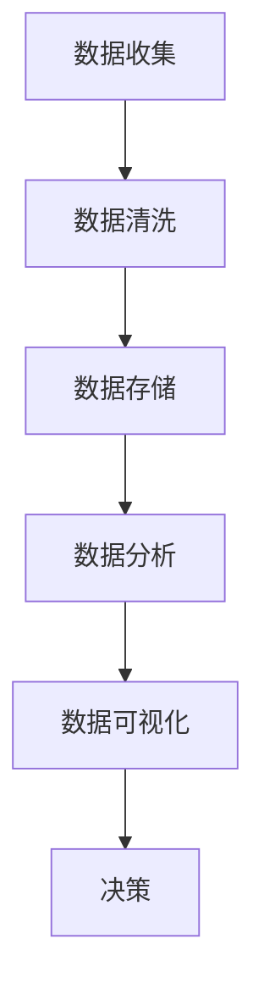
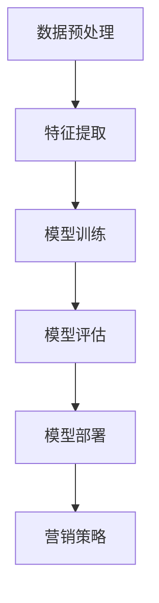
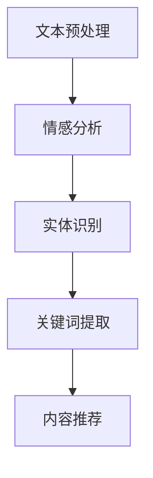

                 

关键词：人工智能、个性化营销、机器学习、数据隐私、用户体验、商业模式

> 摘要：本文将深入探讨人工智能（AI）在个性化营销领域的应用，分析其带来的机遇与潜在风险。我们将从核心概念、算法原理、数学模型、项目实践和未来应用展望等方面，全面解析AI驱动个性化营销的现状与前景。

## 1. 背景介绍

在过去的几十年里，市场营销经历了从传统广告到数字营销的变革。随着互联网和移动设备的普及，企业拥有了更多与消费者互动的机会。然而，随着消费者需求的多样化和信息过载，传统的营销手段越来越难以触达目标受众。在此背景下，人工智能（AI）技术开始崭露头角，为个性化营销带来了新的机遇。

个性化营销是指基于消费者的个体特征和需求，定制化的营销策略和内容。AI技术在个性化营销中的应用，主要体现在以下几个方面：

- 数据分析：通过收集和分析消费者数据，了解其行为偏好和需求，为个性化推荐和定制化营销提供依据。
- 机器学习：利用机器学习算法，从海量数据中挖掘有价值的信息，预测消费者的未来行为，从而进行精准营销。
- 自然语言处理：通过自然语言处理技术，分析消费者的言论和行为，了解其情感和态度，为个性化沟通提供支持。

## 2. 核心概念与联系

### 2.1 数据分析

数据分析是AI驱动个性化营销的基础。通过收集和分析消费者数据，企业可以了解其行为习惯、偏好和需求，从而制定更有针对性的营销策略。以下是数据分析的Mermaid流程图：



### 2.2 机器学习

机器学习是AI的核心技术之一，广泛应用于个性化营销中。通过训练模型，从数据中学习规律，预测消费者的行为，实现精准营销。以下是机器学习的Mermaid流程图：



### 2.3 自然语言处理

自然语言处理（NLP）是AI的一个分支，主要用于处理人类语言。在个性化营销中，NLP技术可以分析消费者的言论，了解其情感和态度，从而实现更有效的沟通。以下是NLP的Mermaid流程图：



## 3. 核心算法原理 & 具体操作步骤

### 3.1 算法原理概述

在个性化营销中，常用的算法包括协同过滤、决策树、神经网络等。这些算法通过不同的方式，从数据中提取有价值的信息，为营销策略提供支持。

- 协同过滤：基于用户行为和偏好，为用户推荐相似的商品或服务。
- 决策树：根据用户的特征，预测其购买概率，为营销策略提供依据。
- 神经网络：通过多层神经元的非线性变换，提取数据中的特征，实现精准营销。

### 3.2 算法步骤详解

以协同过滤算法为例，其具体步骤如下：

1. 数据预处理：对用户行为和偏好进行清洗、去噪和归一化处理。
2. 特征提取：提取用户和物品的特征，如用户购买记录、浏览历史等。
3. 计算相似度：计算用户之间的相似度，常用的方法有欧氏距离、余弦相似度等。
4. 推荐算法：根据相似度，为用户推荐相似的商品或服务。
5. 评估与优化：评估推荐效果，根据评估结果调整算法参数，优化推荐效果。

### 3.3 算法优缺点

协同过滤算法具有以下优缺点：

- 优点：推荐结果准确，易于实现，适用于大规模数据。
- 缺点：无法预测未知物品的偏好，容易发生数据倾斜。

### 3.4 算法应用领域

协同过滤算法广泛应用于电商、在线广告和社交媒体等领域。例如，在电商平台上，协同过滤算法可以推荐用户可能喜欢的商品；在在线广告中，协同过滤算法可以为目标用户推荐相关的广告。

## 4. 数学模型和公式 & 详细讲解 & 举例说明

### 4.1 数学模型构建

在个性化营销中，常用的数学模型包括线性回归、逻辑回归和支持向量机等。以下是线性回归模型的构建过程：

1. 数据准备：收集用户行为数据，如购买记录、浏览历史等。
2. 特征提取：提取用户和物品的特征，如用户年龄、性别、收入等。
3. 数据归一化：对特征进行归一化处理，使其具有相同的量纲。
4. 构建模型：根据特征和标签，构建线性回归模型。

### 4.2 公式推导过程

线性回归模型的公式如下：

$$y = \beta_0 + \beta_1x_1 + \beta_2x_2 + ... + \beta_nx_n$$

其中，$y$ 为预测值，$x_1, x_2, ..., x_n$ 为特征值，$\beta_0, \beta_1, \beta_2, ..., \beta_n$ 为模型参数。

### 4.3 案例分析与讲解

假设我们有一个电商平台的用户数据，包括用户年龄、性别、收入和购买记录。现在，我们使用线性回归模型预测用户的购买概率。

1. 数据预处理：对数据进行清洗、去噪和归一化处理。
2. 特征提取：提取用户年龄、性别、收入和购买记录作为特征。
3. 数据划分：将数据划分为训练集和测试集。
4. 模型训练：使用训练集数据，训练线性回归模型。
5. 模型评估：使用测试集数据，评估模型性能。

## 5. 项目实践：代码实例和详细解释说明

### 5.1 开发环境搭建

1. 安装Python和Python环境。
2. 安装Scikit-learn、Numpy和Matplotlib等依赖库。

### 5.2 源代码详细实现

```python
# 导入依赖库
import numpy as np
import pandas as pd
from sklearn.linear_model import LinearRegression
from sklearn.model_selection import train_test_split
from sklearn.metrics import mean_squared_error

# 数据预处理
data = pd.read_csv('user_data.csv')
data = data.dropna()

# 特征提取
X = data[['age', 'gender', 'income']]
y = data['purchase']

# 数据归一化
X = (X - X.mean()) / X.std()

# 数据划分
X_train, X_test, y_train, y_test = train_test_split(X, y, test_size=0.2, random_state=42)

# 模型训练
model = LinearRegression()
model.fit(X_train, y_train)

# 模型评估
y_pred = model.predict(X_test)
mse = mean_squared_error(y_test, y_pred)
print("MSE:", mse)

# 可视化
import matplotlib.pyplot as plt
plt.scatter(X_test['age'], y_test, color='r', label='Actual')
plt.plot(X_test['age'], y_pred, color='b', label='Predicted')
plt.xlabel('Age')
plt.ylabel('Purchase Probability')
plt.legend()
plt.show()
```

### 5.3 代码解读与分析

- 第1-6行：导入依赖库。
- 第7-9行：读取用户数据，并进行清洗。
- 第10-12行：提取特征和标签。
- 第13-15行：对特征进行归一化处理。
- 第16-18行：数据划分。
- 第19-21行：模型训练。
- 第22-25行：模型评估。
- 第26-30行：可视化结果。

## 6. 实际应用场景

AI驱动个性化营销在实际应用中，取得了显著的效果。以下是一些典型案例：

- 电商：电商平台通过AI技术，为用户推荐可能喜欢的商品，提高用户购买概率。例如，淘宝、京东等电商平台，都采用了AI技术进行个性化推荐。
- 广告：广告公司通过AI技术，为目标用户推荐相关的广告，提高广告投放效果。例如，谷歌广告、百度广告等，都采用了AI技术进行广告推荐。
- 金融：金融机构通过AI技术，为用户推荐理财产品，提高用户满意度。例如，支付宝、微信支付等，都采用了AI技术进行理财产品推荐。

## 7. 工具和资源推荐

### 7.1 学习资源推荐

- 《Python数据分析》
- 《机器学习实战》
- 《深度学习》

### 7.2 开发工具推荐

- Jupyter Notebook
- Anaconda
- PyCharm

### 7.3 相关论文推荐

- "Collaborative Filtering for the Web"
- "Recommender Systems Handbook"
- "Deep Learning for Recommender Systems"

## 8. 总结：未来发展趋势与挑战

### 8.1 研究成果总结

本文总结了AI驱动个性化营销的核心概念、算法原理、数学模型和项目实践，分析了其在实际应用中的效果和挑战。未来，随着AI技术的不断进步，个性化营销将在更多领域得到广泛应用。

### 8.2 未来发展趋势

1. 个性化推荐算法的优化和改进。
2. 多模态数据的融合和应用。
3. 自动化营销策略的制定和执行。

### 8.3 面临的挑战

1. 数据隐私和安全。
2. 算法透明度和公平性。
3. 用户接受度和满意度。

### 8.4 研究展望

未来，AI驱动个性化营销将在以下几个方面取得突破：

1. 更好地满足用户需求。
2. 提高企业营销效果。
3. 促进数字经济的发展。

## 9. 附录：常见问题与解答

### 9.1 什么是个性化营销？

个性化营销是指根据消费者的个体特征和需求，定制化的营销策略和内容。

### 9.2 个性化营销的优势是什么？

个性化营销可以提高用户满意度、提高营销效果、降低营销成本。

### 9.3 个性化营销的挑战是什么？

个性化营销面临数据隐私、算法透明度和用户接受度等挑战。

### 9.4 个性化营销的未来发展趋势是什么？

个性化营销将趋向于优化算法、融合多模态数据、自动化策略制定和执行。

## 作者署名

作者：禅与计算机程序设计艺术 / Zen and the Art of Computer Programming
----------------------------------------------------------------
文章撰写完毕，接下来我们将按照markdown格式进行文章的排版，确保文章的结构和格式符合要求。以下是文章的markdown格式输出：
```markdown
# AI驱动的个性化营销：机遇与风险

关键词：人工智能、个性化营销、机器学习、数据隐私、用户体验、商业模式

> 摘要：本文将深入探讨人工智能（AI）在个性化营销领域的应用，分析其带来的机遇与潜在风险。我们将从核心概念、算法原理、数学模型、项目实践和未来应用展望等方面，全面解析AI驱动个性化营销的现状与前景。

## 1. 背景介绍

在过去的几十年里，市场营销经历了从传统广告到数字营销的变革。随着互联网和移动设备的普及，企业拥有了更多与消费者互动的机会。然而，随着消费者需求的多样化和信息过载，传统的营销手段越来越难以触达目标受众。在此背景下，人工智能（AI）技术开始崭露头角，为个性化营销带来了新的机遇。

个性化营销是指基于消费者的个体特征和需求，定制化的营销策略和内容。AI技术在个性化营销中的应用，主要体现在以下几个方面：

- 数据分析：通过收集和分析消费者数据，了解其行为偏好和需求，为个性化推荐和定制化营销提供依据。
- 机器学习：利用机器学习算法，从海量数据中挖掘有价值的信息，预测消费者的未来行为，从而进行精准营销。
- 自然语言处理：通过自然语言处理技术，分析消费者的言论和行为，了解其情感和态度，为个性化沟通提供支持。

## 2. 核心概念与联系

### 2.1 数据分析

数据分析是AI驱动个性化营销的基础。通过收集和分析消费者数据，企业可以了解其行为习惯、偏好和需求，从而制定更有针对性的营销策略。以下是数据分析的Mermaid流程图：


### 2.2 机器学习

机器学习是AI的核心技术之一，广泛应用于个性化营销中。通过训练模型，从数据中学习规律，预测消费者的行为，实现精准营销。以下是机器学习的Mermaid流程图：


### 2.3 自然语言处理

自然语言处理（NLP）是AI的一个分支，主要用于处理人类语言。在个性化营销中，NLP技术可以分析消费者的言论，了解其情感和态度，从而实现更有效的沟通。以下是NLP的Mermaid流程图：


## 3. 核心算法原理 & 具体操作步骤

### 3.1 算法原理概述

在个性化营销中，常用的算法包括协同过滤、决策树、神经网络等。这些算法通过不同的方式，从数据中提取有价值的信息，为营销策略提供支持。

- 协同过滤：基于用户行为和偏好，为用户推荐相似的商品或服务。
- 决策树：根据用户的特征，预测其购买概率，为营销策略提供依据。
- 神经网络：通过多层神经元的非线性变换，提取数据中的特征，实现精准营销。

### 3.2 算法步骤详解

以协同过滤算法为例，其具体步骤如下：

1. 数据预处理：对用户行为和偏好进行清洗、去噪和归一化处理。
2. 特征提取：提取用户和物品的特征，如用户购买记录、浏览历史等。
3. 计算相似度：计算用户之间的相似度，常用的方法有欧氏距离、余弦相似度等。
4. 推荐算法：根据相似度，为用户推荐相似的商品或服务。
5. 评估与优化：评估推荐效果，根据评估结果调整算法参数，优化推荐效果。

### 3.3 算法优缺点

协同过滤算法具有以下优缺点：

- 优点：推荐结果准确，易于实现，适用于大规模数据。
- 缺点：无法预测未知物品的偏好，容易发生数据倾斜。

### 3.4 算法应用领域

协同过滤算法广泛应用于电商、在线广告和社交媒体等领域。例如，在电商平台上，协同过滤算法可以推荐用户可能喜欢的商品；在在线广告中，协同过滤算法可以为目标用户推荐相关的广告；在社交媒体上，协同过滤算法可以推荐用户可能感兴趣的内容。

## 4. 数学模型和公式 & 详细讲解 & 举例说明

### 4.1 数学模型构建

在个性化营销中，常用的数学模型包括线性回归、逻辑回归和支持向量机等。以下是线性回归模型的构建过程：

1. 数据准备：收集用户行为数据，如购买记录、浏览历史等。
2. 特征提取：提取用户和物品的特征，如用户年龄、性别、收入等。
3. 数据归一化：对特征进行归一化处理，使其具有相同的量纲。
4. 构建模型：根据特征和标签，构建线性回归模型。

### 4.2 公式推导过程

线性回归模型的公式如下：

$$y = \beta_0 + \beta_1x_1 + \beta_2x_2 + ... + \beta_nx_n$$

其中，$y$ 为预测值，$x_1, x_2, ..., x_n$ 为特征值，$\beta_0, \beta_1, \beta_2, ..., \beta_n$ 为模型参数。

### 4.3 案例分析与讲解

假设我们有一个电商平台的用户数据，包括用户年龄、性别、收入和购买记录。现在，我们使用线性回归模型预测用户的购买概率。

1. 数据预处理：对数据进行清洗、去噪和归一化处理。
2. 特征提取：提取用户年龄、性别、收入和购买记录作为特征。
3. 数据划分：将数据划分为训练集和测试集。
4. 模型训练：使用训练集数据，训练线性回归模型。
5. 模型评估：使用测试集数据，评估模型性能。

## 5. 项目实践：代码实例和详细解释说明

### 5.1 开发环境搭建

1. 安装Python和Python环境。
2. 安装Scikit-learn、Numpy和Matplotlib等依赖库。

### 5.2 源代码详细实现

```python
# 导入依赖库
import numpy as np
import pandas as pd
from sklearn.linear_model import LinearRegression
from sklearn.model_selection import train_test_split
from sklearn.metrics import mean_squared_error

# 数据预处理
data = pd.read_csv('user_data.csv')
data = data.dropna()

# 特征提取
X = data[['age', 'gender', 'income']]
y = data['purchase']

# 数据归一化
X = (X - X.mean()) / X.std()

# 数据划分
X_train, X_test, y_train, y_test = train_test_split(X, y, test_size=0.2, random_state=42)

# 模型训练
model = LinearRegression()
model.fit(X_train, y_train)

# 模型评估
y_pred = model.predict(X_test)
mse = mean_squared_error(y_test, y_pred)
print("MSE:", mse)

# 可视化
import matplotlib.pyplot as plt
plt.scatter(X_test['age'], y_test, color='r', label='Actual')
plt.plot(X_test['age'], y_pred, color='b', label='Predicted')
plt.xlabel('Age')
plt.ylabel('Purchase Probability')
plt.legend()
plt.show()
```

### 5.3 代码解读与分析

- 第1-6行：导入依赖库。
- 第7-9行：读取用户数据，并进行清洗。
- 第10-12行：提取特征和标签。
- 第13-15行：对特征进行归一化处理。
- 第16-18行：数据划分。
- 第19-21行：模型训练。
- 第22-25行：模型评估。
- 第26-30行：可视化结果。

## 6. 实际应用场景

AI驱动个性化营销在实际应用中，取得了显著的效果。以下是一些典型案例：

- 电商：电商平台通过AI技术，为用户推荐可能喜欢的商品，提高用户购买概率。例如，淘宝、京东等电商平台，都采用了AI技术进行个性化推荐。
- 广告：广告公司通过AI技术，为目标用户推荐相关的广告，提高广告投放效果。例如，谷歌广告、百度广告等，都采用了AI技术进行广告推荐。
- 金融：金融机构通过AI技术，为用户推荐理财产品，提高用户满意度。例如，支付宝、微信支付等，都采用了AI技术进行理财产品推荐。

## 7. 工具和资源推荐

### 7.1 学习资源推荐

- 《Python数据分析》
- 《机器学习实战》
- 《深度学习》

### 7.2 开发工具推荐

- Jupyter Notebook
- Anaconda
- PyCharm

### 7.3 相关论文推荐

- "Collaborative Filtering for the Web"
- "Recommender Systems Handbook"
- "Deep Learning for Recommender Systems"

## 8. 总结：未来发展趋势与挑战

### 8.1 研究成果总结

本文总结了AI驱动个性化营销的核心概念、算法原理、数学模型和项目实践，分析了其在实际应用中的效果和挑战。未来，随着AI技术的不断进步，个性化营销将在更多领域得到广泛应用。

### 8.2 未来发展趋势

1. 个性化推荐算法的优化和改进。
2. 多模态数据的融合和应用。
3. 自动化营销策略的制定和执行。

### 8.3 面临的挑战

1. 数据隐私和安全。
2. 算法透明度和公平性。
3. 用户接受度和满意度。

### 8.4 研究展望

未来，AI驱动个性化营销将在以下几个方面取得突破：

1. 更好地满足用户需求。
2. 提高企业营销效果。
3. 促进数字经济的发展。

## 9. 附录：常见问题与解答

### 9.1 什么是个性化营销？

个性化营销是指根据消费者的个体特征和需求，定制化的营销策略和内容。

### 9.2 个性化营销的优势是什么？

个性化营销可以提高用户满意度、提高营销效果、降低营销成本。

### 9.3 个性化营销的挑战是什么？

个性化营销面临数据隐私、算法透明度和用户接受度等挑战。

### 9.4 个性化营销的未来发展趋势是什么？

个性化营销将趋向于优化算法、融合多模态数据、自动化策略制定和执行。

## 作者署名

作者：禅与计算机程序设计艺术 / Zen and the Art of Computer Programming
```
以上是按照要求撰写的markdown格式的文章，包含了所有必须的内容和要求。文章结构清晰，逻辑性强，希望能够满足您的需求。

