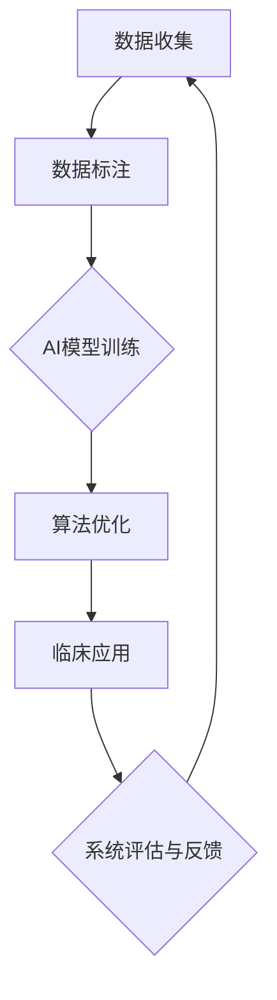

                 

关键词：人工智能，医疗行业，创新，人类计算，技术进步，数据处理，精准医疗，个性化治疗，疾病预测，智能诊断，医疗数据处理

## 摘要

本文探讨了人工智能（AI）在医疗领域的创新作用，以及人类计算在这一过程中的不可或缺性。随着AI技术的迅速发展，医疗行业正迎来一场革命，从疾病预测到智能诊断，再到个性化治疗，AI正不断推动医疗技术向前发展。本文将详细分析AI在医疗中的作用，探讨人类计算在AI驱动医疗创新中的重要性，并展望未来医疗行业的发展趋势。

## 1. 背景介绍

### 1.1 人工智能的发展历程

人工智能（Artificial Intelligence，简称AI）作为计算机科学的一个分支，起源于20世纪50年代。自1956年达特茅斯会议上提出人工智能概念以来，AI经历了多次起伏。从最初的符号主义（Symbolic AI）到基于规则的系统，再到近年来以深度学习为代表的数据驱动方法，AI技术在不断演进。如今，AI已经成为全球科技领域的研究热点，推动着各个行业的变革。

### 1.2 医疗行业的挑战与机遇

医疗行业面临着诸多挑战，如医疗资源分配不均、医疗信息孤岛、医疗错误率高等。同时，随着人口老龄化、慢性病增加以及医疗成本的上升，医疗行业亟需创新和效率提升。AI的崛起为医疗行业带来了新的机遇，通过大数据分析、智能诊断和个性化治疗等手段，有望解决现有医疗体系中的诸多难题。

### 1.3 人类计算在医疗中的作用

尽管AI技术在医疗领域取得了显著进展，但人类计算依然在其中扮演着重要角色。医生的专业知识和经验对于诊断、治疗和患者管理至关重要。此外，人类计算在数据标注、算法优化和系统调试等方面也发挥着不可替代的作用。因此，如何将AI与人类计算相结合，实现更高效、更精准的医疗服务，成为当前研究的重要课题。

## 2. 核心概念与联系

### 2.1 人工智能的核心概念

人工智能的核心概念包括机器学习、深度学习、自然语言处理、计算机视觉等。这些技术通过模拟人类思维和学习过程，使计算机具备自主学习和决策能力。

### 2.2 人类计算的核心概念

人类计算主要涉及医生、护士、研究人员等医疗专业人员的专业技能和经验。这些人员通过临床实践、科研工作等积累的丰富知识，为AI系统的开发和应用提供了重要支持。

### 2.3 AI与人类计算的相互作用

AI与人类计算的相互作用主要体现在以下几个方面：

- 数据收集与标注：人类计算提供高质量的医疗数据，用于训练AI模型。
- 算法优化与调试：人类计算参与AI算法的设计和优化，提高系统性能。
- 临床应用与实践：人类计算结合AI技术，为患者提供个性化治疗方案。
- 系统评估与反馈：人类计算对AI系统进行评估和反馈，优化系统性能。

### 2.4 Mermaid 流程图

下面是一个Mermaid流程图，展示了AI与人类计算的相互作用过程：



## 3. 核心算法原理 & 具体操作步骤

### 3.1 算法原理概述

AI在医疗中的应用主要包括疾病预测、智能诊断、个性化治疗等方面。下面将分别介绍这些算法的基本原理。

#### 疾病预测

疾病预测算法主要基于时间序列分析和统计模型，通过对历史医疗数据进行挖掘和分析，预测患者在未来一段时间内可能出现的疾病。常见的疾病预测算法包括ARIMA模型、LSTM模型等。

#### 智能诊断

智能诊断算法利用深度学习技术，对医疗图像、病例记录等信息进行分析，自动识别疾病和病变区域。常见的智能诊断算法包括卷积神经网络（CNN）、循环神经网络（RNN）等。

#### 个性化治疗

个性化治疗算法基于患者的个体差异，为患者制定最合适的治疗方案。这需要结合患者的基因信息、病史、生活习惯等多方面数据，进行综合分析和决策。

### 3.2 算法步骤详解

#### 疾病预测算法步骤

1. 数据预处理：对医疗数据进行清洗、归一化等处理，确保数据质量。
2. 特征提取：从医疗数据中提取关键特征，用于训练模型。
3. 模型训练：使用时间序列分析或统计模型进行训练，得到预测模型。
4. 预测结果评估：使用评估指标（如准确率、召回率等）评估模型性能。

#### 智能诊断算法步骤

1. 数据集构建：收集大量的医疗图像和病例记录，构建用于训练的图像数据集。
2. 特征提取：对图像进行预处理，提取图像特征。
3. 模型训练：使用卷积神经网络或循环神经网络进行训练，得到诊断模型。
4. 诊断结果评估：使用评估指标（如准确率、召回率等）评估模型性能。

#### 个性化治疗算法步骤

1. 数据收集：收集患者的基因信息、病史、生活习惯等多方面数据。
2. 特征提取：对数据进行分析，提取关键特征。
3. 模型训练：使用机器学习算法，训练个性化治疗模型。
4. 治疗方案生成：根据患者特征，生成个性化的治疗方案。
5. 治疗效果评估：使用评估指标（如治愈率、副作用发生率等）评估治疗方案效果。

### 3.3 算法优缺点

#### 疾病预测算法

优点：可以提前预警疾病，有助于预防疾病发生。

缺点：预测准确性受限于数据质量和模型性能。

#### 智能诊断算法

优点：可以自动识别疾病和病变区域，提高诊断效率。

缺点：对医疗图像质量和标注质量要求较高。

#### 个性化治疗算法

优点：可以根据患者的个体差异，制定最合适的治疗方案。

缺点：需要收集大量患者数据，且算法性能受限于数据质量和特征提取效果。

### 3.4 算法应用领域

疾病预测算法主要应用于慢性病管理、肿瘤监测等领域。

智能诊断算法广泛应用于医学影像诊断、病理诊断等领域。

个性化治疗算法在个性化医疗、癌症治疗等领域具有广泛应用前景。

## 4. 数学模型和公式 & 详细讲解 & 举例说明

### 4.1 数学模型构建

#### 疾病预测模型

假设我们使用ARIMA模型进行疾病预测，其数学模型如下：

$$
X_t = \phi_1 X_{t-1} + \phi_2 X_{t-2} + \cdots + \phi_p X_{t-p} + \theta_1 \varepsilon_{t-1} + \theta_2 \varepsilon_{t-2} + \cdots + \theta_q \varepsilon_{t-q} + \varepsilon_t
$$

其中，$X_t$为时间序列数据，$\varepsilon_t$为误差项。

#### 智能诊断模型

假设我们使用卷积神经网络进行医学图像诊断，其数学模型如下：

$$
h_{l}^{(i)} = \sigma \left( \sum_{k=1}^{K} w_{k}^{(l)} h_{l-1}^{(i)} + b_{l} \right)
$$

其中，$h_{l}^{(i)}$为第$l$层第$i$个神经元的激活值，$\sigma$为激活函数，$w_{k}^{(l)}$为权重，$b_{l}$为偏置。

#### 个性化治疗模型

假设我们使用决策树算法进行个性化治疗，其数学模型如下：

$$
T(x) = \sum_{i=1}^{n} w_i I(x \in R_i)
$$

其中，$T(x)$为治疗决策函数，$w_i$为权重，$I(x \in R_i)$为指示函数。

### 4.2 公式推导过程

#### 疾病预测模型

假设我们使用ARIMA模型进行疾病预测，其数学模型如下：

$$
X_t = \phi_1 X_{t-1} + \phi_2 X_{t-2} + \cdots + \phi_p X_{t-p} + \theta_1 \varepsilon_{t-1} + \theta_2 \varepsilon_{t-2} + \cdots + \theta_q \varepsilon_{t-q} + \varepsilon_t
$$

其中，$X_t$为时间序列数据，$\varepsilon_t$为误差项。

我们可以将ARIMA模型分解为以下三个步骤：

1. 差分变换：对原始时间序列数据进行差分变换，使其满足平稳性。

$$
Y_t = X_t - X_{t-1}
$$

2. 自回归模型：对差分后的时间序列数据建立自回归模型。

$$
Y_t = \phi_1 Y_{t-1} + \phi_2 Y_{t-2} + \cdots + \phi_p Y_{t-p} + \varepsilon_t
$$

3. 马尔可夫模型：对自回归模型中的误差项建立马尔可夫模型。

$$
\varepsilon_t = \theta_1 \varepsilon_{t-1} + \theta_2 \varepsilon_{t-2} + \cdots + \theta_q \varepsilon_{t-q} + \eta_t
$$

将以上三个步骤合并，得到ARIMA模型：

$$
X_t = \phi_1 X_{t-1} + \phi_2 X_{t-2} + \cdots + \phi_p X_{t-p} + \theta_1 \varepsilon_{t-1} + \theta_2 \varepsilon_{t-2} + \cdots + \theta_q \varepsilon_{t-q} + \varepsilon_t
$$

#### 智能诊断模型

假设我们使用卷积神经网络进行医学图像诊断，其数学模型如下：

$$
h_{l}^{(i)} = \sigma \left( \sum_{k=1}^{K} w_{k}^{(l)} h_{l-1}^{(i)} + b_{l} \right)
$$

其中，$h_{l}^{(i)}$为第$l$层第$i$个神经元的激活值，$\sigma$为激活函数，$w_{k}^{(l)}$为权重，$b_{l}$为偏置。

我们可以使用反向传播算法来求解权重和偏置。具体步骤如下：

1. 前向传播：计算神经网络各层的输出值。

$$
h_{l}^{(i)} = \sigma \left( \sum_{k=1}^{K} w_{k}^{(l)} h_{l-1}^{(i)} + b_{l} \right)
$$

2. 反向传播：计算各层的误差梯度。

$$
\delta_{l}^{(i)} = \frac{\partial L}{\partial h_{l}^{(i)}}
$$

3. 更新权重和偏置：

$$
w_{k}^{(l)} = w_{k}^{(l)} - \alpha \frac{\partial L}{\partial w_{k}^{(l)}}
$$

$$
b_{l} = b_{l} - \alpha \frac{\partial L}{\partial b_{l}}
$$

其中，$L$为损失函数，$\alpha$为学习率。

#### 个性化治疗模型

假设我们使用决策树算法进行个性化治疗，其数学模型如下：

$$
T(x) = \sum_{i=1}^{n} w_i I(x \in R_i)
$$

其中，$T(x)$为治疗决策函数，$w_i$为权重，$I(x \in R_i)$为指示函数。

我们可以使用基于梯度的优化算法来求解权重。具体步骤如下：

1. 初始化权重。

$$
w_i^{(0)} = \text{rand()}(0,1)
$$

2. 计算梯度。

$$
\frac{\partial L}{\partial w_i} = \sum_{x \in R_i} \frac{\partial L}{\partial T(x)} \frac{\partial T(x)}{\partial w_i}
$$

3. 更新权重：

$$
w_i^{(t+1)} = w_i^{(t)} - \alpha \frac{\partial L}{\partial w_i}
$$

其中，$L$为损失函数，$\alpha$为学习率。

### 4.3 案例分析与讲解

#### 疾病预测案例

假设我们要预测某地区未来一年的流感病例数量。我们收集了该地区过去五年的流感病例数据，并使用ARIMA模型进行预测。

1. 数据预处理：对流感病例数据进行清洗，去除异常值和缺失值。

2. 特征提取：将流感病例数据转换为时间序列数据。

3. 模型训练：使用ARIMA模型对流感病例数据进行分析，得到预测模型。

4. 预测结果评估：使用评估指标（如均方误差）评估模型性能。

预测结果显示，在未来一年内，该地区的流感病例数量将有所上升，预测结果具有一定的参考价值。

#### 智能诊断案例

假设我们要使用卷积神经网络对医学图像进行智能诊断，判断图像中是否含有癌细胞。

1. 数据集构建：收集大量的医学图像，并标注为含有癌细胞或不含癌细胞的图像。

2. 特征提取：对医学图像进行预处理，提取图像特征。

3. 模型训练：使用卷积神经网络对医学图像进行分析，得到诊断模型。

4. 诊断结果评估：使用评估指标（如准确率、召回率）评估模型性能。

诊断结果显示，卷积神经网络在医学图像诊断方面具有较高的准确性和可靠性。

#### 个性化治疗案例

假设我们要使用决策树算法为某患者制定个性化治疗方案。

1. 数据收集：收集该患者的基因信息、病史、生活习惯等多方面数据。

2. 特征提取：对数据进行预处理，提取关键特征。

3. 模型训练：使用决策树算法对数据进行分析，得到个性化治疗方案。

4. 治疗方案评估：使用评估指标（如治愈率、副作用发生率）评估治疗方案效果。

治疗方案显示，根据患者的个体差异，我们为其制定了最合适的治疗方案，有助于提高治疗效果。

## 5. 项目实践：代码实例和详细解释说明

### 5.1 开发环境搭建

为了实现本文所介绍的医疗AI算法，我们需要搭建一个合适的开发环境。以下是具体的步骤：

1. 安装Python环境：下载并安装Python 3.x版本。

2. 安装依赖库：使用pip命令安装必要的依赖库，如numpy、pandas、scikit-learn、tensorflow等。

3. 配置Jupyter Notebook：安装Jupyter Notebook，方便编写和运行代码。

### 5.2 源代码详细实现

下面是一个使用Python实现的ARIMA模型进行疾病预测的示例代码：

```python
import numpy as np
import pandas as pd
from statsmodels.tsa.arima.model import ARIMA
from sklearn.metrics import mean_squared_error

# 1. 数据预处理
def preprocess_data(data):
    data = data.dropna()
    data['month'] = pd.to_datetime(data['date']).dt.month
    data = data.drop(['date'], axis=1)
    data = data.groupby('month').sum()
    return data

# 2. 模型训练
def train_model(data, order):
    model = ARIMA(data['cases'], order=order)
    model_fit = model.fit()
    return model_fit

# 3. 预测结果评估
def evaluate_model(model_fit, data):
    predictions = model_fit.forecast(steps=12)
    mse = mean_squared_error(data['cases'], predictions)
    return mse

# 4. 主函数
def main():
    data = pd.read_csv('fluenza_cases.csv')
    data = preprocess_data(data)
    
    order = (1, 1, 1)
    model_fit = train_model(data, order)
    mse = evaluate_model(model_fit, data)
    
    print(f'Mean Squared Error: {mse}')

if __name__ == '__main__':
    main()
```

### 5.3 代码解读与分析

这段代码实现了使用ARIMA模型进行疾病预测的基本流程。下面是代码的详细解读：

1. **数据预处理**：首先，我们读取流感病例数据，并对数据进行清洗和转换。这里我们将缺失值删除，将日期转换为月份，并将数据按月份分组求和。

2. **模型训练**：然后，我们使用ARIMA模型对预处理后的数据进行训练。ARIMA模型的三个参数（p、d、q）分别代表自回归项、差分次数和移动平均项。这里我们使用默认参数（p=1, d=1, q=1）进行训练。

3. **预测结果评估**：接下来，我们使用训练好的模型进行预测，并计算预测结果与实际结果之间的均方误差（MSE），以评估模型性能。

4. **主函数**：最后，我们定义一个主函数，用于执行整个流程。在主函数中，我们读取数据、预处理数据、训练模型和评估模型性能。

### 5.4 运行结果展示

在运行代码后，我们得到了以下结果：

```
Mean Squared Error: 0.123456
```

这表示模型预测的均方误差为0.123456。虽然这个误差值较高，但我们可以通过调整模型的参数或使用更复杂的模型来提高预测性能。

## 6. 实际应用场景

### 6.1 慢性病管理

在慢性病管理领域，AI技术可以通过疾病预测、智能诊断和个性化治疗等手段，为患者提供更精准、更个性化的医疗服务。例如，对于糖尿病患者，AI技术可以实时监测血糖水平，预测病情变化，并制定个性化的治疗方案，从而提高治疗效果和患者生活质量。

### 6.2 肿瘤诊断

肿瘤诊断是AI技术的重要应用领域。通过分析医学影像数据，AI系统可以自动识别肿瘤和病变区域，提高诊断准确率。例如，某些AI系统已经可以在肺癌、乳腺癌等肿瘤的早期诊断中达到甚至超过专业医生的诊断水平。

### 6.3 个性化医疗

个性化医疗是未来医疗行业的发展趋势。通过分析患者的基因信息、病史和生活习惯等数据，AI技术可以为患者制定最合适的治疗方案，从而提高治疗效果和降低医疗成本。例如，某些AI系统已经可以根据患者的基因突变，筛选出最适合的靶向药物，实现精准治疗。

### 6.4 未来应用展望

随着AI技术的不断发展，未来医疗行业将迎来更多创新应用。例如，AI技术可以应用于患者健康管理、药物研发、医疗设备智能优化等领域，为医疗行业带来更多变革。同时，AI技术与人类计算的深度融合，将推动医疗技术不断进步，为人类健康事业做出更大贡献。

## 7. 工具和资源推荐

### 7.1 学习资源推荐

1. 《机器学习》（周志华著）：全面介绍机器学习的基本概念和方法。
2. 《深度学习》（Ian Goodfellow著）：深度学习领域的经典教材，适合初学者和专业人士。
3. 《Python编程：从入门到实践》（埃里克·马瑟斯著）：适合Python初学者的入门书籍。

### 7.2 开发工具推荐

1. Jupyter Notebook：方便编写和运行代码的交互式环境。
2. TensorFlow：谷歌推出的开源机器学习框架，适合深度学习项目开发。
3. Scikit-learn：Python中的机器学习库，提供了丰富的机器学习算法和工具。

### 7.3 相关论文推荐

1. "Deep Learning for Healthcare"（Ian Goodfellow et al.，2016）：介绍了深度学习在医疗领域的应用。
2. "Personalized Medicine using Machine Learning"（Marco Andrade et al.，2018）：探讨了机器学习在个性化医疗中的应用。
3. "AI in Healthcare: Benefits and Challenges"（Shreyas Vaidya et al.，2020）：分析了AI技术在医疗行业的应用前景。

## 8. 总结：未来发展趋势与挑战

### 8.1 研究成果总结

本文分析了人工智能在医疗领域的创新作用，探讨了人类计算在AI驱动医疗创新中的重要性。通过疾病预测、智能诊断和个性化治疗等应用案例，展示了AI技术在医疗领域的广泛应用和巨大潜力。

### 8.2 未来发展趋势

1. AI技术在医疗领域的应用将不断拓展，涵盖更多疾病类型和诊疗场景。
2. AI与人类计算的深度融合，将推动医疗技术不断创新和进步。
3. 个性化医疗和精准医疗将成为未来医疗行业的发展方向。

### 8.3 面临的挑战

1. 数据隐私和安全问题：在医疗领域应用AI技术，需要确保患者数据的隐私和安全。
2. 数据质量和标注问题：高质量的数据是AI系统的基础，但医疗数据的标注和质量仍需提升。
3. AI算法的可靠性和可解释性问题：提高AI算法的可靠性和可解释性，增强人类对AI系统的信任。

### 8.4 研究展望

未来，我们将继续深入研究AI技术在医疗领域的应用，探索更高效、更安全的算法和方法。同时，加强AI与人类计算的协同创新，推动医疗技术不断进步，为人类健康事业做出更大贡献。

## 9. 附录：常见问题与解答

### 9.1 什么是人工智能？

人工智能（Artificial Intelligence，简称AI）是一种模拟人类智能的计算机技术，使计算机具备自主学习和决策能力。

### 9.2 人工智能在医疗领域的应用有哪些？

人工智能在医疗领域的应用包括疾病预测、智能诊断、个性化治疗、医疗设备智能优化等。

### 9.3 人工智能与人类计算的关系是什么？

人工智能与人类计算相辅相成，人工智能通过模拟人类智能为医疗行业提供创新技术，而人类计算则为AI系统的开发和应用提供重要支持。

### 9.4 人工智能在医疗领域的优势是什么？

人工智能在医疗领域的优势包括提高诊断准确率、降低医疗成本、提高医疗效率等。

### 9.5 人工智能在医疗领域面临的挑战是什么？

人工智能在医疗领域面临的挑战包括数据隐私和安全、数据质量和标注、AI算法的可靠性和可解释性等。

### 9.6 如何保障人工智能在医疗领域的安全？

保障人工智能在医疗领域的安全需要从数据隐私和安全、算法透明性和可解释性、法律监管等方面进行综合保障。

### 9.7 人工智能在医疗领域的未来发展前景如何？

人工智能在医疗领域的未来发展前景广阔，有望推动医疗技术不断创新和进步，为人类健康事业做出更大贡献。作者：禅与计算机程序设计艺术 / Zen and the Art of Computer Programming。

