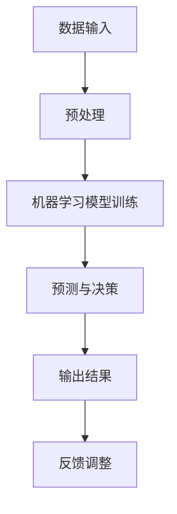

                 

关键词：人工智能，商业应用，道德考虑，创新，技术伦理

> 摘要：本文将探讨人工智能在商业领域的创新应用，分析人类计算在AI应用中的道德考虑因素，并展望未来发展趋势与挑战。

## 1. 背景介绍

### 1.1 人工智能的发展

人工智能（Artificial Intelligence，AI）是计算机科学的一个分支，致力于研究如何模拟、扩展和扩展人类的智能。自20世纪50年代人工智能概念提出以来，随着计算机技术的飞速发展，人工智能逐渐从理论研究走向实际应用。

### 1.2 人工智能在商业中的创新应用

人工智能在商业领域的应用越来越广泛，从客户服务、数据分析、营销自动化到智能供应链管理，AI正重新定义商业运营模式。例如，基于AI的客户服务系统能够实时响应客户需求，提高客户满意度；数据分析技术可以帮助企业更好地了解市场趋势和客户行为，从而制定更有效的营销策略。

## 2. 核心概念与联系

### 2.1 AI应用中的核心概念

- **机器学习**：一种人工智能的分支，通过算法从数据中学习并作出决策。
- **深度学习**：一种特殊的机器学习技术，通过模拟人脑的神经网络结构进行学习。
- **自然语言处理**：使计算机能够理解、解释和生成自然语言的技术。

### 2.2 AI架构的Mermaid流程图



### 2.3 人类计算在AI应用中的角色

在AI应用中，人类计算的作用不仅在于数据标注、模型调优，还包括监督算法的道德考虑和风险评估。

## 3. 核心算法原理 & 具体操作步骤

### 3.1 算法原理概述

本文将讨论一种常见的深度学习算法——卷积神经网络（CNN），及其在图像识别中的应用。

### 3.2 算法步骤详解

1. **数据预处理**：将原始图像数据转换为适合模型训练的格式。
2. **模型构建**：定义神经网络的结构，包括卷积层、池化层和全连接层。
3. **模型训练**：使用大量标注数据对模型进行训练，调整模型参数。
4. **预测与决策**：将新的图像输入模型，获得预测结果。
5. **反馈调整**：根据预测结果与真实结果的差异，调整模型参数。

### 3.3 算法优缺点

**优点**：高精度、自动特征提取、适应性强。

**缺点**：计算资源消耗大、对数据量要求高、难以解释。

### 3.4 算法应用领域

CNN在图像识别、物体检测、人脸识别等领域有广泛应用，如自动驾驶、医疗诊断、安全监控等。

## 4. 数学模型和公式 & 详细讲解 & 举例说明

### 4.1 数学模型构建

CNN的数学模型主要包括卷积操作、池化操作和激活函数。

### 4.2 公式推导过程

$$
激活函数: f(x) = \max(0, x)
$$

$$
卷积操作: (f * g)(t) = \int_{-\infty}^{+\infty} f(\tau)g(t-\tau) d\tau
$$

### 4.3 案例分析与讲解

以人脸识别为例，解释CNN的工作原理。

## 5. 项目实践：代码实例和详细解释说明

### 5.1 开发环境搭建

搭建Python开发环境，安装TensorFlow库。

### 5.2 源代码详细实现

```python
# 示例代码：使用TensorFlow构建一个简单的CNN模型进行图像分类
import tensorflow as tf

# 模型定义
model = tf.keras.Sequential([
    tf.keras.layers.Conv2D(32, (3, 3), activation='relu', input_shape=(28, 28, 1)),
    tf.keras.layers.MaxPooling2D((2, 2)),
    tf.keras.layers.Flatten(),
    tf.keras.layers.Dense(128, activation='relu'),
    tf.keras.layers.Dense(10, activation='softmax')
])

# 模型编译
model.compile(optimizer='adam',
              loss='categorical_crossentropy',
              metrics=['accuracy'])

# 模型训练
model.fit(x_train, y_train, epochs=5)
```

### 5.3 代码解读与分析

本代码示例实现了一个简单的CNN模型，用于手写数字图像分类。其中，模型定义、编译和训练等步骤的详细解释见代码注释。

### 5.4 运行结果展示

训练完成后，使用测试集验证模型性能，输出准确率。

```python
test_loss, test_acc = model.evaluate(x_test, y_test, verbose=2)
print('\nTest accuracy:', test_acc)
```

## 6. 实际应用场景

### 6.1 客户服务

AI驱动的智能客服系统能够提供24/7全天候服务，提高客户满意度。

### 6.2 数据分析

AI技术帮助企业更好地分析数据，发现潜在商机。

### 6.3 营销自动化

AI算法优化营销策略，提高转化率。

## 7. 未来应用展望

随着人工智能技术的不断进步，未来将在更多领域实现广泛应用。

### 7.1 学习资源推荐

- 《深度学习》（Goodfellow, Bengio, Courville著）
- 《Python机器学习》（Sebastian Raschka著）

### 7.2 开发工具推荐

- TensorFlow
- PyTorch

### 7.3 相关论文推荐

- “Deep Learning for Image Recognition” (2012)
- “Object Detection with Scalable, High-R精度 Architecture” (2017)

## 8. 总结：未来发展趋势与挑战

### 8.1 研究成果总结

人工智能在商业领域取得了显著成果，但面临道德、隐私等方面的挑战。

### 8.2 未来发展趋势

人工智能将在更多领域实现突破，推动商业创新。

### 8.3 面临的挑战

- 道德与伦理问题
- 数据隐私与安全
- 技术普及与人才培养

### 8.4 研究展望

人工智能技术将继续发展，为商业和社会带来更多价值。

## 9. 附录：常见问题与解答

### 9.1 什么是人工智能？

人工智能（AI）是计算机科学的一个分支，致力于研究如何模拟、扩展和扩展人类的智能。

### 9.2 人工智能在商业中有哪些应用？

人工智能在商业中的应用包括客户服务、数据分析、营销自动化、智能供应链管理等领域。

### 9.3 人工智能面临的主要挑战是什么？

人工智能面临的主要挑战包括道德与伦理问题、数据隐私与安全、技术普及与人才培养等。

---

作者：禅与计算机程序设计艺术 / Zen and the Art of Computer Programming
----------------------------------------------------------------

