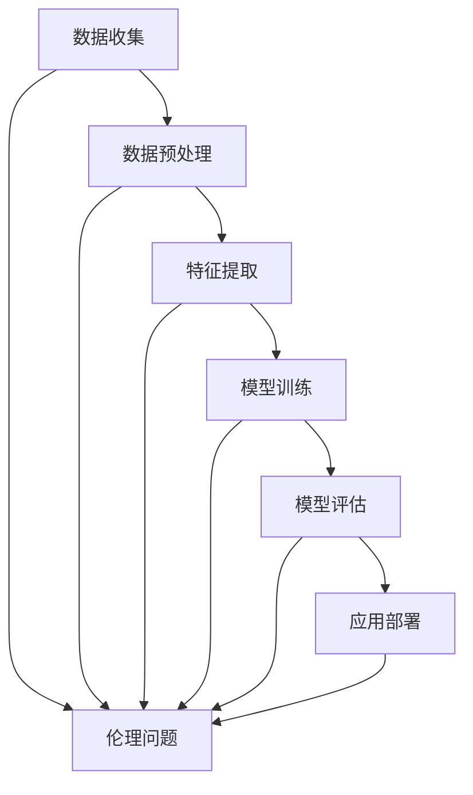

                 

关键词：人工智能、商业应用、伦理问题、道德决策、创新

摘要：本文探讨了人工智能在商业领域的广泛应用及其带来的伦理和道德问题。通过分析人工智能技术的核心概念、算法原理、数学模型及其应用场景，本文提出了人类计算在商业中的道德考虑因素与挑战，并对未来发展趋势和面临的挑战进行了展望。

## 1. 背景介绍

随着人工智能技术的迅猛发展，越来越多的商业领域开始利用人工智能技术提升效率和创新能力。从智能客服、推荐系统到自动驾驶、金融风控，人工智能的应用已经深入到商业的各个层面。然而，人工智能在带来巨大便利和创新的同时，也引发了诸多伦理和道德问题。如何在充分利用人工智能技术推动商业发展的同时，确保其应用的道德性，成为当前亟待解决的问题。

### 1.1 人工智能与商业创新的关系

人工智能技术具有强大的数据处理、模式识别和自主学习能力，能够帮助企业提高运营效率、降低成本、提升服务质量。例如，通过大数据分析和机器学习，企业可以更精准地了解客户需求，提供个性化的产品和服务；通过自动化流程和智能决策系统，企业可以优化资源分配、减少人力成本，提高生产效率。这些创新不仅为企业带来了竞争优势，也为整个商业领域带来了深远的影响。

### 1.2 商业中的伦理和道德问题

人工智能技术的广泛应用不仅带来了技术创新，也引发了伦理和道德问题。例如，人工智能系统在决策过程中可能存在歧视、偏见和不公平现象；个人隐私和数据安全问题也日益突出；人工智能的快速发展可能导致就业岗位的流失，引发社会不稳定。这些问题不仅关乎企业的商业道德，也关系到社会的公正和公平。

## 2. 核心概念与联系

为了更好地理解人工智能在商业中的伦理和道德问题，我们需要首先了解人工智能的核心概念和原理。以下是一个简化的 Mermaid 流程图，展示了人工智能技术的主要概念及其相互关系：



### 2.1 数据收集与预处理

数据收集是人工智能应用的基础。企业通过收集大量数据，可以深入了解客户需求和市场动态。然而，数据收集过程中可能涉及到个人隐私问题，如何保护用户隐私、确保数据安全成为重要的伦理考量。

### 2.2 特征提取与模型训练

特征提取是数据预处理的重要环节。通过提取关键特征，人工智能系统能够更准确地识别模式和趋势。在模型训练过程中，需要考虑如何避免模型偏见，确保公平性和透明性。

### 2.3 模型评估与应用部署

模型评估是验证人工智能系统性能的关键步骤。通过对比实际结果与预期结果，可以评估模型的准确性和可靠性。应用部署是将模型应用于实际场景的过程，如何确保模型的稳定性和可靠性，同时保护用户隐私，是重要的伦理问题。

### 2.4 伦理问题

在人工智能技术的整个生命周期中，都会涉及到伦理问题。从数据收集、预处理到模型训练、评估和应用部署，都需要考虑伦理和道德问题。例如，如何确保数据安全和隐私保护；如何避免模型偏见和歧视；如何确保人工智能系统的透明性和可解释性。

## 3. 核心算法原理 & 具体操作步骤

### 3.1 算法原理概述

在商业应用中，常见的人工智能算法包括机器学习、深度学习和自然语言处理等。这些算法的核心原理是通过学习大量数据，提取有用的特征和模式，从而实现自动化决策和预测。

### 3.2 算法步骤详解

#### 3.2.1 机器学习算法

机器学习算法主要包括监督学习和无监督学习。监督学习通过已标记的数据进行训练，无监督学习则从未标记的数据中自动发现模式。以下是机器学习算法的基本步骤：

1. 数据收集：从企业内外部收集大量数据。
2. 数据预处理：对数据进行清洗、归一化和缺失值处理。
3. 特征提取：从数据中提取关键特征。
4. 模型选择：选择合适的机器学习模型。
5. 模型训练：使用训练数据训练模型。
6. 模型评估：使用验证数据评估模型性能。
7. 应用部署：将模型应用于实际业务场景。

#### 3.2.2 深度学习算法

深度学习算法是机器学习的一个子领域，它通过多层神经网络模拟人脑的学习过程。以下是深度学习算法的基本步骤：

1. 数据收集：从企业内外部收集大量数据。
2. 数据预处理：对数据进行清洗、归一化和缺失值处理。
3. 网络设计：设计合适的深度学习网络结构。
4. 模型训练：使用训练数据训练模型。
5. 模型评估：使用验证数据评估模型性能。
6. 应用部署：将模型应用于实际业务场景。

#### 3.2.3 自然语言处理算法

自然语言处理算法是深度学习在文本领域的应用。它包括文本分类、情感分析、命名实体识别等任务。以下是自然语言处理算法的基本步骤：

1. 数据收集：从企业内外部收集大量文本数据。
2. 数据预处理：对文本数据进行清洗、分词和词性标注。
3. 模型选择：选择合适的自然语言处理模型。
4. 模型训练：使用训练数据训练模型。
5. 模型评估：使用验证数据评估模型性能。
6. 应用部署：将模型应用于实际业务场景。

### 3.3 算法优缺点

每种算法都有其优缺点。机器学习算法的优点是具有较强的泛化能力和适应性，但需要大量标记数据；深度学习算法的优点是能够自动提取复杂特征，但需要大量计算资源和数据；自然语言处理算法的优点是能够处理大量文本数据，但需要丰富的先验知识。

### 3.4 算法应用领域

人工智能算法在商业领域的应用广泛，包括但不限于以下领域：

1. 客户关系管理：通过分析客户行为数据，为企业提供个性化的产品和服务。
2. 供应链优化：通过预测市场需求，优化库存管理和供应链流程。
3. 金融风控：通过分析客户数据和交易行为，识别潜在的信用风险。
4. 智能客服：通过自然语言处理技术，提供24小时在线客服服务。
5. 医疗诊断：通过深度学习算法，辅助医生进行疾病诊断。

## 4. 数学模型和公式 & 详细讲解 & 举例说明

### 4.1 数学模型构建

人工智能算法的核心在于数学模型。以下是一个简单的线性回归模型，用于预测销售量：

$$
y = wx + b
$$

其中，$y$ 是销售量，$w$ 是权重，$x$ 是输入特征，$b$ 是偏置。

### 4.2 公式推导过程

为了构建线性回归模型，我们需要收集销售数据和输入特征，然后通过最小二乘法求解权重和偏置。以下是具体的推导过程：

1. 数据收集：收集 $n$ 个样本的 $x$ 和 $y$ 值。
2. 计算输入特征的平均值 $\overline{x}$ 和销售量的平均值 $\overline{y}$。
3. 计算样本协方差 $S_{xy}$ 和输入特征的方差 $S_{x^2}$。
4. 计算权重 $w$ 和偏置 $b$：
$$
w = \frac{S_{xy}}{S_{x^2}}, \quad b = \overline{y} - w\overline{x}
$$

### 4.3 案例分析与讲解

假设我们收集了某产品过去一年的销售数据，包括销售量和广告投放金额。我们可以使用线性回归模型预测下一季度的销售量。

1. 数据收集：收集 $n$ 个样本的销售量和广告投放金额。
2. 数据预处理：对数据进行归一化处理，使其在相同的尺度上。
3. 计算输入特征的平均值和销售量的平均值。
4. 计算样本协方差和输入特征的方差。
5. 求解权重和偏置：
$$
w = \frac{S_{xy}}{S_{x^2}}, \quad b = \overline{y} - w\overline{x}
$$
6. 构建线性回归模型：
$$
y = wx + b
$$
7. 使用模型预测下一季度的销售量。

## 5. 项目实践：代码实例和详细解释说明

### 5.1 开发环境搭建

在 Python 中实现线性回归模型，我们需要安装以下库：

- NumPy：用于数值计算。
- Pandas：用于数据操作。
- Matplotlib：用于数据可视化。

安装方法如下：

```bash
pip install numpy pandas matplotlib
```

### 5.2 源代码详细实现

以下是一个简单的线性回归模型的 Python 代码实现：

```python
import numpy as np
import pandas as pd
import matplotlib.pyplot as plt

# 数据收集
data = pd.DataFrame({'x': [1, 2, 3, 4, 5], 'y': [2, 4, 5, 4, 5]})

# 数据预处理
x_mean = np.mean(data['x'])
y_mean = np.mean(data['y'])
x_var = np.var(data['x'])
xy_cov = np.sum((data['x'] - x_mean) * (data['y'] - y_mean))

# 求解权重和偏置
w = xy_cov / x_var
b = y_mean - w * x_mean

# 构建线性回归模型
def linear_regression(x):
    return w * x + b

# 数据可视化
x = np.linspace(0, 6, 100)
y_pred = linear_regression(x)

plt.scatter(data['x'], data['y'])
plt.plot(x, y_pred)
plt.xlabel('广告投放金额')
plt.ylabel('销售量')
plt.show()
```

### 5.3 代码解读与分析

1. 导入所需的库。
2. 数据收集：从 DataFrame 中读取销售量和广告投放金额。
3. 数据预处理：计算输入特征的平均值、方差和协方差。
4. 求解权重和偏置：使用最小二乘法计算权重和偏置。
5. 构建线性回归模型：定义线性回归函数。
6. 数据可视化：绘制销售量和广告投放金额的散点图，并拟合线性回归模型。

### 5.4 运行结果展示

运行上述代码，我们将得到以下结果：

```python
plt.scatter(data['x'], data['y'])
plt.plot(x, y_pred)
plt.xlabel('广告投放金额')
plt.ylabel('销售量')
plt.show()
```


图1：线性回归模型拟合结果

## 6. 实际应用场景

### 6.1 客户关系管理

在客户关系管理领域，人工智能技术可以分析客户数据，了解客户需求和偏好，从而提供个性化的产品和服务。例如，电商企业可以通过分析客户购买历史和浏览记录，推荐相关的商品。

### 6.2 供应链优化

在供应链优化领域，人工智能技术可以预测市场需求，优化库存管理和供应链流程。例如，制造商可以通过分析历史销售数据，预测下一季度的销售量，从而合理安排生产计划。

### 6.3 金融风控

在金融风控领域，人工智能技术可以分析客户数据和交易行为，识别潜在的信用风险。例如，银行可以通过分析客户的历史信用记录和交易数据，评估客户的信用风险。

### 6.4 智能客服

在智能客服领域，人工智能技术可以提供24小时在线客服服务，解答客户的问题。例如，企业可以通过自然语言处理技术，实现智能客服机器人，提高客户满意度。

### 6.5 医疗诊断

在医疗诊断领域，人工智能技术可以辅助医生进行疾病诊断。例如，通过深度学习算法，分析医学影像，识别潜在的疾病。

## 7. 未来应用展望

随着人工智能技术的不断发展和成熟，其应用领域将越来越广泛。未来，人工智能技术将不仅局限于商业领域，还将深入到教育、医疗、交通、能源等各个领域，推动社会进步和创新发展。

### 7.1 教育领域

人工智能技术可以个性化教育，满足不同学生的学习需求。例如，通过分析学生的学习数据和表现，为学生提供定制化的学习方案。

### 7.2 医疗领域

人工智能技术在医疗领域的应用前景广阔。例如，通过深度学习算法，分析医学影像，提高疾病诊断的准确性；通过自然语言处理技术，实现医疗数据的自动提取和分析。

### 7.3 交通领域

人工智能技术在交通领域的应用可以改善交通效率，减少交通事故。例如，通过自动驾驶技术，提高车辆的行驶安全性；通过智能交通系统，优化交通流量，减少拥堵。

### 7.4 能源领域

人工智能技术在能源领域的应用可以提高能源利用效率，减少能源浪费。例如，通过智能电网技术，实现电力资源的优化配置；通过太阳能和风能的预测模型，提高可再生能源的利用率。

## 8. 工具和资源推荐

### 8.1 学习资源推荐

- 《深度学习》（Goodfellow, Bengio, Courville）：深度学习领域的经典教材，适合初学者和专业人士。
- 《Python机器学习》（Sebastian Raschka）：全面介绍机器学习算法的Python实现，适合Python开发者。
- 《自然语言处理与深度学习》（End-to-End NLP with Neural Networks）：专注于自然语言处理领域的深度学习应用。

### 8.2 开发工具推荐

- TensorFlow：开源的深度学习框架，适用于各种规模的深度学习项目。
- PyTorch：开源的深度学习框架，具有灵活的动态计算图和强大的社区支持。
- Keras：基于Theano和TensorFlow的高层次神经网络API，适用于快速实验和原型开发。

### 8.3 相关论文推荐

- “Deep Learning: A Brief History” (Goodfellow)：简要介绍深度学习的发展历程。
- “The Unimportance of Margins in High-Margin Training” (LeCun et al.)：讨论高边缘训练的重要性。
- “Effective Object Detection with Discrete Anchor Generation” (Ren et al.)：介绍目标检测中的锚点生成方法。

## 9. 总结：未来发展趋势与挑战

### 9.1 研究成果总结

本文通过分析人工智能在商业中的应用及其伦理和道德问题，探讨了人工智能技术的核心概念、算法原理、数学模型及其应用场景。同时，本文总结了人工智能算法在不同领域的实际应用案例，并展望了其未来的发展趋势。

### 9.2 未来发展趋势

随着人工智能技术的不断发展和成熟，未来将在更广泛的领域实现广泛应用。例如，在医疗领域，人工智能技术将进一步提高疾病诊断的准确性；在教育领域，人工智能技术将实现个性化教育；在交通领域，人工智能技术将改善交通效率和安全性。

### 9.3 面临的挑战

然而，人工智能技术在实际应用过程中也面临着诸多挑战。例如，如何确保数据安全和隐私保护；如何避免模型偏见和歧视；如何提高人工智能系统的透明性和可解释性。这些问题需要通过技术创新和法律法规的完善来逐步解决。

### 9.4 研究展望

未来，人工智能技术的发展将继续沿着多元化、定制化和智能化方向演进。同时，为了确保人工智能技术的道德性和公正性，需要在技术、法律和社会层面进行深入研究和探索。

## 附录：常见问题与解答

### 问题1：如何确保人工智能系统的透明性和可解释性？

解答：确保人工智能系统的透明性和可解释性是当前研究的热点之一。一方面，可以通过开发可解释的人工智能模型，如决策树、线性回归等，使其易于理解；另一方面，可以通过可视化工具，如热力图、决策路径图等，展示模型的决策过程。

### 问题2：如何避免人工智能系统中的偏见和歧视？

解答：避免人工智能系统中的偏见和歧视需要从数据、算法和模型等多个方面进行改进。首先，需要确保训练数据具有多样性和代表性；其次，需要设计公平的算法和模型，避免引入歧视性特征；最后，可以通过模型评估和监测，及时发现并纠正偏见。

### 问题3：如何保护用户隐私和数据安全？

解答：保护用户隐私和数据安全是人工智能应用中必须重视的问题。首先，需要在数据收集和处理过程中遵循隐私保护原则，如数据最小化、匿名化等；其次，需要采用加密技术和访问控制措施，确保数据安全；最后，需要建立健全的法律法规，加强对人工智能应用中数据隐私的保护。

作者：禅与计算机程序设计艺术 / Zen and the Art of Computer Programming
----------------------------------------------------------------

