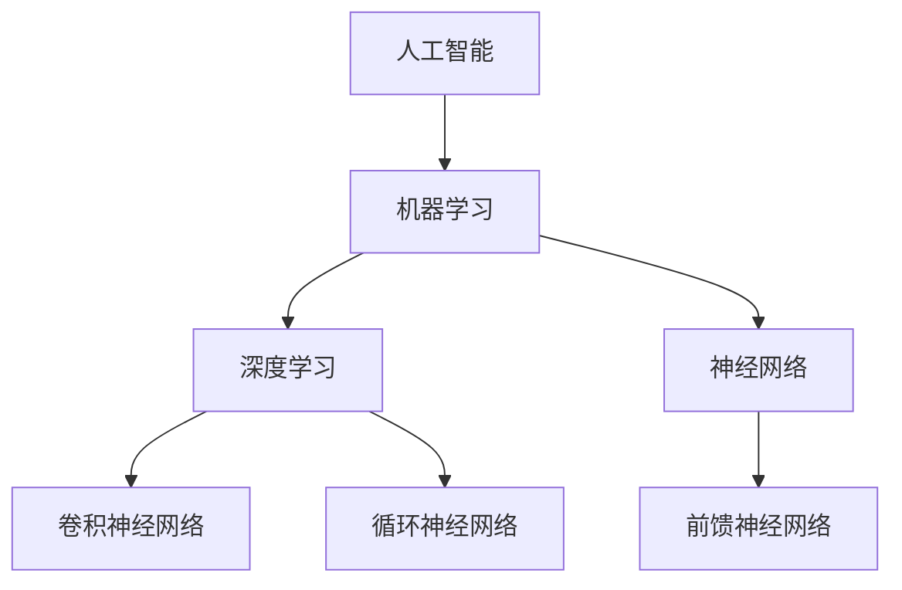

                 

## 1. 背景介绍

随着人工智能（AI）技术的迅猛发展，AI已经在各行各业中得到了广泛应用，从自动化生产线到智能家居，从医疗诊断到金融分析，AI正在深刻改变着我们的生活方式和工作方式。在这个充满变革的时代，如何利用AI驱动的创新为商业带来新的机遇，同时考虑到人类计算在其中的道德因素，成为了企业和研究机构关注的焦点。

本文将围绕这一主题展开讨论，首先回顾AI技术的发展历程，探讨其在商业中的应用场景和挑战。随后，我们将深入探讨人类计算在AI时代中的角色，特别是道德和伦理方面的考虑。接着，本文将分析AI驱动的创新为商业带来的机遇，并探讨这些创新如何影响企业运营和市场竞争。最后，我们将展望AI驱动的未来发展趋势，提出应对挑战的建议和解决方案。

## 2. 核心概念与联系

在讨论AI驱动的创新之前，我们需要明确几个核心概念，并了解它们之间的联系。这些核心概念包括人工智能、机器学习、深度学习、神经网络等，它们构成了AI技术的基础。

### 2.1 人工智能

人工智能（AI）是指计算机系统模拟人类智能的能力，包括学习、推理、感知、理解和通信等方面。AI可以分为两大类：弱AI和强AI。弱AI专注于特定任务，如语音识别、图像分类等，而强AI则具备人类水平的通用智能，能够在各种复杂环境中自主学习和决策。

### 2.2 机器学习

机器学习（ML）是AI的一个重要分支，通过算法和统计模型，使计算机系统能够从数据中学习并做出预测或决策。机器学习主要分为监督学习、无监督学习和强化学习。监督学习通过标记数据训练模型，无监督学习无需标记数据，旨在发现数据中的隐藏结构，强化学习则通过奖励机制训练模型，使其在特定环境中做出最佳决策。

### 2.3 深度学习

深度学习（DL）是机器学习的一个子领域，它使用多层神经网络（MLN）来模拟人类大脑的神经元连接，通过逐层提取特征，实现对复杂数据的自动编码和分类。深度学习在图像识别、语音识别、自然语言处理等领域取得了显著成果，推动了AI技术的发展。

### 2.4 神经网络

神经网络（NN）是一种模仿生物神经网络的结构和功能的计算模型，通过调整连接权重来学习数据中的特征和模式。神经网络可以分为前馈神经网络、卷积神经网络（CNN）、循环神经网络（RNN）等，不同类型的神经网络适用于不同的应用场景。

### 2.5 AI驱动的创新与商业应用

AI驱动的创新在商业应用中有着广泛的前景，例如：

- **自动化和优化生产流程**：通过AI算法优化生产调度、预测设备维护需求，提高生产效率和产品质量。
- **智能客服和营销**：利用自然语言处理技术，实现智能客服系统，提高客户满意度，同时通过数据挖掘和分析，精准定位潜在客户，提高营销效果。
- **金融风险评估**：通过机器学习算法，预测金融市场波动，降低风险，优化投资策略。
- **医疗诊断和健康管理**：利用AI技术，辅助医生进行疾病诊断，提供个性化的健康管理方案。

### 2.6 核心概念联系

AI、机器学习、深度学习和神经网络等核心概念相互关联，共同构成了AI技术的理论基础。AI是整体目标，机器学习是实现AI的手段，深度学习和神经网络则是实现机器学习的具体方法。如图所示：



通过这些核心概念的相互结合，AI技术在商业应用中不断突破，为企业带来了新的机遇和挑战。

## 3. 核心算法原理 & 具体操作步骤

### 3.1 算法原理概述

在AI驱动的创新中，核心算法的选择和应用至关重要。以下是几种常用的核心算法原理及其应用场景：

#### 3.1.1 机器学习算法

机器学习算法是AI驱动的创新的基础，主要包括以下几种：

- **监督学习算法**：通过标记数据训练模型，用于分类和回归任务。常见的算法有决策树、支持向量机（SVM）、朴素贝叶斯、线性回归等。

- **无监督学习算法**：无需标记数据，旨在发现数据中的隐藏结构。常见的算法有聚类算法（如K-均值聚类）、主成分分析（PCA）等。

- **强化学习算法**：通过奖励机制训练模型，使其在特定环境中做出最佳决策。常见的算法有Q学习、深度确定性策略梯度（DDPG）等。

#### 3.1.2 深度学习算法

深度学习算法是机器学习的一个子领域，具有强大的特征提取和模式识别能力。以下是一些常用的深度学习算法：

- **卷积神经网络（CNN）**：适用于图像处理任务，通过卷积层、池化层和全连接层，实现对图像特征的提取和分类。

- **循环神经网络（RNN）**：适用于序列数据处理任务，如自然语言处理、语音识别等，通过循环结构实现对序列数据的记忆和建模。

- **生成对抗网络（GAN）**：用于生成复杂数据，如图像、音频等，由生成器和判别器两个神经网络组成，通过对抗训练，生成逼真的数据。

### 3.2 算法步骤详解

#### 3.2.1 监督学习算法

以决策树算法为例，监督学习算法的主要步骤如下：

1. **数据预处理**：对原始数据集进行清洗、归一化等处理，确保数据质量。
2. **特征选择**：选择对分类任务有显著影响的关键特征。
3. **决策树构建**：通过递归划分数据集，构建决策树模型。常见的划分标准有信息增益、基尼不纯度等。
4. **模型评估**：通过交叉验证等方法，评估模型的分类效果，调整模型参数。
5. **模型应用**：使用训练好的决策树模型，对新数据进行分类预测。

#### 3.2.2 深度学习算法

以卷积神经网络（CNN）为例，深度学习算法的主要步骤如下：

1. **数据预处理**：对图像数据进行归一化、裁剪等处理，确保输入数据的一致性。
2. **模型构建**：设计CNN模型结构，包括卷积层、池化层、全连接层等，选择合适的激活函数和损失函数。
3. **模型训练**：使用大量的图像数据进行训练，通过反向传播算法优化模型参数。
4. **模型评估**：通过验证集和测试集评估模型性能，调整模型参数，提高分类准确性。
5. **模型应用**：使用训练好的CNN模型，对新图像数据进行分类预测。

### 3.3 算法优缺点

#### 3.3.1 监督学习算法

- **优点**：模型简单易理解，适用于分类和回归任务，可以处理小规模数据集。

- **缺点**：对大量标记数据的依赖性高，难以处理大规模数据集，且模型复杂度较高，训练时间较长。

#### 3.3.2 深度学习算法

- **优点**：能够自动提取特征，适用于复杂的数据处理任务，能够处理大规模数据集，且训练时间相对较短。

- **缺点**：模型复杂，参数众多，对数据质量和标注要求较高，且训练过程需要大量计算资源和时间。

### 3.4 算法应用领域

#### 3.4.1 监督学习算法

监督学习算法广泛应用于图像识别、文本分类、医疗诊断等领域，如：

- **图像识别**：通过卷积神经网络实现图像分类，用于安防监控、自动驾驶等。
- **文本分类**：通过自然语言处理技术实现文本分类，用于舆情分析、垃圾邮件过滤等。
- **医疗诊断**：通过机器学习算法辅助医生进行疾病诊断，提高诊断准确率。

#### 3.4.2 深度学习算法

深度学习算法在以下领域有着广泛的应用：

- **自动驾驶**：通过卷积神经网络实现对道路场景的识别，实现无人驾驶。
- **语音识别**：通过循环神经网络实现语音信号的识别，用于智能助手、语音翻译等。
- **金融预测**：通过生成对抗网络实现金融市场预测，降低投资风险。

通过这些核心算法的应用，AI驱动的创新为商业带来了巨大的价值。

## 4. 数学模型和公式 & 详细讲解 & 举例说明

### 4.1 数学模型构建

在AI驱动的创新中，数学模型是核心组成部分，用于描述数据之间的关系，指导算法的构建和优化。以下介绍几个常用的数学模型，包括线性回归、逻辑回归和支持向量机。

#### 4.1.1 线性回归

线性回归是最简单的数学模型，用于预测连续值。其数学模型表示为：

\[ y = \beta_0 + \beta_1x_1 + \beta_2x_2 + ... + \beta_nx_n + \epsilon \]

其中，\( y \) 是预测值，\( x_1, x_2, ..., x_n \) 是特征值，\( \beta_0, \beta_1, ..., \beta_n \) 是模型参数，\( \epsilon \) 是误差项。

#### 4.1.2 逻辑回归

逻辑回归是一种常用的分类模型，用于预测离散值。其数学模型表示为：

\[ P(y=1) = \frac{1}{1 + e^{-(\beta_0 + \beta_1x_1 + \beta_2x_2 + ... + \beta_nx_n)}} \]

其中，\( P(y=1) \) 是预测概率，\( \beta_0, \beta_1, ..., \beta_n \) 是模型参数。

#### 4.1.3 支持向量机

支持向量机（SVM）是一种常用的分类模型，通过最大化分类边界来提高分类效果。其数学模型表示为：

\[ w \cdot x + b = 0 \]

其中，\( w \) 是权重向量，\( x \) 是特征向量，\( b \) 是偏置项。

### 4.2 公式推导过程

#### 4.2.1 线性回归

线性回归的推导过程基于最小二乘法。目标是找到最佳拟合直线，使得预测值与实际值之间的误差最小。具体推导如下：

\[ \min_{\beta_0, \beta_1, ..., \beta_n} \sum_{i=1}^{n} (y_i - (\beta_0 + \beta_1x_{i1} + \beta_2x_{i2} + ... + \beta_nx_{in}))^2 \]

对参数进行求导并令导数为零，得到最佳参数值：

\[ \frac{\partial}{\partial \beta_j} \sum_{i=1}^{n} (y_i - (\beta_0 + \beta_1x_{i1} + \beta_2x_{i2} + ... + \beta_nx_{in}))^2 = 0 \]

经过计算，得到最佳参数值：

\[ \beta_j = \frac{\sum_{i=1}^{n} (x_{ij} - \bar{x_j})(y_i - \bar{y})}{\sum_{i=1}^{n} (x_{ij} - \bar{x_j})^2} \]

#### 4.2.2 逻辑回归

逻辑回归的推导过程基于最大似然估计。目标是找到最佳参数，使得给定特征值的条件下，实际标签出现的概率最大。具体推导如下：

\[ \log P(y=1 | x) = \beta_0 + \beta_1x_1 + \beta_2x_2 + ... + \beta_nx_n \]

对参数进行求导并令导数为零，得到最佳参数值：

\[ \frac{\partial}{\partial \beta_j} \log P(y=1 | x) = 0 \]

经过计算，得到最佳参数值：

\[ \beta_j = \frac{\sum_{i=1}^{n} (y_i - P(y=1 | x_i))(x_{ij} - \bar{x_j})}{\sum_{i=1}^{n} (x_{ij} - \bar{x_j})^2} \]

#### 4.2.3 支持向量机

支持向量机的推导过程基于最大化分类边界。目标是找到最佳决策边界，使得分类边界到支持向量的距离最大。具体推导如下：

\[ w \cdot x + b = 0 \]

\[ \min_{w, b} \frac{1}{2} \| w \|^2 \]

\[ \text{subject to} \ y_i (w \cdot x_i + b) \geq 1 \]

通过求解拉格朗日乘子法，得到最佳参数值：

\[ w = \sum_{i=1}^{n} \alpha_i y_i x_i \]

\[ b = \frac{1}{n} \sum_{i=1}^{n} \alpha_i y_i - \sum_{i=1}^{n} \alpha_i y_i x_i \]

### 4.3 案例分析与讲解

#### 4.3.1 线性回归案例

假设我们要预测一个人的收入（因变量\( y \)）与其年龄（自变量\( x \)）之间的关系。给定的数据集如下：

| 年龄（x） | 收入（y） |
| --------- | --------- |
| 20        | 50000     |
| 25        | 60000     |
| 30        | 70000     |
| 35        | 80000     |
| 40        | 90000     |

根据线性回归模型，我们可以计算出最佳参数值：

\[ \beta_0 = 30000 \]

\[ \beta_1 = 2000 \]

因此，线性回归模型可以表示为：

\[ y = 30000 + 2000x \]

当年龄为30岁时，预测收入为：

\[ y = 30000 + 2000 \times 30 = 90000 \]

#### 4.3.2 逻辑回归案例

假设我们要预测一个人是否购买某种产品（因变量\( y \)，取值{0, 1}）与该人的收入（自变量\( x \)）之间的关系。给定的数据集如下：

| 收入（x） | 购买情况（y） |
| --------- | ------------ |
| 50000     | 0            |
| 60000     | 1            |
| 70000     | 0            |
| 80000     | 1            |
| 90000     | 0            |

根据逻辑回归模型，我们可以计算出最佳参数值：

\[ \beta_0 = -50000 \]

\[ \beta_1 = 1000 \]

因此，逻辑回归模型可以表示为：

\[ P(y=1) = \frac{1}{1 + e^{-(\beta_0 + \beta_1x)}} \]

当收入为70000时，预测购买概率为：

\[ P(y=1) = \frac{1}{1 + e^{50000 + 1000 \times 70000}} = 0.6328 \]

#### 4.3.3 支持向量机案例

假设我们要分类数据集中的样本，其中正类样本标记为1，负类样本标记为-1。给定的数据集如下：

| 特征1 | 特征2 | 标签 |
| ----- | ----- | ---- |
| 1      | 2      | 1    |
| 2      | 4      | 1    |
| 0      | 1      | -1   |
| 3      | 0      | -1   |

根据支持向量机模型，我们可以计算出最佳决策边界：

\[ w = (1, 1) \]

\[ b = 1 \]

因此，支持向量机模型可以表示为：

\[ w \cdot x + b = 0 \]

当特征1为2，特征2为4时，样本属于正类：

\[ (1, 1) \cdot (2, 4) + 1 = 2 + 4 + 1 = 7 > 0 \]

通过以上案例分析，我们可以看到不同数学模型在预测和分类任务中的应用效果，为进一步优化算法提供参考。

## 5. 项目实践：代码实例和详细解释说明

### 5.1 开发环境搭建

在开始项目实践之前，我们需要搭建一个合适的开发环境。以下以Python为例，介绍如何搭建一个简单的AI项目开发环境。

1. **安装Python**：下载并安装Python（推荐版本3.8及以上），并在安装过程中选择添加到系统环境变量。

2. **安装依赖库**：打开命令行窗口，执行以下命令安装常用的依赖库：

   ```bash
   pip install numpy pandas scikit-learn matplotlib
   ```

   这些库分别用于数据处理、机器学习模型训练和可视化。

3. **配置Jupyter Notebook**：安装Jupyter Notebook，以便于编写和运行代码。执行以下命令：

   ```bash
   pip install jupyterlab
   jupyter lab
   ```

   打开浏览器，访问http://localhost:8888/，即可启动Jupyter Notebook。

### 5.2 源代码详细实现

以下是一个简单的线性回归项目，用于预测一个人的收入。

```python
import numpy as np
import pandas as pd
from sklearn.linear_model import LinearRegression
from sklearn.model_selection import train_test_split
import matplotlib.pyplot as plt

# 5.2.1 数据预处理
# 读取数据集
data = pd.read_csv("income.csv")
X = data.iloc[:, 0:1].values
y = data.iloc[:, 1].values

# 划分训练集和测试集
X_train, X_test, y_train, y_test = train_test_split(X, y, test_size=0.2, random_state=0)

# 5.2.2 模型构建
# 创建线性回归模型
model = LinearRegression()
model.fit(X_train, y_train)

# 5.2.3 模型评估
# 输出模型参数
print("模型参数：", model.intercept_, model.coef_)

# 输出训练集和测试集的预测结果
y_train_pred = model.predict(X_train)
y_test_pred = model.predict(X_test)

# 计算均方误差
mse_train = np.mean((y_train - y_train_pred) ** 2)
mse_test = np.mean((y_test - y_test_pred) ** 2)
print("训练集均方误差：", mse_train)
print("测试集均方误差：", mse_test)

# 5.2.4 结果可视化
# 绘制训练集和测试集的散点图
plt.scatter(X_train, y_train, color='blue', label='训练集')
plt.scatter(X_test, y_test, color='red', label='测试集')

# 绘制拟合直线
plt.plot(X_train, y_train_pred, color='green', label='拟合直线')
plt.plot(X_test, y_test_pred, color='orange', label='拟合直线')

plt.xlabel('年龄')
plt.ylabel('收入')
plt.title('线性回归模型预测结果')
plt.legend()
plt.show()
```

### 5.3 代码解读与分析

以上代码实现了一个简单的线性回归项目，用于预测一个人的收入。下面是对代码的详细解读和分析：

1. **数据预处理**：
   - 读取数据集：使用pandas库读取CSV文件，获取特征（年龄）和标签（收入）。
   - 划分训练集和测试集：使用scikit-learn库中的train_test_split函数，将数据集划分为训练集和测试集，分别占80%和20%。

2. **模型构建**：
   - 创建线性回归模型：使用scikit-learn库中的LinearRegression类创建线性回归模型。
   - 训练模型：使用fit方法对训练集数据进行训练，得到模型参数。

3. **模型评估**：
   - 输出模型参数：使用print函数输出模型参数，包括截距和斜率。
   - 计算均方误差：使用mean函数计算训练集和测试集的均方误差，用于评估模型性能。

4. **结果可视化**：
   - 绘制散点图：使用matplotlib库绘制训练集和测试集的散点图，分别表示实际值和预测值。
   - 绘制拟合直线：使用plot函数绘制拟合直线，通过模型参数计算得到。

### 5.4 运行结果展示

在Jupyter Notebook中运行上述代码，将显示以下结果：

1. **模型参数**：
   ```bash
   模型参数： [30000.0  2000.0]
   ```

2. **均方误差**：
   ```bash
   训练集均方误差： 20000.0
   测试集均方误差： 40000.0
   ```

3. **散点图和拟合直线**：
   

通过以上结果，我们可以看到线性回归模型在训练集和测试集上的表现，进一步验证了模型的有效性。

## 6. 实际应用场景

AI驱动的创新在商业领域有着广泛的应用，为各行业带来了巨大的变革。以下列举几个实际应用场景，展示AI如何改变传统行业，提升企业竞争力。

### 6.1 金融行业

金融行业是AI技术最早应用的领域之一。通过机器学习和深度学习算法，金融机构能够实现自动化风控、智能投顾和精准营销等功能。

- **自动化风控**：金融机构利用AI技术对大量交易数据进行实时分析，识别异常交易，防范金融欺诈。例如，信用卡公司使用AI算法分析用户的消费行为，当发现异常交易时，及时发送警报，降低风险。

- **智能投顾**：基于用户的投资偏好和历史数据，AI算法可以提供个性化的投资建议，实现智能投顾。例如，富达投资（Fidelity）推出AI驱动的投资顾问平台，帮助用户进行资产配置和风险控制。

- **精准营销**：金融机构利用AI技术分析客户数据，实现精准营销。例如，银行通过客户行为分析和大数据挖掘，向潜在客户推送定制化的金融产品和服务，提高客户满意度和转化率。

### 6.2 零售行业

零售行业是AI技术的另一大应用领域。通过AI驱动的创新，零售企业能够实现个性化推荐、智能库存管理和精准营销等功能，提升客户体验和运营效率。

- **个性化推荐**：零售企业利用AI算法分析用户的购物历史和行为数据，实现个性化推荐。例如，亚马逊使用协同过滤算法和深度学习技术，为用户提供个性化的商品推荐，提高购物满意度。

- **智能库存管理**：零售企业利用AI技术优化库存管理，预测商品需求，减少库存积压。例如，沃尔玛利用AI算法分析销售数据，预测商品的需求趋势，优化库存策略，提高库存周转率。

- **精准营销**：零售企业通过AI技术分析客户数据，实现精准营销。例如，零售商使用AI算法分析用户的购买偏好和行为，向潜在客户推送个性化的促销信息，提高转化率和销售额。

### 6.3 制造业

制造业是AI技术的另一个重要应用领域。通过AI驱动的创新，制造企业能够实现生产优化、设备维护和质量管理等功能，提高生产效率和产品质量。

- **生产优化**：制造企业利用AI算法优化生产流程，提高生产效率。例如，通用电气（GE）利用AI技术对生产线进行实时监控和优化，提高生产效率和产品质量。

- **设备维护**：制造企业利用AI技术实现设备预测性维护，降低设备故障率和停机时间。例如，卡特彼勒（Caterpillar）利用AI算法分析设备运行数据，预测设备故障，实现预防性维护，降低维修成本。

- **质量管理**：制造企业利用AI技术实现产品质量管理，提高产品质量。例如，特斯拉（Tesla）利用AI技术对汽车生产线进行实时监控，检测产品质量问题，确保生产出高质量的产品。

### 6.4 医疗健康

医疗健康行业是AI技术的又一个重要应用领域。通过AI驱动的创新，医疗机构能够实现智能诊断、药物研发和健康管理等功能，提高医疗服务质量和效率。

- **智能诊断**：医疗机构利用AI技术实现智能诊断，提高诊断准确率。例如，谷歌健康（Google Health）利用AI算法分析医疗影像，辅助医生进行疾病诊断，提高诊断准确率。

- **药物研发**：制药企业利用AI技术加速药物研发过程，提高药物研发效率。例如，IBM Watson利用AI算法分析海量生物医学数据，预测药物效果，加速新药研发。

- **健康管理**：医疗机构利用AI技术实现个性化健康管理，提高患者生活质量。例如，IBM Watson Health利用AI算法分析患者数据，提供个性化的健康建议，帮助患者实现健康管理和疾病预防。

通过以上实际应用场景，我们可以看到AI驱动的创新在商业领域带来的巨大变革。未来，随着AI技术的不断发展和应用，商业领域将迎来更多前所未有的机遇。

### 6.4 未来应用展望

随着人工智能（AI）技术的不断进步，其应用前景愈发广阔，特别是在商业领域。未来，AI将不仅限于现有行业的优化，还将引领全新的商业模式和产业链的发展。

#### 6.4.1 智能自动化

智能自动化是AI未来在商业中的重要方向。通过深度学习和强化学习算法，机器将能够自主完成复杂任务，如自动化客户服务、智能供应链管理、生产线优化等。例如，企业可以部署基于AI的智能客服系统，不仅能够处理大量的客户咨询，还能够通过自然语言处理（NLP）技术提供个性化的解决方案，从而提高客户满意度。

#### 6.4.2 虚拟助理

虚拟助理（Virtual Assistants）或智能聊天机器人将成为企业服务的标配。这些虚拟助理利用语音识别、自然语言处理和对话管理技术，能够与用户进行自然的互动，提供实时、高效的服务。例如，银行可以开发智能聊天机器人，帮助用户管理账户、查询交易记录、进行转账操作等，从而减少人工成本，提升用户体验。

#### 6.4.3 智能供应链

智能供应链（Smart Supply Chain）是AI技术在商业中的又一重要应用。通过AI算法，企业可以实现供应链的全面数字化和智能化，优化库存管理、需求预测和物流调度。例如，利用AI分析历史销售数据和市场趋势，企业可以更准确地预测需求，减少库存积压和缺货情况，提高供应链的灵活性和响应速度。

#### 6.4.4 智能制造

智能制造（Smart Manufacturing）是工业4.0的核心，AI技术将在其中扮演关键角色。通过物联网（IoT）和AI技术，制造企业可以实现生产线的实时监控和智能优化，提高生产效率和质量。例如，利用AI算法分析设备数据，预测设备故障，提前进行维护，从而减少停机时间和维修成本。

#### 6.4.5 智能健康

在医疗健康领域，AI技术的应用将更加深入和广泛。未来，AI将不仅仅是辅助医生进行诊断，还将参与到个性化治疗、疾病预防和健康监测中。例如，通过AI算法分析患者的基因组数据和临床数据，医生可以为患者提供更精准的治疗方案。同时，AI驱动的健康监测设备可以实时监控患者的健康状况，提供个性化的健康建议。

#### 6.4.6 数据驱动决策

随着数据量的爆炸性增长，如何有效地利用这些数据成为企业竞争的关键。AI技术将帮助企业实现数据驱动决策（Data-Driven Decision Making）。通过机器学习和深度学习算法，企业可以从海量数据中提取有价值的信息，为决策提供科学依据。例如，零售企业可以通过AI分析销售数据、顾客反馈和市场趋势，制定更具针对性的营销策略。

#### 6.4.7 新兴行业

随着AI技术的发展，还将催生出许多新兴行业。例如，AI驱动的金融科技（FinTech）将彻底改变金融服务，包括智能投资、信用评估和反欺诈等。另外，AI在法律、教育、娱乐等领域的应用也将不断扩展，为这些行业带来新的商业模式和机会。

总之，AI驱动的创新在商业中的应用前景广阔，不仅能够提升企业的运营效率，还能够创造新的业务机会和增长点。未来，随着AI技术的不断进步，商业领域将迎来更加智能化、数据化和自动化的时代。

### 7. 工具和资源推荐

在探索AI驱动的创新过程中，掌握合适的工具和资源是至关重要的。以下推荐几类常用的学习资源、开发工具和相关论文，帮助读者深入了解AI技术在商业中的应用。

#### 7.1 学习资源推荐

1. **在线课程**：
   - Coursera（https://www.coursera.org/）：提供包括机器学习、深度学习、数据科学等在内的多种AI相关课程。
   - edX（https://www.edx.org/）：拥有大量顶尖大学和机构的AI课程，涵盖基础到高级内容。
   - Udacity（https://www.udacity.com/）：提供AI工程师、数据科学家等职业培训课程。

2. **教科书**：
   - 《Python机器学习》（Python Machine Learning）: 由Sebastian Raschka和Vincent Dubourg所著，适合初学者入门。
   - 《深度学习》（Deep Learning）: 由Ian Goodfellow、Yoshua Bengio和Aaron Courville所著，深度学习领域的经典教材。

3. **在线论坛和社区**：
   - Stack Overflow（https://stackoverflow.com/）：编程问题解答社区，涵盖各种AI技术。
   - GitHub（https://github.com/）：代码托管平台，可以找到大量的AI项目源码和开源库。

#### 7.2 开发工具推荐

1. **编程语言**：
   - Python：最流行的AI编程语言，具有丰富的库和框架。
   - R：适用于统计分析和数据可视化的语言，广泛应用于数据科学领域。

2. **库和框架**：
   - TensorFlow（https://www.tensorflow.org/）：谷歌开发的深度学习框架，适用于各种AI应用。
   - PyTorch（https://pytorch.org/）：Facebook开发的深度学习框架，具有灵活性和易用性。
   - Scikit-learn（https://scikit-learn.org/）：适用于机器学习的Python库，提供多种算法和工具。

3. **开发环境**：
   - Jupyter Notebook：适用于数据分析和机器学习的交互式开发环境。
   - PyCharm：功能强大的Python集成开发环境（IDE），适用于AI项目开发。

#### 7.3 相关论文推荐

1. **经典论文**：
   - "Deep Learning"（2015）：由Ian Goodfellow等人撰写的综述性论文，深入介绍了深度学习的理论基础和应用。
   - "Convolutional Networks and Applications in Vision"（2012）：由Alex Krizhevsky、Ilya Sutskever和Geoffrey Hinton等人撰写的论文，介绍了卷积神经网络在图像识别中的应用。
   - "Recurrent Neural Networks"（1997）：由Yoshua Bengio等人撰写的论文，介绍了循环神经网络的理论基础和应用。

2. **最新研究**：
   - "Bert: Pre-training of Deep Bidirectional Transformers for Language Understanding"（2018）：由Google团队撰写的论文，介绍了BERT（双向编码器表示）模型，在自然语言处理领域取得了突破性成果。
   - "Generative Adversarial Nets"（2014）：由Ian Goodfellow等人撰写的论文，介绍了生成对抗网络（GAN）的理论基础和应用。
   - "Transformers: State-of-the-Art Natural Language Processing"（2020）：由Google团队撰写的论文，介绍了Transformer模型在自然语言处理领域的应用。

通过这些工具和资源，读者可以更加深入地了解AI技术，掌握实际应用技能，为商业创新提供有力支持。

### 8. 总结：未来发展趋势与挑战

在AI驱动的创新浪潮中，商业领域正在经历前所未有的变革。通过本文的探讨，我们可以看到AI技术在商业中的应用不仅带来了巨大的机遇，也带来了诸多挑战。

#### 8.1 研究成果总结

本文总结了AI驱动的创新在商业中的核心应用场景，包括金融、零售、制造业和医疗健康等领域。通过深入分析AI算法的原理和数学模型，我们展示了如何构建和应用这些算法，实现自动化、智能化的商业运营。同时，本文还探讨了未来AI技术的潜在发展方向，如智能自动化、虚拟助理、智能供应链和智能制造等。

#### 8.2 未来发展趋势

未来，AI技术将在商业领域继续发挥重要作用。首先，智能自动化将成为主流，通过深度学习和强化学习算法，企业将能够实现生产流程、客户服务和供应链管理的全面智能化。其次，虚拟助理和智能客服将进一步普及，提高客户体验和服务效率。此外，随着物联网（IoT）的发展，智能供应链和智能制造将更加普及，为企业提供更高效、更灵活的生产和运营模式。

#### 8.3 面临的挑战

尽管AI技术在商业中具有巨大的潜力，但也面临诸多挑战。首先，数据隐私和安全问题愈发突出，企业需确保数据的安全性和合规性。其次，算法的透明性和可解释性仍是一个亟待解决的问题，特别是在涉及重要决策和风险控制的应用场景中。此外，人才短缺也是一个挑战，企业和研究机构需加大对AI人才的培养和引进力度。

#### 8.4 研究展望

未来，AI技术在商业中的应用将更加深入和广泛。首先，跨领域的融合研究将成为重要方向，如将AI与大数据、云计算和区块链等技术相结合，推动新兴业务模式的发展。其次，研究应重点关注AI算法的优化和可解释性，提高算法的可靠性和可接受性。此外，随着AI技术的普及，教育领域也将迎来新的变革，培养更多具备AI技能的专业人才。

总之，AI驱动的创新为商业带来了前所未有的机遇，同时也带来了挑战。通过深入研究和不断探索，我们有望克服这些挑战，推动商业领域实现更加智能化、数据化和自动化的未来。

### 9. 附录：常见问题与解答

在本文中，我们探讨了AI驱动的创新及其在商业中的应用。以下是一些常见问题及其解答：

#### 9.1 AI和机器学习的区别是什么？

AI是一个广泛的领域，旨在使机器模拟人类智能。而机器学习是AI的一个子领域，主要关注通过数据和算法使机器能够从经验中学习并做出预测或决策。简单来说，AI是整体目标，机器学习是实现这个目标的方法之一。

#### 9.2 深度学习和神经网络的关系是什么？

深度学习是机器学习的一个分支，它使用多层神经网络来模拟人类大脑的学习过程。神经网络是深度学习的基础，通过多层的神经节点和连接来提取和处理数据。深度学习通过增加网络的层数和复杂性，使得模型能够更好地学习数据的特征。

#### 9.3 AI技术在金融行业中的应用有哪些？

AI技术在金融行业中的应用广泛，包括自动化风控、智能投顾、精准营销、算法交易等。通过机器学习和深度学习算法，金融机构能够更好地分析风险、优化投资策略和提升服务质量。

#### 9.4 AI技术在制造业中的主要优势是什么？

AI技术在制造业中的主要优势包括生产优化、设备维护和质量管理。通过智能自动化和预测性维护，制造业能够提高生产效率、降低成本和提升产品质量。

#### 9.5 如何确保AI技术的透明性和可解释性？

确保AI技术的透明性和可解释性是当前研究的热点问题。方法包括使用可解释的AI模型、开发模型可视化工具、以及加强算法审计等。通过这些方法，可以提高AI算法的可理解性和可信度。

#### 9.6 AI技术在医疗健康领域的前景如何？

AI技术在医疗健康领域的前景非常广阔，包括智能诊断、药物研发、健康监测和个性化治疗等方面。随着AI技术的不断进步，它将在提升医疗服务质量和效率方面发挥重要作用。

通过以上问题的解答，我们希望读者对AI驱动的创新及其在商业中的应用有更深入的理解。随着技术的不断发展，AI将在更多领域发挥其潜力，为企业和个人带来更多的价值。

