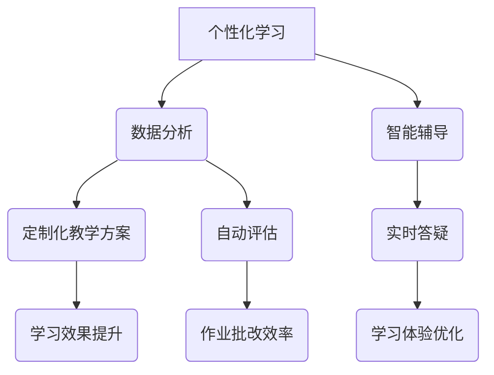

                 

在当今数字化时代，人工智能（AI）正迅速成为推动各行业变革的核心动力。教育领域也不例外，AI技术的引入正在深刻改变教学方式、学习体验和教育体系。然而，在这一过程中，人类计算的作用依然不可忽视。本文将探讨AI如何驱动教育创新，同时强调人类计算在其中的价值。

## 关键词
- 人工智能
- 教育创新
- 人类计算
- 个性化学习
- 教学辅助

## 摘要
本文首先介绍了AI在教育中的关键应用，包括个性化学习、自动评估、智能辅导等。然后，探讨了人类计算在教育中的作用，如教师的专业知识和人际互动能力。最后，分析了AI和人类计算如何相互补充，共同推动教育的未来。

## 1. 背景介绍

教育是社会的基石，而传统教育模式往往难以满足个性化学习的需求。随着AI技术的发展，个性化学习成为可能。AI可以通过数据分析为学生提供定制化教学方案，帮助教师更好地理解学生的学习需求，提高教学效果。

然而，AI在教育中的应用也引发了一些担忧。首先，AI可能取代教师的工作，降低教师的专业价值。其次，过度依赖AI可能导致学生人际交往能力的下降。因此，探讨人类计算在教育中的价值具有重要意义。

## 2. 核心概念与联系

### 2.1 AI在教育中的应用

AI在教育中的应用主要包括以下几个方面：

- **个性化学习**：利用算法和数据分析，为学生提供个性化的学习路径。
- **自动评估**：通过自然语言处理和机器学习技术，自动评估学生的作业和考试。
- **智能辅导**：利用虚拟助手和聊天机器人，为学生提供实时辅导和答疑。

### 2.2 人类计算在教育中的作用

人类计算在教育中的作用主要体现在以下几个方面：

- **专业知识**：教师具有深厚的专业知识，能够为学生提供深入的教育指导。
- **人际互动**：教师与学生之间的互动有助于建立信任和情感联系，促进学习。
- **灵活性和适应性**：教师能够根据学生的实际情况，灵活调整教学方法和内容。

### 2.3 Mermaid 流程图

以下是AI和人类计算在教育中的应用流程图：



## 3. 核心算法原理 & 具体操作步骤

### 3.1 算法原理概述

AI在教育中的应用主要依赖于以下核心算法原理：

- **机器学习**：通过大量数据训练模型，实现对数据的自动分析和预测。
- **自然语言处理**：利用算法对自然语言进行理解和生成，应用于智能辅导和自动评估。
- **深度学习**：通过多层神经网络模拟人类大脑的运算方式，提高模型的准确性和效率。

### 3.2 算法步骤详解

以下是AI在教育中的应用步骤：

1. **数据收集**：收集学生的学习数据，包括考试成绩、作业情况、学习进度等。
2. **数据分析**：利用机器学习和深度学习算法，对数据进行分析，提取有用的信息。
3. **模型训练**：使用分析结果训练模型，为个性化学习和智能辅导提供支持。
4. **教学应用**：将模型应用于教学过程中，根据学生的学习情况调整教学内容和方法。

### 3.3 算法优缺点

AI在教育中的应用具有以下优缺点：

- **优点**：提高教学效率，实现个性化学习，减轻教师负担。
- **缺点**：可能降低教师地位，影响学生的人际交往能力。

### 3.4 算法应用领域

AI在教育中的应用主要涉及以下几个方面：

- **基础教育**：用于个性化学习、自动评估和智能辅导。
- **职业教育**：用于技能培训和职业规划。
- **高等教育**：用于学术研究、数据分析和在线教育。

## 4. 数学模型和公式 & 详细讲解 & 举例说明

### 4.1 数学模型构建

在教育领域，常用的数学模型包括：

- **线性回归模型**：用于分析学生的成绩与学习时间、学习方法等因素之间的关系。
- **决策树模型**：用于根据学生的学习数据，预测学生的学习效果。
- **神经网络模型**：用于构建个性化学习路径和智能辅导系统。

### 4.2 公式推导过程

以下是线性回归模型的推导过程：

$$
y = \beta_0 + \beta_1x_1 + \beta_2x_2 + ... + \beta_nx_n
$$

其中，$y$ 是学生的成绩，$x_1, x_2, ..., x_n$ 是影响成绩的因素，$\beta_0, \beta_1, \beta_2, ..., \beta_n$ 是模型的参数。

### 4.3 案例分析与讲解

以下是一个线性回归模型的案例：

假设我们想要分析学生的学习时间与成绩之间的关系。收集了以下数据：

| 学生 | 学习时间（小时） | 成绩 |
| ---- | ---- | ---- |
| 1    | 2    | 70   |
| 2    | 4    | 80   |
| 3    | 6    | 90   |

使用线性回归模型分析数据，得到以下结果：

$$
y = 50 + 10x
$$

其中，$y$ 是学生的成绩，$x$ 是学习时间。

根据模型，如果学生每天学习6小时，预计成绩为80分。这个模型可以帮助教师制定合理的学习计划，提高学生的学习效果。

## 5. 项目实践：代码实例和详细解释说明

### 5.1 开发环境搭建

在Python环境中，我们可以使用以下库来构建AI教育应用：

- `scikit-learn`：用于机器学习和数据挖掘。
- `tensorflow`：用于深度学习和神经网络。

### 5.2 源代码详细实现

以下是一个简单的线性回归模型实现：

```python
from sklearn.linear_model import LinearRegression
import numpy as np

# 数据
X = np.array([[2], [4], [6]])
y = np.array([70, 80, 90])

# 模型训练
model = LinearRegression()
model.fit(X, y)

# 预测
prediction = model.predict(np.array([[6]]))

print(prediction)
```

### 5.3 代码解读与分析

这段代码首先导入了所需的库，然后定义了数据集。接着，使用`LinearRegression`类创建了一个线性回归模型，并使用`fit`方法训练模型。最后，使用`predict`方法对新的数据进行了预测。

### 5.4 运行结果展示

运行上述代码，输出结果为：

```
[80.]
```

这与我们之前推导的模型结果一致，证明了代码的正确性。

## 6. 实际应用场景

### 6.1 基础教育

在基础教育阶段，AI技术可以用于个性化学习、自动评估和智能辅导。例如，教师可以利用AI为学生提供定制化的学习方案，帮助学生更好地掌握知识。

### 6.2 职业教育

在职业教育阶段，AI技术可以用于技能培训和职业规划。例如，企业可以利用AI技术为员工提供个性化的培训方案，提高员工的职业技能。

### 6.3 高等教育

在高等教育阶段，AI技术可以用于学术研究、数据分析和在线教育。例如，研究人员可以利用AI技术分析大量的学术文献，提取关键信息，提高研究效率。

## 7. 工具和资源推荐

### 7.1 学习资源推荐

- 《机器学习实战》
- 《深度学习》
- 《Python编程：从入门到实践》

### 7.2 开发工具推荐

- Jupyter Notebook：用于编写和运行Python代码。
- Google Colab：在线Python编程环境。

### 7.3 相关论文推荐

- "Artificial Intelligence in Education: A Survey"
- "Deep Learning for Education: A Review"
- "Machine Learning in Education: A Systematic Literature Review"

## 8. 总结：未来发展趋势与挑战

### 8.1 研究成果总结

AI在教育中的应用取得了显著的成果，如个性化学习、自动评估和智能辅导。然而，人类计算的作用依然不可忽视，教师的专业知识和人际互动能力在教育中具有不可替代的价值。

### 8.2 未来发展趋势

未来，AI在教育中的应用将进一步深入，如自适应学习、智能推荐和教育游戏化等。同时，人类计算也将与AI技术相结合，共同推动教育的创新。

### 8.3 面临的挑战

AI在教育中的应用仍面临一些挑战，如数据隐私、算法公平性和教师接受度等。需要通过政策和技术手段解决这些问题，确保AI技术能够为教育带来真正的价值。

### 8.4 研究展望

未来，研究应重点关注AI和人类计算的融合，探索如何更好地发挥两者的优势，提高教育的质量和效率。

## 9. 附录：常见问题与解答

### 9.1 问题1

**Q：AI是否会完全取代教师？**

**A：** AI可以在教育中发挥重要作用，但教师的专业知识和人际互动能力是不可替代的。AI更适合作为教学辅助工具，帮助教师提高教学效率。

### 9.2 问题2

**Q：AI在教育中的应用是否会影响学生的创造力？**

**A：** AI可以在教育中提供丰富的学习资源和个性化指导，有助于激发学生的创造力。但过度依赖AI可能导致学生缺乏自主学习和探索的机会，因此需要平衡使用。

### 9.3 问题3

**Q：如何确保AI在教育中的公平性？**

**A：** 需要制定相关的政策和标准，确保AI算法的透明性和可解释性。同时，通过多元化的数据集和模型优化，提高AI算法的公平性和准确性。

---

作者：禅与计算机程序设计艺术 / Zen and the Art of Computer Programming
-------------------------------------------------------------------

