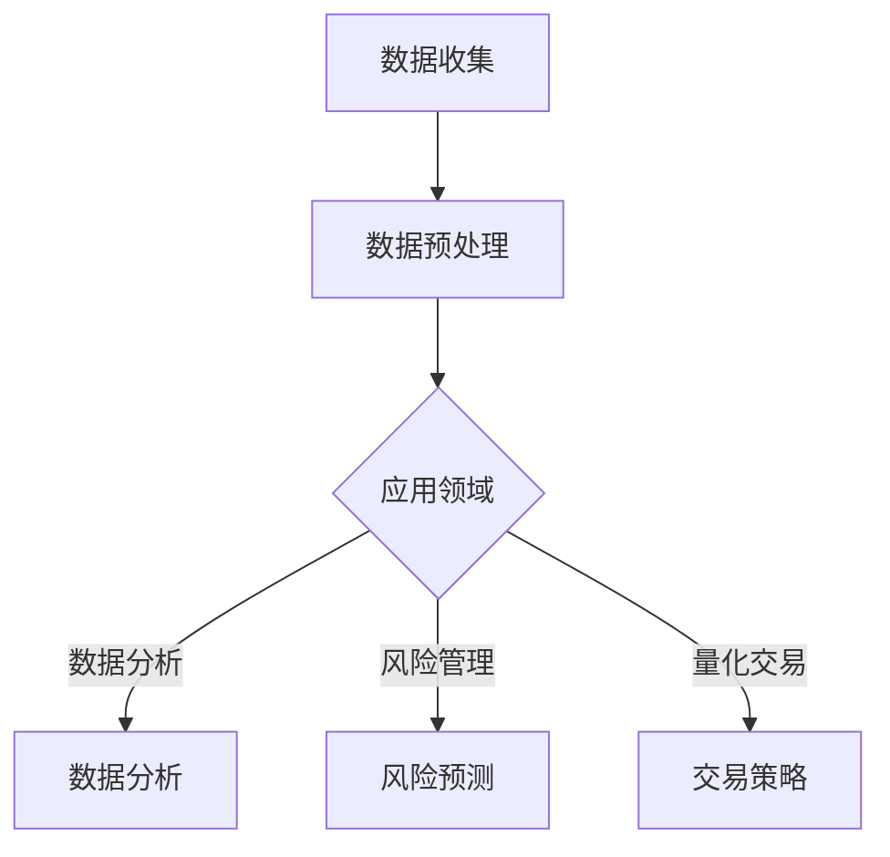

                 

在当今时代，人工智能（AI）已经成为驱动创新的核心力量，而其在金融领域的应用更是引人注目。本文旨在探讨人类计算在金融中的应用，特别是AI如何改变金融行业的运作方式，提高效率，并带来新的业务模式。本文结构如下：

## 关键词
- 人工智能
- 金融
- 人类计算
- AI驱动的创新
- 数据分析
- 风险管理
- 量化交易

## 摘要
本文将深入分析AI在金融领域的应用，探讨其如何通过数据分析、风险管理和量化交易等方面，提升金融行业的效率与效果。同时，本文也将探讨人类计算在AI时代的角色，以及如何结合AI与人类智慧，共同推动金融创新。

---

## 1. 背景介绍

金融行业一直以来都是技术和创新的试验田。随着大数据、云计算和人工智能等技术的发展，金融行业正经历着前所未有的变革。传统金融模式依赖于大量的手工处理和数据录入，效率低下且易出错。而AI的应用，则为金融行业带来了新的契机。

AI在金融领域的应用主要包括以下几个方面：

- **数据分析**：AI能够快速处理海量数据，识别潜在的趋势和模式，为投资决策提供有力支持。
- **风险管理**：AI能够通过复杂的算法和模型，对风险进行精准预测和评估，提高风险管理的效率。
- **量化交易**：AI在量化交易中扮演着重要角色，能够通过算法实现高频交易和套利策略。

## 2. 核心概念与联系

为了更好地理解AI在金融中的应用，我们需要了解一些核心概念，包括机器学习、深度学习、神经网络等。

### 2.1 机器学习

机器学习是一种通过数据训练模型，使模型能够对未知数据进行预测或分类的方法。在金融领域，机器学习可以用于：

- **信用评分**：根据借款人的历史数据，预测其还款能力。
- **市场预测**：通过分析历史市场数据，预测未来市场走势。

### 2.2 深度学习

深度学习是机器学习的一个分支，通过多层神经网络，对数据进行特征提取和模式识别。在金融领域，深度学习可以用于：

- **图像识别**：识别金融合同中的关键信息。
- **交易策略**：通过分析大量市场数据，生成高效的交易策略。

### 2.3 神经网络

神经网络是一种模拟人脑的计算机模型，能够通过大量的训练数据，学习到复杂的非线性关系。在金融领域，神经网络可以用于：

- **股票预测**：通过分析历史股票价格，预测未来股票走势。
- **风险分析**：通过分析各种风险因素，评估投资风险。

下面是一个Mermaid流程图，展示AI在金融领域中的应用流程：



## 3. 核心算法原理 & 具体操作步骤

### 3.1 算法原理概述

在金融领域，常用的AI算法包括决策树、支持向量机、神经网络等。每种算法都有其独特的原理和应用场景。

- **决策树**：通过一系列的判断条件，将数据分为不同的类别。在金融领域，可以用于信用评分、风险预测等。
- **支持向量机**：通过找到一个最优的超平面，将不同类别的数据分开。在金融领域，可以用于股票预测、市场分析等。
- **神经网络**：通过多层神经元的连接，对数据进行特征提取和模式识别。在金融领域，可以用于交易策略、图像识别等。

### 3.2 算法步骤详解

以神经网络为例，其基本步骤如下：

1. **数据收集**：收集相关金融数据，如股票价格、交易量等。
2. **数据预处理**：对数据进行清洗、归一化等处理，使其适合训练模型。
3. **模型构建**：设计神经网络的结构，包括输入层、隐藏层和输出层。
4. **模型训练**：通过反向传播算法，调整神经网络的权重和偏置，使其对训练数据有较好的预测能力。
5. **模型评估**：通过测试数据，评估模型的预测能力。
6. **模型应用**：将模型应用到实际的金融业务中，如股票预测、交易策略等。

### 3.3 算法优缺点

- **决策树**：优点是易于理解，解释性强；缺点是对于非线性数据的预测能力较弱。
- **支持向量机**：优点是能够处理高维数据，预测准确度高；缺点是计算复杂度高，训练时间长。
- **神经网络**：优点是能够处理复杂非线性关系，预测能力强；缺点是模型解释性较差，训练过程需要大量数据和时间。

### 3.4 算法应用领域

- **信用评分**：通过分析借款人的历史数据，预测其还款能力。
- **市场预测**：通过分析历史市场数据，预测未来市场走势。
- **量化交易**：通过算法实现高频交易和套利策略。

## 4. 数学模型和公式 & 详细讲解 & 举例说明

### 4.1 数学模型构建

在金融领域，常用的数学模型包括线性回归、逻辑回归等。

- **线性回归**：用于预测连续变量，如股票价格。其公式为：

  $$ y = \beta_0 + \beta_1x_1 + \beta_2x_2 + ... + \beta_nx_n $$

- **逻辑回归**：用于预测二分类变量，如信用评分。其公式为：

  $$ P(y=1) = \frac{1}{1 + e^{-(\beta_0 + \beta_1x_1 + \beta_2x_2 + ... + \beta_nx_n )}} $$

### 4.2 公式推导过程

以线性回归为例，其推导过程如下：

假设我们有一个模型：

$$ y = \beta_0 + \beta_1x_1 + \beta_2x_2 + ... + \beta_nx_n + \epsilon $$

其中，$y$ 是实际值，$x_1, x_2, ..., x_n$ 是特征值，$\beta_0, \beta_1, \beta_2, ..., \beta_n$ 是模型参数，$\epsilon$ 是误差项。

为了估计模型参数，我们可以使用最小二乘法，即找到使得实际值与预测值之间误差平方和最小的参数。

### 4.3 案例分析与讲解

假设我们要预测股票价格，我们的数据包括历史股票价格、交易量等。

首先，我们对数据进行预处理，如归一化处理。

然后，我们设计一个线性回归模型，其公式为：

$$ y = \beta_0 + \beta_1x_1 + \beta_2x_2 + ... + \beta_nx_n $$

其中，$y$ 是股票价格，$x_1, x_2, ..., x_n$ 是历史股票价格、交易量等特征。

接下来，我们使用最小二乘法，计算模型参数。

最后，我们使用测试数据，评估模型的预测能力。

## 5. 项目实践：代码实例和详细解释说明

### 5.1 开发环境搭建

我们使用Python作为开发语言，主要的库包括NumPy、Pandas、Scikit-learn等。

### 5.2 源代码详细实现

以下是线性回归模型的实现代码：

```python
import numpy as np
import pandas as pd
from sklearn.linear_model import LinearRegression
from sklearn.model_selection import train_test_split
from sklearn.metrics import mean_squared_error

# 读取数据
data = pd.read_csv('stock_price.csv')
X = data[['x1', 'x2', 'x3']]
y = data['y']

# 数据预处理
X = (X - X.mean()) / X.std()
y = (y - y.mean()) / y.std()

# 划分训练集和测试集
X_train, X_test, y_train, y_test = train_test_split(X, y, test_size=0.2, random_state=42)

# 构建模型
model = LinearRegression()
model.fit(X_train, y_train)

# 预测
y_pred = model.predict(X_test)

# 评估
mse = mean_squared_error(y_test, y_pred)
print('MSE:', mse)
```

### 5.3 代码解读与分析

这段代码首先读取股票价格数据，然后对数据进行预处理，包括归一化和划分训练集和测试集。接下来，使用线性回归模型进行训练，并使用测试数据进行预测，最后评估模型的预测能力。

## 6. 实际应用场景

AI在金融领域的应用非常广泛，以下是几个实际应用场景：

- **信用评分**：通过分析借款人的历史数据，预测其还款能力，从而降低坏账风险。
- **市场预测**：通过分析历史市场数据，预测未来市场走势，帮助投资者做出更好的投资决策。
- **量化交易**：通过算法实现高频交易和套利策略，提高投资收益。

## 7. 工具和资源推荐

### 7.1 学习资源推荐

- **书籍**：《深度学习》、《Python数据科学手册》
- **在线课程**：Coursera、edX上的机器学习、数据分析课程

### 7.2 开发工具推荐

- **编程语言**：Python、R
- **数据预处理**：Pandas、NumPy
- **机器学习库**：Scikit-learn、TensorFlow、Keras

### 7.3 相关论文推荐

- "Deep Learning for Financial Markets" by Markus Peltonen
- "Machine Learning in Financial Risk Management" by Richard W. Leftwich

## 8. 总结：未来发展趋势与挑战

随着AI技术的不断发展，金融行业将迎来更多的创新和应用。未来，AI将更加深入地融入金融业务，提高效率，降低风险。然而，也面临一些挑战，如数据隐私、算法透明度等。

## 9. 附录：常见问题与解答

### 9.1 AI在金融领域的应用有哪些？

AI在金融领域的应用包括信用评分、市场预测、量化交易、风险管理等。

### 9.2 机器学习和深度学习的区别是什么？

机器学习是一种通过数据训练模型的方法，而深度学习是机器学习的一个分支，通过多层神经网络，对数据进行特征提取和模式识别。

---

作者：禅与计算机程序设计艺术 / Zen and the Art of Computer Programming
```

