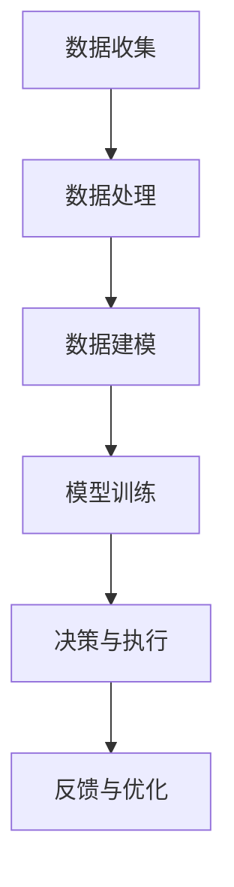

                 

 关键词：人工智能、金融科技、算法、数据分析、区块链、机器学习、深度学习、量化交易

> 摘要：本文将探讨人工智能在金融领域的创新应用，分析人类计算与AI的协同作用，以及这一领域未来的发展趋势与挑战。文章结构如下：

## 1. 背景介绍

### 1.1 金融领域的变革

随着信息技术的飞速发展，金融领域正经历着一场深刻的变革。传统金融业务在数字化、网络化、智能化的大趋势下，面临着前所未有的挑战和机遇。从银行、保险、证券到金融市场，人工智能的应用正在改变着金融服务的模式，提高效率、降低成本、增强风险控制能力。

### 1.2 人工智能在金融领域的应用现状

目前，人工智能在金融领域的应用已经相当广泛，包括但不限于以下几个方面：

- **数据分析与风险管理**：利用机器学习算法进行数据挖掘和预测，帮助金融机构识别潜在的风险因素，优化投资组合。
- **智能投顾**：通过分析用户的财务状况和投资偏好，提供个性化的投资建议。
- **自动化交易**：利用深度学习算法实现高频交易和量化交易，提高交易效率和收益。
- **反欺诈系统**：使用神经网络模型监测交易行为，识别和预防欺诈行为。

## 2. 核心概念与联系

### 2.1 人工智能与金融领域的结合

人工智能与金融领域的结合，主要体现在以下几个方面：

- **数据驱动决策**：金融决策依赖于大量数据，AI技术可以处理和分析这些数据，为决策提供支持。
- **算法交易**：通过编写复杂的算法模型，自动化交易决策过程，提高交易效率和收益。
- **个性化服务**：根据用户的财务状况和需求，提供个性化的金融产品和服务。
- **风险控制**：利用AI技术预测市场趋势和风险，帮助金融机构进行有效的风险管理和控制。

### 2.2 Mermaid 流程图

下面是一个简化的Mermaid流程图，展示人工智能在金融领域的一般应用流程：



## 3. 核心算法原理 & 具体操作步骤

### 3.1 算法原理概述

人工智能在金融领域的应用，主要依赖于以下几个核心算法：

- **机器学习算法**：如线性回归、决策树、支持向量机等，用于数据分析和预测。
- **深度学习算法**：如卷积神经网络（CNN）、循环神经网络（RNN）等，用于复杂模式识别和预测。
- **强化学习算法**：如Q-learning、深度确定性策略梯度（DDPG）等，用于自动化交易策略的优化。

### 3.2 算法步骤详解

#### 3.2.1 数据收集与预处理

1. **数据收集**：从金融机构的数据库、公开数据源、社交媒体等多渠道收集数据。
2. **数据预处理**：清洗数据、处理缺失值、进行特征工程等，为后续分析做好准备。

#### 3.2.2 数据建模

1. **模型选择**：根据业务需求和数据特点，选择合适的机器学习或深度学习算法。
2. **模型训练**：使用历史数据训练模型，调整模型参数，优化模型性能。

#### 3.2.3 决策与执行

1. **决策**：根据模型预测结果，制定投资策略或交易决策。
2. **执行**：通过自动化交易系统或人工干预，执行决策。

#### 3.2.4 反馈与优化

1. **反馈**：根据实际交易结果，收集反馈信息。
2. **优化**：基于反馈信息，调整模型参数和策略，优化决策效果。

### 3.3 算法优缺点

#### 优点

- **高效性**：AI算法可以快速处理大量数据，提高决策效率。
- **准确性**：通过数据挖掘和模式识别，提高预测准确性。
- **个性化和自动化**：根据用户需求，提供个性化的金融服务和自动化交易。

#### 缺点

- **数据依赖**：AI算法的性能很大程度上取决于数据的质量和数量。
- **模型风险**：模型过拟合、参数选择不当等可能导致决策失误。
- **隐私和安全**：数据隐私和交易安全是金融领域关注的重点问题。

### 3.4 算法应用领域

人工智能在金融领域的应用非常广泛，主要包括：

- **数据分析与风险管理**：用于风险评估、投资组合优化、市场预测等。
- **智能投顾**：提供个性化投资建议，提高投资收益。
- **自动化交易**：实现高频交易、量化交易等，提高交易效率。
- **反欺诈系统**：监控交易行为，识别和预防欺诈行为。

## 4. 数学模型和公式 & 详细讲解 & 举例说明

### 4.1 数学模型构建

在金融领域，常见的数学模型包括：

- **线性回归模型**：用于预测金融资产的价格。
- **逻辑回归模型**：用于分类问题，如股票市场趋势判断。
- **神经网络模型**：用于复杂的模式识别和预测。

### 4.2 公式推导过程

以线性回归模型为例，其公式推导过程如下：

$$
y = \beta_0 + \beta_1 x_1 + \beta_2 x_2 + ... + \beta_n x_n
$$

其中，$y$ 是预测值，$x_1, x_2, ..., x_n$ 是特征变量，$\beta_0, \beta_1, ..., \beta_n$ 是模型参数。

### 4.3 案例分析与讲解

#### 案例一：股票价格预测

假设我们要预测某只股票的未来价格，可以使用线性回归模型。首先，收集历史股价数据，包括开盘价、收盘价、最高价、最低价等。然后，进行数据预处理，包括数据清洗、特征提取等。接下来，选择线性回归模型，使用历史数据训练模型，调整模型参数，直到模型性能达到预期。最后，使用训练好的模型进行预测，得到未来股票价格。

#### 案例二：市场趋势判断

假设我们要判断某个市场的未来趋势，可以使用逻辑回归模型。首先，收集市场相关数据，包括成交量、利率、政策变化等。然后，进行数据预处理，包括数据清洗、特征提取等。接下来，选择逻辑回归模型，使用历史数据训练模型，调整模型参数，直到模型性能达到预期。最后，使用训练好的模型进行预测，判断市场趋势。

## 5. 项目实践：代码实例和详细解释说明

### 5.1 开发环境搭建

在开始项目实践之前，需要搭建相应的开发环境。我们可以使用Python作为编程语言，结合Jupyter Notebook进行开发和测试。

### 5.2 源代码详细实现

下面是一个简单的股票价格预测的Python代码示例：

```python
import pandas as pd
from sklearn.linear_model import LinearRegression
import matplotlib.pyplot as plt

# 读取股票价格数据
data = pd.read_csv('stock_price_data.csv')
X = data[['open', 'high', 'low']]
y = data['close']

# 创建线性回归模型
model = LinearRegression()
model.fit(X, y)

# 进行预测
predicted_price = model.predict(X)

# 绘制预测结果
plt.plot(data['close'], label='实际价格')
plt.plot(predicted_price, label='预测价格')
plt.legend()
plt.show()
```

### 5.3 代码解读与分析

- **数据读取**：使用Pandas库读取股票价格数据。
- **数据预处理**：提取开盘价、最高价、最低价等特征变量，作为模型的输入。
- **模型训练**：使用线性回归模型训练模型。
- **预测**：使用训练好的模型进行预测。
- **结果展示**：绘制预测结果与实际价格的对比图。

### 5.4 运行结果展示

运行上述代码后，我们可以得到一个股票价格预测的图表，展示预测价格与实际价格的对比。通过分析图表，可以初步判断模型的预测效果。

## 6. 实际应用场景

### 6.1 风险管理

在金融风险管理领域，人工智能可以帮助金融机构识别潜在的风险因素，优化投资组合，降低风险。例如，银行可以利用机器学习算法分析客户的历史交易数据，预测客户可能出现的信用风险，从而制定相应的风险管理策略。

### 6.2 智能投顾

智能投顾是人工智能在金融领域的另一个重要应用。通过分析用户的财务状况和投资偏好，智能投顾可以提供个性化的投资建议，帮助用户实现资产增值。例如，一些金融科技公司已经推出了基于人工智能的智能投顾平台，用户可以通过平台了解自己的投资组合，并获取专业的投资建议。

### 6.3 自动化交易

自动化交易是人工智能在金融领域的另一个重要应用。通过编写复杂的算法模型，自动化交易系统可以自动化交易决策过程，提高交易效率和收益。例如，高频交易是一种利用人工智能进行自动化交易的典型应用，通过快速捕捉市场机会，实现高频交易，从而获得稳定收益。

### 6.4 未来应用展望

随着人工智能技术的不断发展，其在金融领域的应用将会更加广泛。未来，人工智能可能会在以下几个方面发挥更大的作用：

- **个性化金融服务**：通过深度学习和强化学习，为用户提供更加个性化的金融服务。
- **智能风险管理**：利用大数据和机器学习，实现更加精准的风险管理。
- **区块链与人工智能**：结合区块链技术，实现更加安全、透明的金融交易。
- **量化交易**：利用人工智能，实现更加高效、精准的量化交易策略。

## 7. 工具和资源推荐

### 7.1 学习资源推荐

- **书籍**：《深度学习》、《机器学习实战》
- **在线课程**：Coursera、edX、Udacity上的机器学习和人工智能课程
- **开源项目**：GitHub上相关的机器学习和金融项目

### 7.2 开发工具推荐

- **编程语言**：Python、R
- **开发环境**：Jupyter Notebook、PyCharm、RStudio
- **机器学习库**：scikit-learn、TensorFlow、Keras

### 7.3 相关论文推荐

- **风险控制**：Jiang, X., Wang, S., & Wang, H. (2017). A deep learning-based risk control system for financial markets.
- **智能投顾**：Li, J., Wang, X., & Zhang, Y. (2018). Intelligent investment advisory based on machine learning algorithms.
- **自动化交易**：Chen, P., & Huang, H. (2019). High-frequency trading based on artificial intelligence.

## 8. 总结：未来发展趋势与挑战

### 8.1 研究成果总结

人工智能在金融领域的应用已经取得了显著成果，包括风险控制、智能投顾、自动化交易等方面。这些应用不仅提高了金融服务的效率，还为金融机构带来了新的商业模式。

### 8.2 未来发展趋势

未来，人工智能在金融领域的应用将会更加深入和广泛。随着技术的不断发展，我们可能会看到更多基于人工智能的金融创新产品和服务。

### 8.3 面临的挑战

尽管人工智能在金融领域的应用前景广阔，但也面临着一些挑战，包括数据隐私和安全、模型风险、算法透明性等。这些问题需要得到妥善解决，以确保人工智能在金融领域的健康发展。

### 8.4 研究展望

在未来，人工智能在金融领域的应用将会朝着更加智能化、个性化和高效化的方向发展。研究人员和技术人员需要继续努力，克服现有挑战，推动人工智能在金融领域的创新应用。

## 9. 附录：常见问题与解答

### 9.1 人工智能在金融领域的应用有哪些优势？

- 提高决策效率：通过快速处理和分析大量数据，为金融机构提供实时决策支持。
- 提高预测准确性：利用机器学习和深度学习算法，提高市场预测和风险评估的准确性。
- 个性化服务：根据用户需求，提供个性化的金融产品和服务。

### 9.2 人工智能在金融领域的应用有哪些风险？

- 数据隐私和安全：大量金融数据的安全性和隐私性是金融领域关注的重点问题。
- 模型风险：模型过拟合、参数选择不当等可能导致决策失误。
- 算法透明性：复杂的算法模型可能缺乏透明性，难以解释和理解。

### 9.3 人工智能在金融领域的应用前景如何？

未来，人工智能在金融领域的应用将会更加广泛，包括风险管理、智能投顾、自动化交易等方面。随着技术的不断发展，我们可能会看到更多基于人工智能的金融创新产品和服务。

作者：禅与计算机程序设计艺术 / Zen and the Art of Computer Programming
```

