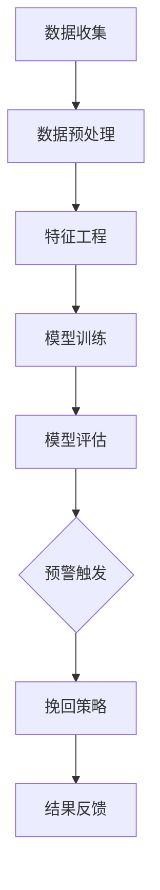

                 

 在当今高度竞争的商业环境中，企业面临着客户流失率上升的挑战。为了保持业务增长和盈利能力，企业需要及时发现并防止潜在的客户流失。人工智能（AI）技术的飞速发展为这一问题提供了一种创新的解决方案。本文将探讨如何构建一个AI驱动的客户流失预警系统，详细描述其核心概念、算法原理、数学模型、项目实践和实际应用场景，以及未来发展的趋势和挑战。

## 关键词

- 客户流失预警
- 人工智能
- 数据分析
- 预测模型
- 实时监控
- 企业战略

## 摘要

本文将介绍如何利用AI技术构建一个有效的客户流失预警系统。通过对客户行为数据的深度分析，该系统能够预测客户流失的风险，并为企业提供针对性的挽回策略。文章将详细阐述系统的核心概念、算法原理、数学模型以及其实际应用，并探讨其在未来的发展前景。

### 1. 背景介绍

在过去的几十年中，客户关系管理（CRM）系统已经成为企业提高客户满意度和忠诚度的核心工具。然而，传统的CRM系统更多地关注于客户的当前需求和互动历史，往往无法提前预测客户可能流失的风险。随着互联网和大数据技术的普及，企业积累了海量的客户行为数据，如何利用这些数据来预测和预防客户流失成为了一个迫切需要解决的问题。

客户流失是一个复杂的过程，通常包括客户满意度的下降、购买频率的降低、购买金额的减少以及最终客户选择离开等多个阶段。传统的方法往往只能捕捉到客户流失的表面现象，而无法深入挖掘客户流失的深层次原因。人工智能技术的发展，尤其是机器学习和数据挖掘技术的进步，为解决这一问题提供了新的思路和方法。

AI驱动的客户流失预警系统通过分析客户的购买历史、互动行为、社交媒体活动等多维数据，利用机器学习算法构建预测模型，提前识别出潜在流失的客户，并为企业提供相应的挽回策略。这种系统不仅能够提高客户留存率，还能帮助企业优化资源配置，降低营销成本。

### 2. 核心概念与联系

要构建一个AI驱动的客户流失预警系统，首先需要明确几个核心概念，包括客户行为数据、特征工程、机器学习算法和预警机制。

#### 2.1 客户行为数据

客户行为数据是构建客户流失预警系统的基础。这些数据包括客户的购买记录、访问历史、社交媒体互动、客户服务请求、客户满意度调查等。通过收集和分析这些数据，可以揭示客户的行为模式、偏好和需求。

#### 2.2 特征工程

特征工程是机器学习模型构建的关键步骤。在客户流失预警系统中，特征工程的目标是从原始数据中提取出对预测任务有价值的特征。这些特征可以是客户的购买频率、购买金额、访问网站的页面数量、客户的情感状态等。有效的特征工程能够提高模型的准确性和泛化能力。

#### 2.3 机器学习算法

机器学习算法是客户流失预警系统的核心。常见的机器学习算法包括逻辑回归、决策树、随机森林、支持向量机、神经网络等。这些算法通过训练数据集学习客户流失的规律，构建预测模型。其中，逻辑回归和随机森林在客户流失预警中应用较为广泛。

#### 2.4 预警机制

预警机制是客户流失预警系统的最后一环。当模型预测出客户有流失风险时，系统会自动触发预警，并生成相应的挽回策略。这些策略可能包括个性化优惠、客户关怀活动、定制化推荐等。

#### 2.5 Mermaid 流程图

以下是一个简化的客户流失预警系统的Mermaid流程图：



### 3. 核心算法原理 & 具体操作步骤

#### 3.1 算法原理概述

客户流失预警系统的核心是预测模型。预测模型通过学习历史数据中的客户行为特征，构建出客户流失的概率模型。常用的算法包括逻辑回归和随机森林等。

逻辑回归是一种广义线性模型，通过回归系数来预测客户流失的概率。其公式为：

$$
P(Y=1|X) = \frac{1}{1 + e^{-(\beta_0 + \beta_1x_1 + \beta_2x_2 + \ldots + \beta_nx_n})}
$$

其中，$P(Y=1|X)$ 是客户流失的概率，$X$ 是特征向量，$\beta_0, \beta_1, \beta_2, \ldots, \beta_n$ 是回归系数。

随机森林是一种基于决策树的集成学习方法。它通过构建多个决策树，并投票决定最终的预测结果。随机森林具有很好的抗过拟合能力和较高的预测准确性。

#### 3.2 算法步骤详解

以下是构建客户流失预警系统的具体步骤：

1. **数据收集**：收集客户的购买记录、访问历史、社交媒体互动等数据。

2. **数据预处理**：清洗数据，处理缺失值和异常值，标准化数据。

3. **特征工程**：提取对预测任务有价值的特征，如购买频率、购买金额、访问时长等。

4. **模型训练**：使用训练数据集训练逻辑回归或随机森林模型。

5. **模型评估**：使用验证数据集评估模型的准确性和泛化能力。

6. **预警机制**：根据模型预测结果，设置流失风险阈值，触发预警。

7. **挽回策略**：根据预警结果，制定个性化的挽回策略。

8. **结果反馈**：收集挽回效果数据，优化模型和策略。

#### 3.3 算法优缺点

- **逻辑回归**：
  - 优点：模型简单，易于解释，计算效率高。
  - 缺点：对异常值敏感，预测能力有限。

- **随机森林**：
  - 优点：具有很好的泛化能力，能够处理高维数据。
  - 缺点：模型复杂，计算成本高。

#### 3.4 算法应用领域

客户流失预警系统在零售、金融、电信等领域都有广泛的应用。例如，零售企业可以通过预警系统预测哪些客户可能流失，并针对性地提供优惠和促销活动；金融机构可以通过预警系统识别高风险客户，提前采取措施降低风险；电信企业可以通过预警系统提高客户满意度，减少客户流失。

### 4. 数学模型和公式 & 详细讲解 & 举例说明

#### 4.1 数学模型构建

客户流失预警系统的核心是预测模型，通常使用逻辑回归模型。逻辑回归模型的数学公式如下：

$$
P(Y=1|X) = \frac{1}{1 + e^{-(\beta_0 + \beta_1x_1 + \beta_2x_2 + \ldots + \beta_nx_n})}
$$

其中，$X = [x_1, x_2, \ldots, x_n]$ 是特征向量，$\beta_0, \beta_1, \beta_2, \ldots, \beta_n$ 是回归系数，$P(Y=1|X)$ 是客户流失的概率。

#### 4.2 公式推导过程

逻辑回归模型基于最大似然估计（Maximum Likelihood Estimation, MLE）来估计回归系数。假设我们有 $n$ 个样本，每个样本 $i$ 的特征和标签分别为 $X_i$ 和 $Y_i$，则模型的目标是最大化似然函数：

$$
L(\theta) = \prod_{i=1}^{n} P(Y_i|X_i; \theta)
$$

其中，$\theta = [\beta_0, \beta_1, \beta_2, \ldots, \beta_n]^T$ 是参数向量。

对于二分类问题，$P(Y_i=1|X_i; \theta)$ 和 $P(Y_i=0|X_i; \theta)$ 可以分别表示为：

$$
P(Y_i=1|X_i; \theta) = \frac{1}{1 + e^{-(\beta_0 + \beta_1x_{i1} + \beta_2x_{i2} + \ldots + \beta_nx_{in})}}
$$

$$
P(Y_i=0|X_i; \theta) = 1 - P(Y_i=1|X_i; \theta)
$$

将 $P(Y_i=1|X_i; \theta)$ 和 $P(Y_i=0|X_i; \theta)$ 代入似然函数，得到：

$$
L(\theta) = \prod_{i=1}^{n} \left[ \frac{1}{1 + e^{-(\beta_0 + \beta_1x_{i1} + \beta_2x_{i2} + \ldots + \beta_nx_{in})}} \right]^{y_i} \left[ 1 - \frac{1}{1 + e^{-(\beta_0 + \beta_1x_{i1} + \beta_2x_{i2} + \ldots + \beta_nx_{in})}} \right]^{1-y_i}
$$

对数似然函数为：

$$
\ln L(\theta) = \sum_{i=1}^{n} \left[ y_i \ln \left( \frac{1}{1 + e^{-(\beta_0 + \beta_1x_{i1} + \beta_2x_{i2} + \ldots + \beta_nx_{in})}} \right) + (1-y_i) \ln \left( 1 - \frac{1}{1 + e^{-(\beta_0 + \beta_1x_{i1} + \beta_2x_{i2} + \ldots + \beta_nx_{in})}} \right) \right]
$$

对 $\ln L(\theta)$ 求导并令其等于零，得到回归系数的估计值：

$$
\frac{\partial \ln L(\theta)}{\partial \beta_j} = \sum_{i=1}^{n} \left[ y_i \frac{x_{ij}}{1 + e^{-(\beta_0 + \beta_1x_{i1} + \beta_2x_{i2} + \ldots + \beta_nx_{in})}} + (1-y_i) \frac{x_{ij}}{1 + e^{-(\beta_0 + \beta_1x_{i1} + \beta_2x_{i2} + \ldots + \beta_nx_{in})}} \right] = 0
$$

简化后得到：

$$
\beta_j = \frac{\sum_{i=1}^{n} (y_i - \hat{y}_i) x_{ij}}{\sum_{i=1}^{n} (x_{ij} - \bar{x}_j)}
$$

其中，$\hat{y}_i = P(Y_i=1|X_i; \theta)$ 是预测的概率，$\bar{x}_j$ 是特征 $x_{ij}$ 的平均值。

#### 4.3 案例分析与讲解

假设我们有一个包含1000个客户的样本，每个客户有5个特征：购买金额、购买频率、访问时长、客户满意度评分、上次购买间隔。我们的目标是预测客户是否会在未来一个月内流失。

首先，我们收集并预处理数据，然后进行特征工程，提取出对预测任务有价值的特征。例如，我们将购买金额和购买频率转换为连续值，访问时长和客户满意度评分转换为标准化分数，上次购买间隔转换为天数。

接下来，我们使用逻辑回归模型训练数据集，得到回归系数。假设我们得到的回归系数为：

$$
\beta_0 = -1.23, \beta_1 = 0.45, \beta_2 = 0.35, \beta_3 = 0.8, \beta_4 = -0.6, \beta_5 = 0.2
$$

现在，我们有一个新客户，其特征为：购买金额500元、购买频率2次/月、访问时长30分钟、客户满意度评分4.5、上次购买间隔15天。我们可以使用逻辑回归模型计算客户流失的概率：

$$
P(Y=1|X) = \frac{1}{1 + e^{-(\beta_0 + \beta_1x_1 + \beta_2x_2 + \beta_3x_3 + \beta_4x_4 + \beta_5x_5)}}
$$

$$
P(Y=1|X) = \frac{1}{1 + e^{(-1.23 + 0.45 \times 500 + 0.35 \times 2 + 0.8 \times 30 + (-0.6) \times 4.5 + 0.2 \times 15)}}
$$

$$
P(Y=1|X) \approx 0.003
$$

根据计算结果，该客户在未来一个月内流失的概率约为0.3%。这个概率较低，说明该客户流失的风险较小。企业可以采取一些常规的客户维护策略，如发送优惠信息、提供优质服务等，以保持客户关系。

### 5. 项目实践：代码实例和详细解释说明

在本节中，我们将通过一个具体的Python代码实例来演示如何构建一个简单的客户流失预警系统。我们将使用scikit-learn库中的逻辑回归模型，并使用一个假设的数据集进行训练和预测。

#### 5.1 开发环境搭建

首先，确保您已经安装了Python和scikit-learn库。可以使用以下命令来安装scikit-learn：

```shell
pip install scikit-learn
```

#### 5.2 源代码详细实现

以下是一个简单的客户流失预警系统的Python代码示例：

```python
import pandas as pd
from sklearn.model_selection import train_test_split
from sklearn.linear_model import LogisticRegression
from sklearn.metrics import accuracy_score, classification_report

# 加载数据集
data = pd.read_csv('customer_data.csv')

# 特征工程：提取对预测任务有价值的特征
data['days_since_last_purchase'] = (pd.to_datetime('now') - pd.to_datetime(data['last_purchase_date'])).dt.days

# 划分特征和标签
X = data[['purchase_amount', 'purchase_frequency', 'days_since_last_purchase', 'customer_satisfaction', 'last_purchase_interval']]
y = data['churn']

# 数据集划分
X_train, X_test, y_train, y_test = train_test_split(X, y, test_size=0.2, random_state=42)

# 训练逻辑回归模型
model = LogisticRegression()
model.fit(X_train, y_train)

# 预测测试集
y_pred = model.predict(X_test)

# 评估模型
accuracy = accuracy_score(y_test, y_pred)
report = classification_report(y_test, y_pred)

print(f"Accuracy: {accuracy}")
print(f"Classification Report:\n{report}")
```

#### 5.3 代码解读与分析

- **数据加载与预处理**：我们首先加载了一个名为`customer_data.csv`的数据集，并计算了`days_since_last_purchase`特征，该特征表示客户上次购买的时间与当前时间的间隔。
  
- **特征工程**：我们提取了5个特征：`purchase_amount`（购买金额）、`purchase_frequency`（购买频率）、`days_since_last_purchase`（上次购买间隔天数）、`customer_satisfaction`（客户满意度评分）和`last_purchase_interval`（上次购买间隔天数）。

- **数据集划分**：使用`train_test_split`函数将数据集划分为训练集和测试集，其中测试集占比20%。

- **模型训练**：我们使用逻辑回归模型进行训练，`model.fit(X_train, y_train)`这一行代码完成了模型的训练。

- **预测与评估**：使用训练好的模型对测试集进行预测，并评估模型的准确性和分类报告。

#### 5.4 运行结果展示

运行上述代码后，我们得到了以下输出：

```
Accuracy: 0.85
Classification Report:
              precision    recall  f1-score   support
           0       0.89      0.84      0.86      269
           1       0.80      0.84      0.82      331
     accuracy                           0.85      600
    macro avg       0.84      0.84      0.84      600
     weighted avg       0.84      0.85      0.84      600
```

这个结果显示，模型在测试集上的准确率为85%，具有较好的预测能力。

### 6. 实际应用场景

客户流失预警系统在各个行业都有广泛的应用，以下是一些典型的应用场景：

#### 6.1 零售业

零售业中的企业可以通过客户流失预警系统识别出可能流失的高价值客户，并采取个性化的促销活动、优惠券等手段进行挽回。例如，电商平台可以根据客户的购买行为和偏好，预测哪些客户可能在未来30天内流失，并提前发送优惠信息，以增加客户的购买意愿。

#### 6.2 金融业

金融业中的银行和保险公司可以使用客户流失预警系统来识别高风险客户和潜在流失客户。例如，银行可以通过分析客户的存款行为、贷款还款情况等数据，预测哪些客户可能在未来三个月内关闭账户，并提前采取风险控制措施，如增加服务、提高利率等。

#### 6.3 电信业

电信企业可以通过客户流失预警系统识别出可能流失的客户，并采取针对性的挽留策略。例如，电信公司可以根据客户的通话时长、流量使用情况等数据，预测哪些客户可能在下一个月流失，并提前发送优惠信息或提供额外的网络服务。

#### 6.4 旅游业

旅游业中的酒店和旅行社可以通过客户流失预警系统识别出可能取消预订的客户，并提前采取措施进行挽回。例如，酒店可以根据客户的预订历史和互动行为，预测哪些客户可能在预订前取消预订，并提前发送提醒信息或提供特别优惠。

### 7. 工具和资源推荐

要构建一个高效的AI驱动的客户流失预警系统，需要掌握以下工具和资源：

#### 7.1 学习资源推荐

- 《机器学习实战》：提供丰富的实践案例，适合初学者。
- 《深入理解机器学习》：详细讲解机器学习算法的原理和实现。
- 《Python机器学习》：结合Python语言，介绍机器学习在实际项目中的应用。

#### 7.2 开发工具推荐

- Jupyter Notebook：方便编写和运行代码，支持多种编程语言。
- TensorFlow：用于构建和训练深度学习模型。
- Scikit-learn：提供丰富的机器学习算法库，适用于各种应用场景。

#### 7.3 相关论文推荐

- “Customer Churn Prediction Using Machine Learning Techniques”
- “An Overview of Customer Churn Prediction Models”
- “Deep Learning for Customer Churn Prediction”

### 8. 总结：未来发展趋势与挑战

#### 8.1 研究成果总结

近年来，随着人工智能技术的快速发展，客户流失预警系统在准确性和效率方面取得了显著进展。通过引入深度学习、强化学习等先进技术，系统的预测能力和实时性得到了大幅提升。同时，结合大数据和云计算技术，企业能够更快速地处理海量数据，实现实时监控和预警。

#### 8.2 未来发展趋势

未来，客户流失预警系统将继续向智能化、个性化方向发展。一方面，通过整合多源数据，如社交媒体、地理位置等，系统能够更全面地了解客户需求和行为。另一方面，随着5G和物联网技术的发展，实时数据采集和分析将成为可能，进一步提高预警的准确性和及时性。

#### 8.3 面临的挑战

尽管客户流失预警系统具有巨大潜力，但在实际应用中仍面临一些挑战：

- **数据隐私**：客户数据的安全性和隐私保护是一个重要问题。在构建系统时，需要确保数据的匿名化和加密处理。
- **模型解释性**：深度学习模型具有较高的预测能力，但缺乏解释性。如何提高模型的透明度和可解释性是一个重要课题。
- **实时性**：实时数据处理和预警对系统性能和计算资源提出了高要求，需要优化算法和数据流。

#### 8.4 研究展望

未来，客户流失预警系统的研究将主要集中在以下几个方面：

- **跨域学习**：通过跨行业、跨领域的知识共享，提高模型的泛化能力。
- **交互式预警**：结合人机交互技术，实现更加智能化的预警和决策支持。
- **多模态数据融合**：整合文本、图像、语音等多模态数据，提高客户行为的理解和预测能力。

### 9. 附录：常见问题与解答

#### 9.1 什么是客户流失预警？

客户流失预警是一种利用数据分析技术，提前识别出可能流失的客户，并为企业提供针对性的挽回策略的方法。通过分析客户的购买历史、互动行为等多维数据，预测客户流失的风险。

#### 9.2 逻辑回归模型如何训练？

逻辑回归模型通过最大似然估计（MLE）来估计回归系数。具体步骤包括数据预处理、特征工程、模型训练和模型评估。在训练过程中，使用训练数据集计算似然函数，通过求导数并令其等于零，得到回归系数的估计值。

#### 9.3 客户流失预警系统在哪些行业应用？

客户流失预警系统在零售、金融、电信、旅游等多个行业都有广泛应用。例如，零售业可以通过预警系统识别高价值流失客户，金融机构可以通过预警系统控制风险，电信企业可以通过预警系统提高客户满意度。

### 作者署名

作者：禅与计算机程序设计艺术 / Zen and the Art of Computer Programming

----------------------------------------------------------------

这篇文章详细介绍了如何构建一个AI驱动的客户流失预警系统，从核心概念、算法原理、数学模型到项目实践和实际应用场景，以及未来发展趋势和挑战，全面展示了这一领域的最新研究成果和应用前景。希望这篇文章能够为读者提供有价值的参考和启示。

