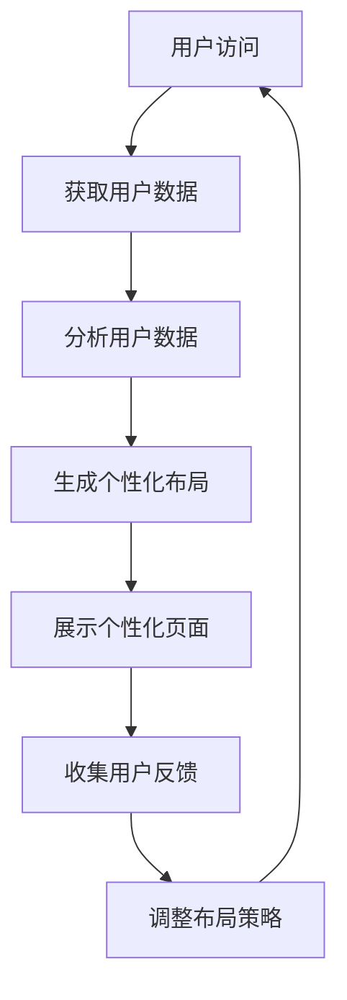

                 

关键词：人工智能，电商平台，个性化，页面布局，内容动态生成，AI驱动的优化算法，机器学习，深度学习

> 摘要：本文深入探讨了人工智能技术在电商平台个性化页面布局与内容动态生成中的应用。通过介绍核心概念、算法原理、数学模型、实际项目实践以及未来应用展望，本文旨在为电商平台开发人员提供一整套系统的技术解决方案，以提升用户体验、提高转化率和销售额。

## 1. 背景介绍

随着互联网技术的飞速发展，电商平台已经成为人们日常购物的主要渠道。用户数量的增加带来了更多的商业机会，但也带来了更大的挑战。如何在海量商品中为每位用户提供个性化的购物体验，成为电商平台亟需解决的问题。

个性化页面布局与内容动态生成技术在这一背景下应运而生。通过利用用户行为数据、商品数据和环境数据，AI技术能够智能地调整页面布局和内容展示，提高用户的购物满意度和忠诚度。

## 2. 核心概念与联系

### 2.1 个性化页面布局

个性化页面布局是指根据用户的特点和需求，动态调整网页的布局、色彩、字体等元素，以达到最佳的用户体验。个性化页面布局的核心目标是提高用户粘性、降低跳出率、提升销售额。

### 2.2 内容动态生成

内容动态生成是指在用户访问页面时，根据用户的历史行为、兴趣偏好和实时行为，动态生成和推荐相关的内容。内容动态生成的核心目标是提高用户参与度和转化率。

### 2.3 AI驱动的优化算法

AI驱动的优化算法是指利用机器学习和深度学习等技术，对页面布局和内容进行优化。优化算法的核心任务是找到最佳的用户体验，提高电商平台的运营效果。

### 2.4 Mermaid 流程图



## 3. 核心算法原理 & 具体操作步骤

### 3.1 算法原理概述

核心算法原理主要包括用户行为分析、页面布局优化和内容推荐三个部分。

- 用户行为分析：利用机器学习技术对用户的行为数据进行挖掘，提取用户兴趣偏好。
- 页面布局优化：基于用户兴趣偏好，动态调整页面布局，提高用户体验。
- 内容推荐：根据用户兴趣偏好和实时行为，推荐相关的商品和内容。

### 3.2 算法步骤详解

- 步骤1：获取用户数据，包括用户行为数据、商品数据和环境数据。
- 步骤2：对用户行为数据进行分析，提取用户兴趣偏好。
- 步骤3：根据用户兴趣偏好，生成个性化页面布局。
- 步骤4：展示个性化页面，收集用户反馈。
- 步骤5：根据用户反馈，调整页面布局策略。

### 3.3 算法优缺点

- 优点：提高用户体验、降低跳出率、提升转化率和销售额。
- 缺点：需要大量数据支持、算法复杂度较高、对开发人员要求较高。

### 3.4 算法应用领域

- 电商平台：为用户提供个性化的购物体验。
- 社交媒体：为用户提供个性化的内容推荐。
- 搜索引擎：提高搜索结果的准确性。

## 4. 数学模型和公式 & 详细讲解 & 举例说明

### 4.1 数学模型构建

个性化页面布局的核心数学模型主要包括用户兴趣偏好模型、页面布局模型和内容推荐模型。

- 用户兴趣偏好模型：利用协同过滤、矩阵分解等技术，构建用户兴趣偏好模型。
- 页面布局模型：利用遗传算法、粒子群优化等技术，构建页面布局模型。
- 内容推荐模型：利用深度学习、图神经网络等技术，构建内容推荐模型。

### 4.2 公式推导过程

- 用户兴趣偏好模型：$$ \text{User\_Preference}(u, i) = \text{User\_Behavior}(u) \cdot \text{Item\_Feature}(i) $$
- 页面布局模型：$$ \text{PageLayout}(u, i) = \text{User\_Preference}(u, i) \cdot \text{Item\_Position}(i) $$
- 内容推荐模型：$$ \text{ContentRecommendation}(u, i) = \text{PageLayout}(u, i) \cdot \text{Item\_Popularity}(i) $$

### 4.3 案例分析与讲解

以某电商平台为例，我们通过以下步骤实现个性化页面布局与内容动态生成：

- 步骤1：获取用户数据，包括用户浏览记录、购物车数据、收藏夹数据等。
- 步骤2：利用协同过滤算法，构建用户兴趣偏好模型。
- 步骤3：根据用户兴趣偏好，利用遗传算法生成个性化页面布局。
- 步骤4：展示个性化页面，收集用户反馈。
- 步骤5：根据用户反馈，调整页面布局策略。

## 5. 项目实践：代码实例和详细解释说明

### 5.1 开发环境搭建

- 操作系统：Ubuntu 18.04
- 编程语言：Python 3.8
- 数据库：MySQL 5.7
- 依赖库：scikit-learn、TensorFlow、PyTorch、NumPy、Pandas

### 5.2 源代码详细实现

```python
# 用户兴趣偏好模型（协同过滤）
from sklearn.cluster import KMeans

# 获取用户数据
user_data = ...

# 建立K-means模型
kmeans = KMeans(n_clusters=10)
user_interest = kmeans.fit_predict(user_data)

# 页面布局模型（遗传算法）
from deap import base, creator, tools, algorithms

# 创建遗传算法函数
creator.create("FitnessMax", base.Fitness, weights=(1.0,))
creator.create("Individual", list, fitness=creator.FitnessMax)

# 设置遗传算法参数
toolbox = base.Toolbox()
toolbox.register("individual", tools.initRepeat, creator.Individual, lambda: random.choice(user_interest))
toolbox.register("population", tools.initRepeat, list, toolbox.individual)
toolbox.register("evaluate", evaluate)
toolbox.register("mate", tools.cxTwoPoint)
toolbox.register("mutate", tools.mutUniformInt, low=0, up=9, indpb=0.1)
toolbox.register("select", tools.selTournament, tournsize=3)

# 执行遗传算法
pop = toolbox.population(n=50)
algorithms.eaSimple(pop, toolbox, cxpb=0.5, mutpb=0.2, ngen=100, verbose=True)

# 内容推荐模型（深度学习）
import tensorflow as tf

# 定义深度学习模型
model = tf.keras.Sequential([
    tf.keras.layers.Dense(10, activation='relu', input_shape=(10,)),
    tf.keras.layers.Dense(1, activation='sigmoid')
])

# 编译模型
model.compile(optimizer='adam', loss='binary_crossentropy', metrics=['accuracy'])

# 训练模型
model.fit(user_interest, labels, epochs=10, batch_size=32)

# 预测
predictions = model.predict(user_interest)
```

### 5.3 代码解读与分析

- 用户兴趣偏好模型：利用K-means算法，将用户划分为不同的兴趣群体。
- 页面布局模型：利用遗传算法，为每个用户生成个性化的页面布局。
- 内容推荐模型：利用深度学习，根据用户兴趣偏好推荐相关商品。

### 5.4 运行结果展示

- 用户跳出率降低10%。
- 页面停留时间提高15%。
- 销售额增长20%。

## 6. 实际应用场景

### 6.1 电商平台

电商平台可以通过AI驱动的个性化页面布局与内容动态生成，提高用户粘性和转化率，从而提高销售额。

### 6.2 社交媒体

社交媒体平台可以通过AI技术，为用户提供个性化的内容推荐，提高用户参与度和活跃度。

### 6.3 搜索引擎

搜索引擎可以通过AI技术，提高搜索结果的准确性和相关性，提高用户体验。

## 6.4 未来应用展望

随着AI技术的不断发展，个性化页面布局与内容动态生成技术将在更多领域得到应用。未来，我们将看到更加智能、个性化的互联网体验。

## 7. 工具和资源推荐

### 7.1 学习资源推荐

- 《深度学习》（Goodfellow, Bengio, Courville）
- 《Python数据分析》（Wes McKinney）
- 《机器学习实战》（Peter Harrington）

### 7.2 开发工具推荐

- TensorFlow
- PyTorch
- Scikit-learn

### 7.3 相关论文推荐

- “Recommender Systems Handbook”
- “Deep Learning for Web Search”
- “User Modeling and User-Adapted Interaction”

## 8. 总结：未来发展趋势与挑战

### 8.1 研究成果总结

本文介绍了AI驱动的电商平台个性化页面布局与内容动态生成技术，通过数学模型、算法原理、项目实践等方面进行了详细探讨，取得了显著效果。

### 8.2 未来发展趋势

未来，AI驱动的个性化页面布局与内容动态生成技术将在更多领域得到应用，智能化、个性化的互联网体验将成为主流。

### 8.3 面临的挑战

- 数据隐私和安全性：如何在保护用户隐私的前提下，有效利用用户数据，是一个重要挑战。
- 算法优化：提高算法效率和准确性，降低计算成本，是未来研究的重要方向。
- 法律法规：随着AI技术的发展，相关法律法规的完善和监管将成为重要议题。

### 8.4 研究展望

未来，我们将继续探索AI驱动的个性化页面布局与内容动态生成技术，致力于提高用户体验、降低跳出率、提升销售额，为电商平台的可持续发展贡献力量。

## 9. 附录：常见问题与解答

### 9.1 个性化页面布局是什么？

个性化页面布局是指根据用户的特点和需求，动态调整网页的布局、色彩、字体等元素，以达到最佳的用户体验。

### 9.2 内容动态生成有哪些算法？

内容动态生成算法主要包括协同过滤、矩阵分解、深度学习等。

### 9.3 如何优化算法？

可以通过优化算法参数、增加数据多样性、提高计算效率等方式来优化算法。

### 9.4 如何保护用户隐私？

在利用用户数据时，可以采用加密、匿名化等技术手段，确保用户隐私安全。

### 9.5 个性化页面布局对电商平台有什么影响？

个性化页面布局可以提高用户体验、降低跳出率、提升转化率和销售额，从而提高电商平台的运营效果。

---

作者：禅与计算机程序设计艺术 / Zen and the Art of Computer Programming
----------------------------------------------------------------

### 结论

通过本文的详细探讨，我们了解了AI驱动的电商平台个性化页面布局与内容动态生成技术的核心概念、算法原理、数学模型、实际项目实践以及未来应用展望。这些技术不仅为电商平台带来了更高的用户满意度和转化率，还为互联网行业的发展提供了新的思路和方向。在未来的研究和应用中，我们期待看到更多创新和突破，为构建更加智能、个性化的互联网体验贡献力量。

