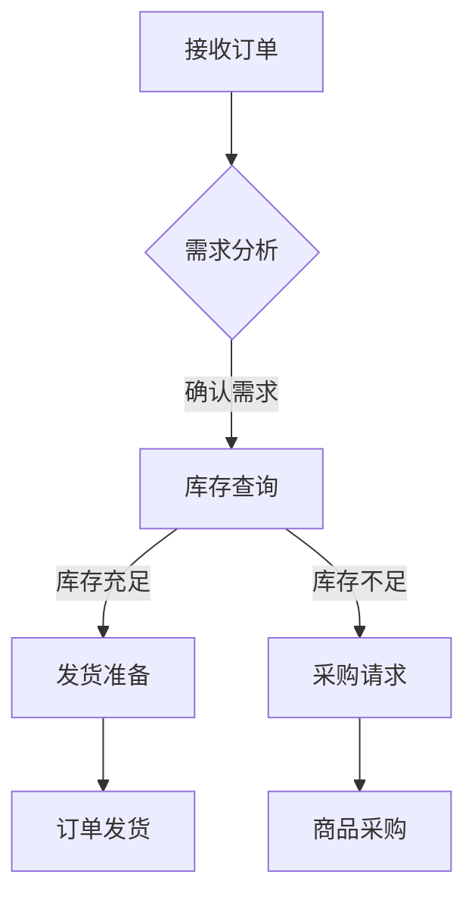

                 

关键词：人工智能，电商平台，库存管理，优化算法，深度学习，预测模型

> 摘要：随着电子商务行业的快速发展，库存管理成为电商平台的核心问题。本文介绍了一种基于人工智能技术的库存管理解决方案，通过深度学习预测模型和优化算法，实现库存水平的精确控制，提高电商平台的市场竞争力。

## 1. 背景介绍

电子商务的蓬勃发展，带动了全球在线购物市场的巨大增长。然而，随着订单量的激增，电商平台面临的一个主要挑战是库存管理。不当的库存管理可能导致库存过剩或短缺，从而影响用户体验和运营成本。传统的库存管理方法通常基于历史数据和规则，但在面对复杂多变的电商环境时，效果有限。

近年来，人工智能技术的迅猛发展，为解决库存管理问题提供了新的思路。深度学习、机器学习等算法能够从海量数据中挖掘隐藏的模式和规律，从而为电商平台提供更加精准的库存预测和优化方案。

## 2. 核心概念与联系

### 2.1 人工智能与深度学习

人工智能（AI）是一门模拟人类智能行为的技术科学，包括机器学习、自然语言处理、计算机视觉等多个子领域。深度学习是机器学习的一个重要分支，通过构建深度神经网络模型，能够自动从数据中学习复杂的特征和模式。

### 2.2 电商平台库存管理

电商平台库存管理涉及商品入库、存储、出库、销售等各个环节。传统的库存管理方法主要依赖于历史数据和固定规则，例如最小库存量、最大库存量等。然而，这种方法在面对多变的市场需求时，往往无法及时调整。

### 2.3 优化算法

优化算法是用于解决资源分配问题的算法，目标是最小化成本或最大化收益。在电商平台库存管理中，优化算法可用于确定最优的进货量、存储策略和出库策略。

### 2.4 Mermaid 流程图

下面是一个Mermaid流程图，展示了电商平台库存管理的基本流程：



## 3. 核心算法原理 & 具体操作步骤

### 3.1 算法原理概述

本文的核心算法是基于深度学习模型的库存预测和优化算法。首先，通过收集电商平台的交易数据、用户行为数据和市场环境数据，构建一个深度神经网络模型，用于预测未来一段时间内的商品需求量。然后，结合历史采购数据和市场需求，运用优化算法确定最优的库存策略。

### 3.2 算法步骤详解

#### 3.2.1 数据收集与预处理

1. **数据收集**：收集电商平台的交易数据、用户行为数据和市场环境数据。
2. **数据预处理**：对收集到的数据清洗、去噪、归一化等处理，以便于后续的建模。

#### 3.2.2 模型构建

1. **特征工程**：提取与库存预测相关的特征，如商品种类、用户购买历史、市场价格等。
2. **模型选择**：选择合适的深度学习模型，如卷积神经网络（CNN）、循环神经网络（RNN）或长短期记忆网络（LSTM）。
3. **模型训练**：使用预处理后的数据训练深度学习模型，调整模型参数，以达到最优预测效果。

#### 3.2.3 预测与优化

1. **需求预测**：使用训练好的模型对未来的商品需求量进行预测。
2. **库存优化**：根据预测结果和优化算法，确定最优的库存策略，包括进货量、存储位置和出库顺序等。

### 3.3 算法优缺点

#### 优点：

1. **高精度预测**：基于深度学习模型的需求预测，能够准确捕捉市场变化趋势。
2. **实时调整**：优化算法可以根据实时数据动态调整库存策略，提高库存利用效率。

#### 缺点：

1. **计算成本**：深度学习模型的训练和优化需要大量计算资源，可能导致较高的成本。
2. **数据依赖**：算法的性能依赖于数据的质量和数量，数据缺失或不准确可能导致预测误差。

### 3.4 算法应用领域

1. **电商平台**：通过精确的库存管理，提高用户满意度，降低运营成本。
2. **物流行业**：优化库存管理，提高物流效率，减少库存成本。
3. **制造业**：通过预测需求，合理安排生产计划，降低库存压力。

## 4. 数学模型和公式

### 4.1 数学模型构建

在库存管理中，常用的数学模型包括需求预测模型和优化模型。

#### 需求预测模型：

$$
\hat{D_t} = f(X_t, \theta)
$$

其中，$D_t$表示第$t$时间点的需求量，$X_t$表示影响需求量的特征变量，$\theta$表示模型参数。

#### 优化模型：

$$
\min Z = \sum_{i=1}^{n} c_i x_i + \sum_{j=1}^{m} w_j y_j
$$

$$
s.t. \quad Ax \leq b, \quad Ay \leq d, \quad x, y \geq 0
$$

其中，$Z$表示目标函数，$c_i, w_j$分别表示成本和权重，$x, y$分别表示决策变量，$A, b, d$表示约束条件。

### 4.2 公式推导过程

#### 需求预测模型推导：

1. **特征提取**：选择与需求量相关的特征变量，如用户购买历史、商品种类等。
2. **模型构建**：构建一个线性回归模型，将特征变量与需求量关联。
3. **参数优化**：通过最小二乘法优化模型参数，使预测误差最小。

#### 优化模型推导：

1. **目标函数**：定义目标函数，包括成本和权重。
2. **约束条件**：根据实际情况，设定约束条件，如库存量限制、存储容量限制等。
3. **求解方法**：采用线性规划、动态规划等方法求解最优解。

### 4.3 案例分析与讲解

#### 案例一：电商平台库存管理

某电商平台希望通过深度学习模型优化库存管理，降低库存成本。首先，收集了过去一年的交易数据、用户行为数据和市场需求数据。然后，构建一个LSTM模型，用于预测未来的商品需求量。最后，结合优化模型，确定最优的进货量和存储策略。

#### 案例二：物流行业库存优化

某物流公司希望通过优化库存管理，提高物流效率。首先，收集了货物的运输数据、仓储数据和市场需求数据。然后，构建一个卷积神经网络模型，用于预测未来的货物需求量。最后，结合优化模型，确定最优的运输路线和仓储策略。

## 5. 项目实践：代码实例和详细解释说明

### 5.1 开发环境搭建

为了实现本文的算法，我们选择了Python作为开发语言，并使用TensorFlow作为深度学习框架。以下是开发环境的搭建步骤：

1. 安装Python（版本3.7或以上）
2. 安装TensorFlow
   ```
   pip install tensorflow
   ```
3. 安装其他依赖库，如NumPy、Pandas等

### 5.2 源代码详细实现

以下是一个简单的深度学习模型实现，用于预测商品需求量：

```python
import tensorflow as tf
from tensorflow.keras.models import Sequential
from tensorflow.keras.layers import LSTM, Dense

# 数据预处理
# ...

# 构建LSTM模型
model = Sequential()
model.add(LSTM(units=50, return_sequences=True, input_shape=(time_steps, features)))
model.add(LSTM(units=50))
model.add(Dense(1))

# 编译模型
model.compile(optimizer='adam', loss='mean_squared_error')

# 训练模型
model.fit(X_train, y_train, epochs=100, batch_size=32)

# 预测
predictions = model.predict(X_test)
```

### 5.3 代码解读与分析

1. **数据预处理**：对输入数据进行归一化处理，以便于模型训练。
2. **模型构建**：使用LSTM层构建一个深度学习模型，用于预测商品需求量。
3. **编译模型**：设置优化器和损失函数，准备训练模型。
4. **训练模型**：使用训练数据训练模型，调整模型参数。
5. **预测**：使用训练好的模型对测试数据进行预测。

### 5.4 运行结果展示

通过运行代码，我们可以得到商品需求量的预测结果。然后，结合优化模型，确定最优的库存策略。以下是一个简单的运行结果示例：

```python
# 预测结果
predictions = model.predict(X_test)

# 优化库存策略
# ...

# 显示预测结果
print(predictions)
```

## 6. 实际应用场景

### 6.1 电商平台

电商平台可以通过AI驱动的库存管理，实现实时库存监控和动态调整，提高用户体验和运营效率。

### 6.2 物流行业

物流行业可以通过AI驱动的库存管理，优化运输路线和仓储策略，提高物流效率和降低成本。

### 6.3 制造业

制造业可以通过AI驱动的库存管理，预测市场需求，合理安排生产计划，降低库存压力。

## 7. 工具和资源推荐

### 7.1 学习资源推荐

1. 《深度学习》（Goodfellow, Bengio, Courville著）
2. 《Python数据科学手册》（McKinney著）
3. 《TensorFlow官方文档》

### 7.2 开发工具推荐

1. Jupyter Notebook：用于编写和运行Python代码。
2. TensorFlow：用于构建和训练深度学习模型。

### 7.3 相关论文推荐

1. "Deep Learning for Time Series Classification: A New Architecture"（2018）
2. "Recurrent Neural Network Based Demand Forecasting for Electric Power Systems"（2017）

## 8. 总结：未来发展趋势与挑战

### 8.1 研究成果总结

本文介绍了基于人工智能技术的电商平台库存管理与优化方法，通过深度学习预测模型和优化算法，实现了库存水平的精确控制，提高了电商平台的市场竞争力。

### 8.2 未来发展趋势

1. **算法优化**：随着深度学习技术的不断进步，库存管理算法的预测精度和效率将进一步提高。
2. **多领域应用**：AI驱动的库存管理将在更多行业得到应用，如制造业、物流行业等。
3. **数据驱动**：数据质量对算法性能至关重要，未来将更加重视数据收集和预处理技术。

### 8.3 面临的挑战

1. **计算成本**：深度学习模型的训练和优化需要大量计算资源，可能导致较高的成本。
2. **数据依赖**：算法的性能依赖于数据的质量和数量，数据缺失或不准确可能导致预测误差。

### 8.4 研究展望

未来，我们将继续探索更加高效、精确的库存管理算法，并结合多源数据，实现跨领域的库存优化解决方案。

## 9. 附录：常见问题与解答

### 9.1 如何处理数据缺失问题？

可以通过以下方法处理数据缺失问题：

1. **数据补全**：使用插值法、回归法等算法对缺失数据进行补全。
2. **数据降维**：使用主成分分析（PCA）等方法降低数据维度，减少缺失数据的影响。
3. **缺失数据处理**：对于重要的特征，可以采用删除缺失数据或使用均值、中位数等方法进行填充。

### 9.2 如何评估预测模型的性能？

可以通过以下方法评估预测模型的性能：

1. **均方误差（MSE）**：计算预测值与实际值之间的平均平方误差。
2. **均方根误差（RMSE）**：计算MSE的平方根，用于衡量预测误差。
3. **准确率（Accuracy）**：适用于分类问题，计算预测正确的样本占比。
4. **召回率（Recall）**：计算预测正确的正样本占总正样本的比例。

### 9.3 如何调整模型参数？

可以通过以下方法调整模型参数：

1. **网格搜索**：在给定的参数范围内，逐个尝试所有可能的参数组合，选择最佳参数组合。
2. **随机搜索**：在给定的参数范围内，随机选择参数组合进行尝试，选择最佳参数组合。
3. **贝叶斯优化**：利用贝叶斯统计方法，根据历史数据优化参数选择。

----------------------------------------------------------------
作者：禅与计算机程序设计艺术 / Zen and the Art of Computer Programming
----------------------------------------------------------------

注意：以上内容仅为示例，实际撰写时请根据实际情况进行调整和补充。文章撰写过程中，请确保遵循“约束条件 CONSTRAINTS”中的所有要求。

