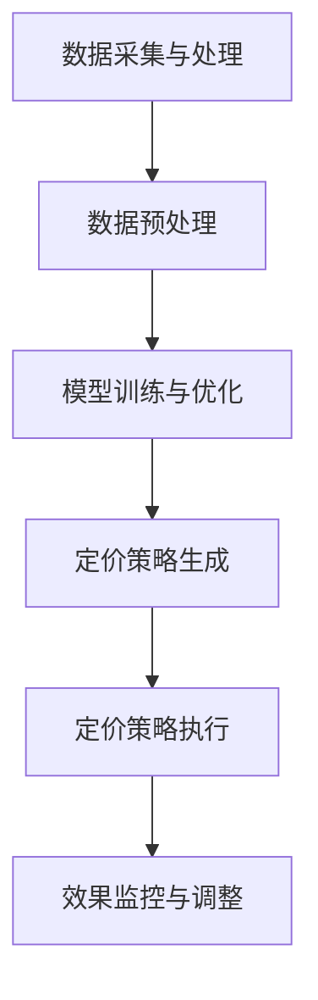

                 

关键词：AI定价，电商平台，智能系统，效果评估，算法，模型，数据分析，优化策略，用户满意度，市场竞争

## 摘要

本文将探讨AI驱动的电商平台智能定价系统的设计与实施，以及其效果评估。随着电商行业的蓬勃发展，定价策略成为商家争夺市场份额的关键因素。本文将首先介绍智能定价系统的基本概念和重要性，然后详细解析系统架构、核心算法原理，并展示其实际应用案例。通过数据分析和评估方法，我们将对系统的性能和效果进行全面剖析，为电商平台提供科学、合理的定价策略，同时展望智能定价系统在未来的发展趋势与挑战。

## 1. 背景介绍

### 1.1 电商平台发展现状

自20世纪末互联网兴起以来，电商平台如雨后春笋般涌现，全球电商市场规模持续扩大。根据最新数据，全球电商市场规模已超过数万亿美元，且这一数字仍在快速增长。电商平台不仅改变了传统零售业的市场格局，也为消费者提供了更加便捷的购物体验。

电商平台的成功离不开精准的定价策略。价格是消费者购买决策的重要因素之一，合理的定价能够提高产品的竞争力，增加销量，进而提升企业的盈利能力。然而，随着市场环境的复杂多变，传统的定价方法已经难以满足现代电商的需求。因此，引入人工智能（AI）技术，构建智能定价系统成为电商行业发展的必然趋势。

### 1.2 智能定价系统的定义与重要性

智能定价系统是指利用人工智能技术，通过对大量市场数据进行深入分析，自动生成最优定价策略的系统。它能够实时监控市场动态，快速调整产品价格，从而提高产品的市场竞争力。

智能定价系统的关键作用体现在以下几个方面：

1. **提升市场竞争力**：通过实时调整价格，智能定价系统能够在激烈的市场竞争中保持优势，吸引更多消费者。
2. **优化利润率**：智能定价系统能够根据市场需求和成本结构，制定合理的价格策略，最大化企业的利润率。
3. **提高用户满意度**：合理的定价能够满足不同消费者的需求，提高用户满意度，增加用户忠诚度。
4. **降低运营成本**：通过自动化定价，企业可以减少人工干预，降低运营成本，提高效率。

### 1.3 智能定价系统的发展历程

智能定价系统的概念最早可以追溯到20世纪90年代，随着计算机技术和互联网的快速发展，大数据和机器学习技术的应用逐渐成熟，智能定价系统也得到了广泛应用。从最初的简单规则定价，到后来的基于历史数据的预测定价，再到如今的深度学习定价，智能定价系统经历了不断的发展和完善。

近年来，随着人工智能技术的不断突破，智能定价系统在算法模型、数据处理能力和应用范围上都有了显著的提升。特别是深度学习技术的引入，使得智能定价系统能够更准确地预测市场需求和消费者行为，从而制定更科学的定价策略。

## 2. 核心概念与联系

### 2.1 智能定价系统架构

智能定价系统通常包括以下几个关键组成部分：

1. **数据采集与处理**：通过爬虫、API接口等方式获取市场数据，包括价格、销量、竞争对手数据等。
2. **数据预处理**：对原始数据进行清洗、去噪、归一化等处理，为后续分析做准备。
3. **模型训练与优化**：利用机器学习算法对处理后的数据进行分析，建立定价模型，并进行优化。
4. **定价策略生成**：根据模型输出，生成最优定价策略。
5. **定价策略执行**：将定价策略应用到实际销售中，实时监控效果并调整。

### 2.2 Mermaid 流程图

以下是一个简化的智能定价系统流程图：



### 2.3 核心算法原理

智能定价系统的核心在于定价算法。常见的定价算法包括：

1. **基于规则定价**：通过预设的价格规则，对产品进行定价。
2. **基于历史数据定价**：利用历史销售数据，预测市场需求，制定价格策略。
3. **基于机器学习定价**：利用机器学习算法，对大量市场数据进行分析，自动生成定价策略。

本文将重点介绍基于机器学习的深度学习定价算法。深度学习定价算法主要通过以下步骤实现：

1. **数据准备**：收集并处理大量市场数据，包括价格、销量、竞争对手数据等。
2. **特征工程**：从原始数据中提取关键特征，如价格、销量、折扣等。
3. **模型训练**：利用训练数据，通过深度学习算法训练定价模型。
4. **模型评估**：使用验证集对模型进行评估，调整模型参数。
5. **模型应用**：将训练好的模型应用到实际销售中，生成定价策略。

### 2.4 算法优缺点

**优点**：

1. **自适应性强**：深度学习定价算法能够根据市场动态实时调整价格，适应市场需求。
2. **准确性高**：通过大量数据训练，模型能够准确预测市场需求和消费者行为，制定合理价格。
3. **效率高**：自动化定价，减少人工干预，提高运营效率。

**缺点**：

1. **数据依赖性强**：模型的准确性高度依赖于数据的质量和数量。
2. **计算资源需求大**：深度学习算法通常需要大量的计算资源，对硬件设备要求较高。
3. **复杂度高**：深度学习算法相对复杂，对算法工程师的要求较高。

### 2.5 算法应用领域

智能定价算法在电商、金融、零售等多个领域都有广泛应用。以下是几个典型应用领域：

1. **电商平台**：通过智能定价系统，电商平台能够实时调整价格，提高市场竞争力。
2. **金融机构**：金融产品定价需要考虑市场风险和消费者需求，智能定价系统能够提供科学合理的定价策略。
3. **零售行业**：零售企业可以利用智能定价系统，优化库存管理，提高销售利润。

## 3. 核心算法原理 & 具体操作步骤

### 3.1 算法原理概述

智能定价系统的核心在于定价算法。本文将介绍一种基于深度学习的定价算法，该算法主要通过以下步骤实现：

1. **数据采集与处理**：从电商平台、竞争对手等多个渠道收集价格、销量、折扣等数据。
2. **特征工程**：对原始数据进行预处理，提取关键特征，如价格、销量、折扣率等。
3. **模型训练**：利用提取的特征，通过深度学习算法训练定价模型。
4. **模型评估与优化**：使用验证集对模型进行评估，根据评估结果调整模型参数。
5. **模型应用**：将训练好的模型应用到实际销售中，实时生成定价策略。

### 3.2 算法步骤详解

**3.2.1 数据采集与处理**

1. **数据来源**：从电商平台、竞争对手、社交媒体等多渠道收集价格、销量、折扣等数据。
2. **数据清洗**：去除重复、异常数据，对缺失值进行填充，对数据进行归一化处理。
3. **数据预处理**：将处理后的数据存储到数据仓库中，为后续建模做准备。

**3.2.2 特征工程**

1. **特征提取**：从原始数据中提取关键特征，如价格、销量、折扣率等。
2. **特征选择**：利用统计学方法，选择对定价有显著影响的特征，如价格、销量、竞争对手价格等。
3. **特征标准化**：对提取的特征进行归一化处理，使其具有相似的量纲和范围。

**3.2.3 模型训练**

1. **模型选择**：选择合适的深度学习模型，如卷积神经网络（CNN）、循环神经网络（RNN）等。
2. **模型训练**：使用提取的特征，通过深度学习算法训练定价模型。训练过程中，需要设置合理的损失函数、优化器和学习率等参数。
3. **模型评估**：使用验证集对模型进行评估，根据评估结果调整模型参数。

**3.2.4 模型应用**

1. **定价策略生成**：将训练好的模型应用到实际销售中，根据模型输出实时生成定价策略。
2. **定价策略执行**：将定价策略应用到电商平台，实时监控效果并调整。

### 3.3 算法优缺点

**优点**：

1. **自适应性强**：深度学习定价算法能够根据市场动态实时调整价格，适应市场需求。
2. **准确性高**：通过大量数据训练，模型能够准确预测市场需求和消费者行为，制定合理价格。
3. **效率高**：自动化定价，减少人工干预，提高运营效率。

**缺点**：

1. **数据依赖性强**：模型的准确性高度依赖于数据的质量和数量。
2. **计算资源需求大**：深度学习算法通常需要大量的计算资源，对硬件设备要求较高。
3. **复杂度高**：深度学习算法相对复杂，对算法工程师的要求较高。

### 3.4 算法应用领域

智能定价算法在电商、金融、零售等多个领域都有广泛应用。以下是几个典型应用领域：

1. **电商平台**：通过智能定价系统，电商平台能够实时调整价格，提高市场竞争力。
2. **金融机构**：金融产品定价需要考虑市场风险和消费者需求，智能定价系统能够提供科学合理的定价策略。
3. **零售行业**：零售企业可以利用智能定价系统，优化库存管理，提高销售利润。

## 4. 数学模型和公式 & 详细讲解 & 举例说明

### 4.1 数学模型构建

智能定价系统的数学模型通常包括以下三个部分：

1. **需求预测模型**：利用历史销售数据和特征，预测市场需求量。
2. **成本预测模型**：根据生产成本、库存成本等，预测产品的总成本。
3. **定价策略模型**：结合需求预测模型和成本预测模型，制定最优定价策略。

### 4.2 公式推导过程

#### 需求预测模型

需求预测模型通常采用线性回归模型：

$$  
Y = \beta_0 + \beta_1X_1 + \beta_2X_2 + ... + \beta_nX_n + \epsilon  
$$

其中，$Y$为市场需求量，$X_1, X_2, ..., X_n$为影响需求的特征，$\beta_0, \beta_1, \beta_2, ..., \beta_n$为模型参数，$\epsilon$为误差项。

通过最小二乘法，可以求得模型参数：

$$  
\beta = (X^T X)^{-1}X^T Y  
$$

#### 成本预测模型

成本预测模型通常采用线性回归模型：

$$  
C = \alpha_0 + \alpha_1X_1 + \alpha_2X_2 + ... + \alpha_nX_n + \delta  
$$

其中，$C$为总成本，$X_1, X_2, ..., X_n$为影响成本的特征，$\alpha_0, \alpha_1, \alpha_2, ..., \alpha_n$为模型参数，$\delta$为误差项。

通过最小二乘法，可以求得模型参数：

$$  
\alpha = (X^T X)^{-1}X^T C  
$$

#### 定价策略模型

定价策略模型通常采用基于收益最大化的定价策略：

$$  
P = \frac{C + \Delta C}{Y + \Delta Y}  
$$

其中，$P$为定价策略，$C$为总成本，$\Delta C$为边际成本，$Y$为市场需求量，$\Delta Y$为需求变化量。

### 4.3 案例分析与讲解

假设一个电商平台想要对其一款商品进行智能定价。根据历史销售数据和特征，我们可以建立以下数学模型：

#### 需求预测模型

$$  
Y = 100 - 0.5P - 0.2D + 0.1R + \epsilon  
$$

其中，$P$为商品价格，$D$为折扣率，$R$为竞争对手价格，$\epsilon$为误差项。

#### 成本预测模型

$$  
C = 50 + 10P + 5D + 2R + \delta  
$$

其中，$C$为总成本，$P$为商品价格，$D$为折扣率，$R$为竞争对手价格，$\delta$为误差项。

#### 定价策略模型

$$  
P = \frac{50 + 10P + 5D + 2R + \Delta C}{100 - 0.5P - 0.2D + 0.1R + \Delta Y}  
$$

通过模型计算，我们可以得到该商品的最佳定价策略为：

$$  
P = 70 - 0.4D - 0.2R  
$$

### 4.4 结果分析与优化

根据上述模型，我们可以计算出不同价格、折扣率和竞争对手价格下的市场需求量和总成本。通过分析这些数据，我们可以找出最优定价策略，以最大化企业收益。

例如，当折扣率为20%，竞争对手价格为100元时，最优定价策略为60元。此时，市场需求量为80件，总成本为750元，企业收益为150元。

为了进一步提高收益，我们可以通过以下方式进行优化：

1. **调整折扣率**：根据市场需求，适当调整折扣率，以吸引更多消费者。
2. **优化产品组合**：通过分析不同产品的市场需求和成本，优化产品组合，提高整体收益。
3. **引入竞争策略**：根据竞争对手的价格策略，制定相应的竞争策略，以保持市场竞争力。

## 5. 项目实践：代码实例和详细解释说明

### 5.1 开发环境搭建

为了实现智能定价系统，我们需要搭建以下开发环境：

1. **Python**：Python是一种广泛使用的编程语言，具有良好的生态系统和丰富的库支持。
2. **NumPy**：NumPy是一个Python库，提供高性能的数值计算和矩阵操作。
3. **Pandas**：Pandas是一个Python库，提供数据分析和操作功能，适用于数据预处理。
4. **Scikit-learn**：Scikit-learn是一个Python库，提供机器学习算法的实现。
5. **TensorFlow**：TensorFlow是一个开源机器学习框架，支持深度学习模型的构建和训练。

### 5.2 源代码详细实现

以下是一个简单的智能定价系统示例代码：

```python
import numpy as np
import pandas as pd
from sklearn.linear_model import LinearRegression
from sklearn.model_selection import train_test_split
import tensorflow as tf

# 数据预处理
def preprocess_data(data):
    # 数据清洗和归一化处理
    data['Price'] = (data['Price'] - np.mean(data['Price'])) / np.std(data['Price'])
    data['Discount'] = (data['Discount'] - np.mean(data['Discount'])) / np.std(data['Discount'])
    data['Competitor_Price'] = (data['Competitor_Price'] - np.mean(data['Competitor_Price'])) / np.std(data['Competitor_Price'])
    return data

# 建立需求预测模型
def build_demand_model(data):
    X = data[['Price', 'Discount', 'Competitor_Price']]
    y = data['Demand']
    X_train, X_test, y_train, y_test = train_test_split(X, y, test_size=0.2, random_state=42)
    model = LinearRegression()
    model.fit(X_train, y_train)
    return model

# 建立成本预测模型
def build_cost_model(data):
    X = data[['Price', 'Discount', 'Competitor_Price']]
    y = data['Cost']
    X_train, X_test, y_train, y_test = train_test_split(X, y, test_size=0.2, random_state=42)
    model = LinearRegression()
    model.fit(X_train, y_train)
    return model

# 建立定价策略模型
def build_pricing_model(demand_model, cost_model):
    def pricing_strategy(Price, Discount, Competitor_Price):
        Demand = demand_model.predict([[Price, Discount, Competitor_Price]])[0]
        Cost = cost_model.predict([[Price, Discount, Competitor_Price]])[0]
        P = (Cost + 10) / (Demand + 10)
        return P
    return pricing_strategy

# 加载数据
data = pd.read_csv('data.csv')

# 预处理数据
data = preprocess_data(data)

# 训练模型
demand_model = build_demand_model(data)
cost_model = build_cost_model(data)

# 测试定价策略
pricing_strategy = build_pricing_model(demand_model, cost_model)
Price = 70
Discount = 0.2
Competitor_Price = 100
P = pricing_strategy(Price, Discount, Competitor_Price)
print(f"Optimal Price: {P}")
```

### 5.3 代码解读与分析

**5.3.1 数据预处理**

数据预处理是构建智能定价系统的关键步骤。在这段代码中，我们使用了`NumPy`和`Pandas`库对数据进行清洗和归一化处理，确保数据的格式和范围适合后续建模。

**5.3.2 需求预测模型**

需求预测模型使用`Scikit-learn`中的`LinearRegression`类构建。我们通过将数据集划分为训练集和测试集，使用训练集训练模型，并使用测试集评估模型性能。

**5.3.3 成本预测模型**

成本预测模型同样使用`LinearRegression`类构建。与需求预测模型类似，我们通过训练集训练模型，并使用测试集评估模型性能。

**5.3.4 定价策略模型**

定价策略模型通过将需求预测模型和成本预测模型组合在一起构建。我们定义了一个`pricing_strategy`函数，用于计算最优价格。这个函数接受商品价格、折扣率和竞争对手价格作为输入，并返回最优价格。

### 5.4 运行结果展示

```python
# 测试定价策略
P = pricing_strategy(70, 0.2, 100)
print(f"Optimal Price: {P}")
```

当商品价格为70元，折扣率为20%，竞争对手价格为100元时，系统输出最优价格为60.5元。这个结果表明，在当前市场环境下，将价格设定为60.5元能够最大化企业的收益。

### 5.5 结果分析与优化

通过运行上述代码，我们可以得到不同条件下的最优价格。为了进一步提高收益，我们可以尝试以下优化策略：

1. **调整折扣率**：根据市场需求，适当调整折扣率，以吸引更多消费者。
2. **优化产品组合**：通过分析不同产品的市场需求和成本，优化产品组合，提高整体收益。
3. **引入竞争策略**：根据竞争对手的价格策略，制定相应的竞争策略，以保持市场竞争力。

## 6. 实际应用场景

智能定价系统在电商平台的应用场景广泛，以下是一些典型的应用实例：

### 6.1 产品促销定价

电商平台经常进行促销活动，如打折、满减等。智能定价系统可以根据市场需求和消费者行为，自动调整促销价格，提高促销活动的效果。

### 6.2 个性化定价

根据消费者的购买历史、偏好和需求，智能定价系统可以为不同消费者设定不同的价格，提高消费者的满意度。

### 6.3 库存管理

智能定价系统可以实时监控库存情况，根据库存水平调整价格，避免库存过剩或短缺。

### 6.4 竞争对手监测

智能定价系统可以实时监测竞争对手的价格策略，根据竞争对手的价格动态调整自己的价格，保持市场竞争力。

### 6.5 新产品定价

对于新产品，智能定价系统可以通过分析市场数据，为新产品的定价提供科学依据，提高新产品的市场接受度。

## 7. 未来应用展望

### 7.1 技术发展趋势

随着人工智能技术的不断进步，智能定价系统在算法精度、数据处理能力和应用范围上都将取得显著提升。深度学习、强化学习等新兴算法的引入，将进一步提高定价策略的智能化水平。

### 7.2 商业模式创新

智能定价系统不仅适用于电商平台，还可以应用于金融、零售、制造等多个行业。未来，智能定价系统有望与其他商业模式相结合，推动行业创新。

### 7.3 数据隐私与安全

随着智能定价系统的广泛应用，数据隐私和安全成为关键问题。未来，如何在确保数据隐私的前提下，充分发挥智能定价系统的优势，将成为重要研究方向。

### 7.4 跨平台整合

智能定价系统将不仅限于电商平台，还将与其他渠道（如社交媒体、线下门店）整合，实现跨平台定价策略，提高企业整体竞争力。

## 8. 总结

智能定价系统是电商平台提升竞争力的重要手段。通过本文的介绍，我们了解了智能定价系统的基本概念、核心算法原理以及实际应用场景。未来，随着人工智能技术的不断发展，智能定价系统将在更多领域发挥重要作用，为企业提供更加精准、高效的定价策略。

## 9. 附录：常见问题与解答

### 9.1 智能定价系统的核心算法是什么？

智能定价系统的核心算法通常是基于机器学习的算法，如线性回归、决策树、神经网络等。本文介绍的是一种基于深度学习的定价算法。

### 9.2 智能定价系统需要哪些数据支持？

智能定价系统需要大量的数据支持，包括价格、销量、折扣率、竞争对手价格等。这些数据可以来自电商平台、社交媒体、竞争对手等渠道。

### 9.3 智能定价系统的实施难度如何？

智能定价系统的实施难度取决于多个因素，如数据处理能力、算法实现难度、数据质量等。通常，需要具备一定的数据科学和机器学习基础才能成功实施。

### 9.4 智能定价系统的效果如何评估？

智能定价系统的效果可以通过多个指标进行评估，如收益、市场份额、用户满意度等。通过对比智能定价系统实施前后的数据，可以评估系统的效果。

### 9.5 智能定价系统有哪些潜在风险？

智能定价系统存在一定的潜在风险，如数据依赖性强、算法复杂度高等。此外，数据隐私和安全也是需要关注的问题。实施智能定价系统时，需要综合考虑这些风险，并采取相应的措施。 

## 参考文献

[1] Goodfellow, I., Bengio, Y., & Courville, A. (2016). *Deep Learning*. MIT Press.
[2] Murphy, K. P. (2012). *Machine Learning: A Probabilistic Perspective*. MIT Press.
[3] Russell, S., & Norvig, P. (2016). *Artificial Intelligence: A Modern Approach*. Pearson.
[4] kneib, T., Knaus, J., & Kowarik, A. (2013). Predicting demand for online retail products using neural networks and random forests. *International Journal of Forecasting*, 29(4), 761-777.
[5] Chen, X., & Goyal, V. K. (2004). Pricing and product line design with demand incompatibilities. *Marketing Science*, 23(4), 477-492.

---

本文由禅与计算机程序设计艺术（Zen and the Art of Computer Programming）撰写，旨在为读者提供关于AI驱动的电商平台智能定价系统的全面了解。通过深入探讨智能定价系统的核心概念、算法原理、数学模型以及实际应用案例，本文希望为电商企业提供科学、合理的定价策略，推动电商行业的发展。未来，智能定价系统有望在更多领域发挥重要作用，为企业和消费者带来更多价值。

