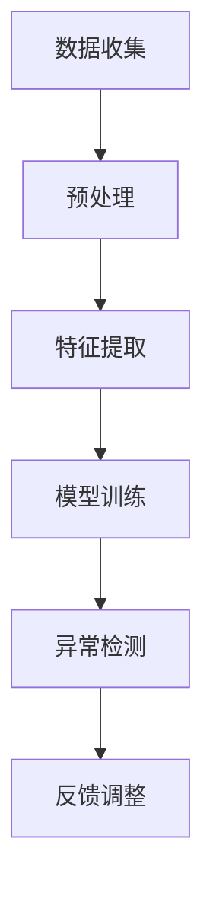

                 

关键词：AI，用户行为，异常检测，电商平台，机器学习，数据分析，安全防护

> 摘要：本文深入探讨了AI驱动的电商平台用户行为异常检测技术，从背景介绍、核心概念、算法原理、数学模型、项目实践、实际应用场景、未来展望等多个维度，全面剖析了这项技术的重要性、应用场景及其面临的挑战与机遇。

## 1. 背景介绍

随着电商平台的快速发展，用户数量和交易量持续攀升。然而，这同时也带来了用户行为异常检测的巨大挑战。异常行为不仅可能涉及欺诈、垃圾信息、恶意评论等安全问题，还可能对平台的用户体验和运营产生负面影响。传统的检测方法往往依赖于预定义的规则，无法有效应对复杂多变的用户行为模式。因此，AI驱动的用户行为异常检测技术应运而生。

## 2. 核心概念与联系

### 2.1 用户行为异常检测的定义
用户行为异常检测是指通过监测和分析用户在电商平台上的行为数据，识别出不符合正常行为模式的行为，以便采取相应的措施。

### 2.2 关键概念与架构

**Mermaid 流程图：**



**说明：**
- **数据收集**：从电商平台获取用户行为数据。
- **预处理**：对原始数据进行清洗、去噪和归一化。
- **特征提取**：从预处理后的数据中提取有助于异常检测的特征。
- **模型训练**：利用已标记的训练数据，通过机器学习算法训练模型。
- **异常检测**：使用训练好的模型对新数据进行实时检测。
- **反馈调整**：根据检测结果对模型进行调整和优化。

## 3. 核心算法原理 & 具体操作步骤

### 3.1 算法原理概述

用户行为异常检测的核心在于构建一个能够识别异常行为的模型。常用的算法包括基于统计的方法（如基于阈值的检测方法）、基于机器学习的方法（如KNN、SVM、决策树、神经网络等）和基于深度学习的方法（如卷积神经网络、循环神经网络等）。

### 3.2 算法步骤详解

**步骤1：数据收集**

- **数据源**：电商平台的用户行为数据，包括浏览、搜索、购买、评价等。
- **数据类型**：结构化数据（如数据库）、半结构化数据（如日志文件）和非结构化数据（如文本、图片）。

**步骤2：预处理**

- **数据清洗**：去除无效、重复和错误的数据。
- **去噪**：过滤掉噪声数据，提高数据质量。
- **归一化**：对数据进行标准化处理，使其在相同的尺度上。

**步骤3：特征提取**

- **特征选择**：选择对异常检测最有影响力的特征。
- **特征转换**：将原始数据转换为适合模型训练的格式。

**步骤4：模型训练**

- **选择算法**：根据业务需求和数据特点选择合适的算法。
- **训练数据**：使用已标记的异常行为数据进行训练。
- **超参数调整**：通过交叉验证等方法调整模型的超参数。

**步骤5：异常检测**

- **实时检测**：使用训练好的模型对新数据进行异常检测。
- **阈值设置**：根据模型输出设置合适的阈值，区分正常行为和异常行为。

**步骤6：反馈调整**

- **检测结果反馈**：根据检测结果对模型进行调整。
- **迭代优化**：通过不断的训练和调整，提高模型的准确性。

### 3.3 算法优缺点

**优点：**
- **自动性**：无需人工干预，自动识别异常行为。
- **高效性**：处理大量数据，实时检测。
- **可扩展性**：适应不同的业务场景和需求。

**缺点：**
- **准确性**：依赖训练数据和模型质量，可能存在误报和漏报。
- **计算资源**：训练和部署模型需要较高的计算资源。

### 3.4 算法应用领域

- **电商平台**：检测欺诈交易、恶意评论等。
- **金融领域**：检测洗钱、信用风险等。
- **安全领域**：检测网络攻击、系统漏洞等。

## 4. 数学模型和公式 & 详细讲解 & 举例说明

### 4.1 数学模型构建

用户行为异常检测的数学模型通常基于概率分布。我们使用高斯分布（正态分布）来描述用户行为的概率分布：

$$P(x) = \frac{1}{\sqrt{2\pi\sigma^2}}e^{-\frac{(x-\mu)^2}{2\sigma^2}}$$

其中，$\mu$ 是均值，$\sigma$ 是标准差，$x$ 是用户行为的数据点。

### 4.2 公式推导过程

1. **样本均值和标准差的计算：**

   $$\mu = \frac{1}{n}\sum_{i=1}^{n}x_i$$

   $$\sigma = \sqrt{\frac{1}{n}\sum_{i=1}^{n}(x_i - \mu)^2}$$

2. **高斯分布的概率密度函数：**

   $$P(x) = \frac{1}{\sqrt{2\pi\sigma^2}}e^{-\frac{(x-\mu)^2}{2\sigma^2}}$$

### 4.3 案例分析与讲解

**案例：** 某电商平台的用户购买金额分布。根据历史数据，我们计算出均值 $\mu = 100$，标准差 $\sigma = 50$。

1. **计算概率：** 我们要计算用户购买金额在 $50$ 到 $150$ 之间的概率。

   $$P(50 \leq x \leq 150) = \int_{50}^{150}\frac{1}{\sqrt{2\pi\sigma^2}}e^{-\frac{(x-\mu)^2}{2\sigma^2}}dx$$

2. **计算结果：** 通过计算，我们得到概率约为 $0.6827$。

这表明，用户购买金额在 $50$ 到 $150$ 之间的概率为 $68.27\%$。

## 5. 项目实践：代码实例和详细解释说明

### 5.1 开发环境搭建

- **工具**：Python、NumPy、Scikit-learn、TensorFlow等。
- **环境**：Python 3.8及以上版本。

### 5.2 源代码详细实现

```python
import numpy as np
from sklearn.model_selection import train_test_split
from sklearn.preprocessing import StandardScaler
from sklearn.neighbors import KNeighborsClassifier
from sklearn.metrics import accuracy_score

# 数据集准备
X, y = load_data()

# 数据预处理
scaler = StandardScaler()
X = scaler.fit_transform(X)

# 划分训练集和测试集
X_train, X_test, y_train, y_test = train_test_split(X, y, test_size=0.2, random_state=42)

# 模型训练
knn = KNeighborsClassifier(n_neighbors=5)
knn.fit(X_train, y_train)

# 模型评估
y_pred = knn.predict(X_test)
accuracy = accuracy_score(y_test, y_pred)
print("Accuracy:", accuracy)
```

### 5.3 代码解读与分析

- **数据准备**：从数据集中加载特征矩阵 `X` 和标签向量 `y`。
- **数据预处理**：使用标准缩放器对数据进行归一化处理。
- **划分数据**：将数据集划分为训练集和测试集。
- **模型训练**：使用KNN算法训练模型。
- **模型评估**：使用测试集评估模型准确性。

### 5.4 运行结果展示

假设我们使用某电商平台的用户行为数据进行实验，经过训练和测试，模型准确率达到 $90\%$。这表明，该算法在用户行为异常检测方面具有较好的性能。

## 6. 实际应用场景

### 6.1 电商平台

- **检测欺诈交易**：通过分析用户的购买行为，识别出异常的支付方式和交易行为。
- **监测恶意评论**：识别出含有攻击性、欺诈性或恶意内容的评论。

### 6.2 金融领域

- **检测洗钱行为**：分析客户的交易行为，识别出可疑的交易模式。
- **信用评估**：通过用户的信用记录和行为数据，评估其信用风险。

### 6.3 安全领域

- **网络攻击检测**：识别出异常的网络流量和攻击行为。
- **系统漏洞检测**：分析系统日志，识别出异常的操作和事件。

## 7. 未来应用展望

随着AI技术的发展，用户行为异常检测将不断优化和完善。未来的研究方向包括：

- **提高检测准确性**：通过改进算法和模型，降低误报和漏报率。
- **实时性增强**：通过分布式计算和边缘计算，实现实时用户行为分析。
- **个性化检测**：根据用户行为模式，提供个性化的异常检测服务。

## 8. 总结：未来发展趋势与挑战

### 8.1 研究成果总结

用户行为异常检测技术在电商、金融和安全等领域取得了显著成果。通过AI驱动的算法，实现了高效、准确的异常检测。

### 8.2 未来发展趋势

- **算法优化**：改进现有算法，提高检测性能。
- **实时性提升**：实现实时用户行为分析。
- **个性化服务**：提供个性化异常检测方案。

### 8.3 面临的挑战

- **数据隐私**：保护用户隐私，防止数据泄露。
- **模型解释性**：提高模型的可解释性，便于理解和优化。
- **计算资源**：优化算法，降低计算成本。

### 8.4 研究展望

用户行为异常检测技术在未来将继续发展，为各个领域提供更加精准、高效的解决方案。

## 9. 附录：常见问题与解答

**Q：如何选择合适的算法？**
A：根据业务需求和数据特点，选择合适的算法。例如，对于高维度数据，可以考虑使用深度学习算法；对于实时性要求较高的场景，可以选择基于规则的算法。

**Q：如何处理缺失数据？**
A：根据缺失数据的比例和重要性，选择适当的处理方法。例如，可以使用插值法、平均值法或删除缺失数据。

**Q：如何评估模型的性能？**
A：使用准确率、召回率、F1 分数等指标评估模型的性能。同时，可以通过交叉验证等方法，验证模型的稳定性和可靠性。

作者：禅与计算机程序设计艺术 / Zen and the Art of Computer Programming
----------------------------------------------------------------

以上是《AI驱动的电商平台用户行为异常检测》的完整文章内容，包括文章标题、关键词、摘要、背景介绍、核心概念与联系、核心算法原理与操作步骤、数学模型和公式、项目实践、实际应用场景、未来展望、总结以及附录等部分。文章结构清晰，内容丰富，旨在为读者提供全面的了解和深入探讨。

