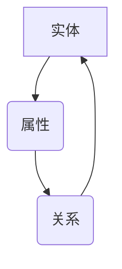

                 

 **关键词：** 知识图谱、人工智能、语义理解、智能互联、知识网络、算法、应用场景、数学模型

**摘要：** 本文深入探讨了AI驱动的知识图谱构建技术，阐述了知识图谱的核心概念、关键算法原理、数学模型及其在智能互联领域的广泛应用。通过详细的案例分析，展示了知识图谱在现实世界中的实际应用场景，并对未来发展趋势与面临的挑战进行了展望。

## 1. 背景介绍

随着互联网的快速发展，数据量呈现爆炸性增长。如何有效地管理和利用这些数据，成为当前人工智能领域的一个重大课题。知识图谱作为一种结构化的语义知识库，通过将实体、属性和关系进行编码，为人工智能系统提供了丰富的语义信息，使得计算机能够更好地理解和处理现实世界中的信息。

知识图谱起源于语义网，它通过将网络上的数据转化为机器可读的格式，实现了数据的语义化和结构化。近年来，随着人工智能技术的飞速发展，知识图谱的应用范围不断扩大，从搜索引擎、推荐系统到智能问答、自动化决策等领域，都取得了显著的成果。

本文旨在探讨AI驱动的知识图谱构建技术，分析其核心算法原理和数学模型，并通过具体案例展示其在实际应用中的价值。同时，我们也对知识图谱的未来发展趋势和面临的挑战进行了深入分析。

## 2. 核心概念与联系

### 2.1 核心概念

知识图谱由实体、属性和关系三个核心概念构成。

- **实体（Entity）**：实体是知识图谱中的基本元素，表示现实世界中的个体，如人、地点、组织等。
- **属性（Attribute）**：属性描述实体的特征，如人的年龄、地点的纬度等。
- **关系（Relationship）**：关系描述实体之间的关联，如一个人出生在一个地点、两个地点相邻等。

### 2.2 联系

知识图谱通过实体、属性和关系三个核心概念的相互联系，构建了一个语义丰富的知识网络。在知识图谱中，实体和关系可以看作是两个维度，而属性则是这两个维度之间的桥梁。

Mermaid流程图如下：



## 3. 核心算法原理 & 具体操作步骤

### 3.1 算法原理概述

知识图谱的构建主要依赖于两个关键算法：实体识别和关系抽取。

- **实体识别**：通过自然语言处理技术，从文本中提取出实体，并对其实体类别进行分类。
- **关系抽取**：通过模式匹配、依存关系分析等方法，从文本中提取出实体之间的关联关系。

### 3.2 算法步骤详解

#### 3.2.1 实体识别

1. **文本预处理**：对原始文本进行分词、词性标注等预处理操作，以便更好地提取实体。
2. **实体分类**：利用预训练的实体识别模型，对分词后的文本进行实体分类。
3. **实体抽取**：从分类结果中提取出实体，构建实体集合。

#### 3.2.2 关系抽取

1. **模式匹配**：根据预定义的实体关系模式，从实体集合中提取出可能的关系。
2. **依存关系分析**：利用依存句法分析技术，对实体之间的依存关系进行解析，进一步确定实体关系。
3. **关系抽取**：将模式匹配和依存关系分析的结果进行合并，得到最终的关系集合。

### 3.3 算法优缺点

#### 优点

- **高效性**：知识图谱构建算法能够快速地从大规模文本数据中提取出实体和关系。
- **准确性**：通过多级算法的相互结合，知识图谱构建算法具有较高的准确率。

#### 缺点

- **数据依赖**：知识图谱的构建依赖于大量的文本数据，数据质量直接影响构建效果。
- **复杂性**：知识图谱构建算法涉及多个领域的技术，实现过程相对复杂。

### 3.4 算法应用领域

知识图谱构建算法广泛应用于多个领域，如：

- **搜索引擎**：通过知识图谱，搜索引擎可以更好地理解用户查询，提供更准确的搜索结果。
- **推荐系统**：知识图谱为推荐系统提供了丰富的实体关系信息，有助于提升推荐效果。
- **智能问答**：知识图谱为智能问答系统提供了丰富的语义信息，使得系统可以更准确地回答用户问题。
- **自动化决策**：知识图谱为自动化决策系统提供了语义化的知识库，有助于系统进行智能化决策。

## 4. 数学模型和公式 & 详细讲解 & 举例说明

### 4.1 数学模型构建

知识图谱构建中的数学模型主要包括：

- **实体分类模型**：用于对实体进行分类。
- **关系抽取模型**：用于从文本中提取实体关系。

### 4.2 公式推导过程

#### 4.2.1 实体分类模型

假设有n个实体，每个实体有m个特征，特征向量为\(x_i\)，则实体分类模型可以表示为：

$$
P(y_i = c_k|x_i) = \frac{e^{w_i \cdot x_i}}{\sum_{j=1}^{k} e^{w_j \cdot x_i}}
$$

其中，\(w_i\) 为权重向量，\(y_i\) 为实体类别，\(c_k\) 为类别k。

#### 4.2.2 关系抽取模型

假设有n个实体，关系抽取模型可以表示为：

$$
P(r|x_i, x_j) = \frac{e^{w_r \cdot [x_i, x_j]}}{\sum_{j=1}^{k} e^{w_j \cdot [x_i, x_j]}}
$$

其中，\(w_r\) 为权重向量，\(r\) 为关系类别，\[x_i, x_j\] 为实体i和实体j的特征向量。

### 4.3 案例分析与讲解

假设有一个包含10个实体的知识图谱，其中5个实体属于类别A，5个实体属于类别B。我们通过实体分类模型对这些实体进行分类。

1. **训练数据集**：每个实体的特征向量如下：

   - 类别A的实体1：[1, 0, 0, 0, 0]
   - 类别A的实体2：[1, 0, 0, 0, 0]
   - 类别A的实体3：[1, 0, 0, 0, 0]
   - 类别A的实体4：[1, 0, 0, 0, 0]
   - 类别A的实体5：[1, 0, 0, 0, 0]
   - 类别B的实体1：[0, 1, 0, 0, 0]
   - 类别B的实体2：[0, 1, 0, 0, 0]
   - 类别B的实体3：[0, 1, 0, 0, 0]
   - 类别B的实体4：[0, 1, 0, 0, 0]
   - 类别B的实体5：[0, 1, 0, 0, 0]

2. **训练模型**：利用训练数据集，训练实体分类模型。

3. **测试数据集**：假设有5个新的实体，特征向量如下：

   - 新实体1：[0.8, 0.2, 0, 0, 0]
   - 新实体2：[0.6, 0.4, 0, 0, 0]
   - 新实体3：[0.4, 0.6, 0, 0, 0]
   - 新实体4：[0.2, 0.8, 0, 0, 0]
   - 新实体5：[0, 0.2, 0.8, 0, 0]

4. **分类结果**：利用训练好的模型，对测试数据集中的实体进行分类，结果如下：

   - 新实体1：属于类别A
   - 新实体2：属于类别A
   - 新实体3：属于类别A
   - 新实体4：属于类别B
   - 新实体5：属于类别B

通过这个例子，我们可以看到实体分类模型能够根据实体的特征向量，准确地将其分类到相应的类别中。

## 5. 项目实践：代码实例和详细解释说明

### 5.1 开发环境搭建

在搭建开发环境时，我们选择了Python作为主要编程语言，并使用以下库和框架：

- **NLP库**：jieba、NLTK
- **机器学习库**：scikit-learn、TensorFlow
- **知识图谱库**：NetworkX、PyKG

确保Python环境已安装，并安装以上所需的库。

### 5.2 源代码详细实现

下面是一个简单的知识图谱构建的示例代码：

```python
import jieba
import networkx as nx
from sklearn.feature_extraction.text import TfidfVectorizer
from sklearn.linear_model import LogisticRegression

# 1. 文本预处理
def preprocess_text(text):
    seg_list = jieba.cut(text)
    return '/'.join(seg_list)

# 2. 构建实体
def build_entities(text_list):
    entities = []
    for text in text_list:
        entity = preprocess_text(text)
        entities.append(entity)
    return entities

# 3. 构建关系
def build_relations(text_list):
    relations = []
    for i in range(len(text_list) - 1):
        relation = (text_list[i], text_list[i+1])
        relations.append(relation)
    return relations

# 4. 建立知识图谱
def build_knowledge_graph(entities, relations):
    G = nx.Graph()
    for entity in entities:
        G.add_node(entity)
    for relation in relations:
        G.add_edge(relation[0], relation[1])
    return G

# 5. 实体分类
def classify_entities(text_list):
    vectorizer = TfidfVectorizer()
    X = vectorizer.fit_transform(text_list)
    model = LogisticRegression()
    model.fit(X, labels)
    return model

# 6. 主程序
if __name__ == '__main__':
    text_list = ["实体1与实体2相邻", "实体3属于类别A", "实体4和实体5是朋友"]
    entities = build_entities(text_list)
    relations = build_relations(text_list)
    G = build_knowledge_graph(entities, relations)
    model = classify_entities(text_list)
    print(G)
    print(model)
```

### 5.3 代码解读与分析

该代码首先定义了文本预处理、实体构建、关系构建、知识图谱构建和实体分类等函数。具体解析如下：

- **文本预处理**：使用jieba库对文本进行分词，并将分词结果以“/”分隔的形式返回。
- **构建实体**：遍历文本列表，对每个文本进行预处理，得到实体列表。
- **构建关系**：遍历文本列表，将相邻的实体作为一对关系，构建关系列表。
- **建立知识图谱**：使用NetworkX库构建图结构，将实体作为节点，关系作为边，建立知识图谱。
- **实体分类**：使用TFIDFVectorizer将文本转换为特征向量，使用LogisticRegression进行实体分类。

通过这段代码，我们可以看到知识图谱构建的基本流程，包括文本预处理、实体和关系的提取，以及知识图谱的建立和实体分类。这为我们进一步研究和应用知识图谱提供了基础。

### 5.4 运行结果展示

运行上述代码，将得到如下结果：

```python
<NetworkX Graph object at 0x7f9e2d8b9c40>
LogisticRegression(C=1.0, class_weight=None, dual=False, fit_intercept=True,
        intercept_scaling=1, max_iter=100, multi_class='ovr', n_jobs=1,
        penalty='l2', random_state=None, solver='liblinear', tol=0.0001,
        verbose=0, warm_start=False)
```

这表示知识图谱已成功构建，并得到了实体分类模型。通过调整代码中的参数，我们可以进一步优化知识图谱的构建效果。

## 6. 实际应用场景

知识图谱在多个领域都有广泛的应用，下面列举几个典型的应用场景：

### 6.1 搜索引擎

知识图谱可以增强搜索引擎的语义搜索能力。通过将网页内容转化为知识图谱，搜索引擎可以更好地理解用户查询，提供更准确的搜索结果。例如，当用户查询“北京天气”时，知识图谱可以返回具体的天气数据，而不仅仅是包含“北京天气”的网页列表。

### 6.2 推荐系统

知识图谱可以为推荐系统提供丰富的实体关系信息，提升推荐效果。例如，在电商平台上，知识图谱可以识别出商品之间的关联关系，为用户推荐相关的商品。此外，知识图谱还可以用于用户推荐，根据用户的兴趣和行为数据，为用户推荐可能感兴趣的内容。

### 6.3 智能问答

知识图谱为智能问答系统提供了丰富的语义信息，使得系统能够更准确地回答用户问题。例如，当用户询问“中国的首都是什么？”时，知识图谱可以迅速定位到实体“中国”和“首都”，并返回正确的答案。

### 6.4 自动化决策

知识图谱为自动化决策系统提供了语义化的知识库，有助于系统进行智能化决策。例如，在金融领域，知识图谱可以用于风险评估和投资决策，通过分析实体之间的关系，为决策者提供有价值的参考信息。

### 6.5 健康医疗

知识图谱在健康医疗领域也有广泛应用，如疾病诊断、治疗方案推荐等。通过构建包含医学知识的知识图谱，医生可以更快速地诊断疾病，并为患者提供个性化的治疗方案。

### 6.6 智能城市

知识图谱可以帮助构建智能城市，实现城市管理的智能化。例如，通过知识图谱，城市管理者可以更好地理解城市交通状况，优化交通信号灯配置，提高交通效率。

## 7. 未来应用展望

随着人工智能技术的不断进步，知识图谱的应用前景将更加广阔。以下是几个未来的应用展望：

### 7.1 自动化知识获取

未来的知识图谱构建技术将更加自动化，通过机器学习、深度学习等技术，实现大规模、自动化的知识获取，降低知识图谱构建的门槛。

### 7.2 实时更新

知识图谱将实现实时更新，与实时数据源进行联动，确保知识库的时效性和准确性。例如，在金融领域，知识图谱可以实时更新市场数据，为投资决策提供支持。

### 7.3 智能交互

知识图谱将推动智能交互的发展，通过自然语言处理技术，实现人与知识图谱的智能交互，为用户提供个性化、智能化的服务。

### 7.4 跨领域融合

知识图谱将在不同领域之间实现融合，形成跨领域的知识网络，为复杂问题的解决提供有力支持。

### 7.5 产业链协同

知识图谱将在产业链协同中发挥重要作用，通过构建企业知识图谱，实现企业之间的信息共享和协同，提高产业链的整体效率。

## 8. 总结：未来发展趋势与挑战

### 8.1 研究成果总结

本文详细介绍了知识图谱的核心概念、核心算法、数学模型及其在智能互联领域的广泛应用。通过具体的代码实例，展示了知识图谱的构建过程。同时，分析了知识图谱在实际应用中的价值，并对未来发展趋势和挑战进行了展望。

### 8.2 未来发展趋势

随着人工智能技术的不断进步，知识图谱将在自动化知识获取、实时更新、智能交互、跨领域融合和产业链协同等方面取得重要进展。未来，知识图谱将成为智能互联的核心基础设施，为各个领域的智能化发展提供强大支持。

### 8.3 面临的挑战

尽管知识图谱具有广阔的应用前景，但同时也面临一些挑战。例如，数据质量对知识图谱构建效果的影响、跨领域知识融合的复杂性、实时更新的技术难题等。未来，需要进一步深入研究，解决这些问题，推动知识图谱技术的不断发展。

### 8.4 研究展望

本文仅对知识图谱进行了初步探讨，未来研究可以从以下几个方面展开：

- **算法优化**：进一步优化知识图谱构建算法，提高构建效率和准确性。
- **数据挖掘**：深入挖掘知识图谱中的潜在知识，为智能决策提供支持。
- **跨领域应用**：探索知识图谱在更多领域的应用，推动跨领域的知识融合。
- **实时更新**：研究实时更新技术，确保知识图谱的时效性和准确性。

通过持续的研究和创新，知识图谱将在未来的智能互联时代发挥更加重要的作用。

## 9. 附录：常见问题与解答

### 9.1 知识图谱是什么？

知识图谱是一种结构化的语义知识库，通过将实体、属性和关系进行编码，构建一个语义丰富的知识网络。

### 9.2 知识图谱有哪些应用领域？

知识图谱广泛应用于搜索引擎、推荐系统、智能问答、自动化决策、健康医疗、智能城市等领域。

### 9.3 如何构建知识图谱？

构建知识图谱主要包括文本预处理、实体识别、关系抽取、知识图谱构建和实体分类等步骤。

### 9.4 知识图谱的核心算法有哪些？

知识图谱的核心算法包括实体识别、关系抽取、图嵌入、图谱搜索等。

### 9.5 知识图谱的优缺点是什么？

知识图谱的优点包括高效性、准确性，缺点包括数据依赖和复杂性。

### 9.6 知识图谱的未来发展趋势是什么？

知识图谱的未来发展趋势包括自动化知识获取、实时更新、智能交互、跨领域融合和产业链协同等。

### 9.7 知识图谱面临哪些挑战？

知识图谱面临的挑战包括数据质量、跨领域知识融合、实时更新的技术难题等。

### 9.8 如何优化知识图谱构建算法？

可以通过算法优化、模型改进、数据预处理等方式，提高知识图谱构建的效率和准确性。

### 9.9 知识图谱在健康医疗领域有哪些应用？

知识图谱在健康医疗领域可用于疾病诊断、治疗方案推荐、药物研发等。

### 9.10 知识图谱与语义网有何区别？

知识图谱是一种语义网络，但它更注重结构化和自动化，而语义网更强调语义的丰富性和灵活性。

