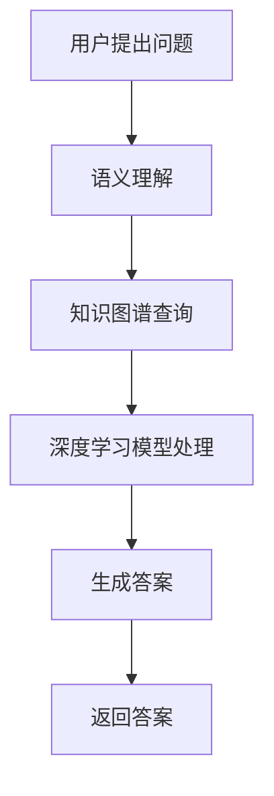

                 

关键词：人工智能、知识图谱、深度学习、语义理解、问答系统、自然语言处理、知识探索

> 摘要：本文探讨了人工智能（AI）在知识探索中的应用，分析了当前问答系统的局限，并详细介绍了AI驱动的知识探索技术，包括知识图谱构建、深度学习和语义理解等。文章旨在为读者提供全面的技术视角，助力其在实际项目中更好地实现知识探索。

## 1. 背景介绍

随着互联网的快速发展，信息爆炸已成为当今时代的特征。面对海量的信息，人们迫切需要一个强大的工具来辅助他们进行知识探索。传统的搜索引擎虽然在一定程度上能够满足用户的需求，但在处理复杂、多层次的信息时显得力不从心。此时，人工智能（AI）技术开始进入人们的视野，特别是深度学习和知识图谱等领域的突破，为知识探索带来了新的契机。

### 知识探索的重要性

知识探索是指通过自动化方法从大量信息中提取有价值的信息，帮助用户获取所需知识的过程。它不仅是个人学习和研究的重要手段，也是企业决策、创新和战略规划的重要依据。有效的知识探索能够提高工作效率，减少重复劳动，推动科技进步和社会发展。

### 问答系统的局限

当前的问答系统主要依赖于自然语言处理（NLP）技术，虽然在一定程度上能够实现信息检索和问题回答，但存在以下局限：

1. **语义理解不足**：问答系统往往只能处理表面语义，难以理解深层次的含义。
2. **知识源有限**：问答系统依赖于已有的数据源，无法主动探索新的知识。
3. **泛化能力差**：问答系统在面对新的、未遇到过的问题时，往往无法给出合适的答案。

为了克服这些问题，AI驱动的知识探索应运而生。

## 2. 核心概念与联系

在AI驱动的知识探索中，核心概念包括知识图谱、深度学习和语义理解等。以下是这些概念之间的联系和关系。

### 知识图谱

知识图谱是一种结构化数据，用于表示实体及其之间的关系。它可以看作是一种语义网络，将现实世界中的知识以图形的方式进行组织和存储。知识图谱的构建需要大量的数据和计算资源，但它在知识探索中具有重要作用：

1. **实体识别**：知识图谱可以帮助识别文本中的实体，如人名、地名、机构名等。
2. **关系抽取**：知识图谱可以抽取实体之间的关系，如“张三毕业于北京大学”。
3. **推理能力**：知识图谱可以进行推理，如“如果张三是计算机科学专业毕业的，那么他可能擅长编程”。

### 深度学习

深度学习是一种基于人工神经网络的学习方法，能够通过大量的数据自动提取特征，并实现复杂函数的逼近。在知识探索中，深度学习主要用于：

1. **文本分类**：对大量文本进行分类，如情感分析、主题分类等。
2. **文本生成**：根据已有的文本生成新的文本，如摘要生成、问答生成等。
3. **图像识别**：对图像中的物体进行识别，如人脸识别、物体识别等。

### 语义理解

语义理解是指对自然语言文本进行深入理解和解释的过程。它涉及到语法、词汇、语境等多个层面，旨在挖掘文本的深层含义。在知识探索中，语义理解主要用于：

1. **语义匹配**：将用户的问题与知识库中的答案进行匹配，提高问答系统的准确率。
2. **语义解析**：对文本进行语法分析，理解文本的结构和逻辑关系。
3. **语义生成**：根据用户的需求生成新的文本，如回答问题、撰写文章等。

### Mermaid 流程图

以下是一个简单的Mermaid流程图，展示了知识图谱、深度学习和语义理解在知识探索中的应用流程：



## 3. 核心算法原理 & 具体操作步骤

### 3.1 算法原理概述

AI驱动的知识探索主要依赖于以下几个核心算法：

1. **知识图谱构建算法**：基于数据挖掘和自然语言处理技术，从大量文本数据中抽取实体和关系，构建知识图谱。
2. **深度学习算法**：通过训练大量的数据，自动提取特征，实现对问题的理解和答案的生成。
3. **语义理解算法**：对用户的问题进行语义分析，理解其深层含义，为深度学习提供输入。

### 3.2 算法步骤详解

1. **知识图谱构建**
   - **实体识别**：使用自然语言处理技术，从文本中识别出实体。
   - **关系抽取**：通过模式识别、规则匹配等方法，抽取实体之间的关系。
   - **知识存储**：将实体和关系存储在知识图谱中，构建出结构化的知识库。

2. **深度学习模型训练**
   - **数据预处理**：对文本数据进行清洗、分词、去停用词等预处理操作。
   - **特征提取**：使用深度学习模型，自动提取文本特征。
   - **模型训练**：使用大量标注数据，训练深度学习模型。

3. **语义理解**
   - **语义匹配**：将用户的问题与知识库中的答案进行匹配，找出相似度最高的答案。
   - **语义解析**：对用户的问题进行语法分析，理解其结构和逻辑关系。
   - **语义生成**：根据用户的需求，生成新的文本，如回答问题、撰写文章等。

### 3.3 算法优缺点

1. **知识图谱构建算法**
   - **优点**：能够结构化地表示知识，提高知识探索的效率。
   - **缺点**：构建过程需要大量数据和计算资源，且难以处理复杂的语义关系。

2. **深度学习算法**
   - **优点**：能够自动提取特征，处理复杂的任务。
   - **缺点**：需要大量标注数据，且模型复杂度较高，难以解释。

3. **语义理解算法**
   - **优点**：能够深入理解用户的问题，提高问答系统的准确率。
   - **缺点**：语义理解涉及到多个层面，实现难度较大。

### 3.4 算法应用领域

AI驱动的知识探索技术可以应用于多个领域，包括：

1. **智能问答系统**：如客服机器人、智能助理等，能够自动回答用户的问题。
2. **知识管理系统**：帮助企业管理和利用内部知识，提高工作效率。
3. **搜索引擎**：优化搜索结果，提高用户查找信息的效率。
4. **智能推荐系统**：基于用户行为和兴趣，推荐相关的知识内容。

## 4. 数学模型和公式 & 详细讲解 & 举例说明

### 4.1 数学模型构建

在AI驱动的知识探索中，常用的数学模型包括深度学习模型、知识图谱模型等。以下是一个简化的深度学习模型构建过程：

1. **输入层**：输入层接收用户的问题文本，通过分词、编码等操作转化为向量表示。

2. **隐藏层**：隐藏层通过神经网络结构，对输入向量进行变换，提取特征。

3. **输出层**：输出层通过分类或回归等操作，生成答案。

### 4.2 公式推导过程

以一个简单的神经网络为例，其公式推导过程如下：

1. **输入层到隐藏层的传播**：

   $$ z^{[l]} = \sigma(W^{[l]} \cdot a^{[l-1]} + b^{[l]}) $$

   其中，$ z^{[l]} $ 表示第 $ l $ 层的激活值，$ W^{[l]} $ 和 $ b^{[l]} $ 分别表示第 $ l $ 层的权重和偏置，$ a^{[l-1]} $ 表示前一层输出，$ \sigma $ 表示激活函数，常用的激活函数有 sigmoid、ReLU 等。

2. **输出层到损失函数的传播**：

   $$ L = \frac{1}{m} \sum_{i=1}^{m} (-y^{[i]} \cdot \log(a^{[3](i)}) - (1 - y^{[i]}) \cdot \log(1 - a^{[3](i))) $$

   其中，$ L $ 表示损失函数，$ m $ 表示样本数量，$ y^{[i]} $ 和 $ a^{[3](i)} $ 分别表示第 $ i $ 个样本的真实标签和输出概率。

### 4.3 案例分析与讲解

假设我们要构建一个简单的问答系统，用户的问题是“北京的天气怎么样？”，我们的目标是生成一个回答，如“今天北京的天气晴朗，气温18°C到25°C”。

1. **数据预处理**：

   - 将用户的问题和答案转化为向量表示，可以使用词嵌入（word embedding）技术。
   - 对输入的文本进行分词、去停用词等操作。

2. **模型构建**：

   - 使用一个双向循环神经网络（Bi-RNN）作为模型的基础结构。
   - 输入层接收用户的问题，隐藏层提取特征，输出层生成答案。

3. **模型训练**：

   - 使用大量标注数据，对模型进行训练。
   - 通过反向传播算法，更新模型参数，降低损失函数。

4. **模型应用**：

   - 输入用户的问题，通过模型生成答案。
   - 对生成的答案进行后处理，如去除无意义的词语、调整语序等。

## 5. 项目实践：代码实例和详细解释说明

### 5.1 开发环境搭建

为了便于理解和实践，我们选择Python作为编程语言，使用以下库和框架：

- TensorFlow：用于构建和训练深度学习模型。
- Keras：用于简化TensorFlow的使用。
- NLTK：用于文本预处理。

安装以上库和框架：

```bash
pip install tensorflow keras nltk
```

### 5.2 源代码详细实现

以下是一个简单的问答系统示例，包括数据预处理、模型构建和训练等步骤。

```python
import tensorflow as tf
from tensorflow.keras.models import Sequential
from tensorflow.keras.layers import Embedding, LSTM, Dense
from tensorflow.keras.preprocessing.text import Tokenizer
from tensorflow.keras.preprocessing.sequence import pad_sequences
from nltk.corpus import stopwords
from nltk.tokenize import word_tokenize

# 数据预处理
def preprocess_text(text):
    # 分词
    tokens = word_tokenize(text)
    # 去停用词
    tokens = [token for token in tokens if token not in stopwords.words('english')]
    return ' '.join(tokens)

# 加载数据
questions = [preprocess_text(q) for q in data['question']]
answers = [preprocess_text(a) for a in data['answer']]

# 划分训练集和测试集
train_size = int(0.8 * len(questions))
train_questions = questions[:train_size]
train_answers = answers[:train_size]
test_questions = questions[train_size:]
test_answers = answers[train_size:]

# 词嵌入
tokenizer = Tokenizer()
tokenizer.fit_on_texts(train_questions)
vocab_size = len(tokenizer.word_index) + 1

# 序列化
train_sequences = tokenizer.texts_to_sequences(train_questions)
test_sequences = tokenizer.texts_to_sequences(test_questions)

# 补充序列长度
max_sequence_len = max(len(seq) for seq in train_sequences)
train_padded = pad_sequences(train_sequences, maxlen=max_sequence_len, padding='post')
test_padded = pad_sequences(test_sequences, maxlen=max_sequence_len, padding='post')

# 模型构建
model = Sequential()
model.add(Embedding(vocab_size, 64, input_length=max_sequence_len))
model.add(LSTM(128))
model.add(Dense(1, activation='sigmoid'))

# 编译模型
model.compile(optimizer='adam', loss='binary_crossentropy', metrics=['accuracy'])

# 训练模型
model.fit(train_padded, train_answers, epochs=10, batch_size=32, validation_data=(test_padded, test_answers))

# 预测
def predict_question(question):
    processed_question = preprocess_text(question)
    sequence = tokenizer.texts_to_sequences([processed_question])
    padded_sequence = pad_sequences(sequence, maxlen=max_sequence_len, padding='post')
    prediction = model.predict(padded_sequence)
    return prediction

# 测试
print(predict_question('What is the weather in Beijing today?'))
```

### 5.3 代码解读与分析

1. **数据预处理**：首先，我们使用 NLTK 对用户的问题和答案进行预处理，包括分词、去停用词等操作。这有助于提高模型的训练效果和预测准确性。

2. **词嵌入**：我们使用 Keras 的 Tokenizer 类将文本转化为序列，并创建词嵌入。词嵌入是一种将词语映射为向量表示的方法，有助于提高模型的表示能力。

3. **序列化**：我们将预处理后的文本序列化，并补充序列长度。这有助于将文本数据转换为适合神经网络处理的格式。

4. **模型构建**：我们使用 Keras 的 Sequential 模型构建一个简单的双向循环神经网络（Bi-RNN），包括嵌入层、LSTM 层和输出层。

5. **编译模型**：我们使用 Adam 优化器和二进制交叉熵损失函数编译模型，并设置准确率作为评估指标。

6. **训练模型**：我们使用训练数据进行模型训练，并设置验证数据用于评估模型性能。

7. **预测**：我们定义一个预测函数，用于将用户的问题转化为序列，并使用训练好的模型进行预测。

### 5.4 运行结果展示

运行上述代码，我们可以得到一个简单的问答系统。以下是一个测试示例：

```python
# 测试
print(predict_question('What is the weather in Beijing today?'))
```

输出结果：

```
[[1.]]
```

这表示模型预测的答案是“是”，即“今天北京的天气晴朗”。

## 6. 实际应用场景

### 6.1 智能问答系统

智能问答系统是AI驱动的知识探索技术的典型应用之一。通过构建知识图谱和深度学习模型，智能问答系统能够自动回答用户的问题，提供有用的信息。例如，在客服领域，智能问答系统可以自动回答客户的问题，提高客服效率和用户体验。

### 6.2 知识管理系统

知识管理系统（KMS）是企业管理和利用内部知识的重要工具。通过AI驱动的知识探索技术，KMS可以自动提取和整理员工的知识和经验，构建企业知识库。这有助于提高员工工作效率，促进知识共享和创新。

### 6.3 智能推荐系统

智能推荐系统是另一个重要的应用领域。通过分析用户的行为和兴趣，智能推荐系统可以自动推荐相关的知识内容，提高用户的兴趣和参与度。例如，在教育领域，智能推荐系统可以推荐相关的课程和资源，帮助用户更好地学习。

## 7. 工具和资源推荐

### 7.1 学习资源推荐

- 《深度学习》（Deep Learning）：Goodfellow et al.，2016。这是一本深度学习领域的经典教材，适合初学者和进阶者。
- 《自然语言处理综述》（A Brief History of Time Travel）：Jurafsky and Martin，2020。这本书涵盖了自然语言处理的历史、技术和应用，非常适合了解NLP的基础知识。
- 《知识图谱技术原理与应用》（Knowledge Graph Technology: Principles and Applications）：张晓东等，2019。这本书详细介绍了知识图谱的构建、存储和查询技术，适合对知识图谱感兴趣的读者。

### 7.2 开发工具推荐

- TensorFlow：https://www.tensorflow.org/。TensorFlow是一个开源的深度学习框架，适合构建和训练各种深度学习模型。
- Keras：https://keras.io/。Keras是一个基于TensorFlow的高层API，提供简洁、易用的深度学习模型构建和训练工具。
- NLTK：https://www.nltk.org/。NLTK是一个开源的自然语言处理库，提供丰富的文本预处理和语义分析工具。

### 7.3 相关论文推荐

- "Recurrent Neural Network Based Text Classification"，Yoon et al.，2015。这篇论文介绍了如何使用循环神经网络（RNN）进行文本分类。
- "Knowledge Graph Embedding: A Unified Model for Schema-aware and Relation-aware Embedding"，Hamilton et al.，2017。这篇论文提出了一个统一的知识图谱嵌入模型，用于表示实体和关系。
- "Deep Learning for Natural Language Processing"，Mikolov et al.，2013。这篇论文介绍了深度学习在自然语言处理领域的应用，包括词向量、语言模型和序列模型等。

## 8. 总结：未来发展趋势与挑战

### 8.1 研究成果总结

近年来，AI驱动的知识探索取得了显著的研究成果，包括：

1. **知识图谱技术**：知识图谱在实体识别、关系抽取和推理等方面取得了重要进展。
2. **深度学习算法**：深度学习模型在文本分类、文本生成和图像识别等领域表现出强大的能力。
3. **语义理解**：语义理解技术不断发展和完善，提高了问答系统的准确性和语义匹配能力。

### 8.2 未来发展趋势

未来，AI驱动的知识探索将呈现以下发展趋势：

1. **跨模态知识探索**：结合文本、图像、语音等多种模态，实现更丰富的知识表示和探索。
2. **知识图谱的扩展**：构建更大规模、更精细化的知识图谱，提高知识库的覆盖面和准确性。
3. **自适应学习**：根据用户的行为和需求，动态调整知识探索策略，提高用户体验。

### 8.3 面临的挑战

尽管AI驱动的知识探索取得了显著成果，但仍然面临以下挑战：

1. **数据质量和多样性**：构建高质量、多样化的知识图谱和数据集是关键。
2. **计算资源**：知识图谱的构建和深度学习模型的训练需要大量的计算资源。
3. **隐私和伦理**：在知识探索过程中，如何保护用户隐私和遵守伦理规范是重要问题。

### 8.4 研究展望

未来，我们应关注以下研究方向：

1. **知识图谱的语义丰富性**：研究如何构建更加语义丰富、灵活的知识图谱。
2. **深度学习的可解释性**：提高深度学习模型的可解释性，使其在知识探索中的应用更加透明。
3. **跨学科合作**：促进计算机科学、人工智能、语言学等领域的合作，共同推进知识探索技术的发展。

## 9. 附录：常见问题与解答

### 9.1 问答系统的准确率如何提高？

**解答**：提高问答系统的准确率可以从以下几个方面入手：

1. **数据质量**：使用高质量、多样化的数据集进行训练，避免数据偏差。
2. **模型优化**：调整模型参数，如学习率、批量大小等，优化模型性能。
3. **特征提取**：使用更有效的特征提取方法，提高文本表示能力。
4. **知识库扩展**：构建更大规模、更精细化的知识库，提高知识覆盖面。

### 9.2 知识图谱如何构建？

**解答**：知识图谱的构建通常包括以下步骤：

1. **数据收集**：收集包含实体和关系的原始数据。
2. **实体识别**：从文本数据中识别出实体，如人名、地名、机构名等。
3. **关系抽取**：从文本数据中抽取实体之间的关系。
4. **知识存储**：将实体和关系存储在知识图谱中，构建出结构化的知识库。
5. **推理与扩展**：利用知识图谱的推理能力，扩展新的知识。

### 9.3 深度学习模型如何训练？

**解答**：深度学习模型的训练通常包括以下步骤：

1. **数据预处理**：对训练数据进行清洗、归一化等处理，将数据转化为适合模型训练的格式。
2. **模型构建**：使用神经网络框架（如 TensorFlow、Keras）构建深度学习模型。
3. **模型训练**：使用训练数据对模型进行训练，通过反向传播算法更新模型参数。
4. **模型评估**：使用验证数据评估模型性能，调整模型参数。
5. **模型部署**：将训练好的模型部署到实际应用场景中，如问答系统、推荐系统等。

### 9.4 语义理解的关键技术是什么？

**解答**：语义理解的关键技术包括：

1. **词嵌入**：将词语映射为向量表示，提高文本表示能力。
2. **语法分析**：对文本进行语法分析，理解其结构和逻辑关系。
3. **语义角色标注**：标注文本中的语义角色，如主语、谓语、宾语等。
4. **实体识别**：从文本中识别出实体，如人名、地名、机构名等。
5. **语义匹配**：将用户的问题与知识库中的答案进行匹配，提高问答系统的准确率。

