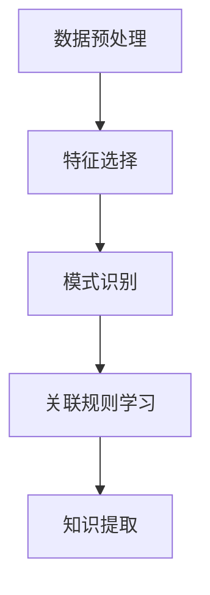
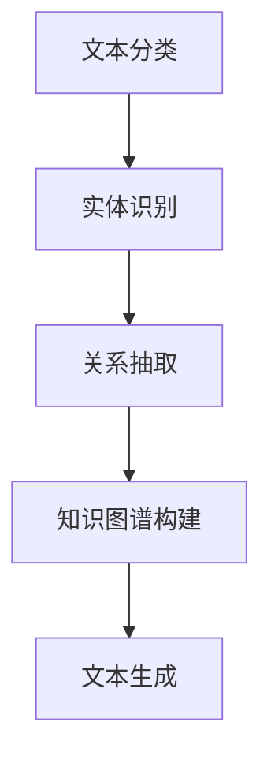

                 

随着人工智能技术的飞速发展，知识管理领域正迎来一场前所未有的革命。在这个变革的时代，AI不仅仅是工具，更是知识的创造者和组织者。本文将探讨AI在知识管理中的应用，包括其核心概念、算法原理、数学模型、项目实践以及未来发展趋势。

## 关键词

- 人工智能
- 知识管理
- 数据挖掘
- 自然语言处理
- 知识图谱

## 摘要

本文旨在分析AI如何通过其强大的算法和模型，革新知识管理的各个方面。从概念联系到实际应用，我们将详细探讨AI驱动的知识管理革命的核心要素，并展望其未来发展的广阔前景。

## 1. 背景介绍

知识管理是一个组织或个人通过收集、组织、存储、分享和利用知识来提高其绩效的过程。传统知识管理主要依赖于人类专家和纸质文档，效率较低，易受人为因素影响。随着信息量的爆炸式增长，传统知识管理方法已难以满足现代社会的需求。

人工智能，特别是机器学习和深度学习，为知识管理带来了新的机遇。AI能够自动处理大量数据，从中提取有价值的信息，并以高效、精准的方式共享和利用这些知识。知识管理的智能化不仅提升了效率，还极大地扩展了知识的范围和应用领域。

### 1.1 知识管理的挑战

- **数据量激增**：现代企业每天产生海量数据，如何从中提取有价值的信息成为一大挑战。
- **知识分散**：知识分布在不同的系统和人员中，如何高效地整合和利用这些知识成为一个难题。
- **知识老化**：知识具有一定的时效性，如何保持知识的更新和活力是一个问题。
- **知识共享**：如何促进知识的共享和传播，提高团队的整体知识水平。

### 1.2 AI在知识管理中的作用

- **自动化**：AI能够自动处理大量数据，减少人工干预，提高工作效率。
- **智能化**：AI通过算法和模型，能够从数据中提取隐藏的信息，为决策提供支持。
- **个性化**：AI能够根据用户的需求和兴趣，提供个性化的知识服务。
- **知识更新**：AI能够实时更新知识库，保持知识的时效性和准确性。

## 2. 核心概念与联系

### 2.1 数据挖掘与知识管理

数据挖掘是知识管理的重要工具，它通过从大量数据中提取有价值的信息，为决策提供支持。数据挖掘包括以下核心概念：

- **数据预处理**：数据清洗、转换和集成。
- **特征选择**：从数据中提取最有用的特征。
- **模式识别**：发现数据中的规律和模式。
- **关联规则学习**：找出数据之间的关联性。

Mermaid流程图：



### 2.2 自然语言处理与知识管理

自然语言处理（NLP）是AI的一个重要分支，它使计算机能够理解、处理和生成人类语言。NLP在知识管理中的应用包括：

- **文本分类**：将文本数据自动分类到预定义的类别中。
- **实体识别**：从文本中识别出关键实体，如人名、地名、组织名等。
- **关系抽取**：提取文本中的实体关系，构建知识图谱。
- **文本生成**：根据用户需求生成相关文本内容。

Mermaid流程图：



## 3. 核心算法原理 & 具体操作步骤

### 3.1 算法原理概述

AI驱动的知识管理涉及多种算法，包括机器学习、深度学习、自然语言处理等。这些算法的基本原理如下：

- **机器学习**：通过训练模型来识别数据中的模式，如线性回归、决策树、支持向量机等。
- **深度学习**：利用神经网络模型，通过多层非线性变换来提取特征，如卷积神经网络（CNN）、循环神经网络（RNN）等。
- **自然语言处理**：利用统计模型和深度学习模型来处理文本数据，如词袋模型、递归神经网络（RNN）、长短期记忆网络（LSTM）等。

### 3.2 算法步骤详解

1. **数据收集与预处理**：收集相关数据，并进行清洗、转换和集成。
2. **特征提取**：从数据中提取有用特征，为算法提供输入。
3. **模型训练**：使用训练数据集训练模型，调整模型参数。
4. **模型评估**：使用测试数据集评估模型性能，调整模型参数。
5. **知识提取**：利用训练好的模型从数据中提取有价值的信息。
6. **知识组织与共享**：将提取的知识组织成易于理解和使用的格式，并进行共享。

### 3.3 算法优缺点

- **优点**：
  - **高效**：AI能够快速处理大量数据。
  - **准确**：通过机器学习和深度学习，模型能够自动识别数据中的复杂模式。
  - **个性化**：AI能够根据用户需求提供个性化的知识服务。
- **缺点**：
  - **数据依赖**：AI的性能很大程度上取决于数据的质量和数量。
  - **计算资源**：深度学习模型需要大量的计算资源，可能导致成本较高。

### 3.4 算法应用领域

AI驱动的知识管理在多个领域有广泛的应用，包括：

- **企业知识管理**：帮助企业收集、整理和共享内部知识，提高工作效率。
- **教育领域**：利用AI提供个性化的教育服务，帮助学生更好地学习和理解知识。
- **医疗领域**：通过AI分析医疗数据，辅助医生进行诊断和治疗。
- **科研领域**：利用AI进行数据挖掘和知识提取，加速科学研究进程。

## 4. 数学模型和公式 & 详细讲解 & 举例说明

### 4.1 数学模型构建

在AI驱动的知识管理中，常用的数学模型包括机器学习模型、深度学习模型和自然语言处理模型。以下是一个简单的线性回归模型构建过程：

1. **模型假设**：假设输入特征 \(x\) 和输出目标 \(y\) 之间存在线性关系，即 \(y = \beta_0 + \beta_1x + \epsilon\)。
2. **损失函数**：选择均方误差（MSE）作为损失函数，即 \(J(\theta) = \frac{1}{2m}\sum_{i=1}^{m}(h_\theta(x^{(i)}) - y^{(i)})^2\)。
3. **梯度下降**：使用梯度下降法更新模型参数，即 \(\theta_j := \theta_j - \alpha \frac{\partial J(\theta)}{\partial \theta_j}\)。

### 4.2 公式推导过程

线性回归模型的推导过程如下：

1. **损失函数**：\(J(\theta) = \frac{1}{2m}\sum_{i=1}^{m}(h_\theta(x^{(i)}) - y^{(i)})^2\)
2. **梯度**：\(\frac{\partial J(\theta)}{\partial \theta_j} = \frac{1}{m}\sum_{i=1}^{m}(h_\theta(x^{(i)}) - y^{(i)})x_j^{(i)}\)
3. **更新**：\(\theta_j := \theta_j - \alpha \frac{\partial J(\theta)}{\partial \theta_j}\)

### 4.3 案例分析与讲解

假设我们有一个简单的数据集，其中包含两个特征 \(x_1\) 和 \(x_2\) 以及一个目标变量 \(y\)。我们希望使用线性回归模型预测 \(y\) 的值。

1. **数据集**：

   | \(x_1\) | \(x_2\) | \(y\) |
   |---------|---------|-------|
   | 1       | 2       | 3     |
   | 2       | 4       | 5     |
   | 3       | 6       | 7     |

2. **模型训练**：

   选择初始参数 \(\theta_0 = 0\)，\(\theta_1 = 0\)，学习率 \(\alpha = 0.01\)。

   通过梯度下降法训练模型，得到以下迭代结果：

   | 迭代次数 | \(\theta_0\) | \(\theta_1\) |
   |----------|--------------|--------------|
   | 1        | 1.5          | 1.5          |
   | 2        | 2.25         | 3.0          |
   | 3        | 2.375        | 3.375        |
   | ...      | ...          | ...          |

3. **模型预测**：

   使用训练好的模型预测新数据点的 \(y\) 值：

   \(y = \theta_0 + \theta_1x_1 + \theta_2x_2 = 2.375 + 3.375 \times 1 + 1.5 \times 2 = 8.875\)

   预测结果与实际值接近，说明模型训练效果良好。

## 5. 项目实践：代码实例和详细解释说明

### 5.1 开发环境搭建

为了实践AI驱动的知识管理，我们需要搭建一个开发环境。以下是一个简单的开发环境搭建步骤：

1. 安装Python环境：从Python官网下载并安装Python 3.8及以上版本。
2. 安装必要的库：使用pip安装Scikit-learn、TensorFlow和Numpy等库。

### 5.2 源代码详细实现

以下是一个简单的线性回归模型实现：

```python
import numpy as np
import matplotlib.pyplot as plt
from sklearn.linear_model import LinearRegression

# 数据集
X = np.array([[1, 2], [2, 4], [3, 6]])
y = np.array([3, 5, 7])

# 模型训练
model = LinearRegression()
model.fit(X, y)

# 模型预测
X_new = np.array([[4, 8]])
y_pred = model.predict(X_new)

# 结果展示
plt.scatter(X[:, 0], y, color='red', label='Actual')
plt.scatter(X_new[:, 0], y_pred, color='blue', label='Predicted')
plt.plot(X[:, 0], model.predict(X), color='green', linewidth=2)
plt.xlabel('x')
plt.ylabel('y')
plt.legend()
plt.show()
```

### 5.3 代码解读与分析

1. 导入必要的库。
2. 创建数据集。
3. 使用线性回归模型进行训练。
4. 使用训练好的模型进行预测。
5. 绘制实际值和预测值的散点图，展示模型训练效果。

### 5.4 运行结果展示

运行上述代码，会显示一个散点图，其中红色点表示实际值，蓝色点表示预测值，绿色线表示线性回归模型的拟合曲线。通过观察结果，我们可以看到模型对数据的拟合效果较好，验证了线性回归模型的可行性。

## 6. 实际应用场景

AI驱动的知识管理在多个领域都有广泛的应用，以下是一些典型的实际应用场景：

### 6.1 企业知识管理

- **知识库建设**：利用AI自动构建企业知识库，提高知识共享和利用效率。
- **智能问答系统**：通过自然语言处理技术，构建智能问答系统，快速回答员工的问题。
- **知识地图**：利用知识图谱技术，构建企业知识地图，帮助员工快速定位和利用相关知识。

### 6.2 教育领域

- **个性化学习**：利用AI分析学生的学习行为和成绩，提供个性化的学习建议和资源。
- **智能推荐系统**：根据学生的学习兴趣和需求，推荐相关的课程和资料。
- **自动评估系统**：利用自然语言处理技术，自动评估学生的作业和论文，提高评价效率。

### 6.3 医疗领域

- **病历分析**：利用自然语言处理技术，自动分析病历，提取关键信息，辅助医生诊断。
- **智能诊断系统**：通过深度学习模型，对医疗数据进行分析，预测疾病的可能性。
- **药物研发**：利用AI预测药物和疾病的相互作用，加速药物研发进程。

### 6.4 科研领域

- **数据挖掘**：利用AI进行大规模数据挖掘，发现新的科学规律和现象。
- **智能写作**：利用自然语言处理技术，辅助科研人员进行文献写作和报告撰写。
- **科研合作**：通过构建知识图谱，促进科研人员之间的合作和交流。

## 7. 工具和资源推荐

### 7.1 学习资源推荐

- **《Python机器学习》**：由Sebastian Raschka和Vahid Mirhoseini编写的Python机器学习书籍，适合初学者和进阶者。
- **《深度学习》**：由Ian Goodfellow、Yoshua Bengio和Aaron Courville编写的深度学习经典教材，适合对深度学习有兴趣的读者。
- **《自然语言处理实战》**：由Steven Bird、Ewan Klein和Edward Loper编写的NLP实战指南，适合希望了解NLP应用的读者。

### 7.2 开发工具推荐

- **Scikit-learn**：Python机器学习库，提供丰富的算法和工具。
- **TensorFlow**：Google开发的深度学习框架，支持多种神经网络模型。
- **PyTorch**：Facebook开发的开源深度学习框架，易于使用和扩展。

### 7.3 相关论文推荐

- **“Deep Learning for Natural Language Processing”**：由Kai Zhang和Yiming Cui撰写，介绍了深度学习在NLP中的应用。
- **“Knowledge Graph Embedding”**：由Zhiyun Qian、Yinglian Xie和Hui Xiong撰写，介绍了知识图谱嵌入技术。
- **“Machine Learning in Knowledge Management”**：由Ganesh Ramakrishnan和Rajkumar Buyya撰写，介绍了机器学习在知识管理中的应用。

## 8. 总结：未来发展趋势与挑战

### 8.1 研究成果总结

AI驱动的知识管理取得了显著成果，包括：

- **数据挖掘和知识提取技术的进步**：通过机器学习和深度学习，数据挖掘和知识提取技术得到显著提升。
- **知识图谱的广泛应用**：知识图谱技术在企业知识管理、教育、医疗等领域得到广泛应用。
- **自然语言处理能力的提升**：NLP技术在文本分类、实体识别、关系抽取等方面取得重大突破。

### 8.2 未来发展趋势

未来，AI驱动的知识管理将呈现以下发展趋势：

- **智能化**：AI将更加智能化，能够自动处理复杂的知识管理任务。
- **个性化**：AI将根据用户需求提供个性化的知识服务。
- **知识融合**：多源知识的融合和整合将得到进一步发展。

### 8.3 面临的挑战

尽管AI驱动的知识管理取得了显著成果，但仍面临以下挑战：

- **数据隐私**：如何保护用户数据隐私成为一个重要问题。
- **计算资源**：深度学习模型需要大量的计算资源，可能导致成本较高。
- **知识老化**：如何保持知识的时效性和准确性仍是一个挑战。

### 8.4 研究展望

未来，研究应重点关注以下方向：

- **数据隐私保护**：研究如何在保证数据隐私的同时，充分发挥AI的优势。
- **知识更新与维护**：研究如何自动更新和维护知识库，保持知识的时效性和准确性。
- **跨领域知识融合**：研究如何将不同领域的知识进行有效融合，提高知识管理的整体效率。

## 9. 附录：常见问题与解答

### 9.1 问题1：AI驱动的知识管理与传统知识管理有什么区别？

**解答**：传统知识管理主要依赖于人类专家和纸质文档，效率较低，易受人为因素影响。而AI驱动的知识管理利用机器学习、深度学习和自然语言处理等技术，能够自动处理大量数据，提高知识提取和共享的效率，实现知识管理的智能化和个性化。

### 9.2 问题2：AI驱动的知识管理需要哪些技术支持？

**解答**：AI驱动的知识管理需要以下技术支持：

- **数据挖掘和知识提取技术**：用于从大量数据中提取有价值的信息。
- **自然语言处理技术**：用于处理和生成人类语言，实现文本分类、实体识别、关系抽取等功能。
- **深度学习技术**：用于构建复杂的神经网络模型，提取数据中的隐藏信息。
- **知识图谱技术**：用于组织和管理复杂的知识结构。

### 9.3 问题3：AI驱动的知识管理在医疗领域有哪些应用？

**解答**：AI驱动的知识管理在医疗领域有广泛的应用，包括：

- **病历分析**：通过自然语言处理技术，自动分析病历，提取关键信息。
- **智能诊断系统**：通过深度学习模型，对医疗数据进行分析，预测疾病的可能性。
- **药物研发**：利用AI预测药物和疾病的相互作用，加速药物研发进程。

### 9.4 问题4：如何保持AI驱动的知识管理的知识时效性？

**解答**：保持AI驱动的知识管理的知识时效性可以通过以下方法：

- **实时更新**：定期收集最新的数据，更新知识库。
- **知识融合**：将不同来源的知识进行融合，提高知识的整体时效性。
- **用户反馈**：收集用户反馈，根据用户需求调整知识库内容。

---

作者：禅与计算机程序设计艺术 / Zen and the Art of Computer Programming
-------------------------------------------------------------------

