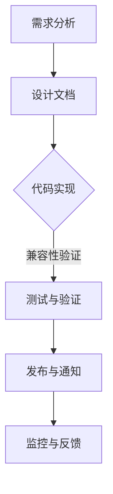

                 

API 版本控制是确保软件在功能更新、接口更改时，依旧能够保持兼容性和稳定性的关键机制。随着互联网应用的发展，API 被广泛应用于各种场景，因此 API 版本控制的基本原则变得尤为重要。本文将深入探讨 API 版本控制的核心原则，包括版本命名规则、向后兼容性策略、版本更新流程等，旨在为开发者提供一套系统化的实践指南。

## 关键词

- API 版本控制
- 版本命名规则
- 向后兼容性
- 版本更新流程

## 摘要

本文首先介绍了 API 版本控制的背景和重要性，接着详细阐述了 API 版本控制的核心原则，包括版本命名规则、向后兼容性策略以及版本更新流程。通过本文的阅读，开发者可以掌握一套科学的 API 版本控制方法，确保软件的稳定性和可维护性。

## 1. 背景介绍

### 1.1 API 的定义与作用

应用程序编程接口（API）是不同软件系统之间进行交互的桥梁，它定义了请求的格式和响应的结构，使得一个软件系统可以调用另一个系统的功能。API 的出现，极大地简化了软件开发的复杂度，提高了系统的可重用性和互操作性。

随着互联网技术的不断发展，API 被广泛应用于各类场景，从 Web 服务、移动应用，到物联网设备和云计算平台，API 都成为了信息交互的核心。然而，随着功能的不断增加和系统架构的演变，API 需要定期更新，这就带来了版本控制的需求。

### 1.2 API 版本控制的意义

API 版本控制的主要目的是确保在系统功能更新或接口更改时，旧系统的调用者仍能够正常工作，避免因版本差异导致的兼容性问题。具体来说，API 版本控制具有以下几个重要作用：

- **保持兼容性**：通过版本控制，可以确保旧版本的应用程序在接收到新版本的 API 时，依旧能够正确解析和处理请求。
- **降低风险**：通过逐步更新 API 版本，开发者可以在不影响现有用户的情况下，逐步引入新的功能和改进。
- **提高可维护性**：明确的版本控制策略有助于开发者更好地管理和维护代码库，避免代码混乱和不必要的冲突。

### 1.3 当前版本控制方案的现状

目前，主流的 API 版本控制方案包括以下几种：

- **URL 版本控制**：通过在 URL 中包含版本号，如 `/v1/users` 表示访问 v1 版本的用户 API。
- **路径版本控制**：在路径中添加版本号前缀，如 `/users/v1` 表示访问 v1 版本的用户 API。
- **参数版本控制**：通过 URL 参数传递版本号，如 `/users?version=1` 表示访问 v1 版本的用户 API。
- **Header 版本控制**：通过 HTTP 请求头中的特定字段传递版本号，如 `Accept: application/vnd.myapi.v1+json` 表示接受 v1 版本的 JSON 格式的用户 API。

以上版本控制方案各有优缺点，开发者需要根据实际情况选择合适的方案。接下来，本文将详细探讨 API 版本控制的基本原则，包括版本命名规则、向后兼容性策略以及版本更新流程。

## 2. 核心概念与联系

### 2.1 版本命名规则

版本命名规则是 API 版本控制的基础，一个清晰、易于理解的版本命名规则有助于开发者和管理者快速识别和管理不同版本的 API。常见的版本命名规则包括：

- **整数递增**：如 1.0、1.1、1.2 等，表示功能逐步完善和改进。
- **日期格式**：如 2023.04、2023.08，表示版本发布的具体日期。
- **大版本.小版本**：如 1.0.1、1.0.2，大版本表示架构或主要功能的变更，小版本表示细节改进或修复。
- **语义化版本**：如 1.0.0-alpha、1.0.0-beta，表示预发布版本，alpha 表示内部测试版，beta 表示公开测试版。

### 2.2 向后兼容性策略

向后兼容性是指新版本的 API 应该能够兼容旧版本的客户端请求。实现向后兼容性的策略包括：

- **API 稳定性**：在设计新版本 API 时，尽量避免破坏旧版本的客户端代码。
- **文档注释**：在文档中明确指出哪些部分发生了变化，以及如何进行迁移。
- **版本过渡**：在引入新版本 API 的同时，保持旧版本 API 的运行，为客户端提供缓冲期。
- **API 迁移工具**：提供自动化工具，帮助开发者快速迁移旧版本的客户端代码。

### 2.3 版本更新流程

版本更新流程是确保 API 更新过程有序、可控的关键。常见的版本更新流程包括以下几个步骤：

1. **需求分析**：明确版本更新的目标和需求，包括新功能、性能优化和修复问题等。
2. **设计文档**：撰写详细的设计文档，包括 API 变更的细节、迁移策略等。
3. **代码实现**：根据设计文档进行代码实现，并确保新版本 API 与旧版本 API 兼容。
4. **测试与验证**：进行全面的测试，确保新版本 API 能够稳定运行，并兼容旧版本客户端。
5. **发布与通知**：发布新版本 API，并通知相关开发者进行更新。
6. **监控与反馈**：监控新版本 API 的运行状况，收集用户反馈，为后续优化提供依据。

### 2.4 Mermaid 流程图

下面是一个简单的 Mermaid 流程图，展示了 API 版本控制的核心概念和流程：



## 3. 核心算法原理 & 具体操作步骤

### 3.1 算法原理概述

API 版本控制的算法原理主要涉及版本命名规则、向后兼容性策略和版本更新流程。这些原理共同作用，确保在 API 更新时，旧版本的应用程序可以平滑过渡到新版本。

- **版本命名规则**：版本命名规则是版本控制的基础，通过清晰的命名规则，可以方便地管理和识别不同版本的 API。
- **向后兼容性策略**：向后兼容性策略确保新版本的 API 能够兼容旧版本的客户端请求，避免因版本差异导致的兼容性问题。
- **版本更新流程**：版本更新流程是确保 API 更新过程有序、可控的关键，包括需求分析、设计文档、代码实现、测试与验证、发布与通知以及监控与反馈等步骤。

### 3.2 算法步骤详解

1. **需求分析**：
   - 确定版本更新的目标和需求，包括新功能、性能优化和修复问题等。
   - 分析旧版本 API 的使用情况，了解哪些部分可能需要进行变更。

2. **设计文档**：
   - 撰写详细的设计文档，包括 API 变更的细节、迁移策略等。
   - 明确版本命名规则，确保命名规则清晰、易于理解。

3. **代码实现**：
   - 根据设计文档进行代码实现，确保新版本 API 与旧版本 API 兼容。
   - 实现向后兼容性策略，避免破坏旧版本的客户端代码。

4. **测试与验证**：
   - 进行全面的测试，包括单元测试、集成测试和压力测试等，确保新版本 API 能够稳定运行，并兼容旧版本客户端。
   - 收集测试结果，分析潜在的问题和改进点。

5. **发布与通知**：
   - 发布新版本 API，更新文档和说明，确保相关开发者了解新版本的功能和变更。
   - 通过邮件、通知系统等途径通知开发者进行更新。

6. **监控与反馈**：
   - 监控新版本 API 的运行状况，包括性能指标、错误日志等。
   - 收集用户反馈，分析用户的使用情况和体验，为后续优化提供依据。

### 3.3 算法优缺点

#### 优点

- **保持兼容性**：通过向后兼容性策略，确保新版本 API 能够兼容旧版本的客户端请求，降低更新风险。
- **提高可维护性**：明确的版本更新流程和命名规则，有助于开发者更好地管理和维护代码库。
- **简化迁移过程**：提供文档和工具，帮助开发者快速迁移旧版本的客户端代码。

#### 缺点

- **增加维护成本**：需要为不同版本的 API 维护不同的代码库，增加维护成本。
- **潜在兼容性问题**：如果设计不当，可能导致新旧版本之间的兼容性问题。

### 3.4 算法应用领域

API 版本控制广泛应用于各类场景，包括 Web 服务、移动应用、物联网设备和云计算平台等。以下是一些典型的应用领域：

- **Web 服务**：Web 服务通常涉及大量的客户端和服务器交互，API 版本控制有助于确保不同版本的客户端可以兼容不同的服务器 API。
- **移动应用**：移动应用版本迭代较快，API 版本控制有助于开发者平滑过渡到新版本，避免兼容性问题。
- **物联网设备**：物联网设备种类繁多，API 版本控制有助于确保设备之间的通信稳定和可靠。
- **云计算平台**：云计算平台提供丰富的 API，API 版本控制有助于开发者管理不同版本的 API，提高系统的可维护性和可扩展性。

## 4. 数学模型和公式 & 详细讲解 & 举例说明

### 4.1 数学模型构建

API 版本控制的数学模型主要涉及版本命名和向后兼容性的概率计算。以下是一个简化的数学模型：

- **版本命名**：假设版本号由三个整数组成，分别为大版本（M）、小版本（m）和修订版本（r），即版本号表示为 \(V = (M, m, r)\)。
- **向后兼容性**：假设新旧版本的兼容性概率为 \(P\)，即新版本 \(V'\) 能够兼容旧版本 \(V\) 的概率为 \(P\)。

### 4.2 公式推导过程

#### 版本命名规则

- **大版本（M）**：表示 API 的主要功能变更或架构调整。
- **小版本（m）**：表示 API 的功能增强或细节改进。
- **修订版本（r）**：表示 API 的错误修复或性能优化。

#### 向后兼容性概率

- **新旧版本兼容性公式**：假设新旧版本之间的兼容性概率为 \(P\)，即 \(P(V' \text{ 能够兼容 } V) = P\)。

#### 具体推导过程：

- **大版本兼容性**：大版本的变更通常涉及到 API 的核心功能和架构的调整，因此兼容性概率较低。假设 \(P_M\) 表示大版本的兼容性概率，则 \(P_M \approx 0.2\)。
- **小版本兼容性**：小版本的变更通常涉及到 API 的功能增强或细节改进，兼容性概率较高。假设 \(P_m\) 表示小版本的兼容性概率，则 \(P_m \approx 0.8\)。
- **修订版本兼容性**：修订版本的变更通常涉及到错误修复和性能优化，兼容性概率最高。假设 \(P_r\) 表示修订版本的兼容性概率，则 \(P_r \approx 1.0\)。

综合以上分析，新旧版本兼容性概率公式为：

\[ P(V' \text{ 能够兼容 } V) = P_M \times P_m \times P_r \]

### 4.3 案例分析与讲解

#### 案例：API 版本控制的应用

假设一个 Web 服务 API，目前版本为 \(V = (1, 0, 0)\)，即将发布新版本 \(V' = (1, 1, 1)\)。根据上述数学模型，我们可以计算出新旧版本的兼容性概率：

\[ P(V' \text{ 能够兼容 } V) = P_M \times P_m \times P_r = 0.2 \times 0.8 \times 1.0 = 0.16 \]

#### 分析：

- **大版本兼容性**：由于大版本的变更通常涉及到核心功能和架构的调整，因此兼容性概率较低，约为 0.2。
- **小版本兼容性**：小版本的变更通常涉及到功能增强或细节改进，兼容性概率较高，约为 0.8。
- **修订版本兼容性**：修订版本的变更通常涉及到错误修复和性能优化，兼容性概率最高，约为 1.0。

因此，新版本 \(V'\) 能够兼容旧版本 \(V\) 的概率约为 16%。

## 5. 项目实践：代码实例和详细解释说明

### 5.1 开发环境搭建

在进行 API 版本控制的项目实践之前，我们需要搭建一个简单的开发环境。以下是一个基于 Python 的示例：

1. 安装 Python 3.8 或更高版本。
2. 安装 Flask 框架：`pip install flask`
3. 创建一个名为 `api_version_control` 的文件夹，并在其中创建一个名为 `app.py` 的文件。

### 5.2 源代码详细实现

下面是一个简单的 API 版本控制示例：

```python
from flask import Flask, request, jsonify

app = Flask(__name__)

# 定义 v1 版本的 API
@app.route('/v1/users', methods=['GET'])
def get_v1_users():
    return jsonify({'version': '1.0.0', 'users': ['Alice', 'Bob']})

# 定义 v2 版本的 API
@app.route('/v2/users', methods=['GET'])
def get_v2_users():
    return jsonify({'version': '2.0.0', 'users': ['Alice', 'Bob', 'Charlie']})

# 定义统一的版本控制路由
@app.route('/users', methods=['GET'])
def get_users():
    version = request.args.get('version', default='1.0.0', type=str)
    if version == '1.0.0':
        return get_v1_users()
    elif version == '2.0.0':
        return get_v2_users()
    else:
        return jsonify({'error': 'Unsupported version'})

if __name__ == '__main__':
    app.run(debug=True)
```

### 5.3 代码解读与分析

1. **Flask 框架**：使用 Flask 框架创建一个 Web 服务。
2. **版本控制路由**：定义了两个版本的 API 路由，分别为 `/v1/users` 和 `/v2/users`。
3. **统一版本控制**：通过 `get_users` 路由，根据 URL 参数中的 `version` 字段，动态调用不同版本的 API。
4. **向后兼容性**：新版本 API 能够兼容旧版本 API，确保旧版本客户端可以正常访问。

### 5.4 运行结果展示

1. 访问 `/users?version=1.0.0`，返回 v1 版本的用户数据。
2. 访问 `/users?version=2.0.0`，返回 v2 版本的用户数据。

```shell
$ curl http://localhost:5000/users?version=1.0.0
{"version": "1.0.0", "users": ["Alice", "Bob"]}

$ curl http://localhost:5000/users?version=2.0.0
{"version": "2.0.0", "users": ["Alice", "Bob", "Charlie"]}
```

## 6. 实际应用场景

### 6.1 Web 服务

Web 服务是 API 版本控制最常见的应用场景之一。随着互联网应用的不断迭代，Web 服务需要定期更新功能、修复漏洞和优化性能。通过 API 版本控制，开发者可以确保旧版本的应用程序可以继续访问新版本的 API，从而降低更新风险，提高用户体验。

### 6.2 移动应用

移动应用版本更新频繁，API 版本控制有助于开发者平滑过渡到新版本。例如，一个社交媒体应用需要引入新的用户互动功能，通过 API 版本控制，旧版本的客户端可以继续使用旧版本的 API，而新版本的客户端则可以使用新版本的 API。

### 6.3 物联网设备

物联网设备种类繁多，不同设备的 API 可能存在兼容性问题。通过 API 版本控制，可以确保不同设备的 API 能够在软件更新时保持兼容，从而提高系统的稳定性和可靠性。

### 6.4 云计算平台

云计算平台提供丰富的 API，用于管理云资源、部署应用等。随着云计算技术的不断发展，API 需要定期更新。通过 API 版本控制，开发者可以确保不同版本的 API 能够兼容，提高平台的可维护性和可扩展性。

### 6.4 未来应用展望

随着技术的不断发展，API 版本控制将面临新的挑战和机遇。以下是一些未来应用展望：

- **智能合约**：智能合约是一种自动执行、控制和管理交易的程序，API 版本控制有助于确保智能合约在不同版本之间保持兼容。
- **分布式系统**：分布式系统中的组件可能需要定期更新，API 版本控制有助于确保组件之间的兼容性，提高系统的稳定性和可靠性。
- **边缘计算**：边缘计算将计算能力推向网络边缘，API 版本控制有助于确保边缘设备和云端系统之间的兼容性。

## 7. 工具和资源推荐

### 7.1 学习资源推荐

- **《API 设计指南》**：一本关于 API 设计的权威指南，涵盖了 API 设计的最佳实践和技巧。
- **《RESTful API 设计最佳实践》**：一本关于 RESTful API 设计的畅销书，提供了丰富的实践经验和案例。
- **《微服务架构设计与实现》**：一本关于微服务架构设计和实现的经典书籍，涵盖了 API 版本控制的相关内容。

### 7.2 开发工具推荐

- **Swagger**：一款强大的 API 文档和测试工具，支持自动生成 API 文档和交互式测试。
- **Postman**：一款功能丰富的 API 测试工具，支持自动化测试和集成测试。
- **JAX-RS**：一款 Java RESTful API 开发框架，支持版本控制和国际化等功能。

### 7.3 相关论文推荐

- **"Versioning APIs with Subresource Candidates"**：一篇关于 API 版本控制的经典论文，提出了基于子资源候选的版本控制方法。
- **"API Design and Versioning Strategies"**：一篇关于 API 设计和版本控制策略的综述论文，总结了当前主流的 API 版本控制方法。

## 8. 总结：未来发展趋势与挑战

### 8.1 研究成果总结

本文总结了 API 版本控制的基本原则，包括版本命名规则、向后兼容性策略和版本更新流程。通过深入分析，我们发现 API 版本控制在确保软件兼容性和稳定性方面具有重要意义。同时，本文还介绍了 API 版本控制在实际应用场景中的效果，并展望了未来的发展趋势。

### 8.2 未来发展趋势

随着互联网技术的不断发展，API 版本控制将面临新的挑战和机遇。以下是一些未来发展趋势：

- **智能合约版本控制**：智能合约在区块链领域应用广泛，API 版本控制有助于确保智能合约在不同版本之间保持兼容。
- **分布式系统版本控制**：分布式系统中的组件需要定期更新，API 版本控制有助于确保组件之间的兼容性。
- **边缘计算版本控制**：边缘计算将计算能力推向网络边缘，API 版本控制有助于确保边缘设备和云端系统之间的兼容性。

### 8.3 面临的挑战

尽管 API 版本控制具有重要意义，但仍然面临一些挑战：

- **兼容性问题**：新旧版本的兼容性难以保证，可能导致性能下降或功能失效。
- **维护成本**：需要为不同版本的 API 维护不同的代码库，增加维护成本。
- **用户迁移**：用户需要适应新版本的 API，可能需要投入额外的时间和精力进行迁移。

### 8.4 研究展望

为了解决上述挑战，未来研究可以从以下几个方面展开：

- **智能兼容性检测**：开发智能兼容性检测工具，自动识别和修复 API 兼容性问题。
- **自动化迁移工具**：开发自动化迁移工具，帮助用户快速迁移旧版本的 API。
- **版本控制策略优化**：研究更加高效和灵活的版本控制策略，降低维护成本和提高兼容性。

通过持续的研究和探索，API 版本控制将在未来发挥更加重要的作用，为软件开发提供强有力的支持。

## 9. 附录：常见问题与解答

### 问题 1：为什么需要 API 版本控制？

**解答**：API 版本控制是确保软件在功能更新、接口更改时，依旧能够保持兼容性和稳定性的关键机制。随着互联网应用的发展，API 被广泛应用于各种场景，因此 API 版本控制的基本原则变得尤为重要。

### 问题 2：版本命名规则有哪些常见形式？

**解答**：常见的版本命名规则包括整数递增、日期格式、大版本.小版本和语义化版本等。整数递增通常用于表示功能逐步完善和改进，日期格式表示版本发布的具体日期，大版本.小版本表示架构或主要功能的变更，语义化版本则用于表示预发布版本。

### 问题 3：如何确保 API 的向后兼容性？

**解答**：确保 API 的向后兼容性可以通过以下策略实现：

- **API 稳定性**：在设计新版本 API 时，尽量避免破坏旧版本的客户端代码。
- **文档注释**：在文档中明确指出哪些部分发生了变化，以及如何进行迁移。
- **版本过渡**：在引入新版本 API 的同时，保持旧版本 API 的运行，为客户端提供缓冲期。
- **API 迁移工具**：提供自动化工具，帮助开发者快速迁移旧版本的客户端代码。

### 问题 4：如何进行 API 版本更新？

**解答**：进行 API 版本更新通常包括以下步骤：

- **需求分析**：明确版本更新的目标和需求，包括新功能、性能优化和修复问题等。
- **设计文档**：撰写详细的设计文档，包括 API 变更的细节、迁移策略等。
- **代码实现**：根据设计文档进行代码实现，并确保新版本 API 与旧版本 API 兼容。
- **测试与验证**：进行全面的测试，确保新版本 API 能够稳定运行，并兼容旧版本客户端。
- **发布与通知**：发布新版本 API，并通知相关开发者进行更新。
- **监控与反馈**：监控新版本 API 的运行状况，收集用户反馈，为后续优化提供依据。

