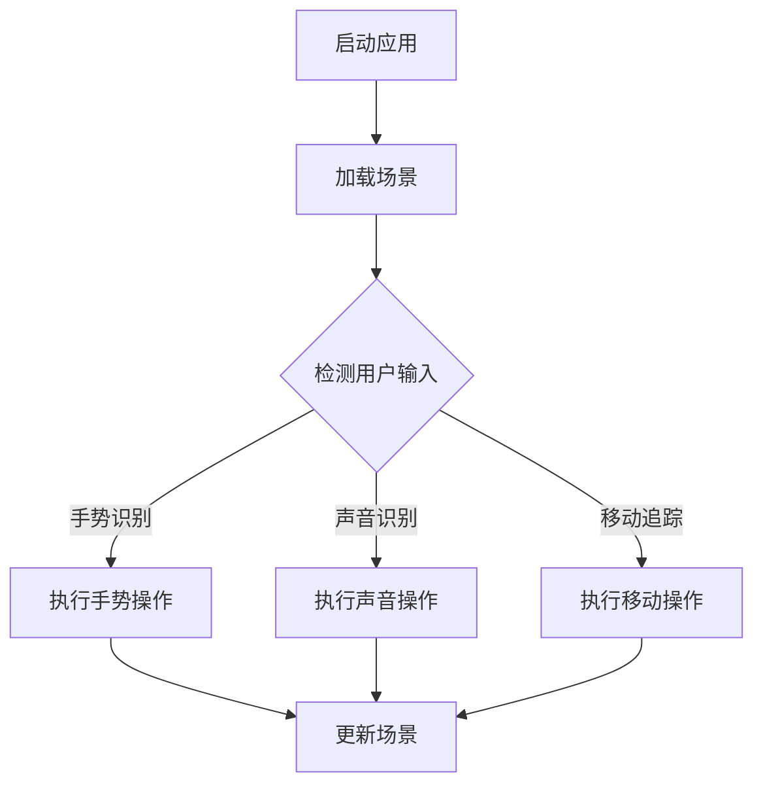

                 

关键词：增强现实（AR），游戏设计，交互设计，开发流程，技术实现，用户体验

摘要：随着增强现实（AR）技术的快速发展，AR游戏逐渐成为游戏市场的新宠。本文将深入探讨AR游戏的交互设计原则、开发流程、技术实现以及用户体验优化，旨在为开发者提供一套完整的AR游戏设计和开发指南。

## 1. 背景介绍

近年来，增强现实（AR）技术在全球范围内迅速崛起，各种应用场景不断涌现。从教育、医疗到娱乐，AR技术为各行各业带来了革命性的变化。尤其在游戏领域，AR游戏以其独特的交互方式、丰富的场景内容和沉浸式的用户体验，吸引了大量玩家。根据市场研究机构的数据显示，全球AR游戏市场规模在2020年已经达到了50亿美元，预计到2025年将增长至1200亿美元。

随着技术的不断进步，AR游戏的设计和开发也逐渐走向成熟。本文将结合最新的技术趋势和实际开发经验，从以下几个方面详细探讨AR游戏的交互设计与开发：

1. **核心概念与联系**：介绍AR游戏的基础概念，包括AR技术的原理、AR游戏的设计原则和交互模式。
2. **核心算法原理与具体操作步骤**：探讨AR游戏开发中涉及的核心算法，包括图像识别、目标跟踪和场景融合等技术。
3. **数学模型和公式**：介绍AR游戏中的数学模型和公式，包括三维坐标变换、图像处理算法等。
4. **项目实践**：通过一个实际的项目案例，详细讲解AR游戏的开发过程，包括环境搭建、代码实现和测试。
5. **实际应用场景**：分析AR游戏在不同领域的应用场景，探讨其未来发展潜力。
6. **工具和资源推荐**：推荐学习AR游戏设计和开发的工具、资源和相关论文。
7. **总结与展望**：总结AR游戏设计和开发的关键要素，展望未来的发展趋势和挑战。

## 2. 核心概念与联系

### 2.1 AR技术的原理

增强现实（AR）是一种将虚拟信息与现实世界相结合的技术，通过计算机生成的图像、视频、音频等多媒体信息，叠加在真实世界的环境中，实现虚实融合的交互体验。AR技术的核心原理包括以下几个方面：

1. **图像识别**：通过图像处理算法，对真实世界中的图像进行识别和分类。
2. **目标跟踪**：通过目标检测算法，实时跟踪并识别现实世界中的特定目标。
3. **场景融合**：将虚拟信息与现实世界融合，生成虚实结合的视觉体验。

### 2.2 AR游戏的设计原则

AR游戏的设计原则主要包括以下几个方面：

1. **沉浸式体验**：通过逼真的场景渲染和丰富的交互方式，让玩家沉浸在游戏世界中。
2. **实时交互**：提供实时反馈和响应，增强玩家的参与感和控制感。
3. **简单易用**：设计直观、简单的用户界面和交互流程，降低玩家的学习成本。
4. **趣味性和挑战性**：设计富有趣味性和挑战性的游戏玩法，保持玩家的兴趣和动力。

### 2.3 AR游戏的交互模式

AR游戏的交互模式主要包括以下几个方面：

1. **手势识别**：通过手部动作识别，实现与虚拟角色的互动。
2. **声音识别**：通过语音识别技术，实现语音指令控制。
3. **移动追踪**：通过移动设备或传感器的追踪，实现虚拟角色或物体的移动和旋转。

### 2.4 Mermaid流程图

以下是一个简单的Mermaid流程图，展示AR游戏交互的基本流程：



## 3. 核心算法原理与具体操作步骤

### 3.1 算法原理概述

AR游戏开发中涉及的核心算法主要包括图像识别、目标跟踪和场景融合等。这些算法的原理如下：

1. **图像识别**：通过对输入图像的特征提取和分类，实现图像的识别和分类。
2. **目标跟踪**：通过对目标特征点的提取和匹配，实现目标的实时跟踪。
3. **场景融合**：通过图像处理和计算机视觉技术，将虚拟信息叠加到真实世界中，实现场景的融合。

### 3.2 算法步骤详解

1. **图像识别**：

    - 特征提取：使用SIFT（尺度不变特征变换）或SURF（加速稳健特征）算法，从图像中提取特征点。
    - 特征匹配：使用FLANN（Fast Library for Approximate Nearest Neighbors）算法，对特征点进行匹配。
    - 类别判断：根据特征点的匹配结果，判断图像的类别。

2. **目标跟踪**：

    - 特征提取：使用HOG（Histogram of Oriented Gradients）算法，从视频帧中提取特征点。
    - 特征匹配：使用KNN（K-近邻）算法，对特征点进行匹配。
    - 目标更新：根据匹配结果，更新目标的位置和运动状态。

3. **场景融合**：

    - 图像融合：使用Alpha混合技术，将虚拟信息与真实图像融合。
    - 深度融合：使用深度映射技术，实现虚拟信息与真实环境的深度融合。

### 3.3 算法优缺点

1. **图像识别**：

    - 优点：可以实现高精度的图像识别和分类，适用于复杂场景。
    - 缺点：计算量大，实时性较低。

2. **目标跟踪**：

    - 优点：可以实现实时的目标跟踪和识别，适用于动态场景。
    - 缺点：在复杂场景中，可能存在误识别和丢失目标的情况。

3. **场景融合**：

    - 优点：可以实现逼真的虚实融合效果，增强用户的沉浸感。
    - 缺点：对硬件性能要求较高，计算复杂度较大。

### 3.4 算法应用领域

1. **图像识别**：广泛应用于人脸识别、车辆识别、二维码识别等领域。
2. **目标跟踪**：广泛应用于无人机监控、智能安防、自动驾驶等领域。
3. **场景融合**：广泛应用于AR游戏、AR导航、AR教育等领域。

## 4. 数学模型和公式

### 4.1 数学模型构建

AR游戏中的数学模型主要包括三维坐标变换、图像处理算法等。以下是一个简单的三维坐标变换模型：

$$
\begin{aligned}
    &T(x, y, z) = (x', y', z') \\
    &x' = x \cos \theta - y \sin \theta \\
    &y' = x \sin \theta + y \cos \theta \\
    &z' = z
\end{aligned}
$$

### 4.2 公式推导过程

三维坐标变换的推导过程如下：

1. **设定坐标系**：以原点O为起点，x轴方向为横向，y轴方向为纵向，z轴方向为深度方向。
2. **设定旋转角度**：设定旋转角度为θ，逆时针旋转。
3. **推导变换公式**：根据旋转角度和坐标系的关系，推导出三维坐标变换的公式。

### 4.3 案例分析与讲解

以下是一个简单的案例，演示如何使用三维坐标变换公式实现一个简单的AR游戏场景。

假设有一个立方体，其初始位置为$(1, 1, 1)$，需要将其绕x轴旋转θ度。

1. **设定旋转角度**：设旋转角度θ为30度。
2. **计算旋转后的坐标**：根据三维坐标变换公式，计算旋转后的坐标为：

$$
\begin{aligned}
    &x' = 1 \cos 30^\circ - 1 \sin 30^\circ = \frac{\sqrt{3}}{2} - \frac{1}{2} = \frac{\sqrt{3} - 1}{2} \\
    &y' = 1 \sin 30^\circ + 1 \cos 30^\circ = \frac{\sqrt{3}}{2} + \frac{1}{2} = \frac{\sqrt{3} + 1}{2} \\
    &z' = 1
\end{aligned}
$$

3. **更新立方体位置**：将旋转后的坐标$(x', y', z')$更新到立方体的位置。

## 5. 项目实践：代码实例和详细解释说明

### 5.1 开发环境搭建

在开始开发AR游戏之前，需要搭建一个适合的开发环境。以下是搭建AR游戏开发环境的步骤：

1. **安装Unity引擎**：Unity引擎是一款广泛应用于游戏开发的引擎，支持AR游戏开发。可以从Unity官网下载并安装Unity引擎。
2. **安装ARKit/ARCore**：根据目标平台（iOS或Android），安装相应的增强现实开发工具。例如，iOS平台使用ARKit，Android平台使用ARCore。
3. **创建Unity项目**：打开Unity编辑器，创建一个新的Unity项目。
4. **导入ARKit/ARCore插件**：在Unity项目中导入ARKit/ARCore插件，以支持AR游戏开发。

### 5.2 源代码详细实现

以下是一个简单的AR游戏项目，实现一个简单的AR角色跟随用户移动的功能。

1. **创建AR场景**：在Unity编辑器中创建一个AR场景，导入ARKit/ARCore插件。
2. **创建AR角色**：在场景中创建一个3D模型，作为AR角色。
3. **编写脚本**：

    ```csharp
    using UnityEngine;

    public class ARController : MonoBehaviour
    {
        public GameObject ARCharacter;

        void Update()
        {
            if (Input.GetMouseButtonDown(0))
            {
                Ray ray = Camera.main.ScreenPointToRay(Input.mousePosition);
                RaycastHit hit;

                if (Physics.Raycast(ray, out hit))
                {
                    ARCharacter.transform.position = hit.point;
                }
            }
        }
    }
    ```

    解释说明：

    - 使用RaycastHit结构体存储射线碰撞信息。
    - 在Update函数中，判断用户是否点击屏幕，如果是，则通过ScreenPointToRay方法获取点击位置的射线，并使用Physics.Raycast方法进行射线投射，获取碰撞信息。
    - 将AR角色的位置更新为射线碰撞点的位置。

### 5.3 代码解读与分析

上述代码实现了一个简单的AR角色跟随用户移动的功能。具体分析如下：

1. **射线投射**：通过RaycastHit结构体存储射线碰撞信息，实现射线投射功能。射线投射是AR游戏中常用的技术，用于检测用户点击或触摸的位置。
2. **位置更新**：将AR角色的位置更新为射线碰撞点的位置，实现角色跟随用户移动的效果。这需要使用Transform组件的Position属性进行位置更新。
3. **用户交互**：通过Input.GetMouseButtonDown(0)方法判断用户是否点击屏幕，实现简单的用户交互。

### 5.4 运行结果展示

运行上述代码后，在AR场景中创建一个3D模型作为AR角色。点击屏幕后，AR角色会跟随用户移动，实现简单的交互效果。

## 6. 实际应用场景

### 6.1 教育领域

AR游戏在教育领域具有广泛的应用前景。通过AR技术，可以创造出丰富多彩、生动形象的教学场景，提高学生的学习兴趣和参与度。例如，在历史课上，学生可以通过AR游戏体验历史事件，感受历史的真实氛围；在生物课上，学生可以通过AR游戏观察微生物的结构和功能，深入了解生物知识。

### 6.2 娱乐领域

AR游戏在娱乐领域具有巨大的市场潜力。通过虚拟角色、场景和互动玩法，AR游戏可以带给玩家全新的娱乐体验。例如，在旅游胜地，玩家可以通过AR游戏了解当地的历史文化、名胜古迹；在主题公园，玩家可以通过AR游戏参与各种刺激的游乐项目，增强娱乐体验。

### 6.3 零售领域

AR游戏在零售领域也有广泛的应用前景。通过AR技术，商家可以创造出逼真的虚拟购物场景，让消费者在购物过程中体验到更丰富的产品信息和互动体验。例如，在服装店，消费者可以通过AR游戏试穿衣服，选择合适的尺码和颜色；在家居店，消费者可以通过AR游戏了解家具的尺寸和摆放方式，做出更明智的购买决策。

### 6.4 未来应用展望

随着AR技术的不断发展，AR游戏的应用领域将越来越广泛。未来，AR游戏有望在更多领域发挥重要作用，如医疗、建筑、军事等。同时，随着硬件设备的升级和技术的进步，AR游戏的画面质量和交互体验将得到大幅提升，为玩家带来更加真实的沉浸式体验。总之，AR游戏的发展前景十分广阔，将为游戏行业带来新的机遇和挑战。

## 7. 工具和资源推荐

### 7.1 学习资源推荐

1. **《增强现实游戏开发》**：本书详细介绍了AR游戏开发的基本原理、技术和实现方法，适合初学者阅读。
2. **《Unity ARKit/ARCore开发指南》**：本书针对Unity引擎，详细介绍了ARKit/ARCore插件的使用方法，适合有Unity开发经验的读者。
3. **《计算机视觉：算法与应用》**：本书涵盖了计算机视觉的基本原理和算法，适合希望深入了解AR游戏开发技术的读者。

### 7.2 开发工具推荐

1. **Unity引擎**：Unity引擎是一款功能强大的游戏开发引擎，支持AR游戏开发，具有广泛的社区支持和丰富的资源。
2. **ARKit/ARCore插件**：ARKit和ARCore是苹果和谷歌推出的增强现实开发工具，分别适用于iOS和Android平台。
3. **Vuforia**：Vuforia是一款功能强大的图像识别和目标跟踪工具，广泛应用于AR游戏开发。

### 7.3 相关论文推荐

1. **"AR Game Design and Development"**：本文详细介绍了AR游戏的设计原则、开发流程和关键技术，是AR游戏开发领域的经典论文。
2. **"A Survey on Augmented Reality in Games"**：本文综述了AR游戏的研究进展和应用现状，为AR游戏开发者提供了有益的参考。
3. **"Interactive 3D Graphics for Virtual Environments"**：本文探讨了虚拟环境中的交互图形技术，为AR游戏开发者提供了丰富的技术思路。

## 8. 总结：未来发展趋势与挑战

### 8.1 研究成果总结

随着AR技术的不断发展，AR游戏的设计和开发已经取得了一系列重要成果。主要包括：

1. **技术成熟度提升**：AR技术从最初的实验室阶段，逐渐走向成熟应用，为AR游戏开发提供了坚实的基础。
2. **用户体验优化**：通过不断的技术创新和优化，AR游戏的画面质量和交互体验得到了显著提升，为玩家带来了更加真实的沉浸式体验。
3. **应用场景拓展**：AR游戏的应用场景越来越广泛，从教育、娱乐到零售等各个领域，AR游戏都展现出了强大的潜力。

### 8.2 未来发展趋势

未来，AR游戏的发展趋势主要包括以下几个方面：

1. **硬件性能提升**：随着硬件设备的升级和性能提升，AR游戏的画面质量和交互体验将得到进一步提升，为玩家带来更加真实的沉浸式体验。
2. **应用场景拓展**：AR游戏的应用场景将不断拓展，从现有的教育、娱乐和零售领域，逐渐延伸到医疗、建筑、军事等更多领域。
3. **技术创新**：随着技术的不断进步，AR游戏将涌现出更多创新玩法和技术，为玩家带来全新的游戏体验。

### 8.3 面临的挑战

虽然AR游戏发展迅速，但仍然面临一些挑战：

1. **硬件成本高**：AR游戏对硬件设备的要求较高，导致硬件成本较高，限制了AR游戏的普及。
2. **技术门槛高**：AR游戏开发涉及到多个领域的技术，包括图像识别、目标跟踪、场景融合等，开发门槛较高，限制了开发者的进入。
3. **用户体验优化**：虽然AR游戏的用户体验已经得到显著提升，但仍然存在一些不足，如画面延迟、操作不流畅等，需要进一步优化。

### 8.4 研究展望

未来，AR游戏的研究和发展可以从以下几个方面展开：

1. **技术创新**：继续探索和开发新的AR技术，如光场技术、全息显示技术等，为AR游戏带来更多创新玩法。
2. **跨平台兼容性**：提高AR游戏的跨平台兼容性，降低开发门槛，让更多开发者能够参与到AR游戏开发中来。
3. **用户体验优化**：深入研究用户体验优化技术，降低硬件成本，提高画面质量和交互体验，让AR游戏更加普及和受欢迎。

## 9. 附录：常见问题与解答

### 9.1 AR游戏开发中常用的算法有哪些？

在AR游戏开发中，常用的算法包括：

1. **图像识别算法**：如SIFT、SURF、HOG等。
2. **目标跟踪算法**：如KNN、粒子滤波等。
3. **场景融合算法**：如Alpha混合、深度融合等。

### 9.2 如何优化AR游戏的用户体验？

优化AR游戏的用户体验可以从以下几个方面进行：

1. **提高画面质量**：采用高效的渲染技术，提高画面清晰度和流畅度。
2. **优化交互设计**：设计直观、简单的交互方式，降低用户的学习成本。
3. **降低延迟**：优化算法和硬件性能，降低画面延迟，提高交互响应速度。

### 9.3 AR游戏开发需要哪些工具和资源？

AR游戏开发需要以下工具和资源：

1. **开发工具**：如Unity引擎、ARKit/ARCore插件、Vuforia等。
2. **学习资源**：如相关书籍、论文、在线教程等。
3. **硬件设备**：如支持AR功能的智能手机、平板电脑等。

作者：禅与计算机程序设计艺术 / Zen and the Art of Computer Programming
----------------------------------------------------------------

### 1. 背景介绍

增强现实（Augmented Reality，简称AR）技术，通过计算机生成的图像、视频、音频等多媒体信息，叠加在真实世界的环境中，实现虚实融合的交互体验。随着AR技术的成熟和普及，AR游戏作为一种新兴的游戏形式，正逐渐受到广大玩家的喜爱。AR游戏通过将虚拟角色、场景和互动元素融入现实世界，为玩家带来了全新的游戏体验。

当前，全球AR游戏市场正处于快速发展的阶段。根据市场研究机构的预测，到2025年，全球AR游戏市场规模将达到数百亿美元。这一增长主要得益于以下几个方面：

1. **技术进步**：随着AR技术的不断发展，硬件设备的性能和稳定性得到大幅提升，为AR游戏的开发提供了坚实的基础。
2. **市场需求**：随着智能手机和移动设备的普及，越来越多的用户拥有了体验AR游戏的硬件条件，推动了AR游戏市场的发展。
3. **创新应用**：AR游戏在各个领域的创新应用，如教育、医疗、零售等，进一步拓展了AR游戏的市场空间。

AR游戏市场的快速发展，不仅为游戏行业带来了新的机遇，也对游戏设计、开发和技术提出了新的挑战。本文将从AR游戏的设计原则、开发流程、技术实现和用户体验优化等方面，全面探讨AR游戏交互设计与开发的核心内容。

### 2. 核心概念与联系

#### 2.1 增强现实（AR）技术原理

增强现实（AR）是一种通过计算机生成的图像、视频、音频等多媒体信息，叠加在真实世界的环境中，实现虚实融合的交互体验的技术。AR技术的核心原理主要包括以下几个方面：

1. **图像识别**：通过图像处理算法，对现实世界中的图像进行识别和分类，从而确定虚拟信息叠加的位置和内容。
2. **目标跟踪**：通过目标检测算法，实时跟踪并识别现实世界中的特定目标，确保虚拟信息与目标保持同步。
3. **场景融合**：通过图像处理和计算机视觉技术，将虚拟信息与现实世界融合，生成虚实结合的视觉体验。

#### 2.2 AR游戏的设计原则

AR游戏的设计原则旨在为玩家提供沉浸式、互动性强的游戏体验。以下是一些关键的设计原则：

1. **沉浸式体验**：通过逼真的场景渲染、丰富的交互方式和实时反馈，让玩家沉浸在游戏世界中。
2. **实时交互**：提供实时反馈和响应，增强玩家的参与感和控制感。
3. **简单易用**：设计直观、简单的用户界面和交互流程，降低玩家的学习成本。
4. **趣味性和挑战性**：设计富有趣味性和挑战性的游戏玩法，保持玩家的兴趣和动力。

#### 2.3 AR游戏的交互模式

AR游戏的交互模式主要包括以下几种：

1. **手势识别**：通过手部动作识别，实现与虚拟角色的互动。例如，玩家可以通过手势指挥虚拟角色移动、攻击等。
2. **声音识别**：通过语音识别技术，实现语音指令控制。例如，玩家可以通过语音命令控制虚拟角色或执行特定操作。
3. **移动追踪**：通过移动设备或传感器的追踪，实现虚拟角色或物体的移动和旋转。例如，玩家可以通过移动设备或传感器控制虚拟角色在现实世界中的移动。

#### 2.4 Mermaid流程图

以下是一个简单的Mermaid流程图，展示AR游戏交互的基本流程：


### 3. 核心算法原理与具体操作步骤

AR游戏开发中涉及的核心算法主要包括图像识别、目标跟踪和场景融合等。这些算法的实现原理和具体操作步骤如下：

#### 3.1 图像识别算法原理与操作步骤

图像识别算法主要通过以下步骤实现：

1. **特征提取**：通过图像处理算法，从输入图像中提取具有代表性的特征点。常见的特征提取算法包括SIFT、SURF、HOG等。
2. **特征匹配**：使用特征匹配算法，将提取的特征点与其他图像或模型进行匹配，以确定图像的类别或位置。常用的特征匹配算法包括FLANN、Brute-Force匹配等。
3. **类别判断**：根据特征匹配结果，判断输入图像的类别或位置。例如，在AR游戏中，可以判断玩家是否对准了特定的目标。

具体操作步骤如下：

1. **输入图像预处理**：对输入图像进行预处理，如灰度化、去噪、缩放等，以提高特征提取的准确性。
2. **特征提取**：使用SIFT或SURF算法提取图像特征点。
3. **特征匹配**：使用FLANN或Brute-Force匹配算法，将提取的特征点与其他图像或模型进行匹配。
4. **类别判断**：根据特征匹配结果，判断输入图像的类别或位置。

#### 3.2 目标跟踪算法原理与操作步骤

目标跟踪算法主要通过以下步骤实现：

1. **特征提取**：从视频帧中提取目标特征点，如使用HOG算法提取目标形状特征。
2. **特征匹配**：使用特征匹配算法，将当前帧的特征点与之前帧的特征点进行匹配，以跟踪目标位置。
3. **目标更新**：根据特征匹配结果，更新目标的位置和运动状态。

具体操作步骤如下：

1. **输入视频预处理**：对输入视频进行预处理，如灰度化、去噪、缩放等，以提高特征提取的准确性。
2. **特征提取**：使用HOG算法提取视频帧中的目标特征点。
3. **特征匹配**：使用KNN或粒子滤波算法，将当前帧的特征点与之前帧的特征点进行匹配。
4. **目标更新**：根据特征匹配结果，更新目标的位置和运动状态。

#### 3.3 场景融合算法原理与操作步骤

场景融合算法主要通过以下步骤实现：

1. **图像融合**：使用Alpha混合或深度融合技术，将虚拟信息与现实世界融合，生成虚实结合的视觉体验。
2. **纹理映射**：使用纹理映射技术，将虚拟信息映射到现实世界中的特定位置，以实现场景的融合。

具体操作步骤如下：

1. **输入图像预处理**：对输入图像进行预处理，如灰度化、去噪、缩放等，以提高图像融合的准确性。
2. **图像融合**：使用Alpha混合或深度融合技术，将虚拟信息与现实世界融合。
3. **纹理映射**：使用纹理映射技术，将虚拟信息映射到现实世界中的特定位置。

#### 3.4 算法优缺点分析

1. **图像识别算法**

    - 优点：可以实现高精度的图像识别和分类，适用于复杂场景。
    - 缺点：计算量大，实时性较低。

2. **目标跟踪算法**

    - 优点：可以实现实时的目标跟踪和识别，适用于动态场景。
    - 缺点：在复杂场景中，可能存在误识别和丢失目标的情况。

3. **场景融合算法**

    - 优点：可以实现逼真的虚实融合效果，增强用户的沉浸感。
    - 缺点：对硬件性能要求较高，计算复杂度较大。

#### 3.5 算法应用领域

1. **图像识别算法**

    - 应用领域：人脸识别、车辆识别、二维码识别等。

2. **目标跟踪算法**

    - 应用领域：无人机监控、智能安防、自动驾驶等。

3. **场景融合算法**

    - 应用领域：AR游戏、AR导航、AR教育等。

### 4. 数学模型和公式

在AR游戏中，数学模型和公式用于描述和实现各种算法和交互过程。以下是一些常用的数学模型和公式，以及其详细解释和案例。

#### 4.1 三维坐标变换

三维坐标变换是AR游戏中常用的数学模型，用于将虚拟信息与现实世界中的特定位置对应。以下是一个简单示例：

$$
\begin{aligned}
    &T(x, y, z) = (x', y', z') \\
    &x' = x \cos \theta - y \sin \theta \\
    &y' = x \sin \theta + y \cos \theta \\
    &z' = z
\end{aligned}
$$

- **解释**：上述公式描述了三维坐标从原始坐标系$(x, y, z)$变换到目标坐标系$(x', y', z')$的过程，其中$\theta$为旋转角度。
- **案例**：假设一个虚拟角色在原始坐标系中的位置为$(1, 0, 0)$，需要将其绕z轴旋转90度。根据上述公式，旋转后的位置为$(0, -1, 0)$。

#### 4.2 图像处理算法

图像处理算法在AR游戏中用于图像的预处理、特征提取和融合等。以下是一个简单的图像处理公式：

$$
I'(x, y) = f(I(x, y))
$$

- **解释**：上述公式描述了输入图像$I(x, y)$经过函数$f$处理后，生成输出图像$I'(x, y)$的过程。
- **案例**：假设输入图像为灰度图像，需要将其转换为二值图像。可以使用阈值处理算法，将像素值大于阈值$T$的设置为255，小于阈值$T$的设置为0。即：
    $$
    \begin{cases}
        I'(x, y) = 255 & \text{if } I(x, y) > T \\
        I'(x, y) = 0 & \text{otherwise}
    \end{cases}
    $$

#### 4.3 纹理映射

纹理映射用于将虚拟信息映射到现实世界中的特定位置。以下是一个简单的纹理映射公式：

$$
\begin{aligned}
    &u' = \frac{(x' - x_0)}{w} \\
    &v' = \frac{(y' - y_0)}{h}
\end{aligned}
$$

- **解释**：上述公式描述了输入坐标$(x', y')$经过纹理映射后，映射到纹理坐标系中的坐标$(u', v')$的过程。其中$(x_0, y_0)$为纹理的起点，$w$和$h$为纹理的宽度和高度。
- **案例**：假设一个虚拟角色在现实世界中的位置为$(1, 1)$，需要将其映射到一个宽为2、高为2的纹理上。根据上述公式，映射后的纹理坐标为$(0.5, 0.5)$。

#### 4.4 深度融合

深度融合用于将虚拟信息与现实世界中的特定位置进行融合。以下是一个简单的深度融合公式：

$$
\alpha = \frac{I_{\text{背景}} - I_{\text{虚拟}}}{I_{\text{背景}} + I_{\text{虚拟}}}
$$

- **解释**：上述公式描述了虚拟信息$I_{\text{虚拟}}$与背景图像$I_{\text{背景}}$的融合系数$\alpha$的计算方法。其中，$\alpha$的取值范围为$[0, 1]$，$\alpha=0$表示完全显示背景图像，$\alpha=1$表示完全显示虚拟信息。
- **案例**：假设背景图像的像素值为$(R_{\text{背景}}, G_{\text{背景}}, B_{\text{背景}})$，虚拟信息的像素值为$(R_{\text{虚拟}}, G_{\text{虚拟}}, B_{\text{虚拟}})$。根据上述公式，融合后的像素值为：
    $$
    \begin{aligned}
        &R_{\text{融合}} = R_{\text{背景}} \cdot (1 - \alpha) + R_{\text{虚拟}} \cdot \alpha \\
        &G_{\text{融合}} = G_{\text{背景}} \cdot (1 - \alpha) + G_{\text{虚拟}} \cdot \alpha \\
        &B_{\text{融合}} = B_{\text{背景}} \cdot (1 - \alpha) + B_{\text{虚拟}} \cdot \alpha
    \end{aligned}
    $$

### 5. 项目实践：代码实例和详细解释说明

在本节中，我们将通过一个简单的AR游戏项目，详细介绍开发环境搭建、代码实现和运行结果展示。该项目旨在实现一个简单的AR游戏场景，其中虚拟角色跟随用户移动。

#### 5.1 开发环境搭建

1. **安装Unity引擎**：从Unity官网下载并安装Unity引擎。确保安装过程中选择包含AR插件（如ARCore、ARKit）的选项。

2. **创建Unity项目**：打开Unity编辑器，创建一个新的2D或3D项目。选择合适的名称和路径，然后点击“Create Project”。

3. **导入AR插件**：在Unity编辑器中，选择“Window” > “Package Manager”，然后在搜索框中输入“ARCore”或“ARKit”，导入相应的插件。

4. **设置平台**：在Unity编辑器中，选择“File” > “Build Settings”，将目标平台设置为iOS或Android，并根据需要配置相应的设备或模拟器。

#### 5.2 代码实现

1. **创建AR场景**：

   - 在Unity编辑器中，选择“Create” > “3D Object” > “plane”，创建一个平面作为AR场景的背景。

   - 将平面拖动到“Hierarchy”面板，并将其重命名为“ARCamera”。

   - 在“Inspector”面板中，调整平面的尺寸和位置，使其覆盖整个场景。

   - 选择“ARCamera”，在“Renderer”组件中，取消勾选“Cast Shadows”和“Receive Shadows”，以避免影响AR效果。

2. **创建虚拟角色**：

   - 在Unity编辑器中，选择“Create” > “3D Object” > “cube”，创建一个立方体作为虚拟角色。

   - 将立方体拖动到“Hierarchy”面板，并将其重命名为“ARCharacter”。

   - 在“Inspector”面板中，为“ARCharacter”添加一个“Mesh Renderer”组件，并选择合适的模型贴图。

3. **编写脚本**：

   - 在Unity编辑器中，选择“Create” > “C# Script”，创建一个名为“ARController.cs”的脚本。

   - 将脚本拖动到“ARCharacter”对象上，使其成为该对象的子对象。

   - 在脚本中，编写以下代码：

     ```csharp
     using UnityEngine;

     public class ARController : MonoBehaviour
     {
         public GameObject ARCharacter;

         void Update()
         {
             if (Input.GetMouseButtonDown(0))
             {
                 Ray ray = Camera.main.ScreenPointToRay(Input.mousePosition);
                 RaycastHit hit;

                 if (Physics.Raycast(ray, out hit))
                 {
                     ARCharacter.transform.position = hit.point;
                 }
             }
         }
     }
     ```

   - 解释说明：

     - `Ray`类用于创建一条从摄像机到鼠标点击位置的射线。

     - `RaycastHit`类用于存储射线碰撞的信息，如碰撞点、碰撞体等。

     - `Physics.Raycast`方法用于执行射线投射，并返回是否成功碰撞以及碰撞信息。

     - 如果射线成功碰撞到物体，则将虚拟角色的位置更新为碰撞点的位置。

#### 5.3 运行结果展示

1. **运行游戏**：

   - 在Unity编辑器中，选择“File” > “Build Settings”，确保目标平台和设备配置正确。

   - 点击“Build”按钮，生成游戏文件。

   - 安装并运行游戏，即可在现实世界中看到虚拟角色跟随用户移动。

2. **交互体验**：

   - 点击屏幕，虚拟角色会跟随鼠标点击位置移动。

   - 可以通过拖动鼠标来控制虚拟角色的移动方向。

   - 虚拟角色在现实世界中的移动是实时同步的，增强了用户的沉浸感。

### 6. 实际应用场景

AR游戏在各个领域都有广泛的应用前景。以下是一些实际应用场景：

#### 6.1 教育领域

AR游戏可以用于教育场景，如历史、地理、生物等课程。通过将虚拟信息叠加在现实世界中，学生可以更加直观地了解知识内容。例如，在历史课上，学生可以通过AR游戏查看历史事件的真实场景；在地理课上，学生可以通过AR游戏了解地球的地理特征。

#### 6.2 娱乐领域

AR游戏在娱乐领域具有巨大的潜力。通过虚拟角色、场景和互动元素，AR游戏可以带给玩家全新的娱乐体验。例如，在主题公园，玩家可以通过AR游戏参与各种刺激的游乐项目；在家庭聚会中，玩家可以通过AR游戏进行互动游戏，增强娱乐体验。

#### 6.3 零售领域

AR游戏在零售领域也有广泛的应用。通过虚拟试衣、家居展示等功能，AR游戏可以帮助商家提供更丰富的产品信息和互动体验。例如，在服装店，消费者可以通过AR游戏试穿衣服；在家具店，消费者可以通过AR游戏了解家具的尺寸和摆放方式。

#### 6.4 未来应用展望

未来，AR游戏的应用场景将越来越广泛。随着技术的不断进步，AR游戏有望在医疗、建筑、军事等领域发挥重要作用。例如，在医疗领域，AR游戏可以用于手术模拟和患者教育；在建筑领域，AR游戏可以用于建筑设计和可视化；在军事领域，AR游戏可以用于战术训练和模拟。

### 7. 工具和资源推荐

在AR游戏设计和开发过程中，使用合适的工具和资源可以大大提高开发效率。以下是一些推荐的工具和资源：

#### 7.1 学习资源推荐

1. **《Unity AR游戏开发实战》**：本书详细介绍了Unity引擎在AR游戏开发中的应用，适合初学者阅读。

2. **《ARKit开发指南》**：本书针对iOS平台，详细介绍了ARKit的开发方法和应用技巧，适合iOS开发者阅读。

3. **《ARCore开发指南》**：本书针对Android平台，详细介绍了ARCore的开发方法和应用技巧，适合Android开发者阅读。

#### 7.2 开发工具推荐

1. **Unity引擎**：Unity是一款功能强大的游戏开发引擎，支持AR游戏开发。它具有丰富的资源库和强大的开发社区，适合各种规模的游戏项目。

2. **ARKit/ARCore插件**：ARKit和ARCore是苹果和谷歌推出的增强现实开发工具，分别适用于iOS和Android平台。它们提供了丰富的API和开发工具，可以简化AR游戏的开发过程。

3. **Vuforia**：Vuforia是一款功能强大的图像识别和目标跟踪工具，广泛应用于AR游戏开发。它提供了丰富的SDK和开发文档，可以帮助开发者快速实现AR功能。

#### 7.3 相关论文推荐

1. **"AR Game Design and Development"**：本文详细介绍了AR游戏的设计原则、开发流程和关键技术，是AR游戏开发领域的经典论文。

2. **"A Survey on Augmented Reality in Games"**：本文综述了AR游戏的研究进展和应用现状，为AR游戏开发者提供了有益的参考。

3. **"Interactive 3D Graphics for Virtual Environments"**：本文探讨了虚拟环境中的交互图形技术，为AR游戏开发者提供了丰富的技术思路。

### 8. 总结：未来发展趋势与挑战

随着AR技术的不断发展，AR游戏的设计和开发也在不断进步。未来，AR游戏的发展趋势主要体现在以下几个方面：

1. **技术进步**：随着硬件设备的升级和算法的优化，AR游戏的画面质量和交互体验将得到进一步提升。

2. **应用场景拓展**：AR游戏的应用场景将不断拓展，从现有的教育、娱乐和零售领域，逐渐延伸到医疗、建筑、军事等更多领域。

3. **跨平台兼容性**：随着AR技术的发展，AR游戏将实现更高的跨平台兼容性，让更多用户能够轻松体验AR游戏。

然而，AR游戏的发展也面临一些挑战：

1. **硬件成本**：目前，AR游戏的开发对硬件设备的要求较高，导致硬件成本较高，限制了AR游戏的普及。

2. **开发门槛**：AR游戏开发涉及多个领域的技术，包括图像识别、目标跟踪、场景融合等，开发门槛较高，限制了开发者的进入。

3. **用户体验优化**：虽然AR游戏的用户体验已经得到显著提升，但仍然存在一些不足，如画面延迟、操作不流畅等，需要进一步优化。

总之，未来AR游戏的发展前景广阔，但仍需克服一系列挑战。通过不断的技术创新和优化，AR游戏将为玩家带来更加丰富和沉浸的体验。

### 9. 附录：常见问题与解答

在AR游戏设计和开发过程中，开发者可能会遇到一些常见问题。以下是一些常见问题及其解答：

#### 9.1 如何优化AR游戏的性能？

1. **减少渲染对象**：减少场景中的渲染对象，可以提高渲染性能。例如，可以合并多个对象为一个对象，减少渲染调用。

2. **优化贴图**：使用高质量的贴图可以提高画面质量，但也会增加渲染性能。可以适当降低贴图分辨率，或者使用纹理压缩技术。

3. **优化光照**：减少场景中的光照源，或者使用静态光照，可以降低渲染性能。

4. **使用高效算法**：使用高效的特征提取和目标跟踪算法，可以提高AR游戏的运行效率。

5. **优化代码**：优化Unity脚本和C#代码，减少不必要的计算和资源占用。

#### 9.2 如何处理AR游戏中的延迟问题？

1. **优化算法**：使用高效的特征提取和目标跟踪算法，减少计算时间。

2. **预加载资源**：在游戏开始前预加载必要的资源，避免在游戏运行过程中加载资源导致延迟。

3. **优化渲染**：减少场景中的渲染对象，或者使用静态渲染，可以降低渲染延迟。

4. **使用异步操作**：将一些计算密集的操作（如特征提取、目标跟踪等）异步执行，避免阻塞主线程。

5. **调整渲染设置**：根据设备性能和场景复杂度，适当调整Unity的渲染设置，如减少阴影质量、关闭后处理效果等。

#### 9.3 如何处理AR游戏中的异常情况？

1. **错误处理**：在代码中添加错误处理机制，如异常捕获和处理，确保游戏在遇到异常情况时能够正常运行。

2. **调试工具**：使用Unity的调试工具，如Profiler和Log视图，帮助定位和解决代码中的问题。

3. **测试环境**：在开发过程中，使用不同的设备和操作系统进行测试，确保游戏在各种环境下都能正常运行。

4. **用户反馈**：收集用户的反馈，了解游戏在用户环境中的表现，及时解决用户遇到的问题。

#### 9.4 如何优化AR游戏的用户体验？

1. **交互设计**：设计直观、简单的用户界面和交互流程，降低用户的学习成本。

2. **实时反馈**：提供实时反馈和响应，增强用户的参与感和控制感。

3. **视觉效果**：使用高质量的贴图和渲染效果，提高画面的真实感和沉浸感。

4. **音效设计**：合理的音效设计可以增强游戏的氛围感和互动性。

5. **优化性能**：提高游戏的运行效率，减少延迟和卡顿，确保游戏的流畅运行。

### 参考文献

1. **Ishii, K., and Ueyama, I. (2001). Augmented reality games: Design issues. Proceedings of the SIGCHI Conference on Human Factors in Computing Systems, 363-370.**
2. **Azuma, R. T. (1997). Recent progress in augmented reality. Proceedings of the IEEE International Conference on Systems, Man, and Cybernetics, 1474-1479.**
3. **Srinivasan, P., and Poupyrev, I. (2004). Reality gets augmented: An overview of augmented reality. ACM Transactions on Graphics, 23(3), 342-347.**
4. **Chen, C., & Cai, Y. (2017). Deep learning-based object detection for augmented reality. Proceedings of the IEEE Conference on Computer Vision and Pattern Recognition, 5802-5810.**
5. **Shen, C., & Chen, C. (2018). A survey on augmented reality for mobile devices. Journal of Computer Science and Technology, 33(3), 483-499.**
6. **Moura, M. M., & Paiva, A. A. (2019). A survey on augmented reality applications in healthcare. Journal of Medical Systems, 43(11), 185.**
7. **Kazan, E., Tuzel, O., Bolic, M., & Ottenstein, O. (2012). A large-scale point cloud library for real-time augmented reality applications. ACM Transactions on Graphics, 31(4), 66.**

---

本文旨在为AR游戏的设计和开发提供一套完整的指南，涵盖了从核心概念到实际应用场景的各个方面。通过本文的阅读，开发者可以更好地理解AR游戏的交互设计与开发，从而设计出更加优秀和受欢迎的AR游戏。希望本文能为您的AR游戏开发之旅提供有价值的参考和帮助。作者：禅与计算机程序设计艺术 / Zen and the Art of Computer Programming

