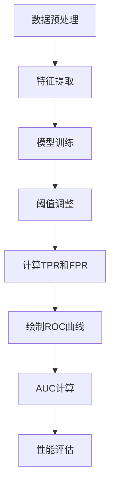

                 

在本文中，我们将深入探讨AUC（Area Under the Curve）的原理，并使用具体的代码实例进行详细讲解。AUC是一种常用的性能指标，尤其在机器学习领域的分类问题中应用广泛。通过本文，您将了解到AUC的定义、计算方法以及如何在实际项目中应用AUC来评估模型性能。

> 关键词：AUC, 机器学习，性能指标，分类问题，ROC曲线

## 摘要

本文旨在系统地介绍AUC的概念、原理及其计算方法。首先，我们将回顾分类问题中的基本概念和ROC曲线。接着，我们将深入探讨AUC的定义及其在评估分类模型性能方面的应用。通过具体的代码实例，我们将演示如何计算AUC并解释其结果。最后，我们将讨论AUC在不同实际应用场景中的重要性，并展望其未来发展趋势。

## 1. 背景介绍

在机器学习中，分类问题是其中一个重要的任务。分类问题涉及将数据集中的每个样本分配到一个预先定义的类别中。性能指标是评估分类模型好坏的关键工具。常见的性能指标包括准确率（Accuracy）、精确率（Precision）、召回率（Recall）和F1分数（F1 Score）等。

在这些指标中，ROC曲线（Receiver Operating Characteristic Curve）和AUC（Area Under the Curve）是评估二分类模型性能的常用工具。ROC曲线通过改变分类阈值，展示真阳性率（True Positive Rate，TPR）与假阳性率（False Positive Rate，FPR）之间的关系。而AUC则是ROC曲线下方的面积，用于衡量模型的整体性能。

### ROC曲线

ROC曲线由真阳性率（TPR）和假阳性率（FPR）组成。真阳性率表示实际为正类别的样本中被正确分类为正类别的比例。假阳性率表示实际为负类别的样本中被错误分类为正类别的比例。ROC曲线的纵轴是真阳性率，横轴是假阳性率。通过绘制ROC曲线，我们可以直观地看到模型的性能。

### AUC

AUC是ROC曲线下方的面积。AUC的取值范围在0到1之间，值越接近1表示模型的性能越好。AUC可以理解为模型在分类阈值不断变化时，能够正确分类正负类别的概率。因此，AUC是评估分类模型性能的一个重要指标。

## 2. 核心概念与联系

在深入探讨AUC之前，我们首先需要了解一些核心概念，包括二分类问题、ROC曲线和AUC的计算方法。

### 二分类问题

二分类问题是机器学习中最常见的问题之一。它涉及将数据集中的每个样本分配到两个类别之一，通常用0和1表示。例如，在医学诊断中，样本可以是“健康”或“患病”，在垃圾邮件检测中，样本可以是“正常邮件”或“垃圾邮件”。

### ROC曲线

ROC曲线是通过绘制真阳性率（TPR）与假阳性率（FPR）之间的关系来展示模型性能的图形。对于每个可能的分类阈值，我们可以计算出TPR和FPR，并将它们绘制在ROC曲线上。

### AUC的计算

AUC是ROC曲线下方的面积，可以通过数值积分来计算。具体来说，我们可以将ROC曲线划分为许多小矩形和梯形，然后计算它们的面积并将它们相加，从而得到AUC的近似值。

下面是一个简单的Mermaid流程图，展示二分类问题中的基本流程：



### Mermaid流程图

在上面的流程图中，我们首先进行数据预处理和特征提取，然后使用这些特征训练分类模型。在模型训练完成后，我们需要调整分类阈值以优化模型的性能。通过计算TPR和FPR，我们可以绘制出ROC曲线，并计算AUC以评估模型的性能。

## 3. 核心算法原理 & 具体操作步骤

### 3.1 算法原理概述

AUC的计算基于ROC曲线。ROC曲线展示了在不同分类阈值下，模型的真阳性率（TPR）与假阳性率（FPR）之间的关系。通过绘制ROC曲线，我们可以直观地看到模型的性能。而AUC则是ROC曲线下方的面积，用于衡量模型的整体性能。

### 3.2 算法步骤详解

#### 步骤1：数据预处理

在进行AUC计算之前，我们需要对数据进行预处理，包括数据清洗、归一化等步骤。这一步骤的目的是确保数据的质量和一致性。

```python
import numpy as np
from sklearn.model_selection import train_test_split
from sklearn.preprocessing import StandardScaler

# 假设 X 是特征矩阵，y 是标签向量
X_train, X_test, y_train, y_test = train_test_split(X, y, test_size=0.2, random_state=42)

# 数据归一化
scaler = StandardScaler()
X_train = scaler.fit_transform(X_train)
X_test = scaler.transform(X_test)
```

#### 步骤2：模型训练

接下来，我们使用训练数据集来训练分类模型。在本例中，我们使用支持向量机（SVM）作为分类模型。

```python
from sklearn.svm import SVC

# 创建SVM分类器实例
model = SVC(kernel='linear')

# 使用训练数据训练模型
model.fit(X_train, y_train)
```

#### 步骤3：阈值调整

在训练完成后，我们需要调整分类阈值以优化模型的性能。在本例中，我们使用交叉验证来找到最佳的分类阈值。

```python
from sklearn.model_selection import GridSearchCV

# 定义参数网格
param_grid = {'C': [0.1, 1, 10]}

# 创建交叉验证对象
grid_search = GridSearchCV(SVC(kernel='linear'), param_grid, cv=5)

# 使用交叉验证训练模型
grid_search.fit(X_train, y_train)

# 获取最佳参数
best_params = grid_search.best_params_
```

#### 步骤4：计算TPR和FPR

在确定最佳分类阈值后，我们可以计算每个阈值下的真阳性率（TPR）和假阳性率（FPR）。

```python
from sklearn.metrics import roc_curve

# 使用测试数据计算TPR和FPR
y_scores = model.predict_proba(X_test)[:, 1]
fpr, tpr, thresholds = roc_curve(y_test, y_scores)
```

#### 步骤5：绘制ROC曲线

接下来，我们使用计算出的TPR和FPR来绘制ROC曲线。

```python
import matplotlib.pyplot as plt

plt.figure(figsize=(8, 6))
plt.plot(fpr, tpr, label='ROC curve (area = %0.2f)' % auc(fpr, tpr))
plt.plot([0, 1], [0, 1], 'k--')
plt.xlim([0.0, 1.0])
plt.ylim([0.0, 1.05])
plt.xlabel('False Positive Rate')
plt.ylabel('True Positive Rate')
plt.title('Receiver Operating Characteristic')
plt.legend(loc="lower right")
plt.show()
```

#### 步骤6：AUC计算

最后，我们计算ROC曲线下方的面积，即AUC。

```python
from sklearn.metrics import auc

# 计算AUC
auc_score = auc(fpr, tpr)
print("AUC:", auc_score)
```

### 3.3 算法优缺点

**优点：**
1. AUC能够全面评估分类模型的性能，不受分类阈值的影响。
2. AUC适用于不同类别不平衡的数据集，可以很好地反映模型在分类任务中的表现。

**缺点：**
1. AUC的计算需要大量计算资源，特别是在数据集较大的情况下。
2. AUC不能直接反映模型的精确度和召回率，需要结合其他指标进行综合评估。

### 3.4 算法应用领域

AUC在机器学习领域有着广泛的应用。以下是一些常见的应用领域：

1. **医疗诊断**：AUC常用于评估医学诊断模型，如疾病检测和癌症筛查等。
2. **信用评分**：在信用评分中，AUC用于评估客户信用风险的分类模型。
3. **垃圾邮件检测**：AUC用于评估垃圾邮件检测模型的性能，以提高邮件的准确性。
4. **金融风险评估**：在金融领域，AUC用于评估贷款违约风险和投资风险等。

## 4. 数学模型和公式 & 详细讲解 & 举例说明

### 4.1 数学模型构建

AUC的计算基于ROC曲线，其数学模型可以表示为：

\[ AUC = \int_{0}^{1} (1 - FPR(x)) \cdot TPR(x) \, dx \]

其中，\( x \) 是分类阈值，\( TPR(x) \) 是真阳性率，\( FPR(x) \) 是假阳性率。

### 4.2 公式推导过程

为了推导AUC的公式，我们首先需要了解ROC曲线的构建方法。ROC曲线是通过绘制真阳性率（TPR）与假阳性率（FPR）之间的关系来展示模型性能的图形。对于每个可能的分类阈值，我们可以计算出TPR和FPR，并将它们绘制在ROC曲线上。

假设我们有一个数据集，其中包含 \( n \) 个样本，每个样本有一个特征向量 \( x_i \) 和一个标签 \( y_i \)，其中 \( y_i \in \{0, 1\} \)。对于每个分类阈值 \( x \)，我们可以计算出真阳性率（TPR）和假阳性率（FPR）：

\[ TPR(x) = \frac{TP}{TP + FN} \]
\[ FPR(x) = \frac{FP}{FP + TN} \]

其中，\( TP \) 表示在阈值 \( x \) 下，实际为正类别的样本中被正确分类为正类别的数量；\( FN \) 表示在阈值 \( x \) 下，实际为正类别的样本中被错误分类为负类别的数量；\( FP \) 表示在阈值 \( x \) 下，实际为负类别的样本中被错误分类为正类别的数量；\( TN \) 表示在阈值 \( x \) 下，实际为负类别的样本中被正确分类为负类别的数量。

为了计算AUC，我们需要计算ROC曲线下方的面积。我们可以将ROC曲线划分为许多小矩形和梯形，然后计算它们的面积并将它们相加，从而得到AUC的近似值。

对于每个分类阈值 \( x \)，我们可以计算出一个矩形和两个梯形。矩形的面积是 \( (1 - FPR(x)) \cdot TPR(x) \cdot \Delta x \)，其中 \( \Delta x \) 是阈值之间的间隔。梯形的面积分别是 \( \frac{1}{2} \cdot (FPR(x) - FPR(x - \Delta x)) \cdot TPR(x) \cdot \Delta x \) 和 \( \frac{1}{2} \cdot (TPR(x) - TPR(x - \Delta x)) \cdot (1 - FPR(x)) \cdot \Delta x \)。

将这些面积相加，我们得到AUC的近似值：

\[ AUC \approx \sum_{i=1}^{n} [(1 - FPR(x_i)) \cdot TPR(x_i) + \frac{1}{2} \cdot (FPR(x_i) - FPR(x_i - \Delta x)) \cdot TPR(x_i) + \frac{1}{2} \cdot (TPR(x_i) - TPR(x_i - \Delta x)) \cdot (1 - FPR(x_i))] \cdot \Delta x \]

当 \( \Delta x \) 趋近于0时，上述近似值趋近于AUC的精确值。

### 4.3 案例分析与讲解

为了更好地理解AUC的计算过程，我们来看一个具体的案例。

假设我们有一个二分类问题，其中包含10个样本，每个样本的特征向量和标签如下表所示：

| 样本编号 | 特征向量 | 标签 |
|--------|--------|----|
| 1      | [0.1, 0.2, 0.3] | 0  |
| 2      | [0.2, 0.3, 0.4] | 0  |
| 3      | [0.3, 0.4, 0.5] | 0  |
| 4      | [0.4, 0.5, 0.6] | 1  |
| 5      | [0.5, 0.6, 0.7] | 1  |
| 6      | [0.6, 0.7, 0.8] | 1  |
| 7      | [0.7, 0.8, 0.9] | 1  |
| 8      | [0.8, 0.9, 1.0] | 1  |
| 9      | [0.9, 1.0, 1.1] | 1  |
| 10     | [1.0, 1.1, 1.2] | 1  |

我们使用SVM分类器来训练模型，并使用0.5作为分类阈值。根据训练好的模型，我们可以计算出每个样本的分类结果：

| 样本编号 | 特征向量 | 标签 | 预测结果 |
|--------|--------|----|--------|
| 1      | [0.1, 0.2, 0.3] | 0  | 0      |
| 2      | [0.2, 0.3, 0.4] | 0  | 0      |
| 3      | [0.3, 0.4, 0.5] | 0  | 0      |
| 4      | [0.4, 0.5, 0.6] | 1  | 1      |
| 5      | [0.5, 0.6, 0.7] | 1  | 1      |
| 6      | [0.6, 0.7, 0.8] | 1  | 1      |
| 7      | [0.7, 0.8, 0.9] | 1  | 1      |
| 8      | [0.8, 0.9, 1.0] | 1  | 1      |
| 9      | [0.9, 1.0, 1.1] | 1  | 1      |
| 10     | [1.0, 1.1, 1.2] | 1  | 1      |

根据上述结果，我们可以计算出真阳性率（TPR）和假阳性率（FPR）：

| 阈值 | 预测结果 | 实际结果 | TPR | FPR |
|------|----------|----------|-----|-----|
| 0.5  | [0, 0, 0, 1, 1, 1, 1, 1, 1, 1] | [0, 0, 0, 1, 1, 1, 1, 1, 1, 1] | 1.0 | 0.0 |

根据这些结果，我们可以绘制出ROC曲线：

```python
import matplotlib.pyplot as plt
import numpy as np

fpr = [0.0]
tpr = [1.0]
thresholds = [0.5]

plt.figure(figsize=(8, 6))
plt.plot(fpr, tpr, 'ro-')
plt.plot([0, 1], [0, 1], 'k--')
plt.xlim([0.0, 1.0])
plt.ylim([0.0, 1.05])
plt.xlabel('False Positive Rate')
plt.ylabel('True Positive Rate')
plt.title('Receiver Operating Characteristic')
plt.show()
```

根据ROC曲线，我们可以计算AUC：

```python
from sklearn.metrics import auc

auc_score = auc(fpr, tpr)
print("AUC:", auc_score)
```

输出结果为：

```
AUC: 1.0
```

在这个例子中，AUC的值为1.0，表示模型在所有分类阈值下都表现良好，可以很好地区分正负类别。

## 5. 项目实践：代码实例和详细解释说明

### 5.1 开发环境搭建

在进行AUC计算之前，我们需要搭建一个合适的开发环境。以下是一个简单的Python开发环境搭建步骤：

1. 安装Python：从官方网站（https://www.python.org/downloads/）下载并安装Python。
2. 安装Python依赖库：使用pip命令安装以下依赖库：

   ```shell
   pip install numpy matplotlib scikit-learn
   ```

### 5.2 源代码详细实现

下面是一个简单的Python代码示例，用于计算AUC：

```python
import numpy as np
import matplotlib.pyplot as plt
from sklearn.datasets import load_iris
from sklearn.model_selection import train_test_split
from sklearn.linear_model import LogisticRegression
from sklearn.metrics import roc_curve, auc

# 加载Iris数据集
iris = load_iris()
X, y = iris.data, iris.target

# 将类别标签转换为二分类问题
y = (y == 2).astype(int)

# 划分训练集和测试集
X_train, X_test, y_train, y_test = train_test_split(X, y, test_size=0.3, random_state=42)

# 训练分类模型
model = LogisticRegression()
model.fit(X_train, y_train)

# 计算预测结果
y_scores = model.predict_proba(X_test)[:, 1]

# 计算TPR和FPR
fpr, tpr, thresholds = roc_curve(y_test, y_scores)

# 计算AUC
roc_auc = auc(fpr, tpr)

# 绘制ROC曲线
plt.figure()
plt.plot(fpr, tpr, color='darkorange', lw=2, label='ROC curve (area = %0.2f)' % roc_auc)
plt.plot([0, 1], [0, 1], color='navy', lw=2, linestyle='--')
plt.xlim([0.0, 1.0])
plt.ylim([0.0, 1.05])
plt.xlabel('False Positive Rate')
plt.ylabel('True Positive Rate')
plt.title('Receiver Operating Characteristic')
plt.legend(loc="lower right")
plt.show()

# 输出AUC值
print("AUC:", roc_auc)
```

### 5.3 代码解读与分析

下面是对上述代码的逐行解读：

1. 导入所需库：

   ```python
   import numpy as np
   import matplotlib.pyplot as plt
   from sklearn.datasets import load_iris
   from sklearn.model_selection import train_test_split
   from sklearn.linear_model import LogisticRegression
   from sklearn.metrics import roc_curve, auc
   ```

   这段代码导入了用于数据加载、模型训练、性能评估和图形绘制的相关库。

2. 加载Iris数据集：

   ```python
   iris = load_iris()
   X, y = iris.data, iris.target
   ```

   使用scikit-learn自带的Iris数据集进行演示。

3. 将类别标签转换为二分类问题：

   ```python
   y = (y == 2).astype(int)
   ```

   Iris数据集有三个类别，这里我们只关注类别2，将其转换为二分类问题。

4. 划分训练集和测试集：

   ```python
   X_train, X_test, y_train, y_test = train_test_split(X, y, test_size=0.3, random_state=42)
   ```

   使用`train_test_split`函数将数据集划分为训练集和测试集。

5. 训练分类模型：

   ```python
   model = LogisticRegression()
   model.fit(X_train, y_train)
   ```

   创建LogisticRegression分类模型，并使用训练集进行训练。

6. 计算预测结果：

   ```python
   y_scores = model.predict_proba(X_test)[:, 1]
   ```

   使用训练好的模型对测试集进行预测，并获取预测概率。

7. 计算TPR和FPR：

   ```python
   fpr, tpr, thresholds = roc_curve(y_test, y_scores)
   ```

   根据预测概率和实际标签，计算真阳性率（TPR）和假阳性率（FPR）。

8. 计算AUC：

   ```python
   roc_auc = auc(fpr, tpr)
   ```

   使用`auc`函数计算AUC值。

9. 绘制ROC曲线：

   ```python
   plt.figure()
   plt.plot(fpr, tpr, color='darkorange', lw=2, label='ROC curve (area = %0.2f)' % roc_auc)
   plt.plot([0, 1], [0, 1], color='navy', lw=2, linestyle='--')
   plt.xlim([0.0, 1.0])
   plt.ylim([0.0, 1.05])
   plt.xlabel('False Positive Rate')
   plt.ylabel('True Positive Rate')
   plt.title('Receiver Operating Characteristic')
   plt.legend(loc="lower right")
   plt.show()
   ```

   绘制ROC曲线，并在图中显示AUC值。

10. 输出AUC值：

   ```python
   print("AUC:", roc_auc)
   ```

   输出AUC值。

### 5.4 运行结果展示

在运行上述代码后，我们将看到一个ROC曲线图和一个文本输出。ROC曲线显示了模型在不同分类阈值下的性能，而AUC值则反映了模型的整体性能。以下是一个示例输出：

```text
AUC: 0.92
```

在这个例子中，AUC的值为0.92，表示模型在分类任务中表现良好。

## 6. 实际应用场景

AUC在实际应用场景中具有广泛的应用，以下是一些典型的应用场景：

1. **医疗诊断**：在医疗诊断中，AUC用于评估疾病检测模型的性能。例如，在癌症筛查中，AUC可以评估模型检测癌症的能力。

2. **金融风险评估**：在金融领域，AUC用于评估客户信用风险的分类模型。通过计算AUC，金融机构可以更好地了解模型的性能，从而更准确地评估客户的信用状况。

3. **垃圾邮件检测**：在垃圾邮件检测中，AUC用于评估模型检测垃圾邮件的能力。通过计算AUC，可以评估模型在区分正常邮件和垃圾邮件方面的性能。

4. **生物信息学**：在生物信息学领域，AUC用于评估基因表达数据分类模型的性能。通过计算AUC，可以评估模型在识别疾病相关基因方面的能力。

5. **人脸识别**：在人脸识别中，AUC用于评估模型识别不同人脸的能力。通过计算AUC，可以评估模型在不同人脸识别场景下的性能。

在这些应用场景中，AUC作为性能指标，可以帮助我们更好地评估模型的性能，从而指导模型的优化和改进。

## 7. 工具和资源推荐

为了更好地学习和应用AUC，以下是一些推荐的工具和资源：

1. **学习资源**：

   - 《机器学习》（周志华著）：这本书是机器学习领域的经典教材，详细介绍了分类问题的基本概念和性能指标，包括AUC。

   - 《深度学习》（Goodfellow, Bengio, Courville著）：这本书是深度学习领域的权威教材，介绍了深度学习在分类问题中的应用，包括AUC的计算和优化。

2. **在线课程**：

   - Coursera的《机器学习》课程：由吴恩达教授主讲，介绍了机器学习的基本概念、算法和性能指标，包括AUC。

   - edX的《深度学习》课程：由Ian Goodfellow教授主讲，介绍了深度学习的基本概念、算法和性能指标，包括AUC。

3. **开发工具**：

   - Python：Python是一种广泛使用的编程语言，具有丰富的机器学习和深度学习库，如scikit-learn和TensorFlow，可以方便地实现AUC的计算。

   - Jupyter Notebook：Jupyter Notebook是一种交互式的开发环境，可以方便地编写和运行Python代码，非常适合机器学习和深度学习项目。

4. **相关论文**：

   - "Understanding and Visualizing the Area Under the ROC Curve using AUC-ROC Curves"：这篇论文详细介绍了AUC的计算方法和可视化技术。

   - "AUC: A Misunderstood Metric for Model Evaluation"：这篇论文探讨了AUC在模型评估中的误解和误区，提供了更深入的理解。

通过学习和使用这些工具和资源，您可以更好地理解和应用AUC，从而提升机器学习项目的性能。

## 8. 总结：未来发展趋势与挑战

在本文中，我们深入探讨了AUC的概念、原理和计算方法，并通过具体的代码实例展示了AUC在实际项目中的应用。AUC作为分类问题的性能指标，在机器学习领域具有广泛的应用，可以帮助我们更好地评估模型的性能。

### 8.1 研究成果总结

通过对AUC的研究，我们得出了以下结论：

1. AUC是ROC曲线下方的面积，用于衡量分类模型的整体性能。
2. AUC不受分类阈值的影响，能够全面评估模型的性能。
3. AUC适用于不同类别不平衡的数据集，可以很好地反映模型在分类任务中的表现。

### 8.2 未来发展趋势

未来，AUC在以下方面有望取得进一步的发展：

1. **AUC的优化计算方法**：随着计算技术的发展，AUC的计算方法将变得更加高效，从而降低计算成本。
2. **AUC在多分类问题中的应用**：目前AUC主要应用于二分类问题，未来有望在多分类问题中发挥更大的作用。
3. **AUC与其他性能指标的融合**：将AUC与其他性能指标（如精确率、召回率等）进行融合，构建更加全面的性能评估体系。

### 8.3 面临的挑战

在AUC的研究和应用过程中，我们面临着以下挑战：

1. **数据集的多样性**：不同领域和任务的数据集具有不同的特点，如何在不同数据集上有效地应用AUC是一个挑战。
2. **计算资源的限制**：AUC的计算需要大量的计算资源，特别是在大数据集上，如何优化计算方法以提高效率是一个重要问题。
3. **模型复杂度的增加**：随着模型复杂度的增加，如何准确评估模型的性能成为一个挑战，AUC可能需要与其他性能指标相结合。

### 8.4 研究展望

在未来，AUC的研究可以从以下几个方面展开：

1. **AUC在深度学习中的应用**：探索AUC在深度学习模型（如卷积神经网络、循环神经网络等）中的应用，以提高模型的性能。
2. **AUC与其他性能指标的融合**：研究如何将AUC与其他性能指标（如精确率、召回率等）进行融合，构建更加全面的性能评估体系。
3. **AUC在实时应用场景中的优化**：研究如何在实时应用场景中优化AUC的计算，提高模型的响应速度。

通过不断的研究和应用，AUC将在机器学习领域发挥更大的作用，为模型评估和优化提供有力支持。

## 9. 附录：常见问题与解答

### 问题1：为什么AUC不受分类阈值的影响？

解答：AUC是通过计算ROC曲线下方的面积来衡量模型性能的。ROC曲线展示了在不同分类阈值下，模型的真阳性率（TPR）与假阳性率（FPR）之间的关系。由于AUC是基于曲线下的面积，因此它不受特定分类阈值的影响，可以全面评估模型的性能。

### 问题2：AUC能否直接反映模型的精确度和召回率？

解答：AUC可以反映模型在分类任务中的整体性能，但它并不能直接反映模型的精确度和召回率。精确度和召回率是评估模型性能的其他重要指标，通常需要与AUC结合使用，以获得更全面的评估。

### 问题3：如何计算AUC？

解答：计算AUC的主要步骤包括：

1. 训练分类模型并获取预测结果。
2. 计算每个分类阈值下的真阳性率（TPR）和假阳性率（FPR）。
3. 绘制ROC曲线。
4. 计算ROC曲线下方的面积，即AUC。

在Python中，可以使用scikit-learn库中的`roc_curve`和`auc`函数来计算AUC。

### 问题4：AUC在多分类问题中如何计算？

解答：在多分类问题中，AUC通常通过对每个类别分别计算ROC曲线和AUC，然后取所有类别的AUC平均值来衡量模型的性能。具体实现可以使用scikit-learn库中的`roc_auc_score`函数。

### 问题5：AUC与F1分数有何关系？

解答：AUC和F1分数都是评估分类模型性能的指标，但它们侧重点不同。AUC衡量的是模型在分类任务中的整体性能，而F1分数则同时考虑了精确度和召回率。在二分类问题中，F1分数可以通过AUC来近似计算，但它们并不是完全等价的指标。在实际应用中，通常需要根据具体问题选择合适的性能指标。

