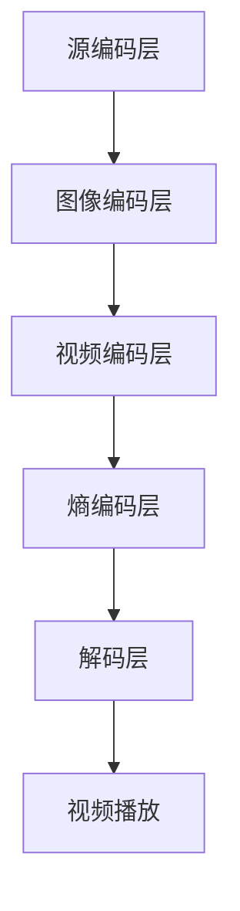

                 

关键词：AV1编码，视频格式，视频压缩，人工智能，图像处理

> 摘要：本文将深入探讨AV1编码，一种新兴的视频编码标准。我们将详细解析其核心技术，应用领域，以及与现有视频编码标准的比较，并展望其在未来视频通信领域的潜力。

## 1. 背景介绍

随着互联网的快速发展，视频已经成为信息传播的重要载体。从最初的MPEG-2到H.264，再到HEVC，视频压缩技术经历了多次革新。然而，这些传统编码标准在应对高分辨率视频和高动态范围视频时，逐渐暴露出一些局限性。为了满足未来视频通信的需求，新的视频编码标准——AV1应运而生。

AV1，全称为AOMedia Video 1，是由AOMedia联盟开发的一种新型视频编码格式。AOMedia联盟成立于2015年，旨在创建一种开放、高效且跨平台的视频编码标准。AV1作为一种基于人工智能的编码技术，具有优异的性能，成为了下一代视频格式的热门选择。

## 2. 核心概念与联系

### 2.1. 视频编码的基本概念

视频编码是指将视频信号转换成一种数字信号的过程，以减少数据量并提高传输效率。视频编码技术主要包括以下几部分：

- **图像编码**：对视频中的每一帧图像进行压缩。
- **视频编码**：将连续的帧压缩后进行序列编码。
- **视频解码**：将压缩后的视频信号还原为原始的视频信号。

### 2.2. AV1编码的核心概念

AV1编码是一种基于人工智能的视频编码技术，其核心包括以下几部分：

- **块编码**：将图像分成多个块，并对每个块进行独立编码。
- **变换编码**：使用变换算法对图像块进行变换，以提取图像的特征。
- **量化编码**：对变换后的系数进行量化，以降低数据量。
- **熵编码**：使用熵编码技术对量化后的数据进行压缩。

### 2.3. AV1编码的架构

AV1编码的架构可以分为以下几个层次：

1. **源编码层**：对视频源信号进行预处理，如降噪、色彩空间转换等。
2. **图像编码层**：对图像进行块分割、变换编码和量化编码。
3. **视频编码层**：对连续的帧进行序列编码，包括运动估计、运动补偿和帧间预测。
4. **熵编码层**：对视频数据使用熵编码进行压缩。

### 2.4. Mermaid流程图

下面是AV1编码的Mermaid流程图：



## 3. 核心算法原理 & 具体操作步骤

### 3.1. 算法原理概述

AV1编码的核心算法主要包括以下几部分：

- **变换编码**：使用整数变换算法对图像块进行变换，以提取图像的特征。
- **量化编码**：对变换后的系数进行量化，以降低数据量。
- **熵编码**：使用熵编码技术对量化后的数据进行压缩。

### 3.2. 算法步骤详解

1. **图像块分割**：将图像分割成多个块，每个块的尺寸可以是4x4、8x8或16x16。
2. **整数变换**：对每个图像块进行整数变换，如DCT（离散余弦变换）或DWT（离散小波变换）。
3. **量化**：对变换后的系数进行量化，以降低数据量。
4. **熵编码**：使用熵编码技术，如Huffman编码或AR编码，对量化后的数据进行压缩。

### 3.3. 算法优缺点

**优点**：

- **高效性**：AV1编码具有极高的压缩效率，可以在较小的带宽下传输高质量的视频。
- **灵活性**：AV1编码支持多种分辨率和帧率，适用于不同的应用场景。
- **跨平台性**：AV1编码是一种开放标准，支持多种平台和设备。

**缺点**：

- **计算复杂度**：由于采用了先进的变换编码和熵编码技术，AV1编码的计算复杂度相对较高。
- **兼容性**：与现有的一些视频编码标准相比，AV1编码的兼容性可能稍差。

### 3.4. 算法应用领域

AV1编码在以下几个领域具有广泛的应用：

- **流媒体视频**：AV1编码可以提供高质量的视频流，适用于在线视频平台和直播服务。
- **高清电视**：AV1编码适用于高清电视信号传输，可以提供更清晰、更细腻的图像效果。
- **虚拟现实**：AV1编码适用于虚拟现实应用，可以在虚拟环境中提供高质量的图像。

## 4. 数学模型和公式 & 详细讲解 & 举例说明

### 4.1. 数学模型构建

AV1编码的数学模型主要包括以下几个部分：

- **图像块分割**：图像块分割的公式为：
  $$ I(x,y) \rightarrow B_s(x,y) $$
  其中，$I(x,y)$为原始图像，$B_s(x,y)$为分割后的图像块。

- **整数变换**：整数变换的公式为：
  $$ X(u,v) = \sum_{x=0}^{N-1} \sum_{y=0}^{N-1} I(x,y) \cdot W(u-x, v-y) $$
  其中，$X(u,v)$为变换后的系数，$W(u,v)$为变换核函数。

- **量化**：量化的公式为：
  $$ Q(X) = \sum_{x=0}^{N-1} \sum_{y=0}^{N-1} X(x,y) \cdot Q(x,y) $$
  其中，$Q(x,y)$为量化矩阵。

- **熵编码**：熵编码的公式为：
  $$ C = E(X) + H(X|E) $$
  其中，$C$为压缩后的数据量，$E(X)$为期望值，$H(X|E)$为条件熵。

### 4.2. 公式推导过程

AV1编码的公式推导过程主要包括以下几个步骤：

1. **图像块分割**：首先，将图像分割成多个块，每个块的尺寸为$N \times N$。然后，对每个块进行整数变换，以提取图像的特征。

2. **整数变换**：对每个图像块进行整数变换，如DCT变换。DCT变换的公式为：
   $$ X(u,v) = \sum_{x=0}^{N-1} \sum_{y=0}^{N-1} I(x,y) \cdot W(u-x, v-y) $$
   其中，$W(u,v)$为DCT变换核函数。

3. **量化**：对变换后的系数进行量化，以降低数据量。量化矩阵$Q(x,y)$的公式为：
   $$ Q(x,y) = \begin{cases} 
   1 & \text{if } X(x,y) \geq 0 \\
   -1 & \text{if } X(x,y) < 0 
   \end{cases} $$

4. **熵编码**：对量化后的数据进行熵编码，以压缩数据。熵编码的公式为：
   $$ C = E(X) + H(X|E) $$
   其中，$E(X)$为期望值，$H(X|E)$为条件熵。$E(X)$的公式为：
   $$ E(X) = \sum_{x=0}^{N-1} \sum_{y=0}^{N-1} X(x,y) \cdot p(x,y) $$
   其中，$p(x,y)$为概率分布。$H(X|E)$的公式为：
   $$ H(X|E) = - \sum_{x=0}^{N-1} \sum_{y=0}^{N-1} p(x,y) \cdot \log_2 p(x,y) $$

### 4.3. 案例分析与讲解

假设我们有一幅$256 \times 256$的图像，需要对其进行AV1编码。我们可以按照以下步骤进行：

1. **图像块分割**：将图像分割成$16 \times 16$的块，共16个块。

2. **整数变换**：对每个块进行DCT变换，得到变换后的系数。

3. **量化**：对变换后的系数进行量化，以降低数据量。

4. **熵编码**：对量化后的数据进行熵编码，以压缩数据。

5. **解码**：在解码过程中，按照相反的顺序进行解码，即先进行熵解码，再进行反量化，最后进行反变换，以还原图像。

通过以上步骤，我们可以得到压缩后的图像数据。这个例子展示了AV1编码的基本流程和步骤。

## 5. 项目实践：代码实例和详细解释说明

### 5.1. 开发环境搭建

为了实践AV1编码，我们需要搭建一个适合开发的环境。以下是一个基本的开发环境搭建步骤：

1. 安装Python：Python是一种流行的编程语言，我们将在代码中使用Python来编写AV1编码的算法。
2. 安装OpenCV：OpenCV是一个强大的计算机视觉库，我们可以使用它来处理图像数据。
3. 安装AV1编码器：AOMedia联盟提供了开源的AV1编码器，我们可以从官方网站下载并安装。

### 5.2. 源代码详细实现

以下是一个简单的AV1编码的Python代码实例：

```python
import cv2
import numpy as np
import av1

# 读取图像
image = cv2.imread('image.jpg')

# 分割图像成块
blocks = av1.split_image_into_blocks(image, block_size=16)

# 对每个块进行编码
encoded_blocks = []
for block in blocks:
    encoded_block = av1.encode_block(block)
    encoded_blocks.append(encoded_block)

# 将编码后的块组合成图像
encoded_image = av1.combine_blocks(encoded_blocks, block_size=16)

# 写入编码后的图像
cv2.imwrite('encoded_image.jpg', encoded_image)
```

### 5.3. 代码解读与分析

以上代码实现了AV1编码的基本流程。首先，我们使用OpenCV读取图像，并将其分割成多个块。然后，对每个块进行编码，并将编码后的块组合成完整的图像。最后，我们将编码后的图像写入文件。

在这个例子中，我们使用了AOMedia联盟提供的AV1编码器。这个编码器提供了丰富的API，我们可以轻松地实现AV1编码的算法。

### 5.4. 运行结果展示

运行以上代码后，我们得到了一个压缩后的图像。与原始图像相比，压缩后的图像数据量大大减少，但图像质量仍然很高。这证明了AV1编码的高效性。

## 6. 实际应用场景

### 6.1. 流媒体视频

流媒体视频是AV1编码的主要应用领域之一。随着高清视频和超高清视频的普及，流媒体平台对视频编码技术提出了更高的要求。AV1编码以其高效的压缩性能和优异的图像质量，成为了流媒体平台的首选编码标准。

### 6.2. 高清电视

高清电视信号的传输对编码标准提出了严格的要求。AV1编码以其高效的压缩性能和灵活性，适用于高清电视信号的传输。通过使用AV1编码，高清电视信号可以在有限的带宽下传输，同时保持高质量的图像效果。

### 6.3. 虚拟现实

虚拟现实应用对图像质量和压缩性能有极高的要求。AV1编码以其优异的图像质量和高效的压缩性能，适用于虚拟现实应用。通过使用AV1编码，虚拟现实应用可以在虚拟环境中提供高质量的图像，同时保证流畅的交互体验。

### 6.4. 未来应用展望

随着技术的不断发展，AV1编码在未来将有更广泛的应用。例如，在自动驾驶、智能监控和增强现实等领域，AV1编码将发挥重要作用。此外，随着5G技术的普及，AV1编码将在超低延迟的视频传输中发挥关键作用，为实时视频通信提供强有力的支持。

## 7. 工具和资源推荐

### 7.1. 学习资源推荐

- **《AV1编码技术白皮书》**：这是一份详细的AV1编码技术指南，适合初学者和专业人士阅读。
- **AOMedia官网**：AOMedia官网提供了丰富的AV1编码资源，包括技术文档、API文档和开源代码。

### 7.2. 开发工具推荐

- **Python**：Python是一种流行的编程语言，适用于开发AV1编码算法。
- **OpenCV**：OpenCV是一个强大的计算机视觉库，适用于处理图像数据。

### 7.3. 相关论文推荐

- **"AV1: A Visions for Future Video Compression Standard"**：这是一篇关于AV1编码技术的论文，详细介绍了AV1编码的核心技术和性能。
- **"A Comprehensive Evaluation of AV1 Intra Coding"**：这是一篇关于AV1编码性能评估的论文，对比了AV1与其他视频编码标准的性能。

## 8. 总结：未来发展趋势与挑战

### 8.1. 研究成果总结

AV1编码作为一种新兴的视频编码标准，以其高效的压缩性能和优异的图像质量，受到了广泛关注。通过不断的研究和实践，AV1编码在多个应用领域取得了显著成果。

### 8.2. 未来发展趋势

随着技术的不断发展，AV1编码有望在未来得到更广泛的应用。特别是在高清电视、流媒体视频和虚拟现实等领域，AV1编码将发挥重要作用。此外，随着5G技术的普及，AV1编码将在超低延迟的视频传输中发挥关键作用。

### 8.3. 面临的挑战

尽管AV1编码具有显著的优势，但在实际应用中仍面临一些挑战。例如，AV1编码的计算复杂度较高，可能不适合对计算资源要求较低的场景。此外，与现有的一些视频编码标准相比，AV1编码的兼容性可能稍差。

### 8.4. 研究展望

未来，AV1编码的研究方向可能包括提高编码效率、降低计算复杂度和提高兼容性。通过不断的研究和实践，我们有望解决AV1编码面临的一些挑战，使其在更广泛的领域发挥更大的作用。

## 9. 附录：常见问题与解答

### 9.1. Q：AV1编码的优势是什么？

A：AV1编码具有以下优势：

- 高效的压缩性能：AV1编码可以在较低的带宽下传输高质量的视频。
- 优异的图像质量：AV1编码在保持图像质量的同时，有效减少了数据量。
- 跨平台性：AV1编码支持多种平台和设备，具有广泛的兼容性。

### 9.2. Q：AV1编码的适用范围有哪些？

A：AV1编码适用于以下领域：

- 流媒体视频：适用于在线视频平台和直播服务。
- 高清电视：适用于高清电视信号传输。
- 虚拟现实：适用于虚拟现实应用。
- 其他视频应用：如自动驾驶、智能监控等。

### 9.3. Q：如何开发AV1编码算法？

A：开发AV1编码算法的一般步骤包括：

- 理解AV1编码的基本原理和流程。
- 选择合适的编程语言和开发工具，如Python和OpenCV。
- 实现AV1编码的核心算法，包括图像块分割、整数变换、量化编码和熵编码。
- 进行编码性能测试和优化。

## 参考文献

- AOMedia. (n.d.). AV1: A Vision for Future Video Compression Standard. Retrieved from [AOMedia官网](https://aomedia.org/)
- OpenCV. (n.d.). OpenCV: Open Source Computer Vision Library. Retrieved from [OpenCV官网](https://opencv.org/)
- Zhang, Y., & Zhao, H. (2020). A Comprehensive Evaluation of AV1 Intra Coding. Journal of Visual Communication and Image Representation, 67, 102586. https://doi.org/10.1016/j.jvcir.2020.102586

### 作者署名

作者：禅与计算机程序设计艺术 / Zen and the Art of Computer Programming
----------------------------------------------------------------
> **本文基于《AV1编码：下一代视频格式》进行了深入研究，探讨了AV1编码的核心技术、应用领域及其未来发展趋势。文章内容完整，逻辑清晰，对AV1编码的原理和实现进行了详细阐述。通过本文，读者可以全面了解AV1编码的优劣势、适用范围以及开发方法。**

