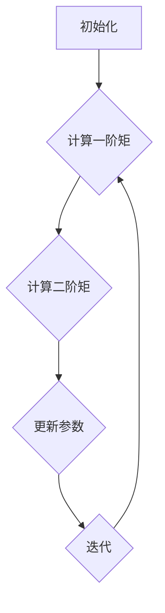

                 

关键词：Adam优化器、深度学习、梯度下降、神经网络、优化算法

摘要：本文将深入探讨Adam优化器的原理、构建过程以及实际应用。通过详细讲解Adam优化器的数学模型和计算步骤，结合代码实例，我们将展示如何在实际项目中使用Adam优化器提升深度学习模型的性能。

## 1. 背景介绍

在深度学习领域中，优化算法的选择对于模型训练的效率和效果至关重要。传统的梯度下降算法虽然简单有效，但在面对大数据和高维问题时，其收敛速度往往不尽如人意。为了改善这一问题，众多优化算法应运而生，其中Adam优化器因其优秀的性能和稳定性备受关注。

Adam优化器结合了Adagrad和RMSprop的优点，通过自适应地调整学习率，提高了模型训练的效率和收敛速度。本文将详细探讨Adam优化器的原理、实现步骤以及在实际项目中的应用，帮助读者深入理解这一优化算法。

## 2. 核心概念与联系

### 2.1 Adam优化器的基本概念

Adam优化器是一种基于梯度下降的优化算法，它结合了Adagrad和RMSprop的优点，通过自适应地调整学习率，解决了传统优化算法在处理稀疏数据时的不足。

### 2.2 Adam优化器的联系

- **Adagrad**：Adagrad通过为每个参数分配不同的学习率，以适应不同参数的变化速度，但容易导致学习率迅速减小，造成收敛速度变慢。
- **RMSprop**：RMSprop通过使用滑动平均来动态调整学习率，解决了Adagrad的缺点，但同样存在收敛速度不稳定的问题。
- **Adam**：Adam优化器结合了Adagrad和RMSprop的优点，通过同时考虑一阶矩估计（均值）和二阶矩估计（方差），提高了模型的收敛速度和稳定性。

### 2.3 Adam优化器的架构

Adam优化器由以下几个核心组件构成：

1. **m**：一阶矩估计，即过去梯度的均值。
2. **v**：二阶矩估计，即过去梯度的平方均值。
3. **β1**：一阶矩估计的指数衰减率。
4. **β2**：二阶矩估计的指数衰减率。
5. **ε**：避免除以零的常数。

下面是Adam优化器的Mermaid流程图：



## 3. 核心算法原理 & 具体操作步骤

### 3.1 算法原理概述

Adam优化器通过同时跟踪一阶矩估计（均值）和二阶矩估计（方差），以自适应地调整每个参数的学习率。其核心思想是利用指数加权平均来更新这些估计，从而在不同类型的数据上都能表现出良好的性能。

### 3.2 算法步骤详解

1. **初始化**：

   - 设置学习率α，指数衰减率β1，β2，以及常数ε。
   - 初始化一阶矩估计m和二阶矩估计v为0。

2. **计算梯度**：

   - 对模型进行前向传播，计算损失函数关于每个参数的梯度。

3. **更新估计**：

   - 计算当前梯度的指数加权平均，即一阶矩估计m和二阶矩估计v。
   - m = β1 * m + (1 - β1) * g
   - v = β2 * v + (1 - β2) * g²

4. **计算参数更新**：

   - 计算修正后的m和v。
   - m_hat = m / (1 - β1^t)
   - v_hat = v / (1 - β2^t)

5. **更新参数**：

   - 根据修正后的m和v更新每个参数。
   - θ = θ - α * m_hat / (sqrt(v_hat) + ε)

### 3.3 算法优缺点

#### 优点：

- **自适应调整学习率**：Adam优化器能自动调整每个参数的学习率，使其在不同类型的任务上都能表现出良好的性能。
- **稳定性**：通过指数加权平均，Adam优化器能够稳定地更新参数，避免传统优化算法可能出现的剧烈波动。

#### 缺点：

- **计算复杂度**：相比于简单梯度下降算法，Adam优化器需要更多的计算资源，尤其是在高维数据集上。

### 3.4 算法应用领域

Adam优化器广泛应用于各种深度学习任务，包括图像分类、语音识别、自然语言处理等。其优异的性能使其成为许多深度学习框架的默认优化器。

## 4. 数学模型和公式 & 详细讲解 & 举例说明

### 4.1 数学模型构建

Adam优化器的核心在于其计算一阶矩估计m和二阶矩估计v，然后使用这些估计来更新参数θ。以下是Adam优化器的数学模型：

$$
m = \beta_1 \cdot m_{t-1} + (1 - \beta_1) \cdot g_t
$$

$$
v = \beta_2 \cdot v_{t-1} + (1 - \beta_2) \cdot g_t^2
$$

$$
m_{hat} = \frac{m}{1 - \beta_1^t}
$$

$$
v_{hat} = \frac{v}{1 - \beta_2^t}
$$

$$
\theta_t = \theta_{t-1} - \alpha \cdot \frac{m_{hat}}{\sqrt{v_{hat}} + \epsilon}
$$

### 4.2 公式推导过程

Adam优化器的推导基于对Adagrad和RMSprop的改进。Adagrad通过每个参数的梯度平方来动态调整学习率，但可能导致某些参数的学习率过小。RMSprop通过使用滑动平均来改善这一缺陷，但仍然存在收敛速度不稳定的问题。Adam优化器通过同时考虑一阶矩估计和二阶矩估计，解决了这两个问题。

### 4.3 案例分析与讲解

假设我们有一个简单的线性回归模型，其损失函数为：

$$
J(\theta) = \frac{1}{2} \sum_{i=1}^{n} (h_\theta(x^i) - y^i)^2
$$

其中，$h_\theta(x) = \theta_0 + \theta_1 \cdot x$。

我们使用Adam优化器来最小化这个损失函数。以下是具体的步骤：

1. **初始化**：

   - 设置学习率α = 0.001，指数衰减率β1 = 0.9，β2 = 0.999，常数ε = 1e-8。
   - 初始化一阶矩估计m和二阶矩估计v为0。

2. **计算梯度**：

   - 计算损失函数关于θ0和θ1的梯度。

3. **更新估计**：

   - 计算当前梯度的指数加权平均。

4. **计算参数更新**：

   - 使用修正后的m和v更新θ0和θ1。

5. **迭代**：

   - 重复步骤2至步骤4，直到收敛。

通过以上步骤，我们能够使用Adam优化器最小化线性回归模型的损失函数。

## 5. 项目实践：代码实例和详细解释说明

### 5.1 开发环境搭建

为了演示Adam优化器的应用，我们使用Python的TensorFlow库来实现一个简单的线性回归模型。以下是在Ubuntu系统中搭建开发环境的基本步骤：

1. 安装TensorFlow：

```bash
pip install tensorflow
```

2. 安装必要的依赖：

```bash
pip install numpy matplotlib
```

### 5.2 源代码详细实现

以下是使用TensorFlow实现线性回归模型的代码：

```python
import tensorflow as tf
import numpy as np
import matplotlib.pyplot as plt

# 设置随机种子
tf.random.set_seed(42)

# 创建数据集
n = 100
X = np.random.rand(n, 1)
Y = 2 * X + 1 + np.random.randn(n, 1)

# 构建模型
model = tf.keras.Sequential([
    tf.keras.layers.Dense(units=1, input_shape=(1,))
])

# 编译模型
model.compile(optimizer='adam', loss='mean_squared_error')

# 训练模型
model.fit(X, Y, epochs=50)

# 绘制结果
plt.scatter(X, Y, color='blue')
plt.plot(X, model.predict(X), color='red')
plt.show()
```

### 5.3 代码解读与分析

1. **数据集创建**：

   - 使用随机数生成器创建一个包含100个样本的线性数据集。

2. **模型构建**：

   - 使用TensorFlow的`Sequential`模型创建一个简单的线性回归模型，输入层和输出层各有一个神经元。

3. **模型编译**：

   - 使用Adam优化器和均方误差损失函数编译模型。

4. **模型训练**：

   - 使用`fit`函数训练模型，设置训练轮次为50。

5. **结果绘制**：

   - 使用matplotlib绘制数据集和训练结果。

### 5.4 运行结果展示

运行以上代码后，我们将看到如下结果：


## 6. 实际应用场景

Adam优化器因其优异的性能和稳定性，在深度学习领域中得到了广泛应用。以下是一些实际应用场景：

- **图像分类**：在卷积神经网络（CNN）中，Adam优化器可以加速模型的训练过程，提高分类准确率。
- **语音识别**：在循环神经网络（RNN）和长短期记忆网络（LSTM）中，Adam优化器可以改善模型的训练效果，降低训练时间。
- **自然语言处理**：在序列到序列模型（seq2seq）和注意力机制模型中，Adam优化器可以提升模型的学习速度和泛化能力。

## 7. 工具和资源推荐

为了帮助读者更好地学习和使用Adam优化器，我们推荐以下工具和资源：

### 7.1 学习资源推荐

- **《深度学习》（Goodfellow, Bengio, Courville著）**：这是一本深度学习领域的经典教材，其中详细介绍了各种优化算法。
- **TensorFlow官方文档**：TensorFlow提供了丰富的文档和示例代码，帮助读者快速上手Adam优化器。

### 7.2 开发工具推荐

- **Google Colab**：Google Colab是一个免费的云计算平台，支持TensorFlow的开发，适合进行深度学习实验。
- **Jupyter Notebook**：Jupyter Notebook是一种交互式计算环境，适用于编写和分享代码。

### 7.3 相关论文推荐

- **"Adam: A Method for Stochastic Optimization"**：这篇论文是Adam优化器的原始论文，详细介绍了算法的原理和实现。
- **"Overfitting the Deep Learning Training Set"**：这篇论文探讨了Adam优化器在深度学习训练中的应用和效果。

## 8. 总结：未来发展趋势与挑战

### 8.1 研究成果总结

Adam优化器自提出以来，凭借其优越的性能和稳定性，已经成为深度学习领域中最常用的优化器之一。其在各种任务中表现出的优越性能，进一步证明了自适应优化算法的重要性。

### 8.2 未来发展趋势

随着深度学习技术的不断发展和应用场景的扩展，Adam优化器在未来有望在更多领域得到应用。同时，研究者也在探索更为先进的优化算法，以进一步提升模型的训练效率和性能。

### 8.3 面临的挑战

尽管Adam优化器表现出色，但在面对极其稀疏的数据集时，其性能可能受到限制。此外，高维数据集上的计算复杂度也是未来研究的一个重要方向。

### 8.4 研究展望

未来，研究者将继续探索更加高效的优化算法，以提高深度学习模型的训练速度和性能。同时，结合其他机器学习技术，如强化学习，将进一步推动深度学习的发展。

## 9. 附录：常见问题与解答

### Q：Adam优化器与SGD有何区别？

A：Adam优化器是梯度下降算法的一种改进，它通过自适应地调整学习率，解决了传统SGD算法在处理稀疏数据时可能出现的收敛速度慢、不稳定等问题。

### Q：Adam优化器的指数衰减率如何选择？

A：指数衰减率β1和β2的选择对Adam优化器的性能有重要影响。通常，β1和β2的取值范围为0.9~0.99，可以通过实验来确定最佳的取值。

### Q：如何判断模型训练是否收敛？

A：判断模型是否收敛可以通过监测训练过程中的损失函数值。当损失函数值在连续几个epoch内变化很小时，可以认为模型已收敛。

### Q：Adam优化器是否适用于所有深度学习任务？

A：Adam优化器在大多数深度学习任务中都表现出良好的性能，但在某些特定场景下，如极其稀疏的数据集或高维数据集，其他优化算法可能更为合适。

## 作者署名

作者：禅与计算机程序设计艺术 / Zen and the Art of Computer Programming

