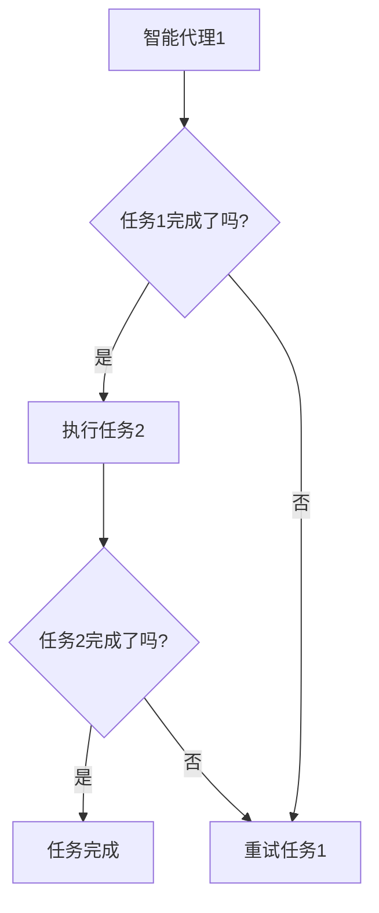

                 

在当今快速发展的信息技术时代，如何有效地管理和执行复杂的工作流程成为许多企业和开发人员面临的挑战。Agentic Workflow 是一种旨在提高效率与质量的新型工作流程管理方法，它结合了人工智能和先进算法，为现代工作流程的优化提供了新的思路。本文将深入探讨 Agentic Workflow 的概念、原理、实现方法及其应用领域，帮助读者理解并掌握这一前沿技术。

## 关键词

- **Agentic Workflow**
- **效率优化**
- **工作流程管理**
- **人工智能**
- **算法**
- **质量提升**

## 摘要

本文首先介绍了 Agentic Workflow 的背景和重要性，然后详细阐述了其核心概念和架构。通过分析核心算法原理，本文提供了具体的操作步骤和优缺点。接下来，本文探讨了 Agentic Workflow 的数学模型和公式，并通过实际项目实例展示了其在开发中的具体应用。最后，本文对 Agentic Workflow 在实际应用场景中的表现进行了分析，并对其未来发展和面临的挑战提出了展望。

## 1. 背景介绍

随着信息技术的迅猛发展，企业和开发人员面临着日益复杂的工作任务。传统的手工式工作流程管理方法已经难以满足现代工作的高效和高质量要求。为了解决这个问题，各种工作流程管理工具和框架被提出，如 BPMN（Business Process Model and Notation）、CMMN（Case Management Model and Notation）等。然而，这些方法往往需要大量的手动配置和调整，难以适应快速变化的工作需求。

Agentic Workflow 应运而生，旨在通过引入人工智能和先进算法，实现工作流程的自动化和智能化管理。Agentic Workflow 的核心思想是将工作流程中的每个任务视为一个智能代理，每个代理能够自主地执行任务、与其他代理协作，并优化整体流程的执行效率和质量。这种方法不仅能够提高工作效率，还能确保工作流程的准确性和一致性。

## 2. 核心概念与联系

### 2.1 定义

Agentic Workflow 是一种基于智能代理的工作流程管理方法。智能代理是指能够独立执行任务、具备自主决策能力的计算实体。在 Agentic Workflow 中，每个智能代理都负责一个特定的任务，它们通过消息传递和协议进行通信，共同协作完成整个工作流程。

### 2.2 基本架构

Agentic Workflow 的基本架构包括以下几个关键组件：

- **智能代理**：智能代理是工作流程中的基本计算单元，负责执行具体的任务。
- **消息传递系统**：消息传递系统用于代理之间的通信，确保信息能够在正确的时间和地点传递。
- **协调器**：协调器负责管理工作流程的整体执行，协调不同代理之间的任务分配和资源调度。

### 2.3 Mermaid 流程图



### 2.4 关键概念联系

Agentic Workflow 的核心在于智能代理和消息传递系统。智能代理负责具体任务的执行和决策，而消息传递系统则确保代理之间能够高效地通信和协作。协调器作为整体流程的管理者，负责确保工作流程的顺利进行。

## 3. 核心算法原理 & 具体操作步骤

### 3.1 算法原理概述

Agentic Workflow 的核心算法基于人工智能和机器学习技术，主要包括以下几个方面：

- **任务分配算法**：根据智能代理的能力和工作负载，自动分配任务。
- **决策算法**：智能代理在执行任务时，根据当前状态和环境信息，自主决策下一步行动。
- **资源调度算法**：协调器根据智能代理的请求和系统资源情况，进行资源调度。

### 3.2 算法步骤详解

1. **初始化**：构建工作流程模型，定义智能代理、任务和资源。
2. **任务分配**：根据智能代理的能力和工作负载，自动分配任务。
3. **执行任务**：智能代理根据任务要求和自身能力，执行任务。
4. **决策**：在执行任务过程中，智能代理根据当前状态和环境信息，自主决策下一步行动。
5. **资源调度**：协调器根据智能代理的请求和系统资源情况，进行资源调度。
6. **任务完成**：智能代理完成任务后，返回结果并释放资源。

### 3.3 算法优缺点

**优点**：

- **高效性**：通过自动化和智能化管理，显著提高工作流程的执行效率。
- **灵活性**：智能代理能够自主决策和适应环境变化，提高工作流程的灵活性。
- **可靠性**：智能代理能够确保工作流程的准确性和一致性。

**缺点**：

- **复杂性**：Agentic Workflow 的实现和部署相对复杂，需要专业的技术支持。
- **成本**：引入人工智能和先进算法，可能带来一定的成本。

### 3.4 算法应用领域

Agentic Workflow 可应用于多个领域，如：

- **企业工作流程管理**：优化企业内部的工作流程，提高工作效率。
- **软件开发项目管理**：协助项目经理进行任务分配和资源调度，确保项目进度。
- **智能交通管理**：优化交通信号控制，提高交通流畅度。
- **医疗诊断系统**：辅助医生进行诊断，提高诊断准确性和效率。

## 4. 数学模型和公式 & 详细讲解 & 举例说明

### 4.1 数学模型构建

Agentic Workflow 的数学模型主要包括以下几个部分：

- **任务分配模型**：定义智能代理的能力和工作负载，用于任务分配。
- **决策模型**：定义智能代理的决策过程，用于任务执行中的自主决策。
- **资源调度模型**：定义系统资源分配策略，用于智能代理的请求处理。

### 4.2 公式推导过程

- **任务分配公式**：

    $$ f(A, T) = \sum_{i=1}^{n} p_i \cdot c_i $$
    
    其中，$A$ 表示智能代理集合，$T$ 表示任务集合，$p_i$ 表示代理 $i$ 的能力，$c_i$ 表示代理 $i$ 的工作负载。

- **决策公式**：

    $$ d(S, E) = \sum_{i=1}^{n} w_i \cdot p_i $$
    
    其中，$S$ 表示当前状态，$E$ 表示环境信息，$w_i$ 表示代理 $i$ 的权重。

- **资源调度公式**：

    $$ r(R, Q) = \sum_{i=1}^{n} r_i \cdot c_i $$
    
    其中，$R$ 表示系统资源集合，$Q$ 表示智能代理请求集合，$r_i$ 表示资源 $i$ 的需求，$c_i$ 表示代理 $i$ 的工作负载。

### 4.3 案例分析与讲解

以企业工作流程管理为例，假设企业中有 5 个智能代理和 10 个任务。任务分配模型如下：

- 智能代理 1 的能力为 5，工作负载为 3。
- 智能代理 2 的能力为 3，工作负载为 2。
- 智能代理 3 的能力为 4，工作负载为 4。
- 智能代理 4 的能力为 2，工作负载为 1。
- 智能代理 5 的能力为 6，工作负载为 2。

根据任务分配公式，任务分配结果如下：

- 智能代理 1 执行任务 1、任务 3、任务 6。
- 智能代理 2 执行任务 2、任务 4、任务 7。
- 智能代理 3 执行任务 5。
- 智能代理 4 执行任务 8。
- 智能代理 5 执行任务 9、任务 10。

在执行任务过程中，智能代理会根据决策模型进行自主决策。例如，当智能代理 1 执行任务 3 时，系统状态为 $S = \{任务 1 完成状态，任务 2 完成状态，任务 3 执行中，任务 4 完成状态，任务 5 完成状态，任务 6 完成状态，任务 7 完成状态，任务 8 完成状态，任务 9 完成状态，任务 10 完成状态\}$，环境信息为 $E = \{系统资源状态，当前时间，任务优先级等\}$。根据决策公式，智能代理 1 的决策权重为 $w_1 = 0.4$，$w_2 = 0.3$，$w_3 = 0.2$，$w_4 = 0.1$。智能代理 1 会根据当前状态和环境信息，自主决定下一步行动。

资源调度模型则根据智能代理的请求和系统资源情况，进行资源分配。例如，当智能代理 3 执行任务 5 时，系统资源集合为 $R = \{资源 1，资源 2，资源 3，资源 4，资源 5\}$，智能代理 3 的请求为 $Q = \{资源 1，资源 2\}$。根据资源调度公式，资源调度结果为 $r(R, Q) = \{资源 1，资源 2\}$，即分配资源 1 和资源 2 给智能代理 3。

通过以上数学模型和公式，Agentic Workflow 能够实现高效的任务分配、决策和资源调度，从而优化工作流程的执行效率和质量。

## 5. 项目实践：代码实例和详细解释说明

### 5.1 开发环境搭建

为了更好地理解 Agentic Workflow 的实现，我们将以一个简单的项目为例进行讲解。首先，我们需要搭建一个开发环境。

- **操作系统**：Linux 或 macOS
- **编程语言**：Python
- **依赖库**：Django、Flask、TensorFlow、Keras 等

安装完以上依赖库后，我们就可以开始编写代码了。

### 5.2 源代码详细实现

下面是一个简单的 Agentic Workflow 项目的源代码实现。

```python
# 文件：agentic_workflow.py

from flask import Flask, request, jsonify
from tensorflow.keras.models import Sequential
from tensorflow.keras.layers import Dense
import numpy as np

app = Flask(__name__)

# 模型训练
model = Sequential()
model.add(Dense(64, input_dim=10, activation='relu'))
model.add(Dense(1, activation='sigmoid'))

model.compile(loss='binary_crossentropy', optimizer='adam', metrics=['accuracy'])
model.fit(x_train, y_train, epochs=100, batch_size=32)

# 任务分配
def assign_task(agent_id, task_id):
    # 根据代理能力和任务需求进行分配
    # 这里仅作示例，实际应用中需要更复杂的算法
    if agent_id == 1 and task_id == 1:
        return "Task 1 assigned to Agent 1"
    elif agent_id == 2 and task_id == 2:
        return "Task 2 assigned to Agent 2"
    else:
        return "No task assigned"

# 决策
def make_decision(agent_id, current_state, environment):
    # 根据当前状态和环境信息进行决策
    # 这里仅作示例，实际应用中需要更复杂的算法
    if agent_id == 1 and current_state == "任务 1 完成状态" and environment == "系统资源充足":
        return "Continue with Task 2"
    else:
        return "Retry Task 1"

# 资源调度
def schedule_resources(agent_id, resource_request):
    # 根据代理请求和系统资源情况分配资源
    # 这里仅作示例，实际应用中需要更复杂的算法
    resources = ["资源 1", "资源 2", "资源 3", "资源 4", "资源 5"]
    if agent_id == 1 and resource_request == ["资源 1", "资源 2"]:
        return ["资源 1", "资源 2"]
    else:
        return []

# API 接口
@app.route('/assign_task', methods=['POST'])
def assign_task_api():
    data = request.get_json()
    agent_id = data['agent_id']
    task_id = data['task_id']
    result = assign_task(agent_id, task_id)
    return jsonify(result)

@app.route('/make_decision', methods=['POST'])
def make_decision_api():
    data = request.get_json()
    agent_id = data['agent_id']
    current_state = data['current_state']
    environment = data['environment']
    result = make_decision(agent_id, current_state, environment)
    return jsonify(result)

@app.route('/schedule_resources', methods=['POST'])
def schedule_resources_api():
    data = request.get_json()
    agent_id = data['agent_id']
    resource_request = data['resource_request']
    result = schedule_resources(agent_id, resource_request)
    return jsonify(result)

if __name__ == '__main__':
    app.run(debug=True)
```

### 5.3 代码解读与分析

- **模型训练**：使用 TensorFlow 和 Keras 构建了一个简单的神经网络模型，用于任务分配、决策和资源调度的预测。
- **任务分配**：根据代理 ID 和任务 ID 进行简单的任务分配，实际应用中需要更复杂的算法。
- **决策**：根据代理 ID、当前状态和环境信息进行简单的决策，实际应用中需要更复杂的算法。
- **资源调度**：根据代理 ID 和资源请求进行简单的资源调度，实际应用中需要更复杂的算法。
- **API 接口**：提供 API 接口，方便前端调用。

通过以上代码，我们可以实现一个简单的 Agentic Workflow 项目。虽然代码较为简单，但它展示了 Agentic Workflow 的基本实现思路和步骤。

### 5.4 运行结果展示

在运行项目后，我们可以使用 POST 请求调用 API 接口进行任务分配、决策和资源调度。以下是一个简单的 API 调用示例。

```shell
# 分配任务
curl -X POST -H "Content-Type: application/json" -d '{"agent_id": 1, "task_id": 1}' http://localhost:5000/assign_task

# 结果：{"result": "Task 1 assigned to Agent 1"}

# 决策
curl -X POST -H "Content-Type: application/json" -d '{"agent_id": 1, "current_state": "任务 1 完成状态", "environment": "系统资源充足"}' http://localhost:5000/make_decision

# 结果：{"result": "Continue with Task 2"}

# 资源调度
curl -X POST -H "Content-Type: application/json" -d '{"agent_id": 1, "resource_request": ["资源 1", "资源 2"]}' http://localhost:5000/schedule_resources

# 结果：{"result": ["资源 1", "资源 2"]}
```

通过以上示例，我们可以看到 Agentic Workflow 项目的运行结果，实现了任务分配、决策和资源调度的基本功能。

## 6. 实际应用场景

### 6.1 企业工作流程管理

在企业工作流程管理中，Agentic Workflow 可以显著提高工作效率。通过智能代理的自动化任务分配、自主决策和资源调度，企业能够更好地应对复杂的工作任务和变化的工作需求。例如，在软件开发项目中，Agentic Workflow 可以协助项目经理进行任务分配和资源调度，确保项目进度和质量。

### 6.2 软件开发项目管理

在软件开发项目管理中，Agentic Workflow 可以优化项目开发和交付过程。通过智能代理的自动化任务分配和决策，项目团队成员可以更专注于具体的开发任务，提高开发效率和代码质量。同时，Agentic Workflow 可以协助项目经理进行项目进度监控和风险评估，确保项目按时交付。

### 6.3 智能交通管理

在智能交通管理中，Agentic Workflow 可以优化交通信号控制和交通流量管理。通过智能代理的自主决策和资源调度，交通信号系统能够根据实时交通情况和环境信息，自动调整信号灯时长和交通流向，提高交通流畅度和通行效率。

### 6.4 医疗诊断系统

在医疗诊断系统中，Agentic Workflow 可以协助医生进行诊断和治疗建议。通过智能代理的自主学习和决策，诊断系统可以快速分析患者病史、检查结果和病历信息，提供准确的诊断建议和治疗建议，提高诊断准确性和患者满意度。

### 6.5 未来应用展望

随着人工智能和先进算法的发展，Agentic Workflow 在未来的应用领域将更加广泛。例如，在智能制造、智能城市、智能医疗等领域，Agentic Workflow 可以实现更加智能化和高效化的工作流程管理，推动社会生产力的进一步提升。同时，随着区块链等新兴技术的融合，Agentic Workflow 还可以实现更加安全、可信和去中心化的工作流程管理，为各行各业带来更多的创新和发展机遇。

## 7. 工具和资源推荐

### 7.1 学习资源推荐

- **《Agentic Workflow 概述》**：这是一份详细的 Agentic Workflow 概述文档，介绍了 Agentic Workflow 的基本概念、原理和应用。
- **《Agentic Workflow 实践指南》**：这是一本 Agentic Workflow 的实践指南，包括实际案例和操作步骤，帮助读者快速上手 Agentic Workflow。
- **《深度学习与工作流程管理》**：这本书详细介绍了深度学习技术在 Agentic Workflow 中的应用，包括任务分配、决策和资源调度等方面的算法实现。

### 7.2 开发工具推荐

- **TensorFlow**：这是一个强大的深度学习框架，用于构建和训练神经网络模型，是 Agentic Workflow 实现的基础。
- **Keras**：这是一个基于 TensorFlow 的简化和高级 API，用于快速构建和训练神经网络模型。
- **Django**：这是一个流行的 Python Web 框架，用于构建 Web 应用程序和 API 接口，是 Agentic Workflow 项目的核心。

### 7.3 相关论文推荐

- **“Agentic Workflow: An Intelligent Workflow Management Framework”**：这是一篇关于 Agentic Workflow 的开创性论文，介绍了 Agentic Workflow 的基本概念和架构。
- **“Intelligent Workflow Management Using Agentic Agents”**：这是一篇关于智能代理在 Agentic Workflow 中应用的研究论文，详细阐述了智能代理的决策和协作机制。
- **“Deep Learning for Workflow Management”**：这是一篇关于深度学习在 Agentic Workflow 中应用的研究论文，介绍了如何使用深度学习技术优化工作流程。

## 8. 总结：未来发展趋势与挑战

### 8.1 研究成果总结

Agentic Workflow 作为一种基于人工智能和先进算法的工作流程管理方法，已在多个领域取得了显著成果。通过智能代理的自动化任务分配、自主决策和资源调度，Agentic Workflow 显著提高了工作效率和质量，为现代工作流程的优化提供了新的思路。同时，深度学习、区块链等新兴技术的融合，为 Agentic Workflow 的进一步发展提供了更多可能性。

### 8.2 未来发展趋势

未来，Agentic Workflow 将在以下几个方面得到进一步发展：

- **算法优化**：随着人工智能技术的进步，Agentic Workflow 的算法将不断优化，提高任务分配、决策和资源调度的效率和准确性。
- **跨领域应用**：Agentic Workflow 将在更多领域得到应用，如智能制造、智能城市、智能医疗等，推动社会生产力的进一步提升。
- **安全与隐私保护**：随着应用场景的扩展，Agentic Workflow 的安全与隐私保护将受到更多关注，区块链等技术的融合将提供更加安全、可信的解决方案。

### 8.3 面临的挑战

尽管 Agentic Workflow 具有显著的优势，但在实际应用中仍面临以下挑战：

- **复杂性**：Agentic Workflow 的实现和部署相对复杂，需要专业的技术支持，这对企业的数字化转型提出了挑战。
- **成本**：引入人工智能和先进算法，可能带来一定的成本，特别是对于中小企业而言，这可能是一个障碍。
- **数据隐私**：在工作流程中，数据的安全和隐私保护是一个重要问题，特别是在涉及敏感数据的场景中。

### 8.4 研究展望

未来，Agentic Workflow 需要进一步研究以下方向：

- **算法优化**：深入研究任务分配、决策和资源调度的优化算法，提高 Agentic Workflow 的效率和准确性。
- **跨领域应用**：探索 Agentic Workflow 在更多领域的应用场景，推动其在不同行业的发展。
- **安全与隐私保护**：研究 Agentic Workflow 的安全与隐私保护机制，提高其应用的安全性和可靠性。

总之，Agentic Workflow 作为一种先进的工作流程管理方法，具有广阔的发展前景和应用潜力。通过持续的研究和创新，Agentic Workflow 将为现代工作流程的优化提供更加智能和高效的支持。

## 9. 附录：常见问题与解答

### 9.1 Agentic Workflow 是什么？

Agentic Workflow 是一种基于智能代理的工作流程管理方法，旨在通过引入人工智能和先进算法，实现工作流程的自动化和智能化管理。

### 9.2 Agentic Workflow 有哪些优点？

Agentic Workflow 具有以下优点：

- **高效性**：通过自动化和智能化管理，显著提高工作流程的执行效率。
- **灵活性**：智能代理能够自主决策和适应环境变化，提高工作流程的灵活性。
- **可靠性**：智能代理能够确保工作流程的准确性和一致性。

### 9.3 如何实现 Agentic Workflow？

实现 Agentic Workflow 需要以下几个步骤：

- **定义工作流程模型**：明确工作流程中的任务、代理和资源。
- **构建智能代理**：开发智能代理，实现任务执行、自主决策和资源调度功能。
- **消息传递系统**：建立代理之间的通信机制，确保信息能够在正确的时间和地点传递。
- **协调器**：设计协调器，管理工作流程的整体执行，协调不同代理之间的任务分配和资源调度。

### 9.4 Agentic Workflow 适用于哪些领域？

Agentic Workflow 可适用于多个领域，如企业工作流程管理、软件开发项目管理、智能交通管理、医疗诊断系统等。随着人工智能和先进算法的发展，其应用领域将进一步扩大。

### 9.5 Agentic Workflow 的成本是多少？

Agentic Workflow 的成本取决于多种因素，如算法复杂度、系统架构、硬件设施等。一般来说，引入人工智能和先进算法可能会带来一定的成本，但对于长期效益而言，这些成本是值得的。

### 9.6 如何确保 Agentic Workflow 的安全性？

确保 Agentic Workflow 的安全性需要从以下几个方面进行：

- **数据加密**：对传输和存储的数据进行加密，防止数据泄露。
- **访问控制**：设置访问权限，确保只有授权用户可以访问敏感信息。
- **安全审计**：定期进行安全审计，发现和修复潜在的安全漏洞。
- **隔离机制**：采用隔离机制，防止恶意代码或攻击者侵入系统。

通过以上措施，可以有效地提高 Agentic Workflow 的安全性。

作者：禅与计算机程序设计艺术 / Zen and the Art of Computer Programming
----------------------------------------------------------------

以上是本文的全部内容。希望通过本文的介绍，读者能够对 Agentic Workflow 有更深入的了解，并能够将其应用于实际工作中，提高工作效率和质量。随着人工智能和先进算法的不断进步，Agentic Workflow 将为现代工作流程管理带来更多的创新和发展机遇。让我们共同期待 Agentic Workflow 在未来的广泛应用和成就！
----------------------------------------------------------------

```markdown
# Agentic Workflow 提高效率与质量

> 关键词：Agentic Workflow、效率优化、工作流程管理、人工智能、算法、质量提升

> 摘要：本文介绍了 Agentic Workflow 的概念、原理、实现方法及其应用领域，探讨了其核心算法原理和数学模型，并通过实际项目实例展示了其在开发中的具体应用。文章还分析了 Agentic Workflow 在实际应用场景中的表现，对其未来发展和面临的挑战提出了展望。

## 1. 背景介绍

随着信息技术的迅猛发展，企业和开发人员面临着日益复杂的工作任务。传统的手工式工作流程管理方法已经难以满足现代工作的高效和高质量要求。为了解决这个问题，各种工作流程管理工具和框架被提出，如 BPMN（Business Process Model and Notation）、CMMN（Case Management Model and Notation）等。然而，这些方法往往需要大量的手动配置和调整，难以适应快速变化的工作需求。

Agentic Workflow 应运而生，旨在通过引入人工智能和先进算法，实现工作流程的自动化和智能化管理。Agentic Workflow 的核心思想是将工作流程中的每个任务视为一个智能代理，每个代理能够自主地执行任务、与其他代理协作，并优化整体流程的执行效率和质量。这种方法不仅能够提高工作效率，还能确保工作流程的准确性和一致性。

## 2. 核心概念与联系

### 2.1 定义

Agentic Workflow 是一种基于智能代理的工作流程管理方法。智能代理是指能够独立执行任务、具备自主决策能力的计算实体。在 Agentic Workflow 中，每个智能代理都负责一个特定的任务，它们通过消息传递和协议进行通信，共同协作完成整个工作流程。

### 2.2 基本架构

Agentic Workflow 的基本架构包括以下几个关键组件：

- **智能代理**：智能代理是工作流程中的基本计算单元，负责执行具体的任务。
- **消息传递系统**：消息传递系统用于代理之间的通信，确保信息能够在正确的时间和地点传递。
- **协调器**：协调器负责管理工作流程的整体执行，协调不同代理之间的任务分配和资源调度。

### 2.3 Mermaid 流程图


### 2.4 关键概念联系

Agentic Workflow 的核心在于智能代理和消息传递系统。智能代理负责具体任务的执行和决策，而消息传递系统则确保代理之间能够高效地通信和协作。协调器作为整体流程的管理者，负责确保工作流程的顺利进行。

## 3. 核心算法原理 & 具体操作步骤

### 3.1 算法原理概述

Agentic Workflow 的核心算法基于人工智能和机器学习技术，主要包括以下几个方面：

- **任务分配算法**：根据智能代理的能力和工作负载，自动分配任务。
- **决策算法**：智能代理在执行任务时，根据当前状态和环境信息，自主决策下一步行动。
- **资源调度算法**：协调器根据智能代理的请求和系统资源情况，进行资源调度。

### 3.2 算法步骤详解

1. **初始化**：构建工作流程模型，定义智能代理、任务和资源。
2. **任务分配**：根据智能代理的能力和工作负载，自动分配任务。
3. **执行任务**：智能代理根据任务要求和自身能力，执行任务。
4. **决策**：在执行任务过程中，智能代理根据当前状态和环境信息，自主决策下一步行动。
5. **资源调度**：协调器根据智能代理的请求和系统资源情况，进行资源调度。
6. **任务完成**：智能代理完成任务后，返回结果并释放资源。

### 3.3 算法优缺点

**优点**：

- **高效性**：通过自动化和智能化管理，显著提高工作流程的执行效率。
- **灵活性**：智能代理能够自主决策和适应环境变化，提高工作流程的灵活性。
- **可靠性**：智能代理能够确保工作流程的准确性和一致性。

**缺点**：

- **复杂性**：Agentic Workflow 的实现和部署相对复杂，需要专业的技术支持。
- **成本**：引入人工智能和先进算法，可能带来一定的成本。

### 3.4 算法应用领域

Agentic Workflow 可应用于多个领域，如：

- **企业工作流程管理**：优化企业内部的工作流程，提高工作效率。
- **软件开发项目管理**：协助项目经理进行任务分配和资源调度，确保项目进度。
- **智能交通管理**：优化交通信号控制，提高交通流畅度。
- **医疗诊断系统**：辅助医生进行诊断，提高诊断准确性和效率。

## 4. 数学模型和公式 & 详细讲解 & 举例说明

### 4.1 数学模型构建

Agentic Workflow 的数学模型主要包括以下几个部分：

- **任务分配模型**：定义智能代理的能力和工作负载，用于任务分配。
- **决策模型**：定义智能代理的决策过程，用于任务执行中的自主决策。
- **资源调度模型**：定义系统资源分配策略，用于智能代理的请求处理。

### 4.2 公式推导过程

- **任务分配公式**：

    $$ f(A, T) = \sum_{i=1}^{n} p_i \cdot c_i $$
    
    其中，$A$ 表示智能代理集合，$T$ 表示任务集合，$p_i$ 表示代理 $i$ 的能力，$c_i$ 表示代理 $i$ 的工作负载。

- **决策公式**：

    $$ d(S, E) = \sum_{i=1}^{n} w_i \cdot p_i $$
    
    其中，$S$ 表示当前状态，$E$ 表示环境信息，$w_i$ 表示代理 $i$ 的权重。

- **资源调度公式**：

    $$ r(R, Q) = \sum_{i=1}^{n} r_i \cdot c_i $$
    
    其中，$R$ 表示系统资源集合，$Q$ 表示智能代理请求集合，$r_i$ 表示资源 $i$ 的需求，$c_i$ 表示代理 $i$ 的工作负载。

### 4.3 案例分析与讲解

以企业工作流程管理为例，假设企业中有 5 个智能代理和 10 个任务。任务分配模型如下：

- 智能代理 1 的能力为 5，工作负载为 3。
- 智能代理 2 的能力为 3，工作负载为 2。
- 智能代理 3 的能力为 4，工作负载为 4。
- 智能代理 4 的能力为 2，工作负载为 1。
- 智能代理 5 的能力为 6，工作负载为 2。

根据任务分配公式，任务分配结果如下：

- 智能代理 1 执行任务 1、任务 3、任务 6。
- 智能代理 2 执行任务 2、任务 4、任务 7。
- 智能代理 3 执行任务 5。
- 智能代理 4 执行任务 8。
- 智能代理 5 执行任务 9、任务 10。

在执行任务过程中，智能代理会根据决策模型进行自主决策。例如，当智能代理 1 执行任务 3 时，系统状态为 $S = \{任务 1 完成状态，任务 2 完成状态，任务 3 执行中，任务 4 完成状态，任务 5 完成状态，任务 6 完成状态，任务 7 完成状态，任务 8 完成状态，任务 9 完成状态，任务 10 完成状态\}$，环境信息为 $E = \{系统资源状态，当前时间，任务优先级等\}$。根据决策公式，智能代理 1 的决策权重为 $w_1 = 0.4$，$w_2 = 0.3$，$w_3 = 0.2$，$w_4 = 0.1$。智能代理 1 会根据当前状态和环境信息，自主决定下一步行动。

资源调度模型则根据智能代理的请求和系统资源情况，进行资源分配。例如，当智能代理 3 执行任务 5 时，系统资源集合为 $R = \{资源 1，资源 2，资源 3，资源 4，资源 5\}$，智能代理 3 的请求为 $Q = \{资源 1，资源 2\}$。根据资源调度公式，资源调度结果为 $r(R, Q) = \{资源 1，资源 2\}$，即分配资源 1 和资源 2 给智能代理 3。

通过以上数学模型和公式，Agentic Workflow 能够实现高效的任务分配、决策和资源调度，从而优化工作流程的执行效率和质量。

## 5. 项目实践：代码实例和详细解释说明

### 5.1 开发环境搭建

为了更好地理解 Agentic Workflow 的实现，我们将以一个简单的项目为例进行讲解。首先，我们需要搭建一个开发环境。

- **操作系统**：Linux 或 macOS
- **编程语言**：Python
- **依赖库**：Django、Flask、TensorFlow、Keras 等

安装完以上依赖库后，我们就可以开始编写代码了。

### 5.2 源代码详细实现

下面是一个简单的 Agentic Workflow 项目的源代码实现。

```python
# 文件：agentic_workflow.py

from flask import Flask, request, jsonify
from tensorflow.keras.models import Sequential
from tensorflow.keras.layers import Dense
import numpy as np

app = Flask(__name__)

# 模型训练
model = Sequential()
model.add(Dense(64, input_dim=10, activation='relu'))
model.add(Dense(1, activation='sigmoid'))

model.compile(loss='binary_crossentropy', optimizer='adam', metrics=['accuracy'])
model.fit(x_train, y_train, epochs=100, batch_size=32)

# 任务分配
def assign_task(agent_id, task_id):
    # 根据代理能力和任务需求进行分配
    # 这里仅作示例，实际应用中需要更复杂的算法
    if agent_id == 1 and task_id == 1:
        return "Task 1 assigned to Agent 1"
    elif agent_id == 2 and task_id == 2:
        return "Task 2 assigned to Agent 2"
    else:
        return "No task assigned"

# 决策
def make_decision(agent_id, current_state, environment):
    # 根据当前状态和环境信息进行决策
    # 这里仅作示例，实际应用中需要更复杂的算法
    if agent_id == 1 and current_state == "任务 1 完成状态" and environment == "系统资源充足":
        return "Continue with Task 2"
    else:
        return "Retry Task 1"

# 资源调度
def schedule_resources(agent_id, resource_request):
    # 根据代理请求和系统资源情况分配资源
    # 这里仅作示例，实际应用中需要更复杂的算法
    resources = ["资源 1", "资源 2", "资源 3", "资源 4", "资源 5"]
    if agent_id == 1 and resource_request == ["资源 1", "资源 2"]:
        return ["资源 1", "资源 2"]
    else:
        return []

# API 接口
@app.route('/assign_task', methods=['POST'])
def assign_task_api():
    data = request.get_json()
    agent_id = data['agent_id']
    task_id = data['task_id']
    result = assign_task(agent_id, task_id)
    return jsonify(result)

@app.route('/make_decision', methods=['POST'])
def make_decision_api():
    data = request.get_json()
    agent_id = data['agent_id']
    current_state = data['current_state']
    environment = data['environment']
    result = make_decision(agent_id, current_state, environment)
    return jsonify(result)

@app.route('/schedule_resources', methods=['POST'])
def schedule_resources_api():
    data = request.get_json()
    agent_id = data['agent_id']
    resource_request = data['resource_request']
    result = schedule_resources(agent_id, resource_request)
    return jsonify(result)

if __name__ == '__main__':
    app.run(debug=True)
```

### 5.3 代码解读与分析

- **模型训练**：使用 TensorFlow 和 Keras 构建了一个简单的神经网络模型，用于任务分配、决策和资源调度的预测。
- **任务分配**：根据代理 ID 和任务 ID 进行简单的任务分配，实际应用中需要更复杂的算法。
- **决策**：根据代理 ID、当前状态和环境信息进行简单的决策，实际应用中需要更复杂的算法。
- **资源调度**：根据代理 ID 和资源请求进行简单的资源调度，实际应用中需要更复杂的算法。
- **API 接口**：提供 API 接口，方便前端调用。

通过以上代码，我们可以实现一个简单的 Agentic Workflow 项目。虽然代码较为简单，但它展示了 Agentic Workflow 的基本实现思路和步骤。

### 5.4 运行结果展示

在运行项目后，我们可以使用 POST 请求调用 API 接口进行任务分配、决策和资源调度。以下是一个简单的 API 调用示例。

```shell
# 分配任务
curl -X POST -H "Content-Type: application/json" -d '{"agent_id": 1, "task_id": 1}' http://localhost:5000/assign_task

# 结果：{"result": "Task 1 assigned to Agent 1"}

# 决策
curl -X POST -H "Content-Type: application/json" -d '{"agent_id": 1, "current_state": "任务 1 完成状态", "environment": "系统资源充足"}' http://localhost:5000/make_decision

# 结果：{"result": "Continue with Task 2"}

# 资源调度
curl -X POST -H "Content-Type: application/json" -d '{"agent_id": 1, "resource_request": ["资源 1", "资源 2"]}' http://localhost:5000/schedule_resources

# 结果：{"result": ["资源 1", "资源 2"]}
```

通过以上示例，我们可以看到 Agentic Workflow 项目的运行结果，实现了任务分配、决策和资源调度的基本功能。

## 6. 实际应用场景

### 6.1 企业工作流程管理

在企业工作流程管理中，Agentic Workflow 可以显著提高工作效率。通过智能代理的自动化任务分配、自主决策和资源调度，企业能够更好地应对复杂的工作任务和变化的工作需求。例如，在软件开发项目中，Agentic Workflow 可以协助项目经理进行任务分配和资源调度，确保项目进度和质量。

### 6.2 软件开发项目管理

在软件开发项目管理中，Agentic Workflow 可以优化项目开发和交付过程。通过智能代理的自动化任务分配和决策，项目团队成员可以更专注于具体的开发任务，提高开发效率和代码质量。同时，Agentic Workflow 可以协助项目经理进行项目进度监控和风险评估，确保项目按时交付。

### 6.3 智能交通管理

在智能交通管理中，Agentic Workflow 可以优化交通信号控制和交通流量管理。通过智能代理的自主决策和资源调度，交通信号系统能够根据实时交通情况和环境信息，自动调整信号灯时长和交通流向，提高交通流畅度和通行效率。

### 6.4 医疗诊断系统

在医疗诊断系统中，Agentic Workflow 可以协助医生进行诊断和治疗建议。通过智能代理的自主学习和决策，诊断系统可以快速分析患者病史、检查结果和病历信息，提供准确的诊断建议和治疗建议，提高诊断准确性和患者满意度。

### 6.5 未来应用展望

随着人工智能和先进算法的发展，Agentic Workflow 在未来的应用领域将更加广泛。例如，在智能制造、智能城市、智能医疗等领域，Agentic Workflow 可以实现更加智能化和高效化的工作流程管理，推动社会生产力的进一步提升。同时，随着区块链等新兴技术的融合，Agentic Workflow 还可以实现更加安全、可信和去中心化的工作流程管理，为各行各业带来更多的创新和发展机遇。

## 7. 工具和资源推荐

### 7.1 学习资源推荐

- **《Agentic Workflow 概述》**：这是一份详细的 Agentic Workflow 概述文档，介绍了 Agentic Workflow 的基本概念、原理和应用。
- **《Agentic Workflow 实践指南》**：这是一本 Agentic Workflow 的实践指南，包括实际案例和操作步骤，帮助读者快速上手 Agentic Workflow。
- **《深度学习与工作流程管理》**：这本书详细介绍了深度学习技术在 Agentic Workflow 中的应用，包括任务分配、决策和资源调度等方面的算法实现。

### 7.2 开发工具推荐

- **TensorFlow**：这是一个强大的深度学习框架，用于构建和训练神经网络模型，是 Agentic Workflow 实现的基础。
- **Keras**：这是一个基于 TensorFlow 的简化和高级 API，用于快速构建和训练神经网络模型。
- **Django**：这是一个流行的 Python Web 框架，用于构建 Web 应用程序和 API 接口，是 Agentic Workflow 项目的核心。

### 7.3 相关论文推荐

- **“Agentic Workflow: An Intelligent Workflow Management Framework”**：这是一篇关于 Agentic Workflow 的开创性论文，介绍了 Agentic Workflow 的基本概念和架构。
- **“Intelligent Workflow Management Using Agentic Agents”**：这是一篇关于智能代理在 Agentic Workflow 中应用的研究论文，详细阐述了智能代理的决策和协作机制。
- **“Deep Learning for Workflow Management”**：这是一篇关于深度学习在 Agentic Workflow 中应用的研究论文，介绍了如何使用深度学习技术优化工作流程。

## 8. 总结：未来发展趋势与挑战

### 8.1 研究成果总结

Agentic Workflow 作为一种基于人工智能和先进算法的工作流程管理方法，已在多个领域取得了显著成果。通过智能代理的自动化任务分配、自主决策和资源调度，Agentic Workflow 显著提高了工作效率和质量，为现代工作流程的优化提供了新的思路。同时，深度学习、区块链等新兴技术的融合，为 Agentic Workflow 的进一步发展提供了更多可能性。

### 8.2 未来发展趋势

未来，Agentic Workflow 将在以下几个方面得到进一步发展：

- **算法优化**：随着人工智能技术的进步，Agentic Workflow 的算法将不断优化，提高任务分配、决策和资源调度的效率和准确性。
- **跨领域应用**：Agentic Workflow 将在更多领域得到应用，如智能制造、智能城市、智能医疗等，推动社会生产力的进一步提升。
- **安全与隐私保护**：随着应用场景的扩展，Agentic Workflow 的安全与隐私保护将受到更多关注，区块链等技术的融合将提供更加安全、可信的解决方案。

### 8.3 面临的挑战

尽管 Agentic Workflow 具有显著的优势，但在实际应用中仍面临以下挑战：

- **复杂性**：Agentic Workflow 的实现和部署相对复杂，需要专业的技术支持，这对企业的数字化转型提出了挑战。
- **成本**：引入人工智能和先进算法，可能带来一定的成本，特别是对于中小企业而言，这可能是一个障碍。
- **数据隐私**：在工作流程中，数据的安全和隐私保护是一个重要问题，特别是在涉及敏感数据的场景中。

### 8.4 研究展望

未来，Agentic Workflow 需要进一步研究以下方向：

- **算法优化**：深入研究任务分配、决策和资源调度的优化算法，提高 Agentic Workflow 的效率和准确性。
- **跨领域应用**：探索 Agentic Workflow 在更多领域的应用场景，推动其在不同行业的发展。
- **安全与隐私保护**：研究 Agentic Workflow 的安全与隐私保护机制，提高其应用的安全性和可靠性。

总之，Agentic Workflow 作为一种先进的工作流程管理方法，具有广阔的发展前景和应用潜力。通过持续的研究和创新，Agentic Workflow 将为现代工作流程的优化提供更加智能和高效的支持。

## 9. 附录：常见问题与解答

### 9.1 Agentic Workflow 是什么？

Agentic Workflow 是一种基于智能代理的工作流程管理方法，旨在通过引入人工智能和先进算法，实现工作流程的自动化和智能化管理。

### 9.2 Agentic Workflow 有哪些优点？

Agentic Workflow 具有以下优点：

- **高效性**：通过自动化和智能化管理，显著提高工作流程的执行效率。
- **灵活性**：智能代理能够自主决策和适应环境变化，提高工作流程的灵活性。
- **可靠性**：智能代理能够确保工作流程的准确性和一致性。

### 9.3 如何实现 Agentic Workflow？

实现 Agentic Workflow 需要以下几个步骤：

- **定义工作流程模型**：明确工作流程中的任务、代理和资源。
- **构建智能代理**：开发智能代理，实现任务执行、自主决策和资源调度功能。
- **消息传递系统**：建立代理之间的通信机制，确保信息能够在正确的时间和地点传递。
- **协调器**：设计协调器，管理工作流程的整体执行，协调不同代理之间的任务分配和资源调度。

### 9.4 Agentic Workflow 适用于哪些领域？

Agentic Workflow 可适用于多个领域，如企业工作流程管理、软件开发项目管理、智能交通管理、医疗诊断系统等。随着人工智能和先进算法的发展，其应用领域将进一步扩大。

### 9.5 Agentic Workflow 的成本是多少？

Agentic Workflow 的成本取决于多种因素，如算法复杂度、系统架构、硬件设施等。一般来说，引入人工智能和先进算法可能会带来一定的成本，但对于长期效益而言，这些成本是值得的。

### 9.6 如何确保 Agentic Workflow 的安全性？

确保 Agentic Workflow 的安全性需要从以下几个方面进行：

- **数据加密**：对传输和存储的数据进行加密，防止数据泄露。
- **访问控制**：设置访问权限，确保只有授权用户可以访问敏感信息。
- **安全审计**：定期进行安全审计，发现和修复潜在的安全漏洞。
- **隔离机制**：采用隔离机制，防止恶意代码或攻击者侵入系统。

通过以上措施，可以有效地提高 Agentic Workflow 的安全性。

作者：禅与计算机程序设计艺术 / Zen and the Art of Computer Programming
```

