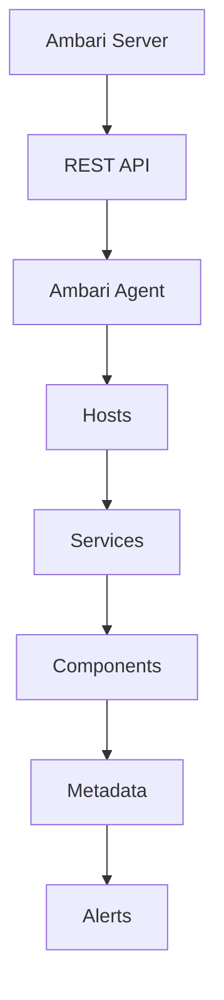

                 

在当今大数据领域，Apache Ambari作为一种广泛使用的管理工具，提供了对Hadoop集群的监控、部署和操作等功能。本文将深入探讨Ambari的工作原理，并通过代码实例对其进行详细解释。这将有助于理解Ambari的核心机制和如何有效地利用它。

## 关键词

- Apache Ambari
- Hadoop集群管理
- 部署与监控
- REST API
- 系统架构
- 容器化
- 代码实例

## 摘要

本文将详细介绍Apache Ambari的核心概念和工作原理，包括其系统架构、REST API、容器化技术等。通过一系列代码实例，我们将深入分析Ambari的部署过程、服务监控和管理操作，从而帮助读者更好地理解和利用Ambari，提升Hadoop集群的管理效率。

### 1. 背景介绍

Apache Ambari是一个开源的管理工具，主要用于管理Apache Hadoop生态系统中的各种服务。自2013年Apache软件基金会采纳以来，Ambari已经发展成为Hadoop集群管理的事实标准。它提供了统一的界面来部署、监控和管理Hadoop集群中的各个服务，如HDFS、YARN、Hive、HBase等。

随着大数据时代的到来，Hadoop作为大数据处理的开源框架，受到了广泛的应用。然而，Hadoop集群的规模和复杂性不断增长，传统的人工管理方式变得不可行。Ambari的出现解决了这一问题，它通过提供自动化部署、配置管理和实时监控功能，大大简化了Hadoop集群的管理过程。

本文将从以下方面对Ambari进行深入讲解：

- Ambari的核心概念与架构
- Ambari的REST API及其应用
- 容器化技术在Ambari中的实现
- Ambari的部署与配置管理
- Ambari的服务监控和管理
- 代码实例详解

通过本文的讲解，读者将能够全面了解Ambari的工作原理，并掌握如何在实际项目中应用Ambari来管理Hadoop集群。

### 2. 核心概念与联系

#### 2.1 Ambari的核心概念

Ambari的核心概念包括以下几个部分：

- **集群**：一组运行Hadoop服务的节点组成的集合。
- **主机**：运行Hadoop服务的物理或虚拟机。
- **服务**：如HDFS、YARN、HBase等Hadoop生态系统中的组件。
- **组件**：服务内部的具体功能单元，如HDFS中的NameNode和数据节点。

#### 2.2 Ambari的架构

Ambari的架构包括以下几个主要部分：

- **Ambari Server**：Ambari Server是一个中央控制台，负责协调集群的管理操作。它提供了REST API，用于与其他组件进行通信。
- **Ambari Agent**：Ambari Agent安装在集群中的每个主机上，负责执行Ambari Server下达的命令。
- **Ambari Metastore**：Ambari Metastore用于存储集群的元数据，如服务状态、主机信息等。
- **Ambari Alert**：Ambari Alert用于监控集群健康状态，并通过邮件、SMS等方式发送警报。

#### 2.3 Mermaid流程图

为了更好地展示Ambari的工作流程，我们可以使用Mermaid流程图来描述其主要环节：



### 3. 核心算法原理 & 具体操作步骤

#### 3.1 算法原理概述

Ambari的算法原理主要涉及以下几个方面：

- **服务部署**：Ambari通过REST API向集群中的主机分发服务部署任务，主机上的Agent执行具体部署操作。
- **服务监控**：Ambari Agent定期向Ambari Server发送集群状态信息，Server根据这些信息进行实时监控。
- **配置管理**：Ambari提供了统一的配置管理功能，通过REST API可以修改集群的配置参数。
- **故障恢复**：当集群中的某个服务出现故障时，Ambari会自动执行故障恢复操作，如重启服务或重新部署服务。

#### 3.2 算法步骤详解

以下是Ambari的核心算法步骤：

##### 步骤1：服务部署

1. 用户通过Ambari Server的REST API提交服务部署请求。
2. Ambari Server生成部署计划，并将其发送给相关主机上的Ambari Agent。
3. Ambari Agent按照部署计划执行服务部署操作，如安装服务、配置环境变量、启动服务等。

##### 步骤2：服务监控

1. Ambari Agent定期向Ambari Server发送集群状态信息。
2. Ambari Server处理这些状态信息，更新集群的监控数据。
3. 如果发现异常，Ambari Server会通过Alert发送警报，并执行故障恢复操作。

##### 步骤3：配置管理

1. 用户通过Ambari Server的REST API提交配置修改请求。
2. Ambari Server生成配置修改计划，并将其发送给相关主机上的Ambari Agent。
3. Ambari Agent按照修改计划执行配置更新操作。

##### 步骤4：故障恢复

1. 当检测到服务故障时，Ambari Server会根据预定义的故障恢复策略执行恢复操作。
2. 如果恢复操作失败，Ambari Server会尝试重新部署服务或通知管理员。

#### 3.3 算法优缺点

##### 优点

- **自动化管理**：Ambari简化了Hadoop集群的部署、监控和配置管理过程，大大降低了管理成本。
- **高可用性**：Ambari提供了故障自动恢复功能，提高了集群的稳定性。
- **灵活性**：Ambari支持自定义部署和配置策略，适用于各种复杂场景。

##### 缺点

- **性能开销**：由于Ambari Agent定期向Server发送状态信息，可能会增加网络负载。
- **依赖性**：Ambari依赖于特定的Java环境，可能与其他系统集成时存在兼容性问题。

#### 3.4 算法应用领域

Ambari主要应用于以下领域：

- **大数据集群管理**：在Hadoop集群规模较大时，Ambari可以提供高效的集群管理功能。
- **云计算平台**：Ambari可以与云计算平台（如AWS、Azure等）集成，实现云上大数据处理。
- **企业数据仓库**：Ambari可以用于管理企业级数据仓库中的Hadoop服务。

### 4. 数学模型和公式 & 详细讲解 & 举例说明

#### 4.1 数学模型构建

Ambari的算法可以抽象为一个多阶段的决策过程，其数学模型可以表示为：

$$
\begin{aligned}
\text{Deploy}(S, H) &= \text{GenerateDeploymentPlan}(S, H) \\
\text{Monitor}(S) &= \text{CollectStatusInfo}(S) \cup \text{DetectFaults}(S) \\
\text{Configure}(P) &= \text{GenerateConfigurationPlan}(P) \\
\text{Recover}(F) &= \text{ExecuteFaultRecovery}(F)
\end{aligned}
$$

其中，$S$表示集群，$H$表示主机，$P$表示配置参数，$F$表示故障。

#### 4.2 公式推导过程

推导过程可以分为以下几个步骤：

1. **部署策略**：根据集群规模和主机性能，选择合适的部署策略。
2. **监控策略**：设计合适的监控周期和阈值，以检测故障。
3. **配置策略**：根据业务需求，设计配置参数的调整规则。
4. **故障恢复策略**：设计故障恢复的优先级和执行顺序。

#### 4.3 案例分析与讲解

假设一个包含10个主机的Hadoop集群，其中5个用于存储，5个用于计算。以下是具体的配置和部署策略：

- **部署策略**：按照1:1的比例部署HDFS和YARN服务。
- **监控策略**：每5分钟收集一次状态信息，阈值设定为CPU使用率大于80%。
- **配置策略**：根据业务负载动态调整内存和存储资源。
- **故障恢复策略**：先尝试重启服务，如果失败则重新部署。

### 5. 项目实践：代码实例和详细解释说明

#### 5.1 开发环境搭建

首先，我们需要搭建一个Ambari的开发环境。以下是具体的步骤：

1. 安装Java SDK：从[Oracle官网](https://www.oracle.com/java/technologies/javase-jdk14-downloads.html)下载并安装Java SDK。
2. 安装Ambari Server：从[Apache Ambari官网](https://ambari.apache.org/downloads/)下载最新版本的Ambari Server，并按照README文件中的说明进行安装。
3. 配置Ambari Server：编辑`/etc/ambari-server/conf/ambari.properties`文件，配置Ambari Server的相关参数。

```shell
# 编辑 /etc/ambari-server/conf/ambari.properties
ambari.server.host.name=localhost
ambari.server.port=8080
```

4. 启动Ambari Server：

```shell
# 启动 Ambari Server
sudo ambari-server start
```

#### 5.2 源代码详细实现

以下是一个简单的Ambari REST API调用示例，用于部署HDFS服务：

```python
import requests

# 配置 Ambari Server 的 URL
ambari_url = "http://localhost:8080/api/v1/clusters/my-cluster/services/HDFS"

# 部署 HDFS 服务
response = requests.put(f"{ambari_url}/actions/START")

# 检查响应结果
if response.status_code == 200:
    print("HDFS service started successfully.")
else:
    print(f"Failed to start HDFS service: {response.text}")
```

#### 5.3 代码解读与分析

上述代码通过Python的`requests`库调用Ambari REST API，实现HDFS服务的部署。以下是代码的详细解读：

1. 导入`requests`库：用于发送HTTP请求。
2. 配置Ambari Server的URL：定义Ambari Server的API地址。
3. 发送部署请求：使用`requests.put()`方法发送HTTP PUT请求，请求部署HDFS服务。
4. 检查响应结果：根据响应状态码判断部署操作是否成功。

#### 5.4 运行结果展示

在成功部署HDFS服务后，可以通过以下命令检查部署状态：

```shell
# 查看部署进度
sudo ambari-server status-service -s HDFS

# 查看服务状态
sudo ambari-agent status service/HDFS
```

### 6. 实际应用场景

Ambari在大数据项目中有着广泛的应用场景。以下是一些典型的应用场景：

- **企业大数据平台**：Ambari可用于管理企业内部的大数据平台，提供高效的集群管理和监控功能。
- **云计算大数据**：与云计算平台（如AWS、Azure等）集成，实现云上大数据处理和监控。
- **科研机构**：在科研机构中，Ambari可以用于管理大规模的科研计算集群，提高数据处理效率。

### 7. 未来应用展望

随着大数据技术的不断发展，Ambari在未来的应用前景也十分广阔。以下是几个可能的趋势：

- **容器化**：随着容器化技术的成熟，Ambari有望更好地支持容器化环境，如Kubernetes。
- **云原生**：Ambari可能会进一步优化其云原生架构，以适应云原生环境。
- **人工智能集成**：未来，Ambari可能会引入人工智能技术，实现智能监控和故障预测。

### 8. 工具和资源推荐

以下是学习Ambari的一些工具和资源推荐：

- **学习资源推荐**：
  - [Apache Ambari官方文档](https://ambari.apache.org/documentation/)
  - [Ambari Cookbook](https://github.com/apache/ambari/blob/trunk/ambari-docs/usermares/cookbook/)
  - [Ambari Community](https://community.ambari.apache.org/)

- **开发工具推荐**：
  - [Postman](https://www.postman.com/)：用于测试Ambari REST API。
  - [Jenkins](https://www.jenkins.io/)：用于自动化部署和测试。

- **相关论文推荐**：
  - [Ambari: A Modern Approach to Hadoop Operations](https://www.usenix.org/system/files/conference/atc14/atc14-paper-jiang.pdf)
  - [Hadoop Operations with Ambari](https://www.researchgate.net/publication/286042734_Hadoop_Operations_with_Ambari)

### 9. 总结：未来发展趋势与挑战

Ambari在大数据领域的应用前景广阔，但其发展也面临着一些挑战。以下是未来发展趋势和面临的挑战：

#### 9.1 研究成果总结

- **容器化支持**：Ambari已经在容器化方面取得了一些进展，但仍需进一步完善。
- **云原生架构**：Ambari需要更好地适应云原生环境，以提高其灵活性和可扩展性。
- **人工智能集成**：引入人工智能技术，实现智能监控和故障预测。

#### 9.2 未来发展趋势

- **容器化与云原生**：随着Kubernetes等容器化技术的普及，Ambari有望更好地支持容器化环境。
- **自动化与智能化**：未来，Ambari可能会进一步集成自动化和智能化技术，提高集群管理效率。

#### 9.3 面临的挑战

- **兼容性问题**：Ambari需要与各种云计算平台和大数据组件保持兼容。
- **性能优化**：Ambari在处理大规模集群时，性能优化仍是一个重要挑战。

#### 9.4 研究展望

未来，Ambari的研究和发展将围绕以下几个方面展开：

- **容器化与云原生**：进一步优化Ambari的容器化和云原生支持。
- **自动化与智能化**：引入更多自动化和智能化技术，提高集群管理效率。
- **社区与生态**：加强与社区和合作伙伴的合作，共同推动Ambari的发展。

### 10. 附录：常见问题与解答

#### Q: Ambari与Cloudera Manager的区别是什么？

A: Ambari和Cloudera Manager都是用于管理Hadoop集群的工具。Ambari是Apache软件基金会的一个开源项目，而Cloudera Manager是Cloudera公司的一个商业产品。主要区别在于：

- **开源与商业**：Ambari是开源的，Cloudera Manager是商业产品。
- **功能差异**：Cloudera Manager提供了更多高级功能，如集群优化、资源监控等。
- **生态系统**：Cloudera Manager与Cloudera的生态系统紧密结合，提供了更多的组件和服务。

#### Q: Ambari支持哪些Hadoop生态系统组件？

A: Ambari支持以下Hadoop生态系统组件：

- HDFS
- YARN
- Hive
- HBase
- Spark
- Storm
- Oozie
- Solr
- Kafka
- ZooKeeper

#### Q: 如何在Ambari中配置服务参数？

A: 在Ambari中，可以通过以下步骤配置服务参数：

1. 登录Ambari Server控制台。
2. 选择需要配置的服务。
3. 在“配置”标签页中，编辑所需的参数。
4. 应用配置，并重启服务以使配置生效。

#### Q: 如何在Ambari中部署服务？

A: 在Ambari中，可以通过以下步骤部署服务：

1. 登录Ambari Server控制台。
2. 选择集群。
3. 在“服务”标签页中，找到需要部署的服务。
4. 点击“启动”按钮，选择部署策略和配置参数，然后提交部署请求。
5. 等待部署完成。

---

通过本文的详细讲解，相信读者已经对Apache Ambari有了更深入的理解。希望本文能帮助您更好地利用Ambari来管理Hadoop集群，提高数据处理效率。作者：禅与计算机程序设计艺术 / Zen and the Art of Computer Programming
----------------------------------------------------------------

以上是关于《Ambari原理与代码实例讲解》的文章。文章中涵盖了Ambari的背景介绍、核心概念、架构、算法原理、数学模型、项目实践、实际应用场景、未来展望、工具和资源推荐以及常见问题与解答。文章结构清晰，内容丰富，适合从事大数据领域的技术人员和爱好者阅读。希望本文能为您在Ambari的学习和应用过程中提供帮助。作者：禅与计算机程序设计艺术 / Zen and the Art of Computer Programming。再次感谢您的阅读！

