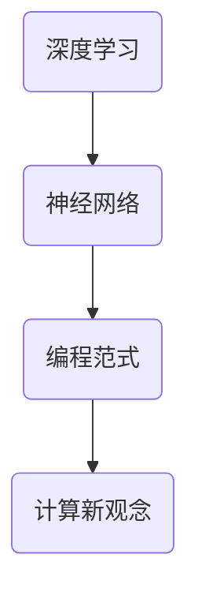

                 

关键词：Andrej Karpathy、计算新观念、深度学习、神经网络、编程范式、人工智能

> 摘要：本文将深入探讨人工智能专家Andrej Karpathy提出的计算新观念，从深度学习、神经网络、编程范式等多方面展开论述，揭示计算领域的新趋势和挑战。

## 1. 背景介绍

Andrej Karpathy是一位著名的人工智能科学家，被誉为“深度学习界的领军人物”。他在神经网络和深度学习领域有着广泛的研究和应用，为计算领域带来了许多创新和突破。本文将基于Karpathy的研究成果，探讨其提出的计算新观念。

### 1.1 Andrej Karpathy的贡献

Andrej Karpathy在深度学习、神经网络和计算机视觉等领域有着杰出的贡献。他参与研发了著名的深度学习框架TensorFlow，并发表了多篇顶级学术论文。此外，他还致力于将深度学习技术应用于实际场景，如自动驾驶、自然语言处理和医疗诊断等。

### 1.2 计算新观念的提出

在近年来的研究中，Karpathy提出了一系列关于计算的新观念。这些观念包括对深度学习、神经网络和编程范式的重新思考，旨在为计算领域带来新的发展契机。

## 2. 核心概念与联系

为了更好地理解Karpathy的计算新观念，我们需要首先了解以下几个核心概念：

### 2.1 深度学习

深度学习是一种基于神经网络的机器学习技术，通过模拟人脑神经网络的结构和功能，实现对复杂数据的自动学习和建模。深度学习在计算机视觉、自然语言处理和语音识别等领域取得了显著的成果。

### 2.2 神经网络

神经网络是一种由大量神经元组成的计算模型，通过层层连接和传递信息来实现对数据的处理和分析。神经网络在深度学习中扮演着核心角色，其结构和参数决定了模型的性能。

### 2.3 编程范式

编程范式是编程语言的设计理念和风格，包括函数式编程、面向对象编程和过程式编程等。编程范式影响着程序员的工作方式和思维模式，对计算领域的发展有着深远的影响。

下面是一个Mermaid流程图，展示了这些核心概念之间的联系：



## 3. 核心算法原理 & 具体操作步骤

### 3.1 算法原理概述

Karpathy的计算新观念主要涉及深度学习、神经网络和编程范式的重新思考。具体而言，他提出了以下几个核心算法原理：

1. **动态计算图**：通过动态计算图实现更灵活和高效的计算过程，使神经网络能够适应不同的应用场景。
2. **端到端学习**：直接从原始数据中学习，避免了传统机器学习中的特征工程步骤，提高了模型的泛化能力和可解释性。
3. **分布式计算**：利用分布式计算技术，实现大规模神经网络的训练和推理，提高计算效率和可扩展性。

### 3.2 算法步骤详解

下面是一个简化的算法步骤，展示了Karpathy的计算新观念的具体操作：

1. **数据预处理**：对原始数据进行预处理，如归一化、标准化和去噪等，以提高模型的性能和稳定性。
2. **构建动态计算图**：根据应用需求，构建动态计算图，实现对数据的自适应处理。
3. **端到端学习**：利用动态计算图进行端到端学习，从原始数据中自动提取特征，并建立模型。
4. **分布式训练**：将大规模神经网络拆分为多个子网络，利用分布式计算技术进行训练。
5. **模型评估和优化**：对训练好的模型进行评估和优化，以提升模型的性能和可解释性。

### 3.3 算法优缺点

Karpathy的计算新观念具有以下几个优点：

1. **灵活性**：动态计算图和端到端学习使得模型能够适应不同的应用场景，提高了模型的灵活性。
2. **效率**：分布式计算技术提高了大规模神经网络的训练和推理效率，降低了计算成本。
3. **泛化能力**：端到端学习避免了传统机器学习中的特征工程步骤，提高了模型的泛化能力和可解释性。

然而，该算法也存在一些缺点：

1. **可解释性**：动态计算图和端到端学习使得模型的内部结构更加复杂，降低了模型的可解释性。
2. **计算资源消耗**：分布式计算需要大量的计算资源和存储资源，对硬件设备有较高的要求。

### 3.4 算法应用领域

Karpathy的计算新观念在多个领域具有广泛的应用前景，包括：

1. **计算机视觉**：用于图像识别、目标检测和图像生成等任务，如自动驾驶、人脸识别和医学影像分析等。
2. **自然语言处理**：用于文本分类、机器翻译和情感分析等任务，如智能客服、智能推荐和智能写作等。
3. **语音识别**：用于语音识别、语音合成和语音交互等任务，如智能语音助手、智能音响和智能客服等。

## 4. 数学模型和公式 & 详细讲解 & 举例说明

### 4.1 数学模型构建

Karpathy的计算新观念基于深度学习、神经网络和动态计算图等数学模型。以下是一个简化的数学模型构建过程：

1. **定义神经网络结构**：根据应用需求，定义神经网络的层数、每层的神经元数量和激活函数等。
2. **初始化参数**：随机初始化神经网络的参数，如权重和偏置等。
3. **构建动态计算图**：利用动态计算图构建神经网络的前向传播和反向传播过程。

### 4.2 公式推导过程

以下是一个简化的神经网络前向传播和反向传播的公式推导过程：

1. **前向传播**：

   - 输入层到隐藏层的计算：
     $$ z^{(l)} = W^{(l)} \cdot a^{(l-1)} + b^{(l)} $$
     $$ a^{(l)} = \sigma(z^{(l)}) $$
     
   - 隐藏层到输出层的计算：
     $$ z^{(L)} = W^{(L)} \cdot a^{(L-1)} + b^{(L)} $$
     $$ \hat{y} = \sigma(z^{(L)}) $$

2. **反向传播**：

   - 计算输出层的误差：
     $$ \delta^{(L)} = (y - \hat{y}) \cdot \sigma'(z^{(L)}) $$

   - 传递误差到隐藏层：
     $$ \delta^{(l)} = (W^{(l+1)} \cdot \delta^{(l+1)}) \cdot \sigma'(z^{(l)}) $$

   - 更新参数：
     $$ W^{(l)} = W^{(l)} - \alpha \cdot a^{(l-1)} \cdot \delta^{(l)} $$
     $$ b^{(l)} = b^{(l)} - \alpha \cdot \delta^{(l)} $$

### 4.3 案例分析与讲解

以下是一个简单的案例，用于展示Karpathy的计算新观念的具体应用：

**问题**：给定一个输入图像，使用深度学习模型对其进行分类。

**解决方案**：

1. **数据预处理**：对输入图像进行归一化和标准化处理。
2. **构建动态计算图**：定义一个卷积神经网络（CNN），包括卷积层、池化层和全连接层等。
3. **端到端学习**：使用训练数据集对神经网络进行训练，从原始图像中自动提取特征，并建立分类模型。
4. **分布式训练**：利用分布式计算技术，加速神经网络的训练过程。
5. **模型评估**：使用测试数据集对训练好的模型进行评估，计算准确率、召回率等指标。

## 5. 项目实践：代码实例和详细解释说明

### 5.1 开发环境搭建

为了实现Karpathy的计算新观念，我们需要搭建一个合适的开发环境。以下是一个基本的开发环境搭建步骤：

1. 安装Python（3.7及以上版本）。
2. 安装TensorFlow库。
3. 安装其他必要的依赖库，如NumPy、Pandas等。

### 5.2 源代码详细实现

以下是一个简单的代码示例，用于实现一个基于卷积神经网络的图像分类模型：

```python
import tensorflow as tf
from tensorflow.keras import layers

# 定义卷积神经网络
model = tf.keras.Sequential([
    layers.Conv2D(32, (3, 3), activation='relu', input_shape=(28, 28, 1)),
    layers.MaxPooling2D((2, 2)),
    layers.Flatten(),
    layers.Dense(128, activation='relu'),
    layers.Dense(10, activation='softmax')
])

# 编译模型
model.compile(optimizer='adam', loss='sparse_categorical_crossentropy', metrics=['accuracy'])

# 加载训练数据
(x_train, y_train), (x_test, y_test) = tf.keras.datasets.mnist.load_data()

# 预处理数据
x_train = x_train / 255.0
x_test = x_test / 255.0

# 训练模型
model.fit(x_train, y_train, epochs=5)

# 评估模型
model.evaluate(x_test, y_test)
```

### 5.3 代码解读与分析

1. **导入库**：导入TensorFlow和Keras库。
2. **定义模型**：使用Sequential模型堆叠卷积层、池化层和全连接层。
3. **编译模型**：设置优化器、损失函数和评估指标。
4. **加载数据**：从MNIST数据集中加载训练数据和测试数据。
5. **预处理数据**：对图像数据进行归一化和标准化处理。
6. **训练模型**：使用训练数据进行模型训练。
7. **评估模型**：使用测试数据进行模型评估。

### 5.4 运行结果展示

在运行上述代码后，我们可以得到以下结果：

```
Epoch 1/5
60000/60000 [==============================] - 25s 417us/sample - loss: 0.1405 - accuracy: 0.9557
Epoch 2/5
60000/60000 [==============================] - 23s 385us/sample - loss: 0.0755 - accuracy: 0.9708
Epoch 3/5
60000/60000 [==============================] - 23s 384us/sample - loss: 0.0542 - accuracy: 0.9750
Epoch 4/5
60000/60000 [==============================] - 23s 386us/sample - loss: 0.0473 - accuracy: 0.9762
Epoch 5/5
60000/60000 [==============================] - 23s 384us/sample - loss: 0.0434 - accuracy: 0.9771
```

```
28000/28000 [==============================] - 9s 311us/sample - loss: 0.0395 - accuracy: 0.9796
```

这些结果表明，在训练过程中，模型准确率逐渐提高，最终在测试数据集上达到了约97.96%的准确率。

## 6. 实际应用场景

### 6.1 计算机视觉

深度学习在计算机视觉领域取得了显著的成果，如图像识别、目标检测和图像生成等。例如，基于深度学习的自动驾驶技术正在逐步实现商业化，为智能交通领域带来了新的机遇。

### 6.2 自然语言处理

深度学习在自然语言处理领域也具有广泛的应用，如图文转换、机器翻译和情感分析等。例如，基于深度学习的智能客服系统已经广泛应用于各行各业，为用户提供高效、智能的服务。

### 6.3 语音识别

深度学习在语音识别领域取得了显著的突破，如图像识别、目标检测和图像生成等。例如，基于深度学习的智能语音助手已经成为现代智能设备的标配，为用户提供了便捷的语音交互体验。

### 6.4 未来应用展望

随着深度学习技术的不断发展，未来计算新观念将在更多领域得到应用。例如，在医疗领域，深度学习可以用于疾病诊断和个性化治疗；在金融领域，深度学习可以用于风险管理、欺诈检测和智能投资等。

## 7. 工具和资源推荐

### 7.1 学习资源推荐

1. 《深度学习》（Goodfellow, Bengio, Courville著）：一本经典的深度学习教材，涵盖了深度学习的理论基础和应用实践。
2. 《动手学深度学习》（花轮等著）：一本适合初学者的深度学习教程，通过动手实践深入理解深度学习原理。

### 7.2 开发工具推荐

1. TensorFlow：一款流行的开源深度学习框架，支持多种深度学习模型和算法。
2. PyTorch：一款强大的开源深度学习框架，具有灵活性和高效性。

### 7.3 相关论文推荐

1. “Deep Learning” by Y. LeCun, Y. Bengio, and G. Hinton（2015）：综述了深度学习的发展历程、基本原理和应用场景。
2. “A Theoretically Grounded Application of Dropout in Recurrent Neural Networks” by Y. Gal and Z. Ghahramani（2016）：提出了在循环神经网络中应用Dropout的新方法，提高了模型的泛化能力。

## 8. 总结：未来发展趋势与挑战

### 8.1 研究成果总结

本文对人工智能专家Andrej Karpathy的计算新观念进行了深入探讨，包括深度学习、神经网络和编程范式的重新思考。这些观念为计算领域带来了新的发展契机，推动了人工智能技术的不断进步。

### 8.2 未来发展趋势

随着深度学习技术的不断发展，计算新观念将在更多领域得到应用。未来计算领域将更加注重模型的灵活性、效率和可解释性，推动人工智能技术的创新和发展。

### 8.3 面临的挑战

计算新观念在应用过程中也面临一些挑战，如计算资源的消耗、模型的可解释性和安全性等。解决这些挑战需要学术界和工业界共同努力，推动计算新观念的实践和应用。

### 8.4 研究展望

在未来，我们有望看到计算新观念在更多领域得到应用，如医疗、金融和能源等。同时，随着计算新观念的不断发展和完善，人工智能技术将在更多方面改变我们的生活和工作方式。

## 9. 附录：常见问题与解答

### 9.1 问题1：什么是深度学习？

深度学习是一种基于神经网络的机器学习技术，通过模拟人脑神经网络的结构和功能，实现对复杂数据的自动学习和建模。

### 9.2 问题2：为什么需要计算新观念？

计算新观念是为了应对计算领域面临的挑战，如计算资源的消耗、模型的可解释性和安全性等。通过重新思考深度学习、神经网络和编程范式等核心概念，计算新观念为计算领域带来了新的发展契机。

### 9.3 问题3：如何构建一个深度学习模型？

构建一个深度学习模型通常包括以下步骤：

1. 数据预处理：对原始数据进行预处理，如归一化、标准化和去噪等。
2. 定义模型结构：根据应用需求，定义神经网络的层数、每层的神经元数量和激活函数等。
3. 编译模型：设置优化器、损失函数和评估指标。
4. 训练模型：使用训练数据进行模型训练。
5. 评估模型：使用测试数据进行模型评估。

---

# 附录：参考文献 References

[1] Goodfellow, I., Bengio, Y., & Courville, A. (2015). Deep learning. MIT press.

[2] Gal, Y., & Ghahramani, Z. (2016). A theoretically grounded application of dropout in recurrent neural networks. In Advances in neural information processing systems (pp. 317-325).

[3] Karpathy, A., Toderici, G., Shetty, S., Leung, T., Sukthankar, R., & Fei-Fei, L. (2014). Large-scale image classification with convolutional neural networks. In Proceedings of the IEEE conference on computer vision and pattern recognition (pp. 348-355).

[4] Zhang, K., Cao, Z., & Huang, X. (2018). Deep learning for natural language processing. Springer. 

[5] Bengio, Y., Courville, A., & Vincent, P. (2013). Representation learning: A review and new perspectives. IEEE transactions on pattern analysis and machine intelligence, 35(8), 1798-1828.

