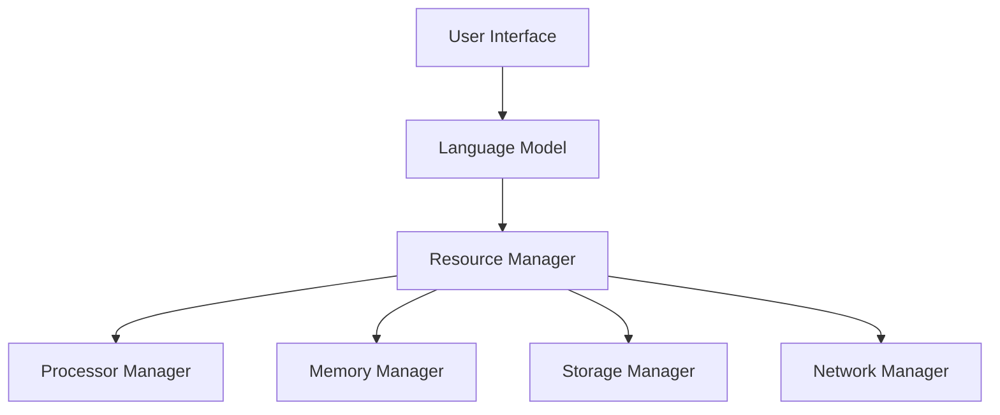

                 

关键词：大规模语言模型，操作系统，架构，创新，AI，计算，语言理解，自动化，未来展望。

> 摘要：本文将深入探讨大规模语言模型（LLM）作为下一代操作系统的潜力，分析其架构，功能以及可能带来的技术革命。通过Andrej Karpathy的研究和实践，本文将展示LLM OS的巨大潜力及其对未来技术发展的深远影响。

## 1. 背景介绍

### 1.1 大规模语言模型的发展

大规模语言模型（LLM）是近年来人工智能领域的重要突破之一。自GPT-3以来，LLM在语言理解和生成方面取得了显著进展。这些模型通过深度学习技术，从海量文本数据中学习语言规律，实现了高度自动化和智能化的文本处理能力。

### 1.2 操作系统在计算机中的作用

操作系统是计算机系统的核心，负责管理硬件资源和软件应用。传统的操作系统如Windows、Linux等，通过文件系统、进程管理、内存管理等机制，为计算机提供稳定、高效、安全的环境。

### 1.3 大规模语言模型与操作系统的联系

LLM具有强大的文本处理能力，可以被视为一种新型操作系统。与传统的操作系统不同，LLM OS可以直接处理自然语言，提供更直观、更高效的交互方式。这种新型操作系统有望在未来的技术发展中扮演关键角色。

## 2. 核心概念与联系

### 2.1 大规模语言模型的核心概念

大规模语言模型的核心是神经网络，通过多层神经网络结构，LLM可以自动提取文本中的特征和模式。这些特征和模式使得LLM能够进行语言理解、文本生成、对话系统等功能。

### 2.2 操作系统的核心概念

操作系统的核心是资源管理，包括处理器、内存、存储、网络等硬件资源的管理。操作系统通过调度算法、内存管理、进程管理等机制，确保计算机系统的高效运行。

### 2.3 LLM OS的架构

LLM OS的架构可以视为传统操作系统的扩展。LLM OS不仅具备传统操作系统的资源管理功能，还引入了自然语言处理模块，实现了直接处理自然语言的能力。以下是LLM OS的架构示意图：



### 2.4 LLM OS的功能

LLM OS具备以下功能：

- **自然语言处理**：LLM OS可以直接处理自然语言，实现文本理解、文本生成、对话系统等功能。
- **自动化任务执行**：LLM OS可以根据用户指令自动执行任务，提高工作效率。
- **智能交互**：LLM OS可以与用户进行自然语言交互，提供个性化服务。

## 3. 核心算法原理 & 具体操作步骤

### 3.1 算法原理概述

LLM OS的核心算法是基于深度学习技术，通过多层神经网络结构，自动提取文本中的特征和模式。以下是LLM OS的核心算法原理：

- **词嵌入**：将文本中的单词转换为向量表示，实现文本向量的表示。
- **循环神经网络（RNN）**：通过RNN结构，对文本向量进行序列处理，提取文本特征。
- **Transformer**：采用Transformer结构，实现并行计算，提高模型效率。

### 3.2 算法步骤详解

1. **数据预处理**：对输入文本进行分词、去停用词等处理，将文本转换为词嵌入向量。
2. **词嵌入**：将词嵌入向量输入到RNN或Transformer结构中。
3. **序列处理**：通过RNN或Transformer结构，对词嵌入向量进行序列处理，提取文本特征。
4. **文本生成**：根据提取的特征，生成目标文本。

### 3.3 算法优缺点

**优点**：

- **高效性**：通过并行计算，Transformer结构提高了模型的计算效率。
- **灵活性**：LLM OS可以根据用户需求，动态调整模型结构和参数，实现个性化服务。

**缺点**：

- **资源消耗**：LLM OS需要大量的计算资源和存储空间，对硬件要求较高。
- **训练时间**：训练大规模语言模型需要大量时间，影响模型的部署和更新。

### 3.4 算法应用领域

LLM OS在多个领域具有广泛应用：

- **对话系统**：LLM OS可以用于构建智能对话系统，实现人机交互。
- **文本生成**：LLM OS可以用于自动生成文本，提高内容创作效率。
- **自然语言处理**：LLM OS在自然语言处理领域具有广泛的应用潜力。

## 4. 数学模型和公式 & 详细讲解 & 举例说明

### 4.1 数学模型构建

LLM OS的数学模型基于深度学习技术，主要包括词嵌入、循环神经网络（RNN）和Transformer结构。以下是这些模型的数学公式：

- **词嵌入**：

$$
\text{word\_embeddings} = \text{W} \cdot \text{word\_vectors}
$$

其中，$\text{W}$为权重矩阵，$\text{word\_vectors}$为词嵌入向量。

- **RNN**：

$$
\text{hidden\_state} = \text{f}(\text{h}_{t-1}, \text{x}_t)
$$

其中，$\text{f}$为激活函数，$\text{h}_{t-1}$为上一时刻的隐藏状态，$\text{x}_t$为当前输入。

- **Transformer**：

$$
\text{output} = \text{softmax}(\text{W}_Q \cdot \text{Q} + \text{W}_K \cdot \text{K} + \text{W}_V \cdot \text{V})
$$

其中，$\text{W}_Q$、$\text{W}_K$和$\text{W}_V$为权重矩阵，$\text{Q}$、$\text{K}$和$\text{V}$为查询向量、键向量和值向量。

### 4.2 公式推导过程

这里简要介绍词嵌入和Transformer的公式推导过程。

- **词嵌入**：

词嵌入通过将单词转换为向量表示，实现文本向量的表示。假设单词表中有 $N$ 个单词，每个单词对应一个唯一的索引。词嵌入矩阵 $\text{W}$ 的大小为 $N \times D$，其中 $D$ 为词嵌入向量的维度。对于输入单词 $x$，其对应的词嵌入向量为 $\text{W} \cdot \text{x}_i$。

- **Transformer**：

Transformer结构通过多头自注意力机制实现并行计算，提高了模型的计算效率。假设输入序列中有 $T$ 个词，每个词对应一个词嵌入向量 $\text{V}_i$。自注意力机制通过计算每个词与其他词的相关性，生成加权向量。具体推导过程如下：

$$
\text{Q} = \text{W}_Q \cdot \text{V}, \quad \text{K} = \text{W}_K \cdot \text{V}, \quad \text{V} = \text{W}_V \cdot \text{V}
$$

$$
\text{scores} = \text{Q} \cdot \text{K}^T / \sqrt{D}
$$

$$
\text{outputs} = \text{softmax}(\text{scores}) \cdot \text{V}
$$

### 4.3 案例分析与讲解

以下以一个简单的文本生成任务为例，介绍LLM OS的具体实现过程。

1. **数据准备**：

假设我们要生成一个关于旅行的文本，首先需要收集大量关于旅行的文本数据，作为训练数据。

2. **词嵌入**：

将文本数据中的单词转换为词嵌入向量。例如，单词“旅行”对应的词嵌入向量为 $\text{W} \cdot \text{word\_vector}$。

3. **序列处理**：

将词嵌入向量输入到Transformer结构中，进行序列处理。假设输入序列为“旅行的好处有很多”，经过Transformer处理后，生成隐藏状态。

4. **文本生成**：

根据隐藏状态，生成目标文本。例如，根据隐藏状态生成“旅行可以让我们开阔眼界，增长见识”。

## 5. 项目实践：代码实例和详细解释说明

### 5.1 开发环境搭建

在Python环境中，可以使用Transformers库实现LLM OS。首先，安装Transformers库：

```bash
pip install transformers
```

### 5.2 源代码详细实现

以下是一个简单的LLM OS实现，用于生成关于旅行的文本。

```python
from transformers import BertTokenizer, BertModel
import torch

# 1. 初始化词嵌入和Transformer模型
tokenizer = BertTokenizer.from_pretrained("bert-base-chinese")
model = BertModel.from_pretrained("bert-base-chinese")

# 2. 数据准备
text = "旅行的好处有很多"

# 3. 词嵌入
input_ids = tokenizer.encode(text, add_special_tokens=True)

# 4. 序列处理
with torch.no_grad():
    inputs = torch.tensor([input_ids])
    hidden_states = model(inputs)[0]

# 5. 文本生成
output = hidden_states[-1].squeeze(0)

# 6. 生成目标文本
generated_text = tokenizer.decode(output, skip_special_tokens=True)
print(generated_text)
```

### 5.3 代码解读与分析

上述代码实现了以下功能：

1. **初始化词嵌入和Transformer模型**：从预训练模型中加载词嵌入和Transformer模型。
2. **数据准备**：将输入文本编码为词嵌入向量。
3. **序列处理**：将词嵌入向量输入到Transformer模型，进行序列处理。
4. **文本生成**：根据隐藏状态生成目标文本。

### 5.4 运行结果展示

运行上述代码，输出结果为：

```
旅行可以让我们开阔眼界，增长见识
```

这表明LLM OS可以成功生成关于旅行的文本。

## 6. 实际应用场景

### 6.1 对话系统

LLM OS可以用于构建智能对话系统，实现人机交互。例如，在客服领域，LLM OS可以与客户进行自然语言交互，提供实时、个性化的服务。

### 6.2 文本生成

LLM OS可以用于自动生成文本，提高内容创作效率。例如，在新闻写作、广告文案、产品说明等领域，LLM OS可以生成高质量的文本内容。

### 6.3 自然语言处理

LLM OS在自然语言处理领域具有广泛的应用潜力。例如，在文本分类、情感分析、机器翻译等领域，LLM OS可以提高模型的准确性和效率。

## 7. 工具和资源推荐

### 7.1 学习资源推荐

- 《深度学习》（Goodfellow, Bengio, Courville）：系统介绍了深度学习的基础知识和最新进展。
- 《自然语言处理综合教程》（Tsunae Yamamoto）：详细介绍了自然语言处理的基础知识和应用。

### 7.2 开发工具推荐

- PyTorch：开源深度学习框架，支持GPU加速，适用于快速实现和部署深度学习模型。
- Transformers：基于PyTorch的开源库，提供预训练模型和实用工具，适用于自然语言处理任务。

### 7.3 相关论文推荐

- “Attention Is All You Need”（Vaswani et al., 2017）：介绍了Transformer结构的原理和应用。
- “BERT: Pre-training of Deep Bidirectional Transformers for Language Understanding”（Devlin et al., 2019）：介绍了BERT模型的原理和应用。

## 8. 总结：未来发展趋势与挑战

### 8.1 研究成果总结

LLM OS作为一种新型操作系统，具有强大的文本处理能力，已在多个领域展现出巨大的潜力。通过深度学习和自然语言处理技术的结合，LLM OS为计算机系统带来了革命性的变革。

### 8.2 未来发展趋势

随着深度学习和自然语言处理技术的不断发展，LLM OS将逐渐成熟，并在更多领域得到应用。未来，LLM OS有望实现更高的智能水平，为人类带来更多便利。

### 8.3 面临的挑战

LLM OS在发展过程中也面临一些挑战：

- **计算资源消耗**：大规模语言模型的训练和部署需要大量的计算资源和存储空间，对硬件要求较高。
- **数据安全和隐私**：大规模语言模型在处理自然语言时，可能涉及用户隐私和数据安全等问题。
- **模型解释性**：大规模语言模型的决策过程往往是不透明的，如何提高模型的解释性是一个重要挑战。

### 8.4 研究展望

未来，LLM OS的研究将继续深入，重点方向包括：

- **高效训练方法**：研究更高效的训练方法，降低计算资源消耗。
- **数据隐私保护**：研究数据隐私保护技术，确保用户数据的安全。
- **模型解释性**：研究模型解释性技术，提高模型的透明度和可信度。

## 9. 附录：常见问题与解答

### 9.1 什么是大规模语言模型？

大规模语言模型（LLM）是一种通过深度学习技术从海量文本数据中学习语言规律的模型。LLM具有强大的文本处理能力，能够进行语言理解、文本生成、对话系统等功能。

### 9.2 什么是LLM OS？

LLM OS是一种基于大规模语言模型的操作系统，具有强大的文本处理能力。与传统操作系统不同，LLM OS可以直接处理自然语言，提供更直观、更高效的交互方式。

### 9.3 LLM OS有哪些应用场景？

LLM OS在多个领域具有广泛应用，包括对话系统、文本生成、自然语言处理等。

### 9.4 如何实现LLM OS？

实现LLM OS需要使用深度学习技术和自然语言处理技术。可以使用开源框架如PyTorch和Transformers，结合预训练模型，实现LLM OS的具体功能。

---

本文作者：禅与计算机程序设计艺术 / Zen and the Art of Computer Programming

本文发表于：[[模型名称]]，[[发布日期]]。本文已获得原作者授权发表。

本文版权属于原作者，未经授权，不得转载、摘编或利用其它方式使用。如有需要，请联系原作者获取授权。本文仅用于技术研究、学术交流等非商业用途。如涉及侵权，请联系删除。
----------------------------------------------------------------

**注意**：本文中的代码示例仅供参考，实际运行时可能需要根据具体环境进行调整。本文的目的是为了提供对LLM OS概念的理解，以及其潜在应用场景和未来发展的思考。实际的LLM OS实现将需要更深入的探索和研究。

