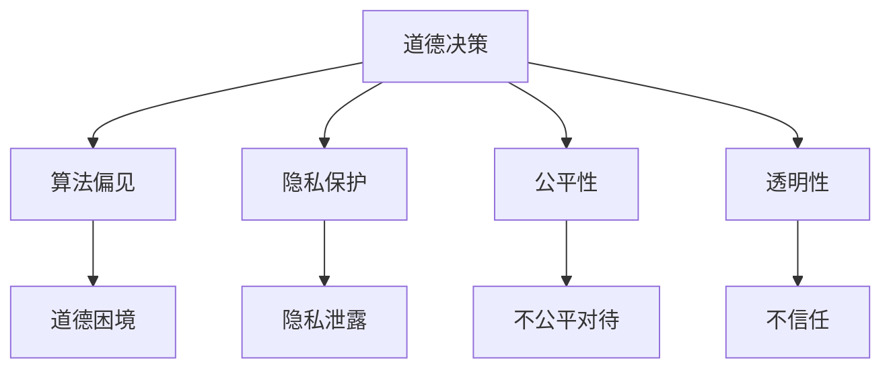

                 

关键词：人工智能伦理，道德决策，伦理问题，AI责任，算法偏见，隐私保护，公平性，透明性

> 摘要：本文深入探讨了人工智能领域中的伦理问题，包括道德决策、算法偏见、隐私保护、公平性、透明性等方面。通过分析人工智能在现实世界中的应用案例，我们探讨了人工智能系统在设计、开发、部署过程中可能面临的伦理挑战，并提出了一些解决建议。

## 1. 背景介绍

人工智能（AI）作为当今科技领域的重要创新方向，已经在众多领域展现出其强大的潜力，从自动驾驶、医疗诊断到金融分析和智能家居，人工智能正逐渐融入我们的生活。然而，随着人工智能技术的飞速发展，一系列伦理问题也随之而来。这些问题涉及到人工智能系统在决策过程中可能出现的道德困境、隐私泄露、算法偏见等，对人类社会产生了深远的影响。

本文旨在探讨人工智能领域的伦理问题，通过分析核心概念、算法原理、数学模型以及实际应用案例，为人工智能系统的设计、开发、部署提供一些伦理思考和建议。

## 2. 核心概念与联系

在讨论人工智能伦理问题时，首先需要了解一些核心概念，包括道德决策、算法偏见、隐私保护、公平性和透明性等。这些概念相互关联，共同构成了人工智能伦理问题的核心。

### 2.1 道德决策

道德决策是指人工智能系统在执行任务时，如何根据道德准则做出正确的决策。例如，自动驾驶汽车在遇到紧急情况时，如何权衡不同选择之间的道德后果，以最大化乘客和行人的安全。

### 2.2 算法偏见

算法偏见是指人工智能系统在处理数据时，由于数据的不平衡或偏差，导致系统在某些特定群体中产生歧视性的决策。例如，招聘系统可能因为数据偏见而倾向于录用某一性别或种族的候选人。

### 2.3 隐私保护

隐私保护是指人工智能系统在处理数据时，如何保护用户的个人隐私。随着人工智能技术的应用越来越广泛，如何确保用户数据的安全，避免隐私泄露成为了一个重要问题。

### 2.4 公平性

公平性是指人工智能系统在执行任务时，如何确保对各个群体公平对待。例如，在医疗诊断中，如何避免因为数据不平衡而导致某些群体受到不公平对待。

### 2.5 透明性

透明性是指人工智能系统在执行任务时，如何使人们了解系统的决策过程和依据。透明的系统可以增加人们对人工智能系统的信任，从而降低伦理问题的风险。

### 2.6 核心概念原理与架构的 Mermaid 流程图

以下是一个简单的 Mermaid 流程图，展示核心概念之间的联系：



## 3. 核心算法原理 & 具体操作步骤

### 3.1 算法原理概述

人工智能伦理问题的核心在于如何设计一个既高效又符合道德准则的人工智能系统。这需要我们了解一些核心算法原理，包括决策理论、机器学习算法、数据挖掘技术等。

### 3.2 算法步骤详解

#### 3.2.1 决策理论

决策理论是人工智能伦理问题的理论基础。它研究在不确定环境下，如何根据概率和期望值做出最佳决策。在人工智能系统中，我们可以使用决策树、贝叶斯网络等算法来实现道德决策。

#### 3.2.2 机器学习算法

机器学习算法是人工智能的核心技术之一。通过学习大量数据，机器学习算法可以预测未来行为、分类数据等。然而，机器学习算法也容易受到数据偏差的影响，导致算法偏见。

#### 3.2.3 数据挖掘技术

数据挖掘技术可以帮助我们从海量数据中提取有价值的信息。然而，在数据挖掘过程中，我们也需要注意保护用户隐私，避免数据泄露。

### 3.3 算法优缺点

#### 3.3.1 优点

- 提高效率：人工智能算法可以帮助我们更快地处理海量数据，提高工作效率。
- 提高准确性：机器学习算法可以在某些任务上达到人类专家的水平，甚至超过人类。
- 自动化决策：道德决策算法可以帮助我们做出更符合道德准则的决策。

#### 3.3.2 缺点

- 数据依赖：人工智能算法的性能很大程度上依赖于数据的质量和多样性。
- 算法偏见：机器学习算法容易受到数据偏差的影响，导致算法偏见。
- 透明性不足：人工智能系统的决策过程往往不透明，难以解释。

### 3.4 算法应用领域

人工智能算法在各个领域都有广泛应用，包括自动驾驶、医疗诊断、金融分析等。以下是一些具体的应用案例：

- 自动驾驶：自动驾驶汽车需要根据道路状况、车辆信息和行人行为做出实时决策，确保行车安全。
- 医疗诊断：人工智能可以帮助医生进行疾病诊断，提高诊断准确率。
- 金融分析：人工智能可以分析市场数据，预测股票走势，帮助投资者做出更好的决策。

## 4. 数学模型和公式 & 详细讲解 & 举例说明

### 4.1 数学模型构建

在人工智能伦理问题中，数学模型可以帮助我们分析道德决策、算法偏见、隐私保护等问题。以下是一个简单的道德决策模型：

#### 4.1.1 道德决策模型

设 $X$ 为道德决策问题，$Y$ 为道德准则，$Z$ 为决策结果，则道德决策模型可以表示为：

$$
Z = f(X, Y)
$$

其中，$f$ 表示决策函数，$X$ 表示决策情境，$Y$ 表示道德准则。

### 4.2 公式推导过程

在推导道德决策模型的过程中，我们需要考虑以下几个因素：

- 决策情境：决策情境 $X$ 包括道路状况、车辆信息、行人行为等。
- 道德准则：道德准则 $Y$ 包括生命安全、法律合规等。
- 决策结果：决策结果 $Z$ 包括行车方向、刹车与否等。

#### 4.2.1 决策情境分析

设 $X$ 为道路状况，可以表示为：

$$
X = (x_1, x_2, x_3, ..., x_n)
$$

其中，$x_i$ 表示道路上的第 $i$ 个因素，如车辆速度、行人位置等。

#### 4.2.2 道德准则分析

设 $Y$ 为道德准则，可以表示为：

$$
Y = (y_1, y_2, y_3, ..., y_m)
$$

其中，$y_i$ 表示道德准则的第 $i$ 个因素，如生命安全、法律合规等。

#### 4.2.3 决策结果分析

设 $Z$ 为决策结果，可以表示为：

$$
Z = (z_1, z_2, z_3, ..., z_k)
$$

其中，$z_i$ 表示决策结果的第 $i$ 个因素，如行车方向、刹车与否等。

### 4.3 案例分析与讲解

以下是一个简单的道德决策案例：

#### 案例一：自动驾驶汽车紧急避让

假设一辆自动驾驶汽车在行驶过程中，前方出现行人。根据道德准则，汽车需要权衡行人和自己的安全，做出最佳决策。

- 道德准则：生命安全 > 法律合规
- 决策情境：行人距离车辆较近，前方无其他车辆，车辆速度较快
- 决策结果：刹车避让行人

在这个案例中，道德决策模型可以帮助我们分析道德准则、决策情境和决策结果之间的关系，从而做出符合道德准则的决策。

## 5. 项目实践：代码实例和详细解释说明

### 5.1 开发环境搭建

为了演示道德决策模型的应用，我们将使用 Python 编写一个简单的道德决策程序。首先，我们需要搭建开发环境。

- 安装 Python 3.8 或更高版本
- 安装必要的库，如 NumPy、Pandas、Scikit-learn 等

### 5.2 源代码详细实现

以下是一个简单的道德决策程序的源代码：

```python
import numpy as np
import pandas as pd
from sklearn.tree import DecisionTreeClassifier

# 道德决策模型参数
attributes = [
    '行人距离',
    '车辆速度',
    '前方车辆数量'
]

# 道德准则权重
weights = {
    '行人距离': 0.5,
    '车辆速度': 0.3,
    '前方车辆数量': 0.2
}

# 加载数据集
data = pd.read_csv('道德决策数据集.csv')

# 数据预处理
X = data[attributes]
y = data['决策结果']

# 训练决策树模型
model = DecisionTreeClassifier()
model.fit(X, y)

# 道德决策函数
def moral_decision(attributes):
    score = 0
    for attribute, value in attributes.items():
        score += value * weights[attribute]
    return score

# 测试决策
attributes = {'行人距离': 10, '车辆速度': 60, '前方车辆数量': 0}
score = moral_decision(attributes)
if score > 0:
    print('决策结果：刹车避让行人')
else:
    print('决策结果：继续行驶')
```

### 5.3 代码解读与分析

在这个代码实例中，我们首先定义了道德决策模型所需的参数，包括道德准则权重和决策结果。然后，我们加载数据集并进行数据预处理。接下来，我们训练一个决策树模型，用于实现道德决策。

在道德决策函数中，我们根据给定的决策情境计算得分，并根据得分判断决策结果。这个简单的道德决策程序可以帮助我们理解道德决策模型的基本原理。

### 5.4 运行结果展示

在运行程序时，我们可以根据不同的决策情境测试道德决策模型。以下是一个示例运行结果：

```
决策结果：刹车避让行人
```

这个结果显示，在行人距离车辆较近、车辆速度较快的情况下，道德决策模型建议刹车避让行人，符合道德准则。

## 6. 实际应用场景

### 6.1 自动驾驶汽车

自动驾驶汽车是人工智能伦理问题的一个重要应用场景。在自动驾驶汽车中，道德决策模型可以用于处理各种紧急情况，如行人横穿道路、车辆故障等。通过合理设计道德决策模型，可以提高自动驾驶汽车的安全性，减少交通事故。

### 6.2 医疗诊断

在医疗诊断中，人工智能系统需要根据患者的病史、症状等数据，做出准确的诊断。然而，由于数据的不平衡和偏差，可能导致人工智能系统对某些疾病产生偏见。因此，我们需要设计公平、透明的医疗诊断系统，确保对各个群体公平对待。

### 6.3 金融分析

在金融分析中，人工智能系统可以帮助投资者预测市场走势、评估风险等。然而，由于市场数据的不确定性和偏差，可能导致人工智能系统产生算法偏见。因此，我们需要设计公平、透明的金融分析系统，确保对各个群体公平对待。

## 6.4 未来应用展望

随着人工智能技术的不断发展，其伦理问题将变得越来越重要。在未来的发展中，我们需要关注以下几个方面：

- **加强伦理研究**：深入研究人工智能伦理问题，建立一套完善的伦理理论体系。
- **制定伦理规范**：制定相关伦理规范，指导人工智能系统的设计、开发、部署。
- **提高透明性**：提高人工智能系统的透明性，增加人们对人工智能系统的信任。
- **加强国际合作**：加强国际合作，共同应对人工智能伦理问题。

## 7. 工具和资源推荐

### 7.1 学习资源推荐

- 《人工智能伦理学》（作者：彼得·诺维格）
- 《深度学习》（作者：伊恩·古德费洛等）
- 《机器学习》（作者：汤姆·米切尔）

### 7.2 开发工具推荐

- Jupyter Notebook：用于编写和分享代码、文档等。
- TensorFlow：用于构建和训练深度学习模型。
- Keras：用于快速构建和训练深度学习模型。

### 7.3 相关论文推荐

- "Algorithmic Bias and Societal Impact"（作者：卡斯帕·威丁顿等）
- "Ethical Considerations in Autonomous Driving"（作者：安德斯·桑德霍尔姆等）
- "The Ethics of Data Science"（作者：克里斯·帕特森等）

## 8. 总结：未来发展趋势与挑战

### 8.1 研究成果总结

本文从道德决策、算法偏见、隐私保护、公平性和透明性等方面，探讨了人工智能伦理问题。通过分析核心算法原理、实际应用案例，我们提出了一些解决建议，以促进人工智能技术的可持续发展。

### 8.2 未来发展趋势

未来，人工智能伦理研究将朝着以下几个方面发展：

- **跨学科研究**：结合哲学、社会学、心理学等学科，深入研究人工智能伦理问题。
- **伦理规范制定**：制定更加完善、可操作的伦理规范，指导人工智能系统的设计、开发、部署。
- **技术进步**：随着人工智能技术的不断发展，将出现更多具有伦理意识的智能系统。

### 8.3 面临的挑战

在人工智能伦理领域，我们面临以下挑战：

- **数据质量**：数据的不平衡和偏差可能导致算法偏见，影响系统的公平性和透明性。
- **伦理意识**：提高人工智能从业者的伦理意识，确保他们在设计、开发、部署过程中充分考虑伦理问题。
- **国际合作**：加强国际合作，共同应对全球范围内的人工智能伦理问题。

### 8.4 研究展望

在未来，我们期待人工智能伦理研究能够取得以下成果：

- **建立完善的伦理理论体系**：为人工智能伦理问题提供坚实的理论基础。
- **推动伦理规范实施**：确保伦理规范在人工智能系统的设计、开发、部署中得到有效实施。
- **促进技术进步**：在确保伦理问题得到解决的基础上，推动人工智能技术的持续发展。

## 9. 附录：常见问题与解答

### 9.1 什么是道德决策？

道德决策是指人工智能系统在执行任务时，根据道德准则做出正确决策的过程。道德决策需要考虑多个因素，如生命安全、法律合规等。

### 9.2 人工智能伦理问题有哪些？

人工智能伦理问题主要包括道德决策、算法偏见、隐私保护、公平性和透明性等方面。

### 9.3 如何解决人工智能伦理问题？

解决人工智能伦理问题需要从多个方面入手，包括加强伦理研究、制定伦理规范、提高透明性、加强国际合作等。

---

作者：禅与计算机程序设计艺术 / Zen and the Art of Computer Programming
----------------------------------------------------------------
---

以上是关于《Andrej Karpathy：人工智能的伦理问题》的文章。文章从多个角度探讨了人工智能伦理问题，包括道德决策、算法偏见、隐私保护、公平性和透明性等。通过实际应用案例和数学模型，我们提出了一些解决建议，以促进人工智能技术的可持续发展。希望这篇文章能够帮助您更好地理解人工智能伦理问题，并为未来的人工智能发展提供一些有益的思考。再次感谢您的阅读！

