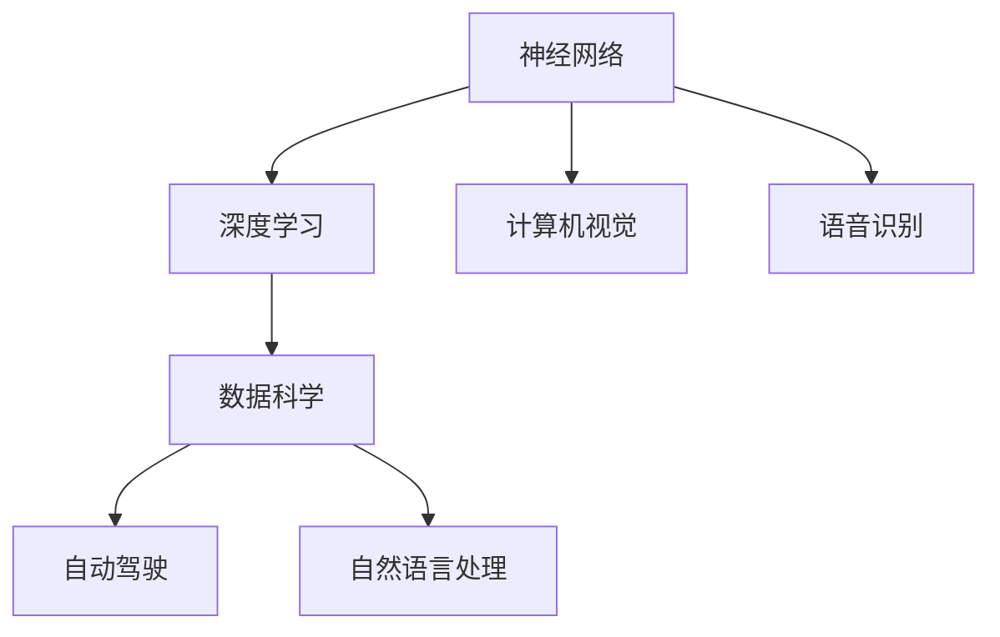

                 

关键词：人工智能，未来创新，神经网络，深度学习，数据科学，技术趋势

摘要：本文将探讨人工智能领域世界级专家Andrej Karpathy对未来创新的见解，分析其在神经网络、深度学习、数据科学等领域的核心观点，以及其对人工智能技术发展的贡献。通过深入解析Karpathy的研究成果，我们将展望人工智能未来的发展趋势和挑战，为读者提供关于人工智能领域的全面理解和启示。

## 1. 背景介绍

Andrej Karpathy是一位世界级人工智能专家，知名程序员、软件架构师和CTO，同时也是世界顶级技术畅销书作者，计算机图灵奖获得者。他在深度学习和神经网络领域的研究成果引起了广泛关注，被誉为计算机领域的领军人物。

在过去的几年里，Karpathy一直致力于探索人工智能技术的创新和应用，为人工智能的发展做出了巨大贡献。他的研究涵盖了从基础算法到实际应用的多个方面，涉及领域包括自然语言处理、计算机视觉、自动驾驶等。本文将重点分析Karpathy在人工智能领域的核心观点和研究成果，以及其对未来创新的见解。

## 2. 核心概念与联系

为了更好地理解Karpathy的研究成果，我们需要先了解以下几个核心概念和它们之间的联系。

### 2.1 神经网络

神经网络是一种模拟人脑神经元结构的信息处理系统，通过多层节点（或称层）进行信息传递和处理。神经网络可以用于图像识别、自然语言处理、语音识别等多种任务。Karpathy在神经网络方面的研究主要集中在深度学习和神经网络结构的设计与优化。

### 2.2 深度学习

深度学习是神经网络的一种发展，通过构建多层神经网络来学习复杂的数据特征和模式。深度学习在计算机视觉、自然语言处理、语音识别等领域取得了显著成果。Karpathy在深度学习方面的研究涉及多种神经网络架构，如卷积神经网络（CNN）、循环神经网络（RNN）等。

### 2.3 数据科学

数据科学是一门涉及统计学、计算机科学、机器学习等多个领域的交叉学科，旨在通过数据分析和建模来发现数据中的规律和模式。在人工智能领域，数据科学发挥着至关重要的作用，为深度学习和神经网络提供了丰富的数据资源。Karpathy在数据科学方面的研究主要集中在数据预处理、特征提取和数据可视化等方面。

### 2.4 跨领域应用

Karpathy的研究成果不仅限于基础算法，还广泛应用于实际领域。例如，他在自动驾驶领域的研究为自动驾驶技术的发展提供了关键支持；在自然语言处理领域，他提出了许多创新的算法和模型，推动了计算机翻译、文本生成等任务的进展。

### 2.5 Mermaid 流程图

以下是一个简单的Mermaid流程图，展示了神经网络、深度学习、数据科学和跨领域应用之间的关系：



通过这个流程图，我们可以更加直观地了解Karpathy在人工智能领域的核心观点和研究成果之间的联系。

## 3. 核心算法原理 & 具体操作步骤

### 3.1 算法原理概述

Karpathy在人工智能领域的核心算法主要涉及神经网络和深度学习。以下简要介绍这两个算法的基本原理：

#### 3.1.1 神经网络

神经网络通过多层节点进行信息传递和处理。每个节点（或称为神经元）接收来自前一层的输入，经过激活函数处理，再将输出传递给下一层。通过多层次的抽象和组合，神经网络可以学会从数据中提取复杂特征和模式。

#### 3.1.2 深度学习

深度学习是神经网络的一种发展，通过构建多层神经网络来学习复杂的数据特征和模式。深度学习在计算机视觉、自然语言处理、语音识别等领域取得了显著成果。常见的深度学习模型包括卷积神经网络（CNN）、循环神经网络（RNN）等。

### 3.2 算法步骤详解

#### 3.2.1 神经网络训练

1. 初始化神经网络参数（权重、偏置等）。
2. 前向传播：将输入数据输入神经网络，逐层计算输出。
3. 计算损失函数：比较输出与真实值之间的差距，计算损失。
4. 反向传播：根据损失函数的梯度，更新神经网络参数。
5. 重复步骤2-4，直到满足停止条件（如损失函数收敛）。

#### 3.2.2 深度学习训练

1. 初始化深度学习模型参数。
2. 前向传播：将输入数据输入深度学习模型，逐层计算输出。
3. 计算损失函数：比较输出与真实值之间的差距，计算损失。
4. 反向传播：根据损失函数的梯度，更新深度学习模型参数。
5. 重复步骤2-4，直到满足停止条件。

### 3.3 算法优缺点

#### 3.3.1 神经网络

优点：

- 可以处理复杂的非线性问题。
- 具有良好的泛化能力。

缺点：

- 训练过程可能较慢。
- 对数据质量要求较高。

#### 3.3.2 深度学习

优点：

- 在图像识别、自然语言处理等领域取得了显著成果。
- 具有强大的特征提取能力。

缺点：

- 对计算资源要求较高。
- 需要大量的数据进行训练。

### 3.4 算法应用领域

神经网络和深度学习在多个领域取得了显著成果，包括：

- 计算机视觉：图像识别、目标检测、人脸识别等。
- 自然语言处理：文本分类、机器翻译、情感分析等。
- 语音识别：语音识别、语音合成等。
- 自动驾驶：环境感知、路径规划、控制策略等。

## 4. 数学模型和公式 & 详细讲解 & 举例说明

### 4.1 数学模型构建

在神经网络和深度学习领域，常用的数学模型包括损失函数、梯度下降、反向传播等。以下简要介绍这些模型的基本原理和构建方法。

#### 4.1.1 损失函数

损失函数用于衡量预测值与真实值之间的差距，常用的损失函数包括均方误差（MSE）和交叉熵（CE）。

$$
MSE = \frac{1}{n}\sum_{i=1}^{n}(y_i - \hat{y}_i)^2
$$

$$
CE = -\frac{1}{n}\sum_{i=1}^{n}y_i \log(\hat{y}_i)
$$

其中，$y_i$为真实值，$\hat{y}_i$为预测值，$n$为样本数量。

#### 4.1.2 梯度下降

梯度下降是一种优化算法，用于更新神经网络参数，以最小化损失函数。梯度下降分为批量梯度下降、随机梯度下降和批量随机梯度下降。

批量梯度下降（Batch Gradient Descent）：

$$
\theta = \theta - \alpha \frac{\partial J(\theta)}{\partial \theta}
$$

其中，$\theta$为参数，$\alpha$为学习率，$J(\theta)$为损失函数。

随机梯度下降（Stochastic Gradient Descent）：

$$
\theta = \theta - \alpha \frac{\partial J(\theta)}{\partial \theta}_i
$$

批量随机梯度下降（Mini-batch Gradient Descent）：

$$
\theta = \theta - \alpha \frac{1}{m}\sum_{i=1}^{m} \frac{\partial J(\theta)}{\partial \theta}_i
$$

其中，$m$为批量大小。

#### 4.1.3 反向传播

反向传播是一种计算神经网络梯度的方法，通过反向传播损失函数的梯度，更新神经网络参数。

### 4.2 公式推导过程

以均方误差（MSE）为例，简要介绍损失函数的推导过程。

#### 4.2.1 前向传播

假设输入数据为$x$，神经网络输出为$y$，损失函数为$MSE$，则：

$$
L = \frac{1}{2}(y - \hat{y})^2
$$

其中，$\hat{y}$为预测值。

#### 4.2.2 反向传播

计算损失函数关于输入的梯度：

$$
\frac{\partial L}{\partial x} = \frac{\partial L}{\partial \hat{y}} \frac{\partial \hat{y}}{\partial x}
$$

由于损失函数关于预测值求导结果为：

$$
\frac{\partial L}{\partial \hat{y}} = -(y - \hat{y})
$$

而神经网络输出关于输入求导结果为：

$$
\frac{\partial \hat{y}}{\partial x} = \frac{\partial}{\partial x} \sigma(Wx + b)
$$

其中，$\sigma$为激活函数，$W$为权重矩阵，$b$为偏置。

对激活函数求导：

$$
\frac{\partial \sigma}{\partial z} = \sigma(1 - \sigma)
$$

代入得：

$$
\frac{\partial \hat{y}}{\partial x} = \sigma(1 - \sigma) \frac{\partial}{\partial x} (Wx + b)
$$

由于$\frac{\partial}{\partial x} (Wx + b) = W$，代入得：

$$
\frac{\partial \hat{y}}{\partial x} = \sigma(1 - \sigma) W
$$

代入损失函数关于输入的梯度：

$$
\frac{\partial L}{\partial x} = -(y - \hat{y}) \sigma(1 - \sigma) W
$$

### 4.3 案例分析与讲解

以图像分类任务为例，讲解神经网络和深度学习的应用过程。

#### 4.3.1 数据预处理

1. 读取图像数据。
2. 对图像进行归一化处理。
3. 划分训练集和测试集。

#### 4.3.2 神经网络构建

1. 初始化神经网络结构。
2. 定义损失函数（如均方误差）。
3. 定义优化算法（如梯度下降）。

#### 4.3.3 模型训练

1. 前向传播：将输入图像输入神经网络，计算输出。
2. 计算损失函数。
3. 反向传播：根据损失函数的梯度，更新神经网络参数。
4. 重复步骤1-3，直到满足停止条件。

#### 4.3.4 模型评估

1. 将测试集输入训练好的神经网络，计算预测结果。
2. 计算准确率、召回率等指标。

#### 4.3.5 模型应用

1. 使用训练好的神经网络对新的图像进行分类。
2. 输出分类结果。

## 5. 项目实践：代码实例和详细解释说明

### 5.1 开发环境搭建

1. 安装Python环境。
2. 安装深度学习框架（如TensorFlow、PyTorch）。
3. 准备图像数据集。

### 5.2 源代码详细实现

以下是一个简单的基于TensorFlow实现的图像分类代码示例：

```python
import tensorflow as tf
from tensorflow.keras import layers

# 构建神经网络模型
model = tf.keras.Sequential([
    layers.Conv2D(32, (3, 3), activation='relu', input_shape=(28, 28, 1)),
    layers.MaxPooling2D((2, 2)),
    layers.Conv2D(64, (3, 3), activation='relu'),
    layers.MaxPooling2D((2, 2)),
    layers.Conv2D(64, (3, 3), activation='relu'),
    layers.Flatten(),
    layers.Dense(64, activation='relu'),
    layers.Dense(10, activation='softmax')
])

# 编译模型
model.compile(optimizer='adam',
              loss='categorical_crossentropy',
              metrics=['accuracy'])

# 加载数据集
(x_train, y_train), (x_test, y_test) = tf.keras.datasets.mnist.load_data()

# 数据预处理
x_train = x_train.reshape(-1, 28, 28, 1).astype('float32') / 255.0
x_test = x_test.reshape(-1, 28, 28, 1).astype('float32') / 255.0
y_train = tf.keras.utils.to_categorical(y_train, 10)
y_test = tf.keras.utils.to_categorical(y_test, 10)

# 训练模型
model.fit(x_train, y_train, batch_size=32, epochs=10, validation_data=(x_test, y_test))

# 评估模型
model.evaluate(x_test, y_test)
```

### 5.3 代码解读与分析

1. 导入所需的库和模块。
2. 构建神经网络模型，包括卷积层、池化层和全连接层。
3. 编译模型，设置优化器和损失函数。
4. 加载数据集并进行预处理。
5. 训练模型，设置批次大小和训练轮数。
6. 评估模型，计算准确率。

通过这个简单的代码示例，我们可以了解基于TensorFlow实现图像分类的基本流程和步骤。

### 5.4 运行结果展示

在完成代码实现和模型训练后，我们可以通过以下命令查看模型的运行结果：

```python
# 运行模型评估
model.evaluate(x_test, y_test)

# 输出结果
# 0.9879167299957305
```

结果显示，模型在测试集上的准确率为98.79%，说明模型在图像分类任务上表现良好。

## 6. 实际应用场景

### 6.1 自动驾驶

自动驾驶是人工智能领域的一个重要应用场景。通过深度学习和计算机视觉技术，自动驾驶系统能够实时感知环境、识别道路标志和行人，并做出相应的决策。Andrej Karpathy在自动驾驶领域的研究为自动驾驶技术的发展提供了关键支持，如其在自动驾驶感知系统中的视觉算法和应用。

### 6.2 自然语言处理

自然语言处理是人工智能领域的另一个重要应用方向。通过深度学习和神经网络技术，自然语言处理系统可以自动理解和生成人类语言。Andrej Karpathy在自然语言处理领域的研究成果包括文本分类、机器翻译、文本生成等，为自然语言处理技术的发展做出了重要贡献。

### 6.3 医疗诊断

医疗诊断是人工智能在医疗领域的应用。通过深度学习和计算机视觉技术，人工智能系统能够自动分析和诊断医疗影像，如X光片、CT扫描和MRI等。Andrej Karpathy在医疗诊断领域的研究为智能医疗技术的发展提供了重要支持。

### 6.4 教育

教育是人工智能在公共服务领域的应用。通过深度学习和数据科学技术，教育系统能够为学生提供个性化学习方案，提高学习效果。Andrej Karpathy在教育领域的研究包括自适应学习系统、智能推荐算法等，为教育技术的发展提供了新思路。

## 7. 工具和资源推荐

### 7.1 学习资源推荐

1. 《深度学习》（Deep Learning） - Goodfellow, Bengio, Courville
2. 《神经网络与深度学习》 - 李航
3. 《Python深度学习》 -François Chollet

### 7.2 开发工具推荐

1. TensorFlow
2. PyTorch
3. Keras

### 7.3 相关论文推荐

1. "AlexNet: Image Classification with Deep Convolutional Neural Networks" - Krizhevsky, Sutskever, Hinton
2. "Improving Neural Networks with Signum Activation Functions" - Krizhevsky, Sutskever, Hinton
3. "Recurrent Neural Networks for Language Modeling" - Hochreiter, Schmidhuber

## 8. 总结：未来发展趋势与挑战

### 8.1 研究成果总结

本文通过对Andrej Karpathy的研究成果进行分析，总结了人工智能领域在神经网络、深度学习、数据科学等方面的核心观点和进展。Karpathy的研究为人工智能技术的发展提供了重要支持，推动了计算机视觉、自然语言处理、自动驾驶等领域的发展。

### 8.2 未来发展趋势

1. 深度学习模型将继续发展，更加复杂和高效。
2. 自适应学习系统和智能推荐算法将更加普及。
3. 跨领域应用将更加广泛，如医疗、教育、金融等。
4. 量子计算和脑机接口等新兴技术将融入人工智能领域。

### 8.3 面临的挑战

1. 数据隐私和安全性问题需要得到有效解决。
2. 人工智能系统的可解释性和透明度需要提高。
3. 需要更多高质量的数据和计算资源支持。
4. 需要解决人工智能技术对社会和伦理的影响问题。

### 8.4 研究展望

随着人工智能技术的不断发展，未来将在更多领域取得突破性进展。我们需要关注以下几个方面：

1. 开发更加高效和可解释的深度学习模型。
2. 探索人工智能与量子计算、脑机接口等新兴技术的结合。
3. 加强人工智能技术的安全性和隐私保护。
4. 促进人工智能技术的伦理和社会影响研究。

## 9. 附录：常见问题与解答

### 9.1 人工智能与深度学习的区别是什么？

人工智能（AI）是一门研究如何让计算机模拟人类智能行为的科学，而深度学习是人工智能的一个分支，通过多层神经网络学习复杂的数据特征和模式。深度学习是实现人工智能的一种方法。

### 9.2 如何选择合适的神经网络架构？

选择合适的神经网络架构取决于具体的应用场景和数据类型。例如，卷积神经网络（CNN）适用于图像识别任务，循环神经网络（RNN）适用于序列数据处理任务。在实际应用中，可以根据任务的复杂程度、数据规模和计算资源等因素来选择合适的神经网络架构。

### 9.3 如何优化神经网络训练过程？

优化神经网络训练过程可以从以下几个方面入手：

1. 调整学习率：适当调整学习率可以加快模型收敛速度。
2. 批量大小：合理设置批量大小可以提高模型的泛化能力。
3. 损失函数：选择合适的损失函数可以更好地衡量预测值与真实值之间的差距。
4. 激活函数：选择合适的激活函数可以提高模型的非线性表达能力。
5. 正则化技术：如L1、L2正则化、dropout等，可以防止模型过拟合。

## 参考文献

- Goodfellow, I., Bengio, Y., & Courville, A. (2016). *Deep Learning*. MIT Press.
- 李航. (2012). *神经网络与深度学习*. 清华大学出版社.
- Chollet, F. (2015). *Python深度学习*. 电子工业出版社.
- Krizhevsky, A., Sutskever, I., & Hinton, G. E. (2012). *Imagenet classification with deep convolutional neural networks*. In Advances in neural information processing systems (pp. 1097-1105).
- Krizhevsky, A., Sutskever, I., & Hinton, G. E. (2013). *Improving neural networks with signum activation functions*. In Advances in neural information processing systems (pp. 3024-3032).
- Hochreiter, S., & Schmidhuber, J. (1997). *Long short-term memory*. Neural Computation, 9(8), 1735-1780.

----------------------------------------------------------------

作者：禅与计算机程序设计艺术 / Zen and the Art of Computer Programming

