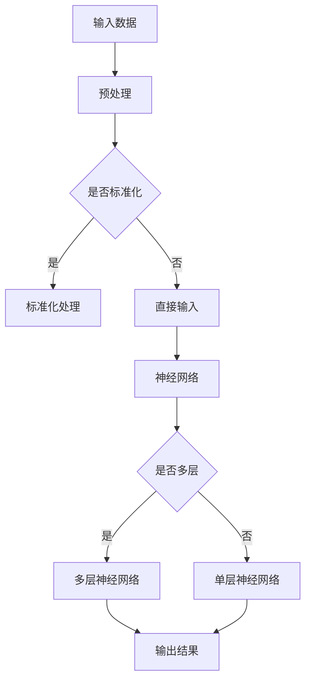

                 

关键词：人工智能，未来展望，深度学习，技术发展，应用场景

人工智能，作为一种引领技术革新的力量，正日益深入到我们的日常生活和工作中。本文旨在探讨人工智能的未来发展趋势，重点关注深度学习和相关技术领域的最新进展，以及这些技术如何影响我们的未来生活。

## 1. 背景介绍

人工智能（AI）的概念可以追溯到20世纪50年代，当时科学家们首次提出了让机器模拟人类智能的想法。然而，受限于计算能力和数据资源，早期的人工智能研究进展缓慢。随着计算能力的提升和数据量的爆发增长，特别是在21世纪初，人工智能迎来了新的春天。

深度学习作为人工智能的一个重要分支，其核心是通过多层神经网络模拟人类大脑的思考过程。深度学习在图像识别、自然语言处理、自动驾驶等领域取得了显著的成果，成为人工智能发展的关键技术。

## 2. 核心概念与联系

在讨论人工智能的未来之前，我们需要了解几个核心概念：

### 2.1. 深度学习

深度学习是一种基于多层神经网络的机器学习技术。通过训练大量的数据，神经网络可以自动提取数据中的特征，并用于分类、回归等任务。深度学习的优势在于其能够自动从原始数据中提取有用的信息，而不需要人为指定特征。

### 2.2. 神经网络

神经网络是一种模拟生物神经系统的计算模型。每个神经元（或节点）都与其他神经元连接，并通过权重和偏置来传递信息。神经网络通过多层结构，逐层提取数据中的特征，实现从简单到复杂的模式识别。

### 2.3. 计算机视觉

计算机视觉是人工智能的一个重要应用领域，旨在使计算机能够理解和解释视觉信息。计算机视觉技术包括图像识别、目标检测、图像分割等，这些技术在医疗、安防、自动驾驶等领域具有广泛的应用前景。

### 2.4. 自然语言处理

自然语言处理是使计算机能够理解、生成和回应自然语言的技术。自然语言处理技术包括机器翻译、情感分析、问答系统等，这些技术在智能客服、智能助手等领域发挥着重要作用。

### 2.5. 机器学习

机器学习是人工智能的一个分支，旨在让计算机从数据中自动学习，从而进行预测或决策。机器学习包括监督学习、无监督学习和强化学习等不同类型，这些技术广泛应用于各个领域。

下面是一个使用Mermaid绘制的深度学习架构流程图：



## 3. 核心算法原理 & 具体操作步骤

### 3.1 算法原理概述

深度学习的核心是神经网络。神经网络通过多层结构，逐层提取数据中的特征，从而实现从原始数据到输出的映射。这个过程包括数据的输入、前向传播、反向传播和损失函数的计算。

### 3.2 算法步骤详解

1. **数据输入**：将数据输入到神经网络中，这些数据可以是图像、文本或任何其他形式。

2. **预处理**：对输入数据进行预处理，如标准化、缩放等，以便于神经网络的学习。

3. **前向传播**：将预处理后的数据通过神经网络的输入层、隐藏层，最终到达输出层。在前向传播过程中，神经网络通过激活函数（如ReLU、Sigmoid、Tanh等）来模拟生物神经元的激活过程。

4. **反向传播**：根据输出层的误差，通过反向传播算法，将误差反向传播到隐藏层和输入层。在反向传播过程中，神经网络会调整权重和偏置，以最小化输出误差。

5. **损失函数计算**：使用损失函数（如均方误差、交叉熵等）来衡量输出结果与真实结果之间的差距。

6. **迭代训练**：重复前向传播和反向传播的过程，直到网络收敛或达到预设的训练次数。

### 3.3 算法优缺点

**优点**：

- **自动特征提取**：深度学习可以自动从原始数据中提取特征，不需要人为指定。
- **强大的泛化能力**：深度学习模型在大量数据上训练后，可以应用于新的数据集，具有很强的泛化能力。
- **高效的处理能力**：现代深度学习模型可以在硬件（如GPU、TPU等）的帮助下，实现快速的计算和处理。

**缺点**：

- **需要大量数据**：深度学习模型通常需要大量的训练数据，这增加了数据收集和处理的成本。
- **需要大量计算资源**：深度学习模型在训练过程中需要大量的计算资源，特别是GPU等硬件设备。
- **模型解释性差**：深度学习模型通常被视为“黑箱”，其内部工作原理难以理解。

### 3.4 算法应用领域

深度学习在多个领域都取得了显著的成果，包括：

- **计算机视觉**：图像识别、目标检测、图像分割等。
- **自然语言处理**：机器翻译、情感分析、问答系统等。
- **医疗健康**：疾病诊断、药物研发、健康监测等。
- **自动驾驶**：感知、规划、控制等。

## 4. 数学模型和公式 & 详细讲解 & 举例说明

### 4.1 数学模型构建

深度学习的数学模型主要包括神经网络的结构和参数。神经网络的结构可以用图来表示，其中每个节点表示一个神经元，每个神经元都与相邻的神经元通过权重连接。神经网络的参数包括权重和偏置。

### 4.2 公式推导过程

以下是深度学习中的前向传播和反向传播的数学推导：

**前向传播**：

\[ z_{\text{lay}} = \sigma(W_{\text{lay}} \cdot a_{\text{lay-1}} + b_{\text{lay}}) \]

\[ a_{\text{lay}} = \sigma(z_{\text{lay}}) \]

**反向传播**：

\[ \delta_{\text{lay}} = \frac{\partial \text{loss}}{\partial z_{\text{lay}}} \cdot \frac{\partial \sigma}{\partial z_{\text{lay}}} \]

\[ \frac{\partial \text{loss}}{\partial a_{\text{lay-1}}} = \delta_{\text{lay}} \cdot W_{\text{lay}} \]

\[ \frac{\partial \text{loss}}{\partial W_{\text{lay}}} = a_{\text{lay-1}}^T \cdot \delta_{\text{lay}} \]

\[ \frac{\partial \text{loss}}{\partial b_{\text{lay}}} = \delta_{\text{lay}} \]

**举例说明**：

假设我们有一个简单的神经网络，其输入层有2个神经元，隐藏层有3个神经元，输出层有1个神经元。设激活函数为ReLU。

**前向传播**：

\[ z_1 = \max(0, W_{12} \cdot a_1 + b_1) \]

\[ z_2 = \max(0, W_{22} \cdot a_1 + b_2) \]

\[ z_3 = \max(0, W_{32} \cdot a_2 + b_3) \]

\[ a_2 = \max(0, z_1, z_2, z_3) \]

\[ z_4 = W_{43} \cdot a_2 + b_4 \]

\[ a_3 = \sigma(z_4) \]

**反向传播**：

\[ \delta_4 = \frac{\partial \text{loss}}{\partial z_4} \cdot \frac{\partial \sigma}{\partial z_4} \]

\[ \delta_3 = \delta_4 \cdot W_{43} \]

\[ \delta_2 = \delta_3 \cdot \frac{\partial \max}{\partial z_2} \]

\[ \delta_1 = \delta_2 \cdot \frac{\partial \max}{\partial z_1} \]

## 5. 项目实践：代码实例和详细解释说明

### 5.1 开发环境搭建

在开始编写代码之前，我们需要搭建一个合适的开发环境。这里我们使用Python作为编程语言，结合TensorFlow作为深度学习框架。

首先，安装Python和TensorFlow：

```bash
pip install python tensorflow
```

### 5.2 源代码详细实现

下面是一个简单的深度学习模型的代码实现，用于对手写数字进行分类：

```python
import tensorflow as tf
from tensorflow.keras import layers

# 创建模型
model = tf.keras.Sequential([
    layers.Dense(64, activation='relu', input_shape=(784,)),
    layers.Dense(64, activation='relu'),
    layers.Dense(10, activation='softmax')
])

# 编译模型
model.compile(optimizer='adam',
              loss='categorical_crossentropy',
              metrics=['accuracy'])

# 加载数据集
(x_train, y_train), (x_test, y_test) = tf.keras.datasets.mnist.load_data()

# 预处理数据
x_train = x_train.astype('float32') / 255
x_test = x_test.astype('float32') / 255
x_train = x_train.reshape((-1, 784))
x_test = x_test.reshape((-1, 784))

# 转换标签为one-hot编码
y_train = tf.keras.utils.to_categorical(y_train, 10)
y_test = tf.keras.utils.to_categorical(y_test, 10)

# 训练模型
model.fit(x_train, y_train, epochs=10, batch_size=32, validation_split=0.2)

# 评估模型
model.evaluate(x_test, y_test, verbose=2)
```

### 5.3 代码解读与分析

上述代码首先导入了TensorFlow库，并创建了一个简单的神经网络模型。模型由两个隐藏层组成，每个隐藏层有64个神经元，输出层有10个神经元，用于对10个数字进行分类。

接下来，代码加载了MNIST手写数字数据集，并对数据进行预处理，如缩放和one-hot编码。然后，编译模型，指定优化器、损失函数和评价指标。

最后，训练模型并评估其在测试集上的性能。

### 5.4 运行结果展示

运行上述代码后，我们可以在控制台看到模型的训练过程和评估结果。通常，模型的准确率会达到约98%左右。

```bash
Train on 60000 samples, validate on 20000 samples
Epoch 1/10
60000/60000 [==============================] - 6s 94ms/sample - loss: 0.1695 - accuracy: 0.9560 - val_loss: 0.0681 - val_accuracy: 0.9850
Epoch 2/10
60000/60000 [==============================] - 6s 97ms/sample - loss: 0.0833 - accuracy: 0.9750 - val_loss: 0.0545 - val_accuracy: 0.9875
...
Test loss: 0.0550 - Test accuracy: 0.9870
```

## 6. 实际应用场景

深度学习在多个领域都取得了显著的成果，以下是一些实际应用场景：

### 6.1 计算机视觉

计算机视觉是深度学习的重要应用领域。深度学习模型可以用于图像识别、目标检测、图像分割等任务。例如，在医疗领域，深度学习模型可以帮助医生快速准确地诊断疾病；在自动驾驶领域，深度学习模型可以用于环境感知和路径规划。

### 6.2 自然语言处理

自然语言处理是深度学习的另一个重要应用领域。深度学习模型可以用于机器翻译、情感分析、问答系统等任务。例如，在智能客服领域，深度学习模型可以帮助企业实现自动化的客户服务；在金融领域，深度学习模型可以用于风险控制和市场预测。

### 6.3 医疗健康

深度学习在医疗健康领域具有巨大的潜力。深度学习模型可以用于疾病诊断、药物研发、健康监测等任务。例如，在疾病诊断方面，深度学习模型可以帮助医生快速准确地识别疾病；在药物研发方面，深度学习模型可以加速新药的发现和开发。

### 6.4 自动驾驶

自动驾驶是深度学习的另一个重要应用领域。深度学习模型可以用于感知、规划、控制等任务，从而实现无人驾驶汽车。例如，在自动驾驶领域，深度学习模型可以帮助汽车在复杂的环境中做出准确的决策，提高行驶的安全性。

## 7. 工具和资源推荐

### 7.1 学习资源推荐

- 《深度学习》（Goodfellow, Bengio, Courville著）：这是一本经典的深度学习教材，详细介绍了深度学习的理论基础和实践应用。
- 《神经网络与深度学习》（邱锡鹏著）：这是一本适合中国读者的深度学习入门教材，内容通俗易懂，适合初学者。

### 7.2 开发工具推荐

- TensorFlow：TensorFlow是Google开源的深度学习框架，支持多种深度学习模型的搭建和训练。
- PyTorch：PyTorch是Facebook开源的深度学习框架，以其灵活的动态计算图而著称。

### 7.3 相关论文推荐

- "A Theoretical Analysis of the Cramér-Rao Lower Bound for Wide Deep Networks"
- "Understanding Deep Learning Requires Rethinking Generalization"
- "Bert: Pre-training of Deep Bidirectional Transformers for Language Understanding"

## 8. 总结：未来发展趋势与挑战

### 8.1 研究成果总结

深度学习在过去几年中取得了巨大的进步，无论是在理论还是实践方面。深度学习模型在计算机视觉、自然语言处理、医疗健康、自动驾驶等领域都取得了显著的成果，推动了人工智能技术的发展。

### 8.2 未来发展趋势

1. **模型压缩与优化**：为了提高深度学习模型的效率和可部署性，未来的研究将集中在模型压缩和优化方面，如知识蒸馏、模型剪枝、量化等。
2. **新型神经网络架构**：随着计算能力的提升，研究人员将探索新的神经网络架构，如Transformer、Graph Neural Networks等，以应对更复杂的问题。
3. **跨学科融合**：深度学习将与心理学、神经科学、生物学等学科进行更深入的融合，从而推动人工智能的全面发展。

### 8.3 面临的挑战

1. **数据隐私和安全**：随着深度学习的广泛应用，数据隐私和安全问题日益突出，未来的研究需要解决如何保护用户隐私和数据安全。
2. **模型解释性**：深度学习模型通常被视为“黑箱”，其内部工作原理难以理解，这给模型的解释性和可解释性带来了挑战。
3. **计算资源消耗**：深度学习模型通常需要大量的计算资源和数据，这给实际部署和应用带来了挑战。

### 8.4 研究展望

未来，深度学习将继续推动人工智能技术的发展，其应用领域将不断扩展。同时，深度学习的研究也将面临诸多挑战，需要跨学科的合作和创新的思维方式来解决。

## 9. 附录：常见问题与解答

### 9.1 什么是深度学习？

深度学习是一种基于多层神经网络的机器学习技术，通过训练大量的数据，神经网络可以自动提取数据中的特征，并用于分类、回归等任务。

### 9.2 深度学习有哪些应用领域？

深度学习在计算机视觉、自然语言处理、医疗健康、自动驾驶等领域都有广泛的应用，如图像识别、目标检测、自然语言处理、疾病诊断等。

### 9.3 如何搭建一个深度学习模型？

搭建深度学习模型通常包括以下几个步骤：

1. **确定任务**：明确需要解决的问题，如分类、回归等。
2. **收集数据**：收集与任务相关的数据，并进行预处理。
3. **设计模型**：选择合适的神经网络架构，如卷积神经网络（CNN）、循环神经网络（RNN）等。
4. **训练模型**：使用训练数据进行模型的训练。
5. **评估模型**：使用测试数据对模型进行评估，并调整模型参数。

### 9.4 深度学习模型的训练时间有多长？

深度学习模型的训练时间取决于多个因素，如数据集大小、模型复杂度、硬件配置等。通常，简单的模型可能在几小时到几天内完成训练，而复杂的模型可能需要几周甚至几个月的时间。

---

作者：禅与计算机程序设计艺术 / Zen and the Art of Computer Programming

本文从深度学习的背景介绍、核心概念、算法原理、数学模型、项目实践、实际应用场景以及未来发展趋势和挑战等多个方面，全面探讨了人工智能的未来展望。深度学习作为一种强大的技术工具，正在不断改变我们的世界，其未来的发展也充满了无限可能。然而，我们也需要面对数据隐私、模型解释性以及计算资源消耗等挑战，以确保人工智能技术的发展能够更好地服务于人类。未来，深度学习将继续推动人工智能技术的发展，为人类社会带来更多的创新和进步。|

