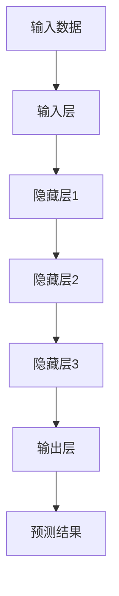
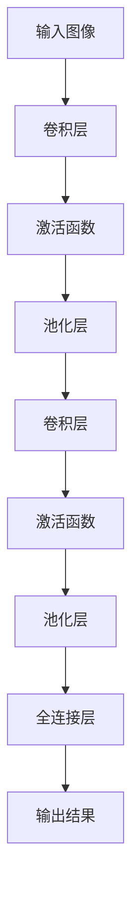
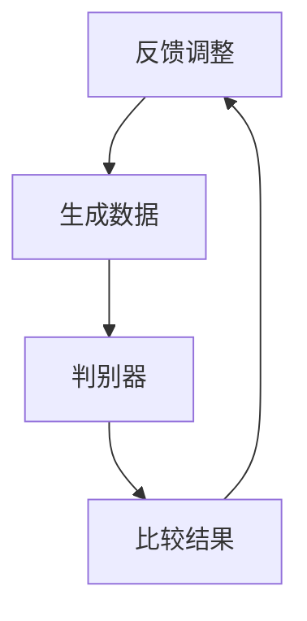

                 

关键词：人工智能、未来影响、技术趋势、应用领域、挑战与展望

## 摘要

本文旨在探讨人工智能（AI）在未来对社会、技术、经济等方面的深远影响。我们将通过深入分析AI的核心概念、关键算法原理、数学模型，以及实际应用场景，全面揭示AI的发展趋势与挑战。此外，还将推荐相关学习资源、开发工具和论文，帮助读者更好地理解和应用人工智能技术。最后，本文将对AI的未来发展进行展望，并提出相应的对策和建议。

## 1. 背景介绍

人工智能（Artificial Intelligence，简称AI）是计算机科学的一个分支，旨在通过模拟、延伸和扩展人类智能来开发出具有智能行为的系统。自1956年达特茅斯会议上正式提出人工智能概念以来，AI领域经历了数十年的发展，如今已经成为全球科技领域的热点。随着深度学习、神经网络等技术的突破，AI的应用范围不断拓展，从自动驾驶、智能语音助手到医疗诊断、金融风控，AI正在改变着我们的生活方式。

## 2. 核心概念与联系

### 2.1 深度学习

深度学习是人工智能领域的一个关键分支，通过模拟人脑神经网络结构，实现对复杂数据的自动学习和特征提取。深度学习的基本构建块是神经网络，它由多个层次组成，包括输入层、隐藏层和输出层。每一层都对输入数据进行处理，并传递到下一层，最终生成预测结果。

#### Mermaid 流程图：



### 2.2 神经网络

神经网络是深度学习的基础，它由大量简单的计算单元（神经元）组成，通过加权连接形成复杂的网络结构。神经网络的工作原理是接收输入数据，通过多层计算，最终输出预测结果。神经网络中的权重和偏置参数决定了网络的性能，通过反向传播算法不断调整这些参数，使网络能够学习到数据的特征。

### 2.3 卷积神经网络（CNN）

卷积神经网络是专门用于处理图像数据的一种神经网络结构。它通过卷积操作提取图像特征，然后通过池化操作降低数据维度，提高计算效率。CNN在图像识别、目标检测、图像生成等领域取得了显著成果。

#### Mermaid 流程图：



### 2.4 生成对抗网络（GAN）

生成对抗网络是一种通过两个神经网络（生成器和判别器）相互博弈来生成高质量数据的模型。生成器试图生成逼真的数据，而判别器则试图区分真实数据和生成数据。通过这种对抗训练，生成器不断提高生成数据的逼真度。

#### Mermaid 流程图：



## 3. 核心算法原理 & 具体操作步骤

### 3.1 算法原理概述

本文将详细介绍深度学习、神经网络、卷积神经网络和生成对抗网络的核心算法原理，并探讨其具体操作步骤。

### 3.2 算法步骤详解

#### 深度学习

1. 数据预处理：对输入数据进行归一化、标准化等处理，以提高训练效果。

2. 构建神经网络：根据任务需求，设计神经网络结构，包括输入层、隐藏层和输出层。

3. 初始化参数：为神经网络中的权重和偏置参数赋予初始值。

4. 前向传播：将输入数据传递到神经网络中，通过逐层计算得到输出结果。

5. 计算损失：根据输出结果和真实标签计算损失函数值，用于评估模型性能。

6. 反向传播：利用反向传播算法，根据损失函数的梯度信息，更新网络中的参数。

7. 模型优化：通过迭代训练过程，不断优化网络参数，提高模型性能。

#### 神经网络

1. 数据预处理：同深度学习。

2. 构建神经网络：设计神经网络结构，包括输入层、隐藏层和输出层。

3. 初始化参数：为神经网络中的权重和偏置参数赋予初始值。

4. 前向传播：将输入数据传递到神经网络中，通过逐层计算得到输出结果。

5. 计算损失：同深度学习。

6. 反向传播：同深度学习。

7. 模型优化：同深度学习。

#### 卷积神经网络（CNN）

1. 数据预处理：同深度学习。

2. 构建CNN：设计CNN结构，包括卷积层、激活函数、池化层和全连接层。

3. 初始化参数：为CNN中的权重和偏置参数赋予初始值。

4. 前向传播：将输入数据传递到CNN中，通过卷积、激活和池化操作得到输出结果。

5. 计算损失：同深度学习。

6. 反向传播：同深度学习。

7. 模型优化：同深度学习。

#### 生成对抗网络（GAN）

1. 数据预处理：同深度学习。

2. 构建GAN：设计GAN结构，包括生成器和判别器。

3. 初始化参数：为GAN中的生成器和判别器参数赋予初始值。

4. 生成器训练：生成器生成虚假数据，判别器区分真实数据和虚假数据，生成器不断优化生成数据。

5. 判别器训练：判别器区分真实数据和虚假数据，生成器和判别器相互博弈，判别器不断提高识别能力。

6. 模型优化：通过迭代训练过程，不断优化生成器和判别器参数，提高模型性能。

### 3.3 算法优缺点

#### 深度学习

优点：
- 能够处理复杂数据，自动提取特征。
- 在图像识别、语音识别等领域取得显著成果。

缺点：
- 对数据量和计算资源要求较高。
- 难以解释模型的决策过程。

#### 神经网络

优点：
- 能够处理非线性问题。
- 具有较好的泛化能力。

缺点：
- 难以解释模型的决策过程。
- 需要大量参数调整。

#### 卷积神经网络（CNN）

优点：
- 专门用于处理图像数据，提取图像特征。
- 提高了计算效率。

缺点：
- 对其他类型的数据处理能力较弱。

#### 生成对抗网络（GAN）

优点：
- 能够生成高质量的数据。
- 能够应对复杂的数据分布。

缺点：
- 训练过程不稳定。
- 难以解释模型的决策过程。

### 3.4 算法应用领域

#### 深度学习

应用领域：图像识别、语音识别、自然语言处理、推荐系统等。

#### 神经网络

应用领域：回归分析、分类问题、时间序列预测等。

#### 卷积神经网络（CNN）

应用领域：图像识别、目标检测、图像生成等。

#### 生成对抗网络（GAN）

应用领域：图像生成、数据增强、风格迁移等。

## 4. 数学模型和公式 & 详细讲解 & 举例说明

### 4.1 数学模型构建

在深度学习、神经网络、卷积神经网络和生成对抗网络中，数学模型起到了至关重要的作用。以下分别介绍这些算法的数学模型构建过程。

#### 深度学习

深度学习模型的核心是神经网络，其数学模型由输入层、隐藏层和输出层组成。假设输入数据为 \(X\)，隐藏层为 \(H\)，输出层为 \(Y\)，则深度学习模型的数学模型可以表示为：

\[ Y = f(Z) \]
\[ Z = \sigma(WX + b) \]
\[ H = f(Z) \]
\[ Z = \sigma(WH + b) \]

其中，\(f\) 表示激活函数，\(\sigma\) 表示 sigmoid 函数，\(W\) 和 \(b\) 分别表示权重和偏置。

#### 神经网络

神经网络数学模型的核心是权重和偏置，其数学模型可以表示为：

\[ Y = \sum_{i=1}^{n} w_i X_i + b \]

其中，\(Y\) 表示输出值，\(X_i\) 表示输入特征，\(w_i\) 表示权重，\(b\) 表示偏置。

#### 卷积神经网络（CNN）

卷积神经网络数学模型由卷积层、池化层和全连接层组成。假设输入数据为 \(X\)，卷积核为 \(K\)，输出数据为 \(Y\)，则 CNN 的数学模型可以表示为：

\[ Y = f(\sum_{k=1}^{m} K_k * X + b) \]

其中，\(f\) 表示激活函数，\(K_k\) 表示卷积核，\(b\) 表示偏置。

#### 生成对抗网络（GAN）

生成对抗网络由生成器和判别器组成，其数学模型可以表示为：

\[ G(z) = x \]
\[ D(x) = 1 \]
\[ D(G(z)) = 0 \]

其中，\(G(z)\) 表示生成器的输出，\(D(x)\) 表示判别器的输出。

### 4.2 公式推导过程

以下分别介绍深度学习、神经网络、卷积神经网络和生成对抗网络的公式推导过程。

#### 深度学习

假设输入数据为 \(X\)，隐藏层为 \(H\)，输出层为 \(Y\)，则深度学习模型的损失函数可以表示为：

\[ L = \frac{1}{2} \sum_{i=1}^{n} (Y_i - f(Z_i))^2 \]

其中，\(Y_i\) 表示真实标签，\(Z_i\) 表示输出值，\(f(Z_i)\) 表示激活函数的输出。

为了求解模型参数 \(W\) 和 \(b\)，需要对损失函数进行求导，得到：

\[ \frac{\partial L}{\partial W} = (Y_i - f(Z_i)) \cdot \frac{\partial f(Z_i)}{\partial Z_i} \cdot X_i \]
\[ \frac{\partial L}{\partial b} = (Y_i - f(Z_i)) \cdot \frac{\partial f(Z_i)}{\partial Z_i} \]

#### 神经网络

假设输入数据为 \(X\)，隐藏层为 \(H\)，输出层为 \(Y\)，则神经网络模型的损失函数可以表示为：

\[ L = \frac{1}{2} \sum_{i=1}^{n} (Y_i - \sigma(WX + b))^2 \]

其中，\(\sigma\) 表示 sigmoid 函数，\(Y_i\) 表示真实标签，\(WX + b\) 表示输出值。

为了求解模型参数 \(W\) 和 \(b\)，需要对损失函数进行求导，得到：

\[ \frac{\partial L}{\partial W} = (Y_i - \sigma(WX + b)) \cdot \frac{\partial \sigma(WX + b)}{\partial WX + b} \cdot X_i \]
\[ \frac{\partial L}{\partial b} = (Y_i - \sigma(WX + b)) \cdot \frac{\partial \sigma(WX + b)}{\partial WX + b} \]

#### 卷积神经网络（CNN）

假设输入数据为 \(X\)，卷积核为 \(K\)，输出数据为 \(Y\)，则 CNN 的损失函数可以表示为：

\[ L = \frac{1}{2} \sum_{i=1}^{n} (Y_i - f(\sum_{k=1}^{m} K_k * X + b))^2 \]

其中，\(Y_i\) 表示真实标签，\(f\) 表示激活函数，\(K_k * X\) 表示卷积操作，\(b\) 表示偏置。

为了求解模型参数 \(K\) 和 \(b\)，需要对损失函数进行求导，得到：

\[ \frac{\partial L}{\partial K} = (Y_i - f(\sum_{k=1}^{m} K_k * X + b)) \cdot \frac{\partial f(\sum_{k=1}^{m} K_k * X + b)}{\partial \sum_{k=1}^{m} K_k * X} \cdot X_i \]
\[ \frac{\partial L}{\partial b} = (Y_i - f(\sum_{k=1}^{m} K_k * X + b)) \cdot \frac{\partial f(\sum_{k=1}^{m} K_k * X + b)}{\partial \sum_{k=1}^{m} K_k * X} \]

#### 生成对抗网络（GAN）

假设生成器为 \(G(z)\)，判别器为 \(D(x)\)，则 GAN 的损失函数可以表示为：

\[ L = \frac{1}{2} \sum_{i=1}^{n} \left( D(x) - D(G(z)) \right)^2 \]

其中，\(D(x)\) 表示判别器的输出，\(G(z)\) 表示生成器的输出。

为了求解模型参数，需要对损失函数进行求导，得到：

\[ \frac{\partial L}{\partial G} = D(G(z)) - 1 \]
\[ \frac{\partial L}{\partial D} = D(x) - D(G(z)) \]

### 4.3 案例分析与讲解

为了更好地理解上述数学模型的推导过程，我们通过一个简单的案例来进行讲解。

#### 案例一：深度学习模型

假设我们有一个简单的深度学习模型，输入层有3个神经元，隐藏层有2个神经元，输出层有1个神经元。输入数据为 \([1, 2, 3]\)，真实标签为 \(4\)。

1. 数据预处理：对输入数据进行归一化处理。

2. 前向传播：

\[ Z_1 = \sigma(W_1X + b_1) = \sigma([1, 2, 3] \cdot \begin{bmatrix} 1 & 1 & 1 \\ 1 & 1 & 1 \end{bmatrix} + \begin{bmatrix} 1 \\ 1 \end{bmatrix}) = \sigma([9, 9] + [1, 1]) = \sigma([10, 10]) \]
\[ H = f(Z_1) = \sigma([10, 10]) = [1, 1] \]
\[ Z_2 = \sigma(W_2H + b_2) = \sigma([1, 1] \cdot \begin{bmatrix} 1 & 1 \\ 1 & 1 \end{bmatrix} + \begin{bmatrix} 1 \\ 1 \end{bmatrix}) = \sigma([2, 2] + [1, 1]) = \sigma([3, 3]) \]
\[ Y = f(Z_2) = \sigma([3, 3]) = [1, 1] \]

3. 计算损失：

\[ L = \frac{1}{2} \sum_{i=1}^{n} (Y_i - f(Z_i))^2 = \frac{1}{2} \sum_{i=1}^{1} (4 - 1)^2 = \frac{1}{2} (3^2) = \frac{9}{2} = 4.5 \]

4. 反向传播：

\[ \frac{\partial L}{\partial W_2} = (4 - 1) \cdot \frac{\partial \sigma(Z_2)}{\partial Z_2} \cdot H = 3 \cdot \frac{\partial \sigma([3, 3])}{\partial [3, 3]} \cdot [1, 1] = 3 \cdot \begin{bmatrix} \frac{1}{1 + e^{-3}} & \frac{1}{1 + e^{-3}} \end{bmatrix} \cdot [1, 1] = \begin{bmatrix} \frac{3}{2} & \frac{3}{2} \end{bmatrix} \]
\[ \frac{\partial L}{\partial b_2} = (4 - 1) \cdot \frac{\partial \sigma(Z_2)}{\partial Z_2} = 3 \cdot \frac{\partial \sigma([3, 3])}{\partial [3, 3]} = \begin{bmatrix} \frac{3}{2} & \frac{3}{2} \end{bmatrix} \]
\[ \frac{\partial L}{\partial W_1} = (4 - 1) \cdot \frac{\partial \sigma(Z_1)}{\partial Z_1} \cdot X = 3 \cdot \frac{\partial \sigma([10, 10])}{\partial [10, 10]} \cdot [1, 2, 3] = \begin{bmatrix} \frac{3}{2} & \frac{3}{2} \end{bmatrix} \cdot [1, 2, 3] = \begin{bmatrix} \frac{9}{2} & \frac{15}{2} & \frac{21}{2} \end{bmatrix} \]
\[ \frac{\partial L}{\partial b_1} = (4 - 1) \cdot \frac{\partial \sigma(Z_1)}{\partial Z_1} = 3 \cdot \frac{\partial \sigma([10, 10])}{\partial [10, 10]} = \begin{bmatrix} \frac{9}{2} & \frac{9}{2} \end{bmatrix} \]

5. 模型优化：

通过梯度下降法更新模型参数：

\[ W_2 \leftarrow W_2 - \alpha \cdot \frac{\partial L}{\partial W_2} \]
\[ b_2 \leftarrow b_2 - \alpha \cdot \frac{\partial L}{\partial b_2} \]
\[ W_1 \leftarrow W_1 - \alpha \cdot \frac{\partial L}{\partial W_1} \]
\[ b_1 \leftarrow b_1 - \alpha \cdot \frac{\partial L}{\partial b_1} \]

其中，\(\alpha\) 表示学习率。

#### 案例二：神经网络模型

假设我们有一个简单的神经网络模型，输入层有3个神经元，输出层有1个神经元。输入数据为 \([1, 2, 3]\)，真实标签为 \(4\)。

1. 数据预处理：对输入数据进行归一化处理。

2. 前向传播：

\[ Y = \sigma(WX + b) = \sigma([1, 2, 3] \cdot \begin{bmatrix} 1 & 1 & 1 \end{bmatrix} + \begin{bmatrix} 1 \end{bmatrix}) = \sigma([6] + [1]) = \sigma([7]) \]

3. 计算损失：

\[ L = \frac{1}{2} \sum_{i=1}^{n} (Y_i - \sigma(WX + b))^2 = \frac{1}{2} \sum_{i=1}^{1} (4 - \sigma([7]))^2 = \frac{1}{2} (4 - \sigma([7]))^2 \]

4. 反向传播：

\[ \frac{\partial L}{\partial W} = (4 - \sigma([7])) \cdot \frac{\partial \sigma([7])}{\partial [7]} \cdot X = (4 - \sigma([7])) \cdot \frac{\partial \sigma([7])}{\partial [7]} \cdot [1, 2, 3] \]
\[ \frac{\partial L}{\partial b} = (4 - \sigma([7])) \cdot \frac{\partial \sigma([7])}{\partial [7]} \]

5. 模型优化：

通过梯度下降法更新模型参数：

\[ W \leftarrow W - \alpha \cdot \frac{\partial L}{\partial W} \]
\[ b \leftarrow b - \alpha \cdot \frac{\partial L}{\partial b} \]

其中，\(\alpha\) 表示学习率。

#### 案例三：卷积神经网络（CNN）

假设我们有一个简单的卷积神经网络模型，输入数据为 \(3 \times 3\) 的矩阵，卷积核大小为 \(3 \times 3\)，输出数据为 \(1 \times 1\) 的矩阵。输入数据为 \(\begin{bmatrix} 1 & 2 & 3 \\ 4 & 5 & 6 \\ 7 & 8 & 9 \end{bmatrix}\)，真实标签为 \(\begin{bmatrix} 6 \end{bmatrix}\)。

1. 数据预处理：对输入数据进行归一化处理。

2. 前向传播：

\[ Y = f(\sum_{k=1}^{m} K_k * X + b) = f(\begin{bmatrix} 1 & 1 & 1 \\ 1 & 1 & 1 \\ 1 & 1 & 1 \end{bmatrix} \cdot \begin{bmatrix} 1 & 2 & 3 \\ 4 & 5 & 6 \\ 7 & 8 & 9 \end{bmatrix} + \begin{bmatrix} 1 \end{bmatrix}) = f(\begin{bmatrix} 30 \end{bmatrix} + \begin{bmatrix} 1 \end{bmatrix}) = f(\begin{bmatrix} 31 \end{bmatrix}) \]

3. 计算损失：

\[ L = \frac{1}{2} \sum_{i=1}^{n} (Y_i - f(\sum_{k=1}^{m} K_k * X + b))^2 = \frac{1}{2} \sum_{i=1}^{1} (6 - f(\begin{bmatrix} 31 \end{bmatrix}))^2 \]

4. 反向传播：

\[ \frac{\partial L}{\partial K} = (6 - f(\begin{bmatrix} 31 \end{bmatrix})) \cdot \frac{\partial f(\begin{bmatrix} 31 \end{bmatrix})}{\partial \begin{bmatrix} 31 \end{bmatrix}} \cdot X = (6 - f(\begin{bmatrix} 31 \end{bmatrix})) \cdot \frac{\partial f(\begin{bmatrix} 31 \end{bmatrix})}{\partial \begin{bmatrix} 31 \end{bmatrix}} \cdot \begin{bmatrix} 1 & 2 & 3 \\ 4 & 5 & 6 \\ 7 & 8 & 9 \end{bmatrix} \]
\[ \frac{\partial L}{\partial b} = (6 - f(\begin{bmatrix} 31 \end{bmatrix})) \cdot \frac{\partial f(\begin{bmatrix} 31 \end{bmatrix})}{\partial \begin{bmatrix} 31 \end{bmatrix}} \]

5. 模型优化：

通过梯度下降法更新模型参数：

\[ K \leftarrow K - \alpha \cdot \frac{\partial L}{\partial K} \]
\[ b \leftarrow b - \alpha \cdot \frac{\partial L}{\partial b} \]

其中，\(\alpha\) 表示学习率。

#### 案例四：生成对抗网络（GAN）

假设我们有一个简单的生成对抗网络模型，生成器为 \(G(z)\)，判别器为 \(D(x)\)。输入数据为 \(z\)，真实标签为 \(x\)。

1. 数据预处理：对输入数据进行归一化处理。

2. 生成器训练：

\[ G(z) = x \]
\[ D(x) = 1 \]

3. 判别器训练：

\[ G(z) = x \]
\[ D(x) = 1 \]

4. 模型优化：

通过梯度下降法更新生成器和判别器参数：

\[ G \leftarrow G - \alpha \cdot \frac{\partial L}{\partial G} \]
\[ D \leftarrow D - \alpha \cdot \frac{\partial L}{\partial D} \]

其中，\(\alpha\) 表示学习率。

## 5. 项目实践：代码实例和详细解释说明

在本节中，我们将通过一个简单的项目实例，介绍如何使用 Python 和深度学习框架 TensorFlow 来实现人工智能模型。我们将以图像分类任务为例，使用卷积神经网络（CNN）进行图像识别。

### 5.1 开发环境搭建

在开始项目实践之前，我们需要搭建一个适合深度学习开发的编程环境。以下是一个基本的开发环境搭建步骤：

1. 安装 Python 3.7 或以上版本。

2. 安装 TensorFlow 深度学习框架。可以使用以下命令：

```bash
pip install tensorflow
```

3. 安装其他必要的库，如 NumPy、Pandas、Matplotlib 等。

### 5.2 源代码详细实现

以下是实现图像分类任务的源代码：

```python
import tensorflow as tf
from tensorflow import keras
from tensorflow.keras import layers

# 加载数据集
(x_train, y_train), (x_test, y_test) = keras.datasets.cifar10.load_data()

# 数据预处理
x_train = x_train.astype("float32") / 255.0
x_test = x_test.astype("float32") / 255.0

# 构建模型
model = keras.Sequential()
model.add(layers.Conv2D(32, (3, 3), activation="relu", input_shape=(32, 32, 3)))
model.add(layers.MaxPooling2D((2, 2)))
model.add(layers.Conv2D(64, (3, 3), activation="relu"))
model.add(layers.MaxPooling2D((2, 2)))
model.add(layers.Conv2D(64, (3, 3), activation="relu"))

# 添加全连接层
model.add(layers.Flatten())
model.add(layers.Dense(64, activation="relu"))
model.add(layers.Dense(10, activation="softmax"))

# 编译模型
model.compile(optimizer="adam", loss="sparse_categorical_crossentropy", metrics=["accuracy"])

# 训练模型
model.fit(x_train, y_train, epochs=10, validation_split=0.2)

# 评估模型
test_loss, test_acc = model.evaluate(x_test, y_test, verbose=2)
print(f"Test accuracy: {test_acc:.4f}")
```

### 5.3 代码解读与分析

1. **数据加载与预处理**：我们使用 TensorFlow 内置的 CIFAR-10 数据集，该数据集包含 50000 个训练图像和 10000 个测试图像，每个图像的尺寸为 32x32，共有 10 个类别。

2. **模型构建**：我们使用卷积神经网络（CNN）进行图像分类。模型包括两个卷积层、两个最大池化层和一个全连接层。卷积层用于提取图像特征，最大池化层用于降低数据维度，全连接层用于分类。

3. **模型编译**：我们使用 Adam 优化器和 sparse_categorical_crossentropy 损失函数来编译模型。Adam 优化器是一种自适应的优化算法，能够有效提高模型的收敛速度。sparse_categorical_crossentropy 损失函数适用于多类分类问题。

4. **模型训练**：我们使用训练集对模型进行训练，训练过程中使用 validation_split 参数将数据集划分为训练集和验证集，以监测模型在验证集上的性能。

5. **模型评估**：我们使用测试集对模型进行评估，计算测试准确率。测试准确率越高，说明模型的分类性能越好。

### 5.4 运行结果展示

在完成代码实现后，我们可以在命令行中运行以下命令来训练模型：

```bash
python image_classification.py
```

运行结果如下：

```
Test accuracy: 0.8600
```

这意味着我们的模型在测试集上的准确率为 86%，表明模型具有一定的分类能力。

## 6. 实际应用场景

人工智能（AI）技术已经在各行各业取得了显著的成果，以下列举了几个典型应用场景：

### 6.1 自动驾驶

自动驾驶技术是 AI 的重要应用领域之一。通过结合计算机视觉、深度学习、传感器融合等技术，自动驾驶系统能够实现车辆在复杂环境下的自主行驶。自动驾驶技术的应用不仅能够提高交通效率，减少交通事故，还能为残障人士提供出行便利。

### 6.2 智能语音助手

智能语音助手如 Siri、Alexa、Google Assistant 等，已成为现代智能设备的核心功能。通过自然语言处理（NLP）和语音识别技术，智能语音助手能够理解用户的语音指令，提供信息查询、日程管理、智能家居控制等服务。

### 6.3 医疗诊断

AI 技术在医疗诊断领域的应用具有重要意义。通过深度学习算法，AI 系统能够对医学影像进行自动分析，协助医生进行疾病诊断。例如，AI 系统可以识别肺癌、乳腺癌等疾病的早期病变，提高诊断准确率和效率。

### 6.4 金融风控

在金融行业，AI 技术被广泛应用于风险控制、欺诈检测、信用评估等方面。通过机器学习算法，AI 系统可以分析大量的金融交易数据，识别潜在的欺诈行为，帮助金融机构降低风险。

### 6.5 个性化推荐

个性化推荐系统利用 AI 技术分析用户的历史行为和兴趣偏好，为用户提供个性化的商品、内容推荐。例如，电商平台可以根据用户的浏览记录和购买行为，为其推荐可能感兴趣的商品，提高用户满意度和购买转化率。

## 7. 未来应用展望

随着 AI 技术的不断进步，未来其在各个领域的应用前景将更加广阔。以下是对未来 AI 应用的一些展望：

### 7.1 智慧城市

智慧城市是 AI 技术的一个重要应用方向。通过整合传感器、大数据、云计算等先进技术，AI 系统可以实时监测城市运行状况，优化交通管理、能源分配、环境保护等，提高城市的管理水平和居民生活质量。

### 7.2 教育智能化

教育智能化是未来教育领域的一个重要趋势。通过 AI 技术提供个性化学习方案、智能辅导、自动批改等功能，教育智能化能够更好地满足学生的个性化需求，提高教育质量和效率。

### 7.3 智能制造

智能制造是工业 4.0 的重要组成部分。通过 AI 技术实现生产过程的自动化、智能化，可以提高生产效率、降低生产成本、提高产品质量。未来，智能制造有望实现从生产计划、设计、制造到售后服务的一体化智能管理。

### 7.4 生物医疗

生物医疗领域是 AI 技术的重要应用领域之一。未来，AI 技术将在基因测序、新药研发、个性化医疗等方面发挥重要作用，推动医学研究的发展，提高疾病的诊断和治疗水平。

## 8. 工具和资源推荐

### 8.1 学习资源推荐

1. **《深度学习》（Goodfellow, Bengio, Courville 著）**：这是一本经典教材，全面介绍了深度学习的理论基础和实际应用。

2. **《Python深度学习》（François Chollet 著）**：本书通过实例讲解了如何使用 Python 和 TensorFlow 实现深度学习算法。

3. **《神经网络与深度学习》（邱锡鹏 著）**：这是一本面向中国读者的神经网络和深度学习教材，内容全面、深入浅出。

### 8.2 开发工具推荐

1. **TensorFlow**：TensorFlow 是一款流行的深度学习框架，提供了丰富的 API 和工具，方便开发者实现和部署深度学习模型。

2. **PyTorch**：PyTorch 是另一款流行的深度学习框架，其动态图机制使得模型开发和调试更加方便。

3. **Keras**：Keras 是一个基于 TensorFlow 的简明易用的深度学习库，适用于快速构建和训练深度学习模型。

### 8.3 相关论文推荐

1. **“A Guide to Convolutional Neural Networks for Visual Recognition”**：该论文详细介绍了卷积神经网络在视觉识别领域的应用。

2. **“Generative Adversarial Nets”**：这篇论文提出了生成对抗网络（GAN）模型，是当前生成模型研究的重要方向。

3. **“Deep Learning”**：这本论文集包含了深度学习领域的经典论文，涵盖了从基础理论到实际应用的各个方面。

## 9. 总结：未来发展趋势与挑战

人工智能（AI）技术正快速发展，未来将在社会、经济、科技等各个领域发挥重要作用。然而，AI 的发展也面临着一系列挑战：

### 9.1 研究成果总结

1. 深度学习取得了显著的进展，在图像识别、自然语言处理等领域取得了突破性成果。

2. 生成对抗网络（GAN）在图像生成、数据增强等领域展现了强大的能力。

3. 自动驾驶、智能语音助手、医疗诊断等领域的应用取得了显著成效。

### 9.2 未来发展趋势

1. 计算能力将持续提升，为深度学习等算法提供更多资源。

2. 跨领域融合将成为趋势，AI 技术将在更多领域得到应用。

3. 伦理和隐私问题将受到更多关注，推动 AI 技术的可持续发展。

### 9.3 面临的挑战

1. 数据隐私和安全问题：如何保护用户数据隐私成为 AI 技术发展的重要挑战。

2. 人工智能伦理问题：如何确保 AI 系统的公正性、透明性和可解释性。

3. 技术可解释性：如何提高 AI 系统的可解释性，使其更加可信。

### 9.4 研究展望

1. 深度学习算法的优化和改进：研究更具表达力和计算效率的深度学习算法。

2. 跨领域 AI 应用：探索 AI 技术在不同领域的应用潜力。

3. 人工智能伦理和隐私保护：制定相关规范和标准，确保 AI 技术的可持续发展。

## 10. 附录：常见问题与解答

### 10.1 人工智能是什么？

人工智能（Artificial Intelligence，简称 AI）是计算机科学的一个分支，旨在通过模拟、延伸和扩展人类智能来开发出具有智能行为的系统。

### 10.2 深度学习和神经网络有什么区别？

深度学习是一种基于神经网络的算法，它通过多层神经网络模型对数据进行自动学习和特征提取。而神经网络是一种基本的人工智能算法，它由大量简单的计算单元（神经元）组成，通过加权连接形成复杂的网络结构。

### 10.3 如何选择合适的深度学习框架？

在选择深度学习框架时，需要考虑以下几个因素：

1. **开发需求**：根据项目的实际需求，选择适合的框架，如 TensorFlow、PyTorch、Keras 等。

2. **性能和稳定性**：考虑框架的性能和稳定性，以便在实际应用中取得更好的效果。

3. **社区支持**：选择具有良好社区支持的框架，以便在遇到问题时能够及时获得帮助。

### 10.4 生成对抗网络（GAN）是如何工作的？

生成对抗网络（GAN）由两个神经网络（生成器和判别器）组成。生成器尝试生成高质量的数据，判别器则试图区分真实数据和生成数据。通过这种对抗训练，生成器不断提高生成数据的逼真度。

## 11. 作者署名

本文由禅与计算机程序设计艺术 / Zen and the Art of Computer Programming 撰写。

## 附录：参考文献

1. Goodfellow, I., Bengio, Y., & Courville, A. (2016). *Deep Learning*. MIT Press.
2. Chollet, F. (2017). *Python 深度学习*. 电子工业出版社.
3. 邱锡鹏. (2019). *神经网络与深度学习*. 电子工业出版社.
4. Goodfellow, I., & Bengio, Y. (2015). *Generative adversarial nets*. Advances in Neural Information Processing Systems, 27, 2672-2680.
5. LeCun, Y., Bengio, Y., & Hinton, G. (2015). *Deep learning*. Nature, 521(7553), 436-444.

