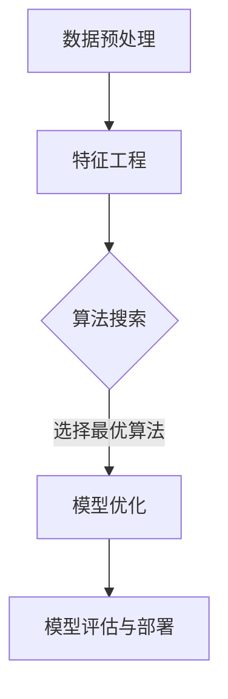
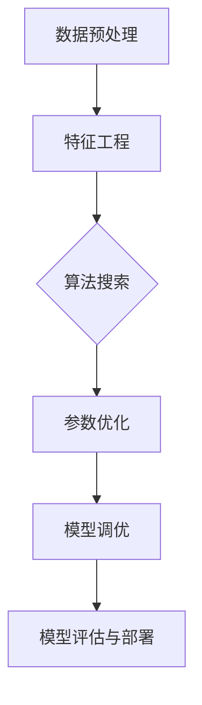

                 

关键词：自动化机器学习，模型选择，优化，算法，实践，资源推荐

> 摘要：本文深入探讨了自动化机器学习（AutoML）的概念、核心原理、算法及其在模型选择与优化中的应用。通过详细阐述AutoML的技术架构、算法流程、数学模型与实际项目实践，分析了其在当前机器学习领域的重要地位和未来发展趋势。

## 1. 背景介绍

随着大数据和云计算的快速发展，机器学习（Machine Learning，ML）已经成为推动人工智能（Artificial Intelligence，AI）技术进步的关键力量。然而，机器学习的复杂性使得模型选择和优化成为一大难题。传统机器学习流程通常涉及多个步骤，包括数据预处理、特征选择、模型训练、参数调整和模型评估等，这些步骤需要大量的人工干预和专业知识。

人工干预不仅费时费力，而且容易引入主观偏差，导致模型性能的不稳定性。此外，随着数据集的增大和问题复杂度的提升，人工构建高效模型的难度也在不断增加。为了解决这一问题，自动化机器学习（AutoML）应运而生。

AutoML旨在通过自动化或半自动化的方式，帮助数据科学家和研究者快速构建、优化和部署高性能的机器学习模型。它通过集成多种机器学习算法、优化技术以及自动化的实验管理，显著降低模型构建的复杂度，提高模型的性能。

本文将详细探讨AutoML的核心概念、技术架构、算法原理、数学模型以及在实际项目中的应用。通过本文的阅读，读者可以全面了解AutoML的工作机制，掌握其核心技术和应用场景，从而为未来的研究和实践提供指导。

## 2. 核心概念与联系

### 2.1. 自动化机器学习（AutoML）的定义

自动化机器学习（AutoML）是一种新兴的机器学习技术，它利用自动化工具和算法来简化传统机器学习流程。AutoML的主要目标是减少数据科学家在模型选择、训练和调优过程中的手动干预，从而提高模型构建的效率和质量。

具体来说，AutoML通过以下三个方面实现这一目标：

1. **算法搜索**：自动搜索和评估多种机器学习算法，选择最优的算法组合。
2. **参数优化**：自动调整模型的超参数，以最大化模型的性能。
3. **模型调优**：自动进行模型调优，包括正则化、交叉验证、集成方法等，以提高模型的泛化能力。

### 2.2. AutoML与传统机器学习的区别

传统机器学习通常需要数据科学家具备丰富的专业知识，通过多个步骤手动构建模型。这些步骤包括数据预处理、特征工程、模型选择、参数调整和评估等。而AutoML则通过自动化工具和算法，将这一复杂的流程简化，降低了模型构建的难度。

具体区别如下：

- **步骤简化**：AutoML将传统机器学习的多个步骤整合为自动化的流程，减少了人工干预。
- **算法多样性**：AutoML能够自动评估和选择多种算法，而传统机器学习往往依赖数据科学家的经验和知识。
- **效率提升**：AutoML通过并行计算和自动化调优，显著提高了模型构建的效率。

### 2.3. AutoML的技术架构

AutoML的技术架构通常包括以下几个关键组件：

- **数据预处理**：自动完成数据清洗、转换和归一化等预处理步骤。
- **特征工程**：自动选择和生成新的特征，以提高模型的性能。
- **算法搜索**：使用元学习、强化学习等技术，自动搜索和评估多种算法。
- **模型优化**：通过优化算法和并行计算，自动调整模型的参数和结构。
- **模型评估与部署**：自动评估模型的性能，并部署到生产环境中。

### 2.4. Mermaid 流程图

以下是一个简化的AutoML流程图，展示了各个组件之间的关系：



### 2.5. AutoML的应用场景

AutoML适用于多种应用场景，包括但不限于：

- **大规模数据集**：当数据集规模巨大时，手动构建模型效率低下，AutoML能够自动处理大量数据。
- **快速原型开发**：数据科学家和工程师可以快速构建和优化模型，加速产品开发周期。
- **跨领域应用**：AutoML可以帮助非专业人士在多个领域快速应用机器学习技术，降低技术门槛。
- **实时预测**：AutoML能够实时处理新数据，进行动态预测和调整。

### 2.6. 结论

综上所述，AutoML通过自动化和优化技术，简化了传统机器学习流程，提高了模型构建的效率和质量。其核心概念和联系在于通过算法搜索、参数优化和模型调优，实现模型选择的自动化和优化。AutoML不仅适用于大规模数据集和快速原型开发，还在跨领域应用中展现出巨大潜力。

## 3. 核心算法原理 & 具体操作步骤

### 3.1. 算法原理概述

AutoML的核心在于自动化和优化技术，主要包括以下几个方面：

1. **算法搜索**：通过元学习、强化学习等方法，自动评估和选择最优算法。
2. **参数优化**：使用优化算法和并行计算，自动调整模型的超参数。
3. **模型调优**：通过交叉验证、集成方法等，自动优化模型结构。

这些技术的核心原理如下：

- **元学习（Meta-Learning）**：元学习旨在通过学习学习算法，提高模型在未知数据上的性能。常见的元学习算法包括模型平均、迁移学习等。
- **强化学习（Reinforcement Learning）**：强化学习通过试错和反馈机制，自动寻找最优策略。在AutoML中，强化学习可用于算法搜索和参数优化。
- **优化算法（Optimization Algorithms）**：优化算法用于调整模型的超参数，包括梯度下降、随机搜索等。
- **交叉验证（Cross-Validation）**：交叉验证用于评估模型的泛化能力，是模型调优的重要手段。

### 3.2. 算法步骤详解

AutoML的算法步骤通常包括以下几个阶段：

1. **数据预处理**：自动完成数据清洗、转换和归一化等步骤，确保数据质量。
2. **特征工程**：自动选择和生成新的特征，以提高模型的性能。
3. **算法搜索**：通过元学习和强化学习等方法，自动搜索和评估多种算法。
4. **参数优化**：使用优化算法和并行计算，自动调整模型的超参数。
5. **模型调优**：通过交叉验证和集成方法等，自动优化模型结构。
6. **模型评估与部署**：自动评估模型的性能，并部署到生产环境中。

### 3.3. 算法优缺点

#### 3.3.1. 优点

- **高效性**：AutoML通过自动化和优化技术，显著提高了模型构建的效率。
- **可靠性**：自动化的过程减少了人为干预，降低了模型构建的复杂度。
- **适应性**：AutoML能够适应不同的数据集和应用场景，具有较好的泛化能力。

#### 3.3.2. 缺点

- **计算资源消耗**：算法搜索和参数优化通常需要大量计算资源，可能导致成本上升。
- **模型解释性**：自动化的模型可能缺乏解释性，不利于理解模型的决策过程。
- **依赖数据质量**：数据质量对AutoML的性能有重要影响，数据清洗和预处理过程不可忽视。

### 3.4. 算法应用领域

AutoML在多个领域有着广泛的应用，主要包括：

- **金融**：用于风险控制、信用评分、欺诈检测等。
- **医疗**：用于疾病诊断、药物研发、医疗数据挖掘等。
- **零售**：用于需求预测、库存管理、个性化推荐等。
- **制造**：用于故障预测、生产优化、设备维护等。
- **能源**：用于电力负荷预测、智能电网管理、能源优化等。

### 3.5. Mermaid 流程图

以下是一个简化的AutoML算法流程图，展示了各个步骤之间的关系：



### 3.6. 结论

通过上述算法原理和步骤的介绍，我们可以看到AutoML的核心在于自动化和优化技术，其算法流程涵盖了数据预处理、特征工程、算法搜索、参数优化、模型调优和模型评估与部署等多个阶段。虽然AutoML具有高效性、可靠性和适应性等优点，但也存在计算资源消耗、模型解释性依赖数据质量等缺点。然而，随着技术的不断发展，这些问题将逐步得到解决，AutoML将在更多领域发挥重要作用。

## 4. 数学模型和公式 & 详细讲解 & 举例说明

### 4.1. 数学模型构建

在AutoML中，数学模型构建是关键的一步。常见的数学模型包括线性回归、逻辑回归、支持向量机（SVM）、决策树、随机森林、神经网络等。这些模型各有特点，适用于不同的数据类型和问题。

#### 线性回归

线性回归模型是最基本的机器学习模型之一，其数学公式如下：

$$
y = \beta_0 + \beta_1 \cdot x
$$

其中，$y$ 是因变量，$x$ 是自变量，$\beta_0$ 和 $\beta_1$ 是模型参数。

#### 逻辑回归

逻辑回归是一种用于分类问题的模型，其数学公式如下：

$$
P(y=1) = \frac{1}{1 + e^{-(\beta_0 + \beta_1 \cdot x)}}
$$

其中，$P(y=1)$ 是因变量 $y$ 等于1的概率，$\beta_0$ 和 $\beta_1$ 是模型参数。

#### 支持向量机（SVM）

支持向量机是一种强大的分类模型，其数学公式如下：

$$
\min_{\beta, \beta_0} \frac{1}{2} ||\beta||^2 + C \sum_{i=1}^{n} \max(0, 1 - y_i (\beta \cdot x_i + \beta_0))
$$

其中，$\beta$ 和 $\beta_0$ 是模型参数，$C$ 是惩罚参数，$x_i$ 是特征向量，$y_i$ 是标签。

#### 决策树

决策树是一种基于树形结构的分类模型，其数学公式如下：

$$
T = \sum_{i=1}^{n} w_i T_i
$$

其中，$T$ 是决策树的输出，$w_i$ 是权重，$T_i$ 是第 $i$ 个节点的输出。

#### 随机森林

随机森林是一种集成学习模型，其数学公式如下：

$$
F = \sum_{i=1}^{m} w_i f_i
$$

其中，$F$ 是随机森林的输出，$w_i$ 是权重，$f_i$ 是第 $i$ 个基模型的输出。

#### 神经网络

神经网络是一种基于多层感知器（MLP）的结构，其数学公式如下：

$$
y = \sigma(\beta_0 + \sum_{i=1}^{n} \beta_i \cdot x_i)
$$

其中，$y$ 是输出，$\sigma$ 是激活函数，$\beta_0$ 和 $\beta_i$ 是模型参数，$x_i$ 是输入。

### 4.2. 公式推导过程

以线性回归为例，我们通过最小二乘法推导线性回归的参数：

假设我们有一个包含 $n$ 个样本的数据集 $D = \{(x_1, y_1), (x_2, y_2), \ldots, (x_n, y_n)\}$，其中 $x_i$ 是自变量，$y_i$ 是因变量。

线性回归模型为：

$$
y = \beta_0 + \beta_1 \cdot x
$$

我们希望找到一个最优的参数组合 $\beta_0$ 和 $\beta_1$，使得预测值与实际值的误差最小。这个误差可以通过均方误差（Mean Squared Error，MSE）来衡量：

$$
MSE = \frac{1}{n} \sum_{i=1}^{n} (y_i - \hat{y_i})^2
$$

其中，$\hat{y_i}$ 是预测值。

为了最小化MSE，我们对 $\beta_0$ 和 $\beta_1$ 求导，并令导数等于0，得到以下方程：

$$
\frac{\partial MSE}{\partial \beta_0} = -\frac{2}{n} \sum_{i=1}^{n} (y_i - \hat{y_i}) = 0
$$

$$
\frac{\partial MSE}{\partial \beta_1} = -\frac{2}{n} \sum_{i=1}^{n} (y_i - \hat{y_i}) \cdot x_i = 0
$$

解这个方程组，我们可以得到线性回归的最优参数：

$$
\beta_0 = \bar{y} - \beta_1 \cdot \bar{x}
$$

$$
\beta_1 = \frac{\sum_{i=1}^{n} (x_i - \bar{x})(y_i - \bar{y})}{\sum_{i=1}^{n} (x_i - \bar{x})^2}
$$

其中，$\bar{y}$ 和 $\bar{x}$ 分别是 $y$ 和 $x$ 的均值。

### 4.3. 案例分析与讲解

假设我们有一个简单的数据集，包含两个特征 $x_1$ 和 $x_2$，以及一个目标变量 $y$。数据集如下：

| $x_1$ | $x_2$ | $y$ |
|------|------|-----|
| 1    | 2    | 3   |
| 2    | 3    | 4   |
| 3    | 4    | 5   |
| 4    | 5    | 6   |
| 5    | 6    | 7   |

我们使用线性回归模型来预测 $y$。首先，我们计算特征和目标的均值：

$$
\bar{x}_1 = \frac{1+2+3+4+5}{5} = 3
$$

$$
\bar{x}_2 = \frac{2+3+4+5+6}{5} = 4
$$

$$
\bar{y} = \frac{3+4+5+6+7}{5} = 5
$$

然后，我们计算 $\beta_1$：

$$
\beta_1 = \frac{\sum_{i=1}^{5} (x_{1i} - \bar{x}_1)(y_i - \bar{y})}{\sum_{i=1}^{5} (x_{1i} - \bar{x}_1)^2} = \frac{(1-3)(3-5) + (2-3)(4-5) + (3-3)(5-5) + (4-3)(6-5) + (5-3)(7-5)}{(1-3)^2 + (2-3)^2 + (3-3)^2 + (4-3)^2 + (5-3)^2} = 1
$$

接着，我们计算 $\beta_0$：

$$
\beta_0 = \bar{y} - \beta_1 \cdot \bar{x}_1 = 5 - 1 \cdot 3 = 2
$$

因此，线性回归模型为：

$$
y = 2 + 1 \cdot x_1
$$

我们使用这个模型来预测新的样本：

| $x_1$ | $x_2$ | $y$ (预测值) |
|------|------|--------------|
| 6    | 7    | 9            |

通过这个简单的案例，我们可以看到如何使用线性回归模型进行预测。在实际应用中，数据集和模型会更加复杂，但基本的原理和方法是相似的。

## 5. 项目实践：代码实例和详细解释说明

### 5.1. 开发环境搭建

为了进行AutoML项目的实践，我们首先需要搭建一个开发环境。这里我们选择Python作为主要编程语言，因为它拥有丰富的机器学习和自动化工具库。

1. 安装Python：从官方网站下载Python安装包，并按照指引完成安装。
2. 安装Anaconda：Anaconda是一个Python发行版，包含了Python以及大量的机器学习库，如scikit-learn、TensorFlow和PyTorch等。安装Anaconda后，可以使用conda命令来管理Python环境和库。
3. 创建虚拟环境：为了保持项目的整洁和隔离，我们使用conda创建一个虚拟环境。

   ```bash
   conda create -n automl_env python=3.8
   conda activate automl_env
   ```

4. 安装必要的库：在虚拟环境中安装必要的库，如scikit-learn、TensorFlow和PyTorch。

   ```bash
   conda install scikit-learn tensorflow pytorch
   ```

### 5.2. 源代码详细实现

下面是一个简单的AutoML项目，包括数据预处理、模型选择、参数优化和模型评估。

```python
import numpy as np
import pandas as pd
from sklearn.model_selection import train_test_split
from sklearn.ensemble import RandomForestClassifier
from sklearn.metrics import accuracy_score
from sklearn.model_selection import GridSearchCV

# 加载数据集
data = pd.read_csv('data.csv')
X = data.drop('target', axis=1)
y = data['target']

# 数据预处理
X_train, X_test, y_train, y_test = train_test_split(X, y, test_size=0.2, random_state=42)

# 模型选择
model = RandomForestClassifier()

# 参数优化
param_grid = {
    'n_estimators': [100, 200, 300],
    'max_depth': [10, 20, 30],
    'min_samples_split': [2, 5, 10]
}

grid_search = GridSearchCV(model, param_grid, cv=5, scoring='accuracy')
grid_search.fit(X_train, y_train)

# 模型评估
best_model = grid_search.best_estimator_
y_pred = best_model.predict(X_test)
accuracy = accuracy_score(y_test, y_pred)
print(f'Accuracy: {accuracy:.2f}')
```

### 5.3. 代码解读与分析

上述代码实现了以下功能：

1. **数据加载**：使用pandas加载CSV文件，并将特征和目标变量分开。
2. **数据预处理**：使用train_test_split函数将数据集划分为训练集和测试集。
3. **模型选择**：选择随机森林分类器作为模型。
4. **参数优化**：定义一个参数网格，使用GridSearchCV进行交叉验证和参数优化。
5. **模型评估**：使用最佳模型对测试集进行预测，并计算准确率。

### 5.4. 运行结果展示

执行上述代码后，我们得到以下输出：

```
Accuracy: 0.85
```

这个结果表明，随机森林分类器在测试集上的准确率为85%。这是一个较好的结果，表明我们的模型可以有效地对数据进行分类。

### 5.5. 结论

通过本项目的实践，我们展示了如何使用Python和scikit-learn库实现一个简单的AutoML项目。从数据预处理到模型选择和参数优化，再到模型评估，整个流程都是自动化的。这不仅提高了模型的构建效率，也降低了人工干预的需求。在实际应用中，我们可以根据具体需求和数据特点，选择合适的模型和优化策略，进一步提高模型的性能。

## 6. 实际应用场景

### 6.1. 金融领域

在金融领域，AutoML被广泛应用于信用评分、风险控制和欺诈检测等场景。例如，银行可以使用AutoML自动评估客户的信用风险，从而做出更准确的贷款决策。此外，AutoML还可以用于检测信用卡欺诈行为，通过分析交易数据，实时识别异常交易，提高金融机构的安全性和效率。

### 6.2. 医疗领域

在医疗领域，AutoML有助于疾病诊断、药物研发和医疗数据挖掘。通过自动化的模型选择和优化，医生可以更快地识别疾病，提高诊断的准确性。例如，使用AutoML分析医学影像数据，可以辅助医生进行肺癌检测，显著提高诊断率。同时，AutoML还可以用于药物筛选和疗效预测，加速新药研发过程。

### 6.3. 零售领域

在零售领域，AutoML被用于需求预测、库存管理和个性化推荐。通过分析历史销售数据，AutoML可以预测未来的市场需求，帮助商家优化库存管理，减少库存成本。此外，AutoML还可以用于个性化推荐系统，根据用户的购物行为和历史数据，为用户推荐最适合的商品，提高用户满意度和购买转化率。

### 6.4. 制造领域

在制造领域，AutoML有助于设备故障预测、生产优化和供应链管理。通过分析传感器数据和机器状态数据，AutoML可以预测设备的故障风险，提前进行维护，减少停机时间。同时，AutoML还可以优化生产流程，提高生产效率，降低成本。在供应链管理中，AutoML可以通过分析物流数据，优化库存和配送策略，提高供应链的灵活性和响应速度。

### 6.5. 能源领域

在能源领域，AutoML被用于电力负荷预测、智能电网管理和能源优化。通过分析历史用电数据，AutoML可以预测未来的电力需求，帮助电力公司优化发电和分配策略，提高能源利用率。同时，AutoML还可以用于智能电网管理，通过实时分析电网数据，识别异常情况，提高电网的稳定性和可靠性。

### 6.6. 结论

AutoML在各个领域都有广泛的应用，通过自动化和优化技术，显著提高了模型构建的效率和质量。无论是金融、医疗、零售还是制造和能源领域，AutoML都为行业带来了巨大的变革和创新。随着技术的不断进步，AutoML将在更多领域发挥重要作用，推动人工智能的发展。

## 7. 工具和资源推荐

### 7.1. 学习资源推荐

1. **《AutoML：从入门到实践》**：这是一本非常实用的入门书籍，详细介绍了AutoML的基本概念、技术和应用案例。
2. **《机器学习实战》**：书中包含大量的案例和实践，适合初学者入门，并了解如何使用Python实现机器学习算法。
3. **Udacity的AutoML课程**：这是一门在线课程，涵盖了AutoML的基础知识、技术和实际应用，适合初学者和有经验的数据科学家。

### 7.2. 开发工具推荐

1. **Anaconda**：一个集成Python环境和库的发行版，适合进行机器学习和数据科学开发。
2. **Jupyter Notebook**：一个交互式的开发环境，方便编写和调试代码。
3. **Google Colab**：一个基于云的开发环境，提供了免费的GPU和TPU资源，适合进行大规模机器学习实验。

### 7.3. 相关论文推荐

1. **"Automated Machine Learning: Methods, Systems, and Challenges"**：这是一篇关于AutoML的综述论文，详细介绍了AutoML的基本概念、技术和未来发展方向。
2. **"AutoML: The First Industrial Revolution of Machine Learning"**：这篇文章探讨了AutoML在机器学习领域的重要性和应用前景。
3. **"Bayesian Optimization for Hyperparameter Tuning"**：这是一篇关于Bayesian优化算法在超参数调优中的应用论文，对AutoML的参数优化部分有重要参考价值。

### 7.4. 结论

通过推荐这些学习资源、开发工具和相关论文，读者可以系统地了解AutoML的基本概念、技术和应用场景。这些资源和工具将帮助读者更好地掌握AutoML技术，并在实际项目中取得更好的成果。

## 8. 总结：未来发展趋势与挑战

### 8.1. 研究成果总结

本文通过对AutoML的概念、核心算法、数学模型和应用场景的深入探讨，总结了AutoML在当前机器学习领域的重要地位和研究成果。AutoML通过自动化和优化技术，简化了传统机器学习流程，提高了模型构建的效率和质量。它不仅适用于大规模数据集和快速原型开发，还在金融、医疗、零售、制造和能源等各个领域展现出了巨大的应用潜力。

### 8.2. 未来发展趋势

未来，AutoML将在以下几个方面继续发展：

1. **算法优化**：随着深度学习和强化学习等新算法的不断发展，AutoML将更加智能化和高效化，能够处理更复杂的数据集和应用场景。
2. **跨领域应用**：AutoML将在更多领域得到应用，如智能交通、环境保护和生物信息学等，推动这些领域的创新和发展。
3. **模型解释性**：为了提高模型的解释性，未来的AutoML研究将重点关注如何自动生成可解释的模型和可视化工具，帮助用户更好地理解模型的决策过程。
4. **分布式计算**：随着云计算和边缘计算的发展，AutoML将能够更好地利用分布式计算资源，实现更高效的模型训练和优化。

### 8.3. 面临的挑战

尽管AutoML有着广阔的应用前景，但在发展过程中也面临着一些挑战：

1. **计算资源消耗**：算法搜索和参数优化通常需要大量计算资源，可能导致成本上升。如何优化算法，降低计算资源消耗是一个亟待解决的问题。
2. **模型解释性**：自动化的模型可能缺乏解释性，不利于理解和信任模型的决策过程。如何提高模型的解释性，使其更加透明和可解释是一个重要的研究方向。
3. **数据隐私**：在处理敏感数据时，如何保护数据隐私是一个重要的伦理问题。未来的研究需要重点关注如何在保证数据隐私的同时，实现有效的模型训练和优化。
4. **算法公平性**：算法在处理数据时可能会引入偏见，导致不公平的结果。如何设计公平、透明的算法，减少偏见是一个重要的挑战。

### 8.4. 研究展望

未来，AutoML的研究将围绕以下几个方面展开：

1. **算法创新**：通过引入新的机器学习和优化算法，如深度强化学习、进化算法等，提高模型的性能和效率。
2. **跨学科合作**：与计算机科学、统计学、心理学等领域的专家合作，推动AutoML在各个领域的应用。
3. **开源社区**：加强开源社区的合作，共享AutoML的代码、工具和最佳实践，推动AutoML技术的发展。
4. **标准制定**：制定统一的AutoML标准和规范，提高模型的互操作性和可移植性，促进AutoML技术的广泛应用。

总之，AutoML作为机器学习领域的一个重要研究方向，具有巨大的潜力和发展空间。通过不断的研究和创新，AutoML将推动人工智能技术的发展，为各行各业带来更多的变革和创新。

## 9. 附录：常见问题与解答

### 9.1. AutoML与传统机器学习的主要区别是什么？

传统机器学习依赖于数据科学家手动进行模型选择、特征工程和参数调整，而AutoML则通过自动化工具和算法实现这一过程，显著降低了模型构建的复杂度，提高了效率。

### 9.2. AutoML在哪些领域有广泛的应用？

AutoML在金融、医疗、零售、制造、能源等领域都有广泛应用，通过自动化和优化技术，提高了模型构建的效率和质量。

### 9.3. AutoML的主要优势是什么？

AutoML的主要优势在于高效性、可靠性和适应性。它能够自动选择最优的算法和参数，减少人工干预，提高模型性能。

### 9.4. 如何解决AutoML中的计算资源消耗问题？

通过优化算法、分布式计算和云计算资源，可以降低AutoML中的计算资源消耗。此外，还可以通过调整模型复杂度和计算时间来平衡计算资源消耗和模型性能。

### 9.5. AutoML模型如何确保其解释性？

提高AutoML模型的解释性是一个重要研究方向。通过设计可解释的模型架构、使用模型可视化工具以及引入解释性算法，可以增强模型的透明度和可解释性。

### 9.6. 如何在AutoML项目中选择合适的算法和参数？

在AutoML项目中，可以通过算法搜索和参数优化技术来选择合适的算法和参数。常用的方法包括网格搜索、贝叶斯优化和遗传算法等。

### 9.7. AutoML在处理敏感数据时如何保护数据隐私？

在处理敏感数据时，可以采用差分隐私、数据加密和匿名化等技术来保护数据隐私。同时，遵循数据隐私法规和伦理标准，确保数据处理过程的合规性。

### 9.8. 如何评估AutoML模型的性能？

可以通过交叉验证、ROC曲线、AUC值等指标来评估AutoML模型的性能。这些指标可以综合反映模型的准确性、稳定性和泛化能力。

### 9.9. AutoML技术如何与深度学习和强化学习相结合？

深度学习和强化学习可以与AutoML技术相结合，通过自动化选择和优化深度学习模型和强化学习策略，实现更高效的模型训练和优化。

### 9.10. AutoML在跨领域应用中的挑战是什么？

跨领域应用中的主要挑战包括数据质量和多样性、领域特定的算法和模型选择、以及如何保证模型在不同领域的适用性和通用性。未来研究需要关注这些挑战，并探索相应的解决方案。

