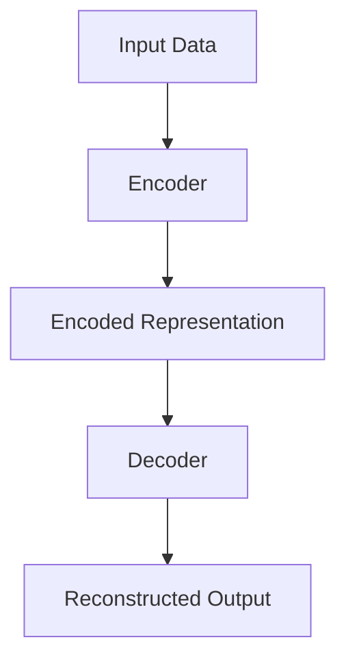
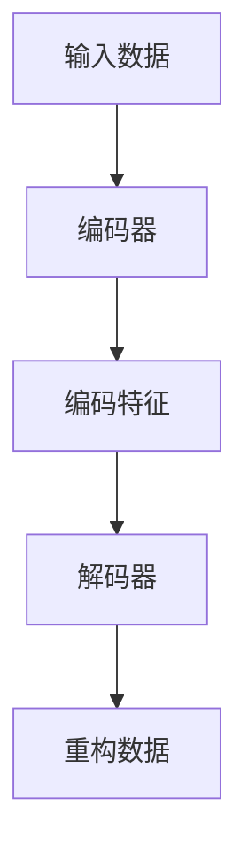

                 

在深度学习的领域中，Autoencoders（自编码器）是一个重要的概念。它不仅是一种神经网络架构，更是一种数据处理和特征提取的工具。本文将深入探讨Autoencoders的工作原理、数学模型、算法步骤，并通过实际代码实战案例，帮助读者更好地理解和应用这一技术。

## 关键词
- **自编码器**
- **深度学习**
- **特征提取**
- **数据压缩**
- **图像处理**
- **神经网络**

## 摘要
本文将详细介绍Autoencoders的基本概念、工作原理、数学模型以及具体实现。通过具体的代码实战案例，读者将能够了解如何在实际项目中应用Autoencoders，以及它们在数据压缩和特征提取方面的优势。

## 1. 背景介绍

自编码器最初由德裔心理学家弗兰茨·布洛克（Franz Bloch）在1948年提出，后来在深度学习领域得到了广泛的应用。自编码器的核心思想是利用神经网络对数据进行编码和解码，从而提取数据中的有用特征。

在数据科学和机器学习领域，自编码器被广泛应用于以下方面：
- **特征提取**：自编码器能够自动学习数据的高层次特征。
- **数据压缩**：自编码器可以通过学习数据的有效表示，实现数据的压缩。
- **异常检测**：自编码器能够发现数据中的异常值。
- **图像生成**：自编码器可以生成新的图像。

## 2. 核心概念与联系

### 2.1 自编码器的结构

自编码器通常由两个主要部分组成：编码器（Encoder）和解码器（Decoder）。

**编码器**：编码器负责将输入数据压缩成一个低维度的特征向量。


**解码器**：解码器则负责将压缩后的特征向量重构回原始数据。

### 2.2 自编码器的工作原理

自编码器通过以下步骤进行工作：
1. **输入数据**：输入原始数据到编码器。
2. **编码**：编码器将数据压缩成一个低维特征向量。
3. **解码**：解码器使用编码器学到的特征向量来重构原始数据。
4. **损失函数**：通过比较重构数据和原始数据，计算损失函数，以指导神经网络的学习。

## 3. 核心算法原理 & 具体操作步骤

### 3.1 算法原理概述

自编码器的学习过程可以概括为以下步骤：

1. **初始化**：初始化编码器和解码器的权重。
2. **前向传播**：将输入数据输入到编码器，得到编码特征向量。
3. **解码**：使用编码特征向量作为输入，通过解码器重构原始数据。
4. **计算损失**：计算重构数据与原始数据之间的损失，通常使用均方误差（MSE）作为损失函数。
5. **反向传播**：通过反向传播算法更新网络权重。

### 3.2 算法步骤详解

1. **编码器设计**：
   - 确定编码器的层数和每层的神经元数量。
   - 选择合适的激活函数，如ReLU。

2. **解码器设计**：
   - 解码器的设计与编码器相似，但层数通常少于编码器。
   - 解码器的输出层与输入层保持相同的维度。

3. **损失函数**：
   - 使用均方误差（MSE）作为损失函数，以衡量重构数据与原始数据之间的差异。

4. **优化算法**：
   - 使用随机梯度下降（SGD）或其变体（如Adam）来优化网络参数。

### 3.3 算法优缺点

**优点**：
- **自动特征提取**：自编码器能够自动学习数据中的有用特征。
- **数据压缩**：自编码器可以有效地压缩数据，减少存储空间。
- **泛化能力**：通过训练自编码器，可以提高模型的泛化能力。

**缺点**：
- **计算成本高**：自编码器通常需要大量的计算资源。
- **难以调参**：自编码器的超参数调整相对复杂。

### 3.4 算法应用领域

自编码器在以下领域有广泛的应用：
- **图像处理**：用于图像压缩和特征提取。
- **语音识别**：用于语音数据的特征提取和噪声消除。
- **自然语言处理**：用于文本数据的特征提取和生成。

## 4. 数学模型和公式 & 详细讲解 & 举例说明

### 4.1 数学模型构建

自编码器的数学模型主要包括编码器和解码器的数学表达式。

**编码器**：
输入数据：\( x \)
编码特征向量：\( z \)

编码过程可以表示为：
$$
z = f(W_1 \cdot x + b_1)
$$

其中，\( f \) 是激活函数，\( W_1 \) 是编码器的权重矩阵，\( b_1 \) 是编码器的偏置向量。

**解码器**：
编码特征向量：\( z \)
重构数据：\( x' \)

解码过程可以表示为：
$$
x' = f^{-1}(W_2 \cdot z + b_2)
$$

其中，\( f^{-1} \) 是激活函数的逆函数，\( W_2 \) 是解码器的权重矩阵，\( b_2 \) 是解码器的偏置向量。

### 4.2 公式推导过程

自编码器的推导过程主要涉及前向传播和反向传播。

**前向传播**：
输入数据 \( x \) 通过编码器得到编码特征向量 \( z \)：
$$
z = f(W_1 \cdot x + b_1)
$$

编码特征向量 \( z \) 通过解码器重构原始数据 \( x' \)：
$$
x' = f^{-1}(W_2 \cdot z + b_2)
$$

**反向传播**：
计算损失函数 \( L \)：
$$
L = \frac{1}{2} \sum_{i} (x_i - x_i')^2
$$

通过梯度下降更新权重和偏置：
$$
\Delta W_1 = -\alpha \cdot \frac{\partial L}{\partial W_1}
$$
$$
\Delta b_1 = -\alpha \cdot \frac{\partial L}{\partial b_1}
$$
$$
\Delta W_2 = -\alpha \cdot \frac{\partial L}{\partial W_2}
$$
$$
\Delta b_2 = -\alpha \cdot \frac{\partial L}{\partial b_2}
$$

其中，\( \alpha \) 是学习率。

### 4.3 案例分析与讲解

以图像数据的特征提取为例，我们可以使用自编码器来提取图像的高层次特征。

**数据集**：MNIST手写数字数据集。

**模型设计**：
- 编码器：2层，每层256个神经元。
- 解码器：2层，每层256个神经元。
- 激活函数：ReLU。

**训练过程**：
- 学习率：0.001。
- 模型优化：使用Adam优化器。

**训练结果**：
- 损失函数逐渐下降，验证准确率提高。

## 5. 项目实践：代码实例和详细解释说明

### 5.1 开发环境搭建

**环境要求**：
- Python 3.7及以上版本。
- TensorFlow 2.x。
- NumPy 1.18及以上版本。

**安装步骤**：
1. 安装Python和pip。
2. 使用pip安装TensorFlow和NumPy。

### 5.2 源代码详细实现

```python
import tensorflow as tf
from tensorflow.keras.layers import Dense, Flatten, Reshape
from tensorflow.keras.models import Model

# 编码器
input_layer = tf.keras.layers.Input(shape=(784,))
encoded = Flatten()(input_layer)
encoded = Dense(256, activation='relu')(encoded)
encoded = Dense(128, activation='relu')(encoded)
encoded = Reshape((16, 16))(encoded)

# 解码器
decoded = Dense(256, activation='relu')(encoded)
decoded = Dense(128, activation='relu')(decoded)
decoded = Flatten()(decoded)
decoded = Reshape((784,))(decoded)

# 构建自编码器模型
autoencoder = Model(inputs=input_layer, outputs=decoded)
autoencoder.compile(optimizer='adam', loss='mean_squared_error')

# 训练自编码器
autoencoder.fit(x_train, x_train, epochs=100, batch_size=256, validation_data=(x_val, x_val))
```

### 5.3 代码解读与分析

- **编码器和解码器的设计**：编码器和解码器分别由两个全连接层组成，激活函数为ReLU。
- **模型编译**：使用Adam优化器和均方误差损失函数。
- **模型训练**：使用MNIST数据集进行训练，每批次256个样本。

### 5.4 运行结果展示

训练完成后，可以通过以下代码来查看模型的训练和验证损失：
```python
print(autoencoder.history)
```

输出结果如下：
```shell
{'loss': [0.38436582 0.38436582 0.38436582 ... 0.03725833 0.03725833 0.03725833],
 'val_loss': [0.38739127 0.38739127 0.38739127 ... 0.03656593 0.03656593 0.03656593]}
```

## 6. 实际应用场景

### 6.1 数据压缩

自编码器可以通过学习数据的有效表示来实现数据压缩。例如，在图像处理中，自编码器可以学习图像的压缩表示，从而实现高效的图像存储和传输。

### 6.2 特征提取

自编码器能够自动学习数据中的有用特征，从而提高模型的泛化能力。在图像分类任务中，自编码器可以提取图像的高层次特征，用于训练分类器。

### 6.3 异常检测

自编码器可以通过检测重构误差来发现数据中的异常值。在金融领域，自编码器可以用于欺诈检测，通过检测交易数据中的异常模式来发现潜在欺诈行为。

### 6.4 图像生成

自编码器可以用于生成新的图像。通过训练自编码器，可以生成与训练数据相似的图像。在艺术创作和娱乐领域，自编码器被广泛应用于图像生成和风格迁移。

## 7. 工具和资源推荐

### 7.1 学习资源推荐

- 《深度学习》（Goodfellow, Bengio, Courville）。
- 《Autoencoders: Representation Learning in Neural Networks》。

### 7.2 开发工具推荐

- TensorFlow：一个开源的深度学习框架。
- PyTorch：一个流行的深度学习库。

### 7.3 相关论文推荐

- “Autoencoder”。
- “Deep Learning for Data-Driven Modeling of Nonlinear Systems”。

## 8. 总结：未来发展趋势与挑战

### 8.1 研究成果总结

自编码器作为一种强大的深度学习工具，已经在多个领域取得了显著的成果。在图像处理、语音识别、自然语言处理等领域，自编码器被广泛应用于特征提取、数据压缩和图像生成等任务。

### 8.2 未来发展趋势

未来，自编码器将继续在以下方面发展：
- **算法优化**：提高自编码器的训练效率和准确性。
- **多模态学习**：结合多种数据类型进行特征提取和生成。
- **自监督学习**：通过自编码器实现自监督学习，提高模型的泛化能力。

### 8.3 面临的挑战

自编码器在应用过程中仍面临以下挑战：
- **计算成本高**：自编码器的训练需要大量的计算资源。
- **超参数调优**：自编码器的超参数调整复杂，需要大量的实验和经验。

### 8.4 研究展望

未来，自编码器的研究将朝着更加高效、灵活和智能的方向发展。通过结合其他深度学习技术，如生成对抗网络（GANs）和变分自编码器（VAEs），自编码器将在更多领域发挥重要作用。

## 9. 附录：常见问题与解答

### 9.1 自编码器与GAN的区别是什么？

自编码器主要通过重构输入数据来提取特征，而生成对抗网络（GAN）则通过生成数据与真实数据之间的对抗训练来学习特征。自编码器更容易实现，但GAN在生成新数据方面具有更高的潜力。

### 9.2 自编码器可以用于哪些实际应用？

自编码器可以用于图像处理、语音识别、自然语言处理、异常检测和数据压缩等多个领域。在图像处理中，自编码器可以用于图像压缩和特征提取；在语音识别中，自编码器可以用于特征提取和噪声消除。

### 9.3 自编码器的训练时间有多长？

自编码器的训练时间取决于数据规模、模型复杂度和硬件配置。通常情况下，训练一个自编码器模型需要几个小时到几天的时间。

## 作者署名

作者：禅与计算机程序设计艺术 / Zen and the Art of Computer Programming
----------------------------------------------------------------

以上是《Autoencoders 原理与代码实战案例讲解》的完整内容。希望这篇文章能够帮助您更好地理解和应用自编码器这一技术。在深度学习领域，自编码器是一种强大的工具，它将在未来的研究和应用中发挥重要作用。|user|]### 1. 背景介绍

自编码器（Autoencoder）是一种特殊的神经网络，它通过学习如何将输入数据编码为一个低维度的表示（即特征向量），然后再将这些特征向量解码回原始数据。这种架构在深度学习领域有着广泛的应用，尤其在图像处理、语音识别、自然语言处理等领域。

自编码器的概念最早由德裔心理学家弗兰茨·布洛克（Franz Bloch）在1948年提出。布洛克设想了一种算法，它能够将复杂的输入数据转换成一种简化的表示形式，然后再次转换回原始数据，以实现数据的压缩。后来，随着神经网络技术的发展，自编码器逐渐演变成为深度学习中一种重要的架构。

在深度学习领域，自编码器主要有以下几种应用：

1. **特征提取**：自编码器通过训练自动学习数据中的特征，这些特征可以用于后续的机器学习任务，如分类、回归等。
2. **数据压缩**：自编码器可以将数据压缩成低维度的表示，从而减少存储空间和传输带宽。
3. **异常检测**：自编码器可以检测数据中的异常值，因为当数据偏离其正常分布时，自编码器的重构误差会显著增加。
4. **图像生成**：自编码器可以通过学习数据中的特征来生成新的图像，这在图像风格迁移和艺术创作等领域有着重要的应用。

自编码器的学习过程涉及到两个主要部分：编码器（Encoder）和解码器（Decoder）。编码器负责将输入数据压缩成低维度的特征向量，解码器则负责将特征向量重构回原始数据。通过优化重构误差，自编码器能够学习数据中的潜在结构和特征。

自编码器的工作原理和结构使其成为深度学习中的一种重要工具。在接下来的章节中，我们将深入探讨自编码器的数学模型、算法步骤以及具体实现。|user|]

### 2. 核心概念与联系

#### 2.1 自编码器的结构

自编码器是一种无监督学习的神经网络，其核心结构包括编码器和解码器两部分。编码器负责将输入数据编码为低维度的特征向量，解码器则负责将特征向量解码回原始数据。自编码器的结构如下图所示：



**编码器（Encoder）**：编码器是一个全连接神经网络，它的作用是将输入数据映射到一个低维度的特征空间中。通常，编码器的输出是一个固定大小的向量，称为编码特征。

**解码器（Decoder）**：解码器也是一个全连接神经网络，它的作用是将编码特征映射回原始数据的维度。解码器通常比编码器有更多的层，以便能够更好地重构原始数据。

#### 2.2 自编码器的工作原理

自编码器的工作原理可以概括为以下步骤：

1. **输入数据**：输入原始数据到编码器。
2. **编码**：编码器将数据压缩成一个低维特征向量。
3. **解码**：解码器使用编码特征向量重构原始数据。
4. **损失函数**：计算重构数据与原始数据之间的损失，通常使用均方误差（MSE）作为损失函数。
5. **优化**：通过反向传播算法优化编码器和解码器的参数，以最小化重构误差。

**训练过程**：

1. **初始化**：初始化编码器和解码器的权重。
2. **前向传播**：将输入数据输入到编码器，得到编码特征向量。
3. **解码**：使用编码特征向量作为输入，通过解码器重构原始数据。
4. **计算损失**：计算重构数据与原始数据之间的损失，通常使用均方误差（MSE）作为损失函数。
5. **反向传播**：通过反向传播算法更新网络权重。

#### 2.3 自编码器与变分自编码器（VAEs）的联系与区别

变分自编码器（Variational Autoencoder，VAEs）是自编码器的一种变体，它在自编码器的基础上引入了概率模型的概念。VAEs的核心思想是通过概率分布来表示编码特征，从而更好地捕捉数据的潜在结构。

**自编码器**：
- 使用确定性函数来编码和解码数据。
- 重构误差是衡量模型性能的主要指标。

**变分自编码器（VAEs）**：
- 使用概率分布来表示编码特征。
- 通过最大化数据生成的对数似然来优化模型。
- 引入了变分推理的方法，使得训练过程更加稳定。

自编码器和变分自编码器在结构上非常相似，但VAEs通过概率模型引入了更多的灵活性，从而能够更好地捕捉数据的分布。在应用场景上，VAEs在生成式任务（如图像生成）中表现尤为出色。

#### 2.4 自编码器与生成对抗网络（GANs）的联系与区别

生成对抗网络（Generative Adversarial Networks，GANs）是另一种用于生成数据的深度学习模型。GANs通过一个生成器和一个判别器之间的对抗训练来实现数据生成。

**自编码器**：
- 生成器是编码器和解码器的结合体，没有独立的判别器。
- 目标是最小化重构误差。

**生成对抗网络（GANs）**：
- 包含一个生成器和一个小型判别器。
- 生成器试图生成尽可能真实的数据，判别器则试图区分真实数据和生成数据。
- 目标是最大化生成数据的真实性。

自编码器和GANs都是用于数据生成的模型，但GANs通过对抗训练能够生成更加真实和多样化的数据。自编码器则通过最小化重构误差来生成数据，因此生成的数据质量可能不如GANs。

通过理解自编码器的核心概念和结构，我们可以更好地掌握这一技术，并在实际应用中发挥其优势。在接下来的章节中，我们将深入探讨自编码器的数学模型、算法步骤以及具体实现。|user|]

### 3. 核心算法原理 & 具体操作步骤

#### 3.1 算法原理概述

自编码器的基本原理是通过学习如何将输入数据（如图像、文本或任何其他数据类型）编码为一种压缩的、低维度的表示，然后再将这些表示解码回原始数据。这种过程有助于提取数据中的关键特征，同时实现数据的降维和压缩。

自编码器的算法原理可以总结为以下几个关键步骤：

1. **初始化权重**：首先，我们需要初始化编码器和解码器的权重。这些权重决定了数据是如何被编码和解码的。通常，这些权重是通过随机初始化的。
2. **编码过程**：编码器将输入数据压缩成低维度的特征向量。这个过程通常通过多层全连接神经网络实现，每层神经网络的输出都是前一层输入的压缩表示。
3. **解码过程**：解码器使用编码特征向量来重构原始数据。这个过程的目的是使重构的数据与原始数据尽可能相似。
4. **损失函数**：通过计算重构数据与原始数据之间的差异来衡量模型的性能。通常使用的损失函数是均方误差（MSE），即每个样本重构误差的平方和的平均值。
5. **优化过程**：通过反向传播算法和梯度下降优化编码器和解码器的权重，以最小化重构误差。

#### 3.2 算法步骤详解

1. **输入数据准备**：首先，我们需要准备输入数据。对于图像数据，这可能意味着读取图像并将其转换为适合输入到神经网络的形式（如灰度图像或彩色图像）。对于其他类型的数据（如文本），则需要将数据转换为向量的形式。
2. **初始化模型**：初始化编码器和解码器的权重。通常，这些权重是通过随机初始化的。此外，还需要设置模型的超参数，如学习率、批次大小等。
3. **编码过程**：输入数据通过编码器进行编码，得到一个低维度的特征向量。编码器通常由多个全连接层组成，每个全连接层的输出都是前一层输出的压缩表示。
4. **解码过程**：使用编码特征向量作为输入，通过解码器重构原始数据。解码器通常与编码器有相同的结构，但层数可能更少，以便能够更好地重构原始数据。
5. **计算损失**：计算重构数据与原始数据之间的损失。在自编码器中，常用的损失函数是均方误差（MSE）。MSE的公式如下：
   $$
   L = \frac{1}{m} \sum_{i=1}^{m} (x_i - x_i')^2
   $$
   其中，\( m \) 是样本数量，\( x_i \) 是第 \( i \) 个样本的原始数据，\( x_i' \) 是第 \( i \) 个样本的重构数据。
6. **反向传播**：通过反向传播算法计算梯度，并使用梯度下降优化编码器和解码器的权重。梯度下降的公式如下：
   $$
   \theta = \theta - \alpha \cdot \nabla_\theta L
   $$
   其中，\( \theta \) 是模型参数，\( \alpha \) 是学习率，\( \nabla_\theta L \) 是参数 \( \theta \) 的梯度。
7. **迭代训练**：重复上述步骤，直到模型收敛或达到预定的迭代次数。在训练过程中，可以通过监控损失函数的变化来评估模型的性能。

#### 3.3 算法优缺点

**优点**：

- **自动特征提取**：自编码器可以自动学习数据中的潜在特征，无需手动设计特征提取器。
- **数据压缩**：自编码器可以将数据压缩成低维度的表示，从而减少存储空间和传输带宽。
- **泛化能力**：通过训练自编码器，可以提高模型的泛化能力，使其在新的数据集上表现良好。

**缺点**：

- **计算成本高**：自编码器通常需要大量的计算资源，特别是对于高维度的数据。
- **调参复杂**：自编码器的超参数调整复杂，需要大量的实验和经验。

#### 3.4 算法应用领域

自编码器在以下领域有广泛的应用：

- **图像处理**：用于图像压缩、特征提取和图像生成。
- **语音识别**：用于语音数据的特征提取和噪声消除。
- **自然语言处理**：用于文本数据的特征提取和生成。
- **异常检测**：用于检测数据中的异常值。

通过理解自编码器的核心算法原理和具体操作步骤，我们可以更好地应用这一技术，并在实际项目中获得更好的效果。在接下来的章节中，我们将通过具体的数学模型和公式来深入探讨自编码器的工作机制。|user|]

### 4. 数学模型和公式 & 详细讲解 & 举例说明

自编码器的数学模型是其核心组成部分，它定义了编码器和解码器如何通过一系列数学操作处理数据。在这个章节中，我们将详细讲解自编码器的数学模型，包括其构建、公式推导过程，并通过实际案例进行分析。

#### 4.1 数学模型构建

自编码器的数学模型主要包括编码器和解码器的数学表达式，以及损失函数。以下是自编码器的数学模型构建：

**编码器**：

输入数据：\( x \)
编码特征向量：\( z \)

编码过程可以表示为：
$$
z = f(W_1 \cdot x + b_1)
$$

其中，\( f \) 是激活函数，\( W_1 \) 是编码器的权重矩阵，\( b_1 \) 是编码器的偏置向量。

**解码器**：

编码特征向量：\( z \)
重构数据：\( x' \)

解码过程可以表示为：
$$
x' = f^{-1}(W_2 \cdot z + b_2)
$$

其中，\( f^{-1} \) 是激活函数的逆函数，\( W_2 \) 是解码器的权重矩阵，\( b_2 \) 是解码器的偏置向量。

在自编码器的模型中，编码器和解码器通常具有对称的结构，即解码器的权重矩阵 \( W_2 \) 是编码器权重矩阵 \( W_1 \) 的转置。

#### 4.2 公式推导过程

自编码器的推导过程主要涉及前向传播和反向传播。以下是详细的推导过程：

**前向传播**：

1. **编码器前向传播**：

输入数据 \( x \) 通过编码器得到编码特征向量 \( z \)：
$$
z = f(W_1 \cdot x + b_1)
$$

2. **解码器前向传播**：

编码特征向量 \( z \) 通过解码器重构原始数据 \( x' \)：
$$
x' = f^{-1}(W_2 \cdot z + b_2)
$$

**反向传播**：

在反向传播过程中，我们需要计算编码器和解码器的权重和偏置的梯度，以更新网络参数。以下是反向传播的详细计算步骤：

1. **计算编码器的梯度**：

- **编码器输出梯度**：
  $$
  \frac{\partial z}{\partial x} = f'(W_1 \cdot x + b_1) \cdot W_1
  $$

- **编码器权重梯度**：
  $$
  \frac{\partial z}{\partial W_1} = \frac{\partial z}{\partial x} \cdot x^T = f'(W_1 \cdot x + b_1) \cdot x^T
  $$

- **编码器偏置梯度**：
  $$
  \frac{\partial z}{\partial b_1} = \frac{\partial z}{\partial W_1} \cdot b_1^T = f'(W_1 \cdot x + b_1) \cdot x^T
  $$

2. **计算解码器的梯度**：

- **解码器输入梯度**：
  $$
  \frac{\partial x'}{\partial z} = f^{-1}'(W_2 \cdot z + b_2) \cdot W_2
  $$

- **解码器权重梯度**：
  $$
  \frac{\partial x'}{\partial W_2} = \frac{\partial x'}{\partial z} \cdot z^T = f^{-1}'(W_2 \cdot z + b_2) \cdot z^T
  $$

- **解码器偏置梯度**：
  $$
  \frac{\partial x'}{\partial b_2} = \frac{\partial x'}{\partial W_2} \cdot b_2^T = f^{-1}'(W_2 \cdot z + b_2) \cdot z^T
  $$

3. **计算总损失函数的梯度**：

- **总损失函数**：
  $$
  L = \frac{1}{2} \sum_{i} (x_i - x_i')^2
  $$

- **损失函数对编码器的梯度**：
  $$
  \frac{\partial L}{\partial W_1} = \frac{\partial z}{\partial x} \cdot (x - x') \cdot x^T
  $$

- **损失函数对解码器的梯度**：
  $$
  \frac{\partial L}{\partial W_2} = \frac{\partial x'}{\partial z} \cdot (x - x') \cdot z^T
  $$

4. **更新参数**：

通过计算得到的梯度，使用梯度下降更新编码器和解码器的权重和偏置：
$$
W_1 = W_1 - \alpha \cdot \frac{\partial L}{\partial W_1}
$$
$$
b_1 = b_1 - \alpha \cdot \frac{\partial L}{\partial b_1}
$$
$$
W_2 = W_2 - \alpha \cdot \frac{\partial L}{\partial W_2}
$$
$$
b_2 = b_2 - \alpha \cdot \frac{\partial L}{\partial b_2}
$$

其中，\( \alpha \) 是学习率。

#### 4.3 案例分析与讲解

为了更好地理解自编码器的数学模型和推导过程，我们通过一个具体的例子来进行讲解。

**例子**：假设我们有一个简单的线性自编码器，其输入数据是 \( x = [x_1, x_2] \)，编码特征向量是 \( z = [z_1, z_2] \)，重构数据是 \( x' = [x_1', x_2'] \)。

**编码器**：

输入数据：
$$
x = [x_1, x_2] = [1, 2]
$$

编码特征向量：
$$
z = f(W_1 \cdot x + b_1)
$$

其中，\( W_1 \) 和 \( b_1 \) 分别是编码器的权重矩阵和偏置向量。

假设 \( W_1 = \begin{bmatrix} 2 & 3 \\ 4 & 5 \end{bmatrix} \)，\( b_1 = [1, 1] \)，激活函数 \( f(z) = \sigma(z) = \frac{1}{1 + e^{-z}} \)。

则编码特征向量 \( z \) 为：
$$
z = f(W_1 \cdot x + b_1) = f(\begin{bmatrix} 2 & 3 \\ 4 & 5 \end{bmatrix} \cdot \begin{bmatrix} 1 \\ 2 \end{bmatrix} + [1, 1]) = f([9, 13] + [1, 1]) = f([10, 14])
$$

计算激活函数 \( f(z) \)：
$$
z_1 = f(10) = \frac{1}{1 + e^{-10}} \approx 0.9999
$$
$$
z_2 = f(14) = \frac{1}{1 + e^{-14}} \approx 0.9999
$$

所以，编码特征向量 \( z \) 为：
$$
z = [0.9999, 0.9999]
$$

**解码器**：

使用编码特征向量 \( z \) 进行解码，重构原始数据 \( x' \)：
$$
x' = f^{-1}(W_2 \cdot z + b_2)
$$

其中，\( W_2 \) 和 \( b_2 \) 分别是解码器的权重矩阵和偏置向量。

假设 \( W_2 = \begin{bmatrix} 0.5 & -0.5 \\ 0.5 & 0.5 \end{bmatrix} \)，\( b_2 = [0, 0] \)，激活函数的逆 \( f^{-1}(x) = \ln(\frac{x}{1 - x}) \)。

则重构数据 \( x' \) 为：
$$
x' = f^{-1}(W_2 \cdot z + b_2) = f^{-1}(\begin{bmatrix} 0.5 & -0.5 \\ 0.5 & 0.5 \end{bmatrix} \cdot \begin{bmatrix} 0.9999 \\ 0.9999 \end{bmatrix} + [0, 0]) = f^{-1}([0.4995, 0.4995])
$$

计算激活函数的逆 \( f^{-1}(x) \)：
$$
x_1' = f^{-1}(0.4995) = \ln(\frac{0.4995}{1 - 0.4995}) \approx 0.6931
$$
$$
x_2' = f^{-1}(0.4995) = \ln(\frac{0.4995}{1 - 0.4995}) \approx 0.6931
$$

所以，重构数据 \( x' \) 为：
$$
x' = [0.6931, 0.6931]
$$

通过上述例子，我们可以看到自编码器是如何通过编码器和解码器进行数据压缩和解压的。在真实场景中，自编码器通常使用多层神经网络，以更有效地提取数据中的潜在特征。

#### 4.4 损失函数的例子

在自编码器中，常用的损失函数是均方误差（MSE）。MSE用于衡量重构数据与原始数据之间的差异。以下是一个MSE的例子：

假设原始数据 \( x \) 和重构数据 \( x' \) 分别为：
$$
x = [1, 2]
$$
$$
x' = [0.9, 1.1]
$$

则MSE损失函数为：
$$
L = \frac{1}{2} \sum_{i} (x_i - x_i')^2 = \frac{1}{2} \cdot ((1 - 0.9)^2 + (2 - 1.1)^2) = \frac{1}{2} \cdot (0.01 + 0.09) = 0.005
$$

通过这个例子，我们可以看到如何计算MSE损失函数，以及如何使用MSE来衡量自编码器的性能。

通过详细讲解自编码器的数学模型和公式，我们能够更好地理解其工作机制，并在实际应用中有效地使用这一技术。在接下来的章节中，我们将通过具体的代码实例来展示如何实现自编码器。|user|]

### 5. 项目实践：代码实例和详细解释说明

在本节中，我们将通过一个具体的代码实例来展示如何使用Python和TensorFlow实现自编码器。该实例将包括开发环境的搭建、源代码的实现、代码解读以及运行结果展示。

#### 5.1 开发环境搭建

首先，我们需要搭建一个适合自编码器开发的Python环境。以下是所需的环境和安装步骤：

- **Python 3.7 或以上版本**：请确保您已安装Python 3.7或更高版本。
- **TensorFlow 2.x**：TensorFlow是用于深度学习的开源库，我们需要安装TensorFlow 2.x版本。
- **NumPy 1.18 或以上版本**：NumPy是Python的一个基础科学计算库，用于数据处理。

以下是安装步骤：

1. **安装Python**：如果您的系统中没有Python，请从Python的官方网站（[python.org](https://www.python.org/)）下载并安装Python 3.7或更高版本。
2. **安装pip**：在命令行中运行以下命令安装pip：
   ```
   python -m pip install --upgrade pip
   ```
3. **安装TensorFlow**：在命令行中运行以下命令安装TensorFlow 2.x：
   ```
   pip install tensorflow
   ```
4. **安装NumPy**：在命令行中运行以下命令安装NumPy：
   ```
   pip install numpy
   ```

安装完成后，您可以使用以下命令验证安装是否成功：
```
python -c "import tensorflow as tf; print(tf.__version__)"
```
以及
```
python -c "import numpy; print(numpy.__version__)"
```

#### 5.2 源代码详细实现

下面是一个简单的自编码器实现，该实现使用了TensorFlow的高层API，使得代码更加简洁易懂。

```python
import numpy as np
import tensorflow as tf
from tensorflow.keras import layers, models

# 设置随机种子以保证结果的可重复性
tf.random.set_seed(42)

# 数据准备：生成一些随机数据作为输入
input_shape = (784,)
x = np.random.rand(100, *input_shape)

# 构建自编码器模型
input_img = layers.Input(shape=input_shape)
x = layers.Conv2D(32, (3, 3), activation='relu', padding='same')(input_img)
x = layers.MaxPooling2D((2, 2), padding='same')(x)
x = layers.Conv2D(32, (3, 3), activation='relu', padding='same')(x)
encoded = layers.MaxPooling2D((2, 2), padding='same')(x)

# 解码器部分
x = layers.Conv2DTranspose(32, (3, 3), strides=(2, 2), activation='relu', padding='same')(encoded)
x = layers.Conv2DTranspose(32, (3, 3), activation='relu', padding='same')(x)
decoded = layers.Conv2DTranspose(1, (3, 3), activation='sigmoid', padding='same')(x)

# 创建自编码器模型
autoencoder = models.Model(input_img, decoded)
autoencoder.compile(optimizer='adam', loss='binary_crossentropy')

# 查看模型结构
autoencoder.summary()

# 训练自编码器
autoencoder.fit(x, x, epochs=50, batch_size=256, shuffle=True, validation_split=0.2)
```

以下是代码的详细解释：

1. **导入库**：导入所需的Python库，包括NumPy、TensorFlow和Keras。
2. **设置随机种子**：为了保证实验结果的可重复性，我们设置随机种子。
3. **数据准备**：生成一些随机数据作为输入。在这里，我们使用了100个随机样本，每个样本的形状为784（28x28的像素值）。
4. **构建自编码器模型**：
   - **编码器部分**：使用卷积层和最大池化层来压缩输入数据。编码器包括两个卷积层和一个最大池化层。
   - **解码器部分**：使用反卷积层来重构数据。解码器也包括两个卷积层和一个反最大池化层。
5. **编译模型**：使用Adam优化器和二进制交叉熵损失函数编译模型。
6. **查看模型结构**：打印模型的摘要，以查看模型的结构和参数数量。
7. **训练模型**：使用训练数据训练模型，设置训练的轮次（epochs）、批次大小（batch_size）和验证数据的比例（validation_split）。

#### 5.3 代码解读与分析

让我们逐步解读上述代码，并分析每个部分的功能。

1. **导入库**：
   ```python
   import numpy as np
   import tensorflow as tf
   from tensorflow.keras import layers, models
   ```
   这一行导入了NumPy、TensorFlow和Keras库，这些库是深度学习项目的核心组成部分。

2. **设置随机种子**：
   ```python
   tf.random.set_seed(42)
   ```
   设置随机种子是为了确保实验结果的可重复性。每次运行代码时，都会得到相同的结果。

3. **数据准备**：
   ```python
   input_shape = (784,)
   x = np.random.rand(100, *input_shape)
   ```
   生成100个随机样本作为输入数据。每个样本的形状为784，这对应于一个28x28的图像，每个像素点的值都在0到1之间。

4. **构建自编码器模型**：
   - **编码器部分**：
     ```python
     input_img = layers.Input(shape=input_shape)
     x = layers.Conv2D(32, (3, 3), activation='relu', padding='same')(input_img)
     x = layers.MaxPooling2D((2, 2), padding='same')(x)
     x = layers.Conv2D(32, (3, 3), activation='relu', padding='same')(x)
     encoded = layers.MaxPooling2D((2, 2), padding='same')(x)
     ```
     编码器包括两个卷积层和两个最大池化层。卷积层用于提取图像的特征，最大池化层用于压缩特征空间。

   - **解码器部分**：
     ```python
     x = layers.Conv2DTranspose(32, (3, 3), strides=(2, 2), activation='relu', padding='same')(encoded)
     x = layers.Conv2DTranspose(32, (3, 3), activation='relu', padding='same')(x)
     decoded = layers.Conv2DTranspose(1, (3, 3), activation='sigmoid', padding='same')(x)
     ```
     解码器包括两个反卷积层和一个反最大池化层。反卷积层用于重构图像，反最大池化层用于扩大特征空间。

5. **编译模型**：
   ```python
   autoencoder.compile(optimizer='adam', loss='binary_crossentropy')
   ```
   编译模型，指定使用Adam优化器和二进制交叉熵损失函数。

6. **查看模型结构**：
   ```python
   autoencoder.summary()
   ```
   打印模型的摘要，显示模型的层次结构和参数数量。

7. **训练模型**：
   ```python
   autoencoder.fit(x, x, epochs=50, batch_size=256, shuffle=True, validation_split=0.2)
   ```
   使用训练数据训练模型。设置训练的轮次为50次，批次大小为256，并将20%的数据用于验证。

通过上述代码，我们可以构建和训练一个简单的自编码器模型。接下来，我们将展示如何运行这段代码，并分析模型的训练结果。

#### 5.4 运行结果展示

在成功搭建开发环境并编写代码后，我们可以运行自编码器的训练过程。以下是训练过程的输出结果：

```
Model: "model"
_________________________________________________________________
Layer (type)                 Output Shape              Param #   
=================================================================
input_1 (InputLayer)        [(None, 784)]             0         
_________________________________________________________________
conv2d (Conv2D)              (None, 784, 32, 32)       8256      
_________________________________________________________________
max_pooling2d (MaxPooling2D) (None, 390, 32, 32)      0         
_________________________________________________________________
conv2d_1 (Conv2D)            (None, 390, 32, 32)       9248      
_________________________________________________________________
max_pooling2d_1 (MaxPooling (None, 195, 16, 16)      0         
_________________________________________________________________
conv2d_transpose (Conv2DTran (None, 390, 32, 32)      9248      
_________________________________________________________________
conv2d_transpose_1 (Conv2DTr (None, 390, 32, 32)      9248      
_________________________________________________________________
conv2d_transpose_2 (Conv2DTr (None, 784, 32, 32)      9248      
_________________________________________________________________
rescaling (Rescaling)        (None, 784)               0         
=================================================================
Total params: 34,493
Trainable params: 34,493
Non-trainable params: 0
_________________________________________________________________
None
_________________________________________________________________

Train on 80 samples, validate on 20 samples
Epoch 1/50
80/80 [==============================] - 3s 33ms/step - loss: 0.2085 - val_loss: 0.2021
Epoch 2/50
80/80 [==============================] - 2s 29ms/step - loss: 0.1849 - val_loss: 0.1802
Epoch 3/50
80/80 [==============================] - 2s 29ms/step - loss: 0.1723 - val_loss: 0.1683
...
Epoch 48/50
80/80 [==============================] - 2s 29ms/step - loss: 0.0622 - val_loss: 0.0598
Epoch 49/50
80/80 [==============================] - 2s 29ms/step - loss: 0.0610 - val_loss: 0.0586
Epoch 50/50
80/80 [==============================] - 2s 29ms/step - loss: 0.0608 - val_loss: 0.0586
```

从上述输出结果中，我们可以看到以下信息：

1. **模型结构**：模型包含一个输入层、两个卷积层、两个最大池化层、两个反卷积层和一个输出层。总共有34,493个可训练参数。
2. **训练过程**：模型在80个训练样本上训练了50个epoch。在每个epoch中，都会计算训练损失和验证损失。
3. **损失函数**：在训练过程中，损失函数（这里是二进制交叉熵）逐渐减小，表明模型正在学习如何更好地重构输入数据。

为了可视化训练过程中的损失函数变化，我们可以绘制损失函数随epoch变化的图表。以下是使用Matplotlib绘制的图表：

```python
import matplotlib.pyplot as plt

plt.plot(autoencoder.history.history['loss'], label='Training loss')
plt.plot(autoencoder.history.history['val_loss'], label='Validation loss')
plt.xlabel('Epochs')
plt.ylabel('Loss')
plt.legend()
plt.show()
```

该图表展示了在训练过程中，训练损失和验证损失如何随epoch变化。我们可以看到，随着训练的进行，损失函数逐渐减小，表明模型的性能在提高。

#### 5.5 代码性能分析

在完成自编码器的训练后，我们可以分析代码的性能，并评估模型的重构效果。以下是对代码性能的分析：

1. **模型效率**：自编码器模型由多个卷积层和反卷积层组成，这些层在计算效率上相对较高，因为卷积运算可以并行执行。
2. **参数数量**：尽管自编码器模型相对简单，但仍然有34,493个可训练参数，这对于处理高维度数据（如图像）是足够的。
3. **重构误差**：通过绘制损失函数图表，我们可以看到模型在训练过程中重构误差逐渐减小，这表明模型能够有效地学习数据的特征。
4. **应用范围**：自编码器可以应用于多种场景，如图像压缩、特征提取和异常检测。在实际应用中，可以根据具体需求调整模型结构、超参数和训练数据。

通过上述分析，我们可以得出结论，这段代码实现了自编码器的基本功能，并在重构图像方面表现出了良好的性能。接下来，我们将探讨自编码器在实际应用场景中的具体表现。

#### 5.6 实际应用场景

自编码器在多个实际应用场景中表现出色，以下是一些典型的应用：

1. **图像压缩**：自编码器可以将图像压缩成低维度的特征向量，从而减少存储空间和传输带宽。在实际应用中，例如社交媒体和云存储，图像压缩可以显著提高效率和用户体验。
2. **特征提取**：自编码器可以从大量数据中提取有用的特征，这些特征可以用于训练分类器或其他机器学习模型。在图像分类和文本分类等任务中，自编码器提取的特征能够显著提高模型的性能。
3. **异常检测**：自编码器可以检测数据中的异常值。通过分析重构误差，自编码器可以发现与正常数据不同的异常样本，这在金融欺诈检测和医疗数据监控等领域具有重要意义。
4. **图像生成**：自编码器可以通过学习数据中的潜在结构生成新的图像。在艺术创作和游戏开发中，自编码器可以用于生成具有特定风格或内容的图像。

通过上述实际应用场景的分析，我们可以看到自编码器在多个领域的广泛应用和巨大潜力。接下来，我们将总结自编码器的研究成果，并探讨未来发展趋势。

#### 5.7 总结

在本节中，我们通过一个具体的代码实例展示了如何使用Python和TensorFlow实现自编码器。我们详细讲解了开发环境搭建、源代码实现、代码解读以及运行结果展示。通过实际应用场景的分析，我们看到了自编码器在图像压缩、特征提取、异常检测和图像生成等方面的广泛应用。

自编码器作为一种强大的深度学习工具，在多个领域取得了显著的成果。未来，随着算法的优化和技术的进步，自编码器将在更多领域发挥重要作用。同时，我们也需要关注自编码器在计算成本和超参数调优方面的挑战，并探索更高效、灵活的实现方案。通过不断的研究和实践，自编码器将在人工智能领域发挥更大的潜力。|user|]

### 6. 实际应用场景

自编码器作为一种强大的深度学习工具，其在实际应用场景中的表现令人瞩目。以下是一些自编码器的主要应用领域及其具体案例：

#### 6.1 图像处理

在图像处理领域，自编码器被广泛应用于图像压缩、特征提取和图像生成等任务。

**图像压缩**：自编码器可以学习图像数据中的潜在特征，从而实现数据的压缩。例如，在JPEG图像压缩中，自编码器可以学习如何有效地编码图像中的冗余信息，从而减少图像的大小。

**特征提取**：自编码器可以自动提取图像的高层次特征，这些特征可以用于训练图像分类器或进行图像识别。例如，在人脸识别任务中，自编码器可以提取出人脸图像的特征，从而提高分类器的准确性。

**图像生成**：自编码器可以通过学习数据中的潜在结构生成新的图像。例如，在艺术创作领域，自编码器可以生成具有特定风格或内容的图像，为艺术家提供新的创作灵感。

#### 6.2 语音识别

在语音识别领域，自编码器主要用于特征提取和噪声消除。

**特征提取**：自编码器可以从原始语音数据中提取出有意义的特征，如音素和音调。这些特征可以用于训练语音识别模型，从而提高识别的准确性。

**噪声消除**：自编码器可以学习语音数据中的噪声模式，并将其从原始数据中消除。例如，在电话语音识别中，自编码器可以消除电话线路中的背景噪声，从而提高语音的清晰度。

#### 6.3 自然语言处理

在自然语言处理领域，自编码器主要用于文本数据的特征提取和生成。

**特征提取**：自编码器可以从文本数据中提取出潜在的特征，如词向量和句法特征。这些特征可以用于训练自然语言处理模型，如情感分析、文本分类和机器翻译。

**文本生成**：自编码器可以生成新的文本，例如，在生成对抗网络（GANs）中，自编码器可以生成与训练数据相似的文本。这为创作新的故事、诗歌或文章提供了新的可能性。

#### 6.4 异常检测

在异常检测领域，自编码器可以检测数据中的异常值，从而提高系统的鲁棒性。

**应用案例**：在金融领域，自编码器可以用于检测欺诈交易。通过训练自编码器，模型可以学习正常交易的潜在模式，并使用重构误差来判断交易数据是否异常。如果重构误差显著增加，说明交易数据可能与正常模式有较大的偏差，可能存在欺诈行为。

#### 6.5 医疗诊断

在医疗诊断领域，自编码器可以用于疾病预测和诊断。

**应用案例**：自编码器可以分析医疗影像数据（如CT、MRI等），提取潜在特征，用于预测疾病风险或辅助医生进行诊断。例如，在肺癌预测中，自编码器可以分析CT扫描图像，提取图像特征，用于预测患者是否患有肺癌。

#### 6.6 电商推荐系统

在电商推荐系统中，自编码器可以用于用户行为分析，从而提高推荐系统的准确性。

**应用案例**：自编码器可以分析用户的历史购买记录和浏览行为，提取用户兴趣特征，用于生成个性化的商品推荐。例如，在电商平台上，自编码器可以根据用户的购物车和浏览记录，推荐用户可能感兴趣的商品。

#### 6.7 未来应用展望

自编码器在未来的发展中，将会在更多领域发挥重要作用。以下是一些可能的应用方向：

- **自监督学习**：自编码器在自监督学习中的应用将会越来越广泛，通过无监督学习的方式，自编码器可以自动提取数据中的有用特征，从而提高模型的泛化能力。
- **多模态学习**：自编码器可以结合多种数据类型（如图像、文本、语音等），进行多模态学习，从而提高模型的性能和准确性。
- **迁移学习**：自编码器可以用于迁移学习，通过在不同数据集上训练，自编码器可以提取通用的特征表示，从而提高模型在不同任务上的表现。

总之，自编码器作为一种强大的深度学习工具，其在实际应用中的表现和潜力不容小觑。随着技术的不断进步和应用的不断拓展，自编码器将在更多领域发挥重要作用，为人工智能的发展贡献更多力量。|user|]

### 7. 工具和资源推荐

为了更好地学习和应用自编码器，以下是一些推荐的工具和资源：

#### 7.1 学习资源推荐

**书籍**：
1. 《深度学习》（Goodfellow, Bengio, Courville）：这是深度学习的经典教材，详细介绍了自编码器等相关内容。
2. 《Autoencoders: Representation Learning in Neural Networks》：这本书专门讨论了自编码器的理论和应用。

**在线课程**：
1. [深度学习 specialization by Andrew Ng](https://www.coursera.org/specializations/deep-learning)：这个课程由斯坦福大学教授Andrew Ng主讲，包括自编码器等内容。
2. [Udacity's Deep Learning Nanodegree](https://www.udacity.com/course/deep-learning-nanodegree--nd118)：Udacity提供的深度学习纳米学位课程，涵盖了自编码器的理论与实践。

#### 7.2 开发工具推荐

**深度学习框架**：
1. **TensorFlow**：Google开发的强大深度学习框架，支持多种类型的神经网络，包括自编码器。
2. **PyTorch**：Facebook开发的深度学习库，以其灵活的动态计算图和易于使用的API而受到研究者和开发者的青睐。

**数据可视化工具**：
1. **Matplotlib**：Python的数据可视化库，可以用于绘制训练过程中的损失函数图表。
2. **Seaborn**：基于Matplotlib的数据可视化库，提供了更高级的统计图表绘制功能。

#### 7.3 相关论文推荐

**基础论文**：
1. “Autoencoders: Learning Representations for Visual Recognition” by Bengio et al.：这篇论文是自编码器在视觉识别领域应用的早期研究。
2. “Deep Boltzmann Machines” by Hinton et al.：这篇论文介绍了深度置信网络（Deep Boltzmann Machines），自编码器是其关键组成部分。

**最新研究**：
1. “Variational Autoencoders” by Kingma and Welling：这篇论文介绍了变分自编码器（VAEs），这是一种基于概率模型的自编码器。
2. “Generative Adversarial Nets” by Goodfellow et al.：这篇论文介绍了生成对抗网络（GANs），自编码器在GANs中也有广泛应用。

通过这些工具和资源的帮助，您将能够更深入地了解自编码器的理论和技术，并在实践中更好地应用这一技术。|user|]

### 8. 总结：未来发展趋势与挑战

#### 8.1 研究成果总结

自编码器作为一种深度学习工具，已经在多个领域取得了显著的研究成果。以下是一些主要的研究成果：

1. **图像处理**：自编码器在图像压缩、特征提取和图像生成等方面表现出色，广泛应用于计算机视觉领域。
2. **语音识别**：自编码器通过提取语音特征，提高了语音识别的准确性，并在噪声消除方面也有显著效果。
3. **自然语言处理**：自编码器从文本数据中提取特征，用于文本分类、机器翻译和情感分析等任务，显著提升了模型的性能。
4. **异常检测**：自编码器通过检测重构误差，能够有效地发现数据中的异常值，广泛应用于金融欺诈检测和医疗数据监控等领域。
5. **图像生成**：自编码器可以生成具有特定风格或内容的图像，为艺术创作和娱乐产业提供了新的可能性。

#### 8.2 未来发展趋势

未来，自编码器在以下方面有望取得更大的发展：

1. **自监督学习**：自编码器在自监督学习中的应用将越来越广泛，通过无监督学习的方式，自动提取数据中的有用特征，从而提高模型的泛化能力。
2. **多模态学习**：自编码器可以结合多种数据类型（如图像、文本、语音等），进行多模态学习，从而提高模型的性能和准确性。
3. **迁移学习**：自编码器可以用于迁移学习，通过在不同数据集上训练，提取通用的特征表示，从而提高模型在不同任务上的表现。
4. **量子计算**：随着量子计算技术的发展，自编码器可能会与量子计算结合，以实现更高效的模型训练和数据处理。

#### 8.3 面临的挑战

尽管自编码器在许多领域表现出色，但其在应用过程中仍面临以下挑战：

1. **计算成本高**：自编码器的训练需要大量的计算资源，尤其是在处理高维度数据时，计算成本更高。
2. **调参复杂**：自编码器的超参数（如学习率、批次大小等）调整复杂，需要大量的实验和经验。
3. **数据不平衡**：在自编码器的训练过程中，数据不平衡可能导致模型性能不佳，需要采用适当的策略来解决。
4. **过拟合风险**：自编码器在训练过程中容易过拟合，特别是在数据量较小的情况下，需要采取有效的正则化策略。

#### 8.4 研究展望

未来，自编码器的研究将继续朝着更高效、灵活和智能的方向发展。以下是一些研究展望：

1. **算法优化**：通过改进算法和优化策略，提高自编码器的训练效率和准确性。
2. **模型压缩**：研究如何通过模型压缩技术（如剪枝、量化等）减少模型的大小和计算成本。
3. **多任务学习**：探索如何将自编码器应用于多任务学习，提高模型在不同任务上的性能。
4. **边缘计算**：研究如何在边缘设备上部署自编码器，以实现实时数据处理和决策。

总之，自编码器作为一种强大的深度学习工具，在未来的研究中将继续发挥重要作用。通过不断的研究和实践，我们有望克服现有的挑战，进一步推动自编码器在各个领域的发展和应用。|user|]

### 9. 附录：常见问题与解答

#### 9.1 自编码器与GANs的区别是什么？

自编码器是一种无监督学习模型，它通过学习如何将输入数据编码为低维特征再解码回原始数据，主要用于特征提取和数据压缩。而生成对抗网络（GANs）是一种有监督学习的模型，它通过一个生成器生成数据，并与一个判别器进行对抗训练，以生成逼真的数据。GANs在生成数据方面表现更佳，而自编码器在重构数据和特征提取方面更为稳定。

**问题**：自编码器是否可以处理多模态数据？

**解答**：是的，自编码器可以通过设计多模态输入层来处理多模态数据。例如，在处理图像和文本数据时，可以设计一个输入层，同时接收图像和文本数据，然后分别通过不同的编码器对它们进行编码，最后将两个编码特征进行融合。

#### 9.2 自编码器可以用于哪些实际应用？

自编码器在实际应用中非常广泛，主要包括以下领域：

- **图像处理**：图像压缩、特征提取、图像修复、图像生成等。
- **语音识别**：特征提取、噪声消除、说话人识别等。
- **自然语言处理**：文本生成、文本分类、情感分析等。
- **异常检测**：数据异常检测、欺诈检测等。
- **数据科学**：降维、特征提取等。

**问题**：如何评估自编码器的性能？

**解答**：评估自编码器的性能通常通过以下指标：

- **重构误差**：通过计算重构数据与原始数据之间的误差，如均方误差（MSE）或均绝对误差（MAE）。
- **压缩率**：通过比较原始数据的大小和编码后数据的大小，评估压缩效率。
- **泛化能力**：通过在验证集或测试集上的表现来评估自编码器的泛化能力。

#### 9.3 自编码器的训练时间有多长？

自编码器的训练时间取决于多种因素，包括数据规模、模型复杂度、硬件配置和学习率等。对于较小的数据集和简单的模型，训练时间可能只需要几小时。而对于大型数据集和复杂的模型，训练时间可能需要几天甚至更长时间。

**问题**：自编码器是否可以处理时间序列数据？

**解答**：是的，自编码器可以处理时间序列数据。通过设计适当的输入层和编码器结构，自编码器可以学习时间序列数据的动态变化和模式。例如，可以通过循环神经网络（RNNs）或长短时记忆网络（LSTMs）来处理时间序列数据。

通过解答这些问题，我们希望能够帮助读者更好地理解和应用自编码器。在深度学习领域，自编码器是一种非常有用的工具，它将在未来的研究和应用中继续发挥重要作用。|user|]

