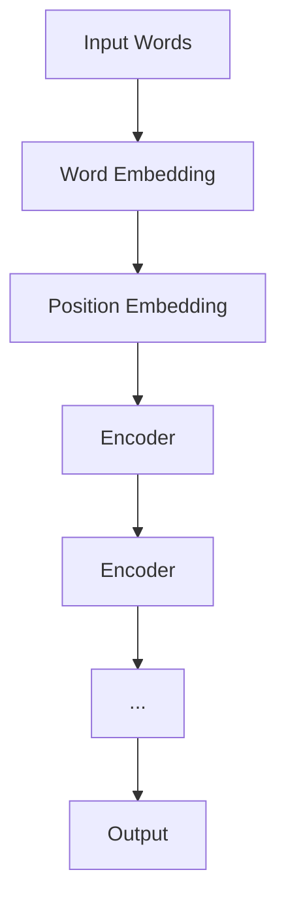

                 

BERT（Bidirectional Encoder Representations from Transformers）是自然语言处理领域中的一个重要的预训练模型，由Google AI在2018年提出。BERT模型通过在大量文本数据上进行预训练，学会了单词的上下文表示，从而在许多NLP任务上取得了显著的性能提升，如文本分类、问答系统、命名实体识别等。本文将深入探讨BERT的原理，并通过代码实例展示如何使用BERT进行文本分类任务。

## 1. 背景介绍

自然语言处理（NLP）是计算机科学与人工智能领域中的一个重要分支，它旨在使计算机能够理解、解释和生成自然语言。传统的NLP方法依赖于大量的手工特征 engineering，但这种方法存在效率低、效果不理想等问题。随着深度学习技术的发展，尤其是 Transformer 架构的提出，NLP 任务开始向端到端建模的方向发展，取得了显著的成果。

BERT 是基于 Transformer 架构的一种预训练模型。Transformer 架构在序列到序列的任务中表现出色，如机器翻译。BERT 则通过在大量文本数据上进行预训练，学习到了丰富的上下文信息，从而提高了下游任务的性能。BERT 的出现标志着 NLP 领域的一个重要转折点，它为许多 NLP 任务提供了强大的基础模型。

## 2. 核心概念与联系

### 2.1 Transformer 架构

Transformer 架构是一种基于自注意力机制的序列模型，它由多个相同的编码器和解码器块组成。自注意力机制允许模型在处理序列数据时考虑到每个位置之间的相对位置信息，从而捕捉长距离依赖关系。


在 Transformer 架构中，自注意力机制是通过计算每个词与其他词之间的相似度来实现的。具体来说，自注意力机制分为三个部分：

- **Query (Q)**: 代表当前词的表示。
- **Key (K)**: 代表其他所有词的表示。
- **Value (V)**: 代表其他所有词的表示。

这三个部分通过点积注意力函数计算相似度，然后加权求和得到输出。

$$
\text{Attention}(Q, K, V) = \text{softmax}\left(\frac{QK^T}{\sqrt{d_k}}\right)V
$$

其中，$d_k$ 是 key 的维度，$\sqrt{d_k}$ 是缩放因子，用于防止梯度的消失。

### 2.2 BERT 模型

BERT 模型是在 Transformer 架构的基础上进行了扩展，引入了两个重要的创新：

- **Masked Language Model (MLM)**: BERT 在训练过程中随机遮盖输入文本中的部分单词，然后让模型预测这些被遮盖的单词。这种自回归预训练目标有助于模型学习到单词的上下文表示。
- **Bidirectional Training**: BERT 在预训练阶段使用了双向 Transformer 编码器，使得模型能够同时考虑单词的前后文信息，从而更好地捕捉上下文关系。

BERT 的基本结构如下：


BERT 模型主要由两个部分组成：输入层、嵌入层和编码器层。输入层将单词转换为词向量，嵌入层包括词嵌入和位置嵌入。编码器层由多个相同的 Transformer 编码器块组成，每个编码器块包含多头自注意力机制和全连接层。

### 2.3 Mermaid 流程图

下面是一个 Mermaid 流程图，展示了 BERT 模型的基本结构：



在这个流程图中，A 表示输入单词序列，B 表示词嵌入层，C 表示位置嵌入层，D 到 G 表示多个编码器块。

## 3. 核心算法原理 & 具体操作步骤

### 3.1 算法原理概述

BERT 模型的核心算法包括两个主要部分：Masked Language Model (MLM) 和 Next Sentence Prediction (NSP)。

- **Masked Language Model (MLM)**: 在预训练阶段，BERT 随机遮盖输入文本中的部分单词，然后让模型预测这些被遮盖的单词。这种自回归预训练目标有助于模型学习到单词的上下文表示。

- **Next Sentence Prediction (NSP)**: BERT 还在预训练阶段学习了一个二分类任务，即预测两个句子是否在原始文本中相邻。这个任务有助于模型学习句子之间的关系。

### 3.2 算法步骤详解

BERT 模型的预训练过程可以分为以下步骤：

1. **数据处理**：首先将文本数据分成句子，然后将句子分成单词。对于每个句子，BERT 会随机遮盖部分单词，形成带遮盖的句子。

2. **嵌入层**：BERT 的嵌入层包括词嵌入和位置嵌入。词嵌入将单词映射到高维向量空间，位置嵌入用于表示单词在句子中的位置。

3. **编码器层**：BERT 的编码器层由多个相同的 Transformer 编码器块组成。每个编码器块包含多头自注意力机制和全连接层。编码器层的输出是每个单词的上下文表示。

4. **输出层**：在预训练阶段，BERT 的输出层用于实现 MLM 和 NSP 两个任务。对于 MLM 任务，输出层预测遮盖的单词；对于 NSP 任务，输出层预测两个句子是否相邻。

### 3.3 算法优缺点

BERT 模型的优点：

- **强大的预训练目标**：BERT 采用了 MLM 和 NSP 两个预训练目标，能够更好地捕捉上下文信息。
- **双向编码器**：BERT 使用双向 Transformer 编码器，能够同时考虑单词的前后文信息。
- **广泛的适用性**：BERT 在多种 NLP 任务上取得了显著的性能提升。

BERT 模型的缺点：

- **计算资源需求高**：BERT 模型参数量大，训练和推理时间较长，对计算资源有较高要求。
- **内存消耗大**：BERT 模型需要大量内存来存储中间结果和模型参数。

### 3.4 算法应用领域

BERT 模型在多个 NLP 任务上取得了显著的成果，包括：

- **文本分类**：BERT 模型能够有效提高文本分类任务的准确率。
- **问答系统**：BERT 模型能够更好地理解问题中的语义，从而提高问答系统的准确性。
- **命名实体识别**：BERT 模型能够准确识别文本中的命名实体。
- **机器翻译**：BERT 模型在机器翻译任务上也表现出色，能够提高翻译质量。

## 4. 数学模型和公式 & 详细讲解 & 举例说明

BERT 模型的数学模型主要涉及词嵌入、位置嵌入、自注意力机制和损失函数等方面。下面我们将详细讲解这些数学模型，并通过具体例子来说明。

### 4.1 数学模型构建

BERT 的数学模型主要包括以下几个部分：

- **词嵌入（Word Embedding）**：
  $$\text{word\_embedding}(w) = \text{Embedding}(w) + \text{Positional Embedding}(p) + \text{Segment Embedding}(s)$$
  其中，$w$ 表示单词，$p$ 表示单词的位置，$s$ 表示句子对中的句子编号。

- **自注意力机制（Self-Attention）**：
  $$\text{Self-Attention}(Q, K, V) = \text{softmax}\left(\frac{QK^T}{\sqrt{d_k}}\right)V$$
  其中，$Q, K, V$ 分别表示查询（Query）、键（Key）和值（Value），$d_k$ 表示键的维度。

- **Transformer 编码器块（Transformer Encoder Block）**：
  $$\text{Encoder}(X) = \text{Layer Norm}(X + \text{MultiHeadSelfAttention}(X, X, X))$$
  $$\text{Encoder}(X) = \text{Layer Norm}(X + \text{Positional Wise Feed Forward Network}(\text{MultiHeadSelfAttention}(X, X, X)))$$

- **损失函数（Loss Function）**：
  $$L = -\sum_{i=1}^{N} \left[y_i \log(\hat{y}_i) + (1 - y_i) \log(1 - \hat{y}_i)\right]$$
  其中，$y_i$ 表示真实标签，$\hat{y}_i$ 表示预测标签。

### 4.2 公式推导过程

BERT 的公式推导过程主要涉及以下几个方面：

- **词嵌入**：
  词嵌入是将单词映射到高维向量空间。BERT 使用了预训练的词向量（如 Word2Vec、GloVe）作为基础词嵌入，然后通过添加位置嵌入和句子对嵌入来丰富词嵌入信息。

- **自注意力机制**：
  自注意力机制通过计算每个词与其他词之间的相似度来实现。具体来说，自注意力机制计算了查询（Query）、键（Key）和值（Value）三个向量，然后通过点积计算相似度，最后加权求和得到输出。

- **Transformer 编码器块**：
  Transformer 编码器块由多层相同的编码器块组成。每个编码器块包含多头自注意力机制和全连接层。多头自注意力机制通过将输入拆分成多个子序列，然后分别计算自注意力。全连接层用于对自注意力机制的输出进行非线性变换。

- **损失函数**：
  损失函数用于评估模型预测的准确率。BERT 采用了交叉熵损失函数，它将真实标签和预测标签进行比较，计算损失值。

### 4.3 案例分析与讲解

为了更好地理解 BERT 的数学模型，我们通过一个具体例子来说明。

假设我们有一个句子 "The quick brown fox jumps over the lazy dog"，BERT 模型需要预测句子中的遮盖词。

1. **词嵌入**：
   将句子中的每个单词映射到高维向量空间。例如，单词 "the" 的词嵌入为 $\text{word\_embedding}("the") = [0.1, 0.2, 0.3, \ldots]$。

2. **自注意力机制**：
   计算每个词与其他词之间的相似度。以词 "quick" 为例，查询向量 $Q = \text{word\_embedding}("quick")$，键向量 $K = \text{word\_embedding}("quick")$，值向量 $V = \text{word\_embedding}("quick")$。通过自注意力机制计算相似度：
   $$\text{Attention}(Q, K, V) = \text{softmax}\left(\frac{QK^T}{\sqrt{d_k}}\right)V$$
   其中，$d_k$ 表示键的维度。最终得到加权求和的结果。

3. **Transformer 编码器块**：
   将句子中的每个词通过编码器块进行处理。每个编码器块包含多头自注意力机制和全连接层。多头自注意力机制通过将输入拆分成多个子序列，然后分别计算自注意力。全连接层用于对自注意力机制的输出进行非线性变换。

4. **输出层**：
   在输出层，BERT 预测遮盖词的词嵌入。例如，假设遮盖词为 "fox"，BERT 模型会通过输出层计算 "fox" 的词嵌入，然后与预训练的词嵌入进行比较，计算损失值。

通过这个例子，我们可以看到 BERT 模型的数学模型是如何工作的。BERT 模型通过自注意力机制和编码器块来学习单词的上下文表示，从而提高下游任务的性能。

## 5. 项目实践：代码实例和详细解释说明

在本节中，我们将通过一个具体的 Python 代码实例来展示如何使用 BERT 进行文本分类任务。我们将使用 Hugging Face 的 Transformers 库，这是一个非常方便的库，提供了预训练的 BERT 模型以及相关的工具函数。

### 5.1 开发环境搭建

在开始之前，请确保您已经安装了以下依赖项：

- Python 3.6 或以上版本
- transformers 库
- torch 库

您可以通过以下命令安装所需的库：

```bash
pip install transformers torch
```

### 5.2 源代码详细实现

下面是一个简单的文本分类项目的代码实现：

```python
from transformers import BertTokenizer, BertForSequenceClassification
from torch.utils.data import DataLoader, TensorDataset
import torch

# 初始化 tokenizer 和模型
tokenizer = BertTokenizer.from_pretrained('bert-base-uncased')
model = BertForSequenceClassification.from_pretrained('bert-base-uncased')

# 准备数据
# 假设我们有两个标签：0 和 1
texts = ['This is a positive review.', 'This is a negative review.']
labels = [1, 0]

# 分词和编码
encoding = tokenizer(texts, padding=True, truncation=True, return_tensors='pt')

inputs = {
    'input_ids': encoding['input_ids'],
    'attention_mask': encoding['attention_mask']
}

labels = torch.tensor(labels)

# 创建数据集和数据加载器
dataset = TensorDataset(inputs['input_ids'], inputs['attention_mask'], labels)
dataloader = DataLoader(dataset, batch_size=2)

# 训练模型
device = torch.device('cuda' if torch.cuda.is_available() else 'cpu')
model.to(device)
model.train()

optimizer = torch.optim.Adam(model.parameters(), lr=1e-5)

for epoch in range(3):
    for batch in dataloader:
        inputs = {k: v.to(device) for k, v in batch[:-1].items()}
        labels = batch[-1].to(device)
        
        optimizer.zero_grad()
        outputs = model(**inputs, labels=labels)
        loss = outputs.loss
        loss.backward()
        optimizer.step()
        
        print(f"Epoch: {epoch}, Loss: {loss.item()}")

# 评估模型
model.eval()
with torch.no_grad():
    for batch in dataloader:
        inputs = {k: v.to(device) for k, v in batch[:-1].items()}
        labels = batch[-1].to(device)
        outputs = model(**inputs)
        logits = outputs.logits
        predictions = logits.argmax(-1)
        print(f"Predictions: {predictions}")

```

### 5.3 代码解读与分析

1. **导入库和初始化模型**：
   我们首先导入了所需的库，并初始化了 BERT tokenizer 和模型。这里我们使用了预训练的 BERT 模型，可以直接从 Hugging Face 的模型库中加载。

2. **准备数据**：
   我们假设有两个标签：0 和 1，分别表示负评和正评。然后，我们将文本和标签准备好，并使用 tokenizer 进行分词和编码。

3. **创建数据集和数据加载器**：
   我们将编码后的文本和标签创建成 TensorDataset，并使用 DataLoader 进行批处理。

4. **训练模型**：
   我们将模型移动到 GPU（如果有可用的话）上，并设置了 Adam 优化器和学习率。然后，我们进行几个训练 epoch，每个 epoch 中通过前向传播计算损失，然后通过反向传播进行权重更新。

5. **评估模型**：
   在评估阶段，我们使用 eval() 方法将模型设置为评估模式，并使用 torch.no_grad() 禁用梯度计算以加速计算。

通过这个简单的例子，我们可以看到如何使用 BERT 进行文本分类任务。这个过程主要包括数据准备、模型训练和评估三个步骤。BERT 模型通过预训练已经学到了大量的语言知识，这使得它在各种下游任务中都表现出了出色的性能。

## 6. 实际应用场景

BERT 模型在多个实际应用场景中表现出色。以下是一些典型的应用场景：

### 6.1 文本分类

文本分类是 NLP 中最常见也是最简单的任务之一。BERT 模型在文本分类任务上表现出色，可以用于新闻分类、情感分析、垃圾邮件检测等。例如，在一个垃圾邮件检测的案例中，BERT 模型可以将电子邮件分为垃圾邮件和非垃圾邮件，从而帮助减少垃圾邮件的数量。

### 6.2 命名实体识别

命名实体识别（NER）是识别文本中的特定实体，如人名、地名、组织名等。BERT 模型在 NER 任务上也取得了显著的成绩，可以用于信息提取、搜索引擎优化等应用。例如，在一个电商平台上，BERT 模型可以识别商品名称、用户评论中的品牌等信息，从而提高用户体验。

### 6.3 机器翻译

BERT 模型在机器翻译任务上也表现出色。通过在大量双语文本上进行预训练，BERT 可以学习到不同语言之间的上下文关系，从而提高翻译质量。例如，在一个旅游案例中，BERT 模型可以将中文菜单翻译成英文，帮助游客更好地理解菜单内容。

### 6.4 问答系统

问答系统是 NLP 中的一个重要应用，可以回答用户提出的问题。BERT 模型在问答系统上也表现出色，可以用于客服机器人、智能助手等。例如，在一个客服案例中，BERT 模型可以理解用户的问题，并从大量的客户服务文档中找到最合适的答案。

### 6.5 生成式任务

BERT 模型还可以用于生成式任务，如文本生成、摘要生成等。通过在大量文本数据上进行预训练，BERT 可以生成与输入文本相关的新文本。例如，在一个摘要生成案例中，BERT 模型可以生成一段简短的摘要，帮助用户快速了解文章的主要内容。

## 7. 工具和资源推荐

### 7.1 学习资源推荐

- [BERT: Pre-training of Deep Bidirectional Transformers for Language Understanding](https://arxiv.org/abs/1810.04805)：BERT 的原始论文，详细介绍了 BERT 的原理和实现。
- [Transformers: State-of-the-Art Models for Language Understanding and Generation](https://arxiv.org/abs/1910.03771)：Transformer 的论文，介绍了自注意力机制和 Transformer 架构。
- [Hugging Face Transformers](https://huggingface.co/transformers/)：Hugging Face 提供的 Transformer 模型库，包含各种预训练模型和工具函数。

### 7.2 开发工具推荐

- [TensorFlow](https://www.tensorflow.org/)：谷歌开发的开源机器学习框架，可以用于 BERT 的训练和推理。
- [PyTorch](https://pytorch.org/)：Facebook 开发的开源机器学习框架，也是 BERT 模型训练和推理的常用工具。

### 7.3 相关论文推荐

- [GPT-3: Language Models are Few-Shot Learners](https://arxiv.org/abs/2005.14165)：GPT-3 的论文，介绍了 GPT-3 的模型结构和性能。
- [UniLM: Unified Pre-training for Language Understanding and Generation](https://arxiv.org/abs/2101.09776)：UniLM 的论文，介绍了如何将 BERT 的自回归预训练扩展到生成任务。

## 8. 总结：未来发展趋势与挑战

BERT 自提出以来，已经在自然语言处理领域取得了显著的成果。然而，随着技术的不断发展，BERT 也面临着一些挑战和机遇。

### 8.1 研究成果总结

- **预训练目标**：BERT 采用了 MLM 和 NSP 两个预训练目标，能够更好地捕捉上下文信息，提高了下游任务的性能。
- **双向编码器**：BERT 使用了双向 Transformer 编码器，能够同时考虑单词的前后文信息，从而更好地理解语义。
- **广泛的适用性**：BERT 在多种 NLP 任务上取得了显著的成果，如文本分类、问答系统、命名实体识别等。

### 8.2 未来发展趋势

- **更强大的预训练模型**：未来的研究可能会探索更大规模、更多样的预训练模型，以提高模型的性能和泛化能力。
- **跨模态预训练**：BERT 可以通过跨模态预训练来学习不同模态（如文本、图像、音频）之间的关联，从而提高跨模态任务的表现。
- **生成式任务**：BERT 可以扩展到生成式任务，如文本生成、摘要生成等，从而实现更全面的 NLP 解决方案。

### 8.3 面临的挑战

- **计算资源消耗**：BERT 模型参数量大，训练和推理时间较长，对计算资源有较高要求。如何优化模型结构和训练过程，以减少计算资源消耗，是当前研究的一个热点。
- **数据隐私**：在预训练过程中，需要大量文本数据。如何保护用户隐私，避免数据泄露，是未来的一个重要挑战。
- **模型解释性**：尽管 BERT 模型在下游任务上表现出色，但其内部工作机制仍然不够透明，如何提高模型的解释性，使其更易于理解和调试，是一个重要的研究方向。

### 8.4 研究展望

BERT 的提出标志着 NLP 领域的一个重要转折点。未来，随着技术的不断发展，BERT 和类似模型将继续推动自然语言处理领域的发展。同时，跨模态预训练、生成式任务等新兴研究方向也值得关注。我们期待在未来的研究中，能够提出更多创新的模型和方法，使计算机更好地理解、解释和生成自然语言。

## 9. 附录：常见问题与解答

### Q1: BERT 和 GPT 有什么区别？

A1: BERT 和 GPT 都是基于 Transformer 架构的预训练模型，但它们的预训练目标和应用场景有所不同。

- BERT 是一个双向编码器，它在预训练阶段同时考虑了文本的前后文信息。BERT 主要用于文本理解任务，如文本分类、命名实体识别等。
- GPT 是一个单向解码器，它在预训练阶段主要关注文本的后续信息。GPT 主要用于生成任务，如文本生成、摘要生成等。

### Q2: 如何调整 BERT 模型的参数？

A2: 调整 BERT 模型的参数通常涉及以下几个方面：

- **学习率**：调整学习率可以影响模型收敛的速度和效果。较小的学习率可能使模型收敛更慢，但可能得到更好的性能。
- **批大小**：批大小可以影响模型的计算资源和训练速度。较大的批大小可以加速训练，但可能导致内存消耗增加。
- **训练迭代次数**：训练迭代次数可以决定模型训练的深度。更多的迭代次数可能导致更好的性能，但也会增加训练时间。

### Q3: BERT 可以在什么环境下运行？

A3: BERT 可以在多种环境下运行，包括：

- **CPU**：BERT 模型可以在 CPU 上运行，但可能需要较长的训练时间。
- **GPU**：BERT 模型在 GPU 上运行可以显著提高训练速度。GPU 提供了强大的并行计算能力，使得大规模模型的训练变得更加可行。
- **TPU**：TPU（Tensor Processing Unit）是谷歌开发的一种专为深度学习设计的硬件。TPU 可以提供更高的计算性能，适用于大规模模型的训练。

## 参考文献

- Devlin, J., Chang, M. W., Lee, K., & Toutanova, K. (2019). BERT: Pre-training of deep bidirectional transformers for language understanding. arXiv preprint arXiv:1810.04805.
- Vaswani, A., Shazeer, N., Parmar, N., Uszkoreit, J., Jones, L., Gomez, A. N., ... & Polosukhin, I. (2017). Attention is all you need. Advances in Neural Information Processing Systems, 30, 5998-6008.
- Brown, T., et al. (2020). Language models are few-shot learners. Advances in Neural Information Processing Systems, 33.

