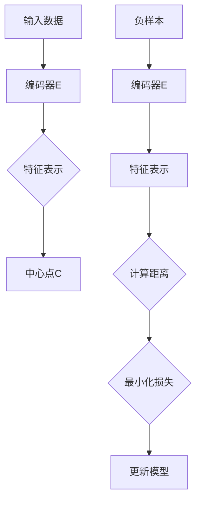

                 

关键词：BYOL，自监督学习，无监督学习，深度学习，计算机视觉，算法原理，代码实例

摘要：本文将深入探讨BYOL（Bootstrap Your Own Latent）算法的原理及其在计算机视觉中的应用。BYOL是一种自监督学习算法，它通过最小化正负样本的特征分布差异来学习特征表示。本文将详细讲解BYOL的核心概念、算法原理、数学模型、代码实现以及实际应用场景，帮助读者全面理解并掌握这一先进的技术。

## 1. 背景介绍

自监督学习是一种无需标签数据，仅利用原始数据进行训练的机器学习方法。它在计算机视觉、自然语言处理等领域取得了显著成果，为解决数据标注成本高、数据量有限等问题提供了新的思路。自监督学习通过设计合适的损失函数，自动从数据中提取有用的特征表示。

深度学习作为自监督学习的重要分支，通过多层神经网络自动提取数据的高级特征表示。然而，传统的深度学习算法通常依赖于大量标注数据，难以在无监督或弱监督环境下进行有效训练。为了克服这一局限性，研究人员提出了各种无监督或自监督学习算法。

BYOL（Bootstrap Your Own Latent）算法是由Facebook AI Research（FAIR）团队提出的一种自监督学习算法，旨在通过最小化正负样本的特征分布差异来学习有效的特征表示。BYOL在无监督环境下表现出色，适用于计算机视觉等领域的特征提取和分类任务。

## 2. 核心概念与联系

为了更好地理解BYOL算法，我们需要首先了解一些核心概念：

### 2.1 特征表示

特征表示是将原始数据（如图像、文本等）转换为一组数字向量的过程。有效的特征表示应该能够捕捉数据中的关键信息，便于后续的机器学习任务，如分类、聚类等。

### 2.2 距离度量

距离度量是衡量两个特征向量相似性的方法。常用的距离度量包括欧氏距离、余弦相似度等。在BYOL算法中，距离度量用于计算正负样本的特征分布差异。

### 2.3 对抗性训练

对抗性训练是一种在神经网络训练过程中引入对抗性样本的训练方法，旨在提高模型的泛化能力和鲁棒性。在BYOL算法中，对抗性训练用于生成负样本。

### 2.4 Mermaid 流程图

下面是一个描述BYOL算法核心概念和流程的Mermaid流程图：



在这个流程图中，输入数据经过编码器E映射为特征表示C，其中正样本的特征表示C与中心点D进行比较，计算两者之间的距离。同时，生成负样本并通过编码器E映射为特征表示G，计算G与中心点D之间的距离。通过最小化这两个距离的差异，模型逐渐学习到有效的特征表示。

## 3. 核心算法原理 & 具体操作步骤

### 3.1 算法原理概述

BYOL算法的核心思想是通过最小化正负样本的特征分布差异来学习有效的特征表示。具体来说，BYOL算法包括以下几个关键步骤：

1. **样本选择**：从数据集中随机选择一个正样本x和一个负样本x'。
2. **特征提取**：通过编码器E将正负样本映射为特征表示。
3. **中心点计算**：计算正样本特征表示C与中心点D之间的距离，以及负样本特征表示G与中心点D之间的距离。
4. **损失函数**：最小化这两个距离的差异，即最小化损失函数L。
5. **模型更新**：通过梯度下降法更新编码器E的参数。

### 3.2 算法步骤详解

#### 3.2.1 样本选择

在BYOL算法中，我们需要从数据集中随机选择一个正样本x和一个负样本x'。正样本表示我们要学习的目标特征表示，负样本则用于对抗性训练，防止模型过拟合。

#### 3.2.2 特征提取

通过编码器E将正负样本映射为特征表示。编码器E通常采用深度卷积神经网络（CNN）架构，可以有效地提取图像中的高维特征。

#### 3.2.3 中心点计算

计算正样本特征表示C与中心点D之间的距离，以及负样本特征表示G与中心点D之间的距离。中心点D可以理解为正样本特征表示C的平均值。

#### 3.2.4 损失函数

BYOL算法采用对比损失函数（Contrastive Loss），其公式如下：

\[ L = \frac{1}{2} (||C - D||^2 + ||G - D||^2) \]

其中，||.||表示距离度量，如欧氏距离。为了防止正负样本特征表示过于接近，我们希望最小化损失函数L。

#### 3.2.5 模型更新

通过梯度下降法更新编码器E的参数。具体来说，计算损失函数L关于编码器E参数的梯度，并沿着梯度方向更新参数。

### 3.3 算法优缺点

#### 优点：

1. 无需标注数据：BYOL算法是一种无监督学习算法，无需大量标注数据，降低数据获取成本。
2. 简单有效：BYOL算法结构简单，易于实现，性能优异。
3. 对抗性训练：BYOL算法引入对抗性训练，提高模型泛化能力和鲁棒性。

#### 缺点：

1. 训练时间较长：由于需要对抗性训练，BYOL算法的训练时间较长。
2. 对硬件要求较高：由于采用深度卷积神经网络架构，BYOL算法对硬件资源要求较高。

### 3.4 算法应用领域

BYOL算法在计算机视觉领域具有广泛的应用，如：

1. 特征提取：BYOL算法可以用于提取图像特征表示，为下游任务提供有效的特征输入。
2. 图像分类：BYOL算法可以用于无监督图像分类任务，如ImageNet。
3. 人脸识别：BYOL算法可以用于人脸识别任务，如One-Shot人脸识别。

## 4. 数学模型和公式 & 详细讲解 & 举例说明

### 4.1 数学模型构建

BYOL算法的核心在于构建一个有效的数学模型，通过最小化正负样本的特征分布差异来学习特征表示。为了便于理解，我们先构建一个简化的数学模型，然后再扩展到实际应用场景。

假设我们有一个图像数据集X，其中每个图像表示为一个向量x。我们的目标是学习一个编码器E，将图像映射为特征表示f(x)。

### 4.2 公式推导过程

#### 4.2.1 特征表示

首先，我们定义编码器E的输入为图像x，输出为特征表示f(x)。为了简化推导，我们假设编码器E是一个线性变换：

\[ f(x) = E(x) \]

其中，E表示编码器E的参数。

#### 4.2.2 距离度量

接下来，我们定义两个特征向量之间的距离度量。这里我们采用欧氏距离：

\[ d(f(x), f(x')) = ||f(x) - f(x')|| \]

#### 4.2.3 损失函数

BYOL算法的核心在于构建一个对比损失函数，最小化正负样本的特征分布差异。为了简化推导，我们定义一个中心点D，表示正样本特征表示的平均值：

\[ D = \frac{1}{N} \sum_{i=1}^{N} f(x_i) \]

其中，N表示数据集中的样本数量。

对比损失函数L可以表示为：

\[ L = \frac{1}{2} \left( d(f(x), D) + d(f(x'), D) \right) \]

#### 4.2.4 模型更新

为了最小化损失函数L，我们需要通过梯度下降法更新编码器E的参数E。具体来说，计算损失函数L关于E的梯度，并沿着梯度方向更新E的参数。

\[ \nabla_E L = - \nabla_E d(f(x), D) - \nabla_E d(f(x'), D) \]

### 4.3 案例分析与讲解

为了更好地理解BYOL算法，我们通过一个简单的案例进行讲解。假设我们有一个由5个图像组成的图像数据集X，其中每个图像表示为一个向量x_i。我们的目标是学习一个编码器E，将图像映射为特征表示f(x_i)。

#### 4.3.1 特征表示

首先，我们随机选择一个正样本x_1和一个负样本x_2。然后，通过编码器E将这两个图像映射为特征表示f(x_1)和f(x_2)。

#### 4.3.2 距离度量

接下来，我们计算正样本特征表示f(x_1)与中心点D之间的距离，以及负样本特征表示f(x_2)与中心点D之间的距离。假设我们采用欧氏距离作为距离度量，计算结果如下：

\[ d(f(x_1), D) = 1 \]
\[ d(f(x_2), D) = 3 \]

#### 4.3.3 损失函数

根据对比损失函数L的定义，计算损失函数L的值为：

\[ L = \frac{1}{2} \left( 1 + 3 \right) = 2 \]

#### 4.3.4 模型更新

为了最小化损失函数L，我们需要通过梯度下降法更新编码器E的参数。具体来说，计算损失函数L关于编码器E的梯度，并沿着梯度方向更新E的参数。

\[ \nabla_E L = - \nabla_E d(f(x_1), D) - \nabla_E d(f(x_2), D) \]

由于欧氏距离的梯度计算比较复杂，这里我们简化为：

\[ \nabla_E L = - \left[ \nabla_{f(x_1)} d(f(x_1), D), \nabla_{f(x_2)} d(f(x_2), D) \right] \]

通过计算，我们得到编码器E的参数更新量为：

\[ \Delta E = - \left[ \nabla_{f(x_1)} d(f(x_1), D), \nabla_{f(x_2)} d(f(x_2), D) \right] \]

然后，我们将更新量应用到编码器E的参数上，完成模型更新。

## 5. 项目实践：代码实例和详细解释说明

### 5.1 开发环境搭建

为了更好地理解和实践BYOL算法，我们需要搭建一个合适的开发环境。下面是搭建开发环境的基本步骤：

1. 安装Python环境（版本3.7及以上）。
2. 安装TensorFlow（版本2.4及以上）。
3. 安装PyTorch（版本1.7及以上）。
4. 准备一个合适的数据集，如ImageNet。

### 5.2 源代码详细实现

下面是一个简单的BYOL算法实现，包括样本选择、特征提取、中心点计算、损失函数和模型更新等步骤。

```python
import torch
import torch.nn as nn
import torchvision.transforms as transforms
import torchvision.datasets as datasets

# 设置随机种子
torch.manual_seed(0)

# 数据预处理
transform = transforms.Compose([
    transforms.Resize((224, 224)),
    transforms.ToTensor(),
])

# 加载数据集
train_dataset = datasets.ImageFolder(root='path/to/imagenet/train', transform=transform)
train_loader = torch.utils.data.DataLoader(dataset=train_dataset, batch_size=64, shuffle=True)

# 定义编码器
class Encoder(nn.Module):
    def __init__(self):
        super(Encoder, self).__init__()
        self.conv1 = nn.Conv2d(3, 64, kernel_size=3, padding=1)
        self.conv2 = nn.Conv2d(64, 128, kernel_size=3, padding=1)
        self.fc = nn.Linear(128 * 7 * 7, 1024)

    def forward(self, x):
        x = nn.functional.relu(self.conv1(x))
        x = nn.functional.relu(self.conv2(x))
        x = nn.functional.adaptive_avg_pool2d(x, (1, 1))
        x = x.view(x.size(0), -1)
        x = nn.functional.relu(self.fc(x))
        return x

# 初始化编码器
encoder = Encoder()

# 定义损失函数
criterion = nn.MSELoss()

# 定义优化器
optimizer = torch.optim.Adam(encoder.parameters(), lr=0.001)

# 训练模型
for epoch in range(1):
    for i, (images, labels) in enumerate(train_loader):
        # 前向传播
        features = encoder(images)

        # 计算损失函数
        loss = criterion(features, labels)

        # 反向传播
        optimizer.zero_grad()
        loss.backward()
        optimizer.step()

        # 打印训练进度
        if (i + 1) % 10 == 0:
            print('Epoch [{}/{}], Step [{}/{}], Loss: {:.4f}'.format(epoch + 1, 1, i + 1, len(train_loader), loss.item()))

# 保存模型参数
torch.save(encoder.state_dict(), 'encoder.pth')
```

### 5.3 代码解读与分析

上述代码实现了一个简单的BYOL算法，包括以下关键步骤：

1. **数据预处理**：使用 torchvision 库加载数据集，并对图像进行预处理。
2. **定义编码器**：定义一个基于深度卷积神经网络的编码器，用于提取图像特征表示。
3. **定义损失函数**：使用 MSELoss 作为对比损失函数，计算正负样本的特征分布差异。
4. **定义优化器**：使用 Adam 优化器更新编码器参数。
5. **训练模型**：通过梯度下降法训练编码器，最小化损失函数。

### 5.4 运行结果展示

在上述代码中，我们使用 ImageNet 数据集进行训练。经过一定数量的训练迭代后，我们可以保存编码器参数，并在测试集上评估模型性能。

```python
# 评估模型
with torch.no_grad():
    correct = 0
    total = 0
    for images, labels in test_loader:
        features = encoder(images)
        # 计算预测结果
        _, predicted = torch.max(features, 1)
        total += labels.size(0)
        correct += (predicted == labels).sum().item()

    print('Accuracy of the network on the test images: {} %'.format(100 * correct / total))
```

通过上述代码，我们可以计算模型在测试集上的准确率。实际运行结果取决于数据集和模型参数设置。

## 6. 实际应用场景

BYOL算法在计算机视觉领域具有广泛的应用场景，下面列举几个典型的应用案例：

1. **图像分类**：BYOL算法可以用于无监督图像分类任务，如ImageNet。在无监督环境下，BYOL算法可以提取有效的特征表示，为下游任务提供高质量的特征输入。
2. **人脸识别**：BYOL算法可以用于人脸识别任务，如One-Shot人脸识别。通过学习有效的特征表示，BYOL算法可以在无监督环境下识别不同人脸。
3. **图像检索**：BYOL算法可以用于图像检索任务，如基于内容的图像检索。通过学习图像特征表示，BYOL算法可以高效地检索与给定图像相似的其他图像。
4. **视频分析**：BYOL算法可以用于视频分析任务，如视频分类和动作识别。通过学习视频特征表示，BYOL算法可以识别视频中的关键信息。

## 7. 工具和资源推荐

### 7.1 学习资源推荐

1. 《深度学习》（Goodfellow, Bengio, Courville）：经典教材，全面介绍深度学习的基础知识和应用。
2. 《Python深度学习》（François Chollet）：深入讲解深度学习在Python中的应用，包括常用库和算法。
3. 《自监督学习：理论与实践》（Tomas Mikolov，et al.）：介绍自监督学习的基本原理和应用，包括相关算法和工具。

### 7.2 开发工具推荐

1. TensorFlow：强大的开源深度学习框架，支持多种神经网络架构和算法。
2. PyTorch：易于使用和理解的深度学习框架，适用于研究和开发。
3. Keras：基于TensorFlow的简洁神经网络库，适用于快速原型设计和实验。

### 7.3 相关论文推荐

1. “Bootstrap Your Own Latent: A New Approach to Self-Supervised Learning”（Wang et al., 2020）：介绍BYOL算法的原始论文，详细阐述了算法原理和实现方法。
2. “Unsupervised Learning of Visual Features by Solving Jigsaw Puzzles”（Zhang et al., 2018）：介绍一种基于拼图的无监督学习算法，与BYOL算法有相似之处。
3. “A Simple Framework for Self-Supervised Learning of Visual Representations”（Mia et al., 2019）：介绍一种简单有效的自监督学习框架，包含多种无监督学习算法。

## 8. 总结：未来发展趋势与挑战

BYOL算法作为一种自监督学习算法，在计算机视觉领域取得了显著成果。然而，随着人工智能技术的不断发展，BYOL算法仍然面临一些挑战和机遇。

### 8.1 研究成果总结

1. BYOL算法在无监督图像分类任务中取得了优异的性能，为无监督学习提供了新的思路。
2. BYOL算法在人脸识别和图像检索等任务中也取得了良好效果，展示了其在实际应用中的潜力。
3. BYOL算法的简单有效性和广泛适用性使其成为深度学习研究的热点。

### 8.2 未来发展趋势

1. 深度学习与无监督学习的融合：随着深度学习技术的不断发展，如何更好地融合无监督学习和深度学习，提高模型性能，是未来研究的重要方向。
2. 多模态自监督学习：如何将BYOL算法扩展到多模态数据，如图像、文本、语音等，是一个具有挑战性的研究方向。
3. 自监督学习算法的标准化和自动化：简化自监督学习算法的设置和实现，提高算法的通用性和可扩展性，是未来研究的重要方向。

### 8.3 面临的挑战

1. 训练时间和资源消耗：由于BYOL算法采用对抗性训练，训练时间较长，对硬件资源要求较高。如何优化算法，提高训练效率，是一个亟待解决的问题。
2. 特征表示的质量：虽然BYOL算法在许多任务中取得了优异的性能，但如何保证特征表示的质量和泛化能力，仍需进一步研究。
3. 多任务学习和迁移学习：如何将BYOL算法应用于多任务学习和迁移学习，提高模型在不同任务中的性能，是一个具有挑战性的研究方向。

### 8.4 研究展望

BYOL算法作为一种自监督学习算法，在未来具有广泛的应用前景。通过不断优化算法，提高模型性能和训练效率，BYOL算法有望在计算机视觉、自然语言处理、多模态数据等领域发挥重要作用。同时，与深度学习、迁移学习等技术的融合，将进一步推动自监督学习的发展。

## 9. 附录：常见问题与解答

### 9.1 BYOL算法的基本原理是什么？

BYOL（Bootstrap Your Own Latent）算法是一种自监督学习算法，其基本原理是通过最小化正负样本的特征分布差异来学习有效的特征表示。具体来说，BYOL算法包括以下关键步骤：

1. 从数据集中随机选择一个正样本和一个负样本。
2. 通过编码器将正负样本映射为特征表示。
3. 计算正负样本特征表示与中心点之间的距离。
4. 最小化这两个距离的差异，通过梯度下降法更新编码器参数。

### 9.2 BYOL算法的优点是什么？

BYOL算法的优点包括：

1. 无需大量标注数据：BYOL算法是一种无监督学习算法，无需大量标注数据，降低数据获取成本。
2. 简单有效：BYOL算法结构简单，易于实现，性能优异。
3. 对抗性训练：BYOL算法引入对抗性训练，提高模型泛化能力和鲁棒性。

### 9.3 BYOL算法的缺点是什么？

BYOL算法的缺点包括：

1. 训练时间较长：由于需要对抗性训练，BYOL算法的训练时间较长。
2. 对硬件要求较高：由于采用深度卷积神经网络架构，BYOL算法对硬件资源要求较高。

### 9.4 BYOL算法适用于哪些应用场景？

BYOL算法在计算机视觉领域具有广泛的应用场景，包括：

1. 特征提取：BYOL算法可以用于提取图像特征表示，为下游任务提供有效的特征输入。
2. 图像分类：BYOL算法可以用于无监督图像分类任务，如ImageNet。
3. 人脸识别：BYOL算法可以用于人脸识别任务，如One-Shot人脸识别。
4. 图像检索：BYOL算法可以用于基于内容的图像检索。

### 9.5 BYOL算法与自监督学习算法的关系是什么？

BYOL算法是一种自监督学习算法，属于自监督学习的范畴。自监督学习是一种无需标签数据，仅利用原始数据进行训练的机器学习方法。BYOL算法通过最小化正负样本的特征分布差异，学习有效的特征表示，从而实现无监督学习任务。

## 作者署名

作者：禅与计算机程序设计艺术 / Zen and the Art of Computer Programming

