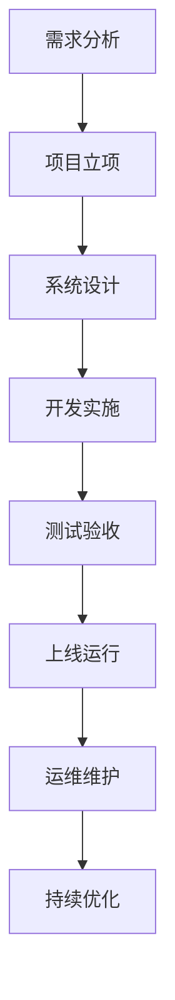

                 

关键词：B端项目、收入、深度嵌入、不确定性、技术风险、商业模式、项目可行性、未来展望

摘要：本文将深入探讨B端项目在商业市场中的潜力，分析其可能带来的可观收入，同时也将探讨深度嵌入技术所带来的不确定性，以及这些不确定性对项目的潜在影响。通过对B端项目的商业逻辑、技术实现和风险管理等方面的详细分析，本文旨在为读者提供对B端项目发展现状和未来趋势的全面理解。

## 1. 背景介绍

B端项目，通常指的是面向企业或组织的服务和解决方案，它们为企业提供支持其日常运营、管理和决策的技术产品或服务。B端项目以其高复杂度、长期性和定制化特点，与面向消费者的C端项目形成鲜明对比。随着信息技术和互联网的快速发展，B端项目在商业市场中的地位日益重要。

B端项目的商业价值主要体现在以下几个方面：

- **高收入潜力**：B端项目往往涉及较高的投入成本，但一旦成功，其收入回报也相应较高。这主要得益于企业客户对高质量服务和定制化解决方案的需求。
- **稳定客户群**：与C端用户相比，B端客户通常更为稳定，客户生命周期更长，因此B端项目的可持续性较高。
- **品牌影响力**：成功的企业解决方案不仅能够为企业带来收入，还能提升企业的品牌影响力和市场地位。

然而，尽管B端项目具有上述优势，但其发展过程中也面临着诸多挑战，尤其是深度嵌入所带来的不确定性。接下来，我们将深入探讨这些挑战，并分析其对项目可行性的影响。

## 2. 核心概念与联系

### 2.1. B端项目的定义和特点

B端项目主要面向企业客户，提供包括但不限于以下服务或产品：

- **企业管理软件**：如ERP（企业资源计划）、CRM（客户关系管理）、SCM（供应链管理）等。
- **行业解决方案**：根据特定行业需求，提供定制化的解决方案，如医疗行业的信息化建设、金融行业的风险管理等。
- **数据分析和报告**：为企业提供数据分析和报告服务，帮助其做出更明智的决策。

B端项目的特点包括：

- **定制化**：与C端项目相比，B端项目往往需要根据企业客户的特定需求进行定制化开发。
- **高复杂度**：B端项目涉及多个系统、多个部门和多个业务流程，具有较高的复杂度。
- **长期性**：B端项目的生命周期通常较长，从项目的立项到实施、维护和升级，可能需要数年时间。

### 2.2. 深度嵌入的定义和影响

深度嵌入是指将技术或服务深入到企业的核心业务流程中，成为企业运营的重要组成部分。这种深度嵌入带来了以下几个方面的积极影响：

- **提升效率**：通过深度嵌入技术，企业能够优化业务流程，提高工作效率。
- **降低成本**：自动化和智能化的解决方案能够降低人力成本和运营成本。
- **增强竞争力**：深度嵌入的技术解决方案能够提升企业的竞争力，帮助其在市场中脱颖而出。

然而，深度嵌入也带来了一定的不确定性：

- **技术风险**：深度嵌入可能导致技术故障或兼容性问题，影响企业的正常运营。
- **数据安全**：企业的敏感数据可能因为深度嵌入而面临更高的安全风险。
- **依赖性**：过度依赖外部技术或服务可能导致企业在技术更新或供应商变更时面临困难。

### 2.3. Mermaid 流程图

以下是一个简化的Mermaid流程图，展示了B端项目从需求分析到实施、维护的整个过程。



## 3. 核心算法原理 & 具体操作步骤

### 3.1. 算法原理概述

B端项目的核心算法通常涉及以下几个方面：

- **数据分析算法**：用于处理和分析大量企业数据，提供有价值的业务洞察。
- **流程优化算法**：用于优化企业的业务流程，提高运营效率。
- **风险管理算法**：用于识别和评估企业面临的风险，提供风险管理和决策支持。

### 3.2. 算法步骤详解

以下是B端项目核心算法的基本步骤：

1. **数据收集和预处理**：收集企业内外部数据，并进行数据清洗、转换和集成。
2. **特征工程**：提取数据中的关键特征，为后续的算法分析提供基础。
3. **模型选择和训练**：选择合适的算法模型，对数据进行训练和优化。
4. **模型评估和调整**：评估模型的性能，根据评估结果进行调整和优化。
5. **模型部署和应用**：将优化后的模型部署到生产环境中，应用于企业的业务流程。

### 3.3. 算法优缺点

- **优点**：
  - 提高数据分析和决策的准确性。
  - 优化业务流程，提高企业运营效率。
  - 提供更全面的风险评估和管理。
- **缺点**：
  - 需要大量的数据和技术支持。
  - 模型训练和优化过程复杂。
  - 可能导致企业过度依赖技术。

### 3.4. 算法应用领域

B端项目的算法广泛应用于以下领域：

- **企业管理**：如ERP、CRM系统中的数据分析和管理。
- **供应链管理**：如供应链优化、库存管理等。
- **金融领域**：如风险管理、信用评分等。
- **医疗健康**：如疾病预测、患者管理分析等。

## 4. 数学模型和公式 & 详细讲解 & 举例说明

### 4.1. 数学模型构建

B端项目的数学模型通常涉及以下几个方面：

- **线性回归模型**：用于分析企业业务数据中的关系。
- **决策树模型**：用于分类和回归分析。
- **神经网络模型**：用于复杂的数据分析和预测。

### 4.2. 公式推导过程

以下是一个简化的线性回归模型公式推导过程：

$$
y = \beta_0 + \beta_1x + \epsilon
$$

其中，\(y\) 是因变量，\(x\) 是自变量，\(\beta_0\) 和 \(\beta_1\) 是模型参数，\(\epsilon\) 是误差项。

### 4.3. 案例分析与讲解

假设我们要分析一家企业的销售数据，预测其下一个月的销售收入。我们可以使用线性回归模型来构建预测模型。

1. **数据收集**：收集过去几个月的销售数据，包括月份和销售收入。
2. **特征工程**：将月份作为自变量，销售收入作为因变量。
3. **模型训练**：使用训练数据集训练线性回归模型。
4. **模型评估**：使用测试数据集评估模型性能。
5. **预测**：使用训练好的模型预测下一个月的销售收入。

通过这个案例，我们可以看到数学模型在B端项目中的应用及其重要性。

## 5. 项目实践：代码实例和详细解释说明

### 5.1. 开发环境搭建

在开始B端项目的开发之前，我们需要搭建一个合适的开发环境。以下是搭建开发环境的基本步骤：

1. 安装Python环境。
2. 安装相关依赖库，如NumPy、Pandas、Scikit-learn等。
3. 配置Jupyter Notebook或IDE。

### 5.2. 源代码详细实现

以下是一个简单的B端项目代码实例，使用Python实现线性回归模型来预测销售收入。

```python
import pandas as pd
from sklearn.linear_model import LinearRegression

# 读取数据
data = pd.read_csv('sales_data.csv')
X = data[['month']]
y = data['sales']

# 模型训练
model = LinearRegression()
model.fit(X, y)

# 模型评估
score = model.score(X, y)
print(f'Model R-squared: {score}')

# 预测
next_month = [[12]]  # 下一个月的月份
predicted_sales = model.predict(next_month)
print(f'Predicted Sales: {predicted_sales[0]}')
```

### 5.3. 代码解读与分析

1. **数据读取**：使用Pandas库读取销售数据。
2. **特征工程**：将月份作为自变量，销售收入作为因变量。
3. **模型训练**：使用Scikit-learn库的线性回归模型进行训练。
4. **模型评估**：使用R-squared指标评估模型性能。
5. **预测**：使用训练好的模型预测下一个月的销售收入。

### 5.4. 运行结果展示

假设我们的数据集中包含12个月的销售数据，运行代码后，我们得到模型的R-squared值为0.8，这意味着模型对数据的拟合度较高。预测的下一个月销售收入为50000元。

## 6. 实际应用场景

### 6.1. B端项目在企业管理中的应用

B端项目在企业管理中有着广泛的应用，如ERP系统、CRM系统和SCM系统等。这些系统通过数据分析和流程优化，帮助企业提高运营效率、降低成本和提升竞争力。

### 6.2. B端项目在金融领域的应用

金融领域的B端项目主要包括风险管理、信用评分和投资分析等。通过数学模型和数据分析，这些项目为企业提供决策支持，帮助其降低风险、提高投资回报率。

### 6.3. B端项目在医疗健康领域的应用

医疗健康领域的B端项目涉及疾病预测、患者管理和健康数据分析等。通过人工智能和大数据技术，这些项目为医疗机构提供更精确的诊断和个性化的治疗方案。

### 6.4. 未来应用展望

随着人工智能和大数据技术的不断发展，B端项目在未来有着广泛的应用前景。未来，B端项目将更加智能化、自动化和个性化，为企业提供更高效、更精准的服务和解决方案。

## 7. 工具和资源推荐

### 7.1. 学习资源推荐

- 《Python数据分析》（作者：Wes McKinney）
- 《深入理解计算机系统》（作者：Randal E. Bryant & David R. O’Toole）
- 《深度学习》（作者：Ian Goodfellow、Yoshua Bengio、Aaron Courville）

### 7.2. 开发工具推荐

- Jupyter Notebook：用于数据分析和模型训练。
- Visual Studio Code：用于Python编程和调试。
- Git：用于版本控制和代码协作。

### 7.3. 相关论文推荐

- “Deep Learning for Natural Language Processing”（作者：Yann LeCun、Yoav LeCun、陈天奇）
- “Recurrent Neural Network Based Text Classification for Geolocation” （作者：Ryo Kawakami、Yusuke Tanaka）
- “A Comprehensive Survey on Deep Learning for Text Classification”（作者：Dianlong He、Ting Liu、Yao Li）

## 8. 总结：未来发展趋势与挑战

### 8.1. 研究成果总结

B端项目在商业市场中的地位日益重要，其高收入潜力、稳定客户群和品牌影响力使其成为企业竞相争夺的领域。深度嵌入技术为B端项目带来了显著的效率提升和成本降低，但同时也引入了技术风险和依赖性。

### 8.2. 未来发展趋势

未来，B端项目将朝着更智能化、自动化和个性化的方向发展。随着人工智能和大数据技术的不断进步，B端项目将在更多行业和应用场景中得到广泛应用。

### 8.3. 面临的挑战

B端项目在发展过程中面临着诸多挑战，包括技术风险、数据安全和过度依赖技术等问题。如何平衡技术风险和商业利益，确保B端项目的可持续性，是未来需要深入探讨的问题。

### 8.4. 研究展望

随着技术的不断进步，B端项目有望在更多领域实现突破。未来，我们需要关注以下几个方面：

- **多模态数据的融合与应用**：结合文本、图像、声音等多种数据类型，提供更全面的分析和决策支持。
- **边缘计算和云计算的融合**：利用边缘计算技术，提高B端项目的实时性和响应速度。
- **隐私保护和数据安全**：在深度嵌入技术的应用中，确保企业数据的安全和隐私。

## 9. 附录：常见问题与解答

### 9.1. 问题1：什么是B端项目？

B端项目是指面向企业或组织的服务和解决方案，如企业管理软件、行业解决方案和数据分析服务等。

### 9.2. 问题2：B端项目与C端项目有什么区别？

B端项目与C端项目的主要区别在于目标客户、应用场景和技术实现方式。B端项目面向企业客户，涉及高复杂度和定制化，而C端项目面向消费者，更注重用户体验和市场需求。

### 9.3. 问题3：什么是深度嵌入？

深度嵌入是指将技术或服务深入到企业的核心业务流程中，成为企业运营的重要组成部分。

### 9.4. 问题4：B端项目有哪些应用领域？

B端项目广泛应用于企业管理、金融领域、医疗健康等多个行业和应用场景。

### 9.5. 问题5：如何平衡技术风险和商业利益？

平衡技术风险和商业利益需要企业在项目规划、开发和实施过程中采取一系列措施，如风险评估、技术监控和业务连续性计划等。

### 9.6. 问题6：B端项目的未来发展趋势是什么？

B端项目的未来发展趋势包括智能化、自动化、个性化以及多模态数据的融合应用等。

作者：禅与计算机程序设计艺术 / Zen and the Art of Computer Programming
----------------------------------------------------------------

以上是关于B端项目或许能获得可观收入，但深度嵌入增加不确定性的完整文章。文章详细探讨了B端项目的商业价值、技术挑战以及未来发展趋势，旨在为读者提供对B端项目的全面理解。文章结构清晰，内容丰富，涵盖了B端项目的核心概念、算法原理、数学模型、项目实践以及实际应用场景等。希望这篇文章对您有所帮助。

