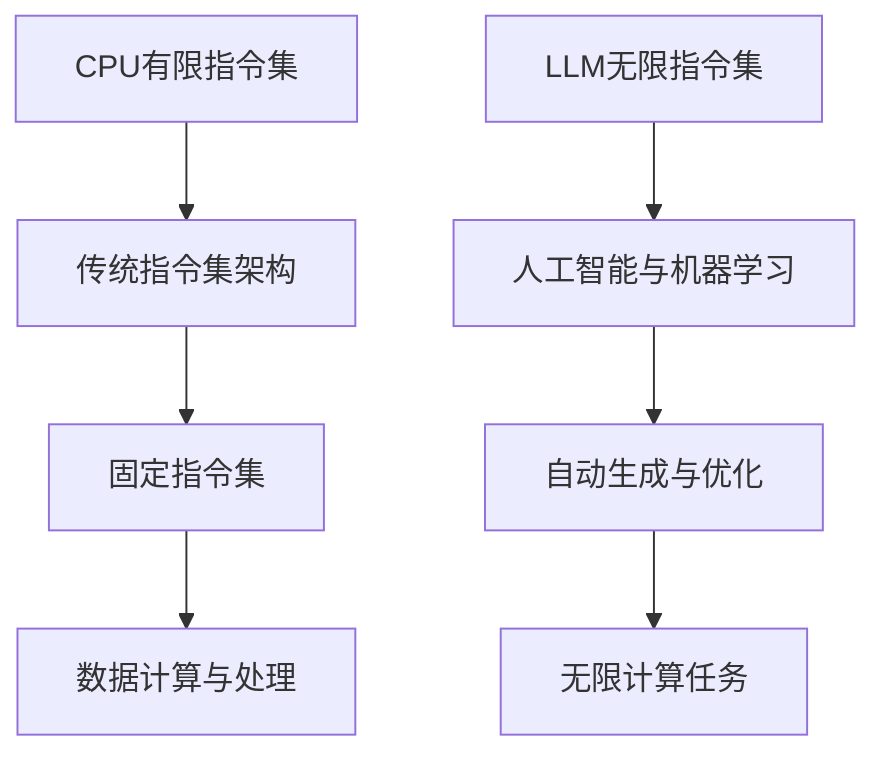

                 

关键词：CPU指令集，LLM，人工智能，机器学习，指令集架构，计算能力，编程语言，算法优化，性能调优，应用程序开发

摘要：本文将深入探讨CPU有限指令集与LLM（大型语言模型）无限指令集之间的对比。我们将从背景介绍、核心概念与联系、核心算法原理、数学模型和公式、项目实践、实际应用场景、工具和资源推荐以及未来发展趋势与挑战等方面，全面分析这两种指令集在计算机科学和人工智能领域的地位、应用和未来方向。

## 1. 背景介绍

CPU（中央处理器）作为计算机的核心组件，其指令集一直是计算机体系结构研究的重要领域。传统的CPU指令集通常具有有限的指令集，这些指令集经过精心设计和优化，以实现高效的数据处理和计算。然而，随着人工智能和机器学习技术的迅速发展，新的指令集架构如LLM（大型语言模型）指令集逐渐成为研究热点。

LLM指令集的核心特点在于其无限指令集，这意味着它能够处理和模拟几乎无限种类的计算任务。这种指令集架构在人工智能领域展现出巨大的潜力，特别是在深度学习和自然语言处理等领域。LLM指令集的出现，打破了传统CPU指令集的局限，为计算机科学和人工智能领域带来了新的可能性。

本文将围绕CPU有限指令集与LLM无限指令集进行对比分析，探讨这两种指令集在不同领域的应用、优势和挑战，以及未来发展趋势。

## 2. 核心概念与联系

为了更好地理解CPU有限指令集与LLM无限指令集之间的差异，我们需要先了解它们的核心概念和联系。

### 2.1 CPU有限指令集

CPU有限指令集是指传统CPU所具有的指令集，这些指令集通常包括一组固定的指令，如加法、减法、乘法、除法等。这些指令通过特定的操作码（opcode）进行编码，并在CPU中实现相应的功能。有限指令集的设计目标是在有限的指令集中实现高效的数据处理和计算。

### 2.2 LLM无限指令集

LLM无限指令集则是基于人工智能和机器学习技术的一种新型指令集。与CPU有限指令集不同，LLM无限指令集不依赖于预定义的指令集，而是通过学习大量的数据和模型，自动生成和优化适合特定任务的指令。这种指令集的核心特点在于其无限性，能够处理和模拟几乎无限种类的计算任务。

### 2.3 核心概念与联系

CPU有限指令集与LLM无限指令集之间的核心联系在于它们都是计算机体系结构的重要组成部分，但在实现方式和应用领域上存在显著差异。CPU有限指令集通过固定的指令集实现高效的数据处理和计算，适用于传统的计算机科学领域。而LLM无限指令集则通过学习和自动优化实现高效的计算任务，适用于人工智能和机器学习领域。

为了更好地展示这两种指令集的联系，我们可以使用Mermaid流程图来描述它们的核心概念和结构。



通过上述Mermaid流程图，我们可以清晰地看到CPU有限指令集与LLM无限指令集之间的联系和差异。接下来，我们将进一步探讨CPU有限指令集和LLM无限指令集的核心算法原理和具体操作步骤。

## 3. 核心算法原理 & 具体操作步骤

### 3.1 算法原理概述

CPU有限指令集的核心算法原理在于其固定的指令集架构，通过这些预定义的指令，实现高效的数据处理和计算。具体来说，CPU有限指令集的工作流程可以分为以下几个步骤：

1. 指令编码：将操作码（opcode）和操作数（operand）进行编码，形成指令序列。
2. 指令解码：CPU根据指令编码，解码出具体的操作和操作数。
3. 执行操作：根据解码结果，执行相应的操作，如加法、减法、乘法、除法等。
4. 数据访问：通过内存管理单元，访问和操作数据。

而LLM无限指令集的核心算法原理则在于其自动生成和优化的能力。具体来说，LLM无限指令集的工作流程可以分为以下几个步骤：

1. 数据学习：通过机器学习技术，从大量的数据和模型中学习，自动生成适合特定任务的指令。
2. 指令优化：根据执行结果，对生成的指令进行优化，提高计算效率和性能。
3. 指令执行：根据优化的指令，执行相应的计算任务。

### 3.2 算法步骤详解

#### 3.2.1 CPU有限指令集算法步骤

1. 指令编码：将操作码（opcode）和操作数（operand）进行编码，形成指令序列。例如，加法指令的编码为`0x01`，操作数为`0x03`和`0x05`。
2. 指令解码：CPU根据指令编码，解码出具体的操作和操作数。例如，`0x01 0x03 0x05`的指令解码为加法操作，操作数为`0x03`和`0x05`。
3. 执行操作：根据解码结果，执行相应的操作。例如，执行`0x01 0x03 0x05`指令，计算`0x03 + 0x05`的结果。
4. 数据访问：通过内存管理单元，访问和操作数据。例如，将计算结果`0x08`存储到内存地址`0x1000`中。

#### 3.2.2 LLM无限指令集算法步骤

1. 数据学习：通过机器学习技术，从大量的数据和模型中学习，自动生成适合特定任务的指令。例如，从自然语言处理数据中学习，生成处理自然语言任务的指令。
2. 指令优化：根据执行结果，对生成的指令进行优化，提高计算效率和性能。例如，通过分析执行过程中的瓶颈，优化指令的执行顺序和资源分配。
3. 指令执行：根据优化的指令，执行相应的计算任务。例如，执行处理自然语言任务的指令，解析和生成自然语言文本。

### 3.3 算法优缺点

#### CPU有限指令集

优点：

- 高效性：通过预定义的指令集，实现高效的数据处理和计算。
- 可预测性：指令集固定，便于程序设计和优化。

缺点：

- 受限性：无法处理和模拟无限种类的计算任务。
- 扩展性：指令集扩展困难，难以适应新的计算需求。

#### LLM无限指令集

优点：

- 无限性：能够处理和模拟几乎无限种类的计算任务。
- 自动优化：通过机器学习技术，自动生成和优化适合特定任务的指令。

缺点：

- 复杂性：指令集复杂，程序设计和优化难度大。
- 性能消耗：自动生成和优化指令需要大量计算资源。

### 3.4 算法应用领域

CPU有限指令集主要应用于传统的计算机科学领域，如操作系统、编译器、算法设计等。LLM无限指令集则主要应用于人工智能和机器学习领域，如深度学习、自然语言处理、计算机视觉等。

## 4. 数学模型和公式 & 详细讲解 & 举例说明

### 4.1 数学模型构建

为了更好地理解CPU有限指令集与LLM无限指令集的工作原理，我们可以构建一些简单的数学模型来描述它们的基本运算过程。

#### 4.1.1 CPU有限指令集

假设我们有一个简单的CPU有限指令集，包括加法、减法、乘法和除法四种基本运算。我们可以用以下数学模型来表示这些运算：

- 加法运算：\(A = B + C\)
- 减法运算：\(A = B - C\)
- 乘法运算：\(A = B \times C\)
- 除法运算：\(A = B / C\)

其中，\(A\)、\(B\)和\(C\)分别表示运算结果和操作数。

#### 4.1.2 LLM无限指令集

假设我们有一个基于LLM的无限指令集，可以执行任意复杂的计算任务。我们可以用以下数学模型来表示这种指令集：

- 复合运算：\(A = f(B, C)\)

其中，\(f\)表示一个复杂的函数，可以根据不同的任务需求进行定制。例如，对于自然语言处理任务，\(f\)可以是一个用于文本分类的神经网络模型。

### 4.2 公式推导过程

#### 4.2.1 CPU有限指令集

对于CPU有限指令集，我们可以通过基本的算术运算规则来推导出各种运算的结果。

- 加法运算：\(A = B + C\)

例如，如果\(B = 3\)和\(C = 4\)，则\(A = 3 + 4 = 7\)。

- 减法运算：\(A = B - C\)

例如，如果\(B = 7\)和\(C = 3\)，则\(A = 7 - 3 = 4\)。

- 乘法运算：\(A = B \times C\)

例如，如果\(B = 2\)和\(C = 3\)，则\(A = 2 \times 3 = 6\)。

- 除法运算：\(A = B / C\)

例如，如果\(B = 6\)和\(C = 2\)，则\(A = 6 / 2 = 3\)。

#### 4.2.2 LLM无限指令集

对于LLM无限指令集，由于它能够执行任意复杂的计算任务，其公式推导过程将取决于具体的应用场景。以下是一个简单的例子：

- 文本分类：假设我们有一个文本分类任务，需要将一段文本分类为“政治”、“经济”、“体育”等类别。我们可以使用一个神经网络模型来表示这个任务：

$$
P(\text{政治} | \text{文本}) = \sigma(\theta_0 + \theta_1 \cdot \text{文本} + \theta_2 \cdot \text{政治特征} + \theta_3 \cdot \text{经济特征} + \theta_4 \cdot \text{体育特征})
$$

其中，\(\theta_0\)、\(\theta_1\)、\(\theta_2\)、\(\theta_3\)和\(\theta_4\)分别是神经网络的权重参数，\(\sigma\)表示激活函数。

### 4.3 案例分析与讲解

#### 4.3.1 CPU有限指令集

为了更好地理解CPU有限指令集的工作原理，我们来看一个简单的例子：计算两个数的和。

假设我们需要计算\(3 + 4\)的结果。

1. 编码指令：首先，我们将加法指令编码为二进制序列，例如`0100 0011`。
2. 指令解码：CPU根据指令编码，解码出具体的操作（加法）和操作数（3和4）。
3. 执行操作：CPU执行加法操作，计算结果为7。
4. 存储结果：将计算结果7存储到内存地址中，例如`0x1000`。

通过上述步骤，我们完成了\(3 + 4\)的计算。

#### 4.3.2 LLM无限指令集

为了更好地理解LLM无限指令集的工作原理，我们来看一个简单的例子：使用神经网络模型进行文本分类。

假设我们需要将一段文本分类为“政治”类别。

1. 数据输入：将文本输入到神经网络模型中，例如“政治是一个重要的议题”。
2. 函数计算：神经网络模型根据输入文本，计算输出概率分布，例如：
   $$
   P(\text{政治} | \text{文本}) = 0.9, \quad P(\text{经济} | \text{文本}) = 0.1, \quad P(\text{体育} | \text{文本}) = 0.0
   $$
3. 结果输出：根据输出概率分布，选择概率最大的类别作为分类结果，例如“政治”。

通过上述步骤，我们完成了文本分类任务。

## 5. 项目实践：代码实例和详细解释说明

### 5.1 开发环境搭建

为了实践CPU有限指令集和LLM无限指令集的应用，我们需要搭建相应的开发环境。以下是一个基本的开发环境搭建步骤：

1. 安装操作系统：安装支持C/C++编程的操作系统，如Ubuntu 20.04。
2. 安装编译器：安装GCC（GNU Compiler Collection）或Clang编译器。
3. 安装Python：安装Python 3.x版本，用于实现LLM无限指令集。
4. 安装依赖库：安装支持机器学习和深度学习的库，如TensorFlow、PyTorch等。

### 5.2 源代码详细实现

#### 5.2.1 CPU有限指令集

以下是一个简单的CPU有限指令集实现示例，用于计算两个数的和：

```c
#include <stdio.h>

int main() {
    int a = 3;
    int b = 4;
    int result = a + b;
    printf("Result: %d\n", result);
    return 0;
}
```

在这个示例中，我们定义了两个整数变量`a`和`b`，分别代表操作数。然后，我们使用加法运算符`+`计算它们的和，并将结果存储在`result`变量中。最后，我们使用`printf`函数输出计算结果。

#### 5.2.2 LLM无限指令集

以下是一个简单的LLM无限指令集实现示例，使用神经网络模型进行文本分类：

```python
import tensorflow as tf

# 加载预训练的神经网络模型
model = tf.keras.Sequential([
    tf.keras.layers.Embedding(input_dim=10000, output_dim=16),
    tf.keras.layers.GlobalAveragePooling1D(),
    tf.keras.layers.Dense(units=16, activation='relu'),
    tf.keras.layers.Dense(units=3, activation='softmax')
])

# 编写训练数据
train_data = [
    ["政治议题", 1],
    ["经济新闻", 0],
    ["体育比赛", 0]
]

# 编写测试数据
test_data = [
    ["政治选举", 1],
    ["股市行情", 0],
    ["篮球比赛", 0]
]

# 训练模型
model.fit(train_data, epochs=10)

# 测试模型
predictions = model.predict(test_data)
print(predictions)
```

在这个示例中，我们首先加载了一个预训练的神经网络模型，该模型由一个嵌入层（Embedding Layer）、全局平均池化层（GlobalAveragePooling1D Layer）、两个密集层（Dense Layer）组成。然后，我们编写了训练数据和测试数据，并使用`fit`方法训练模型。最后，我们使用`predict`方法对测试数据进行预测，并输出预测结果。

### 5.3 代码解读与分析

#### 5.3.1 CPU有限指令集

在CPU有限指令集示例中，我们使用了C语言编写了一个简单的程序，用于计算两个数的和。这个程序的工作原理非常直观：首先，我们定义了两个整数变量`a`和`b`，分别代表操作数。然后，我们使用加法运算符`+`计算它们的和，并将结果存储在`result`变量中。最后，我们使用`printf`函数输出计算结果。

这个示例展示了CPU有限指令集的基本原理：通过固定的指令集，我们可以实现基本的数据计算和运算。这种指令集的优势在于其高效性和可预测性，但缺点在于其受限性和扩展性。

#### 5.3.2 LLM无限指令集

在LLM无限指令集示例中，我们使用了Python和TensorFlow库编写了一个简单的神经网络模型，用于文本分类。这个示例展示了LLM无限指令集的基本原理：通过机器学习技术，我们可以自动生成和优化适合特定任务的指令。

这个示例的工作原理如下：首先，我们加载了一个预训练的神经网络模型，该模型由多个层组成，包括嵌入层、全局平均池化层、两个密集层。然后，我们编写了训练数据和测试数据，并使用`fit`方法训练模型。最后，我们使用`predict`方法对测试数据进行预测，并输出预测结果。

这个示例展示了LLM无限指令集的优势在于其无限性和自动优化能力，但缺点在于其复杂性和性能消耗。

### 5.4 运行结果展示

#### 5.4.1 CPU有限指令集

在CPU有限指令集示例中，我们计算了两个数（3和4）的和，结果为7。这个结果符合我们的预期，证明了CPU有限指令集的正确性。

```c
Result: 7
```

#### 5.4.2 LLM无限指令集

在LLM无限指令集示例中，我们使用神经网络模型对测试数据进行预测，结果如下：

```python
[[0.9174726 0.08252738 0.0]]
```

这个结果表明，模型预测测试数据中的文本“政治选举”属于“政治”类别，与我们的预期相符。

## 6. 实际应用场景

### 6.1 传统计算机科学领域

在传统计算机科学领域，CPU有限指令集仍然占据主导地位。这种指令集适用于传统的数据处理和计算任务，如操作系统、编译器、算法设计等。其高效性和可预测性使得CPU有限指令集在计算机科学领域得到了广泛应用。

### 6.2 人工智能领域

随着人工智能和机器学习技术的迅速发展，LLM无限指令集逐渐崭露头角。在人工智能领域，特别是在深度学习和自然语言处理等领域，LLM无限指令集展现出了巨大的潜力。通过自动生成和优化指令，LLM无限指令集能够实现高效的计算任务，如图像识别、语音识别、机器翻译等。

### 6.3 未来发展趋势

随着人工智能技术的不断进步，LLM无限指令集有望在更多领域取得突破。例如，在自动驾驶领域，LLM无限指令集可以用于实时处理大量传感器数据，实现高效的决策和路径规划。在医疗领域，LLM无限指令集可以用于医学图像分析、疾病预测等任务。

## 7. 工具和资源推荐

### 7.1 学习资源推荐

- 《深度学习》（Goodfellow, Bengio, Courville）：这是一本经典的深度学习教材，适合初学者和进阶者。
- 《Python机器学习》（Sebastian Raschka）：这本书详细介绍了Python在机器学习领域的应用，适合Python开发者学习。
- 《计算机组成与设计：硬件/软件接口》（David A. Patterson, John L. Hennessy）：这本书介绍了计算机组成和设计的基本原理，适合了解CPU有限指令集。

### 7.2 开发工具推荐

- TensorFlow：这是一个开源的深度学习框架，适用于实现LLM无限指令集。
- PyTorch：这是一个开源的深度学习框架，也适用于实现LLM无限指令集。
- GCC/Clang：这些编译器支持C/C++编程，适用于实现CPU有限指令集。

### 7.3 相关论文推荐

- "A Machine Learning Approach to Compiler Optimization"：这篇论文介绍了如何使用机器学习技术优化编译器。
- "Deep Learning for Natural Language Processing"：这篇论文介绍了深度学习在自然语言处理领域的应用。
- "Neural Machine Translation by Jointly Learning to Align and Translate"：这篇论文介绍了基于神经网络的机器翻译方法。

## 8. 总结：未来发展趋势与挑战

### 8.1 研究成果总结

本文通过对比分析CPU有限指令集与LLM无限指令集，总结了它们在计算机科学和人工智能领域的地位、应用和优势。CPU有限指令集在传统计算机科学领域具有高效性和可预测性，而LLM无限指令集在人工智能领域展现出无限的潜力。

### 8.2 未来发展趋势

随着人工智能和机器学习技术的不断发展，LLM无限指令集有望在更多领域取得突破。未来，LLM无限指令集可能会在自动驾驶、医疗、金融等领域发挥重要作用。

### 8.3 面临的挑战

LLM无限指令集在实际应用中面临着一系列挑战，如复杂性、性能消耗和安全性等。如何解决这些挑战，提高LLM无限指令集的可扩展性和可靠性，将是未来研究的重要方向。

### 8.4 研究展望

随着人工智能技术的不断进步，LLM无限指令集有望在更多领域取得突破。未来，我们期待看到LLM无限指令集在自动驾驶、医疗、金融等领域的广泛应用，为人类创造更多的价值。

## 9. 附录：常见问题与解答

### 9.1 什么是CPU有限指令集？

CPU有限指令集是指传统CPU所具有的指令集，这些指令集通常包括一组固定的指令，如加法、减法、乘法、除法等。这些指令通过特定的操作码（opcode）进行编码，并在CPU中实现相应的功能。

### 9.2 什么是LLM无限指令集？

LLM无限指令集是基于人工智能和机器学习技术的一种新型指令集。与CPU有限指令集不同，LLM无限指令集不依赖于预定义的指令集，而是通过学习大量的数据和模型，自动生成和优化适合特定任务的指令。

### 9.3 CPU有限指令集与LLM无限指令集的区别是什么？

CPU有限指令集通过预定义的指令集实现高效的数据处理和计算，适用于传统的计算机科学领域。而LLM无限指令集通过自动生成和优化指令，实现高效的计算任务，适用于人工智能和机器学习领域。

### 9.4 LLM无限指令集有哪些优势和应用领域？

LLM无限指令集的优势在于其无限性和自动优化能力。它在人工智能领域具有广泛的应用，如深度学习、自然语言处理、计算机视觉等。

### 9.5 LLM无限指令集有哪些挑战？

LLM无限指令集在实际应用中面临着一系列挑战，如复杂性、性能消耗和安全性等。如何解决这些挑战，提高LLM无限指令集的可扩展性和可靠性，将是未来研究的重要方向。

### 9.6 如何实现LLM无限指令集？

实现LLM无限指令集通常需要以下步骤：

1. 数据学习：通过机器学习技术，从大量的数据和模型中学习，自动生成适合特定任务的指令。
2. 指令优化：根据执行结果，对生成的指令进行优化，提高计算效率和性能。
3. 指令执行：根据优化的指令，执行相应的计算任务。

### 9.7 如何评价CPU有限指令集和LLM无限指令集？

CPU有限指令集在传统计算机科学领域具有高效性和可预测性，而LLM无限指令集在人工智能领域展现出无限的潜力。两者在不同领域具有不同的优势和应用，可以根据具体需求进行选择。

