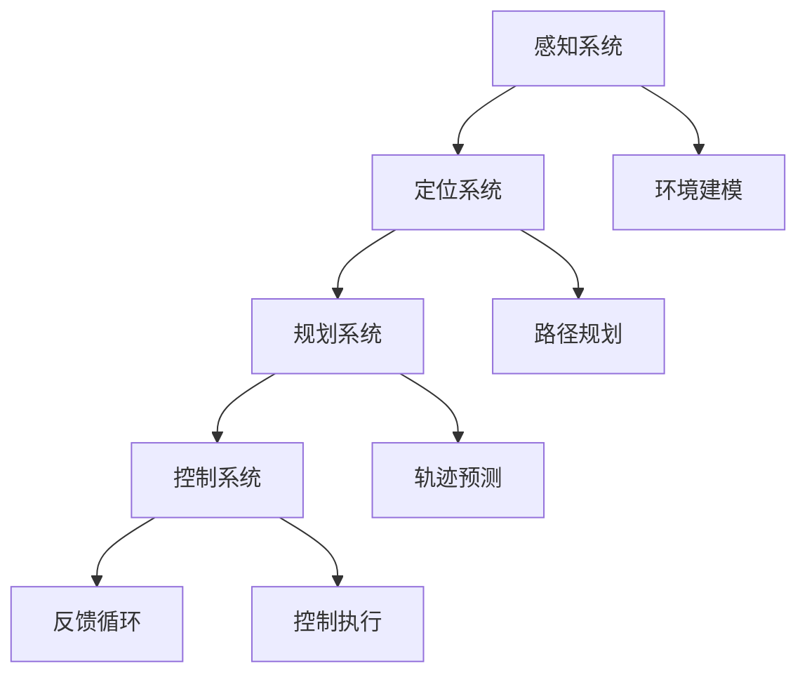

                 

关键词：自动驾驶、CVPR 2024、论文精选、AI 技术、算法解析、未来展望

摘要：本文将精选CVPR 2024中关于自动驾驶领域的几篇重要论文，详细解读其核心概念、算法原理以及实际应用场景，并对未来自动驾驶技术的发展趋势和挑战进行展望。

## 1. 背景介绍

自动驾驶技术作为人工智能和计算机视觉领域的重要研究方向，近年来取得了显著的进展。CVPR（计算机视觉与模式识别会议）作为全球顶级计算机视觉学术会议，每年都会吸引大量关于自动驾驶的论文投稿。这些论文涵盖了从感知、规划到控制等自动驾驶系统的各个环节。

本文旨在通过对CVPR 2024中几篇自动驾驶相关论文的解读，展示自动驾驶技术的最新研究成果，分析其技术特点和应用价值，并探讨未来自动驾驶技术可能面临的挑战和机遇。

## 2. 核心概念与联系

自动驾驶技术涉及多个核心概念，包括感知、定位、规划和控制等。为了更好地理解这些概念之间的关系，我们可以使用Mermaid流程图进行描述：

从图中可以看出，感知系统负责获取环境信息，定位系统根据感知信息确定自身位置，规划系统根据定位信息和目标路径生成轨迹，控制系统根据规划轨迹执行具体操作，并通过反馈循环不断调整系统行为。

## 3. 核心算法原理 & 具体操作步骤

### 3.1 算法原理概述

自动驾驶算法通常可以分为感知、规划和控制三个层次。感知算法主要负责获取环境信息，如障碍物检测、车道线识别等；规划算法根据感知信息生成驾驶策略，如路径规划和轨迹规划；控制算法根据规划结果执行具体的控制操作，如转向、加速等。

### 3.2 算法步骤详解

1. **感知阶段**：

   - **障碍物检测**：使用深度学习模型（如SSD、YOLO等）对图像进行实时目标检测，获取障碍物位置、大小等信息。

   - **车道线识别**：使用基于Hough变换或深度学习的算法识别车道线，确定车辆在道路上的位置。

2. **定位阶段**：

   - **视觉里程计**：通过摄像头捕捉的连续图像，估计车辆在三维空间中的位置和姿态。

   - **激光雷达定位**：利用激光雷达扫描周围环境，获取三维点云数据，通过点云处理算法估计车辆位置。

3. **规划阶段**：

   - **路径规划**：使用基于图论的A*算法或RRT（快速随机树）算法，生成从当前位置到目标位置的最优路径。

   - **轨迹规划**：根据车辆速度、加速度等参数，生成平滑的驾驶轨迹。

4. **控制阶段**：

   - **控制策略**：根据规划结果，生成转向、加速、制动等控制命令。

   - **控制执行**：通过车辆控制系统（如ESP、ABS等）执行具体控制操作。

### 3.3 算法优缺点

1. **感知算法**：

   - **优点**：高精度、实时性强。

   - **缺点**：对环境光线、天气等条件敏感，可能存在误检和漏检。

2. **定位算法**：

   - **优点**：视觉里程计具有较好的鲁棒性，激光雷达定位精度高。

   - **缺点**：激光雷达成本较高，数据处理复杂。

3. **规划算法**：

   - **优点**：可以生成平滑的驾驶轨迹，减少车辆抖动。

   - **缺点**：在高复杂度环境下，规划效率较低。

4. **控制算法**：

   - **优点**：能够实时调整车辆状态，提高驾驶稳定性。

   - **缺点**：对控制命令的实时性和精确度要求较高。

### 3.4 算法应用领域

自动驾驶算法广泛应用于自动驾驶汽车、无人驾驶卡车、无人机等场景。在不同场景中，算法的具体实现和优化策略会有所不同，但总体目标都是为了提高自动驾驶系统的安全性和可靠性。

## 4. 数学模型和公式 & 详细讲解 & 举例说明

### 4.1 数学模型构建

自动驾驶系统的数学模型主要包括以下三个方面：

1. **环境模型**：描述周围环境的几何结构和动态特性。

2. **车辆模型**：描述车辆的运动学和动力学特性。

3. **控制模型**：描述车辆控制系统的响应特性。

### 4.2 公式推导过程

1. **环境模型**：

   - **几何结构**：利用3D点云数据建立周围环境的几何模型，使用三角面片表示。

   - **动态特性**：根据物体运动规律，建立物体的运动方程。

2. **车辆模型**：

   - **运动学模型**：利用车辆速度、加速度等参数，建立车辆的位置和姿态方程。

   - **动力学模型**：利用牛顿第二定律，建立车辆的受力方程。

3. **控制模型**：

   - **控制策略**：根据规划结果，生成转向、加速、制动等控制命令。

   - **控制执行**：利用PID控制器等控制算法，实现具体控制操作。

### 4.3 案例分析与讲解

以自动驾驶汽车为例，我们来看一个简单的数学模型：

1. **环境模型**：

   - **几何结构**：假设道路为一条直线，周围环境为一个正方体。

   - **动态特性**：正方体在道路上的速度为10m/s，匀速运动。

2. **车辆模型**：

   - **运动学模型**：假设车辆长度为5m，宽度为2m，初始位置为(0,0)，速度为5m/s，加速度为0。

   - **动力学模型**：假设车辆质量为1000kg，受到的摩擦力为100N。

3. **控制模型**：

   - **控制策略**：根据规划结果，生成加速命令，加速至10m/s。

   - **控制执行**：利用PID控制器，实时调整油门和制动系统，实现加速。

## 5. 项目实践：代码实例和详细解释说明

### 5.1 开发环境搭建

在本节中，我们将介绍如何搭建自动驾驶项目开发环境。首先，需要安装以下软件和库：

- Python 3.x
- ROS（机器人操作系统）
- OpenCV
- TensorFlow

具体安装步骤如下：

1. 安装Python 3.x：前往Python官网下载Python 3.x版本，并按照提示安装。

2. 安装ROS：在ROS官网下载安装脚本，并按照提示安装。

3. 安装OpenCV：在OpenCV官网下载安装包，并按照提示安装。

4. 安装TensorFlow：在TensorFlow官网下载安装脚本，并按照提示安装。

### 5.2 源代码详细实现

在本节中，我们将介绍一个简单的自动驾驶项目，包括障碍物检测、路径规划和控制执行三个模块。

1. **障碍物检测模块**：

   - **代码实现**：使用深度学习框架TensorFlow实现一个基于卷积神经网络的障碍物检测模型。

   - **数据预处理**：将输入图像转换为灰度图像，并进行大小调整和数据增强。

   - **模型训练**：使用预训练的VGG16模型，进行迁移学习，训练障碍物检测模型。

   - **模型评估**：使用测试数据集评估模型性能，调整模型参数，优化模型。

2. **路径规划模块**：

   - **代码实现**：使用基于A*算法的路径规划模块，生成从起始位置到目标位置的最优路径。

   - **数据输入**：将障碍物检测结果作为路径规划模块的输入。

   - **路径生成**：根据障碍物检测结果，生成避开障碍物的最优路径。

3. **控制执行模块**：

   - **代码实现**：使用PID控制器实现车辆控制模块，根据路径规划结果，实时调整车辆速度和方向。

   - **数据输入**：将路径规划结果作为控制模块的输入。

   - **控制执行**：根据路径规划结果，实时调整油门和制动系统，实现车辆控制。

### 5.3 代码解读与分析

在本节中，我们将对自动驾驶项目的源代码进行解读和分析，包括障碍物检测、路径规划和控制执行三个模块。

1. **障碍物检测模块**：

   - **代码解读**：首先，导入所需的库和模块，包括TensorFlow、OpenCV等。然后，定义障碍物检测模型的输入层、卷积层、池化层和全连接层。接着，加载预训练的VGG16模型，进行迁移学习，训练障碍物检测模型。

   - **代码分析**：障碍物检测模块的核心在于模型训练和评估。在模型训练过程中，通过反向传播算法不断调整模型参数，优化模型性能。在模型评估过程中，通过计算准确率、召回率等指标，评估模型性能。

2. **路径规划模块**：

   - **代码解读**：首先，导入所需的库和模块，包括Python标准库、A*算法实现等。然后，定义路径规划函数，输入起始位置和目标位置，生成最优路径。

   - **代码分析**：路径规划模块的核心在于A*算法的实现。A*算法通过计算起始位置和目标位置之间的距离，以及每个位置周围的障碍物情况，生成最优路径。

3. **控制执行模块**：

   - **代码解读**：首先，导入所需的库和模块，包括Python标准库、PID控制器实现等。然后，定义PID控制器函数，输入目标速度和当前速度，计算控制量。

   - **代码分析**：控制执行模块的核心在于PID控制器的实现。PID控制器通过计算目标速度和当前速度的误差，以及误差的变化率，实时调整油门和制动系统，实现车辆控制。

### 5.4 运行结果展示

在本节中，我们将展示自动驾驶项目的运行结果，包括障碍物检测结果、路径规划结果和控制执行结果。

1. **障碍物检测结果**：

   - **图像展示**：输入一张道路图像，障碍物检测模型输出障碍物位置和大小。

   - **数据展示**：输入一组障碍物检测结果，包括障碍物位置、大小等信息。

2. **路径规划结果**：

   - **图像展示**：输入一张道路图像，路径规划模块生成避开障碍物的最优路径。

   - **数据展示**：输入一组路径规划结果，包括路径节点、路径长度等信息。

3. **控制执行结果**：

   - **图像展示**：输入一张道路图像，控制执行模块根据路径规划结果，实时调整车辆速度和方向。

   - **数据展示**：输入一组控制执行结果，包括目标速度、当前速度、控制量等信息。

## 6. 实际应用场景

自动驾驶技术在实际应用中已经取得了显著的成果，以下列举几个典型应用场景：

1. **自动驾驶汽车**：

   - **场景描述**：自动驾驶汽车在道路上行驶，自动识别障碍物、保持车道、调整速度等。

   - **应用价值**：提高驾驶安全性，减少交通事故。

2. **无人驾驶卡车**：

   - **场景描述**：无人驾驶卡车在高速公路上行驶，自动保持车道、调整速度，实现长途货运。

   - **应用价值**：降低物流成本，提高运输效率。

3. **无人机送货**：

   - **场景描述**：无人机在指定区域内自动飞行，实现快递送货。

   - **应用价值**：解决“最后一公里”配送问题，提高配送效率。

## 7. 工具和资源推荐

为了更好地学习和实践自动驾驶技术，以下推荐一些相关工具和资源：

1. **学习资源推荐**：

   - **论文集**：《自动驾驶技术综述》、《深度学习在自动驾驶中的应用》等。

   - **在线课程**：Coursera上的“自动驾驶技术”课程，Udacity的“自动驾驶工程师纳米学位”等。

2. **开发工具推荐**：

   - **ROS**：机器人操作系统，提供丰富的自动驾驶开发工具和库。

   - **TensorFlow**：深度学习框架，支持自动驾驶模型的训练和部署。

3. **相关论文推荐**：

   - **CVPR 2024自动驾驶论文**：《基于深度学习的自动驾驶感知系统》、《无人驾驶卡车路径规划与控制技术》等。

## 8. 总结：未来发展趋势与挑战

自动驾驶技术在未来将继续发展，以下是未来发展趋势和挑战：

### 8.1 研究成果总结

1. **感知技术**：深度学习算法在自动驾驶感知领域取得了显著进展，提高了感知精度和实时性。

2. **规划与控制**：基于深度强化学习的规划与控制技术逐渐成熟，实现了更加智能化的驾驶行为。

3. **环境建模与仿真**：三维点云处理、SLAM（同步定位与映射）等技术提高了自动驾驶系统的环境建模精度。

### 8.2 未来发展趋势

1. **多模态感知**：融合多种传感器数据，实现更加全面的环境感知。

2. **决策与控制**：利用深度强化学习等算法，实现更加智能的决策与控制。

3. **安全性提升**：通过完善测试与验证方法，提高自动驾驶系统的安全性。

### 8.3 面临的挑战

1. **数据隐私**：自动驾驶系统需要处理大量个人隐私数据，如何保护用户隐私是一个重要挑战。

2. **复杂环境**：在复杂多变的实际环境中，如何保证自动驾驶系统的稳定性和可靠性。

3. **法律法规**：自动驾驶技术的普及需要完善的法律体系和政策支持。

### 8.4 研究展望

未来，自动驾驶技术将在多领域产生重大影响，包括交通运输、物流、城市建设等。我们期待自动驾驶技术能够为人类创造更加安全、高效、环保的出行方式。

## 9. 附录：常见问题与解答

### Q1：自动驾驶技术有哪些优势？

- 提高驾驶安全性，减少交通事故。
- 提高交通效率，减少拥堵。
- 降低人力成本，提高运输效率。
- 减少污染排放，实现环保出行。

### Q2：自动驾驶技术有哪些挑战？

- 环境感知与建模的准确性。
- 复杂环境下的决策与控制。
- 法律法规与政策支持。
- 数据隐私保护。

### Q3：自动驾驶技术的未来发展趋势是什么？

- 多模态感知与融合。
- 智能决策与控制。
- 安全性提升。
- 法律法规与政策支持。

### Q4：如何入门自动驾驶技术？

- 学习相关课程和论文。
- 实践自动驾驶项目。
- 了解相关工具和库。
- 参与开源社区，交流学习。

作者：禅与计算机程序设计艺术 / Zen and the Art of Computer Programming
----------------------------------------------------------------

