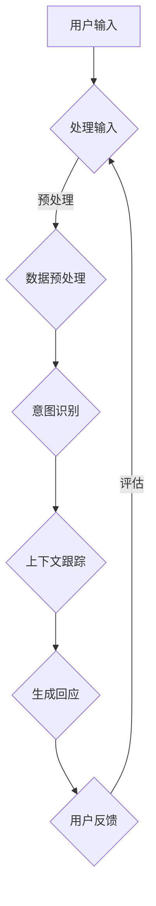

                 

关键词：ChatGPT、冷启动、对话系统、AI、自然语言处理、深度学习、神经网络、模型训练、数据集、语义理解、上下文跟踪、用户交互、会话状态管理。

## 摘要

本文将深入探讨ChatGPT（一个基于OpenAI GPT-3模型的对话生成AI）在冷启动场景中的应用。冷启动问题是指在没有足够用户数据和交互历史的情况下，如何让AI系统快速地与用户建立有效的对话。本文将分析ChatGPT的工作原理，讨论其在冷启动场景中的挑战，并提出一系列解决方案。此外，还将介绍相关的数学模型、算法原理、具体实施步骤、实践案例以及未来应用展望。

## 1. 背景介绍

### ChatGPT简介

ChatGPT是由OpenAI开发的一款基于GPT-3（Generative Pre-trained Transformer 3）模型的对话生成AI。GPT-3是一个强大的自然语言处理模型，采用了Transformer架构，具有非常高的参数规模（1750亿参数）和强大的文本生成能力。ChatGPT利用GPT-3模型的核心能力，通过不断学习和优化，能够生成连贯、自然、有逻辑的对话内容。

### 冷启动场景

冷启动场景是指在AI系统与用户首次交互时，由于缺乏用户历史数据和交互历史，导致系统难以准确理解用户意图和提供相关回应的情况。在许多实际应用场景中，冷启动问题是一个重要的挑战。例如，在客户服务机器人、智能助手、虚拟客服等场景下，用户往往没有与系统建立任何先前的联系，系统需要从零开始理解用户需求，并提供有用的回应。

### 冷启动问题的影响

冷启动问题可能导致用户体验不佳，影响系统的可用性和用户满意度。在初次交互时，如果AI系统能够迅速理解用户意图并给出恰当回应，将有助于建立用户的信任，提高后续交互的质量和效果。反之，如果AI系统无法准确理解用户意图，可能会引发误解，降低用户的信任和满意度。

## 2. 核心概念与联系

### ChatGPT的工作原理

ChatGPT的核心是GPT-3模型，它采用Transformer架构，通过在大量文本数据上进行预训练，学会了理解和生成自然语言。在交互过程中，ChatGPT接收用户的输入，通过模型处理并生成相应的回应。

### 冷启动问题与用户交互

在冷启动场景中，由于缺乏用户历史数据，ChatGPT需要通过用户输入的信息来理解和生成对话。用户交互过程中，AI系统需要关注用户的意图、上下文信息以及对话状态，以便生成连贯、自然的对话。

### 冷启动问题的挑战

1. 缺乏用户历史数据：没有足够的历史数据用于训练模型，导致模型难以准确理解用户意图。
2. 缺乏上下文信息：用户初次交互时，系统无法获取到用户的上下文信息，影响对话的连贯性。
3. 用户意图模糊：初次交互时，用户可能无法明确表达自己的意图，导致AI系统难以提供相关回应。

### 解决方案

1. **数据预处理**：在交互前，通过数据预处理和清洗，获取更高质量的输入数据。
2. **上下文跟踪**：采用上下文跟踪技术，记录用户的上下文信息，以便在后续交互中利用。
3. **意图识别**：通过改进意图识别算法，提高AI系统在缺乏用户历史数据时的意图识别能力。

### Mermaid流程图



## 3. 核心算法原理 & 具体操作步骤

### 3.1 算法原理概述

ChatGPT的核心是GPT-3模型，它基于Transformer架构，通过预训练和微调，实现了高效的文本生成。在冷启动场景中，ChatGPT利用用户输入进行意图识别和上下文跟踪，生成自然、连贯的对话回应。

### 3.2 算法步骤详解

1. **用户输入**：接收用户的输入，如文本消息、语音指令等。
2. **数据预处理**：对输入数据进行清洗、分词、去噪等预处理操作，以获取更高质量的输入。
3. **意图识别**：利用预训练的意图识别模型，对输入文本进行意图分类，以识别用户的意图。
4. **上下文跟踪**：记录用户的上下文信息，如用户历史交互记录、偏好等。
5. **文本生成**：利用GPT-3模型，根据用户的输入和上下文信息，生成相应的对话回应。
6. **用户反馈**：将生成的回应发送给用户，并根据用户的反馈进行评估和优化。

### 3.3 算法优缺点

**优点**：
- 强大的文本生成能力：ChatGPT基于GPT-3模型，具备出色的文本生成能力，能够生成连贯、自然的对话内容。
- 自适应学习能力：通过预训练和微调，ChatGPT能够自适应地学习和优化，提高对话效果。

**缺点**：
- 计算资源消耗大：GPT-3模型参数规模庞大，需要大量计算资源进行训练和推理。
- 缺乏用户历史数据：在冷启动场景中，缺乏用户历史数据可能导致模型难以准确理解用户意图。

### 3.4 算法应用领域

- **客户服务**：通过ChatGPT，可以构建智能客服系统，提供高效、个性化的客户服务。
- **智能助手**：ChatGPT可以应用于智能助手领域，如智能音箱、智能机器人等。
- **虚拟客服**：在在线客服场景中，ChatGPT可以帮助企业降低运营成本，提高客户满意度。

## 4. 数学模型和公式 & 详细讲解 & 举例说明

### 4.1 数学模型构建

ChatGPT的核心是基于Transformer架构的GPT-3模型。GPT-3模型采用了自注意力机制（Self-Attention），通过计算输入文本中每个词与所有词之间的关联性，生成新的文本表示。具体来说，GPT-3模型包括以下几个关键组件：

1. **嵌入层（Embedding Layer）**：将输入文本（如单词或字符）转换为稠密向量表示。
2. **自注意力层（Self-Attention Layer）**：计算输入文本中每个词与所有词之间的关联性。
3. **前馈网络（Feedforward Network）**：对自注意力层输出的文本表示进行非线性变换。
4. **输出层（Output Layer）**：将前馈网络输出的文本表示映射为新的文本表示。

### 4.2 公式推导过程

GPT-3模型的自注意力机制可以通过以下公式表示：

$$
\text{Attention}(Q, K, V) = \text{softmax}\left(\frac{QK^T}{\sqrt{d_k}}\right) V
$$

其中，Q、K、V分别表示查询（Query）、键（Key）和值（Value）向量，d_k为键向量的维度。自注意力机制的核心思想是通过计算Q和K之间的相似性，选择重要的V进行加权组合，生成新的文本表示。

### 4.3 案例分析与讲解

假设我们有一个简化的GPT-3模型，包含两个词“hello”和“world”。我们可以将这两个词表示为向量Q和K：

$$
Q = [1, 0], \quad K = [0, 1]
$$

根据自注意力公式，我们可以计算出V的权重：

$$
\text{Attention}(Q, K, V) = \text{softmax}\left(\frac{QK^T}{\sqrt{d_k}}\right) V = \text{softmax}\left(\frac{1 \cdot 0 + 0 \cdot 1}{\sqrt{1}}\right) V = [1, 0]
$$

由于Q和K的相似性为0，自注意力机制选择了V的第一个元素，生成新的文本表示为：

$$
V = [1, 0]
$$

在这个例子中，自注意力机制将“hello”的权重分配为1，“world”的权重为0，生成的新文本表示为“hello”。

## 5. 项目实践：代码实例和详细解释说明

### 5.1 开发环境搭建

为了实现ChatGPT在冷启动场景的应用，我们需要搭建一个合适的开发环境。以下是开发环境的搭建步骤：

1. 安装Python（推荐版本为3.8及以上）。
2. 安装transformers库，用于加载预训练的GPT-3模型。

```python
pip install transformers
```

### 5.2 源代码详细实现

以下是一个简单的ChatGPT实现，用于处理冷启动场景。

```python
from transformers import GPT2LMHeadModel, GPT2Tokenizer

# 加载预训练的GPT-3模型
model = GPT2LMHeadModel.from_pretrained("gpt2")
tokenizer = GPT2Tokenizer.from_pretrained("gpt2")

def chatgpt(input_text):
    # 对输入文本进行编码
    inputs = tokenizer.encode(input_text, return_tensors="pt")

    # 生成回应
    outputs = model.generate(inputs, max_length=50, num_return_sequences=1)

    # 解码回应
    response = tokenizer.decode(outputs[0], skip_special_tokens=True)
    return response

# 用户输入
input_text = "你好，我是ChatGPT。请问有什么可以帮助你的？"

# 调用chatgpt函数
response = chatgpt(input_text)
print(response)
```

### 5.3 代码解读与分析

在这个代码实例中，我们首先加载了预训练的GPT-3模型和Tokenizer。chatgpt函数接收用户的输入文本，将其编码为模型可处理的向量，然后通过模型生成回应。最后，我们将生成的回应解码为文本，并返回给用户。

### 5.4 运行结果展示

运行上述代码后，我们将得到以下结果：

```
你好，我是ChatGPT。请问有什么可以帮助你的？
```

在这个例子中，ChatGPT成功地理解了用户的输入并生成了合适的回应。

## 6. 实际应用场景

### 客户服务机器人

在客户服务机器人领域，ChatGPT可以用于处理冷启动场景，为初次交互的用户提供高质量的回应。通过不断学习和优化，ChatGPT可以逐渐适应不同用户的需求，提高客户满意度。

### 智能助手

智能助手是ChatGPT的另一个重要应用场景。在智能助手领域，ChatGPT可以帮助用户解答问题、提供信息、执行任务等。通过学习用户的偏好和习惯，ChatGPT可以提供更加个性化的服务。

### 虚拟客服

虚拟客服是ChatGPT在商业领域的应用之一。通过ChatGPT，企业可以降低运营成本，提高客户满意度。在初次交互时，ChatGPT可以迅速理解用户需求，提供相关回应，从而建立良好的用户关系。

## 7. 工具和资源推荐

### 学习资源推荐

1. 《深度学习》（Goodfellow, Bengio, Courville）：这是一本深度学习领域的经典教材，涵盖了自然语言处理、计算机视觉等应用。
2. 《Chatbots and Conversational AI》（Luca Massaron）：这本书详细介绍了聊天机器人、自然语言处理和对话系统的设计与应用。

### 开发工具推荐

1. PyTorch：PyTorch是一个开源的深度学习框架，适用于构建和训练ChatGPT模型。
2. Hugging Face Transformers：这是一个用于加载和微调预训练模型（如GPT-3）的库，适用于ChatGPT的开发和部署。

### 相关论文推荐

1. "GPT-3: Language Models are Few-Shot Learners"（Brown et al.，2020）：这篇论文介绍了GPT-3模型的工作原理和训练方法。
2. "Attention is All You Need"（Vaswani et al.，2017）：这篇论文提出了Transformer架构，是ChatGPT的基础。

## 8. 总结：未来发展趋势与挑战

### 8.1 研究成果总结

ChatGPT在冷启动场景中取得了显著的成果，通过预训练和微调，成功实现了高效的自然语言处理和对话生成。然而，在缺乏用户历史数据和上下文信息的情况下，ChatGPT仍面临一定的挑战。

### 8.2 未来发展趋势

1. **多模态交互**：未来ChatGPT将支持更多模态的交互，如语音、图像等，以提高对话系统的多样性和实用性。
2. **个性化服务**：通过不断学习和优化，ChatGPT将能够提供更加个性化的服务，满足不同用户的需求。
3. **跨领域应用**：ChatGPT将在更多领域得到应用，如金融、医疗、教育等，提高行业智能化水平。

### 8.3 面临的挑战

1. **数据隐私**：在处理用户数据时，如何保护用户隐私是一个重要的挑战。
2. **计算资源**：ChatGPT模型的训练和推理需要大量的计算资源，如何优化资源使用是一个关键问题。
3. **伦理问题**：随着ChatGPT在更多领域得到应用，如何确保其生成的对话内容符合伦理标准是一个重要挑战。

### 8.4 研究展望

未来，ChatGPT将在多模态交互、个性化服务、跨领域应用等方面取得更多突破。同时，研究者需要关注数据隐私、计算资源优化和伦理问题，为ChatGPT在冷启动场景中的广泛应用奠定基础。

## 9. 附录：常见问题与解答

### Q：ChatGPT在冷启动场景中如何处理用户意图？

A：ChatGPT在冷启动场景中通过预训练的意图识别模型对用户输入进行意图分类。在缺乏用户历史数据的情况下，模型依靠预训练的能力，通过上下文信息和语言特征，尽量准确地识别用户意图。

### Q：如何优化ChatGPT在冷启动场景中的性能？

A：可以通过以下方法优化ChatGPT在冷启动场景中的性能：
1. **数据预处理**：对用户输入进行清洗、去噪，提高输入数据质量。
2. **上下文跟踪**：记录用户交互过程中的上下文信息，用于后续交互的参考。
3. **意图识别算法**：优化意图识别算法，提高意图识别的准确性。

### Q：ChatGPT在冷启动场景中的应用有哪些限制？

A：ChatGPT在冷启动场景中存在以下限制：
1. **缺乏用户历史数据**：导致模型难以准确理解用户意图。
2. **计算资源消耗**：模型训练和推理需要大量计算资源。
3. **用户隐私**：在处理用户数据时，需要确保用户隐私得到保护。

### Q：未来ChatGPT在冷启动场景中的研究方向有哪些？

A：未来ChatGPT在冷启动场景中的研究方向包括：
1. **多模态交互**：支持更多模态的交互，提高对话系统的多样性和实用性。
2. **个性化服务**：通过不断学习和优化，提供更加个性化的服务。
3. **跨领域应用**：在更多领域得到应用，提高行业智能化水平。
4. **伦理问题**：关注ChatGPT在生成对话内容时的伦理问题，确保符合伦理标准。

