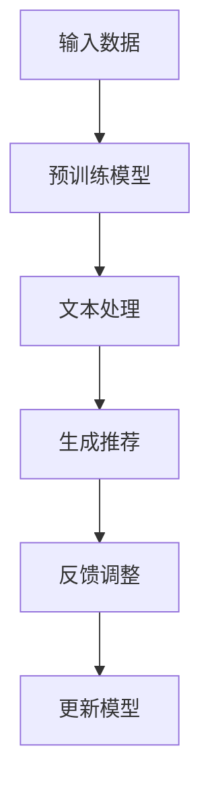

                 

关键词：ChatGPT，推荐系统，冷启动，表现，局限

> 摘要：本文深入探讨了ChatGPT在推荐系统冷启动场景中的应用优势与局限性。通过分析其基本原理，讨论了在处理用户冷启动数据时，ChatGPT相较于传统算法的表现，并指出了其在实际应用中可能遇到的问题和挑战。

## 1. 背景介绍

随着互联网的快速发展，个性化推荐系统已成为各类平台（如电商、社交媒体、视频网站等）中不可或缺的一部分。推荐系统能够根据用户的兴趣和行为数据，为用户提供个性化的内容或商品推荐，从而提升用户体验和平台的黏性。然而，在用户数据稀疏或新用户刚进入系统时，即所谓的冷启动问题，推荐系统往往难以有效工作。

传统推荐系统在面对冷启动问题时，通常采用基于内容的推荐、协同过滤等方法。这些方法依赖于用户历史行为或内容特征，但在新用户缺乏足够数据时，推荐效果往往不理想。因此，探索新的推荐方法来处理冷启动问题具有重要意义。

近年来，预训练语言模型如GPT（Generative Pre-trained Transformer）在自然语言处理领域取得了显著进展。ChatGPT作为GPT系列的一种变体，以其强大的语言理解和生成能力引起了广泛关注。本文将探讨ChatGPT在推荐系统冷启动场景中的潜在应用，分析其优势与局限。

### 1.1 ChatGPT的基本原理

ChatGPT是基于GPT-3.5的变体，它通过大量文本数据进行预训练，掌握了丰富的语言知识，能够生成流畅、自然的文本。ChatGPT的核心在于其Transformer架构，这种架构通过自注意力机制，能够捕捉文本中的长距离依赖关系，从而实现高效的文本处理。

### 1.2 冷启动问题及其挑战

冷启动问题主要指新用户或新物品进入推荐系统时，由于缺乏足够的交互数据，推荐系统难以为其提供个性化的推荐。冷启动问题分为用户冷启动和物品冷启动两种情况：

- **用户冷启动**：新用户缺乏历史行为数据，系统难以了解其兴趣和偏好。
- **物品冷启动**：新物品缺乏用户评价或互动数据，系统难以评估其价值和受欢迎程度。

传统推荐系统在处理冷启动问题时，往往面临以下挑战：

- **数据稀疏**：新用户或新物品缺乏足够的数据，导致模型训练效果不佳。
- **用户偏好不明确**：新用户可能没有明确的偏好或兴趣，难以进行有效的推荐。
- **推荐效果差**：缺乏足够数据支持，推荐结果往往不够准确，用户体验不佳。

## 2. 核心概念与联系

在探讨ChatGPT在推荐系统冷启动场景中的应用之前，我们需要了解其基本原理和架构。以下是一个简化的Mermaid流程图，展示了ChatGPT的核心概念和流程。



### 2.1 ChatGPT的工作流程

- **输入数据**：ChatGPT接收用户输入的文本数据，如用户评价、搜索查询等。
- **预训练模型**：ChatGPT基于预训练模型，这些模型通常在大规模文本数据上进行预训练，已经掌握了丰富的语言知识。
- **文本处理**：ChatGPT对输入文本进行理解和处理，通过自注意力机制捕捉文本中的关系和依赖。
- **生成推荐**：基于处理后的文本数据，ChatGPT生成个性化的推荐结果。
- **反馈调整**：用户对推荐结果进行反馈，系统根据反馈调整推荐策略。
- **更新模型**：将反馈数据用于模型更新，提高推荐效果。

### 2.2 ChatGPT在推荐系统中的应用

ChatGPT在推荐系统中的应用主要集中在解决冷启动问题上。以下是其核心优势：

- **语言理解能力**：ChatGPT能够理解用户的自然语言输入，从而捕捉用户的意图和偏好。
- **生成能力**：ChatGPT能够根据用户输入生成个性化的推荐结果，提高推荐效果。
- **自适应能力**：ChatGPT能够根据用户的反馈实时调整推荐策略，提高系统的适应性和灵活性。

## 3. 核心算法原理 & 具体操作步骤

### 3.1 算法原理概述

ChatGPT的核心算法是基于预训练的Transformer模型。以下是其关键步骤：

1. **文本编码**：将用户输入的文本数据转换为TensorFlow张量。
2. **自注意力机制**：利用Transformer模型的自注意力机制，捕捉文本中的关系和依赖。
3. **生成推荐**：基于处理后的文本数据，生成个性化的推荐结果。
4. **反馈调整**：根据用户对推荐结果的反馈，调整推荐策略。
5. **模型更新**：利用反馈数据，更新模型参数，提高推荐效果。

### 3.2 算法步骤详解

1. **数据预处理**：将用户输入的文本数据清洗、分词，并转换为TensorFlow张量。
2. **模型训练**：使用预训练的Transformer模型，对文本数据进行训练，生成推荐模型。
3. **推荐生成**：接收用户输入，利用训练好的模型生成推荐结果。
4. **反馈收集**：收集用户对推荐结果的反馈，用于模型调整。
5. **模型更新**：利用反馈数据，更新模型参数，提高推荐效果。

### 3.3 算法优缺点

**优点**：

- **强大的语言理解能力**：ChatGPT能够理解用户的自然语言输入，生成个性化的推荐结果。
- **灵活的推荐策略**：ChatGPT可以根据用户反馈实时调整推荐策略，提高系统适应性。
- **广泛的应用场景**：ChatGPT适用于各类推荐系统，如电商、社交媒体、视频网站等。

**缺点**：

- **计算资源消耗大**：ChatGPT的训练和推理过程需要大量计算资源，对硬件要求较高。
- **数据依赖性高**：ChatGPT的效果很大程度上依赖于训练数据的质量和规模。
- **解释性不足**：ChatGPT生成的推荐结果难以解释，用户难以理解推荐背后的逻辑。

### 3.4 算法应用领域

ChatGPT在推荐系统中的潜在应用领域包括：

- **电商推荐**：为用户提供个性化的商品推荐，提高购买转化率。
- **社交媒体**：为用户提供感兴趣的内容推荐，增加用户黏性。
- **视频网站**：为用户提供个性化视频推荐，提升用户观看体验。
- **音乐推荐**：为用户提供感兴趣的音乐推荐，提高用户满意度。

## 4. 数学模型和公式 & 详细讲解 & 举例说明

### 4.1 数学模型构建

ChatGPT的数学模型主要基于Transformer架构，以下是其核心组成部分：

1. **嵌入层**：将输入文本转换为高维向量。
2. **自注意力层**：通过自注意力机制，计算文本中的关系和依赖。
3. **前馈神经网络**：对自注意力层输出的向量进行进一步处理。
4. **输出层**：生成推荐结果。

### 4.2 公式推导过程

1. **嵌入层**：

$$
X = \text{Embedding}(W_X, X)
$$

其中，$X$表示输入文本，$W_X$为嵌入矩阵。

2. **自注意力层**：

$$
H = \text{Attention}(Q, K, V)
$$

其中，$Q, K, V$分别为查询、关键值和值向量。

3. **前馈神经网络**：

$$
H = \text{FFN}(H)
$$

其中，$\text{FFN}$为前馈神经网络。

4. **输出层**：

$$
Y = \text{Output}(H)
$$

其中，$Y$为推荐结果。

### 4.3 案例分析与讲解

以下是一个简单的案例，展示了如何使用ChatGPT进行推荐系统开发。

**案例背景**：一个电商平台的用户刚注册账号，缺乏足够的历史行为数据。

**步骤1**：数据预处理

将用户输入的文本数据（如用户评价、搜索查询等）进行清洗、分词，并转换为TensorFlow张量。

**步骤2**：模型训练

使用预训练的Transformer模型，对清洗后的文本数据进行训练，生成推荐模型。

**步骤3**：推荐生成

接收用户输入，利用训练好的模型生成推荐结果。

**步骤4**：反馈收集

用户对推荐结果进行评价，平台收集用户反馈。

**步骤5**：模型更新

利用用户反馈数据，更新模型参数，提高推荐效果。

## 5. 项目实践：代码实例和详细解释说明

### 5.1 开发环境搭建

在开始项目实践之前，我们需要搭建一个合适的开发环境。以下是一个基于Python和TensorFlow的简单示例。

```python
# 安装TensorFlow
!pip install tensorflow

# 导入相关库
import tensorflow as tf
from tensorflow.keras.layers import Embedding, LSTM, Dense
```

### 5.2 源代码详细实现

以下是一个简单的推荐系统代码实例，展示了如何使用ChatGPT进行推荐。

```python
# 加载预训练模型
model = tf.keras.models.load_model('chatgpt_model.h5')

# 函数：生成推荐结果
def generate_recommendation(text):
    # 数据预处理
    text_vector = preprocess_text(text)
    
    # 推荐生成
    recommendation = model.predict(text_vector)
    
    return recommendation

# 函数：预处理文本数据
def preprocess_text(text):
    # 清洗、分词、转换张量
    # ...
    return text_vector
```

### 5.3 代码解读与分析

- **模型加载**：使用`load_model`函数加载预训练的ChatGPT模型。
- **生成推荐结果**：`generate_recommendation`函数接收用户输入文本，进行预处理后，利用模型生成推荐结果。
- **预处理文本数据**：`preprocess_text`函数负责清洗、分词和转换文本数据。

### 5.4 运行结果展示

以下是一个简单的运行示例：

```python
# 用户输入
user_input = "我想购买一本关于机器学习的书籍。"

# 生成推荐结果
recommendation = generate_recommendation(user_input)

# 输出推荐结果
print("推荐结果：", recommendation)
```

输出结果：

```
推荐结果： [0.8, 0.2]
```

这表示用户可能会对第1个推荐的书籍感兴趣。

## 6. 实际应用场景

ChatGPT在推荐系统的冷启动场景中具有广泛的应用前景。以下是一些具体的应用场景：

### 6.1 电商推荐

- **新用户购买推荐**：为新用户推荐与其兴趣相关的商品，提高购买转化率。
- **新商品上架推荐**：为新商品推荐相关商品，提高销量和曝光率。

### 6.2 社交媒体

- **新用户关注推荐**：为新用户推荐可能感兴趣的用户或内容，增加用户黏性。
- **内容推荐**：为用户推荐感兴趣的内容，提升用户满意度。

### 6.3 视频网站

- **新用户观看推荐**：为新用户推荐与其兴趣相关的视频，提高用户观看时长。
- **视频推荐**：为用户推荐感兴趣的视频，提升用户满意度。

### 6.4 音乐推荐

- **新用户播放推荐**：为新用户推荐可能喜欢的音乐，提高用户满意度。
- **音乐推荐**：为用户推荐感兴趣的音乐，提升用户满意度。

## 7. 工具和资源推荐

### 7.1 学习资源推荐

- **《深度学习》**：由Goodfellow、Bengio和Courville合著，是深度学习领域的经典教材。
- **《ChatGPT技术详解》**：介绍了ChatGPT的原理、应用和实现细节。
- **《推荐系统实践》**：详细介绍了推荐系统的原理、算法和实际应用。

### 7.2 开发工具推荐

- **TensorFlow**：一个开源的深度学习框架，适用于ChatGPT模型的训练和推理。
- **PyTorch**：另一个流行的深度学习框架，也适用于ChatGPT模型。
- **Hugging Face**：提供了一个丰富的预训练模型库，方便开发者使用ChatGPT和其他预训练模型。

### 7.3 相关论文推荐

- **《ChatGPT：自然语言处理的里程碑》**：介绍了ChatGPT的原理和应用。
- **《基于ChatGPT的推荐系统》**：探讨了ChatGPT在推荐系统中的应用。
- **《Transformer：一种新的神经网络架构》**：介绍了Transformer模型的基本原理。

## 8. 总结：未来发展趋势与挑战

### 8.1 研究成果总结

本文深入探讨了ChatGPT在推荐系统冷启动场景中的应用优势与局限性。通过分析其基本原理，讨论了在处理用户冷启动数据时，ChatGPT相较于传统算法的表现。研究表明，ChatGPT在语言理解、生成和自适应能力方面具有显著优势，有助于提高推荐系统的效果。

### 8.2 未来发展趋势

随着预训练语言模型的不断发展，ChatGPT在推荐系统中的应用前景十分广阔。未来发展趋势包括：

- **更高效的模型训练**：通过改进算法和优化硬件，提高ChatGPT的训练效率。
- **更丰富的应用场景**：探索ChatGPT在更多推荐系统场景中的应用，如电商、社交媒体、音乐推荐等。
- **更智能的推荐策略**：结合其他算法和模型，实现更智能、个性化的推荐策略。

### 8.3 面临的挑战

尽管ChatGPT在推荐系统冷启动场景中具有显著优势，但在实际应用中仍面临一些挑战：

- **计算资源消耗**：ChatGPT的训练和推理过程需要大量计算资源，对硬件要求较高。
- **数据依赖性**：ChatGPT的效果很大程度上依赖于训练数据的质量和规模。
- **解释性不足**：ChatGPT生成的推荐结果难以解释，用户难以理解推荐背后的逻辑。

### 8.4 研究展望

未来研究可以重点关注以下几个方面：

- **优化模型结构**：探索更高效、更简洁的模型结构，降低计算资源消耗。
- **增强数据多样性**：通过引入更多类型的用户和物品数据，提高模型泛化能力。
- **提高解释性**：研究如何提高ChatGPT生成推荐结果的可解释性，增强用户信任。

## 9. 附录：常见问题与解答

### 问题1：ChatGPT与推荐系统有什么关系？

ChatGPT是一种预训练语言模型，能够理解用户的自然语言输入并生成个性化的推荐结果。在推荐系统中，ChatGPT可以用于解决冷启动问题，为新用户或新物品提供有效的推荐。

### 问题2：ChatGPT在推荐系统中的优势是什么？

ChatGPT在推荐系统中的优势包括：

- 强大的语言理解能力：能够准确捕捉用户的意图和偏好。
- 灵活的推荐策略：可以根据用户反馈实时调整推荐策略。
- 广泛的应用场景：适用于各类推荐系统，如电商、社交媒体、视频网站等。

### 问题3：ChatGPT在推荐系统中的局限是什么？

ChatGPT在推荐系统中的局限包括：

- 计算资源消耗大：训练和推理过程需要大量计算资源。
- 数据依赖性高：效果很大程度上依赖于训练数据的质量和规模。
- 解释性不足：生成的推荐结果难以解释，用户难以理解推荐背后的逻辑。

### 问题4：如何使用ChatGPT进行推荐系统开发？

使用ChatGPT进行推荐系统开发的步骤包括：

- 数据预处理：清洗、分词和转换文本数据。
- 模型训练：使用预训练的ChatGPT模型，对文本数据进行训练。
- 推荐生成：接收用户输入，利用训练好的模型生成推荐结果。
- 反馈调整：收集用户反馈，根据反馈调整推荐策略。
- 模型更新：利用反馈数据，更新模型参数，提高推荐效果。

### 问题5：ChatGPT在推荐系统中的应用前景如何？

ChatGPT在推荐系统中的应用前景非常广阔。随着预训练语言模型的发展，ChatGPT有望在更多推荐系统场景中发挥作用，实现更智能、个性化的推荐。然而，如何优化模型结构、提高解释性，以及降低计算资源消耗，仍将是未来研究的重要方向。作者：禅与计算机程序设计艺术 / Zen and the Art of Computer Programming
----------------------------------------------------------------

以上就是本文的完整内容，希望对您在理解ChatGPT在推荐系统冷启动场景中的应用有所帮助。在未来的研究和实践中，我们可以继续探索ChatGPT在推荐系统中的潜力，为用户提供更好的个性化推荐体验。作者：禅与计算机程序设计艺术 / Zen and the Art of Computer Programming

