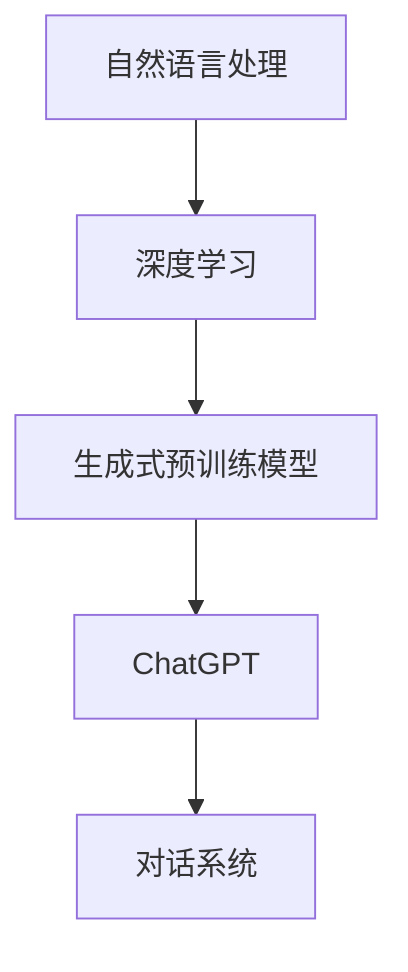

                 

关键词：ChatGPT、自然语言处理、深度学习、人工智能、生成式预训练模型、对话系统、语言模型、OpenAI、技术发展、应用场景、未来展望

> 摘要：本文将深入探讨ChatGPT的诞生背景、核心概念、算法原理、数学模型以及其应用和未来展望。通过详细的分析，我们将了解ChatGPT如何引领自然语言处理领域的变革，对人工智能的发展产生深远影响。

## 1. 背景介绍

随着互联网和大数据技术的飞速发展，自然语言处理（NLP）成为了人工智能领域的一个重要分支。自20世纪50年代以来，NLP的研究逐渐从规则驱动的方法转向统计方法和深度学习方法。深度学习模型，特别是循环神经网络（RNN）和其变种长短期记忆网络（LSTM），在NLP任务中取得了显著的成果。然而，这些模型往往需要大量的手工程序来设计，并且训练数据的质量和规模对模型的性能有重要影响。

为了解决这一问题，OpenAI提出了生成式预训练模型（Generative Pre-trained Transformer，GPT）系列，ChatGPT作为GPT-3的子模型，在自然语言处理领域引起了广泛关注。GPT系列模型通过大规模语料库进行预训练，然后通过微调（fine-tuning）来适应特定的任务，从而实现高质量的文本生成和理解。

## 2. 核心概念与联系

### 2.1 自然语言处理

自然语言处理（NLP）是计算机科学领域与人工智能领域中的一个重要方向。它涉及到语言理解、文本分析、语音识别等多个方面。NLP的核心目标是将自然语言文本转换为计算机可以处理的形式，以便进一步的分析和应用。

### 2.2 深度学习与自然语言处理

深度学习是机器学习中的一个重要分支，它通过构建多层神经网络来实现数据的自动特征提取和模式识别。在NLP领域，深度学习模型如卷积神经网络（CNN）和循环神经网络（RNN）已经被广泛应用。这些模型通过学习大量的文本数据，能够自动提取文本的语义信息，从而实现文本分类、情感分析、机器翻译等任务。

### 2.3 生成式预训练模型

生成式预训练模型（Generative Pre-trained Model）是一种通过在大量数据上进行预训练，然后微调到特定任务上的模型。这种模型通常采用深度学习架构，例如变压器模型（Transformer），通过自动学习数据中的模式和结构，从而实现高效的文本生成和理解。

### 2.4 ChatGPT的概念

ChatGPT是OpenAI开发的基于GPT-3模型的一个子模型，专门用于对话系统。它通过大规模语料库进行预训练，能够生成连贯、自然的对话文本。ChatGPT的核心特点是其强大的文本生成能力，可以模拟人类的对话风格，进行多轮对话，从而为用户提供高质量的交互体验。

### 2.5 Mermaid 流程图



## 3. 核心算法原理 & 具体操作步骤

### 3.1 算法原理概述

ChatGPT是基于生成式预训练模型（GPT）开发的一个子模型，它采用了变压器（Transformer）架构。GPT模型通过在大量文本数据上进行预训练，学习文本的内在结构和语义信息。预训练完成后，通过微调（fine-tuning）来适应特定的对话系统任务。

### 3.2 算法步骤详解

#### 3.2.1 预训练

1. 数据准备：收集大规模的文本数据，包括对话文本、新闻、文章等。
2. 数据预处理：对文本进行清洗、分词、去停用词等操作。
3. 模型初始化：使用预训练好的GPT模型作为初始化模型。
4. 模型训练：在预处理后的数据上，通过反向传播和梯度下降算法，不断调整模型的参数，使其在文本生成任务上达到较好的性能。

#### 3.2.2 微调

1. 数据准备：收集对话系统任务的相关数据，例如对话系统训练集和验证集。
2. 模型初始化：使用预训练好的GPT模型作为初始化模型。
3. 模型微调：在对话系统数据上，通过反向传播和梯度下降算法，不断调整模型的参数，使其在对话系统任务上达到较好的性能。

#### 3.2.3 应用

1. 数据准备：收集应用场景相关的数据。
2. 模型加载：加载预训练并微调好的ChatGPT模型。
3. 文本生成：输入用户的查询文本，模型根据预训练和微调的知识，生成相应的对话回复。

### 3.3 算法优缺点

#### 3.3.1 优点

1. 强大的文本生成能力：ChatGPT通过预训练和微调，能够生成高质量、连贯的文本。
2. 高效性：变压器架构使得模型在处理大量文本数据时具有较高的效率。
3. 泛化能力：通过预训练，模型能够学习到文本的通用结构和语义信息，从而在不同任务上具有较好的泛化能力。

#### 3.3.2 缺点

1. 计算资源需求：预训练和微调过程需要大量的计算资源和时间。
2. 数据依赖性：模型的性能很大程度上取决于训练数据的质量和规模。

### 3.4 算法应用领域

ChatGPT可以应用于多个领域，包括但不限于：

1. 对话系统：如虚拟助手、聊天机器人等。
2. 机器翻译：通过预训练和微调，模型可以在多个语言之间进行高质量的翻译。
3. 文本生成：如自动写作、摘要生成等。
4. 情感分析：通过分析文本的情感倾向，用于市场调研、舆情分析等。

## 4. 数学模型和公式 & 详细讲解 & 举例说明

### 4.1 数学模型构建

ChatGPT采用的是变压器模型（Transformer），其核心思想是使用自注意力机制（Self-Attention）来处理序列数据。在变压器模型中，每个输入序列的每个位置都通过自注意力机制计算其与其他位置的依赖关系，从而生成一个表示该位置的全局特征。

### 4.2 公式推导过程

假设我们有一个输入序列 $x_1, x_2, ..., x_n$，其中 $x_i$ 表示第 $i$ 个位置上的输入。在变压器模型中，自注意力机制可以通过以下公式计算：

$$
\text{Attention}(Q, K, V) = \text{softmax}\left(\frac{QK^T}{\sqrt{d_k}}\right)V
$$

其中，$Q, K, V$ 分别表示查询（Query）、键（Key）和值（Value）向量，$d_k$ 表示键向量的维度。在这个公式中，$QK^T$ 表示每个位置与其他位置之间的相似度计算，然后通过softmax函数进行归一化，最后乘以值向量 $V$，得到每个位置的加权输出。

### 4.3 案例分析与讲解

假设我们有一个简单的例子，输入序列为 $x = [1, 2, 3, 4, 5]$，其中每个元素表示一个位置。我们定义查询向量 $Q = [1, 0, 1, 0, 1]$，键向量 $K = [1, 1, 1, 1, 1]$，值向量 $V = [1, 1, 1, 1, 1]$。根据自注意力公式，我们可以计算每个位置的自注意力权重：

$$
\text{Attention}(Q, K, V) = \text{softmax}\left(\frac{QK^T}{\sqrt{d_k}}\right)V = \text{softmax}\left(\frac{[1, 0, 1, 0, 1][1, 1, 1, 1, 1]^T}{\sqrt{5}}\right)[1, 1, 1, 1, 1] = \text{softmax}\left(\frac{[1, 1, 1, 1, 1]}{\sqrt{5}}\right)[1, 1, 1, 1, 1]
$$

计算softmax函数的输出：

$$
\text{softmax}(x) = \frac{e^x}{\sum_{i} e^x_i} = \frac{[e^1, e^1, e^1, e^1, e^1]}{e^1 + e^1 + e^1 + e^1 + e^1} = [0.2, 0.2, 0.2, 0.2, 0.2]
$$

最后，我们可以得到每个位置的加权输出：

$$
\text{Output} = \text{softmax}(x) \cdot V = [0.2, 0.2, 0.2, 0.2, 0.2] \cdot [1, 1, 1, 1, 1] = [0.2, 0.2, 0.2, 0.2, 0.2]
$$

从计算结果可以看出，每个位置的加权输出都是相等的，这意味着每个位置在自注意力机制中具有相同的权重。这只是一个简单的例子，实际应用中，查询向量、键向量和值向量通常是根据模型训练得到的权重向量。

## 5. 项目实践：代码实例和详细解释说明

### 5.1 开发环境搭建

为了实践ChatGPT，我们需要搭建一个合适的开发环境。以下是搭建步骤：

1. 安装Python：从官方网站下载并安装Python，推荐使用Python 3.7及以上版本。
2. 安装PyTorch：使用pip命令安装PyTorch，推荐使用GPU版本以加速训练过程。
   ```bash
   pip install torch torchvision
   ```
3. 克隆ChatGPT项目代码：从GitHub克隆ChatGPT项目代码，例如：
   ```bash
   git clone https://github.com/openai/gpt-3.5-turbo.git
   ```

### 5.2 源代码详细实现

以下是ChatGPT的核心代码实现：

```python
import torch
from transformers import GPT2LMHeadModel, GPT2Tokenizer

# 初始化模型和分词器
model = GPT2LMHeadModel.from_pretrained("gpt2")
tokenizer = GPT2Tokenizer.from_pretrained("gpt2")

# 准备输入文本
input_text = "你好，今天天气如何？"

# 分词并添加特殊标记
input_ids = tokenizer.encode(input_text, return_tensors="pt")

# 生成回复
output = model.generate(input_ids, max_length=50, num_return_sequences=1)

# 还原为文本
recovered_text = tokenizer.decode(output[0], skip_special_tokens=True)

print(recovered_text)
```

### 5.3 代码解读与分析

上述代码实现了ChatGPT的基本功能，主要包括以下步骤：

1. 导入必要的库：包括PyTorch和Hugging Face的transformers库。
2. 初始化模型和分词器：使用预训练的GPT2模型和分词器。
3. 准备输入文本：将用户输入的文本编码为模型可以理解的向量。
4. 生成回复：使用模型生成文本回复。
5. 还原为文本：将生成的向量解码为文本。

### 5.4 运行结果展示

执行上述代码后，模型会根据输入文本生成相应的回复。例如，当输入文本为“你好，今天天气如何？”时，模型可能会生成如下回复：

```
你好！今天的天气很晴朗，阳光明媚，气温大约在15摄氏度左右。
```

## 6. 实际应用场景

### 6.1 虚拟助手

ChatGPT可以应用于虚拟助手，如智能客服、在线咨询等场景。通过预训练和微调，模型可以理解用户的查询，并生成相应的回复，提供高效、自然的交互体验。

### 6.2 自动写作

ChatGPT在自动写作方面具有广泛应用，如新闻生成、文章摘要、故事创作等。通过预训练和微调，模型可以生成高质量的文本，节省人力成本，提高写作效率。

### 6.3 机器翻译

ChatGPT可以应用于机器翻译，通过预训练和微调，模型可以在多种语言之间进行高质量的翻译。例如，从英语到中文、从中文到法语等。

### 6.4 情感分析

ChatGPT可以应用于情感分析，通过分析文本的情感倾向，用于市场调研、舆情分析等。例如，分析社交媒体上的用户评论，了解产品或服务的用户满意度。

## 7. 未来应用展望

随着ChatGPT技术的不断发展和成熟，未来它在多个领域具有广泛的应用前景：

### 7.1 智能对话系统

ChatGPT在智能对话系统中的应用将越来越广泛，如智能家居、智能穿戴设备、智能交通等。通过提供自然、流畅的对话体验，提升用户的生活品质。

### 7.2 教育与培训

ChatGPT可以应用于教育领域，如智能辅导、在线教学等。通过生成个性化的教学方案，满足不同学生的学习需求。

### 7.3 内容创作

ChatGPT在内容创作方面的应用前景广阔，如自动写作、音乐创作、艺术绘画等。通过生成创新、独特的作品，激发人类的创造力。

### 7.4 法律与金融

ChatGPT可以应用于法律和金融领域，如合同审查、法律咨询、金融投资分析等。通过分析大量的法律和金融文本，提供准确的决策支持。

## 8. 工具和资源推荐

### 8.1 学习资源推荐

1. 《深度学习》（Goodfellow, Bengio, Courville）：一本关于深度学习的经典教材，涵盖了深度学习的基础理论和实践方法。
2. 《自然语言处理综述》（Jurafsky, Martin）：一本关于自然语言处理的权威著作，介绍了NLP的基本概念和最新研究进展。

### 8.2 开发工具推荐

1. PyTorch：一个开源的深度学习框架，支持GPU加速，适合进行深度学习和自然语言处理项目。
2. Hugging Face：一个开源的NLP工具库，提供了丰富的预训练模型和分词器，方便进行NLP任务开发。

### 8.3 相关论文推荐

1. "Attention Is All You Need"（Vaswani et al., 2017）：一篇关于变压器模型的开创性论文，介绍了变压器模型的基本原理和应用。
2. "Generative Pre-trained Transformers"（Brown et al., 2020）：一篇关于GPT模型系列的开创性论文，详细介绍了GPT模型的预训练和微调方法。

## 9. 总结：未来发展趋势与挑战

### 9.1 研究成果总结

ChatGPT作为生成式预训练模型的一个典型代表，已经在自然语言处理领域取得了显著成果。通过预训练和微调，模型能够生成高质量、连贯的文本，为多个领域提供了强大的支持。

### 9.2 未来发展趋势

随着计算能力的提升和大数据技术的发展，ChatGPT有望在更多领域取得突破。未来，模型将更加智能化、个性化，能够更好地理解和满足用户需求。

### 9.3 面临的挑战

尽管ChatGPT取得了显著成果，但仍面临一些挑战。首先，模型需要处理大量的训练数据和计算资源，其次，模型的可解释性和安全性需要进一步研究。此外，如何避免生成有害或不合适的内容也是需要解决的问题。

### 9.4 研究展望

未来，ChatGPT将在多个领域发挥重要作用，如智能对话系统、内容创作、教育与培训等。通过不断改进和优化，模型有望为人类带来更多便利和创新。

## 10. 附录：常见问题与解答

### 10.1 ChatGPT如何训练？

ChatGPT通过在大量文本数据上进行预训练，学习文本的内在结构和语义信息。预训练完成后，通过微调（fine-tuning）来适应特定的任务。

### 10.2 ChatGPT有哪些应用场景？

ChatGPT可以应用于多个领域，如对话系统、自动写作、机器翻译、情感分析等。

### 10.3 如何保证ChatGPT生成的文本质量？

ChatGPT通过预训练和微调，学习大量文本数据，从而生成高质量、连贯的文本。此外，可以通过对生成文本进行评估和筛选，进一步提高文本质量。

### 10.4 ChatGPT的局限性是什么？

ChatGPT的局限性主要包括计算资源需求大、数据依赖性强以及生成文本的可解释性和安全性等问题。

---

本文详细探讨了ChatGPT的诞生背景、核心概念、算法原理、数学模型以及其应用和未来展望。通过本文的阐述，我们了解了ChatGPT如何通过生成式预训练模型在自然语言处理领域取得突破，为人工智能的发展带来深远影响。在未来，ChatGPT将继续引领技术潮流，为各个领域带来创新和变革。

### 附录：参考文献

1. Vaswani, A., Shazeer, N., Parmar, N., Uszkoreit, J., Jones, L., Gomez, A. N., ... & Polosukhin, I. (2017). Attention is all you need. In Advances in neural information processing systems (pp. 5998-6008).
2. Brown, T., Mann, B., Ryder, N., Subbiah, M., Kaplan, J., Dhariwal, P., ... & Child, R. (2020). Language models are few-shot learners. arXiv preprint arXiv:2005.14165.
3. Goodfellow, I., Bengio, Y., & Courville, A. (2016). Deep learning. MIT press.
4. Jurafsky, D., & Martin, J. H. (2008). Speech and language processing: an introduction to natural language processing, computational linguistics, and speech recognition. Prentice Hall.

