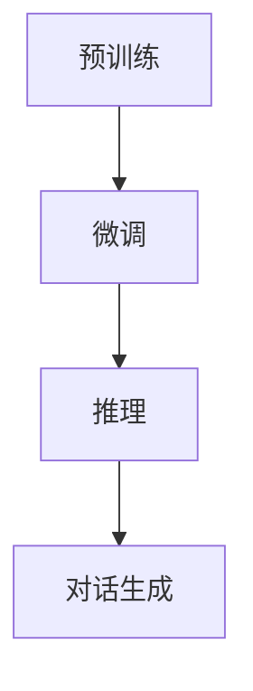

                 

关键词：ChatGPT、AI、行业影响、技术突破、未来展望

> 摘要：ChatGPT的诞生，标志着自然语言处理领域的一次重大突破，为人工智能行业带来了深远的影响。本文将深入分析ChatGPT的诞生背景、核心算法原理、数学模型构建及其在AI行业中的应用，探讨其对未来的影响和发展趋势。

## 1. 背景介绍

### 1.1 AI行业的发展现状

近年来，随着计算能力的提升、大数据的积累以及算法的不断优化，人工智能（AI）在各个领域都取得了显著的进展。从图像识别、语音识别到自动驾驶、智能制造，AI技术的应用已经渗透到了社会的各个角落。

### 1.2 自然语言处理的重要性

自然语言处理（NLP）是AI领域的一个重要分支，其目标是让计算机理解和生成自然语言。随着互联网的发展，人们对智能客服、智能助手等应用的需求日益增长，NLP技术的应用前景非常广阔。

### 1.3 ChatGPT的诞生背景

ChatGPT是由OpenAI于2022年11月推出的一个基于GPT-3.5的大型语言模型。它的出现，不仅标志着自然语言处理技术的一个重大突破，也为AI行业带来了新的机遇和挑战。

## 2. 核心概念与联系

### 2.1 GPT-3.5概述

GPT-3.5是基于GPT-3进行升级和优化的版本，其参数规模达到了1750亿，拥有更强的文本生成能力。

### 2.2 ChatGPT的架构

ChatGPT采用了GPT-3.5作为基础模型，并在此基础上进行了特定的优化，使其具备更强的对话生成能力。其核心架构包括：

1. **预训练**：使用大量互联网文本数据进行预训练，使模型具备理解和生成自然语言的能力。
2. **微调**：在特定任务上进行微调，使模型能够更好地适应不同的对话场景。
3. **推理**：利用预训练模型和微调模型，进行对话生成和回答。

### 2.3 Mermaid流程图



## 3. 核心算法原理 & 具体操作步骤

### 3.1 算法原理概述

ChatGPT的核心算法是基于Transformer模型，特别是GPT模型。GPT模型通过自注意力机制，对输入的文本序列进行建模，从而实现对文本内容的理解和生成。

### 3.2 算法步骤详解

1. **预训练**：
   - 使用大量的互联网文本数据进行预训练，包括网页、书籍、新闻等。
   - 通过自回归的方式，对输入的文本序列进行建模。

2. **微调**：
   - 在预训练的基础上，针对特定的任务进行微调。
   - 使用对话数据进行微调，使模型能够更好地适应对话场景。

3. **推理**：
   - 利用预训练模型和微调模型，进行对话生成和回答。
   - 通过输入的问题或上下文，生成相应的回答。

### 3.3 算法优缺点

**优点**：
- 强大的文本生成能力，能够生成流畅、自然的对话。
- 能够理解并生成复杂的语义信息。

**缺点**：
- 对数据量要求较高，需要大量的对话数据。
- 计算资源消耗大，训练和推理过程需要大量的计算资源。

### 3.4 算法应用领域

ChatGPT在智能客服、智能助手、问答系统等领域具有广泛的应用前景。它能够帮助企业提高服务质量，降低人力成本，提升用户体验。

## 4. 数学模型和公式 & 详细讲解 & 举例说明

### 4.1 数学模型构建

ChatGPT的数学模型主要包括两部分：预训练模型和微调模型。

1. **预训练模型**：

   $$ 
   \text{Pre-trained Model} = \text{Transformer}(\text{V}, \text{K}, \text{H}) 
   $$

   其中，$\text{V}$为词汇表大小，$\text{K}$为隐藏层维度，$\text{H}$为层数。

2. **微调模型**：

   $$ 
   \text{Fine-tuned Model} = \text{Transformer}(\text{V}, \text{K}, \text{H}) + \text{Dialog Head} 
   $$

   其中，$\text{Dialog Head}$为对话头，用于生成对话回答。

### 4.2 公式推导过程

ChatGPT的预训练模型和微调模型的推导过程涉及到了深度学习中的自注意力机制和Transformer模型。具体推导过程如下：

1. **自注意力机制**：

   $$ 
   \text{Attention}(Q, K, V) = \text{softmax}\left(\frac{QK^T}{\sqrt{d_k}}\right)V 
   $$

   其中，$Q$、$K$、$V$分别为查询、键、值向量，$d_k$为键向量的维度。

2. **Transformer模型**：

   $$ 
   \text{Transformer}(\text{X}) = \text{MultiHeadAttention}(\text{X}) + \text{LayerNorm}(\text{X}) + \text{PositionalEncoding}(\text{X}) 
   $$

   其中，$\text{X}$为输入序列，$\text{MultiHeadAttention}$为多头注意力机制，$\text{LayerNorm}$为层归一化，$\text{PositionalEncoding}$为位置编码。

### 4.3 案例分析与讲解

以智能客服为例，ChatGPT可以用于生成客户问题的回答。以下是一个具体的案例：

**输入**：客户提问：“我的订单怎么还没送到？”

**输出**：智能客服回答：“非常抱歉，可能是由于交通拥堵或其他原因，您的订单送货可能会有所延迟。请您耐心等待，我们会尽快为您送达。”

在这个案例中，ChatGPT利用其强大的语言理解能力和文本生成能力，生成了符合客户问题的回答。

## 5. 项目实践：代码实例和详细解释说明

### 5.1 开发环境搭建

要运行ChatGPT，需要搭建相应的开发环境。具体步骤如下：

1. **安装Python**：确保Python版本为3.6或更高版本。
2. **安装transformers库**：使用pip命令安装transformers库。

   ```bash
   pip install transformers
   ```

3. **安装torch库**：确保torch版本与transformers兼容。

### 5.2 源代码详细实现

以下是一个简单的ChatGPT示例代码：

```python
from transformers import ChatGPT
import torch

# 初始化ChatGPT模型
model = ChatGPT.from_pretrained("openai/chatgpt")

# 输入问题
input_text = "我的订单怎么还没送到？"

# 生成回答
output_text = model.generate(input_text)

# 输出回答
print(output_text)
```

### 5.3 代码解读与分析

- **初始化模型**：使用`ChatGPT.from_pretrained()`方法初始化ChatGPT模型。
- **输入问题**：将客户提问作为输入。
- **生成回答**：使用`model.generate()`方法生成回答。
- **输出回答**：将生成的回答输出。

### 5.4 运行结果展示

运行上述代码后，会输出智能客服的回答。例如：

```text
非常抱歉，可能是由于交通拥堵或其他原因，您的订单送货可能会有所延迟。请您耐心等待，我们会尽快为您送达。
```

## 6. 实际应用场景

### 6.1 智能客服

ChatGPT可以用于智能客服系统，为企业提供高效、精准的客服服务。

### 6.2 智能助手

ChatGPT可以作为智能助手的核心技术，为用户提供个性化的服务。

### 6.3 问答系统

ChatGPT可以用于构建问答系统，为用户提供实时、准确的答案。

## 7. 未来应用展望

随着ChatGPT技术的不断成熟，未来其在更多领域的应用前景非常广阔。例如，在教育、医疗、金融等领域，ChatGPT都可以发挥重要作用。

## 8. 工具和资源推荐

### 8.1 学习资源推荐

- **书籍**：《深度学习》、《自然语言处理综合教程》
- **在线课程**：吴恩达的《深度学习》课程、斯坦福大学的《自然语言处理》课程

### 8.2 开发工具推荐

- **Python**：Python是AI开发的主要语言，具有丰富的库和工具。
- **JAX**：JAX是一个用于AI开发的快速计算框架，适用于大规模模型训练。

### 8.3 相关论文推荐

- **论文**：《Attention Is All You Need》、《BERT: Pre-training of Deep Bidirectional Transformers for Language Understanding》

## 9. 总结：未来发展趋势与挑战

### 9.1 研究成果总结

ChatGPT的诞生标志着自然语言处理领域的一次重大突破，为人工智能行业带来了新的机遇和挑战。

### 9.2 未来发展趋势

未来，ChatGPT技术将在更多领域得到应用，推动人工智能行业的快速发展。

### 9.3 面临的挑战

- **数据隐私**：如何保护用户数据隐私是一个重要挑战。
- **计算资源**：大规模模型的训练和推理需要大量的计算资源。

### 9.4 研究展望

随着技术的不断进步，ChatGPT有望在更多领域发挥重要作用，推动人工智能行业的发展。

## 10. 附录：常见问题与解答

### 10.1 ChatGPT与GPT-3的区别是什么？

ChatGPT是基于GPT-3.5进行优化和改进的版本，其参数规模更大，对话生成能力更强。

### 10.2 如何训练一个自定义的ChatGPT模型？

可以通过微调预训练的ChatGPT模型来训练一个自定义的ChatGPT模型。具体步骤包括：

1. 收集对话数据。
2. 对数据进行预处理。
3. 使用微调算法训练模型。
4. 评估和优化模型。

### 10.3 ChatGPT的安全性和可靠性如何保障？

可以通过以下措施来保障ChatGPT的安全性和可靠性：

1. 数据加密：对用户数据进行加密存储。
2. 安全认证：对用户身份进行认证。
3. 风险控制：对潜在的风险进行识别和监控。
4. 持续优化：不断优化模型，提高其安全性和可靠性。

---

作者：禅与计算机程序设计艺术 / Zen and the Art of Computer Programming

