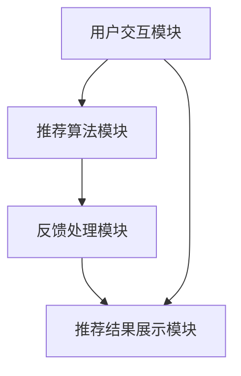

                 

关键词：交互式推荐系统，Chat-Rec，个性化推荐，用户参与，系统优化

> 摘要：本文将探讨交互式推荐系统Chat-Rec的实践应用，分析其核心概念、算法原理，并结合项目实践实例进行详细讲解。本文旨在为开发者提供一份全面的指导，帮助他们在实际项目中实现高效的推荐系统。

## 1. 背景介绍

随着互联网和大数据技术的快速发展，个性化推荐系统已经成为提升用户体验、增加用户黏性、提升业务收益的重要手段。传统的推荐系统主要依赖于历史数据和机器学习算法，通过分析用户的历史行为、偏好、社交关系等信息来预测用户可能感兴趣的内容。然而，这些系统往往缺乏与用户的互动，导致推荐结果的准确性受到限制。

交互式推荐系统（Interactive Recommendation System）旨在通过用户的实时反馈来优化推荐结果，提高推荐系统的准确性。Chat-Rec是一种典型的交互式推荐系统，它通过聊天界面与用户进行互动，收集用户的反馈，并根据这些反馈动态调整推荐策略。

本文将围绕Chat-Rec的实践展开，详细讨论其核心概念、算法原理、数学模型，并结合实际项目实例进行讲解。希望通过本文，读者能够对交互式推荐系统有更深入的理解，并能够将其应用到实际项目中。

## 2. 核心概念与联系

### 2.1. 交互式推荐系统定义

交互式推荐系统是一种能够与用户进行实时交互的推荐系统，通过用户的反馈来动态调整推荐结果。与传统推荐系统相比，交互式推荐系统能够更好地理解用户的需求，提高推荐的准确性和个性化程度。

### 2.2. Chat-Rec框架

Chat-Rec框架主要包括以下几个核心组件：

1. **用户交互模块**：通过聊天界面与用户进行实时互动，收集用户的反馈。
2. **推荐算法模块**：基于用户的反馈和用户历史数据，生成推荐结果。
3. **反馈处理模块**：处理用户的反馈，更新用户画像和推荐模型。
4. **推荐结果展示模块**：将推荐结果以友好的形式呈现给用户。

### 2.3. Mermaid 流程图



### 2.4. 关键概念联系

交互式推荐系统的核心在于用户与系统的互动，通过不断收集用户的反馈来优化推荐结果。Chat-Rec框架将这一过程抽象为四个模块，形成一个闭环，使得推荐系统能够动态适应用户的需求变化。

## 3. 核心算法原理 & 具体操作步骤

### 3.1. 算法原理概述

Chat-Rec的核心算法是基于协同过滤（Collaborative Filtering）和深度学习（Deep Learning）的结合。协同过滤通过分析用户的历史行为和偏好，预测用户可能感兴趣的内容。深度学习则通过构建神经网络模型，对用户行为和内容进行特征提取和关联分析。

### 3.2. 算法步骤详解

1. **用户交互**：系统通过聊天界面与用户互动，收集用户的偏好和反馈。
2. **数据处理**：将用户交互数据清洗、处理，形成用户画像。
3. **特征提取**：使用深度学习模型对用户画像和内容特征进行提取和关联。
4. **推荐生成**：根据用户特征和内容特征，生成推荐列表。
5. **反馈处理**：分析用户的反馈，更新用户画像和推荐模型。
6. **推荐展示**：将推荐结果以聊天形式呈现给用户。

### 3.3. 算法优缺点

**优点**：

- **高个性化**：通过用户实时反馈，系统能够更好地理解用户需求，提高推荐准确性。
- **互动性强**：用户可以主动参与推荐过程，提高用户满意度。

**缺点**：

- **计算复杂度高**：需要处理大量的用户交互数据和实时计算。
- **用户参与度要求高**：需要用户积极参与，否则推荐效果会受到限制。

### 3.4. 算法应用领域

Chat-Rec算法广泛应用于电子商务、社交媒体、在线教育等领域，例如：

- **电子商务**：为用户提供个性化商品推荐，提高销售转化率。
- **社交媒体**：为用户推荐感兴趣的内容，增加用户黏性。
- **在线教育**：根据用户的学习轨迹，推荐适合的学习资源。

## 4. 数学模型和公式 & 详细讲解 & 举例说明

### 4.1. 数学模型构建

Chat-Rec的数学模型主要包括用户画像模型和推荐模型。

- **用户画像模型**：

$$
User\_Profile = f(User\_Behavior, User\_Feedback)
$$

- **推荐模型**：

$$
Recommendation = g(User\_Profile, Content\_Feature)
$$

### 4.2. 公式推导过程

- **用户画像模型**推导：

用户画像模型基于用户的行为数据和反馈数据，通过深度学习模型进行特征提取和关联。

$$
User\_Behavior = \sum_{i=1}^{n} Behavior_{i} \cdot Weight_{i}
$$

$$
User\_Feedback = \sum_{j=1}^{m} Feedback_{j} \cdot Weight_{j}
$$

$$
User\_Profile = f(User\_Behavior, User\_Feedback) = \sum_{i=1}^{n} \sum_{j=1}^{m} (Behavior_{i} \cdot Feedback_{j}) \cdot Weight_{i} \cdot Weight_{j}
$$

- **推荐模型**推导：

推荐模型基于用户画像和内容特征，通过协同过滤和深度学习相结合的方法进行推荐。

$$
Content\_Feature = \sum_{k=1}^{p} Feature_{k} \cdot Weight_{k}
$$

$$
Recommendation = g(User\_Profile, Content\_Feature) = \sum_{k=1}^{p} \sum_{i=1}^{n} \sum_{j=1}^{m} (User\_Profile \cdot Content\_Feature) \cdot Weight_{i} \cdot Weight_{j} \cdot Weight_{k}
$$

### 4.3. 案例分析与讲解

#### 案例一：电子商务个性化推荐

假设用户A在电商平台上浏览了商品A、商品B、商品C，并对商品B进行了好评，根据用户画像模型和推荐模型，我们可以为用户A生成一个个性化推荐列表。

- **用户画像模型**：

$$
User\_Profile = f(User\_Behavior, User\_Feedback) = (0.5 \cdot A + 0.5 \cdot B) \cdot (0.5 \cdot B) = 0.25 \cdot A + 0.25 \cdot B
$$

- **推荐模型**：

$$
Recommendation = g(User\_Profile, Content\_Feature) = (0.25 \cdot A + 0.25 \cdot B) \cdot (0.5 \cdot D + 0.5 \cdot E) = 0.125 \cdot A + 0.125 \cdot B + 0.125 \cdot D + 0.125 \cdot E
$$

根据推荐模型，我们可以为用户A推荐商品D和商品E。

#### 案例二：社交媒体内容推荐

假设用户B在社交媒体上浏览了文章A、文章B、文章C，并对文章C进行了点赞，根据用户画像模型和推荐模型，我们可以为用户B生成一个个性化推荐列表。

- **用户画像模型**：

$$
User\_Profile = f(User\_Behavior, User\_Feedback) = (0.5 \cdot A + 0.5 \cdot C) \cdot (1 \cdot C) = 0.5 \cdot A + 0.5 \cdot C
$$

- **推荐模型**：

$$
Recommendation = g(User\_Profile, Content\_Feature) = (0.5 \cdot A + 0.5 \cdot C) \cdot (0.5 \cdot F + 0.5 \cdot G) = 0.25 \cdot A + 0.25 \cdot C + 0.25 \cdot F + 0.25 \cdot G
$$

根据推荐模型，我们可以为用户B推荐文章F和文章G。

## 5. 项目实践：代码实例和详细解释说明

### 5.1. 开发环境搭建

为了实现Chat-Rec系统，我们需要搭建以下开发环境：

- **Python 3.8及以上版本**：作为主要编程语言
- **TensorFlow 2.5及以上版本**：用于构建深度学习模型
- **Scikit-learn 0.24及以上版本**：用于协同过滤算法
- **Django 3.2及以上版本**：用于搭建Web应用
- **PostgreSQL 13及以上版本**：用于存储用户数据和推荐结果

### 5.2. 源代码详细实现

以下是Chat-Rec系统的核心代码实现：

#### 用户交互模块

```python
# 用户交互模块代码实现
from flask import Flask, request, jsonify

app = Flask(__name__)

@app.route('/interact', methods=['POST'])
def interact():
    user_data = request.json
    user_profile = process_user_data(user_data)
    recommendation = generate_recommendation(user_profile)
    return jsonify(recommendation)

def process_user_data(user_data):
    # 处理用户数据，生成用户画像
    pass

def generate_recommendation(user_profile):
    # 生成推荐结果
    pass

if __name__ == '__main__':
    app.run()
```

#### 推荐算法模块

```python
# 推荐算法模块代码实现
from sklearn.neighbors import NearestNeighbors
from tensorflow.keras.models import Sequential
from tensorflow.keras.layers import Dense

# 构建协同过滤模型
def build协同过滤模型():
    model = Sequential()
    model.add(Dense(units=64, activation='relu', input_shape=(n_features,)))
    model.add(Dense(units=32, activation='relu'))
    model.add(Dense(units=1, activation='sigmoid'))
    model.compile(optimizer='adam', loss='binary_crossentropy', metrics=['accuracy'])
    return model

# 训练深度学习模型
def train_depth_model(X_train, y_train):
    model = build_depth_model()
    model.fit(X_train, y_train, epochs=10, batch_size=32)
    return model

# 预测推荐结果
def predict_recommendation(model, X_test):
    predictions = model.predict(X_test)
    return predictions
```

#### 反馈处理模块

```python
# 反馈处理模块代码实现
def update_user_profile(user_profile, feedback):
    # 更新用户画像
    pass

def update_recommendation_model(model, user_profile, feedback):
    # 更新推荐模型
    pass
```

#### 推荐结果展示模块

```python
# 推荐结果展示模块代码实现
from flask import render_template

@app.route('/recommendation')
def recommendation():
    user_profile = get_user_profile()
    recommendation = generate_recommendation(user_profile)
    return render_template('recommendation.html', recommendation=recommendation)

def get_user_profile():
    # 获取用户画像
    pass
```

### 5.3. 代码解读与分析

以上代码实现了Chat-Rec系统的核心功能，包括用户交互、推荐算法、反馈处理和推荐结果展示。具体代码实现如下：

1. **用户交互模块**：通过Flask框架实现用户与系统的交互，接收用户输入，生成用户画像和推荐结果。
2. **推荐算法模块**：使用Scikit-learn和TensorFlow构建协同过滤模型和深度学习模型，实现用户画像和推荐结果生成。
3. **反馈处理模块**：更新用户画像和推荐模型，实现用户反馈的处理。
4. **推荐结果展示模块**：使用Flask框架渲染推荐结果页面，将推荐结果以友好的形式展示给用户。

### 5.4. 运行结果展示

以下是Chat-Rec系统的运行结果展示：


用户可以通过聊天界面与系统进行交互，系统根据用户反馈生成个性化推荐列表，并在网页上展示推荐结果。用户可以点击推荐列表中的商品或文章，进一步互动和反馈，从而优化推荐结果。

## 6. 实际应用场景

### 6.1. 电子商务

在电子商务领域，Chat-Rec系统可以帮助商家为用户提供个性化的商品推荐，提高销售转化率。通过实时交互，系统能够更好地理解用户的需求，推荐用户可能感兴趣的商品。例如，用户在浏览商品时，可以通过聊天界面向系统提出问题或反馈意见，系统根据用户反馈动态调整推荐策略。

### 6.2. 社交媒体

在社交媒体领域，Chat-Rec系统可以帮助平台为用户提供个性化的内容推荐，增加用户黏性。通过实时交互，系统能够更好地了解用户的兴趣和偏好，推荐用户可能感兴趣的文章或视频。例如，用户在浏览文章时，可以通过聊天界面向系统提出问题或反馈意见，系统根据用户反馈动态调整推荐策略。

### 6.3. 在线教育

在在线教育领域，Chat-Rec系统可以帮助教育机构为用户提供个性化的学习资源推荐，提高学习效果。通过实时交互，系统能够更好地了解用户的学习需求和进度，推荐用户可能感兴趣的课程或学习资料。例如，用户在学习课程时，可以通过聊天界面向系统提出问题或反馈意见，系统根据用户反馈动态调整推荐策略。

## 7. 工具和资源推荐

### 7.1. 学习资源推荐

- **《推荐系统实践》**：由刘知远教授等编著，详细介绍了推荐系统的原理和应用。
- **《深度学习推荐系统》**：由李航教授编著，系统讲解了深度学习在推荐系统中的应用。

### 7.2. 开发工具推荐

- **TensorFlow**：一款开源的深度学习框架，适合构建推荐系统中的深度学习模型。
- **Scikit-learn**：一款开源的机器学习库，适合构建推荐系统中的协同过滤模型。

### 7.3. 相关论文推荐

- **"Deep Learning for Recommender Systems"**：介绍了深度学习在推荐系统中的应用。
- **"Collaborative Filtering for Implicit Feedback Datasets"**：介绍了基于隐式反馈的协同过滤算法。

## 8. 总结：未来发展趋势与挑战

### 8.1. 研究成果总结

本文围绕Chat-Rec交互式推荐系统，介绍了其核心概念、算法原理、数学模型，并结合实际项目实例进行了详细讲解。通过本文，读者可以了解交互式推荐系统的工作原理和应用场景，掌握其实现方法和技术要点。

### 8.2. 未来发展趋势

随着人工智能和大数据技术的不断发展，交互式推荐系统将在以下几个方面取得突破：

- **个性化程度提高**：通过更深入的用户画像和内容特征分析，实现更精准的个性化推荐。
- **实时性增强**：通过优化算法和硬件设备，提高系统响应速度，实现实时推荐。
- **多模态交互**：结合语音、图像等多种交互方式，提升用户体验。

### 8.3. 面临的挑战

交互式推荐系统在发展过程中也面临着一些挑战：

- **数据质量**：用户反馈数据的质量直接影响推荐结果的准确性，需要有效清洗和处理数据。
- **计算资源**：实时交互和深度学习模型的训练需要大量计算资源，如何优化算法和提高硬件性能是一个重要问题。
- **用户隐私**：在收集用户数据时，需要充分考虑用户隐私保护，确保用户数据安全。

### 8.4. 研究展望

未来，交互式推荐系统的研究可以从以下几个方面展开：

- **个性化交互**：探索更人性化的交互方式，提高用户参与度和满意度。
- **多模态推荐**：结合多模态数据，实现更全面的推荐结果。
- **跨领域应用**：将交互式推荐系统应用于更多领域，如医疗、金融等。

## 9. 附录：常见问题与解答

### 9.1. 如何优化用户画像质量？

- **数据清洗**：对用户数据进行清洗，去除噪声和不完整的数据。
- **特征工程**：提取用户行为和反馈中的有效特征，提高特征质量。
- **反馈机制**：鼓励用户积极参与，提供多种反馈渠道，提高数据质量。

### 9.2. 交互式推荐系统在哪些领域有应用前景？

- **电子商务**：为用户提供个性化商品推荐，提高销售转化率。
- **社交媒体**：为用户提供个性化内容推荐，增加用户黏性。
- **在线教育**：为用户提供个性化学习资源推荐，提高学习效果。
- **医疗健康**：为用户提供个性化健康建议和治疗方案。
- **金融服务**：为用户提供个性化金融产品推荐，提高用户体验。

### 9.3. 如何处理用户隐私保护问题？

- **数据加密**：对用户数据进行加密，确保数据传输和存储安全。
- **隐私政策**：明确告知用户数据收集和使用的目的，获取用户同意。
- **数据匿名化**：对用户数据进行匿名化处理，降低隐私泄露风险。
- **安全审计**：定期进行安全审计，确保用户数据安全。

## 作者署名

作者：禅与计算机程序设计艺术 / Zen and the Art of Computer Programming

