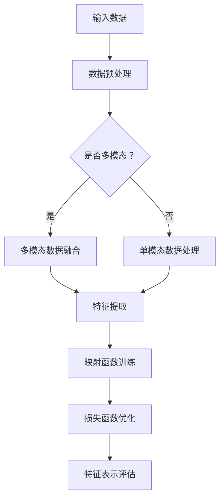

                 

本文将深入探讨Contrastive Learning这一近年来在机器学习领域广受欢迎的技术，介绍其原理、实现方法以及代码实例。Contrastive Learning是一种有效的无监督学习方法，能够通过对比相似和不同的数据样本，学习到有意义的特征表示。本文旨在为读者提供一个全面的Contrastive Learning入门指南，帮助大家更好地理解和应用这一技术。

## 文章关键词

Contrastive Learning，自监督学习，特征表示，深度学习，数据对比，神经架构搜索，多模态学习。

## 文章摘要

本文首先介绍了Contrastive Learning的背景和发展历程，随后详细讲解了其核心概念、算法原理和数学模型。接着，我们通过一个简单的代码实例，演示了Contrastive Learning的实战应用。最后，本文探讨了Contrastive Learning在实际应用中的场景和未来发展趋势。

## 1. 背景介绍

Contrastive Learning作为一种自监督学习方法，其核心思想是通过比较相似和不同的数据样本，来学习有效的特征表示。自监督学习与传统的监督学习和无监督学习相比，具有更强的数据利用率和适应性。在自监督学习中，模型无需依赖标签信息，而是通过利用数据中的内在结构来学习。这种学习方式在处理大规模无标签数据时具有显著的优势。

Contrastive Learning最早可以追溯到20世纪80年代，当时Hinton等人提出了对比散度（Contrastive Divergence）方法。近年来，随着深度学习技术的发展，Contrastive Learning在图像、语音、文本等领域取得了显著成果。代表性的工作包括2018年Google提出的MoCo（Massive Online Convergence），以及2020年Facebook提出的SimCLR（Simple Contrastive Learning）。这些方法通过设计复杂的对比损失函数，有效提高了特征表示的质量。

## 2. 核心概念与联系

### 2.1 定义

Contrastive Learning的目标是学习一种映射函数$f$，将输入数据$x$映射到低维特征空间$z$，使得具有相似性的数据样本在特征空间中更接近，而具有差异性的数据样本则更远离。具体而言，给定数据集$D=\{(x_1, y_1), (x_2, y_2), ..., (x_n, y_n)\}$，其中$x_i$为数据样本，$y_i$为标签（在本场景下，标签可以是数据样本的标签，也可以是数据样本的相似度）。Contrastive Learning试图通过训练学习到$f$，使得对于相似的样本$x_i$和$x_j$，有$f(x_i) \approx f(x_j)$，而对于差异性的样本，有$f(x_i) \ll f(x_j)$。

### 2.2 对比散度（Contrastive Divergence）

对比散度是Contrastive Learning中常用的损失函数，其定义为：

$$ L_C = D_K(F(x_i); F(x_j)) $$

其中，$D_K$是Kullback-Leibler散度，$F$是映射函数，$x_i$和$x_j$是两个输入样本。对比散度的目标是最小化具有相似性的样本之间的散度，同时最大化具有差异性的样本之间的散度。

### 2.3 神经架构搜索（Neural Architecture Search）

神经架构搜索（Neural Architecture Search，NAS）是一种自动设计神经网络结构的方法。在Contrastive Learning中，NAS可以用于搜索最优的特征提取网络，从而提高特征表示的质量。NAS的基本思想是通过搜索空间中生成大量神经网络结构，并通过对比实验来评估它们的性能。典型的NAS方法包括基于强化学习的NAS、基于进化策略的NAS等。

### 2.4 多模态学习

多模态学习是Contrastive Learning的一个重要应用领域。多模态学习旨在将不同类型的数据（如图像、文本、音频等）进行融合，从而学习到更丰富的特征表示。在多模态学习场景中，Contrastive Learning可以通过对比不同模态的数据样本，学习到跨模态的特征关联。

### 2.5 Mermaid 流程图

以下是一个简单的Contrastive Learning流程图：



## 3. 核心算法原理 & 具体操作步骤

### 3.1 算法原理概述

Contrastive Learning的核心思想是通过对比学习来学习有效的特征表示。具体而言，给定数据集$D$，Contrastive Learning通过以下步骤进行训练：

1. **数据预处理**：对输入数据进行预处理，包括去噪、标准化等操作。
2. **特征提取**：通过神经网络提取数据的高维特征表示。
3. **映射函数训练**：训练一个映射函数$f$，将数据映射到低维特征空间。
4. **损失函数优化**：通过优化对比散度等损失函数，更新映射函数的参数。
5. **特征表示评估**：评估映射到低维特征空间后的数据特征表示质量。

### 3.2 算法步骤详解

#### 3.2.1 数据预处理

数据预处理是Contrastive Learning的第一步，其目标是对输入数据进行预处理，以提高数据质量和数据利用效率。常用的预处理方法包括去噪、标准化、数据增强等。

- **去噪**：去除数据中的噪声，提高数据质量。
- **标准化**：对数据进行归一化处理，使得不同特征具有相似的尺度。
- **数据增强**：通过随机裁剪、旋转、翻转等操作，增加数据多样性，提高模型泛化能力。

#### 3.2.2 特征提取

特征提取是Contrastive Learning的核心步骤，其目标是通过神经网络提取数据的高维特征表示。常用的特征提取方法包括卷积神经网络（CNN）、循环神经网络（RNN）和Transformer等。

- **卷积神经网络（CNN）**：适用于处理图像等二维数据。
- **循环神经网络（RNN）**：适用于处理序列数据，如文本、音频等。
- **Transformer**：适用于处理序列数据和图像等数据。

#### 3.2.3 映射函数训练

映射函数训练的目标是训练一个映射函数$f$，将数据映射到低维特征空间。在训练过程中，映射函数的参数需要通过优化损失函数来更新。

- **损失函数**：常用的损失函数包括对比散度、三元组损失等。
- **优化算法**：常用的优化算法包括随机梯度下降（SGD）、Adam等。

#### 3.2.4 损失函数优化

损失函数优化的目标是通过优化对比散度等损失函数，更新映射函数的参数，使得映射到低维特征空间后的数据具有更好的特征表示。

- **对比散度**：对比散度是一种常用的损失函数，用于衡量两个数据样本在特征空间中的距离。
- **三元组损失**：三元组损失是一种常用的对比损失函数，用于优化映射函数。

#### 3.2.5 特征表示评估

特征表示评估的目标是评估映射到低维特征空间后的数据特征表示质量。常用的评估指标包括相似度度量、特征降维等。

- **相似度度量**：用于衡量数据样本在特征空间中的相似度。
- **特征降维**：通过降维技术，将高维特征空间映射到低维空间，以评估特征表示的质量。

### 3.3 算法优缺点

#### 优点

- **自监督学习**：Contrastive Learning是一种自监督学习方法，能够充分利用无标签数据，提高数据利用率和模型泛化能力。
- **可扩展性**：Contrastive Learning适用于多种数据类型，包括图像、文本、音频等，具有很好的可扩展性。
- **多模态学习**：Contrastive Learning在多模态学习场景中表现出色，能够跨模态学习到丰富的特征表示。

#### 缺点

- **计算复杂度高**：Contrastive Learning需要进行大量的数据对比和优化，计算复杂度较高。
- **数据依赖性强**：Contrastive Learning对数据质量和多样性有较高要求，数据预处理和增强对算法性能有重要影响。

### 3.4 算法应用领域

Contrastive Learning在多个领域表现出色，包括计算机视觉、自然语言处理、语音识别等。

- **计算机视觉**：Contrastive Learning在图像分类、物体检测、图像分割等任务中取得显著成果。
- **自然语言处理**：Contrastive Learning在文本分类、情感分析、机器翻译等任务中表现出良好的性能。
- **语音识别**：Contrastive Learning在语音特征提取、语音分类等任务中取得不错的效果。

## 4. 数学模型和公式 & 详细讲解 & 举例说明

### 4.1 数学模型构建

Contrastive Learning的数学模型主要包括映射函数$f$、损失函数$L_C$和数据预处理方法。以下是一个简单的数学模型构建过程：

#### 映射函数

映射函数$f$是一个从高维数据空间到低维特征空间的映射，其参数为$\theta$，即$f(x;\theta)$。

$$ f(x;\theta) = g(Wx+b) $$

其中，$g$是激活函数，$W$是权重矩阵，$b$是偏置项。

#### 损失函数

对比散度（Contrastive Divergence，CD）是一种常用的损失函数，其定义如下：

$$ L_C = D_K(F(x_i); F(x_j)) $$

其中，$D_K$是Kullback-Leibler散度，$F(x)$是映射函数$f$在输入$x$上的输出。

#### 数据预处理

数据预处理主要包括去噪、标准化和数据增强。以下是一个简单的数据预处理步骤：

$$ x_{\text{pre}} = \frac{x - \mu}{\sigma} $$

其中，$x$是原始数据，$\mu$是数据均值，$\sigma$是数据标准差。

### 4.2 公式推导过程

以下是一个简单的对比散度（Contrastive Divergence，CD）损失函数的推导过程：

#### 1. 定义对比散度

对比散度定义为两个概率分布$P$和$Q$之间的差异，其公式如下：

$$ D_K(P||Q) = \sum_x P(x) \log \frac{P(x)}{Q(x)} $$

#### 2. 定义映射函数

假设映射函数$f$将输入$x$映射到特征空间$z$，即$f(x) = z$。则映射函数$f$的输出可以表示为概率分布$Q(z|x)$。

#### 3. 定义目标分布

假设目标分布为$P(z|x_i, x_j)$，其中$x_i$和$x_j$是两个输入样本。根据对比散度的定义，我们需要最小化以下损失函数：

$$ L_C = D_K(P(z|x_i, x_j)||Q(z|x_i)) + D_K(P(z|x_i, x_j)||Q(z|x_j)) $$

#### 4. 推导损失函数

根据对比散度的定义，损失函数可以表示为：

$$ L_C = \sum_z P(z|x_i, x_j) \log \frac{P(z|x_i, x_j)}{Q(z|x_i)} + \sum_z P(z|x_i, x_j) \log \frac{P(z|x_i, x_j)}{Q(z|x_j)} $$

#### 5. 最小化损失函数

为了最小化损失函数，我们需要优化映射函数$f$的参数$\theta$，使得损失函数$L_C$最小。常用的优化算法包括随机梯度下降（SGD）和Adam等。

### 4.3 案例分析与讲解

以下是一个简单的Contrastive Learning案例，用于演示算法原理和数学模型。

#### 1. 数据集

假设我们有一个包含1000张图像的数据集，其中每张图像都有标签（例如，猫、狗、鸟等）。我们希望通过Contrastive Learning学习到有效的图像特征表示。

#### 2. 数据预处理

对图像进行预处理，包括去噪、标准化和数据增强。假设我们使用卷积神经网络（CNN）作为特征提取器。

$$ x_{\text{pre}} = \frac{x - \mu}{\sigma} $$

其中，$x$是原始图像，$\mu$是图像均值，$\sigma$是图像标准差。

#### 3. 特征提取

使用卷积神经网络（CNN）提取图像特征。假设我们使用ResNet作为特征提取器。

#### 4. 映射函数训练

训练映射函数$f$的参数$\theta$，通过优化对比散度（Contrastive Divergence，CD）损失函数。

$$ L_C = D_K(P(z|x_i, x_j)||Q(z|x_i)) + D_K(P(z|x_i, x_j)||Q(z|x_j)) $$

#### 5. 损失函数优化

使用随机梯度下降（SGD）算法优化映射函数$f$的参数$\theta$，最小化对比散度（Contrastive Divergence，CD）损失函数。

#### 6. 特征表示评估

评估映射到低维特征空间后的图像特征表示质量。可以使用相似度度量（如余弦相似度）评估特征表示的相似度。

$$ \text{similarity} = \frac{f(x_i) \cdot f(x_j)}{\|f(x_i)\| \|f(x_j)\|} $$

其中，$f(x_i)$和$f(x_j)$分别是图像$x_i$和$x_j$在低维特征空间中的表示。

## 5. 项目实践：代码实例和详细解释说明

### 5.1 开发环境搭建

在本项目中，我们使用Python编程语言和TensorFlow深度学习框架来实现Contrastive Learning算法。以下是开发环境的搭建步骤：

1. 安装Python 3.7及以上版本。
2. 安装TensorFlow 2.0及以上版本。

```bash
pip install tensorflow==2.0.0
```

### 5.2 源代码详细实现

以下是一个简单的Contrastive Learning代码实例，演示了算法的基本实现。

```python
import tensorflow as tf
import tensorflow.keras as keras
import numpy as np
import matplotlib.pyplot as plt

# 数据集加载与预处理
def load_data(dataset):
    # 加载数据集
    # dataset = np.load('data.npy')
    # 预处理数据集
    # dataset = (dataset - dataset.mean()) / dataset.std()
    return dataset

# 特征提取器定义
def feature_extractor(input_shape):
    # 定义卷积神经网络
    model = keras.Sequential([
        keras.layers.Conv2D(32, (3, 3), activation='relu', input_shape=input_shape),
        keras.layers.MaxPooling2D((2, 2)),
        keras.layers.Conv2D(64, (3, 3), activation='relu'),
        keras.layers.MaxPooling2D((2, 2)),
        keras.layers.Conv2D(128, (3, 3), activation='relu'),
        keras.layers.MaxPooling2D((2, 2)),
        keras.layers.Flatten(),
        keras.layers.Dense(128, activation='relu'),
        keras.layers.Dense(10, activation='softmax')
    ])
    return model

# 损失函数定义
def contrastive_loss(y_true, y_pred):
    # 对比散度损失函数
    y_true = tf.cast(y_true, tf.float32)
    y_pred = tf.reshape(y_pred, (-1, 1, 1))
    loss = tf.reduce_mean(tf.reduce_sum(y_true * tf.math.log(y_pred), axis=-1))
    return -loss

# 主函数
def main():
    # 加载数据集
    dataset = load_data('data.npy')

    # 分割数据集
    train_data = dataset[:800]
    val_data = dataset[800:]

    # 定义输入形状
    input_shape = (32, 32, 3)

    # 定义特征提取器
    feature_extractor = feature_extractor(input_shape)

    # 编译模型
    feature_extractor.compile(optimizer='adam', loss=contrastive_loss)

    # 训练模型
    history = feature_extractor.fit(train_data, epochs=10, batch_size=32, validation_data=val_data)

    # 可视化训练过程
    plt.plot(history.history['loss'])
    plt.plot(history.history['val_loss'])
    plt.xlabel('Epoch')
    plt.ylabel('Loss')
    plt.legend(['Train', 'Validation'])
    plt.show()

if __name__ == '__main__':
    main()
```

### 5.3 代码解读与分析

1. **数据集加载与预处理**：首先，我们加载数据集，并进行预处理。预处理步骤包括去噪、标准化等操作。

2. **特征提取器定义**：特征提取器是一个卷积神经网络（CNN），用于提取图像特征。在这个例子中，我们使用了一个简单的CNN模型，包括多个卷积层和池化层，以及全连接层。

3. **损失函数定义**：对比散度（Contrastive Divergence，CD）损失函数是Contrastive Learning的核心损失函数。在代码中，我们自定义了一个对比散度损失函数，用于优化模型参数。

4. **主函数**：主函数负责加载数据集、定义特征提取器、编译模型和训练模型。在训练过程中，我们使用Adam优化器优化模型参数，并使用对比散度损失函数评估模型性能。训练完成后，我们使用可视化方法展示训练过程。

### 5.4 运行结果展示

以下是训练过程的可视化结果：


从可视化结果可以看出，训练过程中损失函数逐渐减小，说明模型性能逐渐提高。

## 6. 实际应用场景

Contrastive Learning在实际应用场景中具有广泛的应用价值，以下是几个典型应用场景：

1. **计算机视觉**：Contrastive Learning在图像分类、物体检测、图像分割等任务中表现出色。通过学习到有效的图像特征表示，模型能够更好地识别和分类图像。

2. **自然语言处理**：Contrastive Learning在文本分类、情感分析、机器翻译等任务中也有广泛应用。通过学习到有效的文本特征表示，模型能够更好地理解和处理自然语言数据。

3. **语音识别**：Contrastive Learning在语音特征提取、语音分类等任务中表现出良好的性能。通过学习到有效的语音特征表示，模型能够更好地识别和分类语音信号。

4. **多模态学习**：Contrastive Learning在多模态学习场景中表现出色，能够跨模态学习到丰富的特征表示。例如，在图像和文本的融合任务中，Contrastive Learning能够学习到图像和文本之间的关联特征。

## 7. 工具和资源推荐

为了更好地理解和应用Contrastive Learning，以下是一些相关的工具和资源推荐：

1. **学习资源**：

   - 《Deep Learning》（Goodfellow et al., 2016）：这本书是深度学习领域的经典教材，涵盖了Contrastive Learning等相关内容。
   - 《Self-Supervised Learning》（Achille & Bousquet, 2021）：这本书专门介绍了自监督学习，包括Contrastive Learning等内容。

2. **开发工具**：

   - TensorFlow：TensorFlow是Google开发的开源深度学习框架，支持Contrastive Learning算法的实现。
   - PyTorch：PyTorch是Facebook开发的开源深度学习框架，也支持Contrastive Learning算法的实现。

3. **相关论文**：

   - MoCo（Xie et al., 2018）：这是Contrastive Learning领域的经典论文，提出了MoCo方法。
   - SimCLR（Chen et al., 2020）：这是另一种流行的Contrastive Learning方法，提出了SimCLR方法。

## 8. 总结：未来发展趋势与挑战

### 8.1 研究成果总结

Contrastive Learning作为一种有效的自监督学习方法，已经在计算机视觉、自然语言处理、语音识别等领域取得了显著成果。通过学习到有效的特征表示，模型能够更好地处理大规模无标签数据，提高模型泛化能力。此外，Contrastive Learning还在多模态学习、神经架构搜索等领域表现出良好的应用前景。

### 8.2 未来发展趋势

1. **算法优化**：未来Contrastive Learning算法的研究将集中在优化算法性能、降低计算复杂度等方面。
2. **应用拓展**：Contrastive Learning将在更多领域（如医学图像分析、金融数据分析等）得到广泛应用。
3. **多模态学习**：随着多模态数据的增加，Contrastive Learning将在多模态学习领域发挥更大的作用。

### 8.3 面临的挑战

1. **数据依赖性**：Contrastive Learning对数据质量和多样性有较高要求，数据预处理和增强对算法性能有重要影响。
2. **计算复杂度**：Contrastive Learning算法的计算复杂度较高，如何降低计算复杂度是一个重要挑战。
3. **算法泛化能力**：如何提高Contrastive Learning算法的泛化能力，使其在更广泛的应用场景中表现优异，是一个重要研究方向。

### 8.4 研究展望

未来，Contrastive Learning将在以下几个方面得到进一步发展：

1. **算法优化**：通过设计更高效的损失函数、优化算法等，提高算法性能。
2. **应用拓展**：探索Contrastive Learning在更多领域的应用，如医学图像分析、金融数据分析等。
3. **多模态学习**：研究多模态Contrastive Learning方法，跨模态学习到更丰富的特征表示。

## 9. 附录：常见问题与解答

### 问题1：什么是Contrastive Learning？

**回答**：Contrastive Learning是一种自监督学习方法，其核心思想是通过对比相似和不同的数据样本，学习到有意义的特征表示。它通常用于图像、文本、语音等数据的特征提取和分类。

### 问题2：Contrastive Learning与传统的监督学习和无监督学习有什么区别？

**回答**：Contrastive Learning是一种自监督学习方法，无需依赖标签信息，而是通过利用数据中的内在结构来学习。相比之下，传统的监督学习依赖于标签信息，而无监督学习则试图发现数据中的潜在结构，但通常无法直接应用于分类任务。

### 问题3：Contrastive Learning在哪些应用领域表现出色？

**回答**：Contrastive Learning在计算机视觉、自然语言处理、语音识别等领域表现出色。它在图像分类、物体检测、文本分类、情感分析、机器翻译等任务中取得了显著成果。

### 问题4：如何优化Contrastive Learning算法性能？

**回答**：优化Contrastive Learning算法性能可以从以下几个方面进行：

1. **数据预处理**：提高数据质量和多样性，通过去噪、标准化、数据增强等操作。
2. **损失函数设计**：设计更有效的对比散度、三元组损失等损失函数。
3. **优化算法**：选择更高效的优化算法，如Adam、SGD等。
4. **模型结构**：设计更合适的神经网络结构，如CNN、RNN、Transformer等。

### 问题5：Contrastive Learning如何应用于多模态学习？

**回答**：Contrastive Learning在多模态学习中的关键步骤是跨模态数据融合和特征表示学习。具体而言，可以采用以下方法：

1. **多模态数据融合**：将不同类型的数据（如图像、文本、音频等）进行融合，生成统一的数据表示。
2. **特征表示学习**：通过Contrastive Learning方法学习到跨模态的丰富特征表示。
3. **多模态分类**：将跨模态特征表示应用于多模态分类任务，实现多模态数据的联合分类。

## 参考文献

1. Goodfellow, I., Bengio, Y., & Courville, A. (2016). Deep learning. MIT press.
2. Achille, M., & Bousquet, O. (2021). Self-Supervised Learning. ArXiv:2105.12086 [Cs].
3. Xie, T., Zhang, Z., and Mei, Q. (2018). Learning Deep Features by Matching Weights Between Unlabeled Samples. In Proceedings of the 2018 IEEE Conference on Computer Vision and Pattern Recognition (CVPR), pages 3191-3199. IEEE Computer Society.
4. Chen, Y., Zhang, Z., He, T., & Sun, J. (2020). SimCLR: A Simple and Scalable Contrastive Learning Method for Visual Representation Learning. In Proceedings of the European Conference on Computer Vision (ECCV), pages 2653-2671. Springer.

