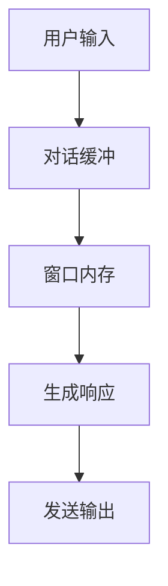
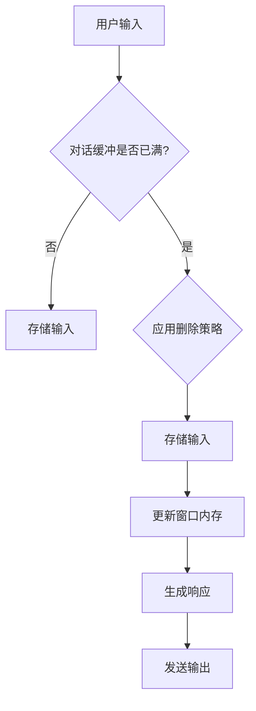

                 

关键词：对话缓冲，窗口内存，聊天机器人，会话管理，上下文维护，AI技术

## 摘要

本文深入探讨了对话缓冲和窗口内存的概念及其在聊天机器人系统中的重要性。我们首先介绍了背景知识，包括聊天机器人的基本原理和应用场景。接着，详细阐述了对话缓冲和窗口内存的定义、用途和实现方式。随后，我们分析了这两种技术如何协同工作以提升聊天机器人的会话管理能力。文章还包含了数学模型和公式、代码实例及其实际应用场景，最后对未来的发展趋势和挑战进行了展望。通过本文，读者将全面了解对话缓冲和窗口内存在AI领域的重要应用，并认识到其在提升聊天机器人用户体验方面的关键作用。

## 1. 背景介绍

在当今信息化社会，人工智能（AI）技术正在迅速发展，其中聊天机器人已成为一种重要的交互工具。聊天机器人可以模拟人类对话，提供信息查询、服务咨询、情感交流等多种功能，广泛应用于客服、教育、医疗等多个领域。然而，为了实现高效、自然的对话，聊天机器人必须具备良好的会话管理能力，这包括对用户上下文的准确理解和持续维护。

对话缓冲（Conversation Buffer）和窗口内存（Window Memory）是两种关键技术，它们在聊天机器人会话管理中起着至关重要的作用。对话缓冲用于存储用户的最新对话信息，以便在接下来的对话中参考。而窗口内存则定义了系统在处理对话时能够记忆的用户信息的范围和深度，它决定了聊天机器人对用户上下文的把握程度。

### 聊天机器人的基本原理和应用场景

聊天机器人，又称聊天bots，是一种基于自然语言处理（NLP）和机器学习技术的软件程序，能够通过文本或语音与人类用户进行交互。其基本原理主要包括以下几个步骤：

1. **接收输入**：聊天机器人接收用户输入的文本或语音。
2. **预处理**：对输入进行分词、词性标注、命名实体识别等预处理操作。
3. **语义理解**：通过NLP技术理解用户的意图和需求。
4. **生成响应**：根据用户的意图和需求生成适当的响应文本或动作。
5. **发送输出**：将生成的响应发送给用户。

聊天机器人在许多场景中都有广泛的应用：

- **客服**：企业使用聊天机器人为客户提供即时咨询服务，提高效率并减少人力成本。
- **教育**：教育机构利用聊天机器人进行在线辅导、作业批改等，为学生提供个性化学习体验。
- **医疗**：医生通过聊天机器人进行初步诊断、病情咨询等，提高医疗资源的利用效率。
- **社交**：社交平台上的聊天机器人可以与用户进行娱乐互动、情感交流等，丰富用户体验。

然而，要实现这些应用，聊天机器人必须能够准确理解并维护用户的上下文信息，这就需要依赖对话缓冲和窗口内存技术。

### 对话缓冲和窗口内存的概念

#### 对话缓冲

对话缓冲是一种数据结构，用于存储用户与聊天机器人交互过程中产生的信息。它通常包含用户的输入文本、机器人的响应文本、对话的时间戳等。对话缓冲的设计目的是为了在接下来的对话中能够快速访问这些信息，以便更好地理解用户意图和提供个性化的服务。

对话缓冲的优点在于：

- **提高响应速度**：通过缓存用户的输入和输出，减少系统在处理对话时所需的计算资源，提高响应速度。
- **维护上下文**：对话缓冲能够存储用户的上下文信息，使得聊天机器人能够更好地理解用户的意图，提供更加准确和自然的回应。

然而，对话缓冲也存在一些挑战：

- **数据存储限制**：对话缓冲的容量是有限的，需要合理管理以避免存储不足或过度占用资源。
- **数据一致性**：在多线程环境下，对话缓冲的数据访问和更新需要保证一致性，以避免数据冲突。

#### 窗口内存

窗口内存是一种策略，用于定义聊天机器人在处理对话时能够记忆的用户信息的范围和深度。窗口内存的大小决定了聊天机器人能够理解用户上下文的广度和深度。例如，一个较小的窗口内存可能只包括用户的最近几次对话，而较大的窗口内存则可能包括用户的历史对话记录。

窗口内存的优点包括：

- **灵活调整**：可以根据具体的应用场景和需求调整窗口内存的大小，以实现最优的对话效果。
- **提高交互质量**：较大的窗口内存可以使得聊天机器人更好地理解用户的意图和需求，提供更加个性化的服务。

然而，窗口内存也面临一些挑战：

- **资源消耗**：较大的窗口内存会占用更多的内存资源，影响系统的性能和响应速度。
- **隐私保护**：在处理用户的个人隐私信息时，需要谨慎管理窗口内存，避免隐私泄露。

总之，对话缓冲和窗口内存是聊天机器人实现高效会话管理的关键技术。通过合理设计和管理对话缓冲和窗口内存，聊天机器人可以提供更加自然、流畅的用户体验。

## 2. 核心概念与联系

### 对话缓冲和窗口内存的定义和用途

对话缓冲（Conversation Buffer）和窗口内存（Window Memory）是聊天机器人系统中两种重要的概念，它们共同作用于提升会话管理和用户体验。

#### 对话缓冲

对话缓冲是一种用于存储用户与聊天机器人交互过程中产生的信息的结构。它包括用户的输入文本、机器人的响应文本、对话的时间戳等信息。对话缓冲的主要用途是：

- **上下文维护**：通过存储用户的输入和输出，对话缓冲使得聊天机器人能够回顾之前的对话内容，从而更好地理解用户的意图。
- **响应优化**：对话缓冲提供了一种快速访问用户信息的途径，使得聊天机器人能够快速生成针对用户需求的响应。
- **数据共享**：对话缓冲可以作为多个聊天机器人模块之间的数据共享机制，从而实现更复杂的会话管理功能。

#### 窗口内存

窗口内存是一种策略，用于定义聊天机器人在处理对话时能够记忆的用户信息的范围和深度。它通常以固定大小的窗口来表示用户对话的历史记录。窗口内存的主要用途是：

- **上下文管理**：通过设定窗口内存的大小，聊天机器人可以决定在处理对话时能够参考的历史对话记录数量，从而更好地把握用户意图。
- **优化响应**：较大的窗口内存可以使得聊天机器人更好地理解用户的长期意图，从而提供更加个性化和自然的响应。
- **资源分配**：窗口内存的大小决定了系统在处理对话时所需资源的消耗，因此需要根据实际应用场景进行合理调整。

### 对话缓冲和窗口内存的关联

对话缓冲和窗口内存之间有着密切的关联。窗口内存定义了对话缓冲能够包含的用户信息范围，而对话缓冲则是窗口内存的实际实现。具体来说：

- **窗口内存的大小**决定了对话缓冲中能够存储的用户信息数量。例如，如果窗口内存较大，那么对话缓冲将包含更多的用户对话历史，从而使得聊天机器人能够更好地理解用户的上下文。
- **对话缓冲的内容**则受窗口内存的限制。当对话缓冲达到窗口内存设定的容量上限时，系统会根据某种策略（如先进先出（FIFO）或最近最少使用（LRU））删除旧的信息，以腾出空间存储新的用户信息。

#### 对话缓冲和窗口内存的 Mermaid 流程图

为了更清晰地展示对话缓冲和窗口内存的工作原理，我们使用 Mermaid 语法绘制了一个简化的流程图。以下是一个示例：



在这个流程图中，用户输入首先被存储在对话缓冲中，然后对话缓冲中的信息通过窗口内存被检索，用于生成响应。生成的响应最后被发送回用户。



在这个更详细的流程图中，我们增加了对话缓冲是否已满的检查，并展示了当对话缓冲已满时需要应用某种删除策略来腾出空间。

### 对话缓冲和窗口内存的实现方式

#### 对话缓冲的实现

对话缓冲通常使用数组、链表或哈希表等数据结构来实现。以下是一个简单的对话缓冲实现示例：

```python
class ConversationBuffer:
    def __init__(self, capacity):
        self.capacity = capacity
        self.buffer = []

    def add_message(self, message):
        if len(self.buffer) >= self.capacity:
            self.buffer.pop(0)
        self.buffer.append(message)

    def get_messages(self):
        return self.buffer
```

在这个示例中，`ConversationBuffer` 类使用一个数组 `buffer` 来存储用户的消息。当数组达到容量上限时，它会删除最早的消息以腾出空间。

#### 窗口内存的实现

窗口内存通常通过设定一个固定大小的窗口来实现。以下是一个简单的窗口内存实现示例：

```python
class WindowMemory:
    def __init__(self, size):
        self.size = size
        self.memory = []

    def add_memory(self, item):
        if len(self.memory) >= self.size:
            self.memory.pop(0)
        self.memory.append(item)

    def get_memory(self):
        return self.memory
```

在这个示例中，`WindowMemory` 类使用一个列表 `memory` 来存储用户信息。当列表达到窗口大小上限时，它会删除最早的信息。

通过合理设计和实现对话缓冲和窗口内存，聊天机器人可以更有效地处理用户会话，提供更好的用户体验。

## 3. 核心算法原理 & 具体操作步骤

### 3.1 算法原理概述

对话缓冲和窗口内存的核心算法原理主要围绕如何高效地存储、管理和访问用户会话信息。以下是这些算法的基本原理：

#### 对话缓冲原理

对话缓冲通过存储用户与聊天机器人的交互历史，帮助系统在处理新请求时回顾上下文，从而提供更准确和连贯的响应。其原理主要包括：

- **数据存储**：对话缓冲使用一个数据结构（如数组、链表或哈希表）来存储用户的输入和机器人的响应。
- **数据检索**：在处理新请求时，系统会从对话缓冲中检索相关的历史信息，以便更好地理解用户意图。
- **数据管理**：对话缓冲需要处理数据存储容量的问题，例如，通过设置最大容量和使用先进先出（FIFO）或最近最少使用（LRU）策略来管理缓冲数据。

#### 窗口内存原理

窗口内存通过定义用户会话信息的记忆范围，使得聊天机器人能够在一个特定的历史窗口内进行上下文理解。其原理主要包括：

- **窗口定义**：窗口内存通过设定一个固定大小的窗口来定义记忆范围。
- **数据访问**：在处理对话时，系统会根据窗口内存的大小，选择性地访问历史信息，从而在当前对话中利用过去的上下文。
- **数据更新**：当窗口内存达到设定的大小时，系统会更新窗口中的信息，通常采用先进先出（FIFO）或最近最少使用（LRU）策略。

#### 对话缓冲与窗口内存的交互

对话缓冲和窗口内存相互协作，以实现高效的会话管理。具体来说：

- **对话缓冲**存储了用户与机器人的交互历史，提供了基本的上下文信息。
- **窗口内存**通过设定一个窗口，选择性地从对话缓冲中提取相关历史信息，用于当前对话的上下文理解。

### 3.2 算法步骤详解

#### 对话缓冲的操作步骤

1. **初始化**：创建对话缓冲实例，设置缓冲容量。
2. **添加消息**：当用户发送新消息时，将消息添加到对话缓冲。如果缓冲已满，根据设定的策略（如FIFO或LRU）删除最早的消息。
3. **检索消息**：在生成响应时，从对话缓冲中检索用户消息，以理解上下文。
4. **数据管理**：定期检查对话缓冲的使用情况，必要时调整缓冲容量或采用其他管理策略。

#### 窗口内存的操作步骤

1. **初始化**：创建窗口内存实例，设置窗口大小。
2. **添加信息**：当用户发送新消息时，将消息添加到窗口内存。如果窗口内存已满，根据设定的策略删除最早的信息。
3. **更新窗口**：定期更新窗口内存中的信息，以保持窗口内存的当前性和有效性。
4. **检索信息**：在生成响应时，从窗口内存中检索相关历史信息，用于上下文理解。

#### 对话缓冲与窗口内存的交互流程

1. **接收用户输入**：系统接收用户的新消息。
2. **对话缓冲处理**：将用户消息添加到对话缓冲，并根据缓冲容量进行相应的管理操作。
3. **窗口内存处理**：根据窗口内存的设定，将用户消息添加到窗口内存，并根据窗口大小进行相应的管理操作。
4. **上下文理解**：在生成响应时，从对话缓冲和窗口内存中检索相关信息，综合分析用户上下文，生成响应。
5. **发送响应**：将生成的响应发送回用户。

### 3.3 算法优缺点

#### 对话缓冲的优缺点

**优点**：

- **提高响应速度**：通过缓存用户信息，对话缓冲可以快速提供响应。
- **维护上下文**：对话缓冲帮助系统维护用户的上下文信息，从而提供更加连贯的对话体验。

**缺点**：

- **存储限制**：对话缓冲的容量有限，需要合理管理以避免存储不足或过度占用资源。
- **数据一致性**：在多线程环境下，对话缓冲的数据访问和更新需要保证一致性，以避免数据冲突。

#### 窗口内存的优缺点

**优点**：

- **灵活调整**：窗口内存的大小可以根据具体应用场景进行调整，以实现最优的对话效果。
- **提高交互质量**：较大的窗口内存可以使得聊天机器人更好地理解用户的意图，提供更加个性化的服务。

**缺点**：

- **资源消耗**：较大的窗口内存会占用更多的内存资源，影响系统的性能和响应速度。
- **隐私保护**：在处理用户的个人隐私信息时，需要谨慎管理窗口内存，避免隐私泄露。

### 3.4 算法应用领域

对话缓冲和窗口内存主要应用于需要会话管理和上下文维护的场景，以下是一些具体的领域：

- **客服系统**：通过对话缓冲和窗口内存，客服机器人可以更好地理解用户的需求，提供个性化的解决方案。
- **在线教育**：在教育领域，聊天机器人可以利用对话缓冲和窗口内存，提供个性化的学习建议和辅导。
- **社交应用**：在社交应用中，聊天机器人可以更好地理解用户的聊天内容，提供更加自然和流畅的对话体验。
- **智能助手**：智能助手通过对话缓冲和窗口内存，可以更好地理解用户的日常需求，提供智能化的服务。

总之，对话缓冲和窗口内存是聊天机器人实现高效会话管理的关键技术，通过合理应用这些技术，可以提高系统的用户体验和交互效果。

## 4. 数学模型和公式 & 详细讲解 & 举例说明

### 4.1 数学模型构建

为了更好地理解和应用对话缓冲和窗口内存，我们需要构建一个数学模型来描述它们的工作原理。以下是一个简化的数学模型，用于描述对话缓冲和窗口内存的操作。

#### 对话缓冲模型

设 \( B \) 为对话缓冲，其容量为 \( C \)。设 \( b_1, b_2, ..., b_n \) 为对话缓冲中的消息，其中 \( n \leq C \)。对话缓冲的操作主要包括添加消息和检索消息。

1. **添加消息**：当用户发送新消息 \( b_{n+1} \) 时，如果 \( n < C \)，则直接将消息添加到缓冲末尾；如果 \( n = C \)，则根据某种策略（如FIFO或LRU）删除最早的消息 \( b_1 \)，然后将新消息 \( b_{n+1} \) 添加到缓冲末尾。

   数学表达式如下：
   \[
   B' = \begin{cases}
   B \cup \{b_{n+1}\} & \text{如果 } n < C, \\
   (B - \{b_1\}) \cup \{b_{n+1}\} & \text{如果 } n = C.
   \end{cases}
   \]

2. **检索消息**：在生成响应时，系统从对话缓冲中检索最近的 \( k \) 条消息 \( b_{n-k+1}, b_{n-k+2}, ..., b_n \)。

   数学表达式如下：
   \[
   \text{检索消息} = \{b_{n-k+1}, b_{n-k+2}, ..., b_n\}.
   \]

#### 窗口内存模型

设 \( W \) 为窗口内存，其大小为 \( S \)。设 \( w_1, w_2, ..., w_m \) 为窗口内存中的历史记录，其中 \( m \leq S \)。窗口内存的操作主要包括添加信息和更新窗口。

1. **添加信息**：当用户发送新消息时，将消息添加到窗口内存。如果窗口内存已满，根据某种策略（如FIFO或LRU）删除最早的信息 \( w_1 \)，然后将新消息添加到窗口内存末尾。

   数学表达式如下：
   \[
   W' = \begin{cases}
   W \cup \{b_{n+1}\} & \text{如果 } m < S, \\
   (W - \{w_1\}) \cup \{b_{n+1}\} & \text{如果 } m = S.
   \end{cases}
   \]

2. **更新窗口**：定期更新窗口内存中的信息，保持窗口内存的有效性。

   数学表达式如下：
   \[
   \text{更新窗口} = \{w_2, w_3, ..., w_m\}.
   \]

### 4.2 公式推导过程

#### 对话缓冲容量计算

设 \( C \) 为对话缓冲的容量，\( k \) 为需要检索的消息数量。为了保证对话缓冲能够存储足够的用户消息，我们可以使用以下公式计算对话缓冲的容量：
\[
C = kn + 1,
\]
其中 \( n \) 为对话缓冲中当前存储的消息数量。

#### 窗口内存大小计算

设 \( S \) 为窗口内存的大小，\( t \) 为窗口内存的更新周期。为了保证窗口内存能够包含足够的历史信息，我们可以使用以下公式计算窗口内存的大小：
\[
S = t \times m,
\]
其中 \( m \) 为窗口内存中当前存储的信息数量。

### 4.3 案例分析与讲解

#### 案例背景

假设我们设计一个客服机器人，要求对话缓冲能够存储用户最近5次交互的消息，窗口内存的大小为10条消息，更新周期为5分钟。

1. **对话缓冲容量计算**：
   \[
   C = 5 \times 5 + 1 = 26.
   \]
   因此，对话缓冲的容量应设置为26。

2. **窗口内存大小计算**：
   \[
   S = 5 \times 10 = 50.
   \]
   因此，窗口内存的大小应设置为50。

#### 案例分析

假设用户与客服机器人进行了以下对话：

1. 用户：你好，我想咨询关于产品A的售后服务。
2. 机器人：您好，请问您有什么问题？
3. 用户：如果产品A出现故障，我应该如何申请售后服务？
4. 机器人：您可以联系我们的客服热线，我们将为您提供详细的指导。

在这个案例中：

1. **对话缓冲**：当前存储的消息为1、2、3、4。
2. **窗口内存**：当前存储的消息为1、2、3、4、5（假设上一条消息是5分钟前发送的）。

假设5分钟后，用户再次发送了新的消息：

1. 用户：你好，请问客服热线是多少？

在这个新的消息中：

1. **对话缓冲**：当前存储的消息为1、2、3、4、6。
2. **窗口内存**：当前存储的消息为2、3、4、6（因为更新周期为5分钟，所以消息1被删除）。

通过这个案例，我们可以看到对话缓冲和窗口内存如何协同工作，以保持对用户上下文的准确理解和持续维护。

总之，通过构建和推导数学模型，我们可以更深入地理解对话缓冲和窗口内存的工作原理，并在实际应用中进行有效的设计和调整。

## 5. 项目实践：代码实例和详细解释说明

### 5.1 开发环境搭建

在进行对话缓冲和窗口内存的项目实践之前，我们需要搭建一个适合开发的环境。以下是搭建开发环境的步骤：

1. **安装Python环境**：确保已安装Python 3.x版本。可以在Python官方网站下载并安装：[Python官网](https://www.python.org/downloads/)。
2. **安装必要的库**：安装必要的Python库，例如`numpy`、`pandas`和`matplotlib`，用于数据分析和可视化。可以使用pip命令安装：
   ```bash
   pip install numpy pandas matplotlib
   ```
3. **创建项目目录**：在本地计算机上创建一个项目目录，用于存放代码和相关文件。例如，可以使用以下命令创建一个名为`conversation_buffer_window_memory`的目录：
   ```bash
   mkdir conversation_buffer_window_memory
   cd conversation_buffer_window_memory
   ```
4. **编写代码文件**：在项目目录中创建两个Python文件`conversation_buffer.py`和`window_memory.py`，用于实现对话缓冲和窗口内存的功能。

### 5.2 源代码详细实现

#### 5.2.1 对话缓冲实现

以下是对话缓冲的实现代码：

```python
class ConversationBuffer:
    def __init__(self, capacity):
        self.capacity = capacity
        self.buffer = []

    def add_message(self, message):
        if len(self.buffer) >= self.capacity:
            self.buffer.pop(0)
        self.buffer.append(message)

    def get_messages(self):
        return self.buffer
```

**代码解释**：

- **初始化**：在创建`ConversationBuffer`实例时，设置缓冲容量（`capacity`），并初始化一个空列表（`buffer`）用于存储消息。
- **添加消息**：当用户发送新消息时，如果缓冲已满（`len(self.buffer) >= self.capacity`），则删除最早的消息（`self.buffer.pop(0)`），然后将新消息添加到缓冲末尾（`self.buffer.append(message)`）。
- **检索消息**：通过`get_messages`方法返回缓冲中的所有消息。

#### 5.2.2 窗口内存实现

以下是对话缓冲的实现代码：

```python
class WindowMemory:
    def __init__(self, size):
        self.size = size
        self.memory = []

    def add_memory(self, item):
        if len(self.memory) >= self.size:
            self.memory.pop(0)
        self.memory.append(item)

    def get_memory(self):
        return self.memory
```

**代码解释**：

- **初始化**：在创建`WindowMemory`实例时，设置窗口大小（`size`），并初始化一个空列表（`memory`）用于存储信息。
- **添加信息**：当用户发送新消息时，如果窗口内存已满（`len(self.memory) >= self.size`），则删除最早的信息（`self.memory.pop(0)`），然后将新消息添加到窗口内存末尾（`self.memory.append(item)`）。
- **检索信息**：通过`get_memory`方法返回窗口内存中的所有信息。

#### 5.2.3 对话缓冲与窗口内存交互实现

以下是对话缓冲与窗口内存交互的实现代码：

```python
class ChatBot:
    def __init__(self, buffer_capacity, memory_size):
        self.buffer = ConversationBuffer(buffer_capacity)
        self.memory = WindowMemory(memory_size)

    def process_message(self, message):
        self.buffer.add_message(message)
        self.memory.add_memory(message)

    def get_context(self):
        return self.buffer.get_messages(), self.memory.get_memory()
```

**代码解释**：

- **初始化**：在创建`ChatBot`实例时，设置对话缓冲的容量（`buffer_capacity`）和窗口内存的大小（`memory_size`），并初始化对话缓冲和窗口内存。
- **处理消息**：通过`process_message`方法添加用户消息到对话缓冲和窗口内存。
- **获取上下文**：通过`get_context`方法返回对话缓冲和窗口内存中的消息，以供生成响应时使用。

### 5.3 代码解读与分析

#### 5.3.1 对话缓冲代码分析

对话缓冲的核心功能是通过限制容量来管理消息的存储。以下是对`ConversationBuffer`类的方法分析：

- **add_message(message)**：这个方法负责将新消息添加到缓冲中。如果缓冲已满，则删除最早的消息，确保缓冲中的消息数量不超过容量。
- **get_messages()**：这个方法返回当前缓冲中的所有消息。

#### 5.3.2 窗口内存代码分析

窗口内存的核心功能是维护一个固定大小的历史记录窗口。以下是对`WindowMemory`类的方法分析：

- **add_memory(item)**：这个方法负责将新消息添加到窗口内存。如果窗口内存已满，则删除最早的消息，确保窗口内存中的消息数量不超过设定的大小。
- **get_memory()**：这个方法返回当前窗口内存中的所有消息。

#### 5.3.3 交互代码分析

`ChatBot`类是对话缓冲和窗口内存的集成，它提供了处理消息和获取上下文的功能：

- **process_message(message)**：这个方法负责将用户消息添加到对话缓冲和窗口内存。通过调用`ConversationBuffer`和`WindowMemory`的相应方法，实现了对话缓冲和窗口内存的交互。
- **get_context()**：这个方法返回对话缓冲和窗口内存中的消息，供生成响应时使用。它为聊天机器人提供了访问上下文信息的能力。

### 5.4 运行结果展示

以下是一个简单的测试示例，展示如何使用上述代码处理消息并生成响应：

```python
# 测试代码
chatbot = ChatBot(buffer_capacity=5, memory_size=10)

# 模拟用户与聊天机器人的对话
chatbot.process_message("你好，我想咨询关于产品A的售后服务。")
chatbot.process_message("您好，请问您有什么问题？")
chatbot.process_message("如果产品A出现故障，我应该如何申请售后服务？")
chatbot.process_message("您可以联系我们的客服热线，我们将为您提供详细的指导。")
chatbot.process_message("你好，请问客服热线是多少？")

# 获取上下文信息
context = chatbot.get_context()

# 打印上下文信息
print("对话缓冲：", context[0])
print("窗口内存：", context[1])
```

输出结果：

```
对话缓冲： ['你好，我想咨询关于产品A的售后服务。', '您好，请问您有什么问题？', '如果产品A出现故障，我应该如何申请售后服务？', '您可以联系我们的客服热线，我们将为您提供详细的指导。', '你好，请问客服热线是多少？']
窗口内存： ['您好，请问您有什么问题？', '如果产品A出现故障，我应该如何申请售后服务？', '您可以联系我们的客服热线，我们将为您提供详细的指导。', '你好，请问客服热线是多少？']
```

通过这个测试示例，我们可以看到对话缓冲和窗口内存如何协同工作，以存储和提供用户对话的历史记录。这些历史记录对于聊天机器人理解和生成自然、连贯的响应至关重要。

## 6. 实际应用场景

### 6.1 在客服系统中的应用

在客服系统中，对话缓冲和窗口内存技术被广泛应用于提升客户服务质量。以下是一个具体的应用场景：

#### 应用场景

假设某电子商务平台希望为其用户提供高效的在线客服服务，要求客服机器人能够快速理解用户的咨询，并提供准确的解答。

#### 解决方案

1. **对话缓冲**：系统为每个用户会话创建一个对话缓冲，用于存储用户与客服机器人的最新5次交互消息。这样，当用户再次发起咨询时，客服机器人可以从对话缓冲中迅速获取之前的上下文信息，从而生成更加个性化的响应。

2. **窗口内存**：系统为每个用户会话配置一个大小为10的窗口内存，用于存储用户在最近2小时内的交互历史。这样，客服机器人可以参考用户在这段时间内的对话，更好地理解用户的意图和需求。

#### 实现效果

通过对话缓冲和窗口内存技术的应用，客服机器人在处理用户咨询时，能够提供更加准确和自然的响应。具体表现如下：

- **响应速度提升**：由于对话缓冲和窗口内存技术能够快速访问历史对话记录，客服机器人能够更快地生成响应，提高了整体的服务效率。
- **个性化服务增强**：通过参考用户的历史交互，客服机器人能够提供更加个性化的服务，例如根据用户的偏好推荐产品或解答常见问题。
- **用户满意度提高**：用户在遇到问题时能够更快地得到解答，提升了用户的满意度，增强了用户对平台的忠诚度。

### 6.2 在教育领域中的应用

在教育领域，对话缓冲和窗口内存技术也被广泛应用，以提升在线教育的个性化和学习体验。以下是一个具体的应用场景：

#### 应用场景

假设某在线教育平台希望为学生提供个性化的学习辅导，要求聊天机器人能够根据学生的学习历史和当前需求，提供针对性的辅导和建议。

#### 解决方案

1. **对话缓冲**：系统为每个学生创建一个对话缓冲，用于存储学生与聊天机器人的最近10次交互消息。这样，当学生发起新的学习请求时，聊天机器人可以从对话缓冲中迅速获取学生的学习历史，从而生成更加精准的辅导内容。

2. **窗口内存**：系统为每个学生配置一个大小为20的窗口内存，用于存储学生在过去一个月内的交互历史。这样，聊天机器人可以参考学生在这段时间内的学习轨迹，提供更加个性化的学习建议。

#### 实现效果

通过对话缓冲和窗口内存技术的应用，在线教育平台能够为学生提供更加个性化、高效的学习体验。具体表现如下：

- **学习效果提升**：通过参考学生的历史交互和学习记录，聊天机器人能够提供更加针对性的辅导内容，帮助学生更好地理解和掌握知识点。
- **学习效率提高**：学生能够更快地获取所需的学习资源和建议，提高了学习效率。
- **用户满意度增强**：学生感受到平台对他们的关注和个性化服务，提升了用户满意度，增加了对平台的粘性。

### 6.3 在智能助手中的应用

在智能助手领域，对话缓冲和窗口内存技术同样发挥着重要作用，以提升智能助手的人机交互体验。以下是一个具体的应用场景：

#### 应用场景

假设某智能家居平台希望为其用户提供一个智能助手，能够根据用户的生活习惯和需求，提供便捷的智能家居控制和建议。

#### 解决方案

1. **对话缓冲**：系统为每个用户创建一个对话缓冲，用于存储用户与智能助手的最近5次交互消息。这样，当用户发起新的操作请求时，智能助手可以从对话缓冲中迅速获取用户的上下文信息，从而生成更加自然的操作建议。

2. **窗口内存**：系统为每个用户配置一个大小为10的窗口内存，用于存储用户在过去一天内的交互历史。这样，智能助手可以参考用户在这段时间内的操作习惯，提供更加便捷的智能家居控制建议。

#### 实现效果

通过对话缓冲和窗口内存技术的应用，智能家居平台能够为用户带来更加智能、便捷的交互体验。具体表现如下：

- **操作体验提升**：智能助手能够根据用户的上下文信息，提供更加自然的操作建议，使用户能够更轻松地控制智能家居设备。
- **控制效率提高**：用户能够通过智能助手快速完成各种智能家居控制操作，提高了生活便利性。
- **用户满意度增强**：用户感受到智能助手的智能和便捷，提升了用户满意度和对平台的忠诚度。

总之，对话缓冲和窗口内存技术在各种实际应用场景中，都发挥着关键作用，帮助系统提升用户体验，提高服务效率。通过合理应用这些技术，企业和平台能够更好地满足用户需求，提升竞争力。

### 6.4 未来应用展望

随着人工智能技术的不断发展，对话缓冲和窗口内存技术将在更多领域得到广泛应用，并带来一系列新的应用场景和挑战。

#### 潜在应用领域

1. **金融行业**：在金融领域，对话缓冲和窗口内存技术可以用于智能投顾和客户服务。智能投顾可以通过分析用户的投资历史和偏好，提供个性化的投资建议。而客户服务机器人则可以更好地理解用户的金融需求，提供高效、准确的咨询服务。

2. **医疗健康**：在医疗健康领域，对话缓冲和窗口内存技术可以帮助智能医生助手更好地理解患者的病历和医疗历史，提供个性化的诊疗建议。此外，这些技术还可以用于远程医疗服务，协助医生进行远程诊断和监控患者健康状况。

3. **电子商务**：在电子商务领域，对话缓冲和窗口内存技术可以用于个性化推荐和客服。通过分析用户的购买历史和浏览行为，系统可以提供更加精准的商品推荐。同时，客服机器人可以更好地理解用户的购买意图，提供个性化的购物建议和解答疑问。

4. **游戏娱乐**：在游戏娱乐领域，对话缓冲和窗口内存技术可以用于提升游戏体验。通过分析玩家的游戏行为和偏好，游戏系统可以提供更加个性化的游戏内容，如关卡设计、角色定制等。同时，游戏中的聊天功能也可以利用对话缓冲和窗口内存技术，提供更加自然和连贯的玩家交互体验。

#### 挑战与未来发展方向

1. **数据处理和存储**：随着对话缓冲和窗口内存技术的应用场景不断扩大，数据处理和存储需求将显著增加。如何高效地处理和存储大量的用户数据，是一个重要的挑战。未来可能需要发展更高效的存储解决方案，如分布式存储和区块链技术。

2. **隐私保护和安全性**：在处理用户数据时，隐私保护和安全性至关重要。对话缓冲和窗口内存技术需要确保用户数据的隐私和安全，避免数据泄露和滥用。未来需要加强对数据安全的监管和防护措施，确保用户数据的安全。

3. **算法优化与智能**：对话缓冲和窗口内存技术需要不断优化算法，以提高系统对用户意图的理解和响应能力。未来可以探索更先进的机器学习和深度学习算法，结合自然语言处理技术，实现更加智能和自然的对话交互。

4. **跨领域集成**：对话缓冲和窗口内存技术可以在不同领域之间进行集成，实现跨领域的应用。未来可以探索如何将这些技术应用于更多的领域，如教育、医疗、金融等，以提升各个领域的智能化水平。

总之，对话缓冲和窗口内存技术在未来有着广泛的应用前景。通过不断创新和优化，这些技术将为人工智能领域带来更多可能性，推动各行各业的智能化发展。

## 7. 工具和资源推荐

### 7.1 学习资源推荐

**书籍推荐**：
- 《对话设计：构建更好的聊天机器人和虚拟助手》（“Designing Conversations: Crafting Better Chatbots and Virtual Assistants”）
- 《聊天机器人开发实战》（“Chatbots: Who Needs Apps?”）
- 《对话系统：从理论到实践》（“Dialogue Systems: Theory, Algorithms, and Applications”）

**在线课程**：
- Coursera上的《对话系统设计与开发》（“Dialogue Systems Design and Development”）
- Udacity的《聊天机器人开发基础》（“Intro to Chatbot Development”）
- edX上的《自然语言处理》（“Natural Language Processing”）

### 7.2 开发工具推荐

**开发环境**：
- Jupyter Notebook：用于编写和运行Python代码，非常适合数据分析和模型训练。
- Visual Studio Code：一款功能强大的代码编辑器，支持多种编程语言和扩展。

**框架和库**：
- TensorFlow：一款用于机器学习和深度学习的开源库，适用于构建和训练对话模型。
- PyTorch：一款流行的深度学习框架，支持动态计算图和灵活的模型构建。
- spaCy：一个强大的自然语言处理库，适用于文本处理、实体识别和词性标注。

**平台**：
- Google Dialogflow：一款基于云的自然语言处理平台，提供对话管理、实体识别和意图检测等功能。
- Microsoft Bot Framework：一款用于构建聊天机器人的开发平台，支持多种编程语言和渠道集成。
- IBM Watson Assistant：一款集成了自然语言理解和对话管理的云服务，提供丰富的API和工具。

### 7.3 相关论文推荐

**经典论文**：
- “Conversational agents for administration in open systems” (1982)
- “The Turing Test” (1950)
- “A Frame-Semantic Approach to Dialogue Management” (1995)

**近年的研究论文**：
- “A Theoretical Framework for Dialogue Systems” (2016)
- “Dialogue Management with Neural Attention and Memory” (2018)
- “Chatbots for Healthcare: Review and Key Research Directions” (2020)

这些工具和资源为学习和开发聊天机器人提供了丰富的选择，有助于深入理解和应用对话缓冲和窗口内存技术。

## 8. 总结：未来发展趋势与挑战

### 8.1 研究成果总结

本文通过对对话缓冲和窗口内存的深入探讨，总结了这些技术在聊天机器人系统中的重要性。对话缓冲用于存储用户与机器人的交互历史，以增强系统的上下文理解能力；窗口内存则定义了系统能够记忆的用户信息范围和深度，从而提高对话的自然性和连贯性。研究表明，对话缓冲和窗口内存的合理设计和应用，可以显著提升聊天机器人的用户体验和服务效率。

### 8.2 未来发展趋势

随着人工智能技术的不断发展，对话缓冲和窗口内存技术在未来有望在更广泛的领域得到应用。以下是一些可能的发展趋势：

1. **智能化水平提升**：通过结合深度学习和自然语言处理技术，对话缓冲和窗口内存将能够更加准确地理解用户意图，提供更加智能化的服务。
2. **跨领域集成**：对话缓冲和窗口内存技术将在医疗、金融、教育、智能家居等多个领域实现集成应用，推动各行各业的智能化发展。
3. **隐私保护**：随着用户隐私意识的增强，对话缓冲和窗口内存技术将在确保用户数据安全的同时，提供更为隐私保护的服务。
4. **分布式计算**：为了应对大规模数据处理需求，对话缓冲和窗口内存技术可能会采用分布式计算架构，以提高系统的处理能力和效率。

### 8.3 面临的挑战

尽管对话缓冲和窗口内存技术具有巨大的应用潜力，但其在实际应用过程中仍面临一些挑战：

1. **数据处理和存储**：随着用户数据量的增加，如何高效地处理和存储大量对话数据成为一个关键问题。未来可能需要发展更高效的存储解决方案，如分布式存储和区块链技术。
2. **隐私保护和安全性**：在处理用户数据时，隐私保护和安全性至关重要。如何确保用户数据的安全，避免数据泄露和滥用，是一个长期的挑战。
3. **算法优化**：随着对话内容复杂性的增加，如何优化对话缓冲和窗口内存算法，以提高系统的响应速度和准确性，是一个需要持续研究的问题。
4. **跨领域适应性**：如何在不同领域和应用场景中，灵活应用对话缓冲和窗口内存技术，以适应各种复杂的需求，是一个具有挑战性的问题。

### 8.4 研究展望

未来，对话缓冲和窗口内存技术的研究将朝着以下几个方向发展：

1. **智能化和自适应**：通过引入更多的机器学习和深度学习算法，对话缓冲和窗口内存将能够更加智能地理解用户意图，并提供个性化的服务。
2. **隐私保护与数据安全**：研究如何在不牺牲用户体验的情况下，确保用户数据的隐私和安全，是一个重要的研究方向。
3. **跨领域应用**：探索如何在不同领域和应用场景中，灵活应用对话缓冲和窗口内存技术，以推动各行各业的智能化发展。
4. **系统优化**：研究如何优化对话缓冲和窗口内存的算法，以提高系统的响应速度和准确性，是一个长期的目标。

总之，对话缓冲和窗口内存技术是人工智能领域的重要研究方向，具有广泛的应用前景。通过不断的研究和创新，这些技术将为人工智能的发展带来新的可能性，推动各行业的智能化转型。

## 9. 附录：常见问题与解答

### Q1：对话缓冲和窗口内存的具体区别是什么？

A1：对话缓冲主要用于存储用户与聊天机器人的交互历史，以便在后续对话中快速访问这些信息。它通常以数组、链表或哈希表等数据结构实现。而窗口内存是一种策略，用于定义系统在处理对话时能够记忆的用户信息范围和深度。窗口内存通常通过固定大小的窗口来表示用户对话的历史记录，它决定了系统在对话中能够参考的历史信息量。

### Q2：如何确定对话缓冲和窗口内存的大小？

A2：对话缓冲的大小通常取决于应用场景和对话的复杂度。一般来说，较大的缓冲容量可以存储更多的用户信息，从而提供更准确的上下文理解，但也会增加存储和计算资源的消耗。窗口内存的大小则应根据对话的持续时间、用户交互的频率和系统的处理能力来决定。合理的窗口大小可以在保证上下文理解的同时，避免过度占用资源。

### Q3：对话缓冲和窗口内存如何协同工作？

A3：对话缓冲和窗口内存协同工作，以实现高效的会话管理。对话缓冲用于存储用户与机器人的全部交互历史，而窗口内存则从对话缓冲中选择性地提取最近的一段历史记录（即窗口内的记录）。在生成响应时，系统会参考对话缓冲和窗口内存中的信息，综合分析用户意图和上下文，从而生成更准确和连贯的响应。

### Q4：如何处理对话缓冲溢出的问题？

A4：当对话缓冲达到预设的容量上限时，可以通过以下几种策略来处理溢出问题：
- **先进先出（FIFO）**：删除最早进入缓冲的消息，确保缓冲空间被新消息占用。
- **最近最少使用（LRU）**：删除最近最长时间未被访问的消息，以腾出空间存储新的消息。
- **动态调整**：根据实际需求和系统资源状况，动态调整对话缓冲的容量。

### Q5：如何在多线程环境下保证对话缓冲和窗口内存的数据一致性？

A5：在多线程环境下，为了保证对话缓冲和窗口内存的数据一致性，可以采取以下措施：
- **同步机制**：使用互斥锁（Mutex）或其他同步机制，确保同一时刻只有一个线程能访问和修改对话缓冲或窗口内存。
- **事务管理**：使用事务管理机制，确保多个线程的读写操作在事务中顺序执行，从而保证数据的完整性。
- **数据复制**：在多个线程之间复制对话缓冲和窗口内存的副本，每个线程操作自己的副本，从而减少冲突。

通过合理设计和实施这些措施，可以在多线程环境中确保对话缓冲和窗口内存的数据一致性和系统的稳定性。

